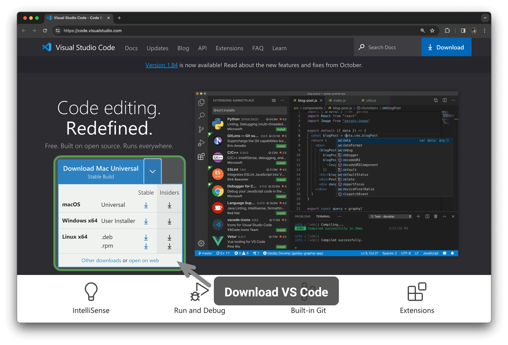

# Cài đặt môi trường lập trình

## Cài đặt IDE

Chúng tôi khuyên bạn nên sử dụng Mã VS nhẹ và nguồn mở làm môi trường phát triển tích hợp cục bộ (IDE). Truy cập [trang web chính thức của VS Code](https://code.visualstudio.com/), tải xuống và cài đặt phiên bản VS Code thích hợp theo hệ điều hành của bạn.

VS Code có một hệ sinh thái tiện ích mở rộng mạnh mẽ hỗ trợ chạy và gỡ lỗi hầu hết các ngôn ngữ lập trình. Ví dụ: sau khi cài đặt tiện ích mở rộng "Gói mở rộng Python", bạn có thể gỡ lỗi mã Python. Các bước cài đặt được thể hiện trong hình dưới đây.

## Cài đặt môi trường ngôn ngữ

### Môi trường Python

1. Tải xuống và cài đặt [Miniconda3](https://docs.conda.io/en/latest/miniconda.html) với Python 3.10 trở lên.
2. Tìm kiếm `python` trong chợ tiện ích mở rộng VS Code và cài đặt Gói mở rộng Python.
3. (Tùy chọn) Nhập `pip install black` trên dòng lệnh để cài đặt trình định dạng mã.

### Môi trường C/C++

1. Hệ thống Windows cần cài đặt [MinGW](https://sourceforge.net/projects/mingw-w64/files/) ([hướng dẫn cấu hình](https://blog.csdn.net/qq_33698226/article/details/129031241)); macOS được tích hợp sẵn Clang và không cần cài đặt.
2. Tìm kiếm `c++` trong thị trường tiện ích mở rộng VS Code và cài đặt Gói mở rộng C/C++.
3. (Tùy chọn) Mở trang Cài đặt, tìm kiếm tùy chọn định dạng mã `Clang_format_fallback Style` và đặt thành `{ BasedOnStyle: Microsoft, BreakBeforeBraces: Attach }`.

1. Tải xuống và cài đặt [OpenJDK](https://jdk.java.net/18/) (phiên bản 10 trở lên).
2. Tìm kiếm `java` trong chợ tiện ích mở rộng VS Code và cài đặt Gói mở rộng cho Java.

### Môi trường C#

1. Tải xuống và cài đặt [.NET 8.0](https://dotnet.microsoft.com/en-us/download).
2. Tìm kiếm `C# Dev Kit` trong thị trường tiện ích mở rộng VS Code và cài đặt C# Dev Kit ([hướng dẫn cấu hình](https://code.visualstudio.com/docs/csharp/get-started)).
3. Bạn cũng có thể sử dụng Visual Studio ([hướng dẫn cài đặt](https://learn.microsoft.com/zh-cn/visualstudio/install/install-visual-studio?view=vs-2022)).

### Đi môi trường

1. Tải xuống và cài đặt [Go](https://go.dev/dl/).
2. Tìm kiếm `go` trong thị trường tiện ích mở rộng VS Code và cài đặt Go.
3. Nhấn `Ctrl + Shift + P` để mở bảng lệnh, gõ `go`, chọn `Go: Install/Update Tools`, kiểm tra tất cả các tùy chọn và cài đặt.

### Môi trường Swift

1. Tải xuống và cài đặt [Swift](https://www.swift.org/download/).
2. Tìm kiếm `swift` trong thị trường tiện ích mở rộng VS Code và cài đặt [Swift for Visual Studio Code](https://marketplace.visualstudio.com/items?itemName=sswg.swift-lang).

### Môi trường JavaScript

1. Tải xuống và cài đặt [Node.js](https://nodejs.org/en/).
2. (Tùy chọn) Tìm kiếm `Prettier` trong thị trường tiện ích mở rộng VS Code và cài đặt trình định dạng mã.

### Môi trường TypeScript

1. Thực hiện theo các bước cài đặt tương tự như môi trường JavaScript.
2. Cài đặt [Thực thi TypeScript (tsx)](https://github.com/privatenumber/tsx?tab=readme-ov-file#global-installation).
3. Tìm kiếm `typescript` trong thị trường tiện ích mở rộng VS Code và cài đặt [Lỗi Pretty TypeScript](https://marketplace.visualstudio.com/items?itemName=yoavbls.pretty-ts-errors).

### Môi trường phi tiêu

1. Tải xuống và cài đặt [Dart](https://dart.dev/get-dart).
2. Tìm kiếm `dart` trong thị trường tiện ích mở rộng VS Code và cài đặt [Dart](https://marketplace.visualstudio.com/items?itemName=Dart-Code.dart-code).

### Môi trường rỉ sét

1. Tải xuống và cài đặt [Rust](https://www.rust-lang.org/tools/install).
2. Tìm kiếm `rust` trong thị trường tiện ích mở rộng VS Code và cài đặt [rust-analyzer](https://marketplace.visualstudio.com/items?itemName=rust-lang.rust-analyzer).
