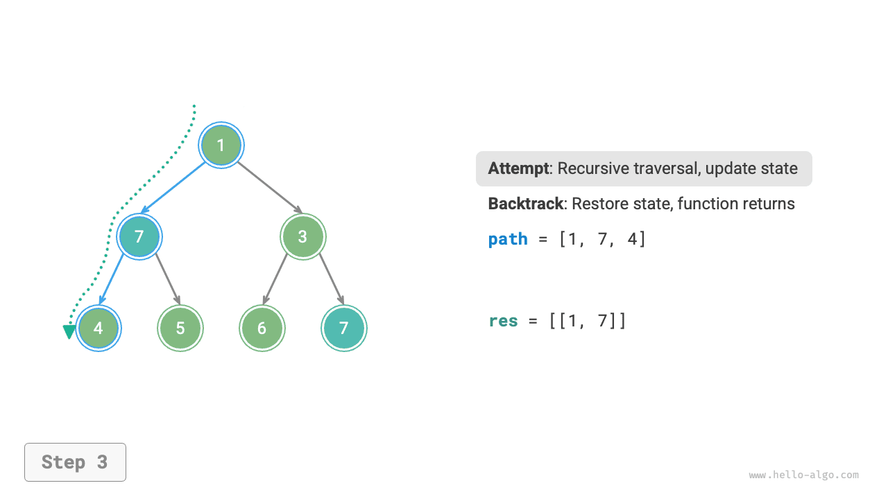
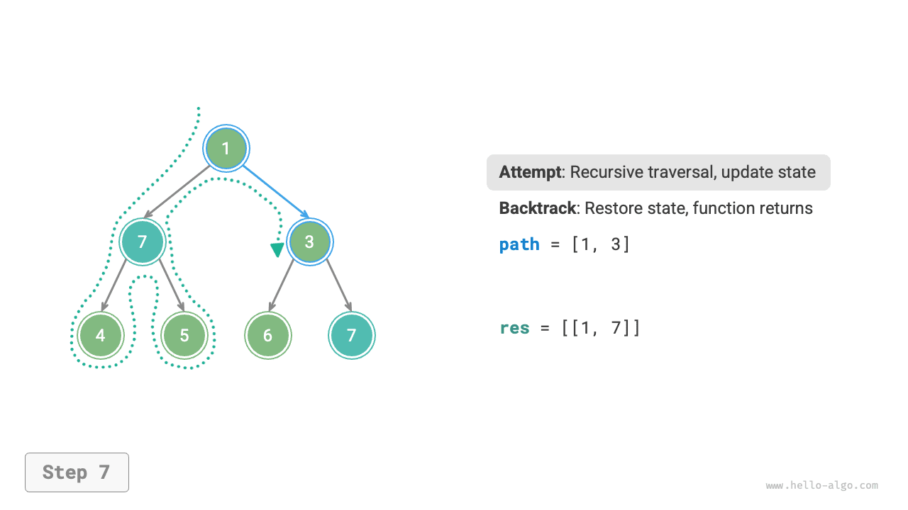
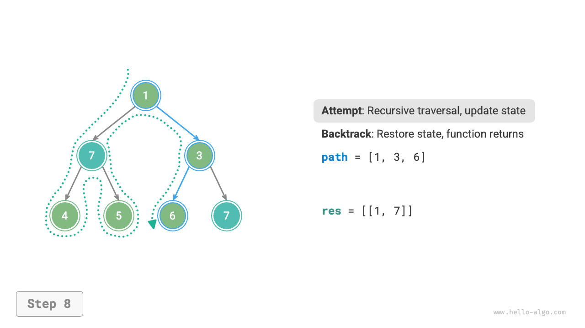
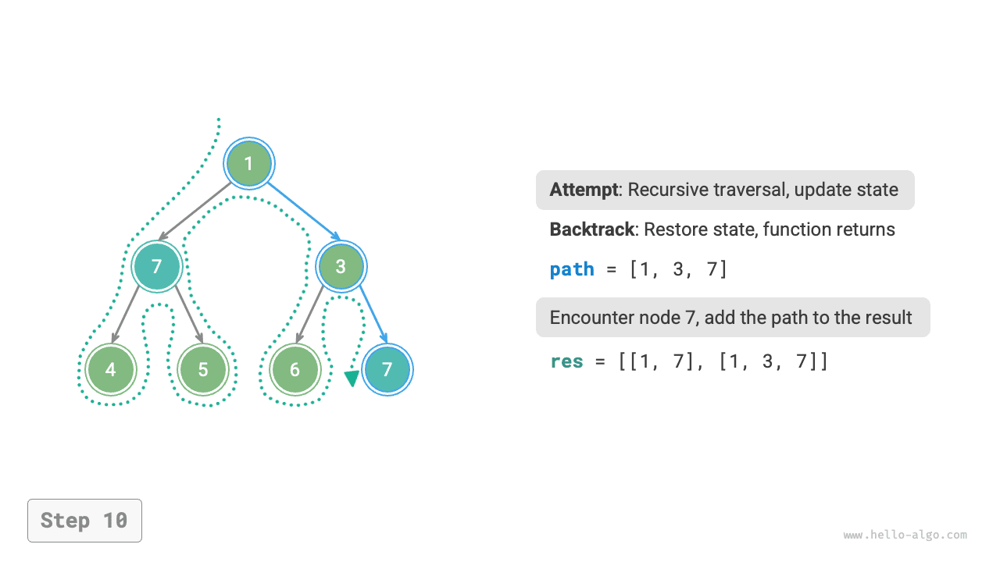
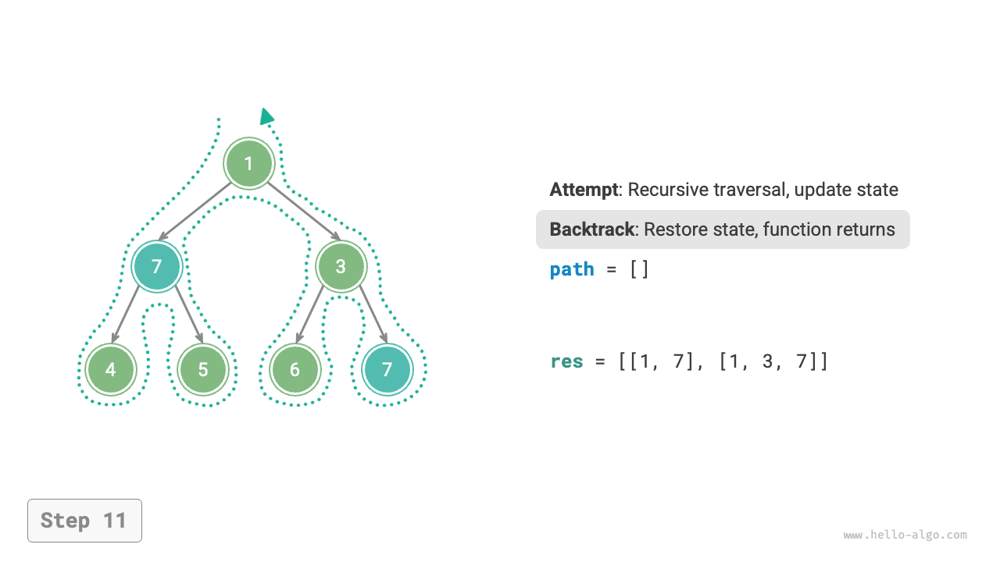
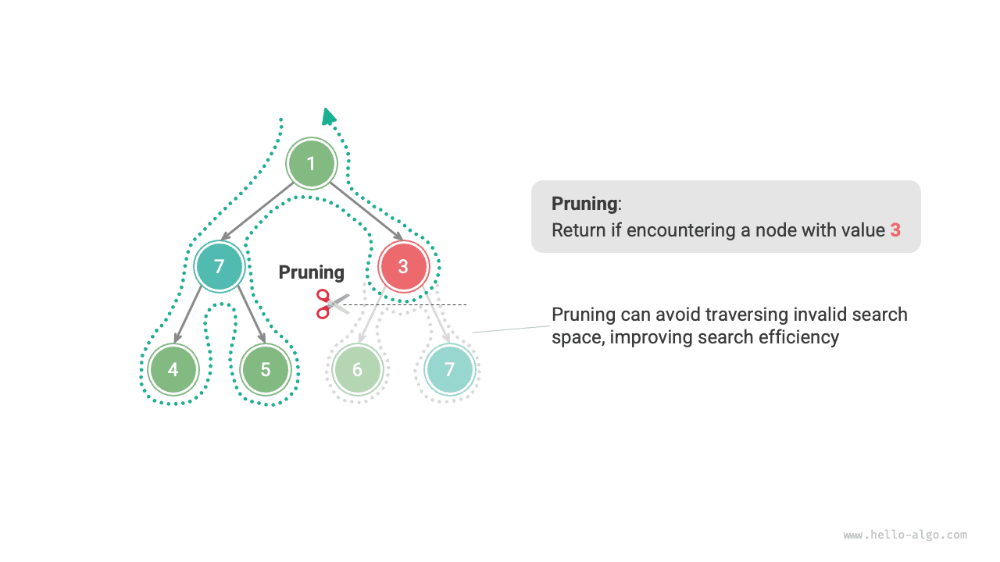
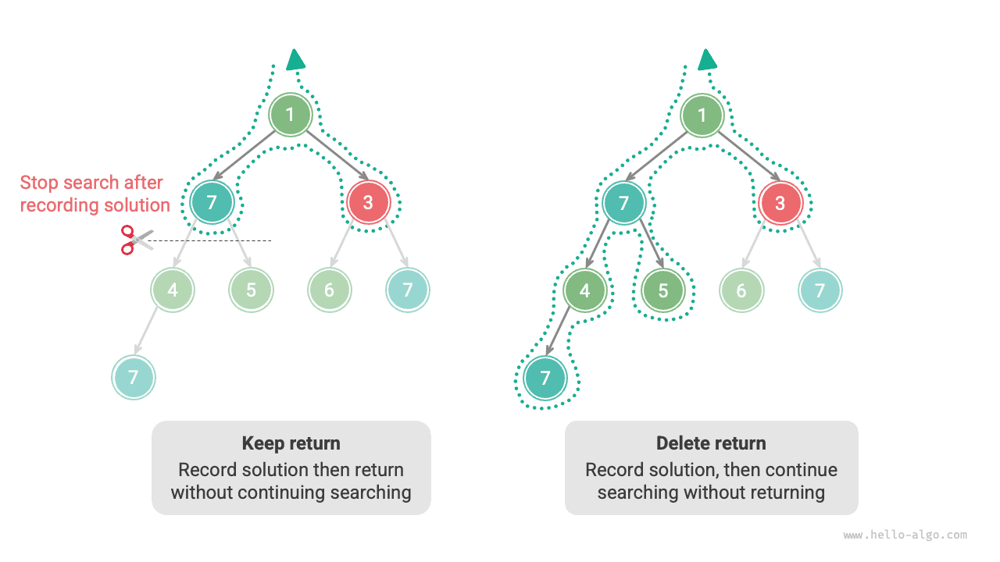

#Thuật toán quay lui

<u>The backtracking algorithm</u> is a method for solving problems through exhaustive search. Its core idea is to start from an initial state and exhaustively search all possible solutions. When a correct solution is found, it is recorded. This process continues until a solution is found or all possible choices have been tried without finding a solution.

Thuật toán quay lui thường sử dụng "tìm kiếm theo chiều sâu" để duyệt qua không gian lời giải. Trong chương "Cây nhị phân", chúng tôi đã đề cập rằng việc duyệt thứ tự trước, thứ tự thứ tự và thứ tự sau đều thuộc về tìm kiếm theo chiều sâu. Tiếp theo, chúng ta sẽ xây dựng bài toán quay lui bằng cách sử dụng phương pháp duyệt theo thứ tự trước để hiểu dần cách hoạt động của thuật toán quay lui.

!!! Câu hỏi “Ví dụ 1”

Cho một cây nhị phân, tìm kiếm và ghi lại tất cả các nút có giá trị $7$ và trả về danh sách các nút này.

Đối với vấn đề này, chúng tôi thực hiện duyệt cây theo thứ tự trước và kiểm tra xem giá trị của nút hiện tại có phải là $7$ hay không. Nếu đúng như vậy, chúng tôi thêm nút vào danh sách kết quả `res`. Việc triển khai có liên quan được thể hiện trong hình và mã sau:

```src
[file]{preorder_traversal_i_compact}-[class]{}-[func]{pre_order}
```


## Cố gắng và quay lại

**Lý do nó được gọi là thuật toán quay lui là vì nó sử dụng các chiến lược "cố gắng" và "quay lại" khi tìm kiếm không gian lời giải**. Khi thuật toán gặp trạng thái không thể tiếp tục chuyển tiếp hoặc không thể tìm ra giải pháp thỏa mãn các ràng buộc, nó sẽ hoàn tác lựa chọn trước đó, quay lại trạng thái trước đó và thử các lựa chọn khả thi khác.

Đối với Ví dụ 1, việc truy cập từng nút biểu thị một "lần thử", trong khi việc bỏ qua một nút lá hoặc `return` đưa quá trình truyền tải trở lại nút cha biểu thị một "quay ngược".

Điều đáng lưu ý là **quay lại không chỉ giới hạn ở hàm trả về**. Để minh họa điều này, hãy mở rộng Ví dụ 1 một chút.

!!! Câu hỏi “Ví dụ 2”

Trong cây nhị phân, tìm kiếm tất cả các nút có giá trị $7$, **và trả về đường dẫn từ nút gốc đến các nút này**.

Dựa trên mã từ Ví dụ 1, chúng ta cần sử dụng danh sách `path` để ghi lại đường dẫn của các nút đã truy cập. Khi chúng tôi đến một nút có giá trị $7$, chúng tôi sao chép `path` và thêm nó vào danh sách kết quả `res`. Sau khi quá trình truyền tải hoàn tất, `res` chứa tất cả các giải pháp. Mã này như sau:

```src
[file]{preorder_traversal_ii_compact}-[class]{}-[func]{pre_order}
```

Trong mỗi lần "thử", chúng tôi ghi lại đường dẫn bằng cách thêm nút hiện tại vào `path`; trước khi "quay lại", chúng ta cần xóa nút khỏi `path`, **để khôi phục trạng thái trước lần thử này**.

Quan sát quy trình được hiển thị trong hình dưới đây, **chúng ta có thể hiểu nỗ lực và quay lại là "tiến lên" và "hoàn tác"**, hai thao tác ngược lại với nhau.

=== "<1>"
    

=== "<2>"
    

=== "<3>"
    

=== "<4>"
    

=== "<5>"
    

=== "<6>"
    

=== "<7>"
    

=== "<8>"
    

=== "<9>"
    

    

=== "<11>"
    

## Cắt tỉa

Các vấn đề quay lui phức tạp thường chứa một hoặc nhiều ràng buộc. **Các ràng buộc thường có thể được sử dụng để "cắt tỉa"**.

!!! Câu hỏi “Ví dụ 3”

Trong cây nhị phân, tìm kiếm tất cả các nút có giá trị $7$ và trả về các đường dẫn từ nút gốc đến các nút này, **nhưng yêu cầu các đường dẫn đó không chứa các nút có giá trị $3$**.

Để thỏa mãn các ràng buộc trên, **chúng ta cần thêm các thao tác cắt tỉa**: trong quá trình tìm kiếm, nếu gặp nút có giá trị $3$, chúng ta quay lại sớm và không tiếp tục tìm kiếm. Mã này như sau:

```src
[file]{preorder_traversal_iii_compact}-[class]{}-[func]{pre_order}
```

"Cắt tỉa" là một thuật ngữ sống động. Như được hiển thị trong hình dưới đây, trong quá trình tìm kiếm, **chúng tôi "cắt tỉa" các nhánh tìm kiếm không thỏa mãn các ràng buộc**, tránh nhiều nỗ lực vô nghĩa và do đó cải thiện hiệu quả tìm kiếm.



## Mã khung

Tiếp theo, chúng tôi cố gắng trích xuất một khung chung tập trung vào "cố gắng, quay lại và cắt tỉa" của việc quay lại để cải thiện tính tổng quát của mã.

Trong mã khung sau đây, `state` thể hiện trạng thái hiện tại của vấn đề và `lựa chọn` thể hiện các lựa chọn có sẵn ở trạng thái hiện tại:

=== "Trăn"

    ```python title=""
    def backtrack(state: State, choices: list[choice], res: list[state]):
        """Backtracking algorithm framework"""
        # Check if it is a solution
        if is_solution(state):
            # Record the solution
            record_solution(state, res)
            # Stop searching
            return
        # Traverse all choices
        for choice in choices:
            # Pruning: check if the choice is valid
            if is_valid(state, choice):
                # Attempt: make a choice and update the state
                make_choice(state, choice)
                backtrack(state, choices, res)
                # Backtrack: undo the choice and restore to the previous state
                undo_choice(state, choice)
    ```

=== "C++"

    ```cpp title=""
    /* Backtracking algorithm framework */
    void backtrack(State *state, vector<Choice *> &choices, vector<State *> &res) {
        // Check if it is a solution
        if (isSolution(state)) {
            // Record the solution
            recordSolution(state, res);
            // Stop searching
            return;
        }
        // Traverse all choices
        for (Choice choice : choices) {
            // Pruning: check if the choice is valid
            if (isValid(state, choice)) {
                // Attempt: make a choice and update the state
                makeChoice(state, choice);
                backtrack(state, choices, res);
                // Backtrack: undo the choice and restore to the previous state
                undoChoice(state, choice);
            }
        }
    }
    ```

=== "Java"

    ```java title=""
    /* Backtracking algorithm framework */
    void backtrack(State state, List<Choice> choices, List<State> res) {
        // Check if it is a solution
        if (isSolution(state)) {
            // Record the solution
            recordSolution(state, res);
            // Stop searching
            return;
        }
        // Traverse all choices
        for (Choice choice : choices) {
            // Pruning: check if the choice is valid
            if (isValid(state, choice)) {
                // Attempt: make a choice and update the state
                makeChoice(state, choice);
                backtrack(state, choices, res);
                // Backtrack: undo the choice and restore to the previous state
                undoChoice(state, choice);
            }
        }
    }
    ```

=== "C#"

    ```csharp title=""
    /* Backtracking algorithm framework */
    void Backtrack(State state, List<Choice> choices, List<State> res) {
        // Check if it is a solution
        if (IsSolution(state)) {
            // Record the solution
            RecordSolution(state, res);
            // Stop searching
            return;
        }
        // Traverse all choices
        foreach (Choice choice in choices) {
            // Pruning: check if the choice is valid
            if (IsValid(state, choice)) {
                // Attempt: make a choice and update the state
                MakeChoice(state, choice);
                Backtrack(state, choices, res);
                // Backtrack: undo the choice and restore to the previous state
                UndoChoice(state, choice);
            }
        }
    }
    ```

=== "Đi"

    ```go title=""
    /* Backtracking algorithm framework */
    func backtrack(state *State, choices []Choice, res *[]State) {
        // Check if it is a solution
        if isSolution(state) {
            // Record the solution
            recordSolution(state, res)
            // Stop searching
            return
        }
        // Traverse all choices
        for _, choice := range choices {
            // Pruning: check if the choice is valid
            if isValid(state, choice) {
                // Attempt: make a choice and update the state
                makeChoice(state, choice)
                backtrack(state, choices, res)
                // Backtrack: undo the choice and restore to the previous state
                undoChoice(state, choice)
            }
        }
    }
    ```

=== "Nhanh chóng"

    ```swift title=""
    /* Backtracking algorithm framework */
    func backtrack(state: inout State, choices: [Choice], res: inout [State]) {
        // Check if it is a solution
        if isSolution(state: state) {
            // Record the solution
            recordSolution(state: state, res: &res)
            // Stop searching
            return
        }
        // Traverse all choices
        for choice in choices {
            // Pruning: check if the choice is valid
            if isValid(state: state, choice: choice) {
                // Attempt: make a choice and update the state
                makeChoice(state: &state, choice: choice)
                backtrack(state: &state, choices: choices, res: &res)
                // Backtrack: undo the choice and restore to the previous state
                undoChoice(state: &state, choice: choice)
            }
        }
    }
    ```

=== "JS"

    ```javascript title=""
    /* Backtracking algorithm framework */
    function backtrack(state, choices, res) {
        // Check if it is a solution
        if (isSolution(state)) {
            // Record the solution
            recordSolution(state, res);
            // Stop searching
            return;
        }
        // Traverse all choices
        for (let choice of choices) {
            // Pruning: check if the choice is valid
            if (isValid(state, choice)) {
                // Attempt: make a choice and update the state
                makeChoice(state, choice);
                backtrack(state, choices, res);
                // Backtrack: undo the choice and restore to the previous state
                undoChoice(state, choice);
            }
        }
    }
    ```

=== "TS"

    ```typescript title=""
    /* Backtracking algorithm framework */
    function backtrack(state: State, choices: Choice[], res: State[]): void {
        // Check if it is a solution
        if (isSolution(state)) {
            // Record the solution
            recordSolution(state, res);
            // Stop searching
            return;
        }
        // Traverse all choices
        for (let choice of choices) {
            // Pruning: check if the choice is valid
            if (isValid(state, choice)) {
                // Attempt: make a choice and update the state
                makeChoice(state, choice);
                backtrack(state, choices, res);
                // Backtrack: undo the choice and restore to the previous state
                undoChoice(state, choice);
            }
        }
    }
    ```

=== "Phi tiêu"

    ```dart title=""
    /* Backtracking algorithm framework */
    void backtrack(State state, List<Choice>, List<State> res) {
      // Check if it is a solution
      if (isSolution(state)) {
        // Record the solution
        recordSolution(state, res);
        // Stop searching
        return;
      }
      // Traverse all choices
      for (Choice choice in choices) {
        // Pruning: check if the choice is valid
        if (isValid(state, choice)) {
          // Attempt: make a choice and update the state
          makeChoice(state, choice);
          backtrack(state, choices, res);
          // Backtrack: undo the choice and restore to the previous state
          undoChoice(state, choice);
        }
      }
    }
    ```

=== "Rỉ sét"

    ```rust title=""
    /* Backtracking algorithm framework */
    fn backtrack(state: &mut State, choices: &Vec<Choice>, res: &mut Vec<State>) {
        // Check if it is a solution
        if is_solution(state) {
            // Record the solution
            record_solution(state, res);
            // Stop searching
            return;
        }
        // Traverse all choices
        for choice in choices {
            // Pruning: check if the choice is valid
            if is_valid(state, choice) {
                // Attempt: make a choice and update the state
                make_choice(state, choice);
                backtrack(state, choices, res);
                // Backtrack: undo the choice and restore to the previous state
                undo_choice(state, choice);
            }
        }
    }
    ```

=== "C"

    ```c title=""
    /* Backtracking algorithm framework */
    void backtrack(State *state, Choice *choices, int numChoices, State *res, int numRes) {
        // Check if it is a solution
        if (isSolution(state)) {
            // Record the solution
            recordSolution(state, res, numRes);
            // Stop searching
            return;
        }
        // Traverse all choices
        for (int i = 0; i < numChoices; i++) {
            // Pruning: check if the choice is valid
            if (isValid(state, &choices[i])) {
                // Attempt: make a choice and update the state
                makeChoice(state, &choices[i]);
                backtrack(state, choices, numChoices, res, numRes);
                // Backtrack: undo the choice and restore to the previous state
                undoChoice(state, &choices[i]);
            }
        }
    }
    ```

=== "Kotlin"

    ```kotlin title=""
    /* Backtracking algorithm framework */
    fun backtrack(state: State?, choices: List<Choice?>, res: List<State?>?) {
        // Check if it is a solution
        if (isSolution(state)) {
            // Record the solution
            recordSolution(state, res)
            // Stop searching
            return
        }
        // Traverse all choices
        for (choice in choices) {
            // Pruning: check if the choice is valid
            if (isValid(state, choice)) {
                // Attempt: make a choice and update the state
                makeChoice(state, choice)
                backtrack(state, choices, res)
                // Backtrack: undo the choice and restore to the previous state
                undoChoice(state, choice)
            }
        }
    }
    ```

=== "Ruby"

    ```ruby title=""
    ### Backtracking algorithm framework ###
    def backtrack(state, choices, res)
        # Check if it is a solution
        if is_solution?(state)
            # Record the solution
            record_solution(state, res)
            return
        end

        # Traverse all choices
        for choice in choices
            # Pruning: check if the choice is valid
            if is_valid?(state, choice)
                # Attempt: make a choice and update the state
                make_choice(state, choice)
                backtrack(state, choices, res)
                # Backtrack: undo the choice and restore to the previous state
                undo_choice(state, choice)
            end
        end
    end
    ```

Tiếp theo, chúng ta giải Ví dụ 3 dựa trên mã khung. Trạng thái `state` là đường dẫn truyền tải nút, các lựa chọn `lựa chọn` là các nút con trái và phải của nút hiện tại và kết quả `res` là danh sách các đường dẫn:

```src
[file]{preorder_traversal_iii_template}-[class]{}-[func]{backtrack}
```

Theo báo cáo vấn đề, chúng ta nên tiếp tục tìm kiếm sau khi tìm thấy nút có giá trị $7$. **Vì vậy, chúng ta cần xóa câu lệnh `return` sau khi ghi lại giải pháp**. Hình dưới đây so sánh quá trình tìm kiếm có và không có câu lệnh `return`.



So với mã dựa trên việc truyền tải theo thứ tự trước, mã dựa trên khung thuật toán quay lui có vẻ dài dòng hơn nhưng tổng quát hơn. Trên thực tế, **nhiều vấn đề quay lui có thể được giải quyết trong khuôn khổ này**. Chúng ta chỉ cần xác định `state` và `lựa chọn` cho bài toán cụ thể và triển khai từng phương thức trong framework.

## Thuật ngữ thông dụng

Để phân tích các vấn đề thuật toán rõ ràng hơn, chúng tôi tóm tắt ý nghĩa của các thuật ngữ phổ biến được sử dụng trong thuật toán quay lui và cung cấp các ví dụ tương ứng từ Ví dụ 3, như được hiển thị trong bảng sau.

<p align="center"> Table <id> &nbsp; Common Backtracking Algorithm Terminology </p>

| Kỳ hạn | Định nghĩa | Ví dụ 3 |
| ------------------------- | ----------------------------------------------------------------------------------------------------------------------------------------- | ---------------------------------------------------------------------------------- ------------------ |
| Giải pháp (giải pháp) | Lời giải là lời giải thỏa mãn những điều kiện cụ thể của một bài toán; có thể có một hoặc nhiều giải pháp | Tất cả các đường dẫn từ gốc tới các nút có giá trị $7$ thỏa mãn ràng buộc |
| Ràng buộc (ràng buộc) | Ràng buộc là một điều kiện trong bài toán làm hạn chế tính khả thi của các giải pháp, thường được sử dụng để cắt tỉa | Đường dẫn không chứa các nút có giá trị $3$ |
| Bang (tiểu bang) | Trạng thái thể hiện tình huống của một vấn đề tại một thời điểm nhất định, bao gồm cả những lựa chọn đã được thực hiện | Đường dẫn nút hiện đang truy cập, tức là danh sách các nút `path` |
| Cố gắng (cố gắng) | Nỗ lực là quá trình khám phá không gian giải pháp theo các lựa chọn có sẵn, bao gồm đưa ra lựa chọn, cập nhật trạng thái và kiểm tra xem đó có phải là giải pháp hay không | Truy cập đệ quy các nút con bên trái (phải), thêm các nút vào `path`, kiểm tra xem giá trị nút có phải là $7$ |
| Quay lui (backtracking) | Quay lui đề cập đến việc hoàn tác các lựa chọn trước đó và quay trở lại trạng thái trước đó khi gặp trạng thái không thỏa mãn các ràng buộc | Dừng tìm kiếm khi đi qua các nút lá, kết thúc lượt truy cập nút hoặc gặp các nút có giá trị $3$; hàm trả về |
| Cắt tỉa (cắt tỉa) | Cắt tỉa là một phương pháp tránh các đường dẫn tìm kiếm vô nghĩa theo đặc điểm và ràng buộc của vấn đề, có thể cải thiện hiệu quả tìm kiếm | Khi gặp nút có giá trị $3$, đừng tiếp tục tìm kiếm |

!!! mẹo

Các khái niệm về vấn đề, giải pháp, trạng thái, v.v. là phổ biến và xuất hiện trong chia để trị, quay lui, lập trình động, thuật toán tham lam, v.v.

## Ưu điểm và hạn chế

Thuật toán quay lui về cơ bản là một thuật toán tìm kiếm theo chiều sâu, thử tất cả các giải pháp có thể cho đến khi tìm thấy giải pháp thỏa mãn các điều kiện. Ưu điểm của phương pháp này là có thể tìm ra mọi giải pháp có thể và với các thao tác cắt tỉa hợp lý thì đạt hiệu quả cao.

Tuy nhiên, khi xử lý các vấn đề có quy mô lớn hoặc phức tạp, **hiệu suất chạy của thuật toán quay lui có thể không được chấp nhận**.

- **Thời gian**: Thuật toán quay lui thường cần duyệt tất cả các khả năng trong không gian trạng thái và độ phức tạp về thời gian có thể đạt tới cấp số mũ hoặc giai thừa.
- **Không gian**: Trong các cuộc gọi đệ quy, trạng thái hiện tại cần được lưu lại (chẳng hạn như đường dẫn, các biến phụ dùng để cắt tỉa, v.v.) và khi độ sâu lớn, yêu cầu về không gian có thể trở nên rất lớn.

Tuy nhiên, **thuật toán quay lui vẫn là giải pháp tốt nhất cho các vấn đề tìm kiếm nhất định và các vấn đề về sự thỏa mãn ràng buộc**. Đối với những vấn đề này, vì chúng ta không thể dự đoán những lựa chọn nào sẽ tạo ra giải pháp hợp lệ nên chúng ta phải duyệt qua tất cả các lựa chọn có thể. Trong trường hợp này, **điều quan trọng là làm thế nào để tối ưu hóa hiệu quả**. Có hai phương pháp tối ưu hóa hiệu quả phổ biến.

- **Cắt tỉa**: Tránh tìm kiếm các đường dẫn được đảm bảo không tạo ra giải pháp, từ đó tiết kiệm thời gian và không gian.
- **Tìm kiếm theo kinh nghiệm**: Đưa ra các chiến lược hoặc giá trị ước tính nhất định trong quá trình tìm kiếm để ưu tiên các đường dẫn tìm kiếm có nhiều khả năng tạo ra giải pháp hợp lệ nhất.

## Ví dụ quay lui điển hình

Thuật toán quay lui có thể được sử dụng để giải quyết nhiều vấn đề tìm kiếm, vấn đề thỏa mãn ràng buộc và vấn đề tối ưu hóa tổ hợp.

**Bài toán tìm kiếm**: Mục tiêu của những bài toán này là tìm lời giải thỏa mãn các điều kiện cụ thể.

- Bài toán hoán vị: Cho một tập hợp, tìm tất cả các hoán vị và tổ hợp có thể có.
- Bài toán tổng tập con: Cho một tập hợp và một tổng đích, tìm tất cả các tập con trong tập hợp đó có các phần tử tổng bằng đích.
- Tháp Hà Nội: Cho ba chốt và một loạt các đĩa có kích thước khác nhau, di chuyển tất cả các đĩa từ cọc này sang cọc khác, mỗi lần chỉ di chuyển một đĩa và không bao giờ đặt một đĩa lớn hơn lên một đĩa nhỏ hơn.

**Vấn đề thỏa mãn ràng buộc**: Mục tiêu của những vấn đề này là tìm giải pháp thỏa mãn mọi ràng buộc.

- N-Queens: Đặt $n$ quân hậu lên bàn cờ $n \times n$ sao cho chúng không tấn công lẫn nhau.
- Sudoku: Điền các số từ $1$ đến $9$ vào lưới $9 \times 9$ sao cho mỗi hàng, cột và lưới con $3 \times 3$ không chứa các chữ số lặp lại.
- Tô màu đồ thị: Cho một đồ thị vô hướng, tô màu mỗi đỉnh với số màu tối thiểu sao cho các đỉnh liền kề có màu khác nhau.

**Các bài toán tối ưu hóa tổ hợp**: Mục tiêu của các bài toán này là tìm ra lời giải tối ưu thỏa mãn các điều kiện nhất định trong không gian tổ hợp.

- 0-1 Ba lô: Cho một bộ vật phẩm và một chiếc ba lô, mỗi vật phẩm đều có giá trị và trọng lượng. Trong giới hạn sức chứa của ba lô, hãy chọn những món đồ để tối đa hóa tổng giá trị.
- Bài toán nhân viên bán hàng du lịch: Bắt đầu từ một điểm trên đồ thị, ghé thăm tất cả các điểm khác đúng một lần và quay lại điểm xuất phát, tìm đường đi ngắn nhất.
- Cụm tối đa: Cho một đồ thị vô hướng, tìm đồ thị con hoàn chỉnh lớn nhất, tức là đồ thị con trong đó hai đỉnh bất kỳ được nối với nhau bằng một cạnh.

Lưu ý rằng đối với nhiều bài toán tối ưu hóa tổ hợp, quay lui không phải là giải pháp tối ưu.

- Bài toán Ba lô 0-1 thường được giải bằng quy hoạch động để đạt được hiệu quả về thời gian cao hơn.
- Bài toán Người du lịch là một bài toán NP-Hard nổi tiếng; các giải pháp phổ biến bao gồm thuật toán di truyền và thuật toán đàn kiến.
- Bài toán Cụm cực đại là một bài toán kinh điển trong lý thuyết đồ thị và có thể giải bằng các thuật toán heuristic như thuật toán tham lam.
