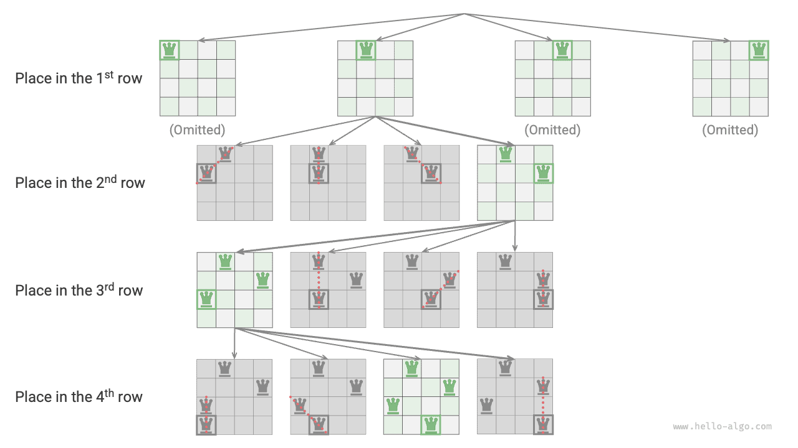

# Vấn đề về N-Queens

!!! câu hỏi

Theo luật cờ vua, quân Hậu có thể tấn công bất kỳ quân nào trên cùng hàng, cột hoặc đường chéo. Cho $n$ quân hậu và một bàn cờ $n \times n$, hãy sắp xếp sao cho không có hai quân hậu nào có thể tấn công lẫn nhau.

Như thể hiện trong hình bên dưới, khi $n = 4$, có thể tìm được hai nghiệm. Từ góc độ của thuật toán quay lui, một bàn cờ $n \times n$ có các ô vuông $n^2$, cung cấp tất cả các `lựa chọn` lựa chọn. Trong quá trình xếp từng quân hậu, trạng thái bàn cờ thay đổi liên tục và bàn cờ tại mỗi thời điểm đại diện cho trạng thái `trạng thái`.


Hình dưới đây minh họa ba hạn chế của vấn đề này: **nhiều quân hậu không thể ở cùng một hàng, cùng một cột hoặc trên cùng một đường chéo**. Điều đáng chú ý là đường chéo được chia thành hai loại: đường chéo chính `\` và đường chéo ngược `/`.


### Chiến lược sắp xếp theo hàng

Vì cả số quân hậu và số hàng trên bàn cờ đều là $n$, nên chúng ta có thể dễ dàng rút ra kết luận: **mỗi hàng của bàn cờ cho phép đặt một và chỉ một quân hậu**.

Điều này có nghĩa là chúng ta có thể áp dụng chiến lược sắp xếp theo từng hàng: bắt đầu từ hàng đầu tiên, đặt một quân hậu ở mỗi hàng cho đến khi hoàn thành hàng cuối cùng.

Hình dưới đây thể hiện quá trình sắp xếp từng hàng cho bài toán 4 con hậu. Do giới hạn về không gian, hình này chỉ mở rộng một nhánh tìm kiếm của hàng đầu tiên và tất cả các lược đồ vi phạm các ràng buộc về cột hoặc đường chéo đều bị cắt bớt.



Về cơ bản, **chiến lược sắp xếp theo từng hàng phục vụ chức năng cắt tỉa**, vì nó tránh tất cả các nhánh tìm kiếm nơi có nhiều quân hậu xuất hiện trong cùng một hàng.

### Cắt tỉa cột và đường chéo

Để đáp ứng ràng buộc cột, chúng ta có thể sử dụng mảng boolean `cols` có độ dài $n$ để ghi lại xem mỗi cột có một nữ hoàng hay không. Trước mỗi quyết định về vị trí, chúng tôi sử dụng `cols` để cắt bớt các cột đã có quân hậu và cập nhật động trạng thái của `cols` trong quá trình quay lui.

!!! mẹo

Xin lưu ý rằng gốc của ma trận nằm ở góc trên bên trái, trong đó chỉ số hàng tăng dần từ trên xuống dưới và chỉ số cột tăng dần từ trái sang phải.

Vậy chúng ta xử lý các ràng buộc về đường chéo như thế nào? Xét một hình vuông trên bàn cờ có chỉ số hàng và cột $(row, col)$. Nếu chúng ta chọn một đường chéo chính cụ thể trong ma trận, chúng ta sẽ thấy rằng tất cả các ô vuông trên đường chéo đó có cùng sự khác biệt giữa chỉ số hàng và cột của chúng, **có nghĩa là $row - col$ là một giá trị không đổi cho tất cả các ô vuông trên đường chéo chính**.

Nói cách khác, nếu hai hình vuông thỏa mãn $row_1 - col_1 = row_2 - col_2$ thì chúng phải nằm trên cùng một đường chéo chính. Sử dụng mẫu này, chúng ta có thể sử dụng mảng `diags1` được hiển thị trong hình bên dưới để ghi lại xem có quân hậu trên mỗi đường chéo chính hay không.

Tương tự, **đối với tất cả các hình vuông nằm trên một đường chéo, tổng $row + col$ là một giá trị không đổi**. Tương tự, chúng ta có thể sử dụng mảng `diags2` để xử lý các ràng buộc chống đường chéo.


### Triển khai mã

Xin lưu ý rằng trong ma trận vuông $n \times n$, phạm vi của $row - col$ là $[-n + 1, n - 1]$ và phạm vi của $row + col$ là $[0, 2n - 2]$. Do đó, số lượng đường chéo chính và đường đối chéo là $2n - 1$, nghĩa là độ dài của cả hai mảng `diags1` và `diags2` là $2n - 1$.

=== "Python"
    ```python title="n_queens.py"
    def n_queens(n: int) -> list[list[list[str]]]:
        """Solve N queens"""
        # Initialize an n*n chessboard, where 'Q' represents a queen and '#' represents an empty cell
        state = [["#" for _ in range(n)] for _ in range(n)]
        cols = [False] * n  # Record whether there is a queen in the column
        diags1 = [False] * (2 * n - 1)  # Record whether there is a queen on the main diagonal
        diags2 = [False] * (2 * n - 1)  # Record whether there is a queen on the anti-diagonal
        res = []
        backtrack(0, n, state, res, cols, diags1, diags2)
    
        return res
    ```
=== "C++"
    ```cpp title="n_queens.cpp"
    vector<vector<vector<string>>> nQueens(int n) {
        // Initialize an n*n chessboard, where 'Q' represents a queen and '#' represents an empty cell
        vector<vector<string>> state(n, vector<string>(n, "#"));
        vector<bool> cols(n, false);           // Record whether there is a queen in the column
        vector<bool> diags1(2 * n - 1, false); // Record whether there is a queen on the main diagonal
        vector<bool> diags2(2 * n - 1, false); // Record whether there is a queen on the anti-diagonal
        vector<vector<vector<string>>> res;
    
        backtrack(0, n, state, res, cols, diags1, diags2);
    
        return res;
    }
    ```
=== "Java"
    ```java title="n_queens.java"
    public class n_queens {
        /* Backtracking algorithm: N queens */
        public static void backtrack(int row, int n, List<List<String>> state, List<List<List<String>>> res,
                boolean[] cols, boolean[] diags1, boolean[] diags2) {
            // When all rows are placed, record the solution
            if (row == n) {
                List<List<String>> copyState = new ArrayList<>();
                for (List<String> sRow : state) {
                    copyState.add(new ArrayList<>(sRow));
                }
                res.add(copyState);
                return;
            }
            // Traverse all columns
            for (int col = 0; col < n; col++) {
                // Calculate the main diagonal and anti-diagonal corresponding to this cell
                int diag1 = row - col + n - 1;
                int diag2 = row + col;
                // Pruning: do not allow queens to exist in the column, main diagonal, and anti-diagonal of this cell
                if (!cols[col] && !diags1[diag1] && !diags2[diag2]) {
                    // Attempt: place the queen in this cell
                    state.get(row).set(col, "Q");
                    cols[col] = diags1[diag1] = diags2[diag2] = true;
                    // Place the next row
                    backtrack(row + 1, n, state, res, cols, diags1, diags2);
                    // Backtrack: restore this cell to an empty cell
                    state.get(row).set(col, "#");
                    cols[col] = diags1[diag1] = diags2[diag2] = false;
                }
            }
        }
    
        /* Solve N queens */
        public static List<List<List<String>>> nQueens(int n) {
            // Initialize an n*n chessboard, where 'Q' represents a queen and '#' represents an empty cell
            List<List<String>> state = new ArrayList<>();
            for (int i = 0; i < n; i++) {
                List<String> row = new ArrayList<>();
                for (int j = 0; j < n; j++) {
                    row.add("#");
                }
                state.add(row);
            }
            boolean[] cols = new boolean[n]; // Record whether there is a queen in the column
            boolean[] diags1 = new boolean[2 * n - 1]; // Record whether there is a queen on the main diagonal
            boolean[] diags2 = new boolean[2 * n - 1]; // Record whether there is a queen on the anti-diagonal
            List<List<List<String>>> res = new ArrayList<>();
    
            backtrack(0, n, state, res, cols, diags1, diags2);
    
            return res;
        }
    
        public static void main(String[] args) {
            int n = 4;
            List<List<List<String>>> res = nQueens(n);
    
            System.out.println("Input board size is " + n);
            System.out.println("Total queen placement solutions: " + res.size() + "");
            for (List<List<String>> state : res) {
                System.out.println("--------------------");
                for (List<String> row : state) {
                    System.out.println(row);
                }
            }
        }
    }
    ```
=== "C#"
    ```csharp title="n_queens.cs"
    public class n_queens {
        /* Backtracking algorithm: N queens */
        void Backtrack(int row, int n, List<List<string>> state, List<List<List<string>>> res,
                bool[] cols, bool[] diags1, bool[] diags2) {
            // When all rows are placed, record the solution
            if (row == n) {
                List<List<string>> copyState = [];
                foreach (List<string> sRow in state) {
                    copyState.Add(new List<string>(sRow));
                }
                res.Add(copyState);
                return;
            }
            // Traverse all columns
            for (int col = 0; col < n; col++) {
                // Calculate the main diagonal and anti-diagonal corresponding to this cell
                int diag1 = row - col + n - 1;
                int diag2 = row + col;
                // Pruning: do not allow queens to exist in the column, main diagonal, and anti-diagonal of this cell
                if (!cols[col] && !diags1[diag1] && !diags2[diag2]) {
                    // Attempt: place the queen in this cell
                    state[row][col] = "Q";
                    cols[col] = diags1[diag1] = diags2[diag2] = true;
                    // Place the next row
                    Backtrack(row + 1, n, state, res, cols, diags1, diags2);
                    // Backtrack: restore this cell to an empty cell
                    state[row][col] = "#";
                    cols[col] = diags1[diag1] = diags2[diag2] = false;
                }
            }
        }
    
        /* Solve N queens */
        List<List<List<string>>> NQueens(int n) {
            // Initialize an n*n chessboard, where 'Q' represents a queen and '#' represents an empty cell
            List<List<string>> state = [];
            for (int i = 0; i < n; i++) {
                List<string> row = [];
                for (int j = 0; j < n; j++) {
                    row.Add("#");
                }
                state.Add(row);
            }
            bool[] cols = new bool[n]; // Record whether there is a queen in the column
            bool[] diags1 = new bool[2 * n - 1]; // Record whether there is a queen on the main diagonal
            bool[] diags2 = new bool[2 * n - 1]; // Record whether there is a queen on the anti-diagonal
            List<List<List<string>>> res = [];
    
            Backtrack(0, n, state, res, cols, diags1, diags2);
    
            return res;
        }
    
        [Test]
        public void Test() {
            int n = 4;
            List<List<List<string>>> res = NQueens(n);
    
            Console.WriteLine("Input board size is " + n);
            Console.WriteLine("Total queen placement solutions: " + res.Count + " solutions");
            foreach (List<List<string>> state in res) {
                Console.WriteLine("--------------------");
                foreach (List<string> row in state) {
                    PrintUtil.PrintList(row);
                }
            }
        }
    }
    ```
=== "Go"
    ```go title="n_queens.go"
    func nQueens(n int) [][][]string {
    	// Initialize an n*n chessboard, where 'Q' represents a queen and '#' represents an empty cell
    	state := make([][]string, n)
    	for i := 0; i < n; i++ {
    		row := make([]string, n)
    		for i := 0; i < n; i++ {
    			row[i] = "#"
    		}
    		state[i] = row
    	}
    	// Record whether there is a queen in the column
    	cols := make([]bool, n)
    	diags1 := make([]bool, 2*n-1)
    	diags2 := make([]bool, 2*n-1)
    	res := make([][][]string, 0)
    	backtrack(0, n, &state, &res, &cols, &diags1, &diags2)
    	return res
    }
    ```
=== "Swift"
    ```swift title="n_queens.swift"
    func nQueens(n: Int) -> [[[String]]] {
        // Initialize an n*n chessboard, where 'Q' represents a queen and '#' represents an empty cell
        var state = Array(repeating: Array(repeating: "#", count: n), count: n)
        var cols = Array(repeating: false, count: n) // Record whether there is a queen in the column
        var diags1 = Array(repeating: false, count: 2 * n - 1) // Record whether there is a queen on the main diagonal
        var diags2 = Array(repeating: false, count: 2 * n - 1) // Record whether there is a queen on the anti-diagonal
        var res: [[[String]]] = []
    
        backtrack(row: 0, n: n, state: &state, res: &res, cols: &cols, diags1: &diags1, diags2: &diags2)
    
        return res
    }
    ```
=== "JS"
    ```javascript title="n_queens.js"
    function nQueens(n) {
        // Initialize an n*n chessboard, where 'Q' represents a queen and '#' represents an empty cell
        const state = Array.from({ length: n }, () => Array(n).fill('#'));
        const cols = Array(n).fill(false); // Record whether there is a queen in the column
        const diags1 = Array(2 * n - 1).fill(false); // Record whether there is a queen on the main diagonal
        const diags2 = Array(2 * n - 1).fill(false); // Record whether there is a queen on the anti-diagonal
        const res = [];
    
        backtrack(0, n, state, res, cols, diags1, diags2);
        return res;
    }
    ```
=== "TS"
    ```typescript title="n_queens.ts"
    function nQueens(n: number): string[][][] {
        // Initialize an n*n chessboard, where 'Q' represents a queen and '#' represents an empty cell
        const state = Array.from({ length: n }, () => Array(n).fill('#'));
        const cols = Array(n).fill(false); // Record whether there is a queen in the column
        const diags1 = Array(2 * n - 1).fill(false); // Record whether there is a queen on the main diagonal
        const diags2 = Array(2 * n - 1).fill(false); // Record whether there is a queen on the anti-diagonal
        const res: string[][][] = [];
    
        backtrack(0, n, state, res, cols, diags1, diags2);
        return res;
    }
    ```
=== "Dart"
    ```dart title="n_queens.dart"
    List<List<List<String>>> nQueens(int n) {
      // Initialize an n*n chessboard, where 'Q' represents a queen and '#' represents an empty cell
      List<List<String>> state = List.generate(n, (index) => List.filled(n, "#"));
      List<bool> cols = List.filled(n, false); // Record whether there is a queen in the column
      List<bool> diags1 = List.filled(2 * n - 1, false); // Record whether there is a queen on the main diagonal
      List<bool> diags2 = List.filled(2 * n - 1, false); // Record whether there is a queen on the anti-diagonal
      List<List<List<String>>> res = [];
    
      backtrack(0, n, state, res, cols, diags1, diags2);
    
      return res;
    }
    ```
=== "Rust"
    ```rust title="n_queens.rs"
    fn n_queens(n: usize) -> Vec<Vec<Vec<String>>> {
        // Initialize an n*n chessboard, where 'Q' represents a queen and '#' represents an empty cell
        let mut state: Vec<Vec<String>> = vec![vec!["#".to_string(); n]; n];
        let mut cols = vec![false; n]; // Record whether there is a queen in the column
        let mut diags1 = vec![false; 2 * n - 1]; // Record whether there is a queen on the main diagonal
        let mut diags2 = vec![false; 2 * n - 1]; // Record whether there is a queen on the anti-diagonal
        let mut res: Vec<Vec<Vec<String>>> = Vec::new();
    
        backtrack(
            0,
            n,
            &mut state,
            &mut res,
            &mut cols,
            &mut diags1,
            &mut diags2,
        );
    
        res
    }
    ```
=== "C"
    ```c title="n_queens.c"
    char ***nQueens(int n, int *returnSize) {
        char state[MAX_SIZE][MAX_SIZE];
        // Initialize an n*n chessboard, where 'Q' represents a queen and '#' represents an empty cell
        for (int i = 0; i < n; ++i) {
            for (int j = 0; j < n; ++j) {
                state[i][j] = '#';
            }
            state[i][n] = '\0';
        }
        bool cols[MAX_SIZE] = {false};           // Record whether there is a queen in the column
        bool diags1[2 * MAX_SIZE - 1] = {false}; // Record whether there is a queen on the main diagonal
        bool diags2[2 * MAX_SIZE - 1] = {false}; // Record whether there is a queen on the anti-diagonal
    
        char ***res = (char ***)malloc(sizeof(char **) * MAX_SIZE);
        *returnSize = 0;
        backtrack(0, n, state, res, returnSize, cols, diags1, diags2);
        return res;
    }
    ```
=== "Kotlin"
    ```kotlin title="n_queens.kt"
    fun nQueens(n: Int): MutableList<MutableList<MutableList<String>>?> {
        // Initialize an n*n chessboard, where 'Q' represents a queen and '#' represents an empty cell
        val state = mutableListOf<MutableList<String>>()
        for (i in 0..<n) {
            val row = mutableListOf<String>()
            for (j in 0..<n) {
                row.add("#")
            }
            state.add(row)
        }
        val cols = BooleanArray(n) // Record whether there is a queen in the column
        val diags1 = BooleanArray(2 * n - 1) // Record whether there is a queen on the main diagonal
        val diags2 = BooleanArray(2 * n - 1) // Record whether there is a queen on the anti-diagonal
        val res = mutableListOf<MutableList<MutableList<String>>?>()
    
        backtrack(0, n, state, res, cols, diags1, diags2)
    
        return res
    }
    ```
=== "Ruby"
    ```ruby title="n_queens.rb"
    ### Solve n queens ###
    def n_queens(n)
      # Initialize an n*n chessboard, where 'Q' represents a queen and '#' represents an empty cell
      state = Array.new(n) { Array.new(n, "#") }
      cols = Array.new(n, false) # Record whether there is a queen in the column
      diags1 = Array.new(2 * n - 1, false) # Record whether there is a queen on the main diagonal
      diags2 = Array.new(2 * n - 1, false) # Record whether there is a queen on the anti-diagonal
      res = []
      backtrack(0, n, state, res, cols, diags1, diags2)
    
      res
    ```


Đặt $n$ quân hậu theo hàng, xem xét ràng buộc cột, từ hàng đầu tiên đến hàng cuối cùng có các lựa chọn $n$, $n-1$, $\dots$, $2$, $1$, sử dụng thời gian $O(n!)$. Khi ghi một giải pháp, cần phải sao chép ma trận `state` và thêm nó vào `res`, và thao tác sao chép sử dụng thời gian $O(n^2)$. Do đó, **độ phức tạp về thời gian tổng thể là $O(n! \cdot n^2)$**. Trong thực tế, việc cắt tỉa dựa trên ràng buộc đường chéo cũng có thể làm giảm đáng kể không gian tìm kiếm, do đó hiệu quả tìm kiếm thường tốt hơn độ phức tạp về thời gian nêu trên.

Mảng `state` sử dụng không gian $O(n^2)$ và các mảng `cols`, `diags1` và `diags2`, mỗi mảng sử dụng không gian $O(n)$. Độ sâu đệ quy tối đa là $n$, sử dụng không gian khung ngăn xếp $O(n)$. Do đó, **độ phức tạp của không gian là $O(n^2)$**.
