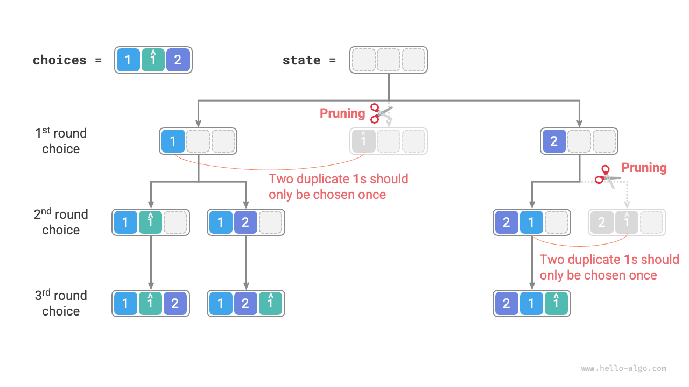

#Vấn đề về hoán vị

Bài toán hoán vị là một ứng dụng cổ điển của thuật toán quay lui. Nó được định nghĩa là tìm tất cả các cách sắp xếp có thể có của các phần tử trong một bộ sưu tập nhất định (chẳng hạn như một mảng hoặc chuỗi).

Bảng bên dưới hiển thị một số tập dữ liệu mẫu, bao gồm mảng đầu vào và hoán vị tương ứng của chúng.

<p align="center"> Table <id> &nbsp; Permutations Examples </p>

| Mảng đầu vào | Tất cả các hoán vị |
| :---------- | :-------------------------------------------------------------------------------- |
| $[1]$ | $[1]$ |
| $[1, 2]$ | $[1, 2], [2, 1]$ |
| $[1, 2, 3]$ | $[1, 2, 3], [1, 3, 2], [2, 1, 3], [2, 3, 1], [3, 1, 2], [3, 2, 1]$ |

## Trường hợp có các phần tử riêng biệt

!!! câu hỏi

Cho một mảng số nguyên không có phần tử trùng lặp, trả về tất cả các hoán vị có thể có.

Từ góc độ của thuật toán quay lui, **chúng ta có thể tưởng tượng quá trình tạo ra các hoán vị là kết quả của một loạt các lựa chọn**. Giả sử mảng đầu vào là $[1, 2, 3]$. Nếu trước tiên chúng ta chọn $1$, sau đó chọn $3$ và cuối cùng chọn $2$, chúng ta sẽ nhận được hoán vị $[1, 3, 2]$. Quay lại có nghĩa là hoàn tác một lựa chọn và sau đó thử các lựa chọn khác.

Từ góc độ của mã quay lui, tập ứng cử viên `lựa chọn` bao gồm tất cả các phần tử trong mảng đầu vào và trạng thái `trạng thái` là các phần tử đã được chọn cho đến nay. Lưu ý rằng mỗi phần tử chỉ có thể được chọn một lần, **do đó tất cả các phần tử ở `state` phải là duy nhất**.

Như được hiển thị trong hình bên dưới, chúng ta có thể triển khai quá trình tìm kiếm thành một cây đệ quy, trong đó mỗi nút trong cây biểu thị trạng thái hiện tại ``trạng thái`. Bắt đầu từ nút gốc, sau ba vòng lựa chọn, chúng ta đến được một nút lá và mỗi nút lá tương ứng với một hoán vị.


### Cắt bớt các lựa chọn trùng lặp

Để đảm bảo rằng mỗi phần tử chỉ được chọn một lần, chúng tôi xem xét việc giới thiệu một mảng boolean `selected`, trong đó `selected[i]` cho biết liệu `lựa chọn[i]` đã được chọn hay chưa. Chúng tôi thực hiện thao tác cắt tỉa sau dựa trên nó.

- Sau khi thực hiện lựa chọn `choices[i]`, chúng ta đặt `selected[i]` thành $\text{True}$, cho biết rằng nó đã được chọn.
- Khi duyệt qua danh sách ứng cử viên `lựa chọn`, chúng ta bỏ qua tất cả các nút đã được chọn đó là việc cắt tỉa.

Như minh họa trong hình bên dưới, giả sử chúng ta chọn $1$ ở vòng đầu tiên, $3$ ở vòng thứ hai và $2$ ở vòng thứ ba. Sau đó, chúng ta cần tỉa nhánh của phần tử $1$ ở vòng thứ hai và tỉa nhánh của phần tử $1$ và $3$ ở vòng thứ ba.


Quan sát hình trên, chúng ta thấy rằng thao tác cắt tỉa này làm giảm kích thước không gian tìm kiếm từ $O(n^n)$ xuống $O(n!)$.

### Triển khai mã

Sau khi hiểu rõ những thông tin trên, chúng ta có thể điền vào chỗ trống trong mã mẫu. Để rút ngắn mã tổng thể, chúng tôi không triển khai từng hàm trong mẫu một cách riêng biệt mà thay vào đó mở rộng chúng trong hàm `backtrack()`:

```src
[file]{permutations_i}-[class]{}-[func]{permutations_i}
```

## Trường hợp có phần tử trùng lặp

!!! câu hỏi

Cho một mảng số nguyên **có thể chứa các phần tử trùng lặp**, trả về tất cả các hoán vị duy nhất.

Giả sử mảng đầu vào là $[1, 1, 2]$. Để phân biệt hai phần tử trùng lặp $1$, chúng tôi biểu thị $1$ thứ hai là $\hat{1}$.

Như thể hiện trong hình bên dưới, một nửa số hoán vị được tạo bởi phương pháp trên là trùng lặp.


Vậy làm cách nào để loại bỏ các hoán vị trùng lặp? Cách tiếp cận trực tiếp nhất là sử dụng bộ băm để loại bỏ trực tiếp các kết quả hoán vị. Tuy nhiên, điều này không tinh tế vì **các nhánh tìm kiếm tạo ra hoán vị trùng lặp là không cần thiết và cần được xác định và cắt bớt sớm**, điều này có thể cải thiện hơn nữa hiệu quả của thuật toán.

### Cắt tỉa các phần tử bằng nhau

Quan sát hình dưới đây. Ở vòng đầu tiên, chọn $1$ hoặc chọn $\hat{1}$ là tương đương. Tất cả các hoán vị được tạo ra theo hai lựa chọn này đều là trùng lặp. Vì vậy, chúng ta nên tỉa bớt $\hat{1}$.

Tương tự, sau khi chọn $2$ ở vòng đầu tiên, $1$ và $\hat{1}$ ở vòng thứ hai cũng tạo ra các nhánh trùng lặp, do đó $\hat{1}$ của vòng thứ hai cũng nên được cắt tỉa.

Về cơ bản, **mục tiêu của chúng tôi là đảm bảo rằng nhiều phần tử bằng nhau chỉ được chọn một lần trong một vòng lựa chọn nhất định**.



### Triển khai mã

Dựa trên mã từ bài toán trước, chúng ta khởi tạo một bộ băm `trùng lặp` trong mỗi vòng lựa chọn để ghi lại những phần tử nào đã được thử trong vòng đó và lược bỏ các phần tử bằng nhau:

```src
[file]{permutations_ii}-[class]{}-[func]{permutations_ii}
```

Giả sử các phần tử là riêng biệt theo từng cặp, thì có các hoán vị $n!$ (giai thừa) của các phần tử $n$. Khi ghi kết quả, chúng ta cần sao chép danh sách có độ dài $n$, sử dụng thời gian $O(n)$. **Do đó, độ phức tạp về thời gian là $O(n! \cdot n)$**.

Độ sâu đệ quy tối đa là $n$, sử dụng không gian khung ngăn xếp $O(n)$. `được chọn` sử dụng không gian $O(n)$. Nhiều nhất $n$ các bộ trùng lặp` tồn tại đồng thời, sử dụng không gian $O(n^2)$. **Do đó, độ phức tạp của không gian là $O(n^2)$**.

###So Sánh Hai Phương Pháp Cắt Tỉa

Lưu ý rằng mặc dù cả `được chọn` và `duplicate` đều được sử dụng để cắt tỉa nhưng chúng có các mục tiêu khác nhau.

- **Cắt bớt các lựa chọn trùng lặp**: Chỉ có một `được chọn` trong toàn bộ quá trình tìm kiếm. Nó ghi lại những phần tử nào được bao gồm trong trạng thái hiện tại và mục đích của nó là ngăn chặn một phần tử xuất hiện lặp đi lặp lại trong `state`.
- **Cắt bớt các phần tử bằng nhau**: Mỗi vòng lựa chọn (mỗi lệnh gọi hàm `backtrack`) chứa một tập hợp `trùng lặp`. Nó ghi lại những phần tử nào đã được chọn trong lần lặp của vòng này (vòng lặp `for`) và mục đích của nó là đảm bảo rằng các phần tử bằng nhau chỉ được chọn một lần.

Hình dưới đây cho thấy phạm vi hiệu quả của hai điều kiện cắt tỉa. Lưu ý rằng mỗi nút trong cây đại diện cho một lựa chọn và các nút trên đường đi từ nút gốc đến nút lá tạo thành một hoán vị.


