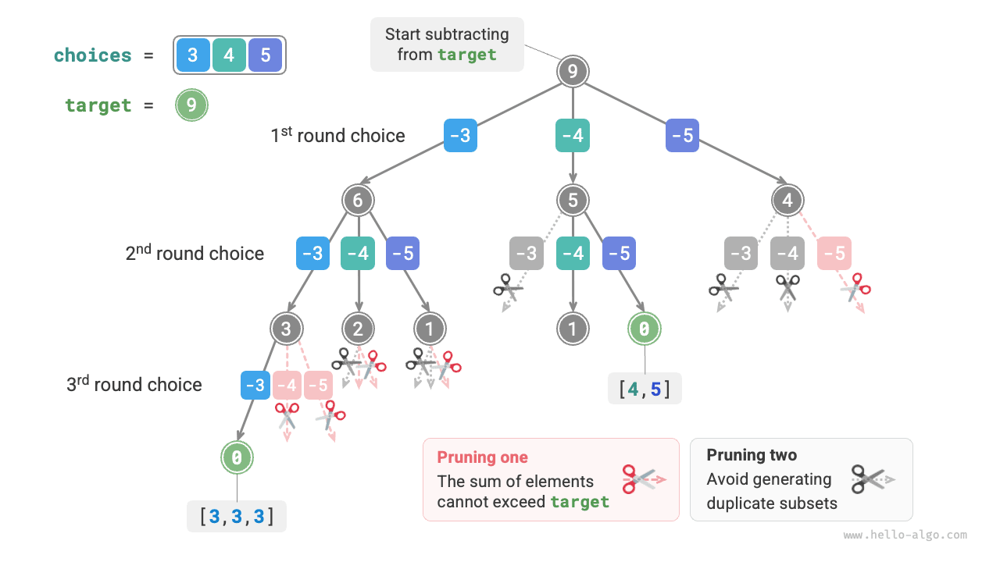
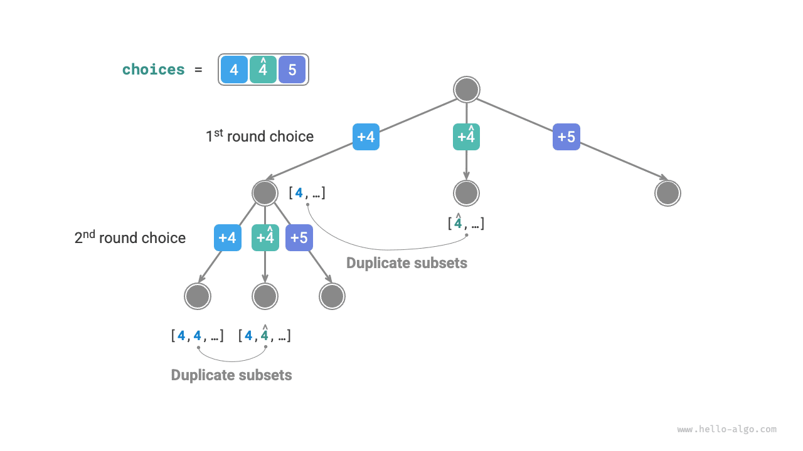
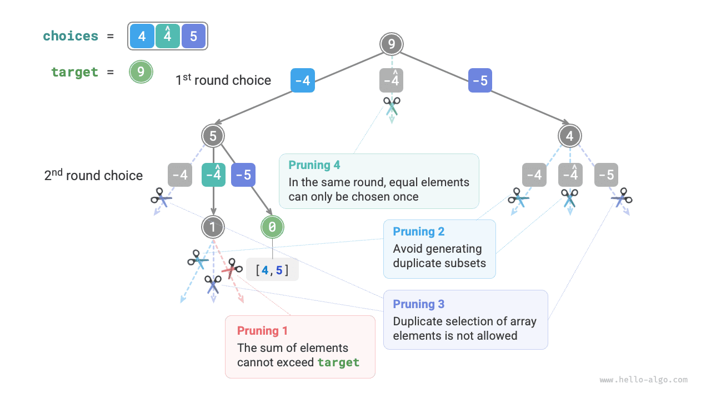

# Bài toán tổng tập hợp con

## Không có phần tử trùng lặp

!!! câu hỏi

Cho một mảng số nguyên dương `nums` và một số nguyên dương mục tiêu `target`, hãy tìm tất cả các kết hợp có thể có trong đó tổng các phần tử trong kết hợp bằng `target`. Mảng đã cho không có phần tử trùng lặp và mỗi phần tử có thể được chọn nhiều lần. Trả về các kết hợp này ở dạng danh sách, trong đó danh sách không được chứa các kết hợp trùng lặp.

Ví dụ: với tập $\{3, 4, 5\}$ và số nguyên mục tiêu $9$, các nghiệm là $\{3, 3, 3\}, \{4, 5\}$. Lưu ý hai điểm sau:

- Các phần tử trong tập đầu vào có thể được chọn lặp lại không giới hạn.
- Tập con không phân biệt thứ tự phần tử; ví dụ: $\{4, 5\}$ và $\{5, 4\}$ là cùng một tập hợp con.

### Sử dụng Giải pháp hoán vị làm tài liệu tham khảo

Tương tự như bài toán hoán vị, chúng ta có thể xem quá trình tạo các tập con là kết quả của một loạt các lựa chọn và cập nhật tổng chạy trong quá trình lựa chọn. Khi tổng bằng `target`, chúng tôi ghi tập hợp con vào danh sách kết quả.

Không giống như bài toán hoán vị, **các phần tử trong bài toán này có thể được chọn bao nhiêu lần**, vì vậy chúng ta không cần sử dụng danh sách boolean `selected` để theo dõi xem một phần tử đã được chọn chưa. Với một vài thay đổi nhỏ đối với mã hoán vị, chúng ta thu được lời giải ban đầu:

```src
[file]{subset_sum_i_naive}-[class]{}-[func]{subset_sum_i_naive}
```

Chạy đoạn mã trên trên mảng $[3, 4, 5]$ với giá trị đích $9$ sẽ tạo ra $[3, 3, 3], [4, 5], [5, 4]$. **Mặc dù chúng tôi đã tìm thành công tất cả các tập hợp con có tổng bằng $9$, nhưng vẫn có các tập hợp con trùng lặp $[4, 5]$ và $[5, 4]$**.

Điều này là do quá trình tìm kiếm phân biệt thứ tự các lựa chọn, nhưng các tập hợp con không phân biệt thứ tự lựa chọn. Như minh họa trong hình bên dưới, việc chọn 4 trước rồi đến 5 so với chọn 5 trước rồi 4 là các nhánh khác nhau, nhưng chúng tương ứng với cùng một tập hợp con.


Để loại bỏ các tập hợp con trùng lặp, **một ý tưởng đơn giản là loại bỏ danh sách kết quả trùng lặp**. Tuy nhiên, phương pháp này rất kém hiệu quả vì hai lý do:

- Khi có nhiều phần tử mảng, đặc biệt khi `target` lớn, quá trình tìm kiếm sẽ tạo ra nhiều tập con trùng lặp.
- Việc so sánh các tập con (mảng) rất tốn thời gian, đòi hỏi phải sắp xếp các mảng trước, sau đó so sánh từng phần tử trong mảng.

### Cắt bớt các tập hợp con trùng lặp

**Chúng tôi xem xét việc loại bỏ trùng lặp thông qua việc cắt bớt trong quá trình tìm kiếm**. Quan sát hình bên dưới, các tập hợp con trùng lặp xảy ra khi các phần tử mảng được chọn theo các thứ tự khác nhau, như trong các trường hợp sau:

1. Khi vòng đầu tiên và vòng thứ hai chọn $3$ và $4$ tương ứng, tất cả các tập con chứa hai phần tử này sẽ được tạo, ký hiệu là $[3, 4, \dots]$.
2. Sau đó, khi vòng đầu tiên chọn $4$, **vòng thứ hai sẽ bỏ qua $3$**, vì tập hợp con $[4, 3, \dots]$ được tạo bởi lựa chọn này là bản sao chính xác của tập hợp con được tạo ở bước `1.`

Trong quá trình tìm kiếm, các lựa chọn của mỗi cấp độ sẽ được thử từ trái sang phải nên các nhánh ngoài cùng bên phải sẽ được lược bỏ nhiều hơn.

1. Hai vòng đầu tiên chọn $3$ và $5$, tạo tập con $[3, 5, \dots]$.
2. Hai vòng đầu tiên chọn $4$ và $5$, tạo tập con $[4, 5, \dots]$.
3. Nếu vòng đầu tiên chọn $5$, **vòng thứ hai sẽ bỏ qua $3$ và $4$**, vì các tập hợp con $[5, 3, \dots]$ và $[5, 4, \dots]$ là bản sao chính xác của các tập hợp con được mô tả trong bước `1.` và `2.`


Tóm lại, với mảng đầu vào $[x_1, x_2, \dots, x_n]$, hãy đặt chuỗi lựa chọn trong quá trình tìm kiếm là $[x_{i_1}, x_{i_2}, \dots, x_{i_m}]$. Trình tự lựa chọn này phải thỏa mãn $i_1 \leq i_2 \leq \dots \leq i_m$; **bất kỳ chuỗi lựa chọn nào không thỏa mãn điều kiện này sẽ gây ra sự trùng lặp và cần được cắt bớt**.

### Triển khai mã

Để thực hiện việc cắt tỉa này, chúng ta khởi tạo một biến `start` để chỉ ra điểm bắt đầu của quá trình truyền tải. **Sau khi thực hiện lựa chọn $x_{i}$, hãy đặt vòng tiếp theo để bắt đầu truyền tải từ chỉ mục $i$**. Điều này đảm bảo rằng chuỗi lựa chọn thỏa mãn $i_1 \leq i_2 \leq \dots \leq i_m$, đảm bảo tính duy nhất của tập hợp con.

Ngoài ra, chúng tôi đã thực hiện hai tối ưu hóa sau cho mã:

- Trước khi bắt đầu tìm kiếm, đầu tiên hãy sắp xếp mảng `nums`. Khi duyệt qua tất cả các lựa chọn, **kết thúc vòng lặp ngay lập tức khi tổng tập hợp con vượt quá `target`**, vì các phần tử tiếp theo lớn hơn và tổng tập hợp con của chúng phải vượt quá `target`.
- Bỏ qua biến tổng phần tử `total` và **sử dụng phép trừ trên `target` để theo dõi tổng các phần tử**. Ghi lại lời giải khi `target` bằng $0$.

```src
[file]{subset_sum_i}-[class]{}-[func]{subset_sum_i}
```

Hình bên dưới cho thấy quá trình quay lui hoàn chỉnh được tạo ra bằng cách chạy đoạn mã trên trên mảng $[3, 4, 5]$ với giá trị đích $9$.



## Với các phần tử trùng lặp trong mảng

!!! câu hỏi

Cho một mảng số nguyên dương `nums` và một số nguyên dương mục tiêu `target`, hãy tìm tất cả các kết hợp có thể có trong đó tổng các phần tử trong kết hợp bằng `target`. **Mảng đã cho có thể chứa các phần tử trùng lặp và mỗi phần tử chỉ có thể được chọn nhiều nhất một lần**. Trả về các kết hợp này ở dạng danh sách, trong đó danh sách không được chứa các kết hợp trùng lặp.

So với bài toán trước, **mảng đầu vào trong bài toán này có thể chứa các phần tử trùng lặp**, điều này gây ra một vấn đề mới. Ví dụ: cho mảng $[4, \hat{4}, 5]$ và giá trị đích $9$, đầu ra của mã hiện tại là $[4, 5], [\hat{4}, 5]$, chứa các tập hợp con trùng lặp.

**Lý do trùng lặp này là các phần tử bằng nhau được chọn nhiều lần trong một vòng nhất định**. Trong hình bên dưới, vòng đầu tiên có ba lựa chọn, hai trong số đó là $4$, tạo ra hai nhánh tìm kiếm trùng lặp tạo ra các tập hợp con trùng lặp. Tương tự, hai $4$ ở vòng thứ hai cũng tạo ra các tập con trùng lặp.



### Cắt tỉa các phần tử bằng nhau

Để giải quyết vấn đề này, **chúng ta cần giới hạn các phần tử bằng nhau chỉ được chọn một lần trong mỗi vòng**. Việc triển khai khá thông minh: vì mảng đã được sắp xếp nên các phần tử bằng nhau nằm liền kề nhau. Điều này có nghĩa là trong một vòng lựa chọn nhất định, nếu phần tử hiện tại bằng phần tử ở bên trái của nó thì giá trị tương tự đã được chọn trong vòng này, vì vậy chúng ta trực tiếp bỏ qua phần tử hiện tại.

Đồng thời, **vấn đề này chỉ rõ mỗi phần tử mảng chỉ được chọn một lần**. May mắn thay, chúng ta cũng có thể sử dụng biến `start` để thỏa mãn ràng buộc này: sau khi đưa ra lựa chọn $x_{i}$, hãy đặt vòng tiếp theo để bắt đầu truyền tải từ chỉ mục $i + 1$ trở đi. Điều này vừa loại bỏ các tập hợp con trùng lặp vừa tránh việc chọn các phần tử nhiều lần.

### Triển khai mã

```src
[file]{subset_sum_ii}-[class]{}-[func]{subset_sum_ii}
```

Hình dưới đây cho thấy quá trình quay lui cho mảng $[4, 4, 5]$ với giá trị mục tiêu $9$, bao gồm bốn loại hoạt động cắt tỉa. Kết hợp hình minh họa với chú thích mã để hiểu toàn bộ quá trình tìm kiếm và cách hoạt động của từng thao tác cắt tỉa.


