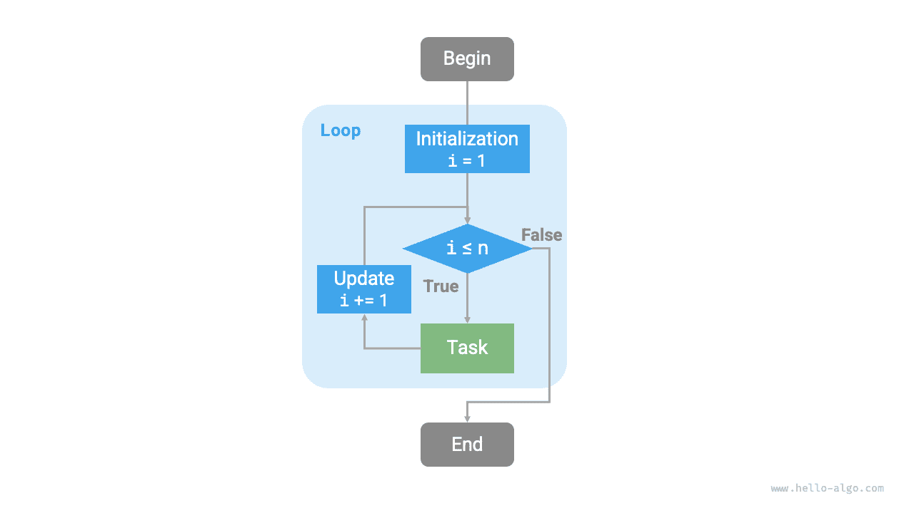

# Lặp lại và đệ quy

Trong các thuật toán, việc thực hiện lặp đi lặp lại một tác vụ là rất phổ biến và liên quan chặt chẽ đến việc phân tích độ phức tạp. Do đó, trước khi giới thiệu độ phức tạp về thời gian và không gian, trước tiên chúng ta hãy hiểu cách triển khai thực hiện tác vụ lặp lại trong các chương trình, cụ thể là hai cấu trúc điều khiển chương trình cơ bản: lặp và đệ quy.

## Lặp lại

<u>Iteration</u> là một cơ chế điều khiển cho phép chương trình thực hiện một công việc nhiều lần. Chương trình sẽ lặp lại việc thực thi một đoạn mã khi điều kiện lặp còn đúng, và sẽ dừng lại khi điều kiện đó không còn đúng nữa.

### Vòng lặp For

Vòng lặp `for` là một trong những dạng lặp phổ biến nhất, **phù hợp để sử dụng khi biết trước số lần lặp**.

Hàm sau đây thực hiện phép tính tổng $1 + 2 + \dots + n$ bằng cách sử dụng vòng lặp `for`, với kết quả được lưu trong biến `res`. Lưu ý rằng trong Python, `range(a, b)` tương ứng với khoảng "đóng trái, mở phải", với phạm vi truyền tải là $a, a + 1, \dots, b-1$:

```src
[file]{iteration}-[class]{}-[func]{for_loop}
```

Hình dưới đây cho thấy sơ đồ của hàm tính tổng này.



Số lượng thao tác trong hàm tính tổng này tỷ lệ thuận với kích thước dữ liệu đầu vào $n$ hoặc có "mối quan hệ tuyến tính". Trên thực tế, **độ phức tạp về thời gian mô tả chính xác "mối quan hệ tuyến tính" này**. Những nội dung liên quan sẽ được giới thiệu chi tiết ở phần tiếp theo.

### Vòng lặp while

Tương tự như vòng lặp `for`, vòng lặp `while` cũng là một phương thức để thực hiện phép lặp. Trong vòng lặp `while`, trước tiên chương trình sẽ kiểm tra điều kiện trong mỗi vòng; nếu điều kiện đúng thì tiếp tục thực hiện, nếu không thì kết thúc vòng lặp.

Dưới đây chúng tôi sử dụng vòng lặp `while` để thực hiện phép tính tổng $1 + 2 + \dots + n$:

```src
[file]{iteration}-[class]{}-[func]{while_loop}
```

**Vòng lặp `while` có tính linh hoạt cao hơn vòng lặp `for`**. Trong vòng lặp `while`, chúng ta có thể thoải mái thiết kế các bước khởi tạo và cập nhật của biến điều kiện.

Ví dụ: trong đoạn mã sau, biến điều kiện $i$ được cập nhật hai lần mỗi vòng, điều này không thuận tiện khi triển khai bằng vòng lặp `for`:

```src
[file]{iteration}-[class]{}-[func]{while_loop_ii}
```

Nhìn chung, vòng lặp **`for` có mã nhỏ gọn hơn, trong khi vòng lặp `while` linh hoạt hơn**; cả hai đều có thể thực hiện các cấu trúc lặp. Việc lựa chọn sử dụng cái nào phải được xác định dựa trên yêu cầu của vấn đề cụ thể.

### Vòng lặp lồng nhau

Chúng ta có thể lồng một cấu trúc vòng lặp vào bên trong một cấu trúc vòng lặp khác. Dưới đây là một ví dụ sử dụng vòng lặp `for`:

```src
[file]{iteration}-[class]{}-[func]{nested_for_loop}
```

Hình dưới đây cho thấy sơ đồ của vòng lặp lồng nhau này.


Trong trường hợp này, số thao tác của hàm tỷ lệ thuận với $n^2$ hoặc thời gian chạy của thuật toán có "mối quan hệ bậc hai" với kích thước dữ liệu đầu vào $n$.

Chúng ta có thể tiếp tục thêm các vòng lặp lồng nhau, trong đó mỗi cấp độ lồng nhau bổ sung có thể được xem như là sự gia tăng về chiều, nâng độ phức tạp về thời gian lên "mối quan hệ bậc ba", "mối quan hệ bậc bốn", v.v.

##Đệ quy

<u>Recursion</u> is an algorithmic strategy that solves problems by having a function call itself. It mainly consists of two phases.

1. **Giảm dần**: Chương trình liên tục tự gọi mình sâu hơn, thường chuyển các tham số nhỏ hơn hoặc đơn giản hơn cho đến khi đạt đến "điều kiện kết thúc".
2. **Ascend**: Sau khi kích hoạt "điều kiện kết thúc", chương trình trả về từng lớp từ hàm đệ quy sâu nhất, tổng hợp kết quả của từng lớp.

Từ góc độ triển khai, mã đệ quy chủ yếu bao gồm ba phần tử.

1. **Điều kiện kết thúc**: Được sử dụng để xác định thời điểm chuyển từ "giảm dần" sang "tăng dần".
2. **Cuộc gọi đệ quy**: Tương ứng với "giảm dần", trong đó hàm gọi chính nó, thường có các tham số nhỏ hơn hoặc đơn giản hơn.
3. **Trả về kết quả**: Tương ứng với "tăng dần", trả kết quả của mức đệ quy hiện tại về lớp trước.

Quan sát đoạn mã sau. Chúng ta chỉ cần gọi hàm `recur(n)` để hoàn thành phép tính $1 + 2 + \dots + n$:

```src
[file]{recursion}-[class]{}-[func]{recur}
```

Hình dưới đây cho thấy quá trình đệ quy của hàm này.


Mặc dù từ góc độ tính toán, phép lặp và đệ quy có thể đạt được kết quả như nhau, **chúng đại diện cho hai mô hình hoàn toàn khác nhau để suy nghĩ và giải quyết vấn đề**.

- **Lặp lại**: Giải quyết vấn đề "từ dưới lên". Bắt đầu từ những bước cơ bản nhất, các bước này sau đó được thực hiện lặp đi lặp lại hoặc tích lũy cho đến khi nhiệm vụ hoàn thành.
- **Đệ quy**: Giải bài toán "từ trên xuống". Bài toán ban đầu được phân tách thành các bài toán con nhỏ hơn có dạng giống như bài toán ban đầu. Các bài toán con này tiếp tục được phân tách thành các bài toán con thậm chí còn nhỏ hơn cho đến khi đạt được trường hợp cơ sở (trong đó lời giải đã được biết).

Lấy hàm tính tổng ở trên làm ví dụ, giả sử bài toán là $f(n) = 1 + 2 + \dots + n$.

- **Lặp**: Mô phỏng quá trình tính tổng trong một vòng lặp, duyệt từ $1$ đến $n$, thực hiện thao tác tính tổng trong mỗi vòng để thu được $f(n)$.
- **Đệ quy**: Phân rã bài toán thành bài toán con $f(n) = n + f(n-1)$, phân rã liên tục (đệ quy) cho đến khi dừng ở trường hợp cơ sở $f(1) = 1$.

### Ngăn xếp cuộc gọi

Mỗi khi một hàm đệ quy gọi chính nó, hệ thống sẽ cấp phát bộ nhớ cho hàm mới được gọi để lưu trữ các biến cục bộ, địa chỉ cuộc gọi và các thông tin khác. Điều này dẫn đến hai hậu quả.

- Dữ liệu ngữ cảnh của hàm được lưu trữ trong một vùng bộ nhớ gọi là “không gian khung ngăn xếp”, vùng này không được giải phóng cho đến khi hàm quay trở lại. Do đó, **đệ quy thường tiêu tốn nhiều dung lượng bộ nhớ hơn phép lặp**.
- Các lệnh gọi hàm đệ quy phải chịu thêm chi phí. **Do đó, đệ quy thường ít tiết kiệm thời gian hơn so với vòng lặp**.

Như được hiển thị trong hình bên dưới, trước khi điều kiện kết thúc được kích hoạt, có $n$ hàm đệ quy tồn tại đồng thời, với **độ sâu đệ quy là $n$**.


Trong thực tế, độ sâu đệ quy mà các ngôn ngữ lập trình cho phép thường bị giới hạn và đệ quy quá sâu có thể dẫn đến lỗi tràn ngăn xếp.

### Đệ quy đuôi

Điều thú vị là **nếu một hàm thực hiện lệnh gọi đệ quy là bước cuối cùng trước khi quay trở lại**, trình biên dịch hoặc trình thông dịch có thể tối ưu hóa hàm đó để hiệu quả về không gian của nó tương đương với phép lặp. Trường hợp này được gọi là <u>đệ quy đuôi</u>.

- **Đệ quy thông thường**: Khi một hàm trở về cấp độ trước đó, nó cần tiếp tục thực thi mã, do đó hệ thống cần lưu ngữ cảnh lệnh gọi của lớp trước đó.
- **Đệ quy đuôi**: Lệnh gọi đệ quy là thao tác cuối cùng trước khi hàm trả về, nghĩa là sau khi quay về mức trước đó không cần tiếp tục thực hiện các thao tác khác nên hệ thống không cần lưu ngữ cảnh của hàm lớp trước.

Lấy phép tính $1 + 2 + \dots + n$ làm ví dụ, chúng ta có thể đặt biến kết quả `res` làm tham số hàm để thực hiện đệ quy đuôi:

```src
[file]{recursion}-[class]{}-[func]{tail_recur}
```

Quá trình thực hiện đệ quy đuôi được thể hiện trong hình bên dưới. So sánh đệ quy thông thường và đệ quy đuôi, phép tính tổng được thực hiện ở các điểm khác nhau.

- **Đệ quy thông thường**: Thao tác tính tổng được thực hiện trong quá trình "tăng dần", yêu cầu thao tác tính tổng bổ sung sau mỗi lớp quay trở lại.
- **Đệ quy đuôi**: Phép tính tổng được thực hiện trong quá trình "giảm dần"; quá trình "tăng dần" chỉ cần trả về từng lớp.


!!! mẹo

Xin lưu ý rằng nhiều trình biên dịch hoặc trình thông dịch không hỗ trợ tối ưu hóa đệ quy đuôi. Ví dụ: Python không hỗ trợ tối ưu hóa đệ quy đuôi theo mặc định, vì vậy ngay cả khi một hàm ở dạng đệ quy đuôi, nó vẫn có thể gặp phải sự cố tràn ngăn xếp.

### Cây đệ quy

Khi giải quyết các vấn đề thuật toán liên quan đến "phân chia và chinh phục", đệ quy thường cung cấp cách tiếp cận trực quan hơn và mã dễ đọc hơn so với phép lặp. Lấy "chuỗi Fibonacci" làm ví dụ.

!!! câu hỏi

Cho dãy Fibonacci $0, 1, 1, 2, 3, 5, 8, 13, \dots$, tìm số thứ $n$ trong dãy.

Đặt số $n$-th của dãy Fibonacci là $f(n)$. Có thể dễ dàng rút ra được hai kết luận.

- Hai số đầu tiên của dãy là $f(1) = 0$ và $f(2) = 1$.
- Mỗi số trong dãy là tổng của hai số trước đó, tức là $f(n) = f(n - 1) + f(n - 2)$.

Theo quan hệ truy hồi để thực hiện lệnh gọi đệ quy, với hai số đầu tiên làm điều kiện kết thúc, chúng ta có thể viết mã đệ quy. Gọi `fib(n)` sẽ cho chúng ta số $n$-th của dãy Fibonacci:

```src
[file]{recursion}-[class]{}-[func]{fib}
```

Quan sát đoạn mã trên, chúng ta thực hiện hai lệnh gọi đệ quy trong hàm, **có nghĩa là một lệnh gọi tạo ra hai nhánh lệnh gọi**. Như được hiển thị trong hình bên dưới, việc gọi đệ quy lặp đi lặp lại này cuối cùng sẽ tạo ra một <u>cây đệ quy</u> với các mức $n$.


Về cơ bản, đệ quy thể hiện mô hình "phân tách một vấn đề thành các bài toán con nhỏ hơn" và chiến lược phân chia để chinh phục này rất quan trọng.

- Từ góc độ thuật toán, nhiều chiến lược thuật toán quan trọng như tìm kiếm, sắp xếp, quay lui, chia để trị, lập trình động áp dụng trực tiếp hoặc gián tiếp cách suy nghĩ này.
- Từ góc độ cấu trúc dữ liệu, đệ quy đương nhiên phù hợp để xử lý các vấn đề liên quan đến danh sách, cây và biểu đồ liên kết, vì chúng rất phù hợp để phân tích bằng tư duy chia để trị.

## So sánh hai

Tóm tắt nội dung trên, như được hiển thị trong bảng bên dưới, phép lặp và đệ quy khác nhau về cách triển khai, hiệu suất và khả năng áp dụng.

<p align="center"> Table <id> &nbsp; Comparison of iteration and recursion characteristics </p>

|                | Lặp lại | Đệ quy |
| -------------- | -------------------------------------------------------- | -------------------------------------------------------------------------------------- |
| Thực hiện | Cấu trúc vòng lặp | Hàm tự gọi chính nó |
| Hiệu quả về thời gian | Nói chung là hiệu quả hơn, không cần gọi hàm | Mỗi lệnh gọi hàm đều phát sinh chi phí |
| Sử dụng bộ nhớ | Thường sử dụng một lượng không gian bộ nhớ cố định | Các cuộc gọi hàm tích lũy có thể sử dụng một lượng lớn không gian khung ngăn xếp |
| Vấn đề phù hợp | Thích hợp cho các tác vụ vòng lặp đơn giản, với mã trực quan và dễ đọc | Thích hợp cho việc phân rã bài toán con, chẳng hạn như cây, đồ thị, chia để trị, quay lui, v.v., với cấu trúc mã ngắn gọn và rõ ràng |

!!! mẹo

Nếu bạn thấy nội dung sau khó hiểu, bạn có thể xem lại sau khi đọc chương “Stack”.

Mối quan hệ nội tại giữa phép lặp và đệ quy là gì? Lấy hàm đệ quy ở trên làm ví dụ, phép tính tổng được thực hiện trong giai đoạn đệ quy "tăng dần". Điều này có nghĩa là hàm được gọi đầu tiên thực sự hoàn thành thao tác tính tổng của nó sau cùng, **và cơ chế hoạt động này tương tự như nguyên tắc "vào sau, ra trước" của ngăn xếp**.

Trong thực tế, thuật ngữ đệ quy như "ngăn xếp cuộc gọi" và "không gian khung ngăn xếp" đã gợi ý về mối quan hệ chặt chẽ giữa đệ quy và ngăn xếp.

1. **Giảm dần**: Khi một hàm được gọi, hệ thống sẽ phân bổ một khung ngăn xếp mới trên "ngăn xếp cuộc gọi" cho hàm đó để lưu trữ các biến cục bộ, tham số, địa chỉ trả về và dữ liệu khác của hàm.
2. **Ascend**: Khi hàm hoàn thành việc thực thi và trả về, khung ngăn xếp tương ứng sẽ bị xóa khỏi "ngăn xếp lệnh gọi", khôi phục môi trường thực thi của hàm trước đó.

Do đó, **chúng ta có thể sử dụng một ngăn xếp rõ ràng để mô phỏng hành vi của ngăn xếp cuộc gọi**, do đó chuyển đệ quy thành dạng lặp:

```src
[file]{recursion}-[class]{}-[func]{for_loop_recur}
```

Quan sát đoạn mã trên, khi chuyển đệ quy thành phép lặp, mã trở nên phức tạp hơn. Mặc dù phép lặp và đệ quy có thể được chuyển đổi lẫn nhau trong nhiều trường hợp, nhưng việc làm đó có thể không đáng giá vì hai lý do sau.

- Mã được chuyển đổi có thể khó hiểu và khó đọc hơn.
- Đối với một số vấn đề phức tạp, việc mô phỏng hành vi của ngăn xếp lệnh gọi hệ thống có thể rất khó khăn.

Tóm lại, **việc lựa chọn giữa phép lặp và đệ quy phụ thuộc vào bản chất của vấn đề cụ thể**. Trong thực hành lập trình, điều quan trọng là phải cân nhắc ưu và nhược điểm của cả hai và chọn phương pháp phù hợp dựa trên ngữ cảnh.
