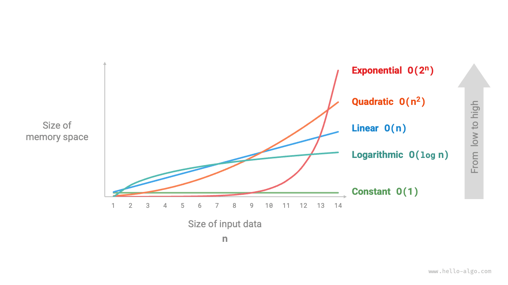
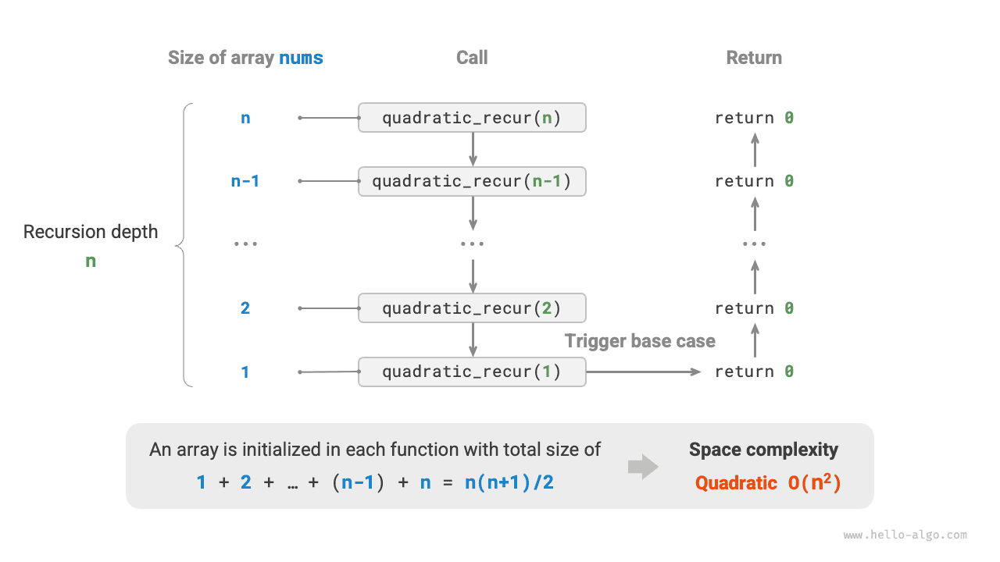
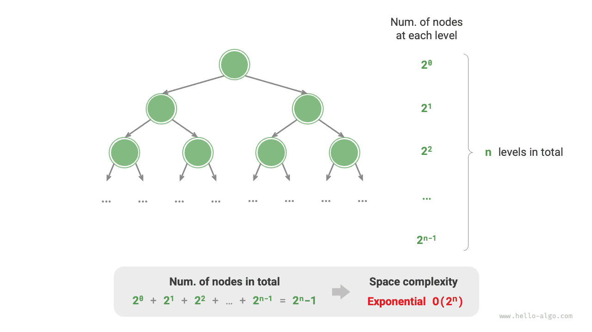

# Độ phức tạp của không gian

<u>Space complexity</u> measures the growth trend of memory space occupied by an algorithm as the data size increases. This concept is very similar to time complexity, except that "running time" is replaced with "occupied memory space".

## Không gian liên quan đến thuật toán

Không gian bộ nhớ được thuật toán sử dụng trong quá trình thực thi chủ yếu bao gồm các loại sau.

- **Không gian đầu vào**: Dùng để lưu trữ dữ liệu đầu vào của thuật toán.
- **Không gian tạm thời**: Dùng để lưu trữ các biến, đối tượng, ngữ cảnh hàm và các dữ liệu khác trong quá trình thực thi thuật toán.
- **Dung lượng đầu ra**: Dùng để lưu trữ dữ liệu đầu ra của thuật toán.

Nói chung, phạm vi thống kê độ phức tạp của không gian là "không gian tạm thời" cộng với "không gian đầu ra".

Không gian tạm thời có thể được chia thành ba phần.

- **Dữ liệu tạm thời**: Được sử dụng để lưu các hằng số, biến, đối tượng, v.v. trong quá trình thực thi thuật toán.
- **Stack frame space**: Dùng để lưu dữ liệu ngữ cảnh của các hàm được gọi. Hệ thống tạo một khung ngăn xếp ở đầu ngăn xếp mỗi khi một hàm được gọi và không gian khung ngăn xếp được giải phóng sau khi hàm quay trở lại.
- **Không gian lệnh**: Dùng để lưu các lệnh chương trình đã biên dịch, thường bị bỏ qua trong thống kê thực tế.

Khi phân tích độ phức tạp về không gian của một chương trình, **chúng tôi thường xem xét ba phần: dữ liệu tạm thời, không gian khung ngăn xếp và dữ liệu đầu ra**, như minh họa trong hình sau.


Mã liên quan như sau:

=== "Python"

    ```python title=""
    class Node:
        """Class"""
        def __init__(self, x: int):
            self.val: int = x              # Node value
            self.next: Node | None = None  # Reference to the next node

    def function() -> int:
        """Function"""
        # Perform some operations...
        return 0

    def algorithm(n) -> int:  # Input data
        A = 0                 # Temporary data (constant, usually represented by uppercase letters)
        b = 0                 # Temporary data (variable)
        node = Node(0)        # Temporary data (object)
        c = function()        # Stack frame space (function call)
        return A + b + c      # Output data
    ```

=== "C++"

    ```cpp title=""
    /* Structure */
    struct Node {
        int val;
        Node *next;
        Node(int x) : val(x), next(nullptr) {}
    };

    /* Function */
    int func() {
        // Perform some operations...
        return 0;
    }

    int algorithm(int n) {        // Input data
        const int a = 0;          // Temporary data (constant)
        int b = 0;                // Temporary data (variable)
        Node* node = new Node(0); // Temporary data (object)
        int c = func();           // Stack frame space (function call)
        return a + b + c;         // Output data
    }
    ```

=== "Java"

    ```java title=""
    /* Class */
    class Node {
        int val;
        Node next;
        Node(int x) { val = x; }
    }

    /* Function */
    int function() {
        // Perform some operations...
        return 0;
    }

    int algorithm(int n) {        // Input data
        final int a = 0;          // Temporary data (constant)
        int b = 0;                // Temporary data (variable)
        Node node = new Node(0);  // Temporary data (object)
        int c = function();       // Stack frame space (function call)
        return a + b + c;         // Output data
    }
    ```

=== "C#"

    ```csharp title=""
    /* Class */
    class Node(int x) {
        int val = x;
        Node next;
    }

    /* Function */
    int Function() {
        // Perform some operations...
        return 0;
    }

    int Algorithm(int n) {        // Input data
        const int a = 0;          // Temporary data (constant)
        int b = 0;                // Temporary data (variable)
        Node node = new(0);       // Temporary data (object)
        int c = Function();       // Stack frame space (function call)
        return a + b + c;         // Output data
    }
    ```

=== "Go"

    ```go title=""
    /* Structure */
    type node struct {
        val  int
        next *node
    }

    /* Create node structure */
    func newNode(val int) *node {
        return &node{val: val}
    }

    /* Function */
    func function() int {
        // Perform some operations...
        return 0
    }

    func algorithm(n int) int { // Input data
        const a = 0             // Temporary data (constant)
        b := 0                  // Temporary data (variable)
        newNode(0)              // Temporary data (object)
        c := function()         // Stack frame space (function call)
        return a + b + c        // Output data
    }
    ```

=== "Swift"

    ```swift title=""
    /* Class */
    class Node {
        var val: Int
        var next: Node?

        init(x: Int) {
            val = x
        }
    }

    /* Function */
    func function() -> Int {
        // Perform some operations...
        return 0
    }

    func algorithm(n: Int) -> Int { // Input data
        let a = 0             // Temporary data (constant)
        var b = 0             // Temporary data (variable)
        let node = Node(x: 0) // Temporary data (object)
        let c = function()    // Stack frame space (function call)
        return a + b + c      // Output data
    }
    ```

=== "JS"

    ```javascript title=""
    /* Class */
    class Node {
        val;
        next;
        constructor(val) {
            this.val = val === undefined ? 0 : val; // Node value
            this.next = null;                       // Reference to the next node
        }
    }

    /* Function */
    function constFunc() {
        // Perform some operations
        return 0;
    }

    function algorithm(n) {       // Input data
        const a = 0;              // Temporary data (constant)
        let b = 0;                // Temporary data (variable)
        const node = new Node(0); // Temporary data (object)
        const c = constFunc();    // Stack frame space (function call)
        return a + b + c;         // Output data
    }
    ```

=== "TS"

    ```typescript title=""
    /* Class */
    class Node {
        val: number;
        next: Node | null;
        constructor(val?: number) {
            this.val = val === undefined ? 0 : val; // Node value
            this.next = null;                       // Reference to the next node
        }
    }

    /* Function */
    function constFunc(): number {
        // Perform some operations
        return 0;
    }

    function algorithm(n: number): number { // Input data
        const a = 0;                        // Temporary data (constant)
        let b = 0;                          // Temporary data (variable)
        const node = new Node(0);           // Temporary data (object)
        const c = constFunc();              // Stack frame space (function call)
        return a + b + c;                   // Output data
    }
    ```

=== "Dart"

    ```dart title=""
    /* Class */
    class Node {
      int val;
      Node next;
      Node(this.val, [this.next]);
    }

    /* Function */
    int function() {
      // Perform some operations...
      return 0;
    }

    int algorithm(int n) {  // Input data
      const int a = 0;      // Temporary data (constant)
      int b = 0;            // Temporary data (variable)
      Node node = Node(0);  // Temporary data (object)
      int c = function();   // Stack frame space (function call)
      return a + b + c;     // Output data
    }
    ```

=== "Rust"

    ```rust title=""
    use std::rc::Rc;
    use std::cell::RefCell;

    /* Structure */
    struct Node {
        val: i32,
        next: Option<Rc<RefCell<Node>>>,
    }

    /* Create Node structure */
    impl Node {
        fn new(val: i32) -> Self {
            Self { val: val, next: None }
        }
    }

    /* Function */
    fn function() -> i32 {
        // Perform some operations...
        return 0;
    }

    fn algorithm(n: i32) -> i32 {       // Input data
        const a: i32 = 0;               // Temporary data (constant)
        let mut b = 0;                  // Temporary data (variable)
        let node = Node::new(0);        // Temporary data (object)
        let c = function();             // Stack frame space (function call)
        return a + b + c;               // Output data
    }
    ```

=== "C"

    ```c title=""
    /* Function */
    int func() {
        // Perform some operations...
        return 0;
    }

    int algorithm(int n) { // Input data
        const int a = 0;   // Temporary data (constant)
        int b = 0;         // Temporary data (variable)
        int c = func();    // Stack frame space (function call)
        return a + b + c;  // Output data
    }
    ```

=== "Kotlin"

    ```kotlin title=""
    /* Class */
    class Node(var _val: Int) {
        var next: Node? = null
    }

    /* Function */
    fun function(): Int {
        // Perform some operations...
        return 0
    }

    fun algorithm(n: Int): Int { // Input data
        val a = 0                // Temporary data (constant)
        var b = 0                // Temporary data (variable)
        val node = Node(0)       // Temporary data (object)
        val c = function()       // Stack frame space (function call)
        return a + b + c         // Output data
    }
    ```

=== "Ruby"

    ```ruby title=""
    ### Class ###
    class Node
        attr_accessor :val      # Node value
        attr_accessor :next     # Reference to the next node

        def initialize(x)
            @val = x
        end
    end

    ### Function ###
    def function
        # Perform some operations...
        0
    end

    ### Algorithm ###
    def algorithm(n)        # Input data
        a = 0               # Temporary data (constant)
        b = 0               # Temporary data (variable)
        node = Node.new(0)  # Temporary data (object)
        c = function        # Stack frame space (function call)
        a + b + c           # Output data
    end
    ```

## Phương pháp tính toán

Phương pháp tính toán độ phức tạp về không gian gần giống như độ phức tạp về thời gian, ngoại trừ việc chúng tôi đo lường những thay đổi từ "số lượng thao tác" sang "lượng không gian được sử dụng".

Không giống như độ phức tạp về thời gian, **chúng tôi thường chỉ tập trung vào độ phức tạp về không gian trong trường hợp xấu nhất**. Điều này là do dung lượng bộ nhớ là một yêu cầu khó khăn và chúng tôi phải đảm bảo có đủ dung lượng bộ nhớ dành riêng cho tất cả dữ liệu đầu vào.

Quan sát đoạn mã sau. Ở đây, "trường hợp xấu nhất" trong độ phức tạp không gian trong trường hợp xấu nhất có hai nghĩa.

1. **Dựa trên dữ liệu đầu vào tệ nhất**: Khi $n < 10$, độ phức tạp của không gian là $O(1)$; nhưng khi $n > 10$, mảng khởi tạo `nums` chiếm không gian $O(n)$, do đó độ phức tạp của không gian trong trường hợp xấu nhất là $O(n)$.
2. **Dựa trên bộ nhớ tối đa trong quá trình thực hiện thuật toán**: Ví dụ: trước khi thực hiện dòng cuối cùng, chương trình chiếm không gian $O(1)$; khi khởi tạo mảng `nums`, chương trình chiếm không gian $O(n)$, do đó độ phức tạp không gian trong trường hợp xấu nhất là $O(n)$.

=== "Python"

    ```python title=""
    def algorithm(n: int):
        a = 0               # O(1)
        b = [0] * 10000     # O(1)
        if n > 10:
            nums = [0] * n  # O(n)
    ```

=== "C++"

    ```cpp title=""
    void algorithm(int n) {
        int a = 0;               // O(1)
        vector<int> b(10000);    // O(1)
        if (n > 10)
            vector<int> nums(n); // O(n)
    }
    ```

=== "Java"

    ```java title=""
    void algorithm(int n) {
        int a = 0;                   // O(1)
        int[] b = new int[10000];    // O(1)
        if (n > 10)
            int[] nums = new int[n]; // O(n)
    }
    ```

=== "C#"

    ```csharp title=""
    void Algorithm(int n) {
        int a = 0;                   // O(1)
        int[] b = new int[10000];    // O(1)
        if (n > 10) {
            int[] nums = new int[n]; // O(n)
        }
    }
    ```

=== "Go"

    ```go title=""
    func algorithm(n int) {
        a := 0                      // O(1)
        b := make([]int, 10000)     // O(1)
        var nums []int
        if n > 10 {
            nums := make([]int, n)  // O(n)
        }
        fmt.Println(a, b, nums)
    }
    ```

=== "Swift"

    ```swift title=""
    func algorithm(n: Int) {
        let a = 0 // O(1)
        let b = Array(repeating: 0, count: 10000) // O(1)
        if n > 10 {
            let nums = Array(repeating: 0, count: n) // O(n)
        }
    }
    ```

=== "JS"

    ```javascript title=""
    function algorithm(n) {
        const a = 0;                   // O(1)
        const b = new Array(10000);    // O(1)
        if (n > 10) {
            const nums = new Array(n); // O(n)
        }
    }
    ```

=== "TS"

    ```typescript title=""
    function algorithm(n: number): void {
        const a = 0;                   // O(1)
        const b = new Array(10000);    // O(1)
        if (n > 10) {
            const nums = new Array(n); // O(n)
        }
    }
    ```

=== "Dart"

    ```dart title=""
    void algorithm(int n) {
      int a = 0;                            // O(1)
      List<int> b = List.filled(10000, 0);  // O(1)
      if (n > 10) {
        List<int> nums = List.filled(n, 0); // O(n)
      }
    }
    ```

=== "Rust"

    ```rust title=""
    fn algorithm(n: i32) {
        let a = 0;                              // O(1)
        let b = [0; 10000];                     // O(1)
        if n > 10 {
            let nums = vec![0; n as usize];     // O(n)
        }
    }
    ```

=== "C"

    ```c title=""
    void algorithm(int n) {
        int a = 0;               // O(1)
        int b[10000];            // O(1)
        if (n > 10)
            int nums[n] = {0};   // O(n)
    }
    ```

=== "Kotlin"

    ```kotlin title=""
    fun algorithm(n: Int) {
        val a = 0                    // O(1)
        val b = IntArray(10000)      // O(1)
        if (n > 10) {
            val nums = IntArray(n)   // O(n)
        }
    }
    ```

=== "Ruby"

    ```ruby title=""
    def algorithm(n)
        a = 0                           # O(1)
        b = Array.new(10000)            # O(1)
        nums = Array.new(n) if n > 10   # O(n)
    end
    ```

**Trong các hàm đệ quy, cần phải đếm không gian khung ngăn xếp**. Quan sát đoạn mã sau:

=== "Python"

    ```python title=""
    def function() -> int:
        # Perform some operations
        return 0

    def loop(n: int):
        """Loop has space complexity of O(1)"""
        for _ in range(n):
            function()

    def recur(n: int):
        """Recursion has space complexity of O(n)"""
        if n == 1:
            return
        return recur(n - 1)
    ```

=== "C++"

    ```cpp title=""
    int func() {
        // Perform some operations
        return 0;
    }
    /* Loop has space complexity of O(1) */
    void loop(int n) {
        for (int i = 0; i < n; i++) {
            func();
        }
    }
    /* Recursion has space complexity of O(n) */
    void recur(int n) {
        if (n == 1) return;
        recur(n - 1);
    }
    ```

=== "Java"

    ```java title=""
    int function() {
        // Perform some operations
        return 0;
    }
    /* Loop has space complexity of O(1) */
    void loop(int n) {
        for (int i = 0; i < n; i++) {
            function();
        }
    }
    /* Recursion has space complexity of O(n) */
    void recur(int n) {
        if (n == 1) return;
        recur(n - 1);
    }
    ```

=== "C#"

    ```csharp title=""
    int Function() {
        // Perform some operations
        return 0;
    }
    /* Loop has space complexity of O(1) */
    void Loop(int n) {
        for (int i = 0; i < n; i++) {
            Function();
        }
    }
    /* Recursion has space complexity of O(n) */
    int Recur(int n) {
        if (n == 1) return 1;
        return Recur(n - 1);
    }
    ```

=== "Go"

    ```go title=""
    func function() int {
        // Perform some operations
        return 0
    }

    /* Loop has space complexity of O(1) */
    func loop(n int) {
        for i := 0; i < n; i++ {
            function()
        }
    }

    /* Recursion has space complexity of O(n) */
    func recur(n int) {
        if n == 1 {
            return
        }
        recur(n - 1)
    }
    ```

=== "Swift"

    ```swift title=""
    @discardableResult
    func function() -> Int {
        // Perform some operations
        return 0
    }

    /* Loop has space complexity of O(1) */
    func loop(n: Int) {
        for _ in 0 ..< n {
            function()
        }
    }

    /* Recursion has space complexity of O(n) */
    func recur(n: Int) {
        if n == 1 {
            return
        }
        recur(n: n - 1)
    }
    ```

=== "JS"

    ```javascript title=""
    function constFunc() {
        // Perform some operations
        return 0;
    }
    /* Loop has space complexity of O(1) */
    function loop(n) {
        for (let i = 0; i < n; i++) {
            constFunc();
        }
    }
    /* Recursion has space complexity of O(n) */
    function recur(n) {
        if (n === 1) return;
        return recur(n - 1);
    }
    ```

=== "TS"

    ```typescript title=""
    function constFunc(): number {
        // Perform some operations
        return 0;
    }
    /* Loop has space complexity of O(1) */
    function loop(n: number): void {
        for (let i = 0; i < n; i++) {
            constFunc();
        }
    }
    /* Recursion has space complexity of O(n) */
    function recur(n: number): void {
        if (n === 1) return;
        return recur(n - 1);
    }
    ```

=== "Dart"

    ```dart title=""
    int function() {
      // Perform some operations
      return 0;
    }
    /* Loop has space complexity of O(1) */
    void loop(int n) {
      for (int i = 0; i < n; i++) {
        function();
      }
    }
    /* Recursion has space complexity of O(n) */
    void recur(int n) {
      if (n == 1) return;
      recur(n - 1);
    }
    ```

=== "Rust"

    ```rust title=""
    fn function() -> i32 {
        // Perform some operations
        return 0;
    }
    /* Loop has space complexity of O(1) */
    fn loop(n: i32) {
        for i in 0..n {
            function();
        }
    }
    /* Recursion has space complexity of O(n) */
    fn recur(n: i32) {
        if n == 1 {
            return;
        }
        recur(n - 1);
    }
    ```

=== "C"

    ```c title=""
    int func() {
        // Perform some operations
        return 0;
    }
    /* Loop has space complexity of O(1) */
    void loop(int n) {
        for (int i = 0; i < n; i++) {
            func();
        }
    }
    /* Recursion has space complexity of O(n) */
    void recur(int n) {
        if (n == 1) return;
        recur(n - 1);
    }
    ```

=== "Kotlin"

    ```kotlin title=""
    fun function(): Int {
        // Perform some operations
        return 0
    }
    /* Loop has space complexity of O(1) */
    fun loop(n: Int) {
        for (i in 0..<n) {
            function()
        }
    }
    /* Recursion has space complexity of O(n) */
    fun recur(n: Int) {
        if (n == 1) return
        return recur(n - 1)
    }
    ```

=== "Ruby"

    ```ruby title=""
    def function
        # Perform some operations
        0
    end

    ### Loop has space complexity of O(1) ###
    def loop(n)
        (0...n).each { function }
    end

    ### Recursion has space complexity of O(n) ###
    def recur(n)
        return if n == 1
        recur(n - 1)
    end
    ```

Độ phức tạp về thời gian của cả hai hàm `loop()` và `recur()` là $O(n)$, nhưng độ phức tạp về không gian của chúng là khác nhau.

- Hàm `loop()` gọi `function()` $n$ lần trong một vòng lặp. Trong mỗi lần lặp, `function()` trả về và giải phóng không gian khung ngăn xếp của nó, do đó độ phức tạp của không gian vẫn là $O(1)$.
- Hàm đệ quy `recur()` có các phiên bản `recur()` $n$ không được trả về tồn tại đồng thời trong quá trình thực thi, do đó chiếm không gian khung ngăn xếp $O(n)$.

## Các loại phổ biến

Đặt kích thước dữ liệu đầu vào là $n$. Hình dưới đây cho thấy các loại độ phức tạp không gian phổ biến (sắp xếp từ thấp đến cao).

$$
\bắt đầu{căn chỉnh}
& O(1) < O(\log n) < O(n) < O(n^2) < O(2^n) \newline
& \text{Hằng số} < \text{Logarit} < \text{Tuyến tính} < \text{Quadratic} < \text{Exential}
\end{căn chỉnh}
$$



### Lệnh cố định $O(1)$

Thứ tự không đổi là phổ biến cho các hằng số, biến và đối tượng có số lượng độc lập với kích thước dữ liệu đầu vào $n$.

Cần lưu ý rằng bộ nhớ bị chiếm dụng khi khởi tạo các biến hoặc gọi hàm trong một vòng lặp sẽ được giải phóng khi bước vào lần lặp tiếp theo, do đó nó không tích lũy dung lượng và độ phức tạp của không gian vẫn là $O(1)$:

=== "Python"
    ```python title="space_complexity.py"
    def constant(n: int):
        """Constant order"""
        # Constants, variables, objects occupy O(1) space
        a = 0
        nums = [0] * 10000
        node = ListNode(0)
        # Variables in the loop occupy O(1) space
        for _ in range(n):
            c = 0
        # Functions in the loop occupy O(1) space
        for _ in range(n):
            function()
    ```
=== "C++"
    ```cpp title="space_complexity.cpp"
    void constant(int n) {
        // Constants, variables, objects occupy O(1) space
        const int a = 0;
        int b = 0;
        vector<int> nums(10000);
        ListNode node(0);
        // Variables in the loop occupy O(1) space
        for (int i = 0; i < n; i++) {
            int c = 0;
        }
        // Functions in the loop occupy O(1) space
        for (int i = 0; i < n; i++) {
            func();
        }
    }
    ```
=== "Java"
    ```java title="space_complexity.java"
    static void constant(int n) {
            // Constants, variables, objects occupy O(1) space
            final int a = 0;
            int b = 0;
            int[] nums = new int[10000];
            ListNode node = new ListNode(0);
            // Variables in the loop occupy O(1) space
            for (int i = 0; i < n; i++) {
                int c = 0;
            }
            // Functions in the loop occupy O(1) space
            for (int i = 0; i < n; i++) {
                function();
            }
        }
    ```
=== "C#"
    ```csharp title="space_complexity.cs"
    void Constant(int n) {
            // Constants, variables, objects occupy O(1) space
            int a = 0;
            int b = 0;
            int[] nums = new int[10000];
            ListNode node = new(0);
            // Variables in the loop occupy O(1) space
            for (int i = 0; i < n; i++) {
                int c = 0;
            }
            // Functions in the loop occupy O(1) space
            for (int i = 0; i < n; i++) {
                Function();
            }
        }
    ```
=== "Go"
    ```go title="space_complexity.go"
    func spaceConstant(n int) {
    	// Constants, variables, objects occupy O(1) space
    	const a = 0
    	b := 0
    	nums := make([]int, 10000)
    	node := newNode(0)
    	// Variables in the loop occupy O(1) space
    	var c int
    	for i := 0; i < n; i++ {
    		c = 0
    	}
    	// Functions in the loop occupy O(1) space
    	for i := 0; i < n; i++ {
    		function()
    	}
    	b += 0
    	c += 0
    	nums[0] = 0
    	node.val = 0
    }
    ```
=== "Swift"
    ```swift title="space_complexity.swift"
    func constant(n: Int) {
        // Constants, variables, objects occupy O(1) space
        let a = 0
        var b = 0
        let nums = Array(repeating: 0, count: 10000)
        let node = ListNode(x: 0)
        // Variables in the loop occupy O(1) space
        for _ in 0 ..< n {
            let c = 0
        }
        // Functions in the loop occupy O(1) space
        for _ in 0 ..< n {
            function()
        }
    }
    ```
=== "JS"
    ```javascript title="space_complexity.js"
    function constant(n) {
        // Constants, variables, objects occupy O(1) space
        const a = 0;
        const b = 0;
        const nums = new Array(10000);
        const node = new ListNode(0);
        // Variables in the loop occupy O(1) space
        for (let i = 0; i < n; i++) {
            const c = 0;
        }
        // Functions in the loop occupy O(1) space
        for (let i = 0; i < n; i++) {
            constFunc();
        }
    }
    ```
=== "TS"
    ```typescript title="space_complexity.ts"
    function constant(n: number): void {
        // Constants, variables, objects occupy O(1) space
        const a = 0;
        const b = 0;
        const nums = new Array(10000);
        const node = new ListNode(0);
        // Variables in the loop occupy O(1) space
        for (let i = 0; i < n; i++) {
            const c = 0;
        }
        // Functions in the loop occupy O(1) space
        for (let i = 0; i < n; i++) {
            constFunc();
        }
    }
    ```
=== "Dart"
    ```dart title="space_complexity.dart"
    void constant(int n) {
      // Constants, variables, objects occupy O(1) space
      final int a = 0;
      int b = 0;
      List<int> nums = List.filled(10000, 0);
      ListNode node = ListNode(0);
      // Variables in the loop occupy O(1) space
      for (var i = 0; i < n; i++) {
        int c = 0;
      }
      // Functions in the loop occupy O(1) space
      for (var i = 0; i < n; i++) {
        function();
      }
    }
    ```
=== "Rust"
    ```rust title="space_complexity.rs"
    #[allow(unused)]
    fn constant(n: i32) {
        // Constants, variables, objects occupy O(1) space
        const A: i32 = 0;
        let b = 0;
        let nums = vec![0; 10000];
        let node = ListNode::new(0);
        // Variables in the loop occupy O(1) space
        for i in 0..n {
            let c = 0;
        }
        // Functions in the loop occupy O(1) space
        for i in 0..n {
            function();
        }
    }
    ```
=== "C"
    ```c title="space_complexity.c"
    void constant(int n) {
        // Constants, variables, objects occupy O(1) space
        const int a = 0;
        int b = 0;
        int nums[1000];
        ListNode *node = newListNode(0);
        free(node);
        // Variables in the loop occupy O(1) space
        for (int i = 0; i < n; i++) {
            int c = 0;
        }
        // Functions in the loop occupy O(1) space
        for (int i = 0; i < n; i++) {
            func();
        }
    }
    ```
=== "Kotlin"
    ```kotlin title="space_complexity.kt"
    fun constant(n: Int) {
        // Constants, variables, objects occupy O(1) space
        val a = 0
        var b = 0
        val nums = Array(10000) { 0 }
        val node = ListNode(0)
        // Variables in the loop occupy O(1) space
        for (i in 0..<n) {
            val c = 0
        }
        // Functions in the loop occupy O(1) space
        for (i in 0..<n) {
            function()
        }
    }
    ```
=== "Ruby"
    ```ruby title="space_complexity.rb"
    ### Constant time ###
    def constant(n)
      # Constants, variables, objects occupy O(1) space
      a = 0
      nums = [0] * 10000
      node = ListNode.new
    
      # Variables in the loop occupy O(1) space
      (0...n).each { c = 0 }
      # Functions in the loop occupy O(1) space
      (0...n).each { function }
    ```


### Thứ tự tuyến tính $O(n)$

Thứ tự tuyến tính thường gặp trong mảng, danh sách liên kết, ngăn xếp, hàng đợi, v.v., trong đó số phần tử tỷ lệ thuận với $n$:

=== "Python"
    ```python title="space_complexity.py"
    def linear(n: int):
        """Linear order"""
        # A list of length n occupies O(n) space
        nums = [0] * n
        # A hash table of length n occupies O(n) space
        hmap = dict[int, str]()
        for i in range(n):
            hmap[i] = str(i)
    ```
=== "C++"
    ```cpp title="space_complexity.cpp"
    void linear(int n) {
        // Array of length n uses O(n) space
        vector<int> nums(n);
        // A list of length n occupies O(n) space
        vector<ListNode> nodes;
        for (int i = 0; i < n; i++) {
            nodes.push_back(ListNode(i));
        }
        // A hash table of length n occupies O(n) space
        unordered_map<int, string> map;
        for (int i = 0; i < n; i++) {
            map[i] = to_string(i);
        }
    }
    ```
=== "Java"
    ```java title="space_complexity.java"
    static void linear(int n) {
            // Array of length n uses O(n) space
            int[] nums = new int[n];
            // A list of length n occupies O(n) space
            List<ListNode> nodes = new ArrayList<>();
            for (int i = 0; i < n; i++) {
                nodes.add(new ListNode(i));
            }
            // A hash table of length n occupies O(n) space
            Map<Integer, String> map = new HashMap<>();
            for (int i = 0; i < n; i++) {
                map.put(i, String.valueOf(i));
            }
        }
    ```
=== "C#"
    ```csharp title="space_complexity.cs"
    void Linear(int n) {
            // Array of length n uses O(n) space
            int[] nums = new int[n];
            // A list of length n occupies O(n) space
            List<ListNode> nodes = [];
            for (int i = 0; i < n; i++) {
                nodes.Add(new ListNode(i));
            }
            // A hash table of length n occupies O(n) space
            Dictionary<int, string> map = [];
            for (int i = 0; i < n; i++) {
                map.Add(i, i.ToString());
            }
        }
    ```
=== "Go"
    ```go title="space_complexity.go"
    func spaceLinear(n int) {
    	// Array of length n uses O(n) space
    	_ = make([]int, n)
    	// A list of length n occupies O(n) space
    	var nodes []*node
    	for i := 0; i < n; i++ {
    		nodes = append(nodes, newNode(i))
    	}
    	// A hash table of length n occupies O(n) space
    	m := make(map[int]string, n)
    	for i := 0; i < n; i++ {
    		m[i] = strconv.Itoa(i)
    	}
    }
    ```
=== "Swift"
    ```swift title="space_complexity.swift"
    func linear(n: Int) {
        // Array of length n uses O(n) space
        let nums = Array(repeating: 0, count: n)
        // A list of length n occupies O(n) space
        let nodes = (0 ..< n).map { ListNode(x: $0) }
        // A hash table of length n occupies O(n) space
        let map = Dictionary(uniqueKeysWithValues: (0 ..< n).map { ($0, "\($0)") })
    }
    ```
=== "JS"
    ```javascript title="space_complexity.js"
    function linear(n) {
        // Array of length n uses O(n) space
        const nums = new Array(n);
        // A list of length n occupies O(n) space
        const nodes = [];
        for (let i = 0; i < n; i++) {
            nodes.push(new ListNode(i));
        }
        // A hash table of length n occupies O(n) space
        const map = new Map();
        for (let i = 0; i < n; i++) {
            map.set(i, i.toString());
        }
    }
    ```
=== "TS"
    ```typescript title="space_complexity.ts"
    function linear(n: number): void {
        // Array of length n uses O(n) space
        const nums = new Array(n);
        // A list of length n occupies O(n) space
        const nodes: ListNode[] = [];
        for (let i = 0; i < n; i++) {
            nodes.push(new ListNode(i));
        }
        // A hash table of length n occupies O(n) space
        const map = new Map();
        for (let i = 0; i < n; i++) {
            map.set(i, i.toString());
        }
    }
    ```
=== "Dart"
    ```dart title="space_complexity.dart"
    void linear(int n) {
      // Array of length n uses O(n) space
      List<int> nums = List.filled(n, 0);
      // A list of length n occupies O(n) space
      List<ListNode> nodes = [];
      for (var i = 0; i < n; i++) {
        nodes.add(ListNode(i));
      }
      // A hash table of length n occupies O(n) space
      Map<int, String> map = HashMap();
      for (var i = 0; i < n; i++) {
        map.putIfAbsent(i, () => i.toString());
      }
    }
    ```
=== "Rust"
    ```rust title="space_complexity.rs"
    #[allow(unused)]
    fn linear(n: i32) {
        // Array of length n uses O(n) space
        let mut nums = vec![0; n as usize];
        // A list of length n occupies O(n) space
        let mut nodes = Vec::new();
        for i in 0..n {
            nodes.push(ListNode::new(i))
        }
        // A hash table of length n occupies O(n) space
        let mut map = HashMap::new();
        for i in 0..n {
            map.insert(i, i.to_string());
        }
    }
    ```
=== "C"
    ```c title="space_complexity.c"
    void linear(int n) {
        // Array of length n uses O(n) space
        int *nums = malloc(sizeof(int) * n);
        free(nums);
    
        // A list of length n occupies O(n) space
        ListNode **nodes = malloc(sizeof(ListNode *) * n);
        for (int i = 0; i < n; i++) {
            nodes[i] = newListNode(i);
        }
        // Memory release
        for (int i = 0; i < n; i++) {
            free(nodes[i]);
        }
        free(nodes);
    
        // A hash table of length n occupies O(n) space
        HashTable *h = NULL;
        for (int i = 0; i < n; i++) {
            HashTable *tmp = malloc(sizeof(HashTable));
            tmp->key = i;
            tmp->val = i;
            HASH_ADD_INT(h, key, tmp);
        }
    
        // Memory release
        HashTable *curr, *tmp;
        HASH_ITER(hh, h, curr, tmp) {
            HASH_DEL(h, curr);
            free(curr);
        }
    }
    ```
=== "Kotlin"
    ```kotlin title="space_complexity.kt"
    fun linear(n: Int) {
        // Array of length n uses O(n) space
        val nums = Array(n) { 0 }
        // A list of length n occupies O(n) space
        val nodes = mutableListOf<ListNode>()
        for (i in 0..<n) {
            nodes.add(ListNode(i))
        }
        // A hash table of length n occupies O(n) space
        val map = mutableMapOf<Int, String>()
        for (i in 0..<n) {
            map[i] = i.toString()
        }
    }
    ```
=== "Ruby"
    ```ruby title="space_complexity.rb"
    ### Linear time ###
    def linear(n)
      # A list of length n occupies O(n) space
      nums = Array.new(n, 0)
    
      # A hash table of length n occupies O(n) space
      hmap = {}
      for i in 0...n
        hmap[i] = i.to_s
      end
    ```


Như được hiển thị trong hình dưới đây, độ sâu đệ quy của hàm này là $n$, nghĩa là có $n$ các hàm `tuyến tính_recur()` không được trả về tồn tại đồng thời, sử dụng không gian khung ngăn xếp $O(n)$:

=== "Python"
    ```python title="space_complexity.py"
    def linear_recur(n: int):
        """Linear order (recursive implementation)"""
        print("Recursion n =", n)
        if n == 1:
            return
        linear_recur(n - 1)
    ```
=== "C++"
    ```cpp title="space_complexity.cpp"
    void linearRecur(int n) {
        cout << "Recursion n = " << n << endl;
        if (n == 1)
            return;
        linearRecur(n - 1);
    }
    ```
=== "Java"
    ```java title="space_complexity.java"
    static void linearRecur(int n) {
            System.out.println("Recursion n = " + n);
            if (n == 1)
                return;
            linearRecur(n - 1);
        }
    ```
=== "C#"
    ```csharp title="space_complexity.cs"
    void LinearRecur(int n) {
            Console.WriteLine("Recursion n = " + n);
            if (n == 1) return;
            LinearRecur(n - 1);
        }
    ```
=== "Go"
    ```go title="space_complexity.go"
    func spaceLinearRecur(n int) {
    	fmt.Println("Recursion n =", n)
    	if n == 1 {
    		return
    	}
    	spaceLinearRecur(n - 1)
    }
    ```
=== "Swift"
    ```swift title="space_complexity.swift"
    func linearRecur(n: Int) {
        print("Recursion n = \(n)")
        if n == 1 {
            return
        }
        linearRecur(n: n - 1)
    }
    ```
=== "JS"
    ```javascript title="space_complexity.js"
    function linearRecur(n) {
        console.log(`Recursion n = ${n}`);
        if (n === 1) return;
        linearRecur(n - 1);
    }
    ```
=== "TS"
    ```typescript title="space_complexity.ts"
    function linearRecur(n: number): void {
        console.log(`Recursion n = ${n}`);
        if (n === 1) return;
        linearRecur(n - 1);
    }
    ```
=== "Dart"
    ```dart title="space_complexity.dart"
    void linearRecur(int n) {
      print('Recursion n = $n');
      if (n == 1) return;
      linearRecur(n - 1);
    }
    ```
=== "Rust"
    ```rust title="space_complexity.rs"
    fn linear_recur(n: i32) {
        println!("Recursion n = {}", n);
        if n == 1 {
            return;
        };
        linear_recur(n - 1);
    }
    ```
=== "C"
    ```c title="space_complexity.c"
    void linearRecur(int n) {
        printf("Recursion n = %d\r\n", n);
        if (n == 1)
            return;
        linearRecur(n - 1);
    }
    ```
=== "Kotlin"
    ```kotlin title="space_complexity.kt"
    fun linearRecur(n: Int) {
        println("Recursion n = $n")
        if (n == 1)
            return
        linearRecur(n - 1)
    }
    ```
=== "Ruby"
    ```ruby title="space_complexity.rb"
    ### Linear space (recursive) ###
    def linear_recur(n)
      puts "Recursion n = #{n}"
      return if n == 1
      linear_recur(n - 1)
    ```


### Thứ tự bậc hai $O(n^2)$

Thứ tự bậc hai thường gặp trong ma trận và đồ thị, trong đó số phần tử có quan hệ bậc hai với $n$:

=== "Python"
    ```python title="space_complexity.py"
    def quadratic(n: int):
        """Quadratic order"""
        # A 2D list occupies O(n^2) space
        num_matrix = [[0] * n for _ in range(n)]
    ```
=== "C++"
    ```cpp title="space_complexity.cpp"
    void quadratic(int n) {
        // 2D list uses O(n^2) space
        vector<vector<int>> numMatrix;
        for (int i = 0; i < n; i++) {
            vector<int> tmp;
            for (int j = 0; j < n; j++) {
                tmp.push_back(0);
            }
            numMatrix.push_back(tmp);
        }
    }
    ```
=== "Java"
    ```java title="space_complexity.java"
    static void quadratic(int n) {
            // Matrix uses O(n^2) space
            int[][] numMatrix = new int[n][n];
            // 2D list uses O(n^2) space
            List<List<Integer>> numList = new ArrayList<>();
            for (int i = 0; i < n; i++) {
                List<Integer> tmp = new ArrayList<>();
                for (int j = 0; j < n; j++) {
                    tmp.add(0);
                }
                numList.add(tmp);
            }
        }
    ```
=== "C#"
    ```csharp title="space_complexity.cs"
    void Quadratic(int n) {
            // Matrix uses O(n^2) space
            int[,] numMatrix = new int[n, n];
            // 2D list uses O(n^2) space
            List<List<int>> numList = [];
            for (int i = 0; i < n; i++) {
                List<int> tmp = [];
                for (int j = 0; j < n; j++) {
                    tmp.Add(0);
                }
                numList.Add(tmp);
            }
        }
    ```
=== "Go"
    ```go title="space_complexity.go"
    func spaceQuadratic(n int) {
    	// Matrix uses O(n^2) space
    	numMatrix := make([][]int, n)
    	for i := 0; i < n; i++ {
    		numMatrix[i] = make([]int, n)
    	}
    }
    ```
=== "Swift"
    ```swift title="space_complexity.swift"
    func quadratic(n: Int) {
        // 2D list uses O(n^2) space
        let numList = Array(repeating: Array(repeating: 0, count: n), count: n)
    }
    ```
=== "JS"
    ```javascript title="space_complexity.js"
    function quadratic(n) {
        // Matrix uses O(n^2) space
        const numMatrix = Array(n)
            .fill(null)
            .map(() => Array(n).fill(null));
        // 2D list uses O(n^2) space
        const numList = [];
        for (let i = 0; i < n; i++) {
            const tmp = [];
            for (let j = 0; j < n; j++) {
                tmp.push(0);
            }
            numList.push(tmp);
        }
    }
    ```
=== "TS"
    ```typescript title="space_complexity.ts"
    function quadratic(n: number): void {
        // Matrix uses O(n^2) space
        const numMatrix = Array(n)
            .fill(null)
            .map(() => Array(n).fill(null));
        // 2D list uses O(n^2) space
        const numList = [];
        for (let i = 0; i < n; i++) {
            const tmp = [];
            for (let j = 0; j < n; j++) {
                tmp.push(0);
            }
            numList.push(tmp);
        }
    }
    ```
=== "Dart"
    ```dart title="space_complexity.dart"
    void quadratic(int n) {
      // Matrix uses O(n^2) space
      List<List<int>> numMatrix = List.generate(n, (_) => List.filled(n, 0));
      // 2D list uses O(n^2) space
      List<List<int>> numList = [];
      for (var i = 0; i < n; i++) {
        List<int> tmp = [];
        for (int j = 0; j < n; j++) {
          tmp.add(0);
        }
        numList.add(tmp);
      }
    }
    ```
=== "Rust"
    ```rust title="space_complexity.rs"
    #[allow(unused)]
    fn quadratic(n: i32) {
        // Matrix uses O(n^2) space
        let num_matrix = vec![vec![0; n as usize]; n as usize];
        // 2D list uses O(n^2) space
        let mut num_list = Vec::new();
        for i in 0..n {
            let mut tmp = Vec::new();
            for j in 0..n {
                tmp.push(0);
            }
            num_list.push(tmp);
        }
    }
    ```
=== "C"
    ```c title="space_complexity.c"
    void quadratic(int n) {
        // 2D list uses O(n^2) space
        int **numMatrix = malloc(sizeof(int *) * n);
        for (int i = 0; i < n; i++) {
            int *tmp = malloc(sizeof(int) * n);
            for (int j = 0; j < n; j++) {
                tmp[j] = 0;
            }
            numMatrix[i] = tmp;
        }
    
        // Memory release
        for (int i = 0; i < n; i++) {
            free(numMatrix[i]);
        }
        free(numMatrix);
    }
    ```
=== "Kotlin"
    ```kotlin title="space_complexity.kt"
    fun quadratic(n: Int) {
        // Matrix uses O(n^2) space
        val numMatrix = arrayOfNulls<Array<Int>?>(n)
        // 2D list uses O(n^2) space
        val numList = mutableListOf<MutableList<Int>>()
        for (i in 0..<n) {
            val tmp = mutableListOf<Int>()
            for (j in 0..<n) {
                tmp.add(0)
            }
            numList.add(tmp)
        }
    }
    ```
=== "Ruby"
    ```ruby title="space_complexity.rb"
    ### Quadratic time ###
    def quadratic(n)
      # 2D list uses O(n^2) space
      Array.new(n) { Array.new(n, 0) }
    ```


Như được hiển thị trong hình dưới đây, độ sâu đệ quy của hàm này là $n$ và một mảng được khởi tạo trong mỗi hàm đệ quy có độ dài $n$, $n-1$, $\dots$, $2$, $1$, với độ dài trung bình là $n / 2$, do đó chiếm không gian tổng thể của $O(n^2)$:

=== "Python"
    ```python title="space_complexity.py"
    def quadratic_recur(n: int) -> int:
        """Quadratic order (recursive implementation)"""
        if n <= 0:
            return 0
        # Array nums length is n, n-1, ..., 2, 1
        nums = [0] * n
        return quadratic_recur(n - 1)
    ```
=== "C++"
    ```cpp title="space_complexity.cpp"
    int quadraticRecur(int n) {
        if (n <= 0)
            return 0;
        vector<int> nums(n);
        cout << "In recursion n = " << n << ", nums length = " << nums.size() << endl;
        return quadraticRecur(n - 1);
    }
    ```
=== "Java"
    ```java title="space_complexity.java"
    static int quadraticRecur(int n) {
            if (n <= 0)
                return 0;
            // Array nums has length n, n-1, ..., 2, 1
            int[] nums = new int[n];
            System.out.println("In recursion n = " + n + ", nums length = " + nums.length);
            return quadraticRecur(n - 1);
        }
    ```
=== "C#"
    ```csharp title="space_complexity.cs"
    int QuadraticRecur(int n) {
            if (n <= 0) return 0;
            int[] nums = new int[n];
            Console.WriteLine("Recursion n = " + n + ", nums length = " + nums.Length);
            return QuadraticRecur(n - 1);
        }
    ```
=== "Go"
    ```go title="space_complexity.go"
    func spaceQuadraticRecur(n int) int {
    	if n <= 0 {
    		return 0
    	}
    	nums := make([]int, n)
    	fmt.Printf("In recursion n = %d, nums length = %d \n", n, len(nums))
    	return spaceQuadraticRecur(n - 1)
    }
    ```
=== "Swift"
    ```swift title="space_complexity.swift"
    @discardableResult
    func quadraticRecur(n: Int) -> Int {
        if n <= 0 {
            return 0
        }
        // Array nums has length n, n-1, ..., 2, 1
        let nums = Array(repeating: 0, count: n)
        print("In recursion n = \(n), nums length = \(nums.count)")
        return quadraticRecur(n: n - 1)
    }
    ```
=== "JS"
    ```javascript title="space_complexity.js"
    function quadraticRecur(n) {
        if (n <= 0) return 0;
        const nums = new Array(n);
        console.log(`In recursion n = ${n}, nums length = ${nums.length}`);
        return quadraticRecur(n - 1);
    }
    ```
=== "TS"
    ```typescript title="space_complexity.ts"
    function quadraticRecur(n: number): number {
        if (n <= 0) return 0;
        const nums = new Array(n);
        console.log(`In recursion n = ${n}, nums length = ${nums.length}`);
        return quadraticRecur(n - 1);
    }
    ```
=== "Dart"
    ```dart title="space_complexity.dart"
    int quadraticRecur(int n) {
      if (n <= 0) return 0;
      List<int> nums = List.filled(n, 0);
      print('In recursion n = $n, nums length = ${nums.length}');
      return quadraticRecur(n - 1);
    }
    ```
=== "Rust"
    ```rust title="space_complexity.rs"
    fn quadratic_recur(n: i32) -> i32 {
        if n <= 0 {
            return 0;
        };
        // Array nums has length n, n-1, ..., 2, 1
        let nums = vec![0; n as usize];
        println!("In recursion n = {}, nums length = {}", n, nums.len());
        return quadratic_recur(n - 1);
    }
    ```
=== "C"
    ```c title="space_complexity.c"
    int quadraticRecur(int n) {
        if (n <= 0)
            return 0;
        int *nums = malloc(sizeof(int) * n);
        printf("In recursion n = %d, nums length = %d\r\n", n, n);
        int res = quadraticRecur(n - 1);
        free(nums);
        return res;
    }
    ```
=== "Kotlin"
    ```kotlin title="space_complexity.kt"
    tailrec fun quadraticRecur(n: Int): Int {
        if (n <= 0)
            return 0
        // Array nums has length n, n-1, ..., 2, 1
        val nums = Array(n) { 0 }
        println("In recursion n = $n, nums length = ${nums.size}")
        return quadraticRecur(n - 1)
    }
    ```
=== "Ruby"
    ```ruby title="space_complexity.rb"
    ### Quadratic space (recursive) ###
    def quadratic_recur(n)
      return 0 unless n > 0
    
      # Array nums has length n, n-1, ..., 2, 1
      nums = Array.new(n, 0)
      quadratic_recur(n - 1)
    ```




### Thứ tự hàm mũ $O(2^n)$

Thứ tự hàm mũ là phổ biến trong cây nhị phân. Quan sát hình sau: một "cây nhị phân đầy đủ" với các mức $n$ có các nút $2^n - 1$, chiếm không gian $O(2^n)$:

=== "Python"
    ```python title="space_complexity.py"
    def build_tree(n: int) -> TreeNode | None:
        """Exponential order (build full binary tree)"""
        if n == 0:
            return None
        root = TreeNode(0)
        root.left = build_tree(n - 1)
        root.right = build_tree(n - 1)
        return root
    ```
=== "C++"
    ```cpp title="space_complexity.cpp"
    TreeNode *buildTree(int n) {
        if (n == 0)
            return nullptr;
        TreeNode *root = new TreeNode(0);
        root->left = buildTree(n - 1);
        root->right = buildTree(n - 1);
        return root;
    }
    ```
=== "Java"
    ```java title="space_complexity.java"
    static TreeNode buildTree(int n) {
            if (n == 0)
                return null;
            TreeNode root = new TreeNode(0);
            root.left = buildTree(n - 1);
            root.right = buildTree(n - 1);
            return root;
        }
    ```
=== "C#"
    ```csharp title="space_complexity.cs"
    TreeNode? BuildTree(int n) {
            if (n == 0) return null;
            TreeNode root = new(0) {
                left = BuildTree(n - 1),
                right = BuildTree(n - 1)
            };
            return root;
        }
    ```
=== "Go"
    ```go title="space_complexity.go"
    func buildTree(n int) *TreeNode {
    	if n == 0 {
    		return nil
    	}
    	root := NewTreeNode(0)
    	root.Left = buildTree(n - 1)
    	root.Right = buildTree(n - 1)
    	return root
    }
    ```
=== "Swift"
    ```swift title="space_complexity.swift"
    func buildTree(n: Int) -> TreeNode? {
        if n == 0 {
            return nil
        }
        let root = TreeNode(x: 0)
        root.left = buildTree(n: n - 1)
        root.right = buildTree(n: n - 1)
        return root
    }
    ```
=== "JS"
    ```javascript title="space_complexity.js"
    function buildTree(n) {
        if (n === 0) return null;
        const root = new TreeNode(0);
        root.left = buildTree(n - 1);
        root.right = buildTree(n - 1);
        return root;
    }
    ```
=== "TS"
    ```typescript title="space_complexity.ts"
    function buildTree(n: number): TreeNode | null {
        if (n === 0) return null;
        const root = new TreeNode(0);
        root.left = buildTree(n - 1);
        root.right = buildTree(n - 1);
        return root;
    }
    ```
=== "Dart"
    ```dart title="space_complexity.dart"
    TreeNode? buildTree(int n) {
      if (n == 0) return null;
      TreeNode root = TreeNode(0);
      root.left = buildTree(n - 1);
      root.right = buildTree(n - 1);
      return root;
    }
    ```
=== "Rust"
    ```rust title="space_complexity.rs"
    fn build_tree(n: i32) -> Option<Rc<RefCell<TreeNode>>> {
        if n == 0 {
            return None;
        };
        let root = TreeNode::new(0);
        root.borrow_mut().left = build_tree(n - 1);
        root.borrow_mut().right = build_tree(n - 1);
        return Some(root);
    }
    ```
=== "C"
    ```c title="space_complexity.c"
    TreeNode *buildTree(int n) {
        if (n == 0)
            return NULL;
        TreeNode *root = newTreeNode(0);
        root->left = buildTree(n - 1);
        root->right = buildTree(n - 1);
        return root;
    }
    ```
=== "Kotlin"
    ```kotlin title="space_complexity.kt"
    fun buildTree(n: Int): TreeNode? {
        if (n == 0)
            return null
        val root = TreeNode(0)
        root.left = buildTree(n - 1)
        root.right = buildTree(n - 1)
        return root
    }
    ```
=== "Ruby"
    ```ruby title="space_complexity.rb"
    ### Exponential space (build full binary tree) ###
    def build_tree(n)
      return if n == 0
    
      TreeNode.new.tap do |root|
        root.left = build_tree(n - 1)
        root.right = build_tree(n - 1)
      end
    ```




### Thứ tự logarit $O(\log n)$

Thứ tự logarit thường gặp trong các thuật toán chia để trị. Ví dụ: sắp xếp hợp nhất: cho một mảng đầu vào có độ dài $n$, mỗi phép đệ quy chia mảng đó làm đôi từ điểm giữa, tạo thành một cây đệ quy có chiều cao $\log n$, sử dụng không gian khung ngăn xếp $O(\log n)$.

Một ví dụ khác là chuyển đổi một số thành một chuỗi. Cho một số nguyên dương $n$, nó có $\lfloor \log_{10} n \rfloor + 1$ chữ số, tức là độ dài chuỗi tương ứng là $\lfloor \log_{10} n \rfloor + 1$, do đó độ phức tạp của không gian là $O(\log_{10} n + 1) = O(\log n)$.

## Đánh đổi thời gian lấy không gian

Lý tưởng nhất là chúng tôi hy vọng rằng cả độ phức tạp về thời gian và độ phức tạp về không gian của thuật toán có thể đạt đến mức tối ưu. Tuy nhiên, trong thực tế, việc tối ưu hóa đồng thời cả độ phức tạp về thời gian và không gian thường rất khó khăn.

**Giảm độ phức tạp về thời gian thường phải trả giá bằng việc tăng độ phức tạp về không gian và ngược lại**. Hy sinh không gian bộ nhớ để cải thiện tốc độ thực thi được gọi là "giao dịch không gian lấy thời gian"; ngược lại được gọi là "đánh đổi thời gian lấy không gian".

Việc lựa chọn cách tiếp cận nào phụ thuộc vào khía cạnh nào chúng ta coi trọng hơn. Trong hầu hết các trường hợp, thời gian quý hơn không gian, vì vậy "đánh đổi không gian lấy thời gian" thường là chiến lược phổ biến hơn. Tất nhiên, khi khối lượng dữ liệu rất lớn thì việc kiểm soát độ phức tạp của không gian cũng rất quan trọng.
