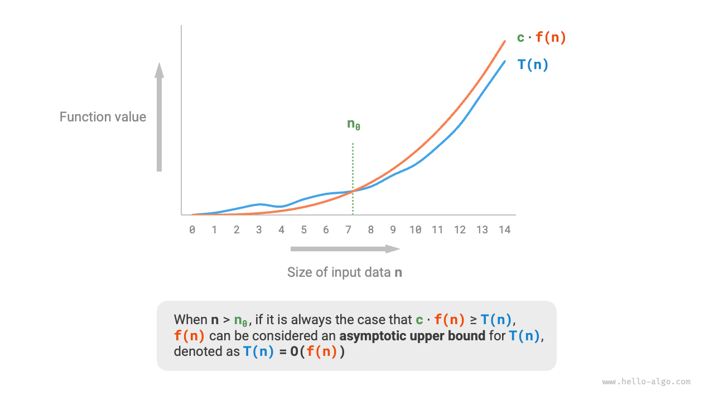
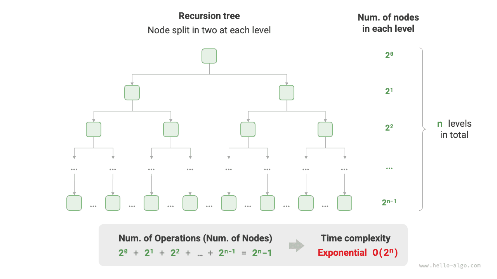
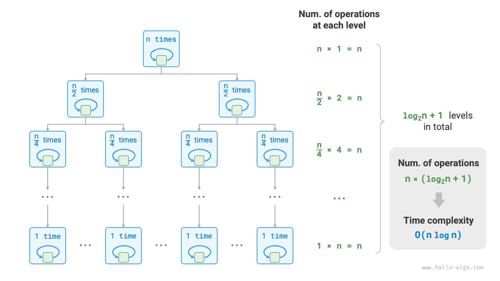
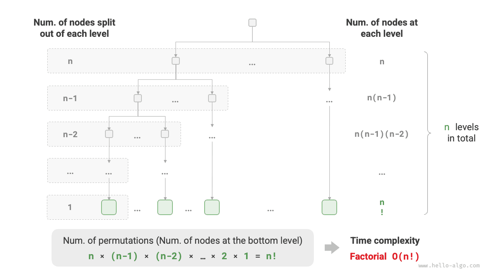

# Độ phức tạp về thời gian

Thời gian chạy có thể phản ánh trực quan và chính xác hiệu quả của thuật toán. Nếu muốn ước tính chính xác thời gian chạy của một đoạn mã, chúng ta nên tiến hành như thế nào?

1. **Xác định nền tảng đang chạy**, bao gồm cấu hình phần cứng, ngôn ngữ lập trình, môi trường hệ thống, v.v. vì những yếu tố này đều ảnh hưởng đến hiệu quả thực thi mã.
2. **Đánh giá thời gian chạy cần thiết cho các hoạt động tính toán khác nhau**, ví dụ: thao tác cộng `+` yêu cầu 1 ns, thao tác nhân `*` yêu cầu 10 ns, thao tác in `print()` yêu cầu 5 ns, v.v.
3. **Đếm tất cả các thao tác tính toán trong mã** và tính tổng thời gian thực hiện của tất cả các thao tác để có được thời gian chạy.

Ví dụ: trong đoạn mã sau, kích thước dữ liệu đầu vào là $n$:

=== "Python"

    ```python title=""
    # On a certain running platform
    def algorithm(n: int):
        a = 2      # 1 ns
        a = a + 1  # 1 ns
        a = a * 2  # 10 ns
        # Loop n times
        for _ in range(n):  # 1 ns
            print(0)        # 5 ns
    ```

=== "C++"

    ```cpp title=""
    // On a certain running platform
    void algorithm(int n) {
        int a = 2;  // 1 ns
        a = a + 1;  // 1 ns
        a = a * 2;  // 10 ns
        // Loop n times
        for (int i = 0; i < n; i++) {  // 1 ns
            cout << 0 << endl;         // 5 ns
        }
    }
    ```

=== "Java"

    ```java title=""
    // On a certain running platform
    void algorithm(int n) {
        int a = 2;  // 1 ns
        a = a + 1;  // 1 ns
        a = a * 2;  // 10 ns
        // Loop n times
        for (int i = 0; i < n; i++) {  // 1 ns
            System.out.println(0);     // 5 ns
        }
    }
    ```

=== "C#"

    ```csharp title=""
    // On a certain running platform
    void Algorithm(int n) {
        int a = 2;  // 1 ns
        a = a + 1;  // 1 ns
        a = a * 2;  // 10 ns
        // Loop n times
        for (int i = 0; i < n; i++) {  // 1 ns
            Console.WriteLine(0);      // 5 ns
        }
    }
    ```

=== "Đi"

    ```go title=""
    // On a certain running platform
    func algorithm(n int) {
        a := 2     // 1 ns
        a = a + 1  // 1 ns
        a = a * 2  // 10 ns
        // Loop n times
        for i := 0; i < n; i++ {  // 1 ns
            fmt.Println(a)        // 5 ns
        }
    }
    ```

=== "Nhanh chóng"

    ```swift title=""
    // On a certain running platform
    func algorithm(n: Int) {
        var a = 2 // 1 ns
        a = a + 1 // 1 ns
        a = a * 2 // 10 ns
        // Loop n times
        for _ in 0 ..< n { // 1 ns
            print(0) // 5 ns
        }
    }
    ```

=== "JS"

    ```javascript title=""
    // On a certain running platform
    function algorithm(n) {
        var a = 2; // 1 ns
        a = a + 1; // 1 ns
        a = a * 2; // 10 ns
        // Loop n times
        for(let i = 0; i < n; i++) { // 1 ns
            console.log(0); // 5 ns
        }
    }
    ```

=== "TS"

    ```typescript title=""
    // On a certain running platform
    function algorithm(n: number): void {
        var a: number = 2; // 1 ns
        a = a + 1; // 1 ns
        a = a * 2; // 10 ns
        // Loop n times
        for(let i = 0; i < n; i++) { // 1 ns
            console.log(0); // 5 ns
        }
    }
    ```

=== "Phi tiêu"

    ```dart title=""
    // On a certain running platform
    void algorithm(int n) {
      int a = 2; // 1 ns
      a = a + 1; // 1 ns
      a = a * 2; // 10 ns
      // Loop n times
      for (int i = 0; i < n; i++) { // 1 ns
        print(0); // 5 ns
      }
    }
    ```

=== "Rỉ sét"

    ```rust title=""
    // On a certain running platform
    fn algorithm(n: i32) {
        let mut a = 2;      // 1 ns
        a = a + 1;          // 1 ns
        a = a * 2;          // 10 ns
        // Loop n times
        for _ in 0..n {     // 1 ns
            println!("{}", 0);  // 5 ns
        }
    }
    ```

=== "C"

    ```c title=""
    // On a certain running platform
    void algorithm(int n) {
        int a = 2;  // 1 ns
        a = a + 1;  // 1 ns
        a = a * 2;  // 10 ns
        // Loop n times
        for (int i = 0; i < n; i++) {   // 1 ns
            printf("%d", 0);            // 5 ns
        }
    }
    ```

=== "Kotlin"

    ```kotlin title=""
    // On a certain running platform
    fun algorithm(n: Int) {
        var a = 2 // 1 ns
        a = a + 1 // 1 ns
        a = a * 2 // 10 ns
        // Loop n times
        for (i in 0..<n) {  // 1 ns
            println(0)      // 5 ns
        }
    }
    ```

=== "Ruby"

    ```ruby title=""
    # On a certain running platform
    def algorithm(n)
        a = 2       # 1 ns
        a = a + 1   # 1 ns
        a = a * 2   # 10 ns
        # Loop n times
        (0...n).each do # 1 ns
            puts 0      # 5 ns
        end
    end
    ```

Theo phương pháp trên, thời gian chạy của thuật toán có thể được lấy là $(6n + 12)$ ns:

$$
1 + 1 + 10 + (1 + 5) \times n = 6n + 12
$$

Tuy nhiên, trên thực tế, **việc cố gắng tính thời gian chạy chính xác của một thuật toán là không thực tế cũng như không thực tế**. Đầu tiên, chúng tôi không muốn ràng buộc thời gian ước tính với nền tảng đang chạy, vì thuật toán cần chạy trên nhiều nền tảng khác nhau. Thứ hai, rất khó để biết thời gian chạy của từng loại hoạt động, điều này khiến quá trình ước tính trở nên vô cùng khó khăn.

## Đếm thời gian Xu hướng tăng trưởng

Phân tích độ phức tạp về thời gian không tính thời gian chạy của thuật toán, **mà tính xu hướng tăng trưởng của thời gian chạy thuật toán khi khối lượng dữ liệu tăng**.

Khái niệm “xu hướng tăng trưởng theo thời gian” khá trừu tượng; hãy để chúng tôi hiểu nó thông qua một ví dụ. Giả sử kích thước dữ liệu đầu vào là $n$ và cho ba thuật toán `A`, `B` và `C`:

=== "Python"

    ```python title=""
    # Time complexity of algorithm A: constant order
    def algorithm_A(n: int):
        print(0)
    # Time complexity of algorithm B: linear order
    def algorithm_B(n: int):
        for _ in range(n):
            print(0)
    # Time complexity of algorithm C: constant order
    def algorithm_C(n: int):
        for _ in range(1000000):
            print(0)
    ```

=== "C++"

    ```cpp title=""
    // Time complexity of algorithm A: constant order
    void algorithm_A(int n) {
        cout << 0 << endl;
    }
    // Time complexity of algorithm B: linear order
    void algorithm_B(int n) {
        for (int i = 0; i < n; i++) {
            cout << 0 << endl;
        }
    }
    // Time complexity of algorithm C: constant order
    void algorithm_C(int n) {
        for (int i = 0; i < 1000000; i++) {
            cout << 0 << endl;
        }
    }
    ```

=== "Java"

    ```java title=""
    // Time complexity of algorithm A: constant order
    void algorithm_A(int n) {
        System.out.println(0);
    }
    // Time complexity of algorithm B: linear order
    void algorithm_B(int n) {
        for (int i = 0; i < n; i++) {
            System.out.println(0);
        }
    }
    // Time complexity of algorithm C: constant order
    void algorithm_C(int n) {
        for (int i = 0; i < 1000000; i++) {
            System.out.println(0);
        }
    }
    ```

=== "C#"

    ```csharp title=""
    // Time complexity of algorithm A: constant order
    void AlgorithmA(int n) {
        Console.WriteLine(0);
    }
    // Time complexity of algorithm B: linear order
    void AlgorithmB(int n) {
        for (int i = 0; i < n; i++) {
            Console.WriteLine(0);
        }
    }
    // Time complexity of algorithm C: constant order
    void AlgorithmC(int n) {
        for (int i = 0; i < 1000000; i++) {
            Console.WriteLine(0);
        }
    }
    ```

=== "Đi"

    ```go title=""
    // Time complexity of algorithm A: constant order
    func algorithm_A(n int) {
        fmt.Println(0)
    }
    // Time complexity of algorithm B: linear order
    func algorithm_B(n int) {
        for i := 0; i < n; i++ {
            fmt.Println(0)
        }
    }
    // Time complexity of algorithm C: constant order
    func algorithm_C(n int) {
        for i := 0; i < 1000000; i++ {
            fmt.Println(0)
        }
    }
    ```

=== "Nhanh chóng"

    ```swift title=""
    // Time complexity of algorithm A: constant order
    func algorithmA(n: Int) {
        print(0)
    }

    // Time complexity of algorithm B: linear order
    func algorithmB(n: Int) {
        for _ in 0 ..< n {
            print(0)
        }
    }

    // Time complexity of algorithm C: constant order
    func algorithmC(n: Int) {
        for _ in 0 ..< 1_000_000 {
            print(0)
        }
    }
    ```

=== "JS"

    ```javascript title=""
    // Time complexity of algorithm A: constant order
    function algorithm_A(n) {
        console.log(0);
    }
    // Time complexity of algorithm B: linear order
    function algorithm_B(n) {
        for (let i = 0; i < n; i++) {
            console.log(0);
        }
    }
    // Time complexity of algorithm C: constant order
    function algorithm_C(n) {
        for (let i = 0; i < 1000000; i++) {
            console.log(0);
        }
    }

    ```

=== "TS"

    ```typescript title=""
    // Time complexity of algorithm A: constant order
    function algorithm_A(n: number): void {
        console.log(0);
    }
    // Time complexity of algorithm B: linear order
    function algorithm_B(n: number): void {
        for (let i = 0; i < n; i++) {
            console.log(0);
        }
    }
    // Time complexity of algorithm C: constant order
    function algorithm_C(n: number): void {
        for (let i = 0; i < 1000000; i++) {
            console.log(0);
        }
    }
    ```

=== "Phi tiêu"

    ```dart title=""
    // Time complexity of algorithm A: constant order
    void algorithmA(int n) {
      print(0);
    }
    // Time complexity of algorithm B: linear order
    void algorithmB(int n) {
      for (int i = 0; i < n; i++) {
        print(0);
      }
    }
    // Time complexity of algorithm C: constant order
    void algorithmC(int n) {
      for (int i = 0; i < 1000000; i++) {
        print(0);
      }
    }
    ```

=== "Rỉ sét"

    ```rust title=""
    // Time complexity of algorithm A: constant order
    fn algorithm_A(n: i32) {
        println!("{}", 0);
    }
    // Time complexity of algorithm B: linear order
    fn algorithm_B(n: i32) {
        for _ in 0..n {
            println!("{}", 0);
        }
    }
    // Time complexity of algorithm C: constant order
    fn algorithm_C(n: i32) {
        for _ in 0..1000000 {
            println!("{}", 0);
        }
    }
    ```

=== "C"

    ```c title=""
    // Time complexity of algorithm A: constant order
    void algorithm_A(int n) {
        printf("%d", 0);
    }
    // Time complexity of algorithm B: linear order
    void algorithm_B(int n) {
        for (int i = 0; i < n; i++) {
            printf("%d", 0);
        }
    }
    // Time complexity of algorithm C: constant order
    void algorithm_C(int n) {
        for (int i = 0; i < 1000000; i++) {
            printf("%d", 0);
        }
    }
    ```

=== "Kotlin"

    ```kotlin title=""
    // Time complexity of algorithm A: constant order
    fun algoritm_A(n: Int) {
        println(0)
    }
    // Time complexity of algorithm B: linear order
    fun algorithm_B(n: Int) {
        for (i in 0..<n){
            println(0)
        }
    }
    // Time complexity of algorithm C: constant order
    fun algorithm_C(n: Int) {
        for (i in 0..<1000000) {
            println(0)
        }
    }
    ```

=== "Ruby"

    ```ruby title=""
    # Time complexity of algorithm A: constant order
    def algorithm_A(n)
        puts 0
    end

    # Time complexity of algorithm B: linear order
    def algorithm_B(n)
        (0...n).each { puts 0 }
    end

    # Time complexity of algorithm C: constant order
    def algorithm_C(n)
        (0...1_000_000).each { puts 0 }
    end
    ```

Hình dưới đây cho thấy độ phức tạp về thời gian của ba hàm thuật toán trên.

- Thuật toán `A` chỉ có thao tác in $1$ và thời gian chạy của thuật toán không tăng khi $n$ tăng. Chúng tôi gọi độ phức tạp về thời gian của thuật toán này là "thứ tự không đổi".
- Trong thuật toán `B`, thao tác in cần lặp $n$ lần và thời gian chạy của thuật toán tăng tuyến tính khi $n$ tăng. Độ phức tạp về thời gian của thuật toán này được gọi là "thứ tự tuyến tính".
- Trong thuật toán `C`, thao tác in cần lặp $1000000$ lần. Mặc dù thời gian chạy rất dài nhưng nó độc lập với kích thước dữ liệu đầu vào $n$. Do đó, độ phức tạp về thời gian của `C` giống như `A`, vẫn là "thứ tự không đổi".


So với việc đếm trực tiếp thời gian chạy của thuật toán, đặc điểm của phân tích độ phức tạp thời gian là gì?

- **Độ phức tạp về thời gian có thể đánh giá hiệu quả của thuật toán một cách hiệu quả**. Ví dụ: thời gian chạy của thuật toán `B` tăng tuyến tính; khi $n > 1$ thì nó chậm hơn thuật toán `A` và khi $n > 1000000$ thì nó chậm hơn thuật toán `C`. Trên thực tế, miễn là kích thước dữ liệu đầu vào $n$ đủ lớn, thuật toán có độ phức tạp "bậc không đổi" sẽ luôn vượt trội so với thuật toán có độ phức tạp "bậc tuyến tính", đây chính xác là ý nghĩa của xu hướng tăng trưởng theo thời gian.
- **Phương pháp suy diễn độ phức tạp thời gian đơn giản hơn**. Rõ ràng, nền tảng đang chạy và các loại hoạt động tính toán đều không liên quan đến xu hướng tăng trưởng thời gian chạy của thuật toán. Do đó, trong phân tích độ phức tạp về thời gian, chúng ta có thể đơn giản coi thời gian thực hiện của tất cả các thao tác tính toán là cùng một "đơn vị thời gian", giảm việc "theo dõi thời gian chạy của từng thao tác" thành "đếm số lượng thao tác", điều này giúp giảm đáng kể độ khó của việc ước tính.
- **Độ phức tạp về thời gian cũng có những hạn chế nhất định**. Ví dụ: mặc dù các thuật toán `A` và `C` có cùng độ phức tạp về thời gian nhưng thời gian chạy thực tế của chúng khác nhau đáng kể. Tương tự, mặc dù thuật toán `B` có độ phức tạp về thời gian cao hơn `C`, nhưng khi kích thước dữ liệu đầu vào $n$ nhỏ, thuật toán `B` rõ ràng vượt trội hơn thuật toán `C`. Trong những trường hợp như vậy, thường rất khó để đánh giá hiệu quả của thuật toán chỉ dựa trên độ phức tạp về thời gian. Tất nhiên, bất chấp những vấn đề trên, phân tích độ phức tạp vẫn là phương pháp hiệu quả nhất và được sử dụng phổ biến nhất để đánh giá hiệu quả của thuật toán.

## Giới hạn trên tiệm cận của hàm

Cho một hàm có kích thước đầu vào $n$:

=== "Python"

    ```python title=""
    def algorithm(n: int):
        a = 1      # +1
        a = a + 1  # +1
        a = a * 2  # +1
        # Loop n times
        for i in range(n):  # +1
            print(0)        # +1
    ```

=== "C++"

    ```cpp title=""
    void algorithm(int n) {
        int a = 1;  // +1
        a = a + 1;  // +1
        a = a * 2;  // +1
        // Loop n times
        for (int i = 0; i < n; i++) { // +1 (i++ is executed each round)
            cout << 0 << endl;    // +1
        }
    }
    ```

=== "Java"

    ```java title=""
    void algorithm(int n) {
        int a = 1;  // +1
        a = a + 1;  // +1
        a = a * 2;  // +1
        // Loop n times
        for (int i = 0; i < n; i++) { // +1 (i++ is executed each round)
            System.out.println(0);    // +1
        }
    }
    ```

=== "C#"

    ```csharp title=""
    void Algorithm(int n) {
        int a = 1;  // +1
        a = a + 1;  // +1
        a = a * 2;  // +1
        // Loop n times
        for (int i = 0; i < n; i++) {   // +1 (i++ is executed each round)
            Console.WriteLine(0);   // +1
        }
    }
    ```

=== "Đi"

    ```go title=""
    func algorithm(n int) {
        a := 1      // +1
        a = a + 1   // +1
        a = a * 2   // +1
        // Loop n times
        for i := 0; i < n; i++ {   // +1
            fmt.Println(a)         // +1
        }
    }
    ```

=== "Nhanh chóng"

    ```swift title=""
    func algorithm(n: Int) {
        var a = 1 // +1
        a = a + 1 // +1
        a = a * 2 // +1
        // Loop n times
        for _ in 0 ..< n { // +1
            print(0) // +1
        }
    }
    ```

=== "JS"

    ```javascript title=""
    function algorithm(n) {
        var a = 1; // +1
        a += 1; // +1
        a *= 2; // +1
        // Loop n times
        for(let i = 0; i < n; i++){ // +1 (i++ is executed each round)
            console.log(0); // +1
        }
    }
    ```

=== "TS"

    ```typescript title=""
    function algorithm(n: number): void{
        var a: number = 1; // +1
        a += 1; // +1
        a *= 2; // +1
        // Loop n times
        for(let i = 0; i < n; i++){ // +1 (i++ is executed each round)
            console.log(0); // +1
        }
    }
    ```

=== "Phi tiêu"

    ```dart title=""
    void algorithm(int n) {
      int a = 1; // +1
      a = a + 1; // +1
      a = a * 2; // +1
      // Loop n times
      for (int i = 0; i < n; i++) { // +1 (i++ is executed each round)
        print(0); // +1
      }
    }
    ```

=== "Rỉ sét"

    ```rust title=""
    fn algorithm(n: i32) {
        let mut a = 1;   // +1
        a = a + 1;      // +1
        a = a * 2;      // +1

        // Loop n times
        for _ in 0..n { // +1 (i++ is executed each round)
            println!("{}", 0); // +1
        }
    }
    ```

=== "C"

    ```c title=""
    void algorithm(int n) {
        int a = 1;  // +1
        a = a + 1;  // +1
        a = a * 2;  // +1
        // Loop n times
        for (int i = 0; i < n; i++) {   // +1 (i++ is executed each round)
            printf("%d", 0);            // +1
        }
    }
    ```

=== "Kotlin"

    ```kotlin title=""
    fun algorithm(n: Int) {
        var a = 1 // +1
        a = a + 1 // +1
        a = a * 2 // +1
        // Loop n times
        for (i in 0..<n) { // +1 (i++ is executed each round)
            println(0) // +1
        }
    }
    ```

=== "Ruby"

    ```ruby title=""
    def algorithm(n)
        a = 1       # +1
        a = a + 1   # +1
        a = a * 2   # +1
        # Loop n times
        (0...n).each do # +1
            puts 0      # +1
        end
    end
    ```

Giả sử số lần thực hiện của thuật toán là hàm của kích thước dữ liệu đầu vào $n$, ký hiệu là $T(n)$. Khi đó số lần thực hiện của hàm trên là:

$$
T(n) = 3 + 2n
$$

$T(n)$ là một hàm tuyến tính, biểu thị rằng xu hướng tăng trưởng thời gian chạy của nó là tuyến tính và do đó độ phức tạp về thời gian của nó là bậc tuyến tính.

Chúng tôi biểu thị độ phức tạp về thời gian của thứ tự tuyến tính là $O(n)$. Ký hiệu toán học này được gọi là <u>ký hiệu big-$O$</u>, biểu thị <u>giới hạn tiệm cận trên</u> của hàm $T(n)$.

Phân tích độ phức tạp về thời gian về cơ bản tính toán giới hạn tiệm cận trên của "số phép toán $T(n)$", có định nghĩa toán học rõ ràng.

!!! lưu ý "Giới hạn trên tiệm cận của hàm số"

Nếu tồn tại các số thực dương $c$ và $n_0$ sao cho với mọi $n > n_0$, chúng ta có $T(n) \leq c \cdot f(n)$, thì $f(n)$ có thể được coi là cận trên tiệm cận của $T(n)$, ký hiệu là $T(n) = O(f(n))$.

Như thể hiện trong hình bên dưới, việc tính giới hạn trên tiệm cận là tìm một hàm $f(n)$ sao cho khi $n$ tiến tới vô cùng, $T(n)$ và $f(n)$ có cùng mức tăng trưởng, chỉ khác nhau một hệ số không đổi $c$.



## Phương pháp phái sinh

Ý tưởng về giới hạn trên tiệm cận có phần mang tính toán học. Nếu bạn cảm thấy mình chưa hiểu hết về nó, đừng lo lắng. Trước tiên chúng ta có thể nắm vững phương pháp đạo hàm và dần dần nắm bắt được ý nghĩa toán học của nó thông qua thực hành liên tục.

Theo định nghĩa, sau khi xác định $f(n)$, chúng ta có thể thu được độ phức tạp thời gian $O(f(n))$. Vậy làm cách nào để xác định giới hạn trên tiệm cận $f(n)$? Nhìn chung, nó được chia thành hai bước: đầu tiên đếm số lượng thao tác, sau đó xác định giới hạn tiệm cận trên.

### Bước 1: Đếm Số Thao Tác

Đối với mã, đếm từ trên xuống dưới theo dòng. Tuy nhiên, vì hệ số không đổi $c$ trong $c \cdot f(n)$ ở trên có thể có kích thước bất kỳ, **các hệ số và số hạng không đổi trong số lượng phép toán $T(n)$ đều có thể bị bỏ qua**. Theo nguyên tắc này, có thể tóm tắt các kỹ thuật đơn giản hóa việc đếm sau đây.

1. **Bỏ qua các hằng số trong $T(n)$**. Vì chúng đều độc lập với $n$ nên chúng không ảnh hưởng đến độ phức tạp về thời gian.
2. **Bỏ qua tất cả các hệ số**. Ví dụ: lặp $2n$ lần, $5n + 1$ lần, v.v., tất cả đều có thể được đơn giản hóa thành $n$ lần, vì hệ số trước $n$ không ảnh hưởng đến độ phức tạp về thời gian.
3. **Sử dụng phép nhân cho các vòng lặp lồng nhau**. Tổng số thao tác bằng tích của số thao tác ở vòng lặp bên ngoài và vòng lặp bên trong, với mỗi lớp vòng lặp vẫn có thể áp dụng các kỹ thuật `1.` và `2.` riêng biệt.

Cho một hàm, chúng ta có thể sử dụng các kỹ thuật trên để đếm số lượng thao tác:

=== "Python"

    ```python title=""
    def algorithm(n: int):
        a = 1      # +0 (Technique 1)
        a = a + n  # +0 (Technique 1)
        # +n (Technique 2)
        for i in range(5 * n + 1):
            print(0)
        # +n*n (Technique 3)
        for i in range(2 * n):
            for j in range(n + 1):
                print(0)
    ```

=== "C++"

    ```cpp title=""
    void algorithm(int n) {
        int a = 1;  // +0 (Technique 1)
        a = a + n;  // +0 (Technique 1)
        // +n (Technique 2)
        for (int i = 0; i < 5 * n + 1; i++) {
            cout << 0 << endl;
        }
        // +n*n (Technique 3)
        for (int i = 0; i < 2 * n; i++) {
            for (int j = 0; j < n + 1; j++) {
                cout << 0 << endl;
            }
        }
    }
    ```

=== "Java"

    ```java title=""
    void algorithm(int n) {
        int a = 1;  // +0 (Technique 1)
        a = a + n;  // +0 (Technique 1)
        // +n (Technique 2)
        for (int i = 0; i < 5 * n + 1; i++) {
            System.out.println(0);
        }
        // +n*n (Technique 3)
        for (int i = 0; i < 2 * n; i++) {
            for (int j = 0; j < n + 1; j++) {
                System.out.println(0);
            }
        }
    }
    ```

=== "C#"

    ```csharp title=""
    void Algorithm(int n) {
        int a = 1;  // +0 (Technique 1)
        a = a + n;  // +0 (Technique 1)
        // +n (Technique 2)
        for (int i = 0; i < 5 * n + 1; i++) {
            Console.WriteLine(0);
        }
        // +n*n (Technique 3)
        for (int i = 0; i < 2 * n; i++) {
            for (int j = 0; j < n + 1; j++) {
                Console.WriteLine(0);
            }
        }
    }
    ```

=== "Đi"

    ```go title=""
    func algorithm(n int) {
        a := 1     // +0 (Technique 1)
        a = a + n  // +0 (Technique 1)
        // +n (Technique 2)
        for i := 0; i < 5 * n + 1; i++ {
            fmt.Println(0)
        }
        // +n*n (Technique 3)
        for i := 0; i < 2 * n; i++ {
            for j := 0; j < n + 1; j++ {
                fmt.Println(0)
            }
        }
    }
    ```

=== "Nhanh chóng"

    ```swift title=""
    func algorithm(n: Int) {
        var a = 1 // +0 (Technique 1)
        a = a + n // +0 (Technique 1)
        // +n (Technique 2)
        for _ in 0 ..< (5 * n + 1) {
            print(0)
        }
        // +n*n (Technique 3)
        for _ in 0 ..< (2 * n) {
            for _ in 0 ..< (n + 1) {
                print(0)
            }
        }
    }
    ```

=== "JS"

    ```javascript title=""
    function algorithm(n) {
        let a = 1;  // +0 (Technique 1)
        a = a + n;  // +0 (Technique 1)
        // +n (Technique 2)
        for (let i = 0; i < 5 * n + 1; i++) {
            console.log(0);
        }
        // +n*n (Technique 3)
        for (let i = 0; i < 2 * n; i++) {
            for (let j = 0; j < n + 1; j++) {
                console.log(0);
            }
        }
    }
    ```

=== "TS"

    ```typescript title=""
    function algorithm(n: number): void {
        let a = 1;  // +0 (Technique 1)
        a = a + n;  // +0 (Technique 1)
        // +n (Technique 2)
        for (let i = 0; i < 5 * n + 1; i++) {
            console.log(0);
        }
        // +n*n (Technique 3)
        for (let i = 0; i < 2 * n; i++) {
            for (let j = 0; j < n + 1; j++) {
                console.log(0);
            }
        }
    }
    ```

=== "Phi tiêu"

    ```dart title=""
    void algorithm(int n) {
      int a = 1; // +0 (Technique 1)
      a = a + n; // +0 (Technique 1)
      // +n (Technique 2)
      for (int i = 0; i < 5 * n + 1; i++) {
        print(0);
      }
      // +n*n (Technique 3)
      for (int i = 0; i < 2 * n; i++) {
        for (int j = 0; j < n + 1; j++) {
          print(0);
        }
      }
    }
    ```

=== "Rỉ sét"

    ```rust title=""
    fn algorithm(n: i32) {
        let mut a = 1;     // +0 (Technique 1)
        a = a + n;        // +0 (Technique 1)

        // +n (Technique 2)
        for i in 0..(5 * n + 1) {
            println!("{}", 0);
        }

        // +n*n (Technique 3)
        for i in 0..(2 * n) {
            for j in 0..(n + 1) {
                println!("{}", 0);
            }
        }
    }
    ```

=== "C"

    ```c title=""
    void algorithm(int n) {
        int a = 1;  // +0 (Technique 1)
        a = a + n;  // +0 (Technique 1)
        // +n (Technique 2)
        for (int i = 0; i < 5 * n + 1; i++) {
            printf("%d", 0);
        }
        // +n*n (Technique 3)
        for (int i = 0; i < 2 * n; i++) {
            for (int j = 0; j < n + 1; j++) {
                printf("%d", 0);
            }
        }
    }
    ```

=== "Kotlin"

    ```kotlin title=""
    fun algorithm(n: Int) {
        var a = 1   // +0 (Technique 1)
        a = a + n   // +0 (Technique 1)
        // +n (Technique 2)
        for (i in 0..<5 * n + 1) {
            println(0)
        }
        // +n*n (Technique 3)
        for (i in 0..<2 * n) {
            for (j in 0..<n + 1) {
                println(0)
            }
        }
    }
    ```

=== "Ruby"

    ```ruby title=""
    def algorithm(n)
        a = 1       # +0 (Technique 1)
        a = a + n   # +0 (Technique 1)
        # +n (Technique 2)
        (0...(5 * n + 1)).each do { puts 0 }
        # +n*n (Technique 3)
        (0...(2 * n)).each do
            (0...(n + 1)).each do { puts 0 }
        end
    end
    ```

Công thức sau đây thể hiện kết quả đếm trước và sau khi sử dụng các kỹ thuật trên; cả hai đều có độ phức tạp về thời gian là $O(n^2)$.

$$
\bắt đầu{căn chỉnh}
T(n) & = 2n(n + 1) + (5n + 1) + 2 & \text{Đếm đầy đủ (-.-|||)} \newline
& = 2n^2 + 7n + 3 \newline
T(n) & = n^2 + n & \text{Số đơn giản hóa (o.O)}
\end{căn chỉnh}
$$

### Bước 2: Xác định giới hạn tiệm cận trên

**Độ phức tạp về thời gian được xác định bởi số hạng có thứ tự cao nhất trong $T(n)$**. Điều này là do khi $n$ tiến tới vô cùng, số hạng bậc cao nhất sẽ đóng vai trò chủ đạo và ảnh hưởng của các số hạng khác có thể bị bỏ qua.

Bảng dưới đây trình bày một số ví dụ, trong đó một số giá trị phóng đại được sử dụng để nhấn mạnh kết luận rằng "các hệ số không thể làm lung lay trật tự". Khi $n$ tiến tới vô cùng, các hằng số này trở nên không có ý nghĩa.

<p align="center"> Table <id> &nbsp; Time complexities corresponding to different numbers of operations </p>

| Số lượng hoạt động $T(n)$ | Độ phức tạp thời gian $O(f(n))$ |
| ---------------------- | -------------------- |
| $100000$ | $O(1)$ |
| $3n + 2$ | $O(n)$ |
| $2n^2 + 3n + 2$ | $O(n^2)$ |
| $n^3 + 10000n^2$ | $O(n^3)$ |
| $2^n + 10000n^{10000}$ | $O(2^n)$ |

## Các loại phổ biến

Đặt kích thước dữ liệu đầu vào là $n$. Các loại độ phức tạp thời gian phổ biến được thể hiện trong hình bên dưới (sắp xếp theo thứ tự từ thấp đến cao).

$$
\bắt đầu{căn chỉnh}
& O(1) < O(\log n) < O(n) < O(n \log n) < O(n^2) < O(2^n) < O(n!) \newline
& \text{Hằng số} < \text{Logarit} < \text{Tuyến tính} < \text{Số tuyến tính} < \text{Quadratic} < \text{Exentials} < \text{Factorial}
\end{căn chỉnh}
$$


### Lệnh cố định $O(1)$

Số lượng thao tác theo thứ tự không đổi không phụ thuộc vào kích thước dữ liệu đầu vào $n$, nghĩa là nó không thay đổi khi $n$ thay đổi.

Trong hàm sau, mặc dù giá trị của `size` có thể lớn, nhưng nó độc lập với kích thước dữ liệu đầu vào $n$, do đó độ phức tạp về thời gian vẫn là $O(1)$:

=== "Python"
    ```python title="time_complexity.py"
    def constant(n: int) -> int:
        """Constant order"""
        count = 0
        size = 100000
        for _ in range(size):
            count += 1
        return count
    ```
=== "C++"
    ```cpp title="time_complexity.cpp"
    int constant(int n) {
        int count = 0;
        int size = 100000;
        for (int i = 0; i < size; i++)
            count++;
        return count;
    }
    ```
=== "Java"
    ```java title="time_complexity.java"
    static int constant(int n) {
            int count = 0;
            int size = 100000;
            for (int i = 0; i < size; i++)
                count++;
            return count;
        }
    ```
=== "C#"
    ```csharp title="time_complexity.cs"
    int Constant(int n) {
            int count = 0;
            int size = 100000;
            for (int i = 0; i < size; i++)
                count++;
            return count;
        }
    ```
=== "Go"
    ```go title="time_complexity.go"
    func constant(n int) int {
    	count := 0
    	size := 100000
    	for i := 0; i < size; i++ {
    		count++
    	}
    	return count
    }
    ```
=== "Swift"
    ```swift title="time_complexity.swift"
    func constant(n: Int) -> Int {
        var count = 0
        let size = 100_000
        for _ in 0 ..< size {
            count += 1
        }
        return count
    }
    ```
=== "JS"
    ```javascript title="time_complexity.js"
    function constant(n) {
        let count = 0;
        const size = 100000;
        for (let i = 0; i < size; i++) count++;
        return count;
    }
    ```
=== "TS"
    ```typescript title="time_complexity.ts"
    function constant(n: number): number {
        let count = 0;
        const size = 100000;
        for (let i = 0; i < size; i++) count++;
        return count;
    }
    ```
=== "Dart"
    ```dart title="time_complexity.dart"
    int constant(int n) {
      int count = 0;
      int size = 100000;
      for (var i = 0; i < size; i++) {
        count++;
      }
      return count;
    }
    ```
=== "Rust"
    ```rust title="time_complexity.rs"
    fn constant(n: i32) -> i32 {
        _ = n;
        let mut count = 0;
        let size = 100_000;
        for _ in 0..size {
            count += 1;
        }
        count
    }
    ```
=== "C"
    ```c title="time_complexity.c"
    int constant(int n) {
        int count = 0;
        int size = 100000;
        int i = 0;
        for (int i = 0; i < size; i++) {
            count++;
        }
        return count;
    }
    ```
=== "Kotlin"
    ```kotlin title="time_complexity.kt"
    fun constant(n: Int): Int {
        var count = 0
        val size = 100000
        for (i in 0..<size)
            count++
        return count
    }
    ```
=== "Ruby"
    ```ruby title="time_complexity.rb"
    ### Constant time ###
    def constant(n)
      count = 0
      size = 100000
    
      (0...size).each { count += 1 }
    
      count
    ```


### Thứ tự tuyến tính $O(n)$

Số lượng thao tác theo thứ tự tuyến tính tăng tuyến tính tương ứng với kích thước dữ liệu đầu vào $n$. Thứ tự tuyến tính thường xuất hiện trong các vòng lặp một lớp:

=== "Python"
    ```python title="time_complexity.py"
    def linear(n: int) -> int:
        """Linear order"""
        count = 0
        for _ in range(n):
            count += 1
        return count
    ```
=== "C++"
    ```cpp title="time_complexity.cpp"
    int linear(int n) {
        int count = 0;
        for (int i = 0; i < n; i++)
            count++;
        return count;
    }
    ```
=== "Java"
    ```java title="time_complexity.java"
    static int linear(int n) {
            int count = 0;
            for (int i = 0; i < n; i++)
                count++;
            return count;
        }
    ```
=== "C#"
    ```csharp title="time_complexity.cs"
    int Linear(int n) {
            int count = 0;
            for (int i = 0; i < n; i++)
                count++;
            return count;
        }
    ```
=== "Go"
    ```go title="time_complexity.go"
    func linear(n int) int {
    	count := 0
    	for i := 0; i < n; i++ {
    		count++
    	}
    	return count
    }
    ```
=== "Swift"
    ```swift title="time_complexity.swift"
    func linear(n: Int) -> Int {
        var count = 0
        for _ in 0 ..< n {
            count += 1
        }
        return count
    }
    ```
=== "JS"
    ```javascript title="time_complexity.js"
    function linear(n) {
        let count = 0;
        for (let i = 0; i < n; i++) count++;
        return count;
    }
    ```
=== "TS"
    ```typescript title="time_complexity.ts"
    function linear(n: number): number {
        let count = 0;
        for (let i = 0; i < n; i++) count++;
        return count;
    }
    ```
=== "Dart"
    ```dart title="time_complexity.dart"
    int linear(int n) {
      int count = 0;
      for (var i = 0; i < n; i++) {
        count++;
      }
      return count;
    }
    ```
=== "Rust"
    ```rust title="time_complexity.rs"
    fn linear(n: i32) -> i32 {
        let mut count = 0;
        for _ in 0..n {
            count += 1;
        }
        count
    }
    ```
=== "C"
    ```c title="time_complexity.c"
    int linear(int n) {
        int count = 0;
        for (int i = 0; i < n; i++) {
            count++;
        }
        return count;
    }
    ```
=== "Kotlin"
    ```kotlin title="time_complexity.kt"
    fun linear(n: Int): Int {
        var count = 0
        for (i in 0..<n)
            count++
        return count
    }
    ```
=== "Ruby"
    ```ruby title="time_complexity.rb"
    ### Linear time ###
    def linear(n)
      count = 0
      (0...n).each { count += 1 }
      count
    ```


Các hoạt động như duyệt mảng và duyệt danh sách liên kết có độ phức tạp về thời gian là $O(n)$, trong đó $n$ là độ dài của mảng hoặc danh sách liên kết:

=== "Python"
    ```python title="time_complexity.py"
    def array_traversal(nums: list[int]) -> int:
        """Linear order (traversing array)"""
        count = 0
        # Number of iterations is proportional to the array length
        for num in nums:
            count += 1
        return count
    ```
=== "C++"
    ```cpp title="time_complexity.cpp"
    int arrayTraversal(vector<int> &nums) {
        int count = 0;
        // Number of iterations is proportional to the array length
        for (int num : nums) {
            count++;
        }
        return count;
    }
    ```
=== "Java"
    ```java title="time_complexity.java"
    static int arrayTraversal(int[] nums) {
            int count = 0;
            // Number of iterations is proportional to the array length
            for (int num : nums) {
                count++;
            }
            return count;
        }
    ```
=== "C#"
    ```csharp title="time_complexity.cs"
    int ArrayTraversal(int[] nums) {
            int count = 0;
            // Number of iterations is proportional to the array length
            foreach (int num in nums) {
                count++;
            }
            return count;
        }
    ```
=== "Go"
    ```go title="time_complexity.go"
    func arrayTraversal(nums []int) int {
    	count := 0
    	// Number of iterations is proportional to the array length
    	for range nums {
    		count++
    	}
    	return count
    }
    ```
=== "Swift"
    ```swift title="time_complexity.swift"
    func arrayTraversal(nums: [Int]) -> Int {
        var count = 0
        // Number of iterations is proportional to the array length
        for _ in nums {
            count += 1
        }
        return count
    }
    ```
=== "JS"
    ```javascript title="time_complexity.js"
    function arrayTraversal(nums) {
        let count = 0;
        // Number of iterations is proportional to the array length
        for (let i = 0; i < nums.length; i++) {
            count++;
        }
        return count;
    }
    ```
=== "TS"
    ```typescript title="time_complexity.ts"
    function arrayTraversal(nums: number[]): number {
        let count = 0;
        // Number of iterations is proportional to the array length
        for (let i = 0; i < nums.length; i++) {
            count++;
        }
        return count;
    }
    ```
=== "Dart"
    ```dart title="time_complexity.dart"
    int arrayTraversal(List<int> nums) {
      int count = 0;
      // Number of iterations is proportional to the array length
      for (var _num in nums) {
        count++;
      }
      return count;
    }
    ```
=== "Rust"
    ```rust title="time_complexity.rs"
    fn array_traversal(nums: &[i32]) -> i32 {
        let mut count = 0;
        // Number of iterations is proportional to the array length
        for _ in nums {
            count += 1;
        }
        count
    }
    ```
=== "C"
    ```c title="time_complexity.c"
    int arrayTraversal(int *nums, int n) {
        int count = 0;
        // Number of iterations is proportional to the array length
        for (int i = 0; i < n; i++) {
            count++;
        }
        return count;
    }
    ```
=== "Kotlin"
    ```kotlin title="time_complexity.kt"
    fun arrayTraversal(nums: IntArray): Int {
        var count = 0
        // Number of iterations is proportional to the array length
        for (num in nums) {
            count++
        }
        return count
    }
    ```
=== "Ruby"
    ```ruby title="time_complexity.rb"
    ### Linear time (array traversal) ###
    def array_traversal(nums)
      count = 0
    
      # Number of iterations is proportional to the array length
      for num in nums
        count += 1
      end
    
      count
    ```


Điều đáng lưu ý là **kích thước dữ liệu đầu vào $n$ phải được xác định theo loại dữ liệu đầu vào**. Ví dụ, trong ví dụ đầu tiên, biến $n$ là kích thước dữ liệu đầu vào; trong ví dụ thứ hai, độ dài mảng $n$ là kích thước dữ liệu.

### Thứ tự bậc hai $O(n^2)$

Số lượng phép toán theo thứ tự bậc hai tăng theo bậc hai tương ứng với kích thước dữ liệu đầu vào $n$. Thứ tự bậc hai thường xuất hiện trong các vòng lặp lồng nhau, trong đó cả vòng lặp bên ngoài và bên trong đều có độ phức tạp về thời gian là $O(n)$, dẫn đến độ phức tạp về thời gian tổng thể là $O(n^2)$:

=== "Python"
    ```python title="time_complexity.py"
    def quadratic(n: int) -> int:
        """Quadratic order"""
        count = 0
        # Number of iterations is quadratically related to the data size n
        for i in range(n):
            for j in range(n):
                count += 1
        return count
    ```
=== "C++"
    ```cpp title="time_complexity.cpp"
    int quadratic(int n) {
        int count = 0;
        // Number of iterations is quadratically related to the data size n
        for (int i = 0; i < n; i++) {
            for (int j = 0; j < n; j++) {
                count++;
            }
        }
        return count;
    }
    ```
=== "Java"
    ```java title="time_complexity.java"
    static int quadratic(int n) {
            int count = 0;
            // Number of iterations is quadratically related to the data size n
            for (int i = 0; i < n; i++) {
                for (int j = 0; j < n; j++) {
                    count++;
                }
            }
            return count;
        }
    ```
=== "C#"
    ```csharp title="time_complexity.cs"
    int Quadratic(int n) {
            int count = 0;
            // Number of iterations is quadratically related to the data size n
            for (int i = 0; i < n; i++) {
                for (int j = 0; j < n; j++) {
                    count++;
                }
            }
            return count;
        }
    ```
=== "Go"
    ```go title="time_complexity.go"
    func quadratic(n int) int {
    	count := 0
    	// Number of iterations is quadratically related to the data size n
    	for i := 0; i < n; i++ {
    		for j := 0; j < n; j++ {
    			count++
    		}
    	}
    	return count
    }
    ```
=== "Swift"
    ```swift title="time_complexity.swift"
    func quadratic(n: Int) -> Int {
        var count = 0
        // Number of iterations is quadratically related to the data size n
        for _ in 0 ..< n {
            for _ in 0 ..< n {
                count += 1
            }
        }
        return count
    }
    ```
=== "JS"
    ```javascript title="time_complexity.js"
    function quadratic(n) {
        let count = 0;
        // Number of iterations is quadratically related to the data size n
        for (let i = 0; i < n; i++) {
            for (let j = 0; j < n; j++) {
                count++;
            }
        }
        return count;
    }
    ```
=== "TS"
    ```typescript title="time_complexity.ts"
    function quadratic(n: number): number {
        let count = 0;
        // Number of iterations is quadratically related to the data size n
        for (let i = 0; i < n; i++) {
            for (let j = 0; j < n; j++) {
                count++;
            }
        }
        return count;
    }
    ```
=== "Dart"
    ```dart title="time_complexity.dart"
    int quadratic(int n) {
      int count = 0;
      // Number of iterations is quadratically related to the data size n
      for (int i = 0; i < n; i++) {
        for (int j = 0; j < n; j++) {
          count++;
        }
      }
      return count;
    }
    ```
=== "Rust"
    ```rust title="time_complexity.rs"
    fn quadratic(n: i32) -> i32 {
        let mut count = 0;
        // Number of iterations is quadratically related to the data size n
        for _ in 0..n {
            for _ in 0..n {
                count += 1;
            }
        }
        count
    }
    ```
=== "C"
    ```c title="time_complexity.c"
    int quadratic(int n) {
        int count = 0;
        // Number of iterations is quadratically related to the data size n
        for (int i = 0; i < n; i++) {
            for (int j = 0; j < n; j++) {
                count++;
            }
        }
        return count;
    }
    ```
=== "Kotlin"
    ```kotlin title="time_complexity.kt"
    fun quadratic(n: Int): Int {
        var count = 0
        // Number of iterations is quadratically related to the data size n
        for (i in 0..<n) {
            for (j in 0..<n) {
                count++
            }
        }
        return count
    }
    ```
=== "Ruby"
    ```ruby title="time_complexity.rb"
    ### Quadratic time ###
    def quadratic(n)
      count = 0
    
      # Number of iterations is quadratically related to the data size n
      for i in 0...n
        for j in 0...n
          count += 1
        end
      end
    
      count
    ```


Hình dưới đây so sánh độ phức tạp về thời gian của bậc không đổi, bậc tuyến tính và bậc hai.


Lấy tính năng sắp xếp bong bóng làm ví dụ, vòng lặp bên ngoài thực hiện $n - 1$ lần và vòng lặp bên trong thực hiện $n-1$, $n-2$, $\dots$, $2$, $1$ lần, trung bình là $n / 2$ lần, dẫn đến độ phức tạp về thời gian là $O((n - 1) n / 2) = O(n^2)$:

=== "Python"
    ```python title="time_complexity.py"
    def bubble_sort(nums: list[int]) -> int:
        """Quadratic order (bubble sort)"""
        count = 0  # Counter
        # Outer loop: unsorted range is [0, i]
        for i in range(len(nums) - 1, 0, -1):
            # Inner loop: swap the largest element in the unsorted range [0, i] to the rightmost end of that range
            for j in range(i):
                if nums[j] > nums[j + 1]:
                    # Swap nums[j] and nums[j + 1]
                    tmp: int = nums[j]
                    nums[j] = nums[j + 1]
                    nums[j + 1] = tmp
                    count += 3  # Element swap includes 3 unit operations
        return count
    ```
=== "C++"
    ```cpp title="time_complexity.cpp"
    int bubbleSort(vector<int> &nums) {
        int count = 0; // Counter
        // Outer loop: unsorted range is [0, i]
        for (int i = nums.size() - 1; i > 0; i--) {
            // Inner loop: swap the largest element in the unsorted range [0, i] to the rightmost end of that range
            for (int j = 0; j < i; j++) {
                if (nums[j] > nums[j + 1]) {
                    // Swap nums[j] and nums[j + 1]
                    int tmp = nums[j];
                    nums[j] = nums[j + 1];
                    nums[j + 1] = tmp;
                    count += 3; // Element swap includes 3 unit operations
                }
            }
        }
        return count;
    }
    ```
=== "Java"
    ```java title="time_complexity.java"
    static int bubbleSort(int[] nums) {
            int count = 0; // Counter
            // Outer loop: unsorted range is [0, i]
            for (int i = nums.length - 1; i > 0; i--) {
                // Inner loop: swap the largest element in the unsorted range [0, i] to the rightmost end of that range
                for (int j = 0; j < i; j++) {
                    if (nums[j] > nums[j + 1]) {
                        // Swap nums[j] and nums[j + 1]
                        int tmp = nums[j];
                        nums[j] = nums[j + 1];
                        nums[j + 1] = tmp;
                        count += 3; // Element swap includes 3 unit operations
                    }
                }
            }
            return count;
        }
    ```
=== "C#"
    ```csharp title="time_complexity.cs"
    int BubbleSort(int[] nums) {
            int count = 0;  // Counter
            // Outer loop: unsorted range is [0, i]
            for (int i = nums.Length - 1; i > 0; i--) {
                // Inner loop: swap the largest element in the unsorted range [0, i] to the rightmost end of that range
                for (int j = 0; j < i; j++) {
                    if (nums[j] > nums[j + 1]) {
                        // Swap nums[j] and nums[j + 1]
                        (nums[j + 1], nums[j]) = (nums[j], nums[j + 1]);
                        count += 3;  // Element swap includes 3 unit operations
                    }
                }
            }
            return count;
        }
    ```
=== "Go"
    ```go title="time_complexity.go"
    func bubbleSort(nums []int) int {
    	count := 0 // Counter
    	// Outer loop: unsorted range is [0, i]
    	for i := len(nums) - 1; i > 0; i-- {
    		// Inner loop: swap the largest element in the unsorted range [0, i] to the rightmost end of that range
    		for j := 0; j < i; j++ {
    			if nums[j] > nums[j+1] {
    				// Swap nums[j] and nums[j + 1]
    				tmp := nums[j]
    				nums[j] = nums[j+1]
    				nums[j+1] = tmp
    				count += 3 // Element swap includes 3 unit operations
    			}
    		}
    	}
    	return count
    }
    ```
=== "Swift"
    ```swift title="time_complexity.swift"
    func bubbleSort(nums: inout [Int]) -> Int {
        var count = 0 // Counter
        // Outer loop: unsorted range is [0, i]
        for i in nums.indices.dropFirst().reversed() {
            // Inner loop: swap the largest element in the unsorted range [0, i] to the rightmost end of that range
            for j in 0 ..< i {
                if nums[j] > nums[j + 1] {
                    // Swap nums[j] and nums[j + 1]
                    let tmp = nums[j]
                    nums[j] = nums[j + 1]
                    nums[j + 1] = tmp
                    count += 3 // Element swap includes 3 unit operations
                }
            }
        }
        return count
    }
    ```
=== "JS"
    ```javascript title="time_complexity.js"
    function bubbleSort(nums) {
        let count = 0; // Counter
        // Outer loop: unsorted range is [0, i]
        for (let i = nums.length - 1; i > 0; i--) {
            // Inner loop: swap the largest element in the unsorted range [0, i] to the rightmost end of that range
            for (let j = 0; j < i; j++) {
                if (nums[j] > nums[j + 1]) {
                    // Swap nums[j] and nums[j + 1]
                    let tmp = nums[j];
                    nums[j] = nums[j + 1];
                    nums[j + 1] = tmp;
                    count += 3; // Element swap includes 3 unit operations
                }
            }
        }
        return count;
    }
    ```
=== "TS"
    ```typescript title="time_complexity.ts"
    function bubbleSort(nums: number[]): number {
        let count = 0; // Counter
        // Outer loop: unsorted range is [0, i]
        for (let i = nums.length - 1; i > 0; i--) {
            // Inner loop: swap the largest element in the unsorted range [0, i] to the rightmost end of that range
            for (let j = 0; j < i; j++) {
                if (nums[j] > nums[j + 1]) {
                    // Swap nums[j] and nums[j + 1]
                    let tmp = nums[j];
                    nums[j] = nums[j + 1];
                    nums[j + 1] = tmp;
                    count += 3; // Element swap includes 3 unit operations
                }
            }
        }
        return count;
    }
    ```
=== "Dart"
    ```dart title="time_complexity.dart"
    int bubbleSort(List<int> nums) {
      int count = 0; // Counter
      // Outer loop: unsorted range is [0, i]
      for (var i = nums.length - 1; i > 0; i--) {
        // Inner loop: swap the largest element in the unsorted range [0, i] to the rightmost end of that range
        for (var j = 0; j < i; j++) {
          if (nums[j] > nums[j + 1]) {
            // Swap nums[j] and nums[j + 1]
            int tmp = nums[j];
            nums[j] = nums[j + 1];
            nums[j + 1] = tmp;
            count += 3; // Element swap includes 3 unit operations
          }
        }
      }
      return count;
    }
    ```
=== "Rust"
    ```rust title="time_complexity.rs"
    fn bubble_sort(nums: &mut [i32]) -> i32 {
        let mut count = 0; // Counter
    
        // Outer loop: unsorted range is [0, i]
        for i in (1..nums.len()).rev() {
            // Inner loop: swap the largest element in the unsorted range [0, i] to the rightmost end of that range
            for j in 0..i {
                if nums[j] > nums[j + 1] {
                    // Swap nums[j] and nums[j + 1]
                    let tmp = nums[j];
                    nums[j] = nums[j + 1];
                    nums[j + 1] = tmp;
                    count += 3; // Element swap includes 3 unit operations
                }
            }
        }
        count
    }
    ```
=== "C"
    ```c title="time_complexity.c"
    int bubbleSort(int *nums, int n) {
        int count = 0; // Counter
        // Outer loop: unsorted range is [0, i]
        for (int i = n - 1; i > 0; i--) {
            // Inner loop: swap the largest element in the unsorted range [0, i] to the rightmost end of that range
            for (int j = 0; j < i; j++) {
                if (nums[j] > nums[j + 1]) {
                    // Swap nums[j] and nums[j + 1]
                    int tmp = nums[j];
                    nums[j] = nums[j + 1];
                    nums[j + 1] = tmp;
                    count += 3; // Element swap includes 3 unit operations
                }
            }
        }
        return count;
    }
    ```
=== "Kotlin"
    ```kotlin title="time_complexity.kt"
    fun bubbleSort(nums: IntArray): Int {
        var count = 0 // Counter
        // Outer loop: unsorted range is [0, i]
        for (i in nums.size - 1 downTo 1) {
            // Inner loop: swap the largest element in the unsorted range [0, i] to the rightmost end of that range
            for (j in 0..<i) {
                if (nums[j] > nums[j + 1]) {
                    // Swap nums[j] and nums[j + 1]
                    val temp = nums[j]
                    nums[j] = nums[j + 1]
                    nums[j + 1] = temp
                    count += 3 // Element swap includes 3 unit operations
                }
            }
        }
        return count
    }
    ```
=== "Ruby"
    ```ruby title="time_complexity.rb"
    ### Quadratic time (bubble sort) ###
    def bubble_sort(nums)
      count = 0  # Counter
    
      # Outer loop: unsorted range is [0, i]
      for i in (nums.length - 1).downto(0)
        # Inner loop: swap the largest element in the unsorted range [0, i] to the rightmost end of that range
        for j in 0...i
          if nums[j] > nums[j + 1]
            # Swap nums[j] and nums[j + 1]
            tmp = nums[j]
            nums[j] = nums[j + 1]
            nums[j + 1] = tmp
            count += 3 # Element swap includes 3 unit operations
          end
        end
      end
    
      count
    ```


### Thứ tự hàm mũ $O(2^n)$

"Sự phân chia tế bào" sinh học là một ví dụ điển hình của sự tăng trưởng theo cấp số nhân: trạng thái ban đầu là ô $1$, sau một lần phân chia nó trở thành $2$, sau hai vòng nó trở thành $4$, v.v.; sau $n$ vòng chia sẽ có $2^n$ ô.

Hình bên dưới và đoạn mã sau mô phỏng quá trình phân chia ô, với độ phức tạp về thời gian là $O(2^n)$. Lưu ý rằng đầu vào $n$ biểu thị số vòng chia và giá trị trả về `count` biểu thị tổng số phép chia.

=== "Python"
    ```python title="time_complexity.py"
    def exponential(n: int) -> int:
        """Exponential order (loop implementation)"""
        count = 0
        base = 1
        # Cells divide into two every round, forming sequence 1, 2, 4, 8, ..., 2^(n-1)
        for _ in range(n):
            for _ in range(base):
                count += 1
            base *= 2
        # count = 1 + 2 + 4 + 8 + .. + 2^(n-1) = 2^n - 1
        return count
    ```
=== "C++"
    ```cpp title="time_complexity.cpp"
    int exponential(int n) {
        int count = 0, base = 1;
        // Cells divide into two every round, forming sequence 1, 2, 4, 8, ..., 2^(n-1)
        for (int i = 0; i < n; i++) {
            for (int j = 0; j < base; j++) {
                count++;
            }
            base *= 2;
        }
        // count = 1 + 2 + 4 + 8 + .. + 2^(n-1) = 2^n - 1
        return count;
    }
    ```
=== "Java"
    ```java title="time_complexity.java"
    static int exponential(int n) {
            int count = 0, base = 1;
            // Cells divide into two every round, forming sequence 1, 2, 4, 8, ..., 2^(n-1)
            for (int i = 0; i < n; i++) {
                for (int j = 0; j < base; j++) {
                    count++;
                }
                base *= 2;
            }
            // count = 1 + 2 + 4 + 8 + .. + 2^(n-1) = 2^n - 1
            return count;
        }
    ```
=== "C#"
    ```csharp title="time_complexity.cs"
    int Exponential(int n) {
            int count = 0, bas = 1;
            // Cells divide into two every round, forming sequence 1, 2, 4, 8, ..., 2^(n-1)
            for (int i = 0; i < n; i++) {
                for (int j = 0; j < bas; j++) {
                    count++;
                }
                bas *= 2;
            }
            // count = 1 + 2 + 4 + 8 + .. + 2^(n-1) = 2^n - 1
            return count;
        }
    ```
=== "Go"
    ```go title="time_complexity.go"
    func exponential(n int) int {
    	count, base := 0, 1
    	// Cells divide into two every round, forming sequence 1, 2, 4, 8, ..., 2^(n-1)
    	for i := 0; i < n; i++ {
    		for j := 0; j < base; j++ {
    			count++
    		}
    		base *= 2
    	}
    	// count = 1 + 2 + 4 + 8 + .. + 2^(n-1) = 2^n - 1
    	return count
    }
    ```
=== "Swift"
    ```swift title="time_complexity.swift"
    func exponential(n: Int) -> Int {
        var count = 0
        var base = 1
        // Cells divide into two every round, forming sequence 1, 2, 4, 8, ..., 2^(n-1)
        for _ in 0 ..< n {
            for _ in 0 ..< base {
                count += 1
            }
            base *= 2
        }
        // count = 1 + 2 + 4 + 8 + .. + 2^(n-1) = 2^n - 1
        return count
    }
    ```
=== "JS"
    ```javascript title="time_complexity.js"
    function exponential(n) {
        let count = 0,
            base = 1;
        // Cells divide into two every round, forming sequence 1, 2, 4, 8, ..., 2^(n-1)
        for (let i = 0; i < n; i++) {
            for (let j = 0; j < base; j++) {
                count++;
            }
            base *= 2;
        }
        // count = 1 + 2 + 4 + 8 + .. + 2^(n-1) = 2^n - 1
        return count;
    }
    ```
=== "TS"
    ```typescript title="time_complexity.ts"
    function exponential(n: number): number {
        let count = 0,
            base = 1;
        // Cells divide into two every round, forming sequence 1, 2, 4, 8, ..., 2^(n-1)
        for (let i = 0; i < n; i++) {
            for (let j = 0; j < base; j++) {
                count++;
            }
            base *= 2;
        }
        // count = 1 + 2 + 4 + 8 + .. + 2^(n-1) = 2^n - 1
        return count;
    }
    ```
=== "Dart"
    ```dart title="time_complexity.dart"
    int exponential(int n) {
      int count = 0, base = 1;
      // Cells divide into two every round, forming sequence 1, 2, 4, 8, ..., 2^(n-1)
      for (var i = 0; i < n; i++) {
        for (var j = 0; j < base; j++) {
          count++;
        }
        base *= 2;
      }
      // count = 1 + 2 + 4 + 8 + .. + 2^(n-1) = 2^n - 1
      return count;
    }
    ```
=== "Rust"
    ```rust title="time_complexity.rs"
    fn exponential(n: i32) -> i32 {
        let mut count = 0;
        let mut base = 1;
        // Cells divide into two every round, forming sequence 1, 2, 4, 8, ..., 2^(n-1)
        for _ in 0..n {
            for _ in 0..base {
                count += 1
            }
            base *= 2;
        }
        // count = 1 + 2 + 4 + 8 + .. + 2^(n-1) = 2^n - 1
        count
    }
    ```
=== "C"
    ```c title="time_complexity.c"
    int exponential(int n) {
        int count = 0;
        int bas = 1;
        // Cells divide into two every round, forming sequence 1, 2, 4, 8, ..., 2^(n-1)
        for (int i = 0; i < n; i++) {
            for (int j = 0; j < bas; j++) {
                count++;
            }
            bas *= 2;
        }
        // count = 1 + 2 + 4 + 8 + .. + 2^(n-1) = 2^n - 1
        return count;
    }
    ```
=== "Kotlin"
    ```kotlin title="time_complexity.kt"
    fun exponential(n: Int): Int {
        var count = 0
        var base = 1
        // Cells divide into two every round, forming sequence 1, 2, 4, 8, ..., 2^(n-1)
        for (i in 0..<n) {
            for (j in 0..<base) {
                count++
            }
            base *= 2
        }
        // count = 1 + 2 + 4 + 8 + .. + 2^(n-1) = 2^n - 1
        return count
    }
    ```
=== "Ruby"
    ```ruby title="time_complexity.rb"
    ### Exponential time (iterative) ###
    def exponential(n)
      count, base = 0, 1
    
      # Cells divide into two every round, forming sequence 1, 2, 4, 8, ..., 2^(n-1)
      (0...n).each do
        (0...base).each { count += 1 }
        base *= 2
      end
    
      # count = 1 + 2 + 4 + 8 + .. + 2^(n-1) = 2^n - 1
      count
    ```




Trong các thuật toán thực tế, bậc mũ thường xuất hiện ở các hàm đệ quy. Ví dụ: trong đoạn mã sau, nó chia đệ quy thành hai, dừng sau khi chia $n$:

=== "Python"
    ```python title="time_complexity.py"
    def exp_recur(n: int) -> int:
        """Exponential order (recursive implementation)"""
        if n == 1:
            return 1
        return exp_recur(n - 1) + exp_recur(n - 1) + 1
    ```
=== "C++"
    ```cpp title="time_complexity.cpp"
    int expRecur(int n) {
        if (n == 1)
            return 1;
        return expRecur(n - 1) + expRecur(n - 1) + 1;
    }
    ```
=== "Java"
    ```java title="time_complexity.java"
    static int expRecur(int n) {
            if (n == 1)
                return 1;
            return expRecur(n - 1) + expRecur(n - 1) + 1;
        }
    ```
=== "C#"
    ```csharp title="time_complexity.cs"
    int ExpRecur(int n) {
            if (n == 1) return 1;
            return ExpRecur(n - 1) + ExpRecur(n - 1) + 1;
        }
    ```
=== "Go"
    ```go title="time_complexity.go"
    func expRecur(n int) int {
    	if n == 1 {
    		return 1
    	}
    	return expRecur(n-1) + expRecur(n-1) + 1
    }
    ```
=== "Swift"
    ```swift title="time_complexity.swift"
    func expRecur(n: Int) -> Int {
        if n == 1 {
            return 1
        }
        return expRecur(n: n - 1) + expRecur(n: n - 1) + 1
    }
    ```
=== "JS"
    ```javascript title="time_complexity.js"
    function expRecur(n) {
        if (n === 1) return 1;
        return expRecur(n - 1) + expRecur(n - 1) + 1;
    }
    ```
=== "TS"
    ```typescript title="time_complexity.ts"
    function expRecur(n: number): number {
        if (n === 1) return 1;
        return expRecur(n - 1) + expRecur(n - 1) + 1;
    }
    ```
=== "Dart"
    ```dart title="time_complexity.dart"
    int expRecur(int n) {
      if (n == 1) return 1;
      return expRecur(n - 1) + expRecur(n - 1) + 1;
    }
    ```
=== "Rust"
    ```rust title="time_complexity.rs"
    fn exp_recur(n: i32) -> i32 {
        if n == 1 {
            return 1;
        }
        exp_recur(n - 1) + exp_recur(n - 1) + 1
    }
    ```
=== "C"
    ```c title="time_complexity.c"
    int expRecur(int n) {
        if (n == 1)
            return 1;
        return expRecur(n - 1) + expRecur(n - 1) + 1;
    }
    ```
=== "Kotlin"
    ```kotlin title="time_complexity.kt"
    fun expRecur(n: Int): Int {
        if (n == 1) {
            return 1
        }
        return expRecur(n - 1) + expRecur(n - 1) + 1
    }
    ```
=== "Ruby"
    ```ruby title="time_complexity.rb"
    ### Exponential time (recursive) ###
    def exp_recur(n)
      return 1 if n == 1
      exp_recur(n - 1) + exp_recur(n - 1) + 1
    ```


Tăng trưởng thứ tự theo cấp số nhân rất nhanh và phổ biến trong các phương pháp toàn diện (tìm kiếm vũ phu, quay lui, v.v.). Đối với các bài toán có quy mô dữ liệu lớn, thứ tự hàm mũ là không thể chấp nhận được và thường yêu cầu lập trình động hoặc thuật toán tham lam để giải.

### Thứ tự logarit $O(\log n)$

Ngược lại với thứ tự hàm mũ, thứ tự logarit phản ánh tình trạng “mỗi vòng giảm đi một nửa”. Đặt kích thước dữ liệu đầu vào là $n$. Vì mỗi vòng giảm xuống còn một nửa nên số vòng lặp là $\log_2 n$, đây là hàm nghịch đảo của $2^n$.

Hình bên dưới và đoạn mã sau mô phỏng quá trình "giảm xuống còn một nửa mỗi vòng", với độ phức tạp về thời gian là $O(\log_2 n)$, viết tắt là $O(\log n)$:

=== "Python"
    ```python title="time_complexity.py"
    def logarithmic(n: int) -> int:
        """Logarithmic order (loop implementation)"""
        count = 0
        while n > 1:
            n = n / 2
            count += 1
        return count
    ```
=== "C++"
    ```cpp title="time_complexity.cpp"
    int logarithmic(int n) {
        int count = 0;
        while (n > 1) {
            n = n / 2;
            count++;
        }
        return count;
    }
    ```
=== "Java"
    ```java title="time_complexity.java"
    static int logarithmic(int n) {
            int count = 0;
            while (n > 1) {
                n = n / 2;
                count++;
            }
            return count;
        }
    ```
=== "C#"
    ```csharp title="time_complexity.cs"
    int Logarithmic(int n) {
            int count = 0;
            while (n > 1) {
                n /= 2;
                count++;
            }
            return count;
        }
    ```
=== "Go"
    ```go title="time_complexity.go"
    func logarithmic(n int) int {
    	count := 0
    	for n > 1 {
    		n = n / 2
    		count++
    	}
    	return count
    }
    ```
=== "Swift"
    ```swift title="time_complexity.swift"
    func logarithmic(n: Int) -> Int {
        var count = 0
        var n = n
        while n > 1 {
            n = n / 2
            count += 1
        }
        return count
    }
    ```
=== "JS"
    ```javascript title="time_complexity.js"
    function logarithmic(n) {
        let count = 0;
        while (n > 1) {
            n = n / 2;
            count++;
        }
        return count;
    }
    ```
=== "TS"
    ```typescript title="time_complexity.ts"
    function logarithmic(n: number): number {
        let count = 0;
        while (n > 1) {
            n = n / 2;
            count++;
        }
        return count;
    }
    ```
=== "Dart"
    ```dart title="time_complexity.dart"
    int logarithmic(int n) {
      int count = 0;
      while (n > 1) {
        n = n ~/ 2;
        count++;
      }
      return count;
    }
    ```
=== "Rust"
    ```rust title="time_complexity.rs"
    fn logarithmic(mut n: i32) -> i32 {
        let mut count = 0;
        while n > 1 {
            n = n / 2;
            count += 1;
        }
        count
    }
    ```
=== "C"
    ```c title="time_complexity.c"
    int logarithmic(int n) {
        int count = 0;
        while (n > 1) {
            n = n / 2;
            count++;
        }
        return count;
    }
    ```
=== "Kotlin"
    ```kotlin title="time_complexity.kt"
    fun logarithmic(n: Int): Int {
        var n1 = n
        var count = 0
        while (n1 > 1) {
            n1 /= 2
            count++
        }
        return count
    }
    ```
=== "Ruby"
    ```ruby title="time_complexity.rb"
    ### Logarithmic time (iterative) ###
    def logarithmic(n)
      count = 0
    
      while n > 1
        n /= 2
        count += 1
      end
    
      count
    ```


Giống như cấp số mũ, cấp số logarit cũng thường xuất hiện trong các hàm đệ quy. Đoạn mã sau tạo thành một cây đệ quy có chiều cao $\log_2 n$:

=== "Python"
    ```python title="time_complexity.py"
    def log_recur(n: int) -> int:
        """Logarithmic order (recursive implementation)"""
        if n <= 1:
            return 0
        return log_recur(n / 2) + 1
    ```
=== "C++"
    ```cpp title="time_complexity.cpp"
    int logRecur(int n) {
        if (n <= 1)
            return 0;
        return logRecur(n / 2) + 1;
    }
    ```
=== "Java"
    ```java title="time_complexity.java"
    static int logRecur(int n) {
            if (n <= 1)
                return 0;
            return logRecur(n / 2) + 1;
        }
    ```
=== "C#"
    ```csharp title="time_complexity.cs"
    int LogRecur(int n) {
            if (n <= 1) return 0;
            return LogRecur(n / 2) + 1;
        }
    ```
=== "Go"
    ```go title="time_complexity.go"
    func logRecur(n int) int {
    	if n <= 1 {
    		return 0
    	}
    	return logRecur(n/2) + 1
    }
    ```
=== "Swift"
    ```swift title="time_complexity.swift"
    func logRecur(n: Int) -> Int {
        if n <= 1 {
            return 0
        }
        return logRecur(n: n / 2) + 1
    }
    ```
=== "JS"
    ```javascript title="time_complexity.js"
    function logRecur(n) {
        if (n <= 1) return 0;
        return logRecur(n / 2) + 1;
    }
    ```
=== "TS"
    ```typescript title="time_complexity.ts"
    function logRecur(n: number): number {
        if (n <= 1) return 0;
        return logRecur(n / 2) + 1;
    }
    ```
=== "Dart"
    ```dart title="time_complexity.dart"
    int logRecur(int n) {
      if (n <= 1) return 0;
      return logRecur(n ~/ 2) + 1;
    }
    ```
=== "Rust"
    ```rust title="time_complexity.rs"
    fn log_recur(n: i32) -> i32 {
        if n <= 1 {
            return 0;
        }
        log_recur(n / 2) + 1
    }
    ```
=== "C"
    ```c title="time_complexity.c"
    int logRecur(int n) {
        if (n <= 1)
            return 0;
        return logRecur(n / 2) + 1;
    }
    ```
=== "Kotlin"
    ```kotlin title="time_complexity.kt"
    fun logRecur(n: Int): Int {
        if (n <= 1)
            return 0
        return logRecur(n / 2) + 1
    }
    ```
=== "Ruby"
    ```ruby title="time_complexity.rb"
    ### Logarithmic time (recursive) ###
    def log_recur(n)
      return 0 unless n > 1
      log_recur(n / 2) + 1
    ```


Thứ tự logarit thường xuất hiện trong các thuật toán dựa trên chiến lược chia để trị, phản ánh ý tưởng liên tục chia tách một vấn đề và đơn giản hóa nó. Nó phát triển chậm và là độ phức tạp thời gian lý tưởng chỉ đứng sau thứ tự không đổi.

!!! mẹo "Cơ số của $O(\log n)$ là gì?"

Nói chính xác, "chia thành $m$" tương ứng với độ phức tạp về thời gian là $O(\log_m n)$. Và thông qua công thức thay đổi cơ số logarit, chúng ta có thể thu được độ phức tạp về thời gian với các cơ số khác nhau bằng nhau:

$$
    O(\log_m n) = O(\log_k n / \log_k m) = O(\log_k n)
    $$

Nghĩa là, cơ số $m$ có thể được chuyển đổi mà không ảnh hưởng đến độ phức tạp. Do đó, chúng ta thường bỏ qua cơ số $m$ và biểu thị bậc logarit đơn giản là $O(\log n)$.

### Thứ tự tuyến tính $O(n \log n)$

Thứ tự tuyến tính thường xuất hiện trong các vòng lặp lồng nhau, trong đó độ phức tạp về thời gian của hai lớp vòng lặp lần lượt là $O(\log n)$ và $O(n)$. Mã có liên quan như sau:

=== "Python"
    ```python title="time_complexity.py"
    def linear_log_recur(n: int) -> int:
        """Linearithmic order"""
        if n <= 1:
            return 1
        # Divide into two, the scale of subproblems is reduced by half
        count = linear_log_recur(n // 2) + linear_log_recur(n // 2)
        # Current subproblem contains n operations
        for _ in range(n):
            count += 1
        return count
    ```
=== "C++"
    ```cpp title="time_complexity.cpp"
    int linearLogRecur(int n) {
        if (n <= 1)
            return 1;
        int count = linearLogRecur(n / 2) + linearLogRecur(n / 2);
        for (int i = 0; i < n; i++) {
            count++;
        }
        return count;
    }
    ```
=== "Java"
    ```java title="time_complexity.java"
    static int linearLogRecur(int n) {
            if (n <= 1)
                return 1;
            int count = linearLogRecur(n / 2) + linearLogRecur(n / 2);
            for (int i = 0; i < n; i++) {
                count++;
            }
            return count;
        }
    ```
=== "C#"
    ```csharp title="time_complexity.cs"
    int LinearLogRecur(int n) {
            if (n <= 1) return 1;
            int count = LinearLogRecur(n / 2) + LinearLogRecur(n / 2);
            for (int i = 0; i < n; i++) {
                count++;
            }
            return count;
        }
    ```
=== "Go"
    ```go title="time_complexity.go"
    func linearLogRecur(n int) int {
    	if n <= 1 {
    		return 1
    	}
    	count := linearLogRecur(n/2) + linearLogRecur(n/2)
    	for i := 0; i < n; i++ {
    		count++
    	}
    	return count
    }
    ```
=== "Swift"
    ```swift title="time_complexity.swift"
    func linearLogRecur(n: Int) -> Int {
        if n <= 1 {
            return 1
        }
        var count = linearLogRecur(n: n / 2) + linearLogRecur(n: n / 2)
        for _ in stride(from: 0, to: n, by: 1) {
            count += 1
        }
        return count
    }
    ```
=== "JS"
    ```javascript title="time_complexity.js"
    function linearLogRecur(n) {
        if (n <= 1) return 1;
        let count = linearLogRecur(n / 2) + linearLogRecur(n / 2);
        for (let i = 0; i < n; i++) {
            count++;
        }
        return count;
    }
    ```
=== "TS"
    ```typescript title="time_complexity.ts"
    function linearLogRecur(n: number): number {
        if (n <= 1) return 1;
        let count = linearLogRecur(n / 2) + linearLogRecur(n / 2);
        for (let i = 0; i < n; i++) {
            count++;
        }
        return count;
    }
    ```
=== "Dart"
    ```dart title="time_complexity.dart"
    int linearLogRecur(int n) {
      if (n <= 1) return 1;
      int count = linearLogRecur(n ~/ 2) + linearLogRecur(n ~/ 2);
      for (var i = 0; i < n; i++) {
        count++;
      }
      return count;
    }
    ```
=== "Rust"
    ```rust title="time_complexity.rs"
    fn linear_log_recur(n: i32) -> i32 {
        if n <= 1 {
            return 1;
        }
        let mut count = linear_log_recur(n / 2) + linear_log_recur(n / 2);
        for _ in 0..n {
            count += 1;
        }
        return count;
    }
    ```
=== "C"
    ```c title="time_complexity.c"
    int linearLogRecur(int n) {
        if (n <= 1)
            return 1;
        int count = linearLogRecur(n / 2) + linearLogRecur(n / 2);
        for (int i = 0; i < n; i++) {
            count++;
        }
        return count;
    }
    ```
=== "Kotlin"
    ```kotlin title="time_complexity.kt"
    fun linearLogRecur(n: Int): Int {
        if (n <= 1)
            return 1
        var count = linearLogRecur(n / 2) + linearLogRecur(n / 2)
        for (i in 0..<n) {
            count++
        }
        return count
    }
    ```
=== "Ruby"
    ```ruby title="time_complexity.rb"
    ### Linearithmic time ###
    def linear_log_recur(n)
      return 1 unless n > 1
    
      count = linear_log_recur(n / 2) + linear_log_recur(n / 2)
      (0...n).each { count += 1 }
    
      count
    ```


Hình dưới đây cho thấy thứ tự tuyến tính được tạo ra như thế nào. Mỗi cấp độ của cây nhị phân có tổng cộng $n$ phép toán và cây có các cấp độ $\log_2 n + 1$, dẫn đến độ phức tạp về thời gian là $O(n \log n)$.



Các thuật toán sắp xếp chính thống thường có độ phức tạp về thời gian là $O(n \log n)$, chẳng hạn như sắp xếp nhanh, sắp xếp hợp nhất và sắp xếp vùng heap.

### Thứ tự giai thừa $O(n!)$

Thứ tự giai thừa tương ứng với bài toán “hoán vị” toán học. Cho $n$ phần tử riêng biệt, tìm tất cả các sơ đồ hoán vị có thể có; số phương án là:

$$
n! = n \times (n - 1) \times (n - 2) \times \dots \times 2 \times 1
$$

Giai thừa thường được thực hiện bằng cách sử dụng đệ quy. Như được hiển thị trong hình bên dưới và đoạn mã sau, cấp độ đầu tiên chia thành các nhánh $n$, cấp độ thứ hai chia thành các nhánh $n - 1$, v.v., cho đến khi cấp $n$-th khi quá trình phân tách dừng lại:

=== "Python"
    ```python title="time_complexity.py"
    def factorial_recur(n: int) -> int:
        """Factorial order (recursive implementation)"""
        if n == 0:
            return 1
        count = 0
        # Split from 1 into n
        for _ in range(n):
            count += factorial_recur(n - 1)
        return count
    ```
=== "C++"
    ```cpp title="time_complexity.cpp"
    int factorialRecur(int n) {
        if (n == 0)
            return 1;
        int count = 0;
        // Split from 1 into n
        for (int i = 0; i < n; i++) {
            count += factorialRecur(n - 1);
        }
        return count;
    }
    ```
=== "Java"
    ```java title="time_complexity.java"
    static int factorialRecur(int n) {
            if (n == 0)
                return 1;
            int count = 0;
            // Split from 1 into n
            for (int i = 0; i < n; i++) {
                count += factorialRecur(n - 1);
            }
            return count;
        }
    ```
=== "C#"
    ```csharp title="time_complexity.cs"
    int FactorialRecur(int n) {
            if (n == 0) return 1;
            int count = 0;
            // Split from 1 into n
            for (int i = 0; i < n; i++) {
                count += FactorialRecur(n - 1);
            }
            return count;
        }
    ```
=== "Go"
    ```go title="time_complexity.go"
    func factorialRecur(n int) int {
    	if n == 0 {
    		return 1
    	}
    	count := 0
    	// Split from 1 into n
    	for i := 0; i < n; i++ {
    		count += factorialRecur(n - 1)
    	}
    	return count
    }
    ```
=== "Swift"
    ```swift title="time_complexity.swift"
    func factorialRecur(n: Int) -> Int {
        if n == 0 {
            return 1
        }
        var count = 0
        // Split from 1 into n
        for _ in 0 ..< n {
            count += factorialRecur(n: n - 1)
        }
        return count
    }
    ```
=== "JS"
    ```javascript title="time_complexity.js"
    function factorialRecur(n) {
        if (n === 0) return 1;
        let count = 0;
        // Split from 1 into n
        for (let i = 0; i < n; i++) {
            count += factorialRecur(n - 1);
        }
        return count;
    }
    ```
=== "TS"
    ```typescript title="time_complexity.ts"
    function factorialRecur(n: number): number {
        if (n === 0) return 1;
        let count = 0;
        // Split from 1 into n
        for (let i = 0; i < n; i++) {
            count += factorialRecur(n - 1);
        }
        return count;
    }
    ```
=== "Dart"
    ```dart title="time_complexity.dart"
    int factorialRecur(int n) {
      if (n == 0) return 1;
      int count = 0;
      // Split from 1 into n
      for (var i = 0; i < n; i++) {
        count += factorialRecur(n - 1);
      }
      return count;
    }
    ```
=== "Rust"
    ```rust title="time_complexity.rs"
    fn factorial_recur(n: i32) -> i32 {
        if n == 0 {
            return 1;
        }
        let mut count = 0;
        // Split from 1 into n
        for _ in 0..n {
            count += factorial_recur(n - 1);
        }
        count
    }
    ```
=== "C"
    ```c title="time_complexity.c"
    int factorialRecur(int n) {
        if (n == 0)
            return 1;
        int count = 0;
        for (int i = 0; i < n; i++) {
            count += factorialRecur(n - 1);
        }
        return count;
    }
    ```
=== "Kotlin"
    ```kotlin title="time_complexity.kt"
    fun factorialRecur(n: Int): Int {
        if (n == 0)
            return 1
        var count = 0
        // Split from 1 into n
        for (i in 0..<n) {
            count += factorialRecur(n - 1)
        }
        return count
    }
    ```
=== "Ruby"
    ```ruby title="time_complexity.rb"
    ### Factorial time (recursive) ###
    def factorial_recur(n)
      return 1 if n == 0
    
      count = 0
      # Split from 1 into n
      (0...n).each { count += factorial_recur(n - 1) }
    
      count
    ```




Lưu ý rằng vì khi $n \geq 4$ chúng ta luôn có $n! > 2^n$, thứ tự giai thừa tăng nhanh hơn thứ tự hàm mũ và cũng không được chấp nhận đối với $n$ lớn.

## Độ phức tạp về thời gian tệ nhất, tốt nhất và trung bình

**Hiệu quả về thời gian của một thuật toán thường không cố định mà liên quan đến việc phân phối dữ liệu đầu vào**. Giả sử chúng ta nhập một mảng `nums` có độ dài $n$, trong đó `nums` bao gồm các số từ $1$ đến $n$, với mỗi số chỉ xuất hiện một lần, nhưng thứ tự phần tử được xáo trộn ngẫu nhiên. Nhiệm vụ là trả về chỉ mục của phần tử $1$. Chúng ta có thể rút ra kết luận sau đây.

- Khi `nums = [?, ?, ..., 1]`, tức là khi phần tử cuối cùng là $1$, nó yêu cầu duyệt toàn bộ mảng, **đạt độ phức tạp về thời gian trong trường hợp xấu nhất $O(n)$**.
- Khi `nums = [1, ?, ?, ...]`, tức là khi phần tử đầu tiên là $1$, bất kể mảng dài bao nhiêu, không cần tiếp tục duyệt, **đạt độ phức tạp thời gian trong trường hợp tốt nhất $\Omega(1)$**.

"Độ phức tạp về thời gian trong trường hợp xấu nhất" tương ứng với cận trên tiệm cận của hàm, được biểu thị bằng ký hiệu big-$O$. Tương ứng, "độ phức tạp thời gian trong trường hợp tốt nhất" tương ứng với cận dưới tiệm cận của hàm, được biểu thị bằng ký hiệu $\Omega$:

=== "Python"
    ```python title="worst_best_time_complexity.py"
    def find_one(nums: list[int]) -> int:
        """Find the index of number 1 in array nums"""
        for i in range(len(nums)):
            # When element 1 is at the head of the array, best time complexity O(1) is achieved
            # When element 1 is at the tail of the array, worst time complexity O(n) is achieved
            if nums[i] == 1:
                return i
        return -1
    ```
=== "C++"
    ```cpp title="worst_best_time_complexity.cpp"
    int findOne(vector<int> &nums) {
        for (int i = 0; i < nums.size(); i++) {
            // When element 1 is at the head of the array, best time complexity O(1) is achieved
            // When element 1 is at the tail of the array, worst time complexity O(n) is achieved
            if (nums[i] == 1)
                return i;
        }
        return -1;
    }
    ```
=== "Java"
    ```java title="worst_best_time_complexity.java"
    static int findOne(int[] nums) {
            for (int i = 0; i < nums.length; i++) {
                // When element 1 is at the head of the array, best time complexity O(1) is achieved
                // When element 1 is at the tail of the array, worst time complexity O(n) is achieved
                if (nums[i] == 1)
                    return i;
            }
            return -1;
        }
    ```
=== "C#"
    ```csharp title="worst_best_time_complexity.cs"
    int FindOne(int[] nums) {
            for (int i = 0; i < nums.Length; i++) {
                // When element 1 is at the head of the array, best time complexity O(1) is achieved
                // When element 1 is at the tail of the array, worst time complexity O(n) is achieved
                if (nums[i] == 1)
                    return i;
            }
            return -1;
        }
    ```
=== "Go"
    ```go title="worst_best_time_complexity.go"
    func findOne(nums []int) int {
    	for i := 0; i < len(nums); i++ {
    		// When element 1 is at the head of the array, best time complexity O(1) is achieved
    		// When element 1 is at the tail of the array, worst time complexity O(n) is achieved
    		if nums[i] == 1 {
    			return i
    		}
    	}
    	return -1
    }
    ```
=== "Swift"
    ```swift title="worst_best_time_complexity.swift"
    func findOne(nums: [Int]) -> Int {
        for i in nums.indices {
            // When element 1 is at the head of the array, best time complexity O(1) is achieved
            // When element 1 is at the tail of the array, worst time complexity O(n) is achieved
            if nums[i] == 1 {
                return i
            }
        }
        return -1
    }
    ```
=== "JS"
    ```javascript title="worst_best_time_complexity.js"
    function findOne(nums) {
        for (let i = 0; i < nums.length; i++) {
            // When element 1 is at the head of the array, best time complexity O(1) is achieved
            // When element 1 is at the tail of the array, worst time complexity O(n) is achieved
            if (nums[i] === 1) {
                return i;
            }
        }
        return -1;
    }
    ```
=== "TS"
    ```typescript title="worst_best_time_complexity.ts"
    function findOne(nums: number[]): number {
        for (let i = 0; i < nums.length; i++) {
            // When element 1 is at the head of the array, best time complexity O(1) is achieved
            // When element 1 is at the tail of the array, worst time complexity O(n) is achieved
            if (nums[i] === 1) {
                return i;
            }
        }
        return -1;
    }
    ```
=== "Dart"
    ```dart title="worst_best_time_complexity.dart"
    int findOne(List<int> nums) {
      for (var i = 0; i < nums.length; i++) {
        // When element 1 is at the head of the array, best time complexity O(1) is achieved
        // When element 1 is at the tail of the array, worst time complexity O(n) is achieved
        if (nums[i] == 1) return i;
      }
    
      return -1;
    }
    ```
=== "Rust"
    ```rust title="worst_best_time_complexity.rs"
    fn find_one(nums: &[i32]) -> Option<usize> {
        for i in 0..nums.len() {
            // When element 1 is at the head of the array, best time complexity O(1) is achieved
            // When element 1 is at the tail of the array, worst time complexity O(n) is achieved
            if nums[i] == 1 {
                return Some(i);
            }
        }
        None
    }
    ```
=== "C"
    ```c title="worst_best_time_complexity.c"
    int findOne(int *nums, int n) {
        for (int i = 0; i < n; i++) {
            // When element 1 is at the head of the array, best time complexity O(1) is achieved
            // When element 1 is at the tail of the array, worst time complexity O(n) is achieved
            if (nums[i] == 1)
                return i;
        }
        return -1;
    }
    ```
=== "Kotlin"
    ```kotlin title="worst_best_time_complexity.kt"
    fun findOne(nums: Array<Int?>): Int {
        for (i in nums.indices) {
            // When element 1 is at the head of the array, best time complexity O(1) is achieved
            // When element 1 is at the tail of the array, worst time complexity O(n) is achieved
            if (nums[i] == 1)
                return i
        }
        return -1
    }
    ```
=== "Ruby"
    ```ruby title="worst_best_time_complexity.rb"
    ### Find index of number 1 in array nums ###
    def find_one(nums)
      for i in 0...nums.length
        # When element 1 is at the head of the array, best time complexity O(1) is achieved
        # When element 1 is at the tail of the array, worst time complexity O(n) is achieved
        return i if nums[i] == 1
      end
    
      -1
    ```


Điều đáng lưu ý là chúng ta hiếm khi sử dụng độ phức tạp về thời gian trong trường hợp tốt nhất trong thực tế, bởi vì nó thường chỉ có thể đạt được với xác suất rất nhỏ và có thể gây hiểu nhầm đôi chút. **Độ phức tạp về thời gian trong trường hợp xấu nhất thực tế hơn vì nó mang lại giá trị an toàn về hiệu quả**, cho phép chúng tôi sử dụng thuật toán một cách tự tin.

Từ ví dụ trên, chúng ta có thể thấy rằng cả độ phức tạp về thời gian trong trường hợp xấu nhất và trường hợp tốt nhất chỉ phát sinh dưới các phân phối đầu vào cụ thể, có thể xảy ra với xác suất rất thấp và có thể không phản ánh thực sự hiệu quả hoạt động của thuật toán. Ngược lại, **độ phức tạp về thời gian trung bình có thể phản ánh hiệu quả hoạt động của thuật toán trong dữ liệu đầu vào ngẫu nhiên**, được biểu thị bằng ký hiệu $\Theta$.

Đối với một số thuật toán, chúng ta có thể rút ra trường hợp trung bình một cách đơn giản theo phân phối dữ liệu ngẫu nhiên. Ví dụ: trong ví dụ trên, do mảng đầu vào bị xáo trộn nên xác suất phần tử $1$ xuất hiện ở bất kỳ chỉ mục nào là bằng nhau, do đó số vòng lặp trung bình của thuật toán bằng một nửa độ dài mảng $n / 2$, cho độ phức tạp thời gian trung bình là $\Theta(n / 2) = \Theta(n)$.

Nhưng đối với các thuật toán phức tạp hơn, việc tính toán độ phức tạp thời gian trung bình thường khá khó khăn, vì khó có thể phân tích kỳ vọng toán học tổng thể theo phân phối dữ liệu. Trong trường hợp này, chúng tôi thường sử dụng độ phức tạp về thời gian trong trường hợp xấu nhất làm tiêu chí để đánh giá hiệu quả của thuật toán.

!!! câu hỏi "Tại sao biểu tượng $\Theta$ hiếm khi được nhìn thấy?"

Điều này có thể là do ký hiệu $O$ quá bắt mắt nên chúng ta thường sử dụng nó để thể hiện độ phức tạp về thời gian trung bình. Nhưng nói đúng ra, cách thực hành này không phải là tiêu chuẩn. Trong cuốn sách này và các tài liệu khác, nếu bạn gặp những biểu thức như "độ phức tạp thời gian trung bình $O(n)$", vui lòng hiểu trực tiếp là $\Theta(n)$.
