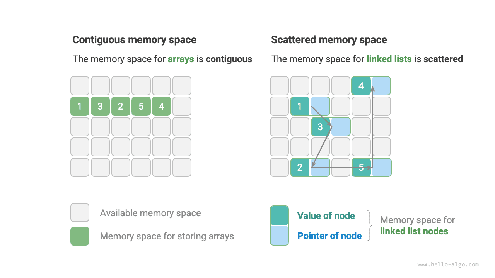

# Phân loại cấu trúc dữ liệu

Các cấu trúc dữ liệu phổ biến bao gồm mảng, danh sách liên kết, ngăn xếp, hàng đợi, bảng băm, cây, đống và biểu đồ. Chúng có thể được phân loại theo hai chiều: "cấu trúc logic" và "cấu trúc vật lý".

## Cấu trúc logic: Tuyến tính và phi tuyến tính

**Cấu trúc logic thể hiện mối quan hệ logic giữa các thành phần dữ liệu**. Trong mảng và danh sách liên kết, dữ liệu được sắp xếp theo một thứ tự nhất định, thể hiện mối quan hệ tuyến tính giữa các phần tử; trong khi ở dạng cây, dữ liệu được sắp xếp theo thứ bậc từ trên xuống dưới, thể hiện mối quan hệ cha-con; đồ thị bao gồm các nút và cạnh, phản ánh các mối quan hệ mạng phức tạp.

Như thể hiện trong hình bên dưới, cấu trúc logic có thể được chia thành hai loại chính: "tuyến tính" và "phi tuyến tính". Cấu trúc tuyến tính trực quan hơn, cho thấy dữ liệu được sắp xếp tuyến tính theo các mối quan hệ logic; cấu trúc phi tuyến tính thì ngược lại, được sắp xếp phi tuyến tính.

- **Cấu trúc dữ liệu tuyến tính**: Mảng, danh sách liên kết, ngăn xếp, hàng đợi, bảng băm, trong đó các phần tử có mối quan hệ tuần tự một-một.
- **Cấu trúc dữ liệu phi tuyến tính**: Cây, đống, đồ thị, bảng băm.

Cấu trúc dữ liệu phi tuyến tính có thể được chia thành cấu trúc cây và cấu trúc mạng.

- **Cấu trúc cây**: Cây, đống, bảng băm, trong đó các phần tử có mối quan hệ một-nhiều.
- **Cấu trúc mạng**: Đồ thị, trong đó các phần tử có mối quan hệ nhiều-nhiều.

## Cấu trúc vật lý: Liền kề và phân tán

**Khi một chương trình thuật toán chạy, dữ liệu đang được xử lý chủ yếu được lưu trữ trong bộ nhớ**. Hình bên dưới minh họa một thẻ nhớ máy tính, trong đó mỗi ô vuông màu đen chứa một vùng nhớ. Chúng ta có thể tưởng tượng bộ nhớ như một bảng tính Excel khổng lồ, trong đó mỗi ô có thể lưu trữ một lượng dữ liệu nhất định.

**Hệ thống truy cập dữ liệu tại vị trí đích thông qua địa chỉ bộ nhớ**. Như thể hiện trong hình bên dưới, máy tính gán một số cho mỗi ô trong bảng tính theo các quy tắc cụ thể, đảm bảo rằng mỗi không gian bộ nhớ có một địa chỉ bộ nhớ duy nhất. Với những địa chỉ này, chương trình có thể truy cập dữ liệu trong bộ nhớ.

!!! mẹo

Cần lưu ý rằng việc so sánh bộ nhớ với bảng tính Excel chỉ là một sự tương tự đơn giản. Hoạt động thực tế của bộ nhớ phức tạp hơn nhiều, liên quan đến các khái niệm như không gian địa chỉ, quản lý bộ nhớ, cơ chế bộ đệm, bộ nhớ ảo và bộ nhớ vật lý.

Bộ nhớ là tài nguyên dùng chung cho tất cả các chương trình. Khi một khối bộ nhớ bị chiếm bởi một chương trình, nó thường không thể được sử dụng bởi các chương trình khác cùng lúc. **Vì vậy, trong việc thiết kế cấu trúc dữ liệu và thuật toán, tài nguyên bộ nhớ là yếu tố quan trọng cần cân nhắc**. Ví dụ: bộ nhớ tối đa mà thuật toán chiếm giữ không được vượt quá bộ nhớ trống còn lại của hệ thống; nếu thiếu các khối bộ nhớ lớn liền kề thì cấu trúc dữ liệu được chọn phải có khả năng được lưu trữ trong các không gian bộ nhớ phân tán.

Như minh họa trong hình bên dưới, **cấu trúc vật lý phản ánh cách lưu trữ dữ liệu trong bộ nhớ máy tính**. Nó có thể được chia thành bộ nhớ không gian liền kề (mảng) và bộ nhớ không gian phân tán (danh sách liên kết). Ở mức độ thấp, cấu trúc vật lý xác định cách truy cập, cập nhật, chèn và xóa dữ liệu. Hai cấu trúc vật lý này thể hiện các đặc điểm bổ sung về hiệu quả thời gian và hiệu quả không gian.

Điều đáng lưu ý là **tất cả cấu trúc dữ liệu được triển khai dựa trên mảng, danh sách liên kết hoặc kết hợp cả hai**. Ví dụ: ngăn xếp và hàng đợi có thể được triển khai bằng cách sử dụng mảng hoặc danh sách liên kết; trong khi việc triển khai bảng băm có thể bao gồm cả mảng và danh sách liên kết.

- **Có thể được triển khai dựa trên mảng**: Ngăn xếp, hàng đợi, bảng băm, cây, đống, đồ thị, ma trận, tensor (mảng có kích thước $\geq 3$), v.v.
- **Có thể được triển khai dựa trên danh sách liên kết**: Ngăn xếp, hàng đợi, bảng băm, cây, đống, đồ thị, v.v.

Sau khi khởi tạo, danh sách liên kết vẫn có thể điều chỉnh độ dài trong quá trình thực hiện chương trình nên chúng còn được gọi là "cấu trúc dữ liệu động". Sau khi khởi tạo, độ dài của mảng không thể thay đổi nên chúng còn được gọi là "cấu trúc dữ liệu tĩnh". Điều đáng chú ý là mảng có thể thay đổi độ dài bằng cách phân bổ lại bộ nhớ, do đó vẫn giữ được mức độ linh hoạt hạn chế.

!!! mẹo

Nếu bạn cảm thấy khó hiểu cấu trúc vật lý, bạn nên đọc chương tiếp theo trước, sau đó xem lại phần này.
