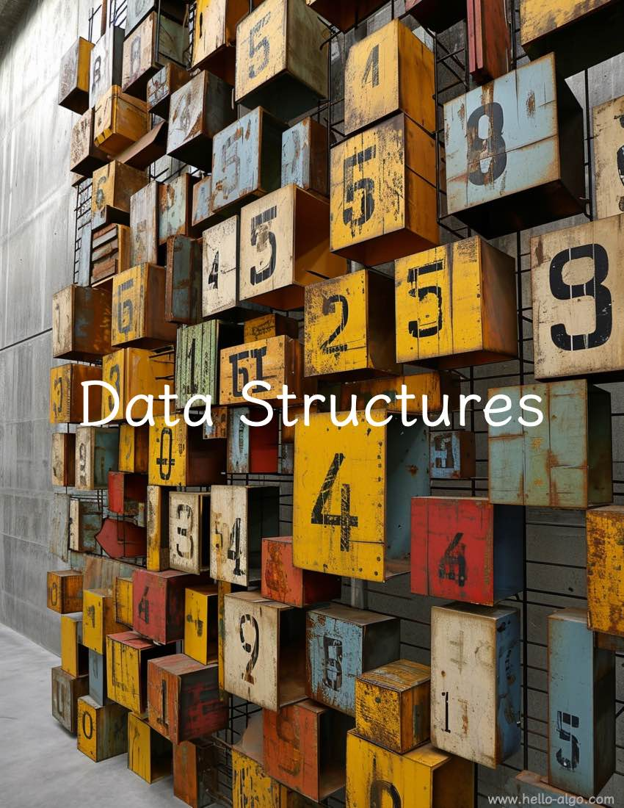

#Cấu trúc dữ liệu

!!! trừu tượng

Cấu trúc dữ liệu giống như một khung vững chắc và đa dạng.

Nó cung cấp một kế hoạch chi tiết để tổ chức dữ liệu một cách có trật tự, theo đó các thuật toán sẽ trở nên sống động.
