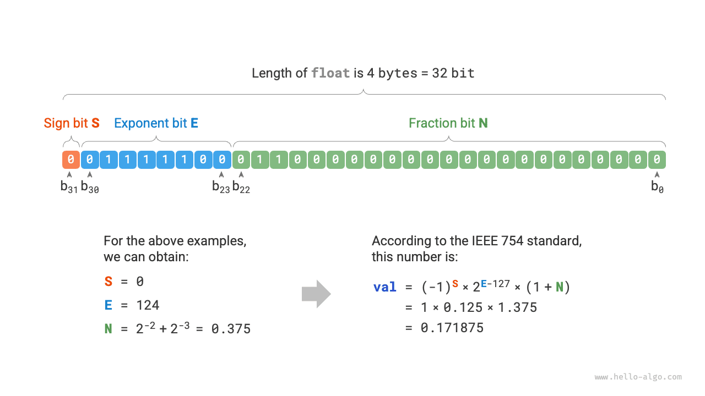

# Mã hóa số *

!!! mẹo

Trong cuốn sách này, các chương được đánh dấu hoa thị * là các bài đọc tùy chọn. Nếu bạn thiếu thời gian hoặc thấy chúng khó khăn, ban đầu bạn có thể bỏ qua những phần này và quay lại sau khi hoàn thành các chương cần thiết.

## Độ lớn dấu, Phần bù 1 và Phần bù 2

Trong bảng ở phần trước, chúng ta thấy rằng tất cả các loại số nguyên có thể biểu thị nhiều số âm hơn số dương. Ví dụ: phạm vi `byte` là $[-128, 127]$. Hiện tượng này phản trực giác và nguyên nhân cơ bản của nó nằm ở cách biểu diễn độ lớn dấu, phần bù 1 và phần biểu diễn phần bù 2.

Đầu tiên, cần lưu ý rằng **các số được lưu trữ trong máy tính dưới dạng "phần bù 2"**. Trước khi phân tích lý do cho điều này, trước tiên chúng ta hãy xác định ba khái niệm này.

- **Độ lớn dấu**: Chúng tôi coi bit cao nhất của biểu diễn nhị phân của một số là bit dấu, trong đó $0$ biểu thị số dương và $1$ biểu thị số âm và các bit còn lại biểu thị giá trị của số đó.
- **Phần bù 1**: Phần bù 1 của một số dương bằng độ lớn dấu của số đó. Đối với số âm, phần bù 1 thu được bằng cách đảo ngược tất cả các bit ngoại trừ bit dấu của độ lớn dấu của nó.
- **Phần bù 2**: Phần bù 2 của một số dương bằng độ lớn dấu của nó. Đối với số âm, phần bù 2 có được bằng cách cộng $1$ vào phần bù 1 của nó.

Hình bên dưới hiển thị các phương pháp chuyển đổi giữa độ lớn dấu, phần bù 1 và phần bù 2.

<u>Sign-magnitude</u>, although the most intuitive, has some limitations. On one hand, **the sign-magnitude of negative numbers cannot be directly used in operations**. For example, calculating $1 + (-2)$ in sign-magnitude yields $-3$, which is clearly incorrect.

$$
\begin{aligned}
& 1 + (-2) \newline
& \rightarrow 0000 \; 0001 + 1000\; 0010 \ dòng mới
& = 1000 \; 0011 \ dòng mới
& \rightarrow -3
\end{aligned}
$$

Để giải quyết vấn đề này, máy tính đã đưa ra <u>phần bù 1</u>. Nếu trước tiên chúng ta chuyển đổi độ lớn dấu thành số bù 1 và tính $1 + (-2)$ theo số bù 1, sau đó chuyển đổi kết quả trở lại độ lớn dấu, chúng ta có thể thu được kết quả chính xác là $-1$.

$$
\begin{aligned}
& 1 + (-2) \newline
& \rightarrow 0000 \; 0001 \; \text{(Ký hiệu độ lớn)} + 1000 \; 0010 \; \text{(Ký hiệu cường độ)} \newline
& = 0000 \; 0001 \; \text{(phần bù 1)} + 1111 \; 1101 \; \text{(phần bù 1)} \newline
& = 1111 \; 1110 \; \text{(phần bù 1)} \newline
& = 1000 \; 0001 \; \text{(Ký hiệu cường độ)} \newline
& \rightarrow -1
\end{aligned}
$$

Mặt khác, **độ lớn dấu của số 0 có hai cách biểu thị, $+0$ và $-0$**. Điều này có nghĩa là số 0 tương ứng với hai bảng mã nhị phân khác nhau, điều này có thể gây ra sự mơ hồ. Ví dụ, trong các phán đoán có điều kiện, nếu chúng ta không phân biệt được số 0 dương và số 0 âm thì có thể dẫn đến kết quả phán đoán sai. Nếu chúng ta muốn xử lý sự mơ hồ của số 0 dương và âm, chúng ta cần đưa ra các phép toán phán đoán bổ sung, điều này có thể làm giảm hiệu quả tính toán của máy tính.

$$
\begin{aligned}
+0 & \rightarrow 0000 \; 0000 \newline
-0 & \rightarrow 1000 \; 0000
\end{aligned}
$$

Giống như độ lớn dấu, phần bù 1 cũng có vấn đề mơ hồ về số 0 dương và âm. Vì vậy, máy tính đã giới thiệu thêm <u>Phần bù 2</u>. Trước tiên chúng ta hãy quan sát quá trình chuyển đổi số 0 âm từ độ lớn dấu sang phần bù 1 thành phần bù 2:

$$
\begin{aligned}
-0 \rightarrow \; & 1000 \; 0000 \; \text{(Ký hiệu cường độ)} \newline
= \; & 1111 \; 1111 \; \text{(phần bù 1)} \newline
= 1 \; & 0000 \; 0000 \; \text{(phần bù 2)} \newline
\end{aligned}
$$

Việc thêm $1$ vào phần bù 1 của số 0 âm sẽ tạo ra số mang, nhưng vì loại `byte` chỉ có độ dài 8 bit nên $1$ tràn đến bit thứ 9 sẽ bị loại bỏ. Điều đó có nghĩa là, **phần bù 2 của số 0 âm là $0000 \; 0000$, tương đương với số bù 2 của số 0 dương**. Điều này có nghĩa là trong biểu diễn phần bù của 2, chỉ có một số 0 và do đó sự mơ hồ về số 0 dương và âm được giải quyết.

Vẫn còn một câu hỏi cuối cùng: phạm vi của loại `byte` là $[-128, 127]$, vậy số âm bổ sung $-128$ đến từ đâu? Chúng tôi nhận thấy rằng tất cả các số nguyên trong khoảng $[-127, +127]$ có độ lớn dấu tương ứng, phần bù 1 và phần bù 2, đồng thời độ lớn dấu và phần bù 2 có thể được chuyển đổi lẫn nhau.

Tuy nhiên, **số bù 2 $1000 \; 0000$ là một ngoại lệ và nó không có cường độ dấu tương ứng**. Theo phương pháp chuyển đổi, chúng ta nhận được rằng độ lớn dấu của phần bù 2 này là $0000 \; 0000$. Điều này rõ ràng là mâu thuẫn vì độ lớn dấu này đại diện cho số $0$ và phần bù 2 của nó phải là chính nó. Máy tính xác định rằng số 2 đặc biệt này bù $1000 \; 0000$ đại diện cho $-128$. Trên thực tế, kết quả của việc tính $(-1) + (-127)$ trong phần bù 2 là $-128$.

$$
\begin{aligned}
& (-127) + (-1) \newline
& \rightarrow 1111 \; 1111 \; \text{(Ký hiệu độ lớn)} + 1000 \; 0001 \; \text{(Ký hiệu cường độ)} \newline
& = 1000 \; 0000 \; \text{(phần bù 1)} + 1111 \; 1110 \; \text{(phần bù 1)} \newline
& = 1000 \; 0001 \; \text{(phần bù 2)} + 1111 \; 1111 \; \text{(phần bù 2)} \newline
& = 1000 \; 0000 \; \text{(phần bù 2)} \newline
& \rightarrow -128
\end{aligned}
$$

Bạn có thể nhận thấy rằng tất cả các phép tính trên đều là phép tính cộng. Điều này gợi ý một thực tế quan trọng: **các mạch phần cứng bên trong máy tính được thiết kế chủ yếu dựa trên các phép toán cộng**. Điều này là do các phép toán cộng được thực hiện đơn giản hơn trong phần cứng so với các phép toán khác (như nhân, chia và trừ), dễ song song hóa hơn và có tốc độ hoạt động nhanh hơn.

Xin lưu ý rằng điều này không có nghĩa là máy tính chỉ có thể thực hiện phép cộng. **Bằng cách kết hợp phép cộng với một số phép toán logic cơ bản, máy tính có thể thực hiện nhiều phép toán khác**. Ví dụ: phép trừ $a - b$ có thể được chuyển đổi sang phép tính phép cộng $a + (-b)$; phép tính nhân và chia có thể được chuyển đổi thành phép tính cộng hoặc trừ nhiều lần.

Bây giờ chúng ta có thể tóm tắt lý do tại sao máy tính sử dụng phần bù 2: với biểu diễn phần bù 2, máy tính có thể sử dụng các mạch và phép toán giống nhau để xử lý phép cộng các số dương và âm mà không cần thiết kế các mạch phần cứng đặc biệt để trừ hoặc xử lý riêng sự mơ hồ của số 0 dương và âm. Điều này giúp đơn giản hóa đáng kể thiết kế phần cứng và cải thiện hiệu quả.

Thiết kế của phần bù số 2 rất khéo léo. Do giới hạn về không gian, chúng tôi sẽ dừng ở đây. Mời bạn đọc quan tâm tìm hiểu thêm.

## Mã hóa số dấu phẩy động

Những độc giả cẩn thận có thể nhận thấy: `int` và `float` có cùng độ dài, cả hai đều là 4 byte, nhưng tại sao `float` có phạm vi lớn hơn nhiều so với `int`? Điều này rất phản trực giác vì theo lý do thì `float` cần biểu thị số thập phân, do đó phạm vi phải nhỏ hơn.

Trên thực tế, **điều này là do số dấu phẩy động `float` sử dụng một phương thức biểu diễn khác**. Hãy biểu thị số nhị phân 32 bit là:

$$
b_{31} b_{30} b_{29} \ldots b_2 b_1 b_0
$$

Theo tiêu chuẩn IEEE 754, `float` 32-bit bao gồm ba phần sau.

- Bit dấu $\mathrm{S}$: chiếm 1 bit, tương ứng với $b_{31}$.
- Bit lũy thừa $\mathrm{E}$: chiếm 8 bit, tương ứng với $b_{30} b_{29} \ldots b_{23}$.
- Bit phân số $\mathrm{N}$: chiếm 23 bit, tương ứng với $b_{22} b_{21} \ldots b_0$.

Phương pháp tính giá trị tương ứng với `float` nhị phân là:

$$
\text {val} = (-1)^{b_{31}} \times 2^{\left(b_{30} b_{29} \ldots b_{23}\right)_2-127} \times\left(1 . b_{22} b_{21} \ldots b_0\right)_2
$$

Chuyển sang dạng thập phân, công thức tính là:

$$
\text {val}=(-1)^{\mathrm{S}} \times 2^{\mathrm{E} -127} \times (1 + \mathrm{N})
$$

Phạm vi của mỗi thành phần là:

$$
\begin{aligned}
\mathrm{S} \in & \{ 0, 1\}, \quad \mathrm{E} \in \{ 1, 2, \dots, 254 \} \newline
(1 + \mathrm{N}) = & (1 + \sum_{i=1}^{23} b_{23-i} 2^{-i}) \subset [1, 2 - 2^{-23}]
\end{aligned}
$$

Quan sát hình trên, cho dữ liệu ví dụ $\mathrm{S} = 0$, $\mathrm{E} = 124$, $\mathrm{N} = 2^{-2} + 2^{-3} = 0,375$, ta có:

$$
\text { val } = (-1)^0 \times 2^{124 - 127} \times (1 + 0,375) = 0,171875
$$

Bây giờ chúng ta có thể trả lời câu hỏi ban đầu: **biểu diễn của `float` bao gồm một bit số mũ, dẫn đến một phạm vi lớn hơn nhiều so với `int`**. Theo tính toán ở trên, số dương tối đa mà `float` có thể biểu thị là $2^{254 - 127} \times (2 - 2^{-23}) \approx 3.4 \times 10^{38}$ và có thể đạt được số âm tối thiểu bằng cách chuyển đổi bit dấu.

**Mặc dù số dấu phẩy động `float` mở rộng phạm vi nhưng tác dụng phụ của nó là làm mất đi độ chính xác**. Kiểu số nguyên `int` sử dụng tất cả 32 bit để biểu thị các số và các số được phân bổ đều; tuy nhiên, do sự tồn tại của bit số mũ nên giá trị của số dấu phẩy động `float` càng lớn thì sự chênh lệch giữa hai số liền kề có xu hướng càng lớn.

Như được hiển thị trong bảng bên dưới, các bit số mũ $\mathrm{E} = 0$ và $\mathrm{E} = 255$ có ý nghĩa đặc biệt, **được sử dụng để biểu thị số 0, vô cực, $\mathrm{NaN}$, v.v.**

 Table <id> &nbsp; Meaning of exponent bits 

| Số mũ Bit E | Bit phân số $\mathrm{N} = 0$ | Bit phân số $\mathrm{N} \ne 0$ | Công thức tính toán |
| ------------------ | ----------------------------- | ------------------------------- | ---------------------------------------------------------------------- |
| $0$ | $\chiều 0$ | Số không bình thường | $(-1)^{\mathrm{S}} \times 2^{-126} \times (0.\mathrm{N})$ |
| $1, 2, \dots, 254$ | Số Bình Thường | Số Bình Thường | $(-1)^{\mathrm{S}} \times 2^{(\mathrm{E} -127)} \times (1.\mathrm{N})$ |
| $255$ | $\pm \infty$ | $\mathrm{NaN}$ |                                                                        |

Điều đáng chú ý là các số dưới chuẩn cải thiện đáng kể độ chính xác của số dấu phẩy động. Số chuẩn dương nhỏ nhất là $2^{-126}$ và số chuẩn dương nhỏ nhất là $2^{-126} \times 2^{-23}$.

Độ chính xác kép `double` cũng sử dụng phương thức biểu diễn tương tự như `float`, phương thức này sẽ không được trình bày chi tiết ở đây.
