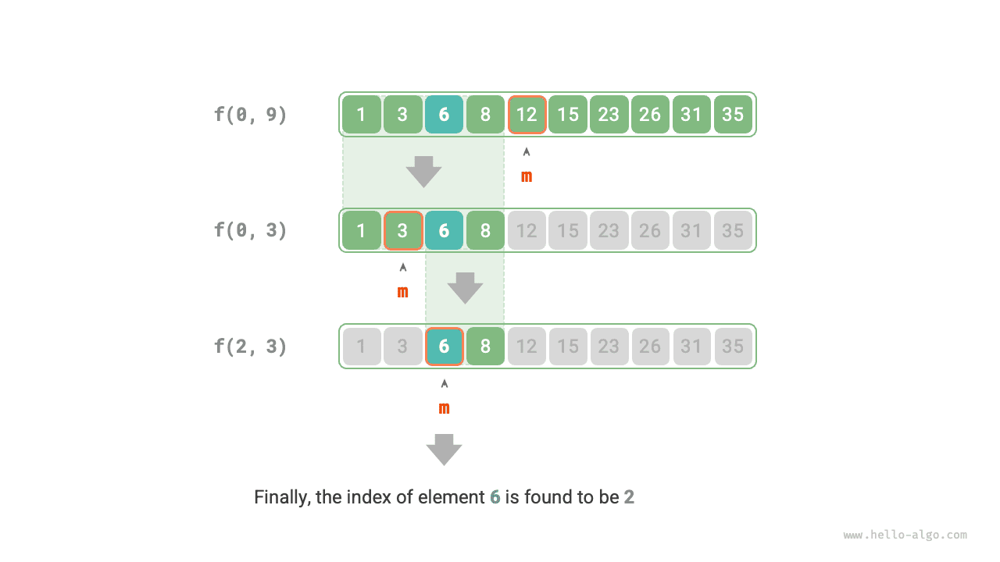

# Chiến lược tìm kiếm chia để trị

Chúng ta đã biết rằng các thuật toán tìm kiếm được chia thành hai loại chính.

- **Tìm kiếm Brute-force**: Được triển khai bằng cách duyệt qua cấu trúc dữ liệu, với độ phức tạp về thời gian là $O(n)$.
- **Tìm kiếm thích ứng**: Tận dụng tổ chức dữ liệu cụ thể hoặc thông tin trước đó, với độ phức tạp về thời gian đạt tới $O(\log n)$ hoặc thậm chí $O(1)$.

Trên thực tế, **thuật toán tìm kiếm có độ phức tạp về thời gian $O(\log n)$ thường được triển khai dựa trên chiến lược chia để trị**, chẳng hạn như tìm kiếm nhị phân và cây.

- Mỗi bước tìm kiếm nhị phân chia bài toán (tìm phần tử đích trong mảng) thành bài toán nhỏ hơn (tìm phần tử đích trong một nửa mảng), tiếp tục cho đến khi mảng trống hoặc tìm thấy phần tử đích.
- Cây cối tượng trưng cho tư tưởng chia để trị. Trong các cấu trúc dữ liệu như cây tìm kiếm nhị phân, cây AVL và vùng heap, độ phức tạp về thời gian của các phép toán khác nhau là $O(\log n)$.

Chiến lược phân chia và chinh phục của tìm kiếm nhị phân như sau.

- **Bài toán có thể được phân tách**: Tìm kiếm nhị phân phân rã đệ quy bài toán ban đầu (tìm kiếm trong một mảng) thành các bài toán con (tìm kiếm trong một nửa mảng), đạt được bằng cách so sánh phần tử ở giữa với phần tử đích.
- **Các bài toán con độc lập**: Trong tìm kiếm nhị phân, mỗi vòng chỉ xử lý một bài toán con, không bị ảnh hưởng bởi các bài toán con khác.
- **Giải các bài toán con không cần hợp nhất**: Tìm kiếm nhị phân nhằm tìm một phần tử cụ thể nên không cần hợp nhất lời giải của các bài toán con. Khi một bài toán con được giải quyết thì bài toán ban đầu cũng được giải quyết.

Chia để trị có thể cải thiện hiệu quả tìm kiếm vì tìm kiếm vũ phu chỉ có thể loại bỏ một tùy chọn mỗi vòng, **trong khi tìm kiếm chia để trị có thể loại bỏ một nửa số tùy chọn mỗi vòng**.

### Triển khai tìm kiếm nhị phân dựa trên phân chia và chinh phục

Trong các phần trước, tìm kiếm nhị phân được triển khai dựa trên phép lặp. Bây giờ chúng tôi triển khai nó dựa trên phân chia và chinh phục (đệ quy).

!!! câu hỏi

Cho một mảng được sắp xếp `nums` có độ dài $n$, trong đó tất cả các phần tử là duy nhất, hãy tìm `target`.

Từ góc độ chia để trị, chúng ta biểu thị bài toán con tương ứng với khoảng tìm kiếm $[i, j]$ là $f(i, j)$.

Bắt đầu từ bài toán ban đầu $f(0, n-1)$, thực hiện tìm kiếm nhị phân qua các bước sau.

1. Tính trung điểm $m$ của khoảng tìm kiếm $[i, j]$ và sử dụng nó để loại bỏ một nửa khoảng tìm kiếm.
2. Giải đệ quy bài toán con giảm đi một nửa kích thước, có thể là $f(i, m-1)$ hoặc $f(m+1, j)$.
3. Lặp lại các bước `1.` và `2.` cho đến khi tìm thấy `đích` hoặc quay lại khi khoảng trống.

Hình dưới đây cho thấy quá trình phân chia và chinh phục tìm kiếm nhị phân cho phần tử $6$ trong một mảng.



Trong mã triển khai, chúng ta khai báo hàm đệ quy `dfs()` để giải quyết vấn đề $f(i, j)$:

=== "Python"
    ```python title="binary_search_recur.py"
    def binary_search(nums: list[int], target: int) -> int:
        """Binary search"""
        n = len(nums)
        # Solve the problem f(0, n-1)
        return dfs(nums, target, 0, n - 1)
    ```
=== "C++"
    ```cpp title="binary_search_recur.cpp"
    int binarySearch(vector<int> &nums, int target) {
        int n = nums.size();
        // Solve the problem f(0, n-1)
        return dfs(nums, target, 0, n - 1);
    }
    ```
=== "Java"
    ```java title="binary_search_recur.java"
    public class binary_search_recur {
        /* Binary search: problem f(i, j) */
        static int dfs(int[] nums, int target, int i, int j) {
            // If the interval is empty, it means there is no target element, return -1
            if (i > j) {
                return -1;
            }
            // Calculate the midpoint index m
            int m = (i + j) / 2;
            if (nums[m] < target) {
                // Recursion subproblem f(m+1, j)
                return dfs(nums, target, m + 1, j);
            } else if (nums[m] > target) {
                // Recursion subproblem f(i, m-1)
                return dfs(nums, target, i, m - 1);
            } else {
                // Found the target element, return its index
                return m;
            }
        }
    
        /* Binary search */
        static int binarySearch(int[] nums, int target) {
            int n = nums.length;
            // Solve the problem f(0, n-1)
            return dfs(nums, target, 0, n - 1);
        }
    
        public static void main(String[] args) {
            int target = 6;
            int[] nums = { 1, 3, 6, 8, 12, 15, 23, 26, 31, 35 };
    
            // Binary search (closed interval on both sides)
            int index = binarySearch(nums, target);
            System.out.println("Index of target element 6 = " + index);
        }
    }
    ```
=== "C#"
    ```csharp title="binary_search_recur.cs"
    public class binary_search_recur {
        /* Binary search: problem f(i, j) */
        int DFS(int[] nums, int target, int i, int j) {
            // If the interval is empty, it means there is no target element, return -1
            if (i > j) {
                return -1;
            }
            // Calculate the midpoint index m
            int m = (i + j) / 2;
            if (nums[m] < target) {
                // Recursion subproblem f(m+1, j)
                return DFS(nums, target, m + 1, j);
            } else if (nums[m] > target) {
                // Recursion subproblem f(i, m-1)
                return DFS(nums, target, i, m - 1);
            } else {
                // Found the target element, return its index
                return m;
            }
        }
    
        /* Binary search */
        int BinarySearch(int[] nums, int target) {
            int n = nums.Length;
            // Solve the problem f(0, n-1)
            return DFS(nums, target, 0, n - 1);
        }
    
        [Test]
        public void Test() {
            int target = 6;
            int[] nums = [1, 3, 6, 8, 12, 15, 23, 26, 31, 35];
    
            // Binary search (closed interval on both sides)
            int index = BinarySearch(nums, target);
            Console.WriteLine("Index of target element 6 = " + index);
        }
    }
    ```
=== "Go"
    ```go title="binary_search_recur.go"
    func binarySearch(nums []int, target int) int {
    	n := len(nums)
    	return dfs(nums, target, 0, n-1)
    }
    ```
=== "Swift"
    ```swift title="binary_search_recur.swift"
    func binarySearch(nums: [Int], target: Int) -> Int {
        // Solve the problem f(0, n-1)
        dfs(nums: nums, target: target, i: nums.startIndex, j: nums.endIndex - 1)
    }
    ```
=== "JS"
    ```javascript title="binary_search_recur.js"
    function binarySearch(nums, target) {
        const n = nums.length;
        // Solve the problem f(0, n-1)
        return dfs(nums, target, 0, n - 1);
    }
    ```
=== "TS"
    ```typescript title="binary_search_recur.ts"
    function binarySearch(nums: number[], target: number): number {
        const n = nums.length;
        // Solve the problem f(0, n-1)
        return dfs(nums, target, 0, n - 1);
    }
    ```
=== "Dart"
    ```dart title="binary_search_recur.dart"
    int binarySearch(List<int> nums, int target) {
      int n = nums.length;
      // Solve the problem f(0, n-1)
      return dfs(nums, target, 0, n - 1);
    }
    ```
=== "Rust"
    ```rust title="binary_search_recur.rs"
    fn binary_search(nums: &[i32], target: i32) -> i32 {
        let n = nums.len() as i32;
        // Solve the problem f(0, n-1)
        dfs(nums, target, 0, n - 1)
    }
    ```
=== "C"
    ```c title="binary_search_recur.c"
    int binarySearch(int nums[], int target, int numsSize) {
        int n = numsSize;
        // Solve the problem f(0, n-1)
        return dfs(nums, target, 0, n - 1);
    }
    ```
=== "Kotlin"
    ```kotlin title="binary_search_recur.kt"
    fun binarySearch(nums: IntArray, target: Int): Int {
        val n = nums.size
        // Solve the problem f(0, n-1)
        return dfs(nums, target, 0, n - 1)
    }
    ```
=== "Ruby"
    ```ruby title="binary_search_recur.rb"
    ### Binary search ###
    def binary_search(nums, target)
      n = nums.length
      # Solve the problem f(0, n-1)
      dfs(nums, target, 0, n - 1)
    ```

