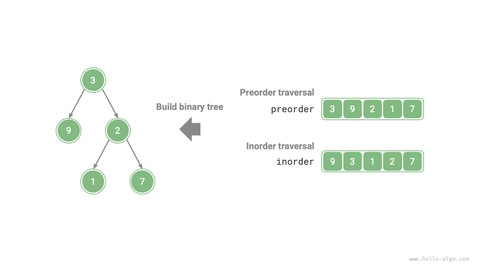
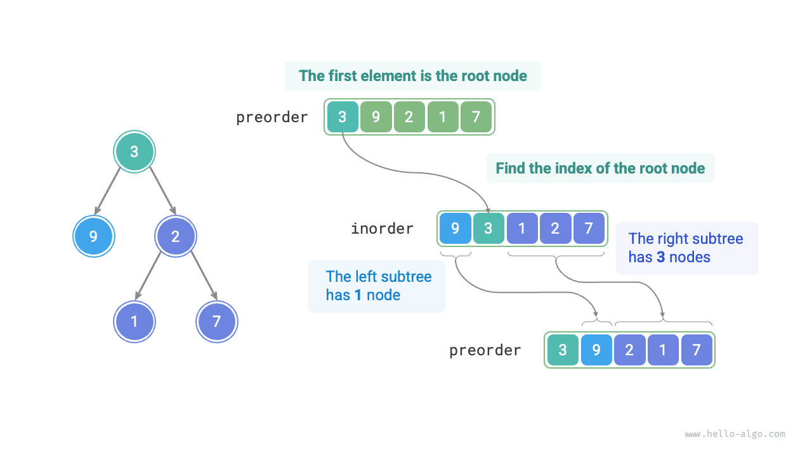
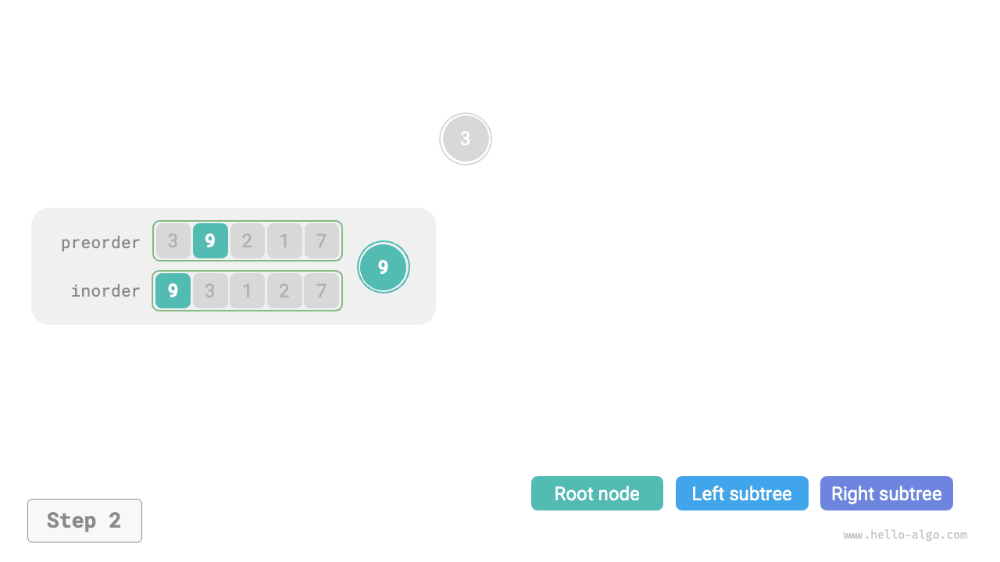
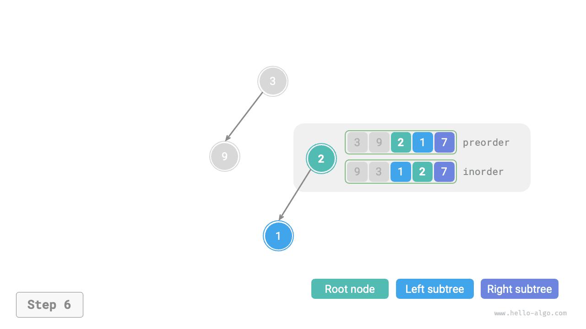
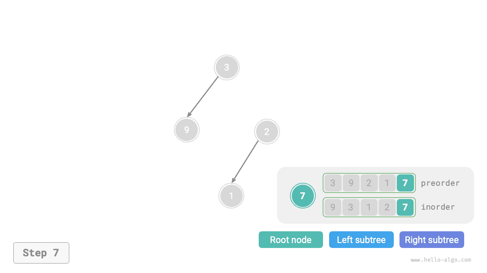
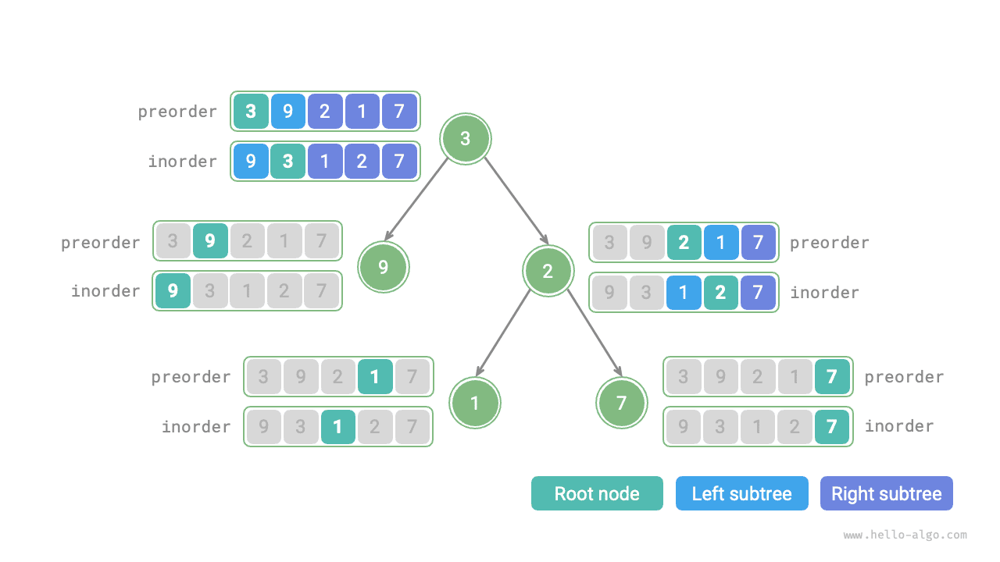

# Xây dựng bài toán cây nhị phân

!!! câu hỏi

Cho việc duyệt thứ tự trước `thứ tự trước` và duyệt thứ tự `inorder` của cây nhị phân, hãy xây dựng cây nhị phân và trả về nút gốc của cây nhị phân. Giả sử không có giá trị nút trùng lặp nào trong cây nhị phân (như minh họa trong hình bên dưới).



### Xác định xem đây có phải là bài toán chia để trị

Bài toán ban đầu được định nghĩa là xây dựng một cây nhị phân từ `preorder` và `inorder`, đây là một bài toán chia để trị điển hình.

- **Bài toán có thể được phân tách**: Từ góc độ chia để trị, chúng ta có thể chia bài toán ban đầu thành hai bài toán con: xây dựng cây con bên trái và xây dựng cây con bên phải, cộng thêm một thao tác: khởi tạo nút gốc. Đối với mỗi cây con (bài toán con), chúng ta vẫn có thể sử dụng lại phương pháp chia trên, chia nó thành các cây con (bài toán con) nhỏ hơn cho đến khi đạt được bài toán con nhỏ nhất (cây con trống).
- **Bài toán con độc lập**: Cây con trái và cây con phải độc lập với nhau; không có sự chồng chéo giữa chúng. Khi xây dựng cây con bên trái, chúng ta chỉ cần tập trung vào các phần duyệt theo thứ tự và thứ tự trước tương ứng với cây con bên trái. Điều tương tự cũng áp dụng cho cây con bên phải.
- **Giải các bài toán con có thể được hợp nhất**: Khi đã có cây con trái và cây con phải (giải pháp của các bài toán con), chúng ta có thể liên kết chúng với nút gốc để thu được lời giải của bài toán ban đầu.

### Cách chia cây con

Dựa trên phân tích ở trên, vấn đề này có thể được giải quyết bằng cách sử dụng phép chia và chinh phục, **nhưng làm cách nào để chia cây con trái và cây con phải thông qua việc duyệt thứ tự trước `preorder` và duyệt theo thứ tự `inorder`**?

Theo định nghĩa, cả `preorder` và `inorder` đều có thể được chia thành ba phần.

- Truyền tải đặt hàng trước: `[ Nút gốc | Cây con trái | Cây con bên phải ]`, ví dụ cây trong hình trên tương ứng với `[ 3 | 9 | 2 1 7 ]`.
- Duyệt theo thứ tự: `[ Cây con bên trái | Nút gốc ｜ Cây con bên phải ]`, ví dụ cây trong hình trên tương ứng với `[ 9 | 3 | 1 2 7 ]`.

Lấy dữ liệu từ hình trên làm ví dụ, chúng ta có thể thu được kết quả chia thông qua các bước như trong hình bên dưới.

1. Phần tử thứ 3 đầu tiên trong quá trình duyệt thứ tự trước là giá trị của nút gốc.
2. Tìm chỉ số của nút gốc 3 trong `inorder`, và dùng chỉ mục này để chia `inorder` thành `[ 9 | 3 ｜ 1 2 7 ]`.
3. Dựa vào kết quả chia của `inorder`, dễ dàng xác định cây con trái và cây con bên phải lần lượt có 1 và 3 nút, cho phép ta chia `preorder` thành `[ 3 | 9 | 2 1 7 ]`.



### Mô tả các khoảng thời gian của cây con dựa trên các biến

Dựa vào phương pháp chia ở trên, **chúng ta đã thu được các khoảng chỉ số của nút gốc, cây con trái và cây con phải trong `preorder` và `inorder`**. Để mô tả các khoảng chỉ số này, chúng ta cần sử dụng một số biến chỉ số.

- Biểu thị chỉ mục nút gốc của cây hiện tại trong `preorder` là $i$.
- Biểu thị chỉ mục nút gốc của cây hiện tại trong `inorder` là $m$.
- Biểu thị khoảng chỉ số của cây hiện tại trong `inorder` là $[l, r]$.

Như được hiển thị trong bảng bên dưới, thông qua các biến này, chúng ta có thể biểu thị chỉ mục của nút gốc trong `preorder` và khoảng chỉ mục của các cây con trong `inorder`.

<p align="center"> Table <id> &nbsp; Indices of root node and subtrees in preorder and inorder traversals </p>

|              | Chỉ mục nút gốc trong `preorder` | Khoảng chỉ mục cây con trong `inorder` |
| ------------ | ----------------------------- | ----------------------------------- |
| Cây hiện tại | $i$ | $[l, r]$ |
| Cây con trái | $i + 1$ | $[l, m-1]$ |
| Cây con bên phải| $i + 1 + (m - l)$ | $[m+1, r]$ |

Xin lưu ý rằng $(m-l)$ trong chỉ mục nút gốc của cây con bên phải có nghĩa là "số lượng nút trong cây con bên trái". Nên hiểu điều này kết hợp với hình dưới đây.


### Triển khai mã

Để cải thiện hiệu quả truy vấn $m$, chúng tôi sử dụng bảng băm `hmap` để lưu trữ ánh xạ từ các phần tử trong mảng `inorder` tới các chỉ mục của chúng:

=== "Python"
    ```python title="build_tree.py"
    def build_tree(preorder: list[int], inorder: list[int]) -> TreeNode | None:
        """Build binary tree"""
        # Initialize hash map, storing the mapping from inorder elements to indices
        inorder_map = {val: i for i, val in enumerate(inorder)}
        root = dfs(preorder, inorder_map, 0, 0, len(inorder) - 1)
        return root
    ```
=== "C++"
    ```cpp title="build_tree.cpp"
    TreeNode *buildTree(vector<int> &preorder, vector<int> &inorder) {
        // Initialize hash map, storing the mapping from inorder elements to indices
        unordered_map<int, int> inorderMap;
        for (int i = 0; i < inorder.size(); i++) {
            inorderMap[inorder[i]] = i;
        }
        TreeNode *root = dfs(preorder, inorderMap, 0, 0, inorder.size() - 1);
        return root;
    }
    ```
=== "Java"
    ```java title="build_tree.java"
    public class build_tree {
        /* Build binary tree: divide and conquer */
        static TreeNode dfs(int[] preorder, Map<Integer, Integer> inorderMap, int i, int l, int r) {
            // Terminate when the subtree interval is empty
            if (r - l < 0)
                return null;
            // Initialize the root node
            TreeNode root = new TreeNode(preorder[i]);
            // Query m to divide the left and right subtrees
            int m = inorderMap.get(preorder[i]);
            // Subproblem: build the left subtree
            root.left = dfs(preorder, inorderMap, i + 1, l, m - 1);
            // Subproblem: build the right subtree
            root.right = dfs(preorder, inorderMap, i + 1 + m - l, m + 1, r);
            // Return the root node
            return root;
        }
    
        /* Build binary tree */
        static TreeNode buildTree(int[] preorder, int[] inorder) {
            // Initialize hash map, storing the mapping from inorder elements to indices
            Map<Integer, Integer> inorderMap = new HashMap<>();
            for (int i = 0; i < inorder.length; i++) {
                inorderMap.put(inorder[i], i);
            }
            TreeNode root = dfs(preorder, inorderMap, 0, 0, inorder.length - 1);
            return root;
        }
    
        public static void main(String[] args) {
            int[] preorder = { 3, 9, 2, 1, 7 };
            int[] inorder = { 9, 3, 1, 2, 7 };
            System.out.println("Preorder traversal = " + Arrays.toString(preorder));
            System.out.println("Inorder traversal = " + Arrays.toString(inorder));
    
            TreeNode root = buildTree(preorder, inorder);
            System.out.println("The constructed binary tree is:");
            PrintUtil.printTree(root);
        }
    }
    ```
=== "C#"
    ```csharp title="build_tree.cs"
    public class build_tree {
        /* Build binary tree: divide and conquer */
        TreeNode? DFS(int[] preorder, Dictionary<int, int> inorderMap, int i, int l, int r) {
            // Terminate when the subtree interval is empty
            if (r - l < 0)
                return null;
            // Initialize the root node
            TreeNode root = new(preorder[i]);
            // Query m to divide the left and right subtrees
            int m = inorderMap[preorder[i]];
            // Subproblem: build the left subtree
            root.left = DFS(preorder, inorderMap, i + 1, l, m - 1);
            // Subproblem: build the right subtree
            root.right = DFS(preorder, inorderMap, i + 1 + m - l, m + 1, r);
            // Return the root node
            return root;
        }
    
        /* Build binary tree */
        TreeNode? BuildTree(int[] preorder, int[] inorder) {
            // Initialize hash map, storing the mapping from inorder elements to indices
            Dictionary<int, int> inorderMap = [];
            for (int i = 0; i < inorder.Length; i++) {
                inorderMap.TryAdd(inorder[i], i);
            }
            TreeNode? root = DFS(preorder, inorderMap, 0, 0, inorder.Length - 1);
            return root;
        }
    
        [Test]
        public void Test() {
            int[] preorder = [3, 9, 2, 1, 7];
            int[] inorder = [9, 3, 1, 2, 7];
            Console.WriteLine("Preorder traversal = " + string.Join(", ", preorder));
            Console.WriteLine("Inorder traversal = " + string.Join(", ", inorder));
    
            TreeNode? root = BuildTree(preorder, inorder);
            Console.WriteLine("The constructed binary tree is:");
            PrintUtil.PrintTree(root);
        }
    }
    ```
=== "Go"
    ```go title="build_tree.go"
    func dfsBuildTree(preorder []int, inorderMap map[int]int, i, l, r int) *TreeNode {
    	// Terminate when the subtree interval is empty
    	if r-l < 0 {
    		return nil
    	}
    	// Initialize the root node
    	root := NewTreeNode(preorder[i])
    	// Query m to divide the left and right subtrees
    	m := inorderMap[preorder[i]]
    	// Subproblem: build the left subtree
    	root.Left = dfsBuildTree(preorder, inorderMap, i+1, l, m-1)
    	// Subproblem: build the right subtree
    	root.Right = dfsBuildTree(preorder, inorderMap, i+1+m-l, m+1, r)
    	// Return the root node
    	return root
    }
    ```
=== "Swift"
    ```swift title="build_tree.swift"
    func buildTree(preorder: [Int], inorder: [Int]) -> TreeNode? {
        // Initialize hash map, storing the mapping from inorder elements to indices
        let inorderMap = inorder.enumerated().reduce(into: [:]) { $0[$1.element] = $1.offset }
        return dfs(preorder: preorder, inorderMap: inorderMap, i: inorder.startIndex, l: inorder.startIndex, r: inorder.endIndex - 1)
    }
    ```
=== "JS"
    ```javascript title="build_tree.js"
    function buildTree(preorder, inorder) {
        // Initialize hash map, storing the mapping from inorder elements to indices
        let inorderMap = new Map();
        for (let i = 0; i < inorder.length; i++) {
            inorderMap.set(inorder[i], i);
        }
        const root = dfs(preorder, inorderMap, 0, 0, inorder.length - 1);
        return root;
    }
    ```
=== "TS"
    ```typescript title="build_tree.ts"
    function buildTree(preorder: number[], inorder: number[]): TreeNode | null {
        // Initialize hash map, storing the mapping from inorder elements to indices
        let inorderMap = new Map<number, number>();
        for (let i = 0; i < inorder.length; i++) {
            inorderMap.set(inorder[i], i);
        }
        const root = dfs(preorder, inorderMap, 0, 0, inorder.length - 1);
        return root;
    }
    ```
=== "Dart"
    ```dart title="build_tree.dart"
    TreeNode? buildTree(List<int> preorder, List<int> inorder) {
      // Initialize hash map, storing the mapping from inorder elements to indices
      Map<int, int> inorderMap = {};
      for (int i = 0; i < inorder.length; i++) {
        inorderMap[inorder[i]] = i;
      }
      TreeNode? root = dfs(preorder, inorderMap, 0, 0, inorder.length - 1);
      return root;
    }
    ```
=== "Rust"
    ```rust title="build_tree.rs"
    fn build_tree(preorder: &[i32], inorder: &[i32]) -> Option<Rc<RefCell<TreeNode>>> {
        // Initialize hash map, storing the mapping from inorder elements to indices
        let mut inorder_map: HashMap<i32, i32> = HashMap::new();
        for i in 0..inorder.len() {
            inorder_map.insert(inorder[i], i as i32);
        }
        let root = dfs(preorder, &inorder_map, 0, 0, inorder.len() as i32 - 1);
        root
    }
    ```
=== "C"
    ```c title="build_tree.c"
    TreeNode *buildTree(int *preorder, int preorderSize, int *inorder, int inorderSize) {
        // Initialize hash map, storing the mapping from inorder elements to indices
        int *inorderMap = (int *)malloc(sizeof(int) * MAX_SIZE);
        for (int i = 0; i < inorderSize; i++) {
            inorderMap[inorder[i]] = i;
        }
        TreeNode *root = dfs(preorder, inorderMap, 0, 0, inorderSize - 1, inorderSize);
        free(inorderMap);
        return root;
    }
    ```
=== "Kotlin"
    ```kotlin title="build_tree.kt"
    fun buildTree(preorder: IntArray, inorder: IntArray): TreeNode? {
        // Initialize hash map, storing the mapping from inorder elements to indices
        val inorderMap = HashMap<Int?, Int?>()
        for (i in inorder.indices) {
            inorderMap[inorder[i]] = i
        }
        val root = dfs(preorder, inorderMap, 0, 0, inorder.size - 1)
        return root
    }
    ```
=== "Ruby"
    ```ruby title="build_tree.rb"
    ### Build binary tree ###
    def build_tree(preorder, inorder)
      # Initialize hash map, storing the mapping from inorder elements to indices
      inorder_map = {}
      inorder.each_with_index { |val, i| inorder_map[val] = i }
      dfs(preorder, inorder_map, 0, 0, inorder.length - 1)
    ```


Hình dưới đây cho thấy quá trình đệ quy xây dựng cây nhị phân. Mỗi nút được thiết lập trong quá trình "đệ quy" đi xuống, trong khi mỗi cạnh (tham chiếu) được thiết lập trong quá trình "trở về" đi lên.

=== "<1>"
    

=== "<2>"
    

=== "<3>"
    

=== "<4>"
    

=== "<5>"
    

=== "<6>"
    

=== "<7>"
    

=== "<8>"
    

=== "<9>"
    

Kết quả phân chia của việc truyền tải theo thứ tự trước `preorder` và truyền tải theo thứ tự `inorder` trong mỗi hàm đệ quy được hiển thị trong hình bên dưới.



Gọi số nút trong cây là $n$. Việc khởi tạo mỗi nút (thực thi một hàm đệ quy `dfs()`) mất $O(1)$ thời gian. **Do đó, độ phức tạp về thời gian tổng thể là $O(n)$**.

Bảng băm lưu trữ ánh xạ từ các phần tử `inorder` tới các chỉ mục của chúng, với độ phức tạp về không gian là $O(n)$. Trong trường hợp xấu nhất, khi cây nhị phân thoái hóa thành danh sách liên kết, độ sâu đệ quy đạt tới $n$, sử dụng không gian khung ngăn xếp $O(n)$. **Do đó, độ phức tạp của không gian tổng thể là $O(n)$**.
