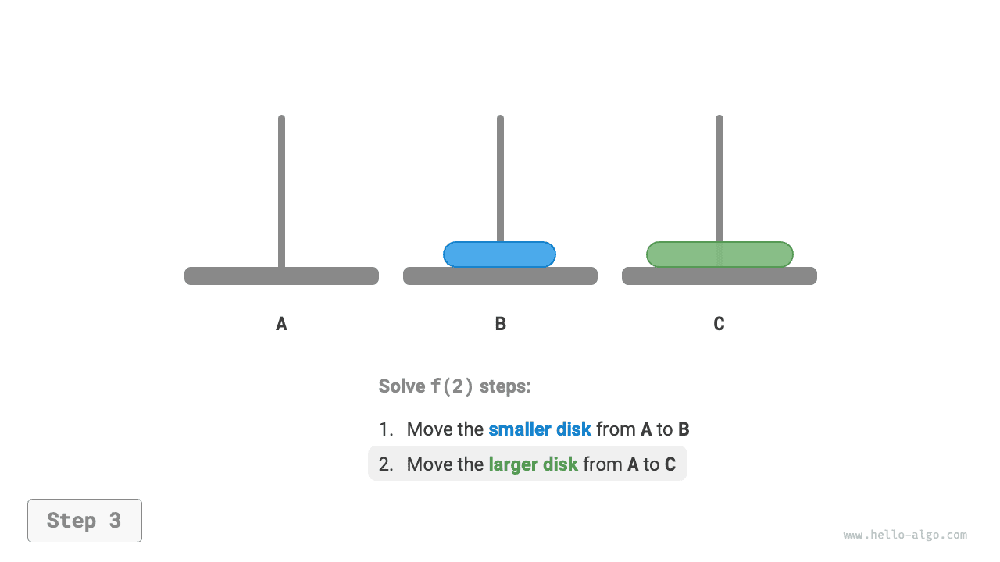
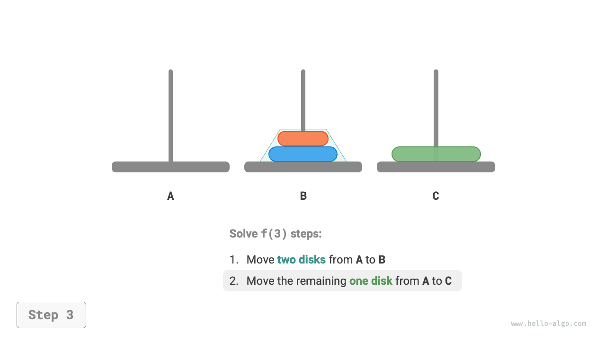
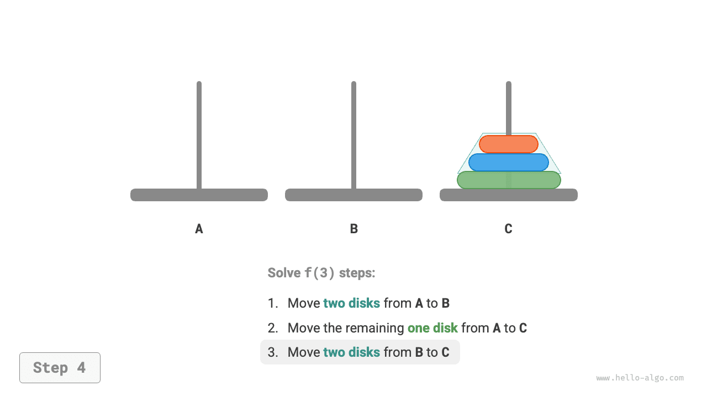

#Vấn đề Hanota

Trong việc sắp xếp hợp nhất và xây dựng cây nhị phân, chúng ta phân tách bài toán ban đầu thành hai bài toán con, mỗi bài toán có kích thước bằng một nửa bài toán ban đầu. Tuy nhiên, đối với bài toán haota, chúng tôi áp dụng một chiến lược phân rã khác.

!!! câu hỏi

Cho ba trụ cột, ký hiệu là `A`, `B` và `C`. Ban đầu cột `A` có $n$ đĩa xếp chồng lên nhau, xếp từ trên xuống dưới theo thứ tự kích thước tăng dần. Nhiệm vụ của chúng ta là di chuyển các đĩa $n$ này sang cột `C` trong khi vẫn giữ nguyên thứ tự ban đầu của chúng (như trong hình bên dưới). Phải tuân thủ các quy tắc sau đây khi di chuyển đĩa.

1. Đĩa chỉ được lấy từ đầu cột này và đặt lên trên cột khác.
    2. Mỗi lần chỉ có thể di chuyển một đĩa.
    3. Đĩa nhỏ hơn phải luôn nằm trên đĩa lớn hơn.


**Chúng ta ký hiệu bài toán haota có kích thước $i$ là $f(i)$**. Ví dụ: $f(3)$ thể hiện việc di chuyển các đĩa $3$ từ `A` sang `C`.

### Xét các trường hợp cơ bản

Như trong hình bên dưới, đối với bài toán $f(1)$, khi chỉ có một đĩa, chúng ta có thể di chuyển nó trực tiếp từ `A` sang `C`.

=== "<1>"
    

=== "<2>"
    

Như minh họa trong hình bên dưới, đối với bài toán $f(2)$, khi có hai đĩa, **vì chúng ta phải luôn giữ đĩa nhỏ hơn ở trên đĩa lớn hơn, nên chúng ta cần sử dụng `B` để hỗ trợ di chuyển**.

1. Đầu tiên, di chuyển đĩa nhỏ hơn từ `A` sang `B`.
2. Sau đó di chuyển đĩa lớn hơn từ `A` sang `C`.
3. Cuối cùng, di chuyển đĩa nhỏ hơn từ `B` sang `C`.

=== "<1>"
    

=== "<2>"
    

=== "<3>"
    

=== "<4>"
    

Quá trình giải bài toán $f(2)$ có thể tóm tắt như sau: **di chuyển hai đĩa từ `A` sang `C` với sự trợ giúp của `B`**. Ở đây, `C` được gọi là trụ mục tiêu và `B` được gọi là trụ đệm.

### Phân tách bài toán con

Đối với bài toán $f(3)$, khi có ba đĩa, tình huống trở nên phức tạp hơn một chút.

Vì chúng ta đã biết các giải pháp cho $f(1)$ và $f(2)$, nên chúng ta có thể suy nghĩ từ góc độ phân chia và chinh phục, **xử lý toàn bộ hai đĩa trên cùng trên `A`** và thực hiện các bước được hiển thị trong hình bên dưới. Thao tác này đã di chuyển thành công ba đĩa từ `A` sang `C`.

1. Đặt `B` là trụ mục tiêu và `C` là trụ đệm và di chuyển hai đĩa từ `A` sang `B`.
2. Di chuyển đĩa còn lại từ `A` trực tiếp sang `C`.
3. Đặt `C` là trụ mục tiêu và `A` là trụ đệm và di chuyển hai đĩa từ `B` sang `C`.

=== "<1>"
    

=== "<2>"
    

=== "<3>"
    

=== "<4>"
    

Về cơ bản, **chúng ta chia bài toán $f(3)$ thành hai bài toán con $f(2)$ và một bài toán con $f(1)$**. Bằng cách giải quyết ba bài toán con này theo thứ tự, bài toán ban đầu sẽ được giải. Điều này cho thấy các bài toán con là độc lập và lời giải của chúng có thể được hợp nhất.

Từ đó, chúng ta có thể tóm tắt chiến lược chia để trị để giải bài toán hanota như trong hình bên dưới: chia bài toán ban đầu $f(n)$ thành hai bài toán con $f(n-1)$ và một bài toán con $f(1)$, và giải ba bài toán con này theo thứ tự sau.

1. Di chuyển các đĩa $n-1$ từ `A` sang `B` với sự trợ giúp của `C`.
2. Di chuyển trực tiếp đĩa $1$ còn lại từ `A` sang `C`.
3. Di chuyển các đĩa $n-1$ từ `B` sang `C` với sự trợ giúp của `A`.

Đối với hai bài toán con $f(n-1)$ này, **chúng ta có thể chia chúng theo cách tương tự** cho đến khi đạt đến bài toán con nhỏ nhất $f(1)$. Lời giải của $f(1)$ đã được biết và chỉ cần một thao tác di chuyển.


### Triển khai mã

Trong mã, chúng ta khai báo một hàm đệ quy `dfs(i, src, buf, tar)`, với mục đích là di chuyển các đĩa $i$ trên cùng từ cột `src` sang cột đích `tar` với sự trợ giúp của cột đệm `buf`:

```src
[file]{hanota}-[class]{}-[func]{solve_hanota}
```

Như được hiển thị trong hình bên dưới, bài toán hanota tạo thành một cây đệ quy có chiều cao $n$, trong đó mỗi nút biểu thị một bài toán con tương ứng với một lệnh gọi hàm `dfs()`, **do đó độ phức tạp về thời gian là $O(2^n)$ và độ phức tạp về không gian là $O(n)$**.


!!! trích dẫn

Vấn đề hanota bắt nguồn từ một truyền thuyết cổ xưa. Trong một ngôi chùa ở Ấn Độ cổ đại, các nhà sư có ba cột kim cương cao và những chiếc đĩa vàng trị giá 64 đô la với nhiều kích cỡ khác nhau. Các nhà sư liên tục di chuyển những chiếc đĩa vì tin rằng khi chiếc đĩa cuối cùng được đặt đúng chỗ, thế giới sẽ kết thúc.

Tuy nhiên, ngay cả khi các nhà sư di chuyển một đĩa mỗi giây, thì cũng sẽ mất khoảng $2^{64} \approx 1,84×10^{19}$ giây, tức là khoảng $585$ tỷ năm, vượt xa ước tính hiện tại về tuổi của vũ trụ. Vì vậy, nếu truyền thuyết này là sự thật thì chúng ta không cần phải lo lắng về ngày tận thế.
