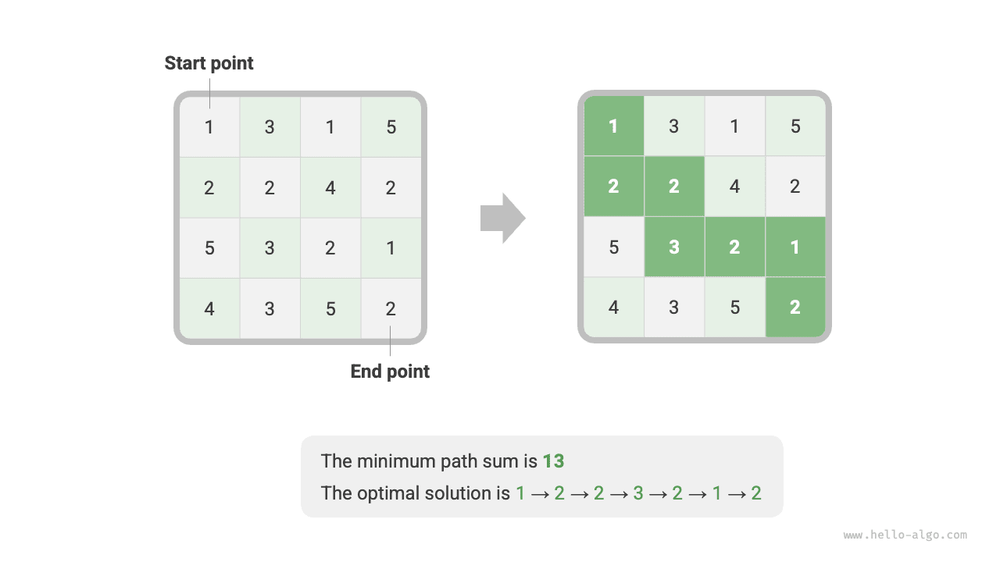
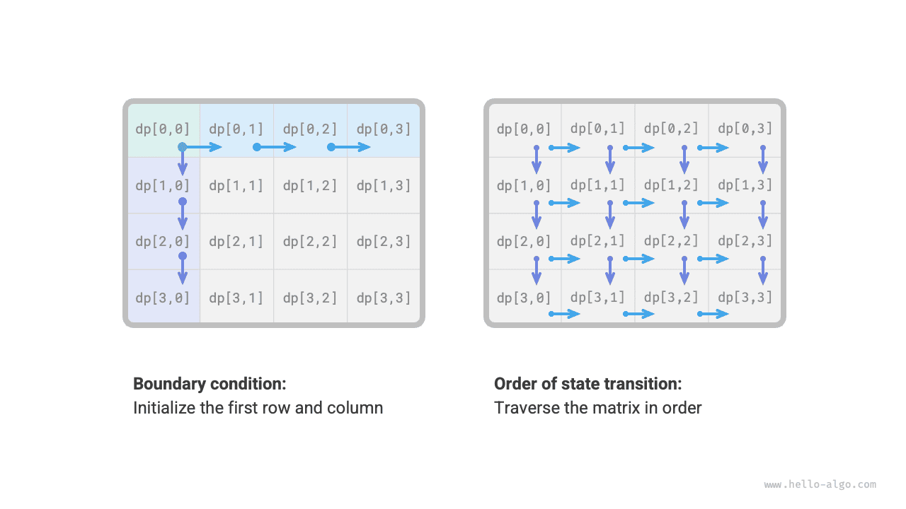
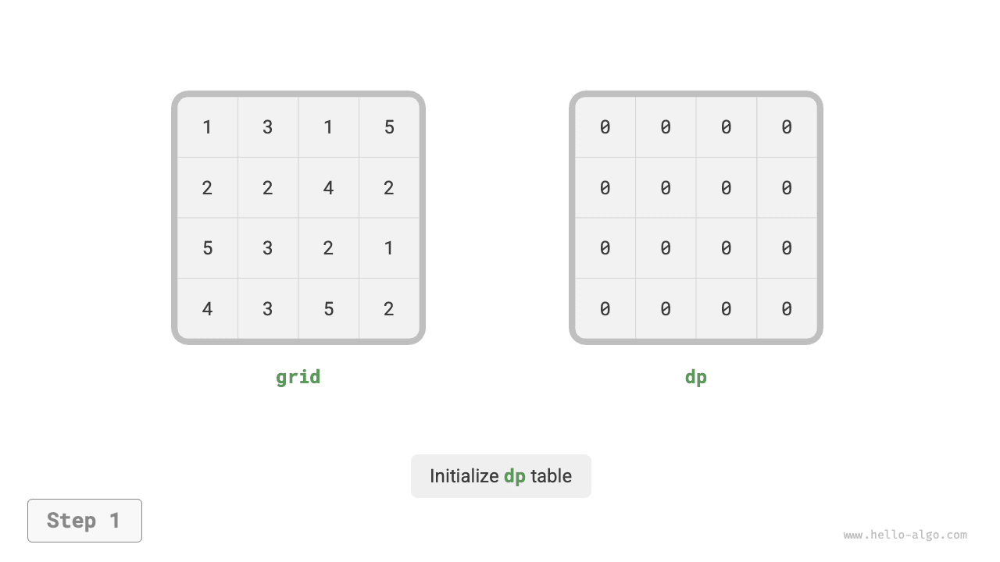
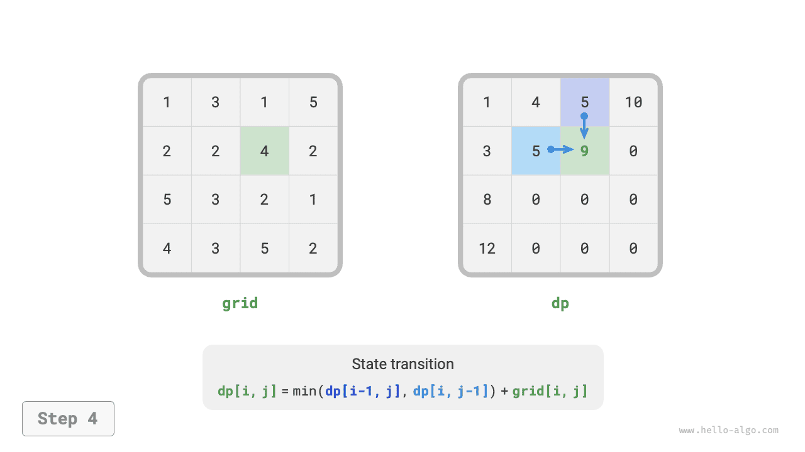
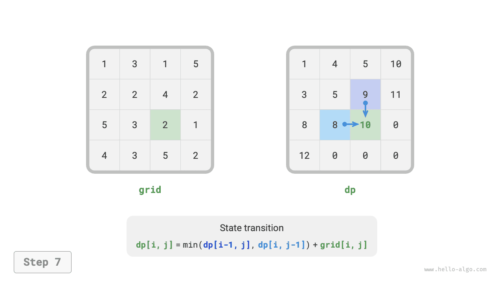
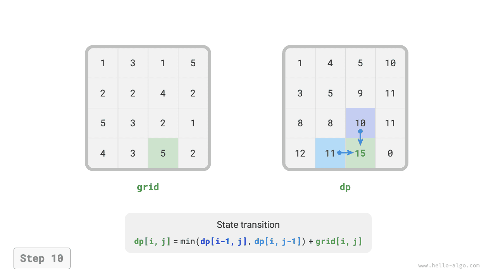

# Phương pháp giải quyết vấn đề lập trình động

Hai phần trước đã giới thiệu những đặc điểm chính của bài toán quy hoạch động. Tiếp theo, chúng ta hãy cùng nhau khám phá thêm hai vấn đề thực tế nữa.

1. Làm thế nào để xác định một bài toán có phải là bài toán quy hoạch động hay không?
2. Quy trình hoàn chỉnh để giải một bài toán quy hoạch động là gì và chúng ta nên bắt đầu từ đâu?

## Xác định vấn đề

Nói chung, nếu một bài toán chứa các bài toán con chồng chéo, cấu trúc con tối ưu và không thỏa mãn hậu quả nào thì nó thường phù hợp để giải quyết bằng quy hoạch động. Tuy nhiên, rất khó để trích xuất trực tiếp những đặc điểm này từ mô tả vấn đề. Do đó, chúng tôi thường nới lỏng các điều kiện và **trước tiên quan sát xem bài toán có phù hợp để giải bằng phương pháp quay lui (tìm kiếm toàn diện)** hay không.

**Các bài toán phù hợp để giải quyết bằng quay lui thường thỏa mãn "mô hình cây quyết định"**, nghĩa là bài toán có thể được mô tả bằng cấu trúc cây, trong đó mỗi nút biểu thị một quyết định và mỗi đường dẫn biểu thị một chuỗi các quyết định.

Nói cách khác, nếu một vấn đề chứa một khái niệm rõ ràng về các quyết định và giải pháp được tạo ra thông qua một loạt các quyết định thì nó thỏa mãn mô hình cây quyết định và thường có thể được giải quyết bằng cách quay lui.

Trên cơ sở đó, bài toán quy hoạch động cũng có một số dấu hiệu tích cực.

- Vấn đề chứa các mô tả như tối đa (tối thiểu) hoặc nhiều nhất (ít nhất), biểu thị sự tối ưu hóa.
- Trạng thái của bài toán có thể được biểu diễn bằng danh sách, ma trận nhiều chiều hoặc cây và trạng thái có mối quan hệ lặp lại với các trạng thái xung quanh nó.

Tương ứng, cũng có một số chỉ số tiêu cực.

- Mục tiêu của bài toán là tìm ra tất cả các giải pháp có thể, chứ không phải là tìm ra giải pháp tối ưu.
- Việc mô tả bài toán có tính chất hoán vị, tổ hợp rõ ràng, đòi hỏi phải trả về nhiều nghiệm cụ thể.

Nếu một bài toán thỏa mãn mô hình cây quyết định và có các chỉ số tích cực tương đối rõ ràng, chúng ta có thể cho rằng đó là bài toán quy hoạch động và kiểm chứng giả định đó trong quá trình giải.

## Các bước giải quyết vấn đề

Quá trình giải quyết vấn đề trong lập trình động thay đổi tùy thuộc vào tính chất và độ khó của vấn đề, nhưng thường tuân theo các bước sau: mô tả các quyết định, xác định trạng thái, thiết lập bảng $dp$, suy ra phương trình chuyển đổi trạng thái, xác định các điều kiện biên, v.v.

Để minh họa các bước giải quyết vấn đề một cách sinh động hơn, chúng tôi sử dụng một bài toán kinh điển “tổng đường dẫn tối thiểu” làm ví dụ.

!!! câu hỏi

Cho một `lưới` hai chiều $n \times m$ trong đó mỗi ô chứa một số nguyên không âm biểu thị giá trị của nó, robot bắt đầu từ ô trên cùng bên trái và chỉ có thể di chuyển xuống hoặc sang phải ở mỗi bước cho đến khi đến ô dưới cùng bên phải. Trả về tổng đường dẫn tối thiểu từ trên cùng bên trái đến dưới cùng bên phải.

Hình bên dưới hiển thị một ví dụ trong đó tổng đường dẫn tối thiểu cho lưới đã cho là $13$.



**Bước 1: Suy nghĩ về các quyết định trong mỗi vòng, xác định trạng thái và từ đó nhận được bảng $dp$**

Quyết định trong mỗi vòng của bài toán này là di chuyển xuống một bước hoặc sang phải từ ô hiện tại. Đặt chỉ số hàng và cột của ô hiện tại là $[i, j]$. Sau khi di chuyển xuống hoặc sang phải, các chỉ số trở thành $[i+1, j]$ hoặc $[i, j+1]$. Do đó, trạng thái nên bao gồm hai biến, chỉ mục hàng và chỉ mục cột, ký hiệu là $[i, j]$.

Trạng thái $[i, j]$ tương ứng với bài toán con: **tổng đường đi tối thiểu từ điểm bắt đầu $[0, 0]$ đến $[i, j]$**, ký hiệu là $dp[i, j]$.

Từ đó, chúng ta thu được ma trận $dp$ hai chiều được hiển thị trong hình bên dưới, có kích thước giống với lưới đầu vào $grid$.


!!! ghi chú

Quá trình lập trình động và quay lui có thể được mô tả như một chuỗi các quyết định và trạng thái bao gồm tất cả các biến quyết định. Nó phải chứa tất cả các biến mô tả tiến trình giải quyết vấn đề và phải chứa đủ thông tin để rút ra trạng thái tiếp theo.

Mỗi trạng thái tương ứng với một bài toán con và chúng tôi xác định một bảng $dp$ để lưu trữ lời giải cho tất cả các bài toán con. Mỗi biến độc lập của trạng thái là một thứ nguyên của bảng $dp$. Về cơ bản, bảng $dp$ là ánh xạ giữa các trạng thái và giải pháp cho các bài toán con.

**Bước 2: Xác định cấu trúc con tối ưu và sau đó rút ra phương trình chuyển trạng thái**

Đối với trạng thái $[i, j]$, nó chỉ có thể chuyển từ ô phía trên $[i-1, j]$ hoặc ô sang $[i, j-1]$ bên trái. Do đó, cấu trúc con tối ưu là: tổng đường dẫn tối thiểu để đạt tới $[i, j]$ được xác định bằng giá trị nhỏ hơn của tổng đường dẫn tối thiểu của $[i, j-1]$ và $[i-1, j]$.

Dựa trên phân tích trên, có thể rút ra phương trình chuyển trạng thái như trong hình bên dưới:

$$
dp[i, j] = \min(dp[i-1, j], dp[i, j-1]) + lưới[i, j]
$$


!!! ghi chú

Dựa trên bảng $dp$ đã xác định, hãy suy nghĩ về mối quan hệ giữa bài toán ban đầu và các bài toán con, đồng thời tìm ra phương pháp xây dựng lời giải tối ưu cho bài toán ban đầu từ lời giải tối ưu cho các bài toán con, tức là cấu trúc con tối ưu.

Khi xác định được cấu trúc con tối ưu, chúng ta có thể sử dụng nó để xây dựng phương trình chuyển trạng thái.

**Bước 3: Xác định điều kiện biên và thứ tự chuyển trạng thái**

Trong bài toán này, các trạng thái ở hàng đầu tiên chỉ có thể đến từ trạng thái ở bên trái và các trạng thái ở cột đầu tiên chỉ có thể đến từ trạng thái phía trên chúng. Do đó, hàng đầu tiên $i = 0$ và cột đầu tiên $j = 0$ là các điều kiện biên.

Như được hiển thị trong hình bên dưới, vì mỗi ô chuyển đổi từ ô sang trái và ô phía trên nó, nên chúng ta sử dụng các vòng lặp để duyệt ma trận, với vòng lặp bên ngoài đi qua các hàng và vòng lặp bên trong đi qua các cột.



!!! ghi chú

Các điều kiện biên trong lập trình động được sử dụng để khởi tạo bảng $dp$, trong khi trong tìm kiếm, chúng được sử dụng để cắt tỉa.

Cốt lõi của thứ tự chuyển trạng thái là đảm bảo rằng khi tính toán lời giải cho bài toán hiện tại, tất cả các bài toán con nhỏ hơn mà nó phụ thuộc vào đều đã được tính toán chính xác.

Dựa trên phân tích trên, chúng ta có thể viết trực tiếp mã lập trình động. Tuy nhiên, phân rã bài toán con là cách tiếp cận từ trên xuống, vì vậy việc triển khai theo thứ tự "tìm kiếm mạnh mẽ $\rightarrow$ ghi nhớ $\rightarrow$ lập trình động" sẽ phù hợp hơn với thói quen tư duy.

### Cách 1: Brute Force Search

Bắt đầu từ trạng thái $[i, j]$, chúng tôi liên tục phân tách nó thành các trạng thái nhỏ hơn $[i-1, j]$ và $[i, j-1]$. Hàm đệ quy bao gồm các phần tử sau.

- **Tham số đệ quy**: trạng thái $[i, j]$.
- **Giá trị trả về**: tổng đường dẫn tối thiểu từ $[0, 0]$ đến $[i, j]$, tức là $dp[i, j]$.
- **Điều kiện kết thúc**: khi $i = 0$ và $j = 0$, chi phí trả về $grid[0, 0]$.
- **Pruning**: khi $i < 0$ hoặc $j < 0$, chỉ số nằm ngoài giới hạn, chi phí trả về $+\infty$, thể hiện tính không khả thi.

Mã thực hiện như sau:

```src
[file]{min_path_sum}-[class]{}-[func]{min_path_sum_dfs}
```

Hình bên dưới cho thấy cây đệ quy bắt nguồn từ $dp[2, 1]$, bao gồm một số bài toán con chồng chéo mà số lượng của chúng sẽ tăng mạnh khi kích thước của lưới `lưới` tăng lên.

Về cơ bản, lý do cho các bài toán con chồng chéo là: **có nhiều đường dẫn từ góc trên bên trái để đến một ô nhất định**.


Mỗi trạng thái có hai lựa chọn, xuống và phải, do đó tổng số bước từ góc trên bên trái đến góc dưới cùng bên phải là $m + n - 2$, cho độ phức tạp về thời gian trong trường hợp xấu nhất là $O(2^{m + n})$, trong đó $n$ và $m$ lần lượt là số hàng và số cột của lưới. Lưu ý rằng phép tính này không tính đến các tình huống gần ranh giới lưới, trong đó chỉ còn lại một lựa chọn khi đến ranh giới lưới, do đó số lượng đường dẫn thực tế sẽ ít hơn một chút.

### Cách 2: Ghi nhớ

Chúng tôi giới thiệu một danh sách ghi nhớ `mem` có cùng kích thước với lưới `lưới` để ghi lại lời giải cho các bài toán con và loại bỏ các bài toán con chồng chéo:

```src
[file]{min_path_sum}-[class]{}-[func]{min_path_sum_dfs_mem}
```

Như được hiển thị trong hình bên dưới, sau khi giới thiệu tính năng ghi nhớ, tất cả các giải pháp của bài toán con chỉ cần được tính toán một lần, do đó độ phức tạp về thời gian phụ thuộc vào tổng số trạng thái, tức là kích thước lưới $O(nm)$.


### Cách 3: Lập trình động

Triển khai giải pháp lập trình động dựa trên phép lặp, như trong đoạn mã bên dưới:

```src
[file]{min_path_sum}-[class]{}-[func]{min_path_sum_dp}
```

Hình bên dưới hiển thị quá trình chuyển đổi trạng thái cho tổng đường dẫn tối thiểu, đi qua toàn bộ lưới, **do đó độ phức tạp về thời gian là $O(nm)$**.

Mảng `dp` có kích thước $n \times m$, **do đó độ phức tạp của không gian là $O(nm)$**.

=== "<1>"
    

=== "<2>"
    

=== "<3>"
    

=== "<4>"
    

=== "<5>"
    

=== "<6>"
    

=== "<7>"
    

=== "<8>"
    

=== "<9>"
    

=== "<10>"
    

=== "<11>"
    

=== "<12>"
    

### Tối ưu hóa không gian


Lưu ý rằng vì mảng `dp` chỉ có thể biểu thị trạng thái của một hàng, nên chúng ta không thể khởi tạo trước trạng thái cột đầu tiên mà thay vào đó hãy cập nhật nó khi duyệt qua từng hàng:

```src
[file]{min_path_sum}-[class]{}-[func]{min_path_sum_dp_comp}
```
