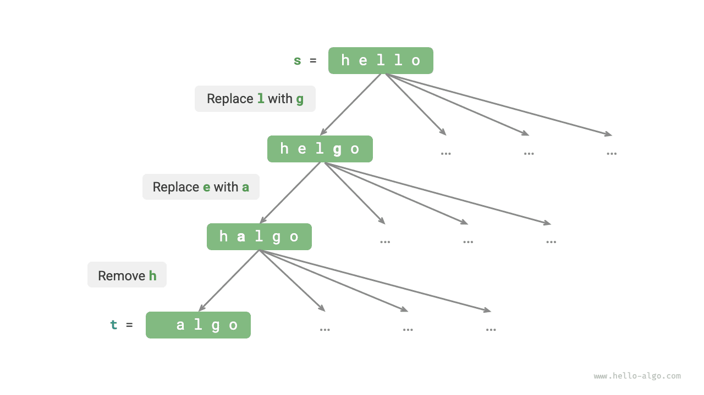
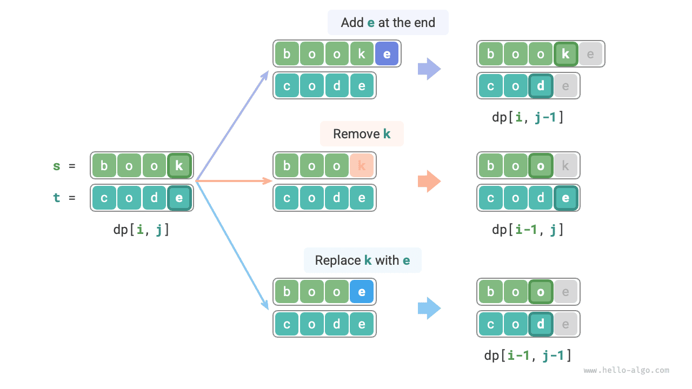
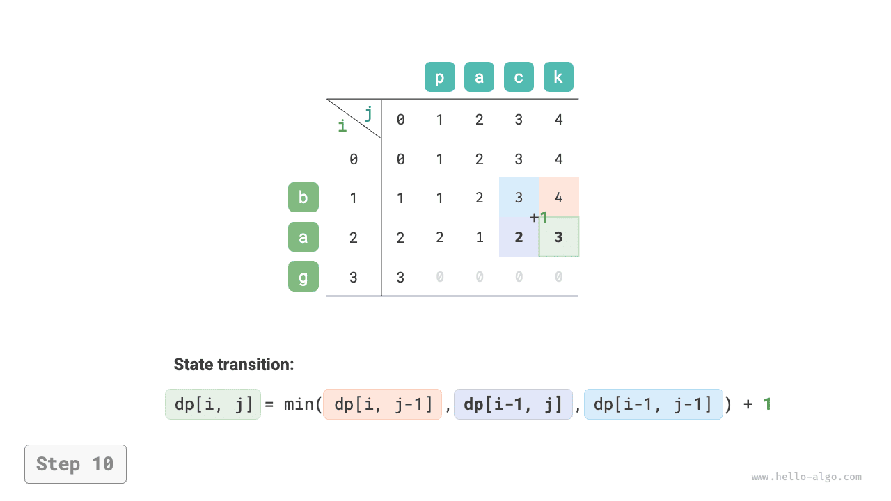
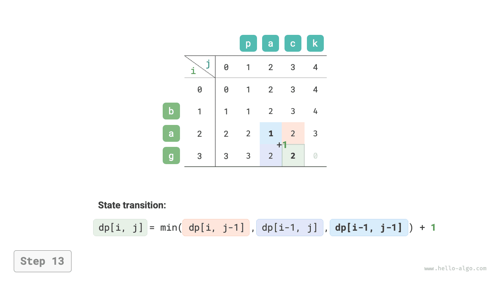
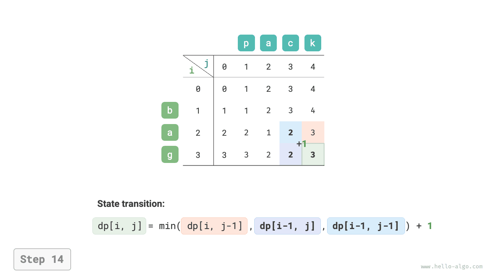

# Chỉnh sửa vấn đề khoảng cách

Khoảng cách chỉnh sửa, còn được gọi là khoảng cách Levenshtein, đề cập đến số lần chỉnh sửa tối thiểu cần thiết để chuyển đổi chuỗi này sang chuỗi khác, thường được sử dụng trong truy xuất thông tin và xử lý ngôn ngữ tự nhiên để đo lường độ tương tự giữa hai chuỗi.

!!! câu hỏi

Cho hai chuỗi $s$ và $t$, trả về số lần chỉnh sửa tối thiểu cần thiết để chuyển đổi $s$ thành $t$.

Bạn có thể thực hiện ba loại thao tác chỉnh sửa trên một chuỗi: chèn ký tự, xóa ký tự hoặc thay thế ký tự bằng bất kỳ ký tự nào khác.

Như hình bên dưới, việc chuyển `mèo con` thành `ngồi` cần 3 lần chỉnh sửa, trong đó có 2 lần thay thế và 1 lần chèn; việc chuyển đổi `hello` thành `algo` cần 3 bước, trong đó có 2 lần thay thế và 1 lần xóa.


**Vấn đề về khoảng cách chỉnh sửa có thể được giải thích một cách tự nhiên bằng mô hình cây quyết định**. Các chuỗi tương ứng với các nút của cây và mỗi thao tác chỉnh sửa tương ứng với một cạnh trong cây.

Như được hiển thị trong hình bên dưới, không hạn chế các thao tác, mỗi nút có thể phân nhánh thành nhiều cạnh, với mỗi cạnh tương ứng với một thao tác, nghĩa là có nhiều đường dẫn có thể chuyển đổi `hello` thành `algo`.

Từ góc độ cây quyết định, mục tiêu của bài toán này là tìm đường đi ngắn nhất giữa nút `hello` và nút `algo`.



### Phương pháp lập trình động

**Bước 1: Suy nghĩ về các quyết định trong mỗi vòng, xác định trạng thái và từ đó nhận được bảng $dp$**

Mỗi vòng quyết định bao gồm việc thực hiện một thao tác chỉnh sửa trên chuỗi $s$.

Chúng ta muốn kích thước bài toán giảm dần trong quá trình chỉnh sửa để có thể xây dựng các bài toán con. Gọi độ dài của chuỗi $s$ và $t$ lần lượt là $n$ và $m$. Đầu tiên chúng ta xem xét các ký tự đuôi của hai chuỗi, $s[n-1]$ và $t[m-1]$.

- Nếu $s[n-1]$ và $t[m-1]$ giống nhau thì chúng ta có thể bỏ qua chúng và xét trực tiếp $s[n-2]$ và $t[m-2]$.
- Nếu $s[n-1]$ và $t[m-1]$ khác nhau, chúng ta cần thực hiện một chỉnh sửa trên $s$ (chèn, xóa hoặc thay thế) để làm cho các ký tự đuôi của hai chuỗi giống nhau, cho phép chúng ta bỏ qua chúng và xem xét một vấn đề ở quy mô nhỏ hơn.

Nói cách khác, mỗi vòng quyết định (thao tác chỉnh sửa) chúng ta thực hiện trên chuỗi $s$ sẽ thay đổi các ký tự còn lại để khớp với $s$ và $t$. Do đó, trạng thái là các ký tự $i$-th và $j$-th hiện đang được xem xét trong $s$ và $t$, ký hiệu là $[i, j]$.

Trạng thái $[i, j]$ tương ứng với bài toán con: **số lần chỉnh sửa tối thiểu cần thiết để thay đổi $i$ ký tự đầu tiên của $s$ thành $j$ ký tự đầu tiên của $t$**.

Từ đó, chúng ta thu được một bảng $dp$ hai chiều có kích thước $(i+1) \times (j+1)$.

**Bước 2: Xác định cấu trúc con tối ưu và sau đó rút ra phương trình chuyển trạng thái**

Hãy xem xét bài toán con $dp[i, j]$, trong đó các ký tự đuôi của hai chuỗi tương ứng là $s[i-1]$ và $t[j-1]$, có thể chia thành ba trường hợp như minh họa trong hình bên dưới dựa trên các thao tác chỉnh sửa khác nhau.

1. Chèn $t[j-1]$ vào sau $s[i-1]$ thì bài toán con còn lại là $dp[i, j-1]$.
2. Xóa $s[i-1]$ thì bài toán con còn lại là $dp[i-1, j]$.
3. Thay $s[i-1]$ bằng $t[j-1]$ thì bài toán con còn lại là $dp[i-1, j-1]$.



Dựa trên phân tích ở trên, chúng tôi thu được cấu trúc con tối ưu: số lần chỉnh sửa tối thiểu cho $dp[i, j]$ bằng với mức tối thiểu của $dp[i, j-1]$, $dp[i-1, j]$ và $dp[i-1, j-1]$, cộng với chi phí chỉnh sửa hiện tại là $1$. Phương trình chuyển trạng thái tương ứng là:

$$
dp[i, j] = \min(dp[i, j-1], dp[i-1, j], dp[i-1, j-1]) + 1
$$

Xin lưu ý rằng **khi $s[i-1]$ và $t[j-1]$ giống nhau, không cần chỉnh sửa ký tự hiện tại**, trong trường hợp đó phương trình chuyển trạng thái là:

$$
dp[i, j] = dp[i-1, j-1]
$$

**Bước 3: Xác định điều kiện biên và thứ tự chuyển trạng thái**

Khi cả hai chuỗi đều trống, số bước chỉnh sửa là $0$, tức là $dp[0, 0] = 0$. Khi $s$ trống nhưng $t$ thì không, số bước chỉnh sửa tối thiểu bằng độ dài của $t$, tức là hàng đầu tiên $dp[0, j] = j$. Khi $s$ không trống nhưng $t$ trống, số bước chỉnh sửa tối thiểu bằng độ dài của $s$, tức là cột đầu tiên $dp[i, 0] = i$.

Quan sát phương trình chuyển trạng thái, nghiệm $dp[i, j]$ phụ thuộc vào nghiệm ở bên trái, phía trên và phía trên bên trái, do đó toàn bộ bảng $dp$ có thể được duyệt theo thứ tự thông qua hai vòng lặp lồng nhau.

### Triển khai mã

```src
[file]{edit_distance}-[class]{}-[func]{edit_distance_dp}
```

Như thể hiện trong hình bên dưới, quá trình chuyển đổi trạng thái cho bài toán khoảng cách chỉnh sửa rất giống với bài toán chiếc ba lô; cả hai đều có thể được xem như là quá trình lấp đầy lưới hai chiều.

=== "<1>"
    

=== "<2>"
    

=== "<3>"
    

=== "<4>"
    

=== "<5>"
    

=== "<6>"
    

=== "<7>"
    

=== "<8>"
    

=== "<9>"
    

=== "<10>"
    

=== "<11>"
    

=== "<12>"
    

=== "<13>"
    

=== "<14>"
    

=== "<15>"
    

### Tối ưu hóa không gian

Vì $dp[i, j]$ phụ thuộc vào các trạng thái phía trên $dp[i-1, j]$, ở bên trái $dp[i, j-1]$, và ở phía trên bên trái $dp[i-1, j-1]$, nên việc truyền tải về phía trước sẽ mất trạng thái phía trên bên trái $dp[i-1, j-1]$, trong khi việc truyền tải ngược lại không thể xây dựng trước $dp[i, j-1]$, do đó cả thứ tự truyền tải đều không phù hợp.

Vì lý do này, chúng ta có thể sử dụng biến `leftup` để lưu trữ tạm thời nghiệm trên bên trái $dp[i-1, j-1]$, vì vậy chúng ta chỉ cần xem xét các nghiệm ở bên trái và phía trên. Tình huống này giống như trong bài toán ba lô không giới hạn, vì vậy chúng ta có thể sử dụng phương pháp truyền tải xuôi. Mã này như sau:

```src
[file]{edit_distance}-[class]{}-[func]{edit_distance_dp_comp}
```
