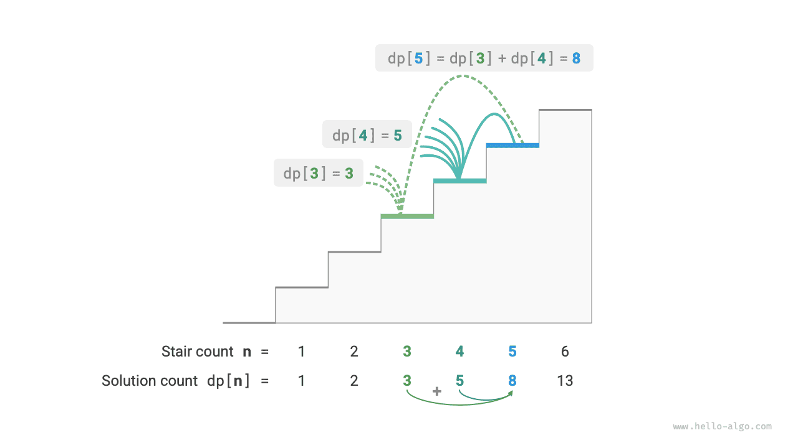

#Giới thiệu về lập trình động

<u>Dynamic programming</u> is an important algorithmic paradigm that decomposes a problem into a series of smaller subproblems and avoids redundant computation by storing the solutions to subproblems, thereby significantly improving time efficiency.

Trong phần này, chúng tôi bắt đầu với một ví dụ cổ điển, trước tiên trình bày giải pháp quay lui mạnh mẽ, quan sát các bài toán con chồng chéo bên trong nó và sau đó dần dần tìm ra giải pháp lập trình động hiệu quả hơn.

!!! Câu hỏi “Leo cầu thang”

Cho một cầu thang có $n$ bậc, trong đó bạn có thể leo từng bậc $1$ hoặc $2$ một lần, có bao nhiêu cách khác nhau để lên đến đỉnh?

Như thể hiện trong hình bên dưới, đối với cầu thang $3$, có nhiều cách khác nhau $3$ để lên tới đỉnh.


Mục tiêu của bài toán này là xác định số cách, vì vậy **chúng ta có thể xem xét sử dụng phương pháp quay lui để liệt kê tất cả các khả năng**. Cụ thể, hãy tưởng tượng việc leo cầu thang như một quá trình lựa chọn nhiều vòng: bắt đầu từ mặt đất, chọn đi lên các bậc $1$ hoặc $2$ trong mỗi vòng, tăng số lượng lên $1$ bất cứ khi nào đạt đến đỉnh cầu thang và cắt tỉa khi vượt quá đỉnh. Mã này như sau:

=== "Python"
    ```python title="climbing_stairs_backtrack.py"
    def climbing_stairs_backtrack(n: int) -> int:
        """Climbing stairs: Backtracking"""
        choices = [1, 2]  # Can choose to climb up 1 or 2 stairs
        state = 0  # Start climbing from the 0-th stair
        res = [0]  # Use res[0] to record the solution count
        backtrack(choices, state, n, res)
        return res[0]
    ```
=== "C++"
    ```cpp title="climbing_stairs_backtrack.cpp"
    int climbingStairsBacktrack(int n) {
        vector<int> choices = {1, 2}; // Can choose to climb up 1 or 2 stairs
        int state = 0;                // Start climbing from the 0-th stair
        vector<int> res = {0};        // Use res[0] to record the solution count
        backtrack(choices, state, n, res);
        return res[0];
    }
    ```
=== "Java"
    ```java title="climbing_stairs_backtrack.java"
    public class climbing_stairs_backtrack {
        /* Backtracking */
        public static void backtrack(List<Integer> choices, int state, int n, List<Integer> res) {
            // When climbing to the n-th stair, add 1 to the solution count
            if (state == n)
                res.set(0, res.get(0) + 1);
            // Traverse all choices
            for (Integer choice : choices) {
                // Pruning: not allowed to go beyond the n-th stair
                if (state + choice > n)
                    continue;
                // Attempt: make choice, update state
                backtrack(choices, state + choice, n, res);
                // Backtrack
            }
        }
    
        /* Climbing stairs: Backtracking */
        public static int climbingStairsBacktrack(int n) {
            List<Integer> choices = Arrays.asList(1, 2); // Can choose to climb up 1 or 2 stairs
            int state = 0; // Start climbing from the 0-th stair
            List<Integer> res = new ArrayList<>();
            res.add(0); // Use res[0] to record the solution count
            backtrack(choices, state, n, res);
            return res.get(0);
        }
    
        public static void main(String[] args) {
            int n = 9;
    
            int res = climbingStairsBacktrack(n);
            System.out.println(String.format("Climbing %d stairs has %d solutions", n, res));
        }
    }
    ```
=== "C#"
    ```csharp title="climbing_stairs_backtrack.cs"
    public class climbing_stairs_backtrack {
        /* Backtracking */
        void Backtrack(List<int> choices, int state, int n, List<int> res) {
            // When climbing to the n-th stair, add 1 to the solution count
            if (state == n)
                res[0]++;
            // Traverse all choices
            foreach (int choice in choices) {
                // Pruning: not allowed to go beyond the n-th stair
                if (state + choice > n)
                    continue;
                // Attempt: make choice, update state
                Backtrack(choices, state + choice, n, res);
                // Backtrack
            }
        }
    
        /* Climbing stairs: Backtracking */
        int ClimbingStairsBacktrack(int n) {
            List<int> choices = [1, 2]; // Can choose to climb up 1 or 2 stairs
            int state = 0; // Start climbing from the 0-th stair
            List<int> res = [0]; // Use res[0] to record the solution count
            Backtrack(choices, state, n, res);
            return res[0];
        }
    
        [Test]
        public void Test() {
            int n = 9;
            int res = ClimbingStairsBacktrack(n);
            Console.WriteLine($"Climbing {n} stairs has {res} solutions");
        }
    }
    ```
=== "Go"
    ```go title="climbing_stairs_backtrack.go"
    func climbingStairsBacktrack(n int) int {
    	// Can choose to climb up 1 or 2 stairs
    	choices := []int{1, 2}
    	// Start climbing from the 0-th stair
    	state := 0
    	res := make([]int, 1)
    	// Use res[0] to record the solution count
    	res[0] = 0
    	backtrack(choices, state, n, res)
    	return res[0]
    }
    ```
=== "Swift"
    ```swift title="climbing_stairs_backtrack.swift"
    func climbingStairsBacktrack(n: Int) -> Int {
        let choices = [1, 2] // Can choose to climb up 1 or 2 stairs
        let state = 0 // Start climbing from the 0-th stair
        var res: [Int] = []
        res.append(0) // Use res[0] to record the solution count
        backtrack(choices: choices, state: state, n: n, res: &res)
        return res[0]
    }
    ```
=== "JS"
    ```javascript title="climbing_stairs_backtrack.js"
    function climbingStairsBacktrack(n) {
        const choices = [1, 2]; // Can choose to climb up 1 or 2 stairs
        const state = 0; // Start climbing from the 0-th stair
        const res = new Map();
        res.set(0, 0); // Use res[0] to record the solution count
        backtrack(choices, state, n, res);
        return res.get(0);
    }
    ```
=== "TS"
    ```typescript title="climbing_stairs_backtrack.ts"
    function climbingStairsBacktrack(n: number): number {
        const choices = [1, 2]; // Can choose to climb up 1 or 2 stairs
        const state = 0; // Start climbing from the 0-th stair
        const res = new Map();
        res.set(0, 0); // Use res[0] to record the solution count
        backtrack(choices, state, n, res);
        return res.get(0);
    }
    ```
=== "Dart"
    ```dart title="climbing_stairs_backtrack.dart"
    int climbingStairsBacktrack(int n) {
      List<int> choices = [1, 2]; // Can choose to climb up 1 or 2 stairs
      int state = 0; // Start climbing from the 0-th stair
      List<int> res = [];
      res.add(0); // Use res[0] to record the solution count
      backtrack(choices, state, n, res);
      return res[0];
    }
    ```
=== "Rust"
    ```rust title="climbing_stairs_backtrack.rs"
    fn climbing_stairs_backtrack(n: usize) -> i32 {
        let choices = vec![1, 2]; // Can choose to climb up 1 or 2 stairs
        let state = 0; // Start climbing from the 0-th stair
        let mut res = Vec::new();
        res.push(0); // Use res[0] to record the solution count
        backtrack(&choices, state, n as i32, &mut res);
        res[0]
    }
    ```
=== "C"
    ```c title="climbing_stairs_backtrack.c"
    int climbingStairsBacktrack(int n) {
        int choices[2] = {1, 2}; // Can choose to climb up 1 or 2 stairs
        int state = 0;           // Start climbing from the 0-th stair
        int *res = (int *)malloc(sizeof(int));
        *res = 0; // Use res[0] to record the solution count
        int len = sizeof(choices) / sizeof(int);
        backtrack(choices, state, n, res, len);
        int result = *res;
        free(res);
        return result;
    }
    ```
=== "Kotlin"
    ```kotlin title="climbing_stairs_backtrack.kt"
    fun climbingStairsBacktrack(n: Int): Int {
        val choices = mutableListOf(1, 2) // Can choose to climb up 1 or 2 stairs
        val state = 0 // Start climbing from the 0-th stair
        val res = mutableListOf<Int>()
        res.add(0) // Use res[0] to record the solution count
        backtrack(choices, state, n, res)
        return res[0]
    }
    ```
=== "Ruby"
    ```ruby title="climbing_stairs_backtrack.rb"
    ### Climbing stairs: backtracking ###
    def climbing_stairs_backtrack(n)
      choices = [1, 2] # Can choose to climb up 1 or 2 stairs
      state = 0 # Start climbing from the 0-th stair
      res = [0] # Use res[0] to record the solution count
      backtrack(choices, state, n, res)
      res.first
    ```


## Cách 1: Tìm kiếm Brute Force

Các thuật toán quay lui thường không phân tích rõ ràng các vấn đề mà xử lý việc giải quyết vấn đề như một chuỗi các bước quyết định, tìm kiếm tất cả các giải pháp có thể thông qua thử nghiệm và cắt tỉa.

Chúng ta có thể cố gắng phân tích vấn đề này từ góc độ phân rã vấn đề. Đặt số cách để leo lên bước $i$-th là $dp[i]$, khi đó $dp[i]$ là bài toán ban đầu và các bài toán con của nó bao gồm:

$$
dp[i-1], dp[i-2], \dots, dp[2], dp[1]
$$

Vì chúng ta chỉ có thể đi lên các bước $1$ hoặc $2$ trong mỗi vòng, nên khi chúng ta đứng ở bước $i$-th, chúng ta chỉ có thể ở bước $i-1$-th hoặc $i-2$-th ở vòng trước. Nói cách khác, chúng ta chỉ có thể đạt đến bước thứ $i$-th từ bước thứ $i-1$-th hoặc $i-2$-th.

Điều này dẫn đến một kết luận quan trọng: **số cách để leo lên bước $i-1$-th cộng với số cách để leo lên bước $i-2$-th bằng số cách để leo lên bước $i$-th**. Công thức như sau:

$$
dp[i] = dp[i-1] + dp[i-2]
$$

Điều này có nghĩa là trong bài toán leo cầu thang, tồn tại mối quan hệ truy hồi giữa các bài toán con và **lời giải của bài toán ban đầu có thể được xây dựng từ lời giải của các bài toán con**. Hình dưới đây minh họa mối quan hệ tái phát này.



Chúng ta có thể thu được giải pháp tìm kiếm Brute Force dựa trên công thức truy hồi. Bắt đầu từ $dp[n]$, **phân rã đệ quy một bài toán lớn hơn thành tổng của hai bài toán nhỏ hơn**, cho đến khi đạt đến các bài toán con nhỏ nhất $dp[1]$ và $dp[2]$ và quay trở lại. Trong số đó, lời giải cho các bài toán con nhỏ nhất đã được biết, cụ thể là $dp[1] = 1$ và $dp[2] = 2$, tương ứng là các cách $1$ và $2$ để leo lên các bước $1$st và $2$nd.

Hãy quan sát đoạn mã sau: giống như mã quay lui tiêu chuẩn, nó cũng sử dụng tìm kiếm theo chiều sâu nhưng ngắn gọn hơn:

=== "Python"
    ```python title="climbing_stairs_dfs.py"
    def climbing_stairs_dfs(n: int) -> int:
        """Climbing stairs: Search"""
        return dfs(n)
    ```
=== "C++"
    ```cpp title="climbing_stairs_dfs.cpp"
    * File: climbing_stairs_dfs.cpp
     * Created Time: 2023-06-30
     * Author: krahets (krahets@163.com)
     */
    
    #include "../utils/common.hpp"
    
    /* Search */
    int dfs(int i) {
        // Known dp[1] and dp[2], return them
        if (i == 1 || i == 2)
            return i;
        // dp[i] = dp[i-1] + dp[i-2]
        int count = dfs(i - 1) + dfs(i - 2);
        return count;
    }
    ```
=== "Java"
    ```java title="climbing_stairs_dfs.java"
    public class climbing_stairs_dfs {
        /* Search */
        public static int dfs(int i) {
            // Known dp[1] and dp[2], return them
            if (i == 1 || i == 2)
                return i;
            // dp[i] = dp[i-1] + dp[i-2]
            int count = dfs(i - 1) + dfs(i - 2);
            return count;
        }
    
        /* Climbing stairs: Search */
        public static int climbingStairsDFS(int n) {
            return dfs(n);
        }
    
        public static void main(String[] args) {
            int n = 9;
    
            int res = climbingStairsDFS(n);
            System.out.println(String.format("Climbing %d stairs has %d solutions", n, res));
        }
    }
    ```
=== "C#"
    ```csharp title="climbing_stairs_dfs.cs"
    public class climbing_stairs_dfs {
        /* Search */
        int DFS(int i) {
            // Known dp[1] and dp[2], return them
            if (i == 1 || i == 2)
                return i;
            // dp[i] = dp[i-1] + dp[i-2]
            int count = DFS(i - 1) + DFS(i - 2);
            return count;
        }
    
        /* Climbing stairs: Search */
        int ClimbingStairsDFS(int n) {
            return DFS(n);
        }
    
        [Test]
        public void Test() {
            int n = 9;
            int res = ClimbingStairsDFS(n);
            Console.WriteLine($"Climbing {n} stairs has {res} solutions");
        }
    }
    ```
=== "Go"
    ```go title="climbing_stairs_dfs.go"
    // File: climbing_stairs_dfs.go
    // Created Time: 2023-07-18
    // Author: Reanon (793584285@qq.com)
    
    package chapter_dynamic_programming
    
    /* Search */
    func dfs(i int) int {
    	// Known dp[1] and dp[2], return them
    	if i == 1 || i == 2 {
    		return i
    	}
    	// dp[i] = dp[i-1] + dp[i-2]
    	count := dfs(i-1) + dfs(i-2)
    	return count
    }
    ```
=== "Swift"
    ```swift title="climbing_stairs_dfs.swift"
    * File: climbing_stairs_dfs.swift
     * Created Time: 2023-07-15
     * Author: nuomi1 (nuomi1@qq.com)
     */
    
    /* Search */
    func dfs(i: Int) -> Int {
        // Known dp[1] and dp[2], return them
        if i == 1 || i == 2 {
            return i
        }
        // dp[i] = dp[i-1] + dp[i-2]
        let count = dfs(i: i - 1) + dfs(i: i - 2)
        return count
    }
    ```
=== "JS"
    ```javascript title="climbing_stairs_dfs.js"
    * File: climbing_stairs_dfs.js
     * Created Time: 2023-07-26
     * Author: yuan0221 (yl1452491917@gmail.com)
     */
    
    /* Search */
    function dfs(i) {
        // Known dp[1] and dp[2], return them
        if (i === 1 || i === 2) return i;
        // dp[i] = dp[i-1] + dp[i-2]
        const count = dfs(i - 1) + dfs(i - 2);
        return count;
    }
    ```
=== "TS"
    ```typescript title="climbing_stairs_dfs.ts"
    * File: climbing_stairs_dfs.ts
     * Created Time: 2023-07-26
     * Author: yuan0221 (yl1452491917@gmail.com)
     */
    
    /* Search */
    function dfs(i: number): number {
        // Known dp[1] and dp[2], return them
        if (i === 1 || i === 2) return i;
        // dp[i] = dp[i-1] + dp[i-2]
        const count = dfs(i - 1) + dfs(i - 2);
        return count;
    }
    ```
=== "Dart"
    ```dart title="climbing_stairs_dfs.dart"
    * File: climbing_stairs_dfs.dart
     * Created Time: 2023-08-11
     * Author: liuyuxin (gvenusleo@gmail.com)
     */
    
    /* Search */
    int dfs(int i) {
      // Known dp[1] and dp[2], return them
      if (i == 1 || i == 2) return i;
      // dp[i] = dp[i-1] + dp[i-2]
      int count = dfs(i - 1) + dfs(i - 2);
      return count;
    }
    ```
=== "Rust"
    ```rust title="climbing_stairs_dfs.rs"
    fn climbing_stairs_dfs(n: usize) -> i32 {
        dfs(n)
    }
    ```
=== "C"
    ```c title="climbing_stairs_dfs.c"
    * File: climbing_stairs_dfs.c
     * Created Time: 2023-09-19
     * Author: huawuque404 (huawuque404@163.com)
     */
    
    #include "../utils/common.h"
    
    /* Search */
    int dfs(int i) {
        // Known dp[1] and dp[2], return them
        if (i == 1 || i == 2)
            return i;
        // dp[i] = dp[i-1] + dp[i-2]
        int count = dfs(i - 1) + dfs(i - 2);
        return count;
    }
    ```
=== "Kotlin"
    ```kotlin title="climbing_stairs_dfs.kt"
    * File: climbing_stairs_dfs.kt
     * Created Time: 2024-01-25
     * Author: curtishd (1023632660@qq.com)
     */
    
    package chapter_dynamic_programming
    
    /* Search */
    fun dfs(i: Int): Int {
        // Known dp[1] and dp[2], return them
        if (i == 1 || i == 2) return i
        // dp[i] = dp[i-1] + dp[i-2]
        val count = dfs(i - 1) + dfs(i - 2)
        return count
    }
    ```
=== "Ruby"
    ```ruby title="climbing_stairs_dfs.rb"
    ### Climbing stairs: search ###
    def climbing_stairs_dfs(n)
      dfs(n)
    ```


Hình dưới đây cho thấy cây đệ quy được hình thành bằng cách tìm kiếm brute-force. Đối với bài toán $dp[n]$, độ sâu của cây đệ quy là $n$, với độ phức tạp về thời gian là $O(2^n)$. Tăng trưởng theo cấp số nhân đang bùng nổ; nếu chúng ta nhập một số $n$ tương đối lớn thì thời gian chờ đợi có thể rất lâu.


Quan sát hình trên, **độ phức tạp theo thời gian theo cấp số nhân là do "các bài toán con chồng chéo"**. Ví dụ: $dp[9]$ được phân tách thành $dp[8]$ và $dp[7]$, và $dp[8]$ được phân tách thành $dp[7]$ và $dp[6]$, cả hai đều chứa bài toán con $dp[7]$.

Và cứ thế, các bài toán con chứa các bài toán con chồng chéo nhỏ hơn, đến vô cùng. Phần lớn tài nguyên tính toán bị lãng phí cho các bài toán con chồng chéo này.

## Cách 2: Ghi nhớ

Để cải thiện hiệu quả của thuật toán, **chúng tôi muốn tất cả các bài toán con chồng chéo chỉ được tính một lần**. Với mục đích này, chúng ta khai báo một mảng `mem` để ghi lại lời giải cho từng bài toán con và loại bỏ các bài toán con chồng chéo trong quá trình tìm kiếm.

1. Khi tính $dp[i]$ lần đầu tiên, chúng tôi ghi nó vào `mem[i]` để sử dụng sau này.
2. Khi cần tính lại $dp[i]$, chúng ta có thể truy xuất trực tiếp kết quả từ `mem[i]`, do đó tránh được việc tính toán dư thừa cho bài toán con đó.

Mã này như sau:

=== "Python"
    ```python title="climbing_stairs_dfs_mem.py"
    def climbing_stairs_dfs_mem(n: int) -> int:
        """Climbing stairs: Memoization search"""
        # mem[i] records the total number of solutions to climb to the i-th stair, -1 means no record
        mem = [-1] * (n + 1)
        return dfs(n, mem)
    ```
=== "C++"
    ```cpp title="climbing_stairs_dfs_mem.cpp"
    * File: climbing_stairs_dfs_mem.cpp
     * Created Time: 2023-06-30
     * Author: krahets (krahets@163.com)
     */
    
    #include "../utils/common.hpp"
    
    /* Memoization search */
    int dfs(int i, vector<int> &mem) {
        // Known dp[1] and dp[2], return them
        if (i == 1 || i == 2)
            return i;
        // If record dp[i] exists, return it directly
        if (mem[i] != -1)
            return mem[i];
        // dp[i] = dp[i-1] + dp[i-2]
        int count = dfs(i - 1, mem) + dfs(i - 2, mem);
        // Record dp[i]
        mem[i] = count;
        return count;
    }
    ```
=== "Java"
    ```java title="climbing_stairs_dfs_mem.java"
    public class climbing_stairs_dfs_mem {
        /* Memoization search */
        public static int dfs(int i, int[] mem) {
            // Known dp[1] and dp[2], return them
            if (i == 1 || i == 2)
                return i;
            // If record dp[i] exists, return it directly
            if (mem[i] != -1)
                return mem[i];
            // dp[i] = dp[i-1] + dp[i-2]
            int count = dfs(i - 1, mem) + dfs(i - 2, mem);
            // Record dp[i]
            mem[i] = count;
            return count;
        }
    
        /* Climbing stairs: Memoization search */
        public static int climbingStairsDFSMem(int n) {
            // mem[i] records the total number of solutions to climb to the i-th stair, -1 means no record
            int[] mem = new int[n + 1];
            Arrays.fill(mem, -1);
            return dfs(n, mem);
        }
    
        public static void main(String[] args) {
            int n = 9;
    
            int res = climbingStairsDFSMem(n);
            System.out.println(String.format("Climbing %d stairs has %d solutions", n, res));
        }
    }
    ```
=== "C#"
    ```csharp title="climbing_stairs_dfs_mem.cs"
    public class climbing_stairs_dfs_mem {
        /* Memoization search */
        int DFS(int i, int[] mem) {
            // Known dp[1] and dp[2], return them
            if (i == 1 || i == 2)
                return i;
            // If record dp[i] exists, return it directly
            if (mem[i] != -1)
                return mem[i];
            // dp[i] = dp[i-1] + dp[i-2]
            int count = DFS(i - 1, mem) + DFS(i - 2, mem);
            // Record dp[i]
            mem[i] = count;
            return count;
        }
    
        /* Climbing stairs: Memoization search */
        int ClimbingStairsDFSMem(int n) {
            // mem[i] records the total number of solutions to climb to the i-th stair, -1 means no record
            int[] mem = new int[n + 1];
            Array.Fill(mem, -1);
            return DFS(n, mem);
        }
    
        [Test]
        public void Test() {
            int n = 9;
            int res = ClimbingStairsDFSMem(n);
            Console.WriteLine($"Climbing {n} stairs has {res} solutions");
        }
    }
    ```
=== "Go"
    ```go title="climbing_stairs_dfs_mem.go"
    // File: climbing_stairs_dfs_mem.go
    // Created Time: 2023-07-18
    // Author: Reanon (793584285@qq.com)
    
    package chapter_dynamic_programming
    
    /* Memoization search */
    func dfsMem(i int, mem []int) int {
    	// Known dp[1] and dp[2], return them
    	if i == 1 || i == 2 {
    		return i
    	}
    	// If record dp[i] exists, return it directly
    	if mem[i] != -1 {
    		return mem[i]
    	}
    	// dp[i] = dp[i-1] + dp[i-2]
    	count := dfsMem(i-1, mem) + dfsMem(i-2, mem)
    	// Record dp[i]
    	mem[i] = count
    	return count
    }
    ```
=== "Swift"
    ```swift title="climbing_stairs_dfs_mem.swift"
    * File: climbing_stairs_dfs_mem.swift
     * Created Time: 2023-07-15
     * Author: nuomi1 (nuomi1@qq.com)
     */
    
    /* Memoization search */
    func dfs(i: Int, mem: inout [Int]) -> Int {
        // Known dp[1] and dp[2], return them
        if i == 1 || i == 2 {
            return i
        }
        // If record dp[i] exists, return it directly
        if mem[i] != -1 {
            return mem[i]
        }
        // dp[i] = dp[i-1] + dp[i-2]
        let count = dfs(i: i - 1, mem: &mem) + dfs(i: i - 2, mem: &mem)
        // Record dp[i]
        mem[i] = count
        return count
    }
    ```
=== "JS"
    ```javascript title="climbing_stairs_dfs_mem.js"
    * File: climbing_stairs_dfs_mem.js
     * Created Time: 2023-07-26
     * Author: yuan0221 (yl1452491917@gmail.com)
     */
    
    /* Memoization search */
    function dfs(i, mem) {
        // Known dp[1] and dp[2], return them
        if (i === 1 || i === 2) return i;
        // If record dp[i] exists, return it directly
        if (mem[i] != -1) return mem[i];
        // dp[i] = dp[i-1] + dp[i-2]
        const count = dfs(i - 1, mem) + dfs(i - 2, mem);
        // Record dp[i]
        mem[i] = count;
        return count;
    }
    ```
=== "TS"
    ```typescript title="climbing_stairs_dfs_mem.ts"
    * File: climbing_stairs_dfs_mem.ts
     * Created Time: 2023-07-26
     * Author: yuan0221 (yl1452491917@gmail.com)
     */
    
    /* Memoization search */
    function dfs(i: number, mem: number[]): number {
        // Known dp[1] and dp[2], return them
        if (i === 1 || i === 2) return i;
        // If record dp[i] exists, return it directly
        if (mem[i] != -1) return mem[i];
        // dp[i] = dp[i-1] + dp[i-2]
        const count = dfs(i - 1, mem) + dfs(i - 2, mem);
        // Record dp[i]
        mem[i] = count;
        return count;
    }
    ```
=== "Dart"
    ```dart title="climbing_stairs_dfs_mem.dart"
    * File: climbing_stairs_dfs_mem.dart
     * Created Time: 2023-08-11
     * Author: liuyuxin (gvenusleo@gmail.com)
     */
    
    /* Memoization search */
    int dfs(int i, List<int> mem) {
      // Known dp[1] and dp[2], return them
      if (i == 1 || i == 2) return i;
      // If record dp[i] exists, return it directly
      if (mem[i] != -1) return mem[i];
      // dp[i] = dp[i-1] + dp[i-2]
      int count = dfs(i - 1, mem) + dfs(i - 2, mem);
      // Record dp[i]
      mem[i] = count;
      return count;
    }
    ```
=== "Rust"
    ```rust title="climbing_stairs_dfs_mem.rs"
    fn climbing_stairs_dfs_mem(n: usize) -> i32 {
        // mem[i] records the total number of solutions to climb to the i-th stair, -1 means no record
        let mut mem = vec![-1; n + 1];
        dfs(n, &mut mem)
    }
    ```
=== "C"
    ```c title="climbing_stairs_dfs_mem.c"
    * File: climbing_stairs_dfs_mem.c
     * Created Time: 2023-09-19
     * Author: huawuque404 (huawuque404@163.com)
     */
    
    #include "../utils/common.h"
    
    /* Memoization search */
    int dfs(int i, int *mem) {
        // Known dp[1] and dp[2], return them
        if (i == 1 || i == 2)
            return i;
        // If record dp[i] exists, return it directly
        if (mem[i] != -1)
            return mem[i];
        // dp[i] = dp[i-1] + dp[i-2]
        int count = dfs(i - 1, mem) + dfs(i - 2, mem);
        // Record dp[i]
        mem[i] = count;
        return count;
    }
    ```
=== "Kotlin"
    ```kotlin title="climbing_stairs_dfs_mem.kt"
    * File: climbing_stairs_dfs_mem.kt
     * Created Time: 2024-01-25
     * Author: curtishd (1023632660@qq.com)
     */
    
    package chapter_dynamic_programming
    
    /* Memoization search */
    fun dfs(i: Int, mem: IntArray): Int {
        // Known dp[1] and dp[2], return them
        if (i == 1 || i == 2) return i
        // If record dp[i] exists, return it directly
        if (mem[i] != -1) return mem[i]
        // dp[i] = dp[i-1] + dp[i-2]
        val count = dfs(i - 1, mem) + dfs(i - 2, mem)
        // Record dp[i]
        mem[i] = count
        return count
    }
    ```
=== "Ruby"
    ```ruby title="climbing_stairs_dfs_mem.rb"
    ### Climbing stairs: memoization search ###
    def climbing_stairs_dfs_mem(n)
      # mem[i] records the total number of solutions to climb to the i-th stair, -1 means no record
      mem = Array.new(n + 1, -1)
      dfs(n, mem)
    ```


Quan sát hình bên dưới: **sau khi ghi nhớ, tất cả các bài toán con chồng chéo chỉ cần được tính toán một lần, giảm độ phức tạp về thời gian xuống $O(n)$**, đây là một bước nhảy vọt lớn.


## Cách 3: Lập trình động

**Ghi nhớ là phương pháp "từ trên xuống"**: chúng ta bắt đầu từ bài toán ban đầu (nút gốc), phân rã đệ quy các bài toán con lớn hơn thành các bài toán con nhỏ hơn, cho đến khi đạt được các bài toán con nhỏ nhất đã biết (nút lá). Sau đó, bằng cách quay lại, chúng tôi thu thập các giải pháp cho các bài toán con theo từng lớp để xây dựng giải pháp cho vấn đề ban đầu.

Ngược lại, **lập trình động là phương pháp "từ dưới lên"**: bắt đầu từ lời giải của các bài toán con nhỏ nhất, xây dựng lặp lại lời giải của các bài toán con lớn hơn cho đến khi đạt được lời giải của bài toán con ban đầu.

Vì lập trình động không bao gồm quy trình quay lui nên nó chỉ yêu cầu lặp vòng lặp để thực hiện và không cần đệ quy. Trong đoạn mã sau, chúng ta khởi tạo một mảng `dp` để lưu trữ lời giải cho các bài toán con, phục vụ chức năng ghi giống như mảng `mem` trong bản ghi nhớ:

=== "Python"
    ```python title="climbing_stairs_dp.py"
    def climbing_stairs_dp(n: int) -> int:
        """Climbing stairs: Dynamic programming"""
        if n == 1 or n == 2:
            return n
        # Initialize dp table, used to store solutions to subproblems
        dp = [0] * (n + 1)
        # Initial state: preset the solution to the smallest subproblem
        dp[1], dp[2] = 1, 2
        # State transition: gradually solve larger subproblems from smaller ones
        for i in range(3, n + 1):
            dp[i] = dp[i - 1] + dp[i - 2]
        return dp[n]
    ```
=== "C++"
    ```cpp title="climbing_stairs_dp.cpp"
    * File: climbing_stairs_dp.cpp
     * Created Time: 2023-06-30
     * Author: krahets (krahets@163.com)
     */
    
    #include "../utils/common.hpp"
    
    /* Climbing stairs: Dynamic programming */
    int climbingStairsDP(int n) {
        if (n == 1 || n == 2)
            return n;
        // Initialize dp table, used to store solutions to subproblems
        vector<int> dp(n + 1);
        // Initial state: preset the solution to the smallest subproblem
        dp[1] = 1;
        dp[2] = 2;
        // State transition: gradually solve larger subproblems from smaller ones
        for (int i = 3; i <= n; i++) {
            dp[i] = dp[i - 1] + dp[i - 2];
        }
        return dp[n];
    }
    ```
=== "Java"
    ```java title="climbing_stairs_dp.java"
    public class climbing_stairs_dp {
        /* Climbing stairs: Dynamic programming */
        public static int climbingStairsDP(int n) {
            if (n == 1 || n == 2)
                return n;
            // Initialize dp table, used to store solutions to subproblems
            int[] dp = new int[n + 1];
            // Initial state: preset the solution to the smallest subproblem
            dp[1] = 1;
            dp[2] = 2;
            // State transition: gradually solve larger subproblems from smaller ones
            for (int i = 3; i <= n; i++) {
                dp[i] = dp[i - 1] + dp[i - 2];
            }
            return dp[n];
        }
    
        /* Climbing stairs: Space-optimized dynamic programming */
        public static int climbingStairsDPComp(int n) {
            if (n == 1 || n == 2)
                return n;
            int a = 1, b = 2;
            for (int i = 3; i <= n; i++) {
                int tmp = b;
                b = a + b;
                a = tmp;
            }
            return b;
        }
    
        public static void main(String[] args) {
            int n = 9;
    
            int res = climbingStairsDP(n);
            System.out.println(String.format("Climbing %d stairs has %d solutions", n, res));
    
            res = climbingStairsDPComp(n);
            System.out.println(String.format("Climbing %d stairs has %d solutions", n, res));
        }
    }
    ```
=== "C#"
    ```csharp title="climbing_stairs_dp.cs"
    public class climbing_stairs_dp {
        /* Climbing stairs: Dynamic programming */
        int ClimbingStairsDP(int n) {
            if (n == 1 || n == 2)
                return n;
            // Initialize dp table, used to store solutions to subproblems
            int[] dp = new int[n + 1];
            // Initial state: preset the solution to the smallest subproblem
            dp[1] = 1;
            dp[2] = 2;
            // State transition: gradually solve larger subproblems from smaller ones
            for (int i = 3; i <= n; i++) {
                dp[i] = dp[i - 1] + dp[i - 2];
            }
            return dp[n];
        }
    
        /* Climbing stairs: Space-optimized dynamic programming */
        int ClimbingStairsDPComp(int n) {
            if (n == 1 || n == 2)
                return n;
            int a = 1, b = 2;
            for (int i = 3; i <= n; i++) {
                int tmp = b;
                b = a + b;
                a = tmp;
            }
            return b;
        }
    
        [Test]
        public void Test() {
            int n = 9;
    
            int res = ClimbingStairsDP(n);
            Console.WriteLine($"Climbing {n} stairs has {res} solutions");
    
            res = ClimbingStairsDPComp(n);
            Console.WriteLine($"Climbing {n} stairs has {res} solutions");
        }
    }
    ```
=== "Go"
    ```go title="climbing_stairs_dp.go"
    // File: climbing_stairs_dp.go
    // Created Time: 2023-07-18
    // Author: Reanon (793584285@qq.com)
    
    package chapter_dynamic_programming
    
    /* Climbing stairs: Dynamic programming */
    func climbingStairsDP(n int) int {
    	if n == 1 || n == 2 {
    		return n
    	}
    	// Initialize dp table, used to store solutions to subproblems
    	dp := make([]int, n+1)
    	// Initial state: preset the solution to the smallest subproblem
    	dp[1] = 1
    	dp[2] = 2
    	// State transition: gradually solve larger subproblems from smaller ones
    	for i := 3; i <= n; i++ {
    		dp[i] = dp[i-1] + dp[i-2]
    	}
    	return dp[n]
    }
    ```
=== "Swift"
    ```swift title="climbing_stairs_dp.swift"
    * File: climbing_stairs_dp.swift
     * Created Time: 2023-07-15
     * Author: nuomi1 (nuomi1@qq.com)
     */
    
    /* Climbing stairs: Dynamic programming */
    func climbingStairsDP(n: Int) -> Int {
        if n == 1 || n == 2 {
            return n
        }
        // Initialize dp table, used to store solutions to subproblems
        var dp = Array(repeating: 0, count: n + 1)
        // Initial state: preset the solution to the smallest subproblem
        dp[1] = 1
        dp[2] = 2
        // State transition: gradually solve larger subproblems from smaller ones
        for i in 3 ... n {
            dp[i] = dp[i - 1] + dp[i - 2]
        }
        return dp[n]
    }
    ```
=== "JS"
    ```javascript title="climbing_stairs_dp.js"
    * File: climbing_stairs_dp.js
     * Created Time: 2023-07-26
     * Author: yuan0221 (yl1452491917@gmail.com)
     */
    
    /* Climbing stairs: Dynamic programming */
    function climbingStairsDP(n) {
        if (n === 1 || n === 2) return n;
        // Initialize dp table, used to store solutions to subproblems
        const dp = new Array(n + 1).fill(-1);
        // Initial state: preset the solution to the smallest subproblem
        dp[1] = 1;
        dp[2] = 2;
        // State transition: gradually solve larger subproblems from smaller ones
        for (let i = 3; i <= n; i++) {
            dp[i] = dp[i - 1] + dp[i - 2];
        }
        return dp[n];
    }
    ```
=== "TS"
    ```typescript title="climbing_stairs_dp.ts"
    * File: climbing_stairs_dp.ts
     * Created Time: 2023-07-26
     * Author: yuan0221 (yl1452491917@gmail.com)
     */
    
    /* Climbing stairs: Dynamic programming */
    function climbingStairsDP(n: number): number {
        if (n === 1 || n === 2) return n;
        // Initialize dp table, used to store solutions to subproblems
        const dp = new Array(n + 1).fill(-1);
        // Initial state: preset the solution to the smallest subproblem
        dp[1] = 1;
        dp[2] = 2;
        // State transition: gradually solve larger subproblems from smaller ones
        for (let i = 3; i <= n; i++) {
            dp[i] = dp[i - 1] + dp[i - 2];
        }
        return dp[n];
    }
    ```
=== "Dart"
    ```dart title="climbing_stairs_dp.dart"
    * File: climbing_stairs_dp.dart
     * Created Time: 2023-08-11
     * Author: liuyuxin (gvenusleo@gmail.com)
     */
    
    /* Climbing stairs: Dynamic programming */
    int climbingStairsDP(int n) {
      if (n == 1 || n == 2) return n;
      // Initialize dp table, used to store solutions to subproblems
      List<int> dp = List.filled(n + 1, 0);
      // Initial state: preset the solution to the smallest subproblem
      dp[1] = 1;
      dp[2] = 2;
      // State transition: gradually solve larger subproblems from smaller ones
      for (int i = 3; i <= n; i++) {
        dp[i] = dp[i - 1] + dp[i - 2];
      }
      return dp[n];
    }
    ```
=== "Rust"
    ```rust title="climbing_stairs_dp.rs"
    fn climbing_stairs_dp(n: usize) -> i32 {
        // Known dp[1] and dp[2], return them
        if n == 1 || n == 2 {
            return n as i32;
        }
        // Initialize dp table, used to store solutions to subproblems
        let mut dp = vec![-1; n + 1];
        // Initial state: preset the solution to the smallest subproblem
        dp[1] = 1;
        dp[2] = 2;
        // State transition: gradually solve larger subproblems from smaller ones
        for i in 3..=n {
            dp[i] = dp[i - 1] + dp[i - 2];
        }
        dp[n]
    }
    ```
=== "C"
    ```c title="climbing_stairs_dp.c"
    * File: climbing_stairs_dp.c
     * Created Time: 2023-09-19
     * Author: huawuque404 (huawuque404@163.com)
     */
    
    #include "../utils/common.h"
    
    /* Climbing stairs: Dynamic programming */
    int climbingStairsDP(int n) {
        if (n == 1 || n == 2)
            return n;
        // Initialize dp table, used to store solutions to subproblems
        int *dp = (int *)malloc((n + 1) * sizeof(int));
        // Initial state: preset the solution to the smallest subproblem
        dp[1] = 1;
        dp[2] = 2;
        // State transition: gradually solve larger subproblems from smaller ones
        for (int i = 3; i <= n; i++) {
            dp[i] = dp[i - 1] + dp[i - 2];
        }
        int result = dp[n];
        free(dp);
        return result;
    }
    ```
=== "Kotlin"
    ```kotlin title="climbing_stairs_dp.kt"
    * File: climbing_stairs_dp.kt
     * Created Time: 2024-01-25
     * Author: curtishd (1023632660@qq.com)
     */
    
    package chapter_dynamic_programming
    
    /* Climbing stairs: Dynamic programming */
    fun climbingStairsDP(n: Int): Int {
        if (n == 1 || n == 2) return n
        // Initialize dp table, used to store solutions to subproblems
        val dp = IntArray(n + 1)
        // Initial state: preset the solution to the smallest subproblem
        dp[1] = 1
        dp[2] = 2
        // State transition: gradually solve larger subproblems from smaller ones
        for (i in 3..n) {
            dp[i] = dp[i - 1] + dp[i - 2]
        }
        return dp[n]
    }
    ```
=== "Ruby"
    ```ruby title="climbing_stairs_dp.rb"
    ### Climbing stairs: dynamic programming ###
    def climbing_stairs_dp(n)
      return n  if n == 1 || n == 2
    
      # Initialize dp table, used to store solutions to subproblems
      dp = Array.new(n + 1, 0)
      # Initial state: preset the solution to the smallest subproblem
      dp[1], dp[2] = 1, 2
      # State transition: gradually solve larger subproblems from smaller ones
      (3...(n + 1)).each { |i| dp[i] = dp[i - 1] + dp[i - 2] }
    
      dp[n]
    ```


Hình dưới đây mô phỏng quá trình thực thi của đoạn mã trên.


Giống như các thuật toán quay lui, lập trình động cũng sử dụng khái niệm "trạng thái" để biểu diễn các giai đoạn cụ thể của việc giải quyết vấn đề, với mỗi trạng thái tương ứng với một bài toán con và lời giải tối ưu cục bộ tương ứng của nó. Ví dụ: trạng thái trong bài toán leo cầu thang được xác định là số bước cầu thang hiện tại $i$.

Dựa vào nội dung trên chúng ta có thể tóm tắt lại các thuật ngữ thường dùng trong lập trình động.

- Mảng `dp` được gọi là <u>dp table</u>, trong đó $dp[i]$ biểu thị lời giải cho bài toán con tương ứng với trạng thái $i$.
- Các trạng thái tương ứng với các bài toán con nhỏ nhất (bước $1$st và $2$nd) được gọi là <u>trạng thái ban đầu</u>.
- Công thức truy hồi $dp[i] = dp[i-1] + dp[i-2]$ được gọi là <u>phương trình chuyển trạng thái</u>.

## Tối ưu hóa không gian

Những độc giả tinh ý có thể nhận thấy rằng **vì $dp[i]$ chỉ liên quan đến $dp[i-1]$ và $dp[i-2]$, nên chúng ta không cần sử dụng mảng `dp` để lưu trữ lời giải cho tất cả các bài toán con** và thay vào đó có thể sử dụng hai biến chuyển tiếp. Mã này như sau:

=== "Python"
    ```python title="climbing_stairs_dp.py"
    def climbing_stairs_dp_comp(n: int) -> int:
        """Climbing stairs: Space-optimized dynamic programming"""
        if n == 1 or n == 2:
            return n
        a, b = 1, 2
        for _ in range(3, n + 1):
            a, b = b, a + b
        return b
    ```
=== "Rust"
    ```rust title="climbing_stairs_dp.rs"
    fn climbing_stairs_dp_comp(n: usize) -> i32 {
        if n == 1 || n == 2 {
            return n as i32;
        }
        let (mut a, mut b) = (1, 2);
        for _ in 3..=n {
            let tmp = b;
            b = a + b;
            a = tmp;
        }
        b
    }
    ```
=== "Ruby"
    ```ruby title="climbing_stairs_dp.rb"
    ### Climbing stairs: space-optimized DP ###
    def climbing_stairs_dp_comp(n)
      return n if n == 1 || n == 2
    
      a, b = 1, 2
      (3...(n + 1)).each { a, b = b, a + b }
    
      b
    ```


Như đoạn mã trên cho thấy, bằng cách loại bỏ không gian bị chiếm bởi mảng `dp`, độ phức tạp của không gian giảm từ $O(n)$ xuống $O(1)$.

Trong các bài toán lập trình động, trạng thái hiện tại thường chỉ phụ thuộc vào một số lượng hữu hạn các trạng thái trước đó, cho phép chúng ta chỉ giữ lại những trạng thái cần thiết và tiết kiệm không gian bộ nhớ thông qua việc “giảm kích thước”. **Kỹ thuật tối ưu hóa không gian này được gọi là "biến cuộn" hoặc "mảng cuộn"**.
