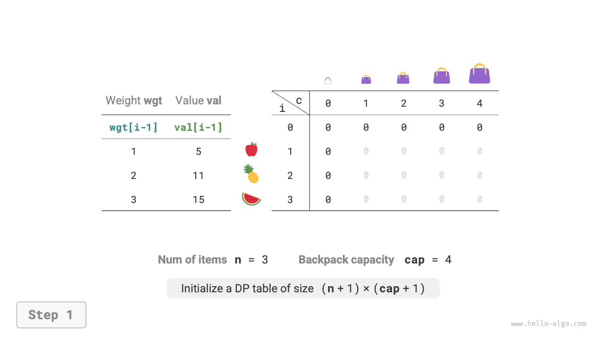
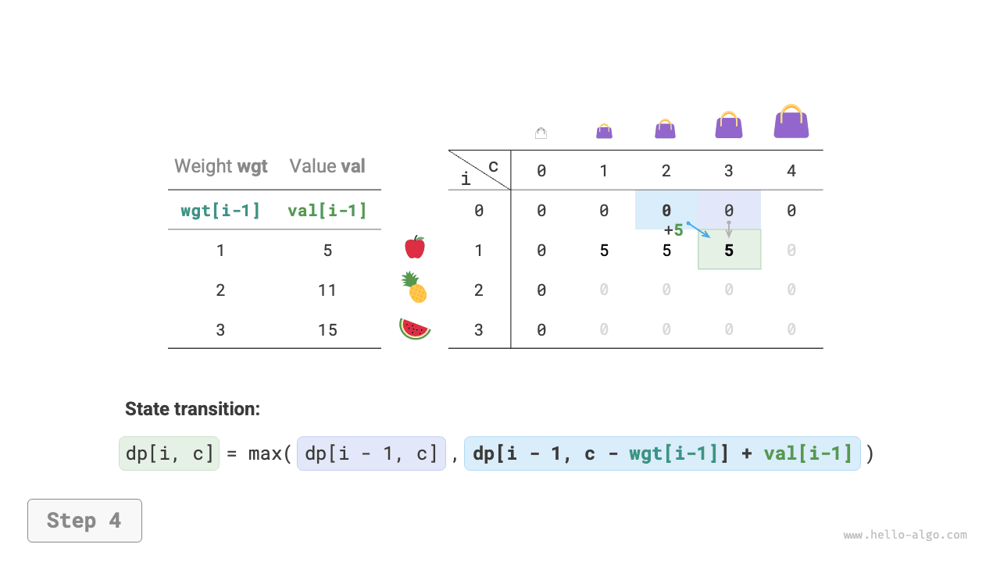
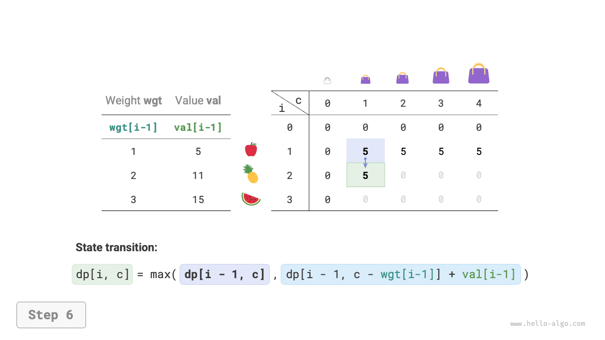
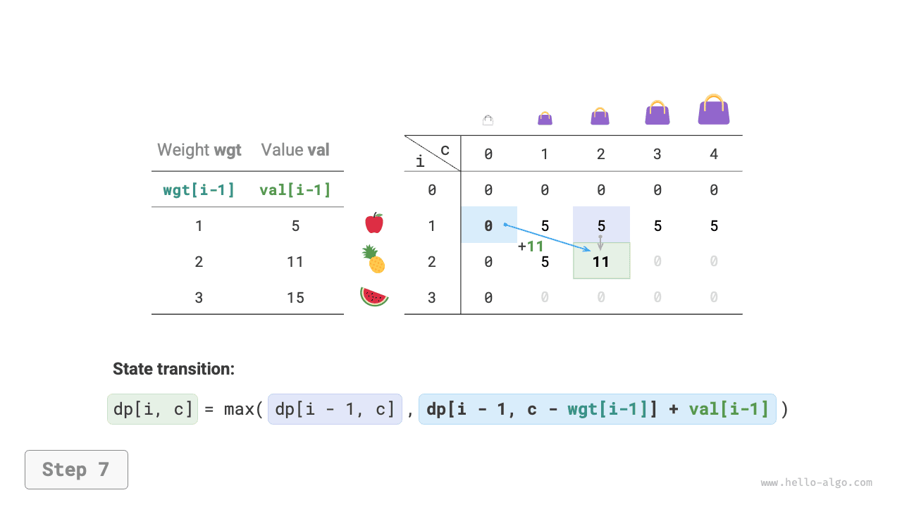
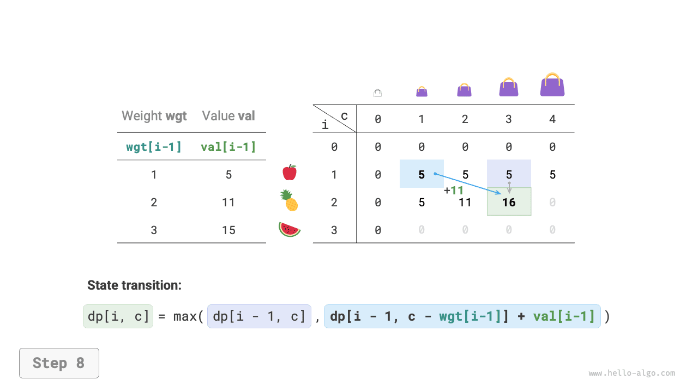
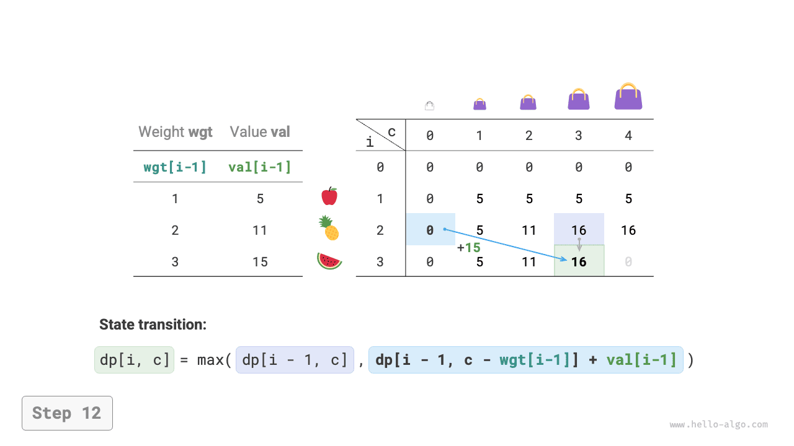
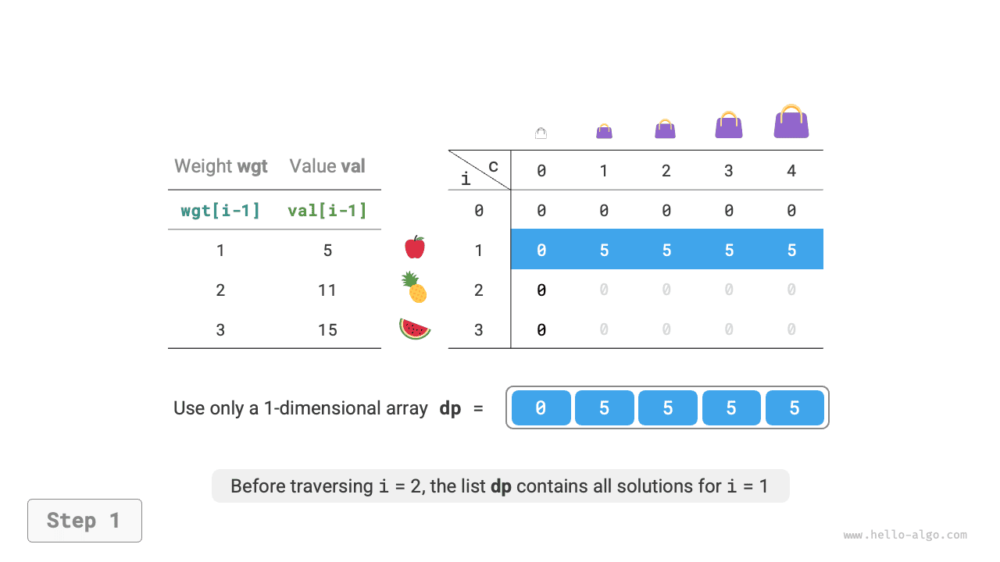
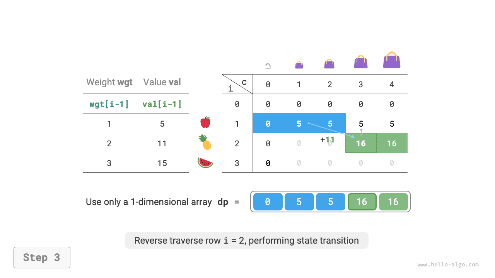
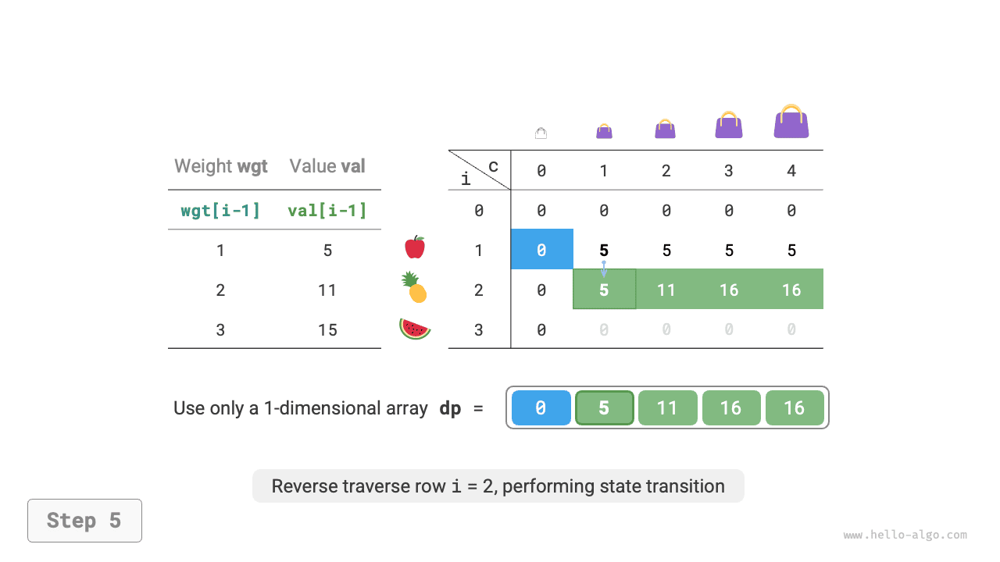

# 0-1 Vấn đề về chiếc ba lô

Bài toán chiếc ba lô là một bài toán mở đầu rất hay cho quy hoạch động và là một trong những dạng bài toán phổ biến nhất trong quy hoạch động. Nó có nhiều biến thể, chẳng hạn như bài toán chiếc ba lô 0-1, bài toán chiếc ba lô không giới hạn và bài toán nhiều chiếc ba lô.

Trong phần này, trước tiên chúng ta sẽ giải quyết vấn đề về chiếc ba lô 0-1 phổ biến nhất.

!!! câu hỏi

Cho $n$ vật phẩm và một chiếc ba lô có sức chứa $cap$, trong đó trọng lượng và giá trị của vật phẩm thứ $i$ lần lượt là $wgt[i-1]$ và $val[i-1]$. Mỗi mục có thể được chọn nhiều nhất một lần. Giá trị tối đa có thể đựng trong ba lô theo giới hạn dung lượng là bao nhiêu?

Quan sát hình dưới đây. Vì số mục $i$ bắt đầu đếm từ $1$ và chỉ số mảng bắt đầu từ $0$, nên mục $i$ tương ứng với trọng số $wgt[i-1]$ và giá trị $val[i-1]$.


Chúng ta có thể xem bài toán chiếc ba lô 0-1 như một quá trình bao gồm $n$ vòng quyết định, trong đó với mỗi vật phẩm có hai quyết định: không cho vào và không cho vào, do đó bài toán thỏa mãn mô hình cây quyết định.

Mục tiêu của bài toán này là tìm ra "giá trị lớn nhất có thể đặt trong ba lô trong giới hạn dung lượng", do đó nhiều khả năng đây là bài toán lập trình động.

**Bước 1: Suy nghĩ về các quyết định trong mỗi vòng, xác định trạng thái và từ đó nhận được bảng $dp$**

Đối với mỗi đồ vật nếu không cho vào ba lô thì sức chứa của ba lô không thay đổi; nếu đặt vào trong, sức chứa của ba lô sẽ giảm. Từ đó, chúng ta có thể rút ra định nghĩa trạng thái: số hạng mục hiện tại $i$ và dung lượng ba lô $c$, ký hiệu là $[i, c]$.

Trạng thái $[i, c]$ tương ứng với bài toán con: **giá trị lớn nhất trong số các mục $i$ đầu tiên trong ba lô có dung lượng $c$**, ký hiệu là $dp[i, c]$.

Cái chúng ta cần tìm là $dp[n, cap]$, vì vậy chúng ta cần một bảng $dp$ hai chiều có kích thước $(n+1) \times (cap+1)$.

**Bước 2: Xác định cấu trúc con tối ưu và sau đó rút ra phương trình chuyển trạng thái**

Sau khi đưa ra quyết định cho mục $i$, phần còn lại là bài toán con của mục $i-1$ đầu tiên, có thể chia thành hai trường hợp sau.

- **Không đặt vật phẩm $i$**: Dung tích ba lô không đổi, trạng thái chuyển thành $[i-1, c]$.
- **Đặt vật phẩm $i$**: Dung lượng ba lô giảm $wgt[i-1]$, giá trị tăng $val[i-1]$ và trạng thái thay đổi thành $[i-1, c-wgt[i-1]]$.

Phân tích ở trên cho thấy cấu trúc con tối ưu của bài toán này: **giá trị tối đa $dp[i, c]$ bằng giá trị lớn hơn trong số các giá trị thu được bằng cách không đặt vật phẩm $i$ vào ba lô mà bằng cách đặt nó vào ba lô**. Từ đó, phương trình chuyển trạng thái có thể được suy ra:

$$
dp[i, c] = \max(dp[i-1, c], dp[i-1, c - wgt[i-1]] + val[i-1])
$$

Lưu ý rằng nếu trọng lượng của vật phẩm hiện tại $wgt[i - 1]$ vượt quá sức chứa còn lại của ba lô $c$, thì lựa chọn duy nhất là không đặt nó vào ba lô.

**Bước 3: Xác định điều kiện biên và thứ tự chuyển trạng thái**

Khi không có vật phẩm nào hoặc sức chứa của ba lô là $0$, giá trị tối đa là $0$, tức là cột đầu tiên $dp[i, 0]$ và hàng đầu tiên $dp[0, c]$ đều bằng $0$.

Trạng thái hiện tại $[i, c]$ chuyển tiếp từ trạng thái trên $[i-1, c]$ và trạng thái phía trên bên trái $[i-1, c-wgt[i-1]]$, vì vậy chúng ta có thể duyệt toàn bộ bảng $dp$ theo thứ tự chuyển tiếp bằng cách sử dụng hai vòng lặp lồng nhau.

Dựa trên phân tích ở trên, tiếp theo chúng tôi sẽ triển khai các giải pháp tìm kiếm, ghi nhớ và lập trình động theo thứ tự.

### Cách 1: Brute Force Search

Mã tìm kiếm bao gồm các phần tử sau.

- **Tham số đệ quy**: trạng thái $[i, c]$.
- **Giá trị trả về**: lời giải của bài toán con $dp[i, c]$.
- **Điều kiện kết thúc**: khi không còn mục nào ($i = 0$) hoặc dung lượng ba lô còn lại là $0$, kết thúc đệ quy và trả về giá trị $0$.
- **Cắt tỉa**: nếu trọng lượng của vật phẩm hiện tại vượt quá sức chứa còn lại của ba lô thì chỉ có tùy chọn không cho vật phẩm đó vào.

```src
[file]{knapsack}-[class]{}-[func]{knapsack_dfs}
```

Như được hiển thị trong hình bên dưới, vì mỗi mục tạo ra hai nhánh tìm kiếm, loại trừ nó và bao gồm cả nó, nên độ phức tạp về thời gian là $O(2^n)$.

Quan sát cây đệ quy, dễ dàng nhận thấy các bài toán con chồng chéo, chẳng hạn như $dp[1, 10]$. Khi có nhiều vật phẩm, sức chứa ba lô lớn và đặc biệt là nhiều vật phẩm có cùng trọng lượng thì số lượng bài toán con chồng chéo sẽ tăng lên đáng kể.


### Cách 2: Ghi nhớ

Để đảm bảo rằng các bài toán con chồng chéo chỉ được tính toán một lần, chúng tôi sử dụng danh sách ghi nhớ `mem` để ghi lại lời giải cho các bài toán con, trong đó `mem[i][c]` tương ứng với $dp[i, c]$.

Sau khi giới thiệu tính năng ghi nhớ, **độ phức tạp về thời gian phụ thuộc vào số lượng bài toán con**, đó là $O(n \times cap)$. Mã thực hiện như sau:

```src
[file]{knapsack}-[class]{}-[func]{knapsack_dfs_mem}
```

Hình dưới đây cho thấy các nhánh tìm kiếm được cắt bớt trong quá trình ghi nhớ.


### Cách 3: Lập trình động

Lập trình động về cơ bản là quá trình điền vào bảng $dp$ trong quá trình chuyển đổi trạng thái. Mã này như sau:

```src
[file]{knapsack}-[class]{}-[func]{knapsack_dp}
```

Như được hiển thị trong hình bên dưới, cả độ phức tạp về thời gian và không gian đều được xác định bởi kích thước của mảng `dp`, là $O(n \times cap)$.

=== "<1>"
    

=== "<2>"
    

=== "<3>"
    

=== "<4>"
    

=== "<5>"
    

=== "<6>"
    

=== "<7>"
    

=== "<8>"
    

=== "<9>"
    

=== "<10>"
    

=== "<11>"
    

=== "<12>"
    

=== "<13>"
    

=== "<14>"
    

### Tối ưu hóa không gian

Vì mỗi trạng thái chỉ liên quan đến trạng thái ở hàng phía trên nó, nên chúng ta có thể sử dụng hai mảng chuyển tiếp để giảm độ phức tạp của không gian từ $O(n^2)$ xuống $O(n)$.

Suy nghĩ sâu hơn, liệu chúng ta có thể đạt được tối ưu hóa không gian chỉ bằng một mảng không? Quan sát, chúng ta có thể thấy mỗi trạng thái được chuyển từ ô ngay phía trên hoặc ô ở phía trên bên trái. Nếu chỉ có một mảng, khi chúng ta bắt đầu duyệt hàng $i$, mảng đó vẫn lưu trữ trạng thái của hàng $i-1$.

- Nếu sử dụng truyền tải xuôi, thì khi truyền tải tới $dp[i, j]$, các giá trị ở phía trên bên trái $dp[i-1, 1]$ ~ $dp[i-1, j-1]$ có thể đã bị ghi đè, do đó ngăn cản quá trình chuyển đổi trạng thái chính xác.
- Nếu sử dụng truyền tải ngược, sẽ không có vấn đề ghi đè và quá trình chuyển đổi trạng thái có thể diễn ra chính xác.

Hình dưới đây cho thấy quá trình chuyển đổi từ hàng $i = 1$ sang hàng $i = 2$ bằng cách sử dụng một mảng duy nhất. Vui lòng xem xét sự khác biệt giữa truyền tải tiến và lùi.

=== "<1>"
    

=== "<2>"
    

=== "<3>"
    

=== "<4>"
    

=== "<5>"
    

=== "<6>"
    

Trong quá trình triển khai mã, chúng ta chỉ cần xóa chiều đầu tiên $i$ của mảng `dp` và thay đổi vòng lặp bên trong để truyền tải ngược:

```src
[file]{knapsack}-[class]{}-[func]{knapsack_dp_comp}
```
