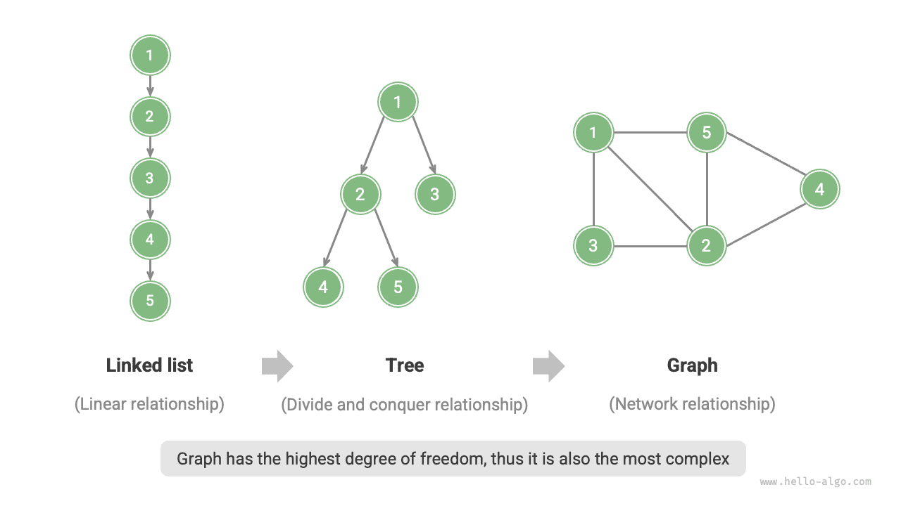
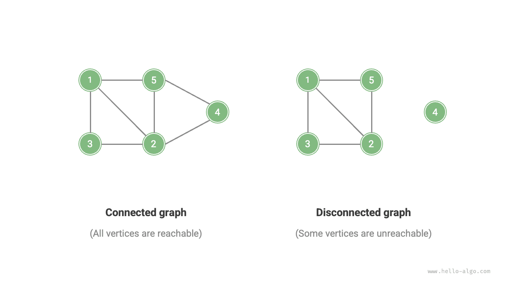
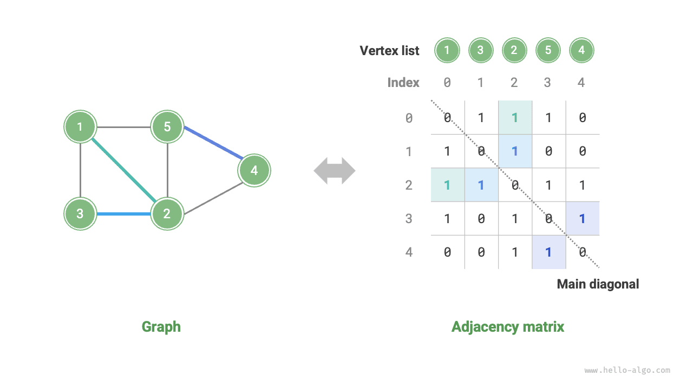
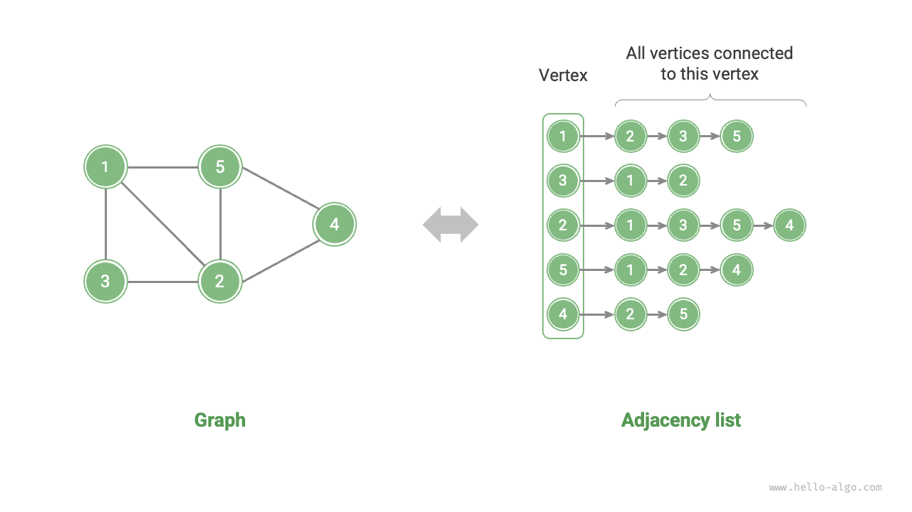

# đồ thị

<u>Biểu đồ</u> là cấu trúc dữ liệu phi tuyến bao gồm <u>đỉnh</u> và <u>cạnh</u>. Chúng ta có thể biểu diễn một cách trừu tượng đồ thị $G$ dưới dạng tập các đỉnh $V$ và tập các cạnh $E$. Ví dụ sau đây cho thấy một đồ thị có 5 đỉnh và 7 cạnh.

$$
\begin{aligned}
V & = \{ 1, 2, 3, 4, 5 \} \newline
E & = \{ (1,2), (1,3), (1,5), (2,3), (2,4), (2,5), (4,5) \} \newline
G & = \{ V, E \} \newline
\end{aligned}
$$

Nếu chúng ta xem các đỉnh là nút và các cạnh là tham chiếu (con trỏ) kết nối chúng, thì chúng ta có thể coi biểu đồ là phần mở rộng của cấu trúc dữ liệu danh sách liên kết. Như được hiển thị trong hình bên dưới, **so với các mối quan hệ tuyến tính (danh sách liên kết) và mối quan hệ chia để trị (cây), các mối quan hệ mạng (biểu đồ) có mức độ tự do cao hơn và do đó phức tạp hơn**.

## Các loại và thuật ngữ phổ biến của đồ thị

Đồ thị có thể được chia thành <u>đồ thị vô hướng</u> và <u>đồ thị có hướng</u> dựa trên việc các cạnh có hướng hay không, như minh họa trong hình bên dưới.

- Trong đồ thị vô hướng, các cạnh thể hiện kết nối "hai chiều" giữa hai đỉnh, chẳng hạn như tình bạn trên WeChat hoặc QQ.
- Trong biểu đồ có hướng, các cạnh có tính định hướng, nghĩa là các cạnh $A \rightarrow B$ và $A \leftarrow B$ độc lập với nhau, chẳng hạn như mối quan hệ theo dõi và theo dõi trên Weibo hoặc TikTok.

Đồ thị có thể được chia thành <u>đồ thị liên thông</u> và <u>đồ thị không liên thông</u> dựa trên việc tất cả các đỉnh có được kết nối hay không, như minh họa trong hình bên dưới.

- Đối với đồ thị liên thông, xuất phát từ một đỉnh bất kỳ có thể đi tới tất cả các đỉnh khác.
- Đối với đồ thị rời rạc, bắt đầu từ một đỉnh nhất định thì không thể tới được ít nhất một đỉnh.

Chúng ta cũng có thể thêm biến "trọng số" vào các cạnh, tạo ra <u>đồ thị có trọng số</u> như minh họa trong hình bên dưới. Ví dụ: trong các trò chơi di động như "Honor of Kings", hệ thống tính toán "mức độ thân mật" giữa những người chơi dựa trên thời gian họ chơi cùng nhau và mạng lưới mức độ thân mật như vậy có thể được biểu thị bằng biểu đồ có trọng số.

Cấu trúc dữ liệu đồ thị bao gồm các thuật ngữ thường được sử dụng sau đây.

- <u>Sự kề cận</u>: Khi hai đỉnh được nối với nhau bằng một cạnh thì hai đỉnh này được gọi là "liền kề". Trong hình trên, các đỉnh liền kề của đỉnh 1 là các đỉnh 2, 3 và 5.
- <u>Đường dẫn</u>: Chuỗi các cạnh từ đỉnh A đến đỉnh B được gọi là "đường dẫn" từ A đến B. Trong hình trên, dãy cạnh 1-5-2-4 là đường đi từ đỉnh 1 đến đỉnh 4.
- <u>Bậc</u>: Số cạnh mà một đỉnh có. Đối với đồ thị có hướng, <u>độ trong</u> cho biết có bao nhiêu cạnh trỏ đến đỉnh và <u>độ ngoài</u> cho biết có bao nhiêu cạnh rời khỏi đỉnh.

## Biểu diễn đồ thị

Các biểu diễn phổ biến của đồ thị bao gồm "ma trận kề" và "danh sách kề". Sau đây sử dụng đồ thị vô hướng làm ví dụ.

### Ma trận kề

Cho một đồ thị có $n$ đỉnh, <u>ma trận kề</u> sử dụng ma trận $n \times n$ để biểu thị đồ thị, trong đó mỗi hàng (cột) đại diện cho một đỉnh và các phần tử ma trận đại diện cho các cạnh, sử dụng $1$ hoặc $0$ để cho biết liệu một cạnh có tồn tại giữa hai đỉnh hay không.

Như thể hiện trong hình bên dưới, cho ma trận kề là $M$ và danh sách đỉnh là $V$. Khi đó phần tử ma trận $M[i, j] = 1$ chỉ ra rằng có một cạnh tồn tại giữa đỉnh $V[i]$ và đỉnh $V[j]$, trong khi $M[i, j] = 0$ chỉ ra rằng không có cạnh nào giữa hai đỉnh.

Ma trận kề có các tính chất sau.

- Trong đồ thị đơn giản, các đỉnh không thể tự nối với nhau nên các phần tử nằm trên đường chéo chính của ma trận kề là vô nghĩa.
- Đối với đồ thị vô hướng, các cạnh theo cả hai hướng đều bằng nhau nên ma trận kề đối xứng qua đường chéo chính.
- Việc thay thế các mục $1$ và $0$ trong ma trận kề bằng các trọng số cho phép nó biểu diễn các đồ thị có trọng số.

Khi sử dụng ma trận kề để biểu diễn đồ thị, chúng ta có thể truy cập trực tiếp các phần tử ma trận để thu được các cạnh, dẫn đến các phép toán cộng, xóa, tra cứu và sửa đổi hiệu quả cao, tất cả đều có độ phức tạp về thời gian là $O(1)$. Tuy nhiên, độ phức tạp về không gian của ma trận là $O(n^2)$, tiêu tốn bộ nhớ đáng kể.

### Danh sách lân cận

Một <u>danh sách kề</u> sử dụng danh sách liên kết $n$ để biểu thị một biểu đồ, với các nút danh sách liên kết biểu thị các đỉnh. Danh sách liên kết $i$-th tương ứng với đỉnh $i$ và lưu trữ tất cả các đỉnh liền kề của đỉnh đó (các đỉnh được kết nối với đỉnh đó). Hình dưới đây cho thấy một ví dụ về biểu đồ được lưu trữ bằng danh sách kề.

Danh sách kề chỉ lưu trữ các cạnh thực sự tồn tại và tổng số cạnh thường nhỏ hơn nhiều so với $n^2$, khiến chúng tiết kiệm không gian hơn. Tuy nhiên, việc tìm các cạnh trong danh sách kề đòi hỏi phải duyệt qua danh sách liên kết, do đó nó kém hiệu quả về thời gian hơn so với ma trận kề.

Như được hiển thị trong hình trên, **cấu trúc của danh sách kề rất giống với chuỗi riêng biệt trong bảng băm, vì vậy chúng ta có thể sử dụng các phương pháp tương tự để nâng cao hiệu quả**. Ví dụ: khi danh sách liên kết trở nên dài, nó có thể được chuyển đổi thành cây AVL hoặc cây đỏ đen, cải thiện độ phức tạp về thời gian từ $O(n)$ thành $O(\log n)$; nó cũng có thể được chuyển đổi thành bảng băm, giảm độ phức tạp về thời gian xuống $O(1)$.

## Ứng dụng phổ biến của đồ thị

Như được hiển thị trong bảng bên dưới, nhiều hệ thống trong thế giới thực có thể được mô hình hóa bằng biểu đồ và các bài toán tương ứng có thể được đơn giản hóa thành các bài toán tính toán đồ thị.

 Table <id> &nbsp; Common graphs in real life 

|                | Đỉnh | Cạnh | Bài toán tính toán đồ thị |
| -------------- | --------------- | -------------------------------------- | ----------------------------- |
| Mạng xã hội | Người dùng | Mối quan hệ bạn bè | Giới thiệu bạn bè tiềm năng |
| Tuyến tàu điện ngầm | Trạm | Kết nối giữa các trạm | Đề xuất tuyến đường ngắn nhất |
| Hệ mặt trời | Thiên thể | Lực hấp dẫn giữa các thiên thể | Tính toán quỹ đạo hành tinh |
