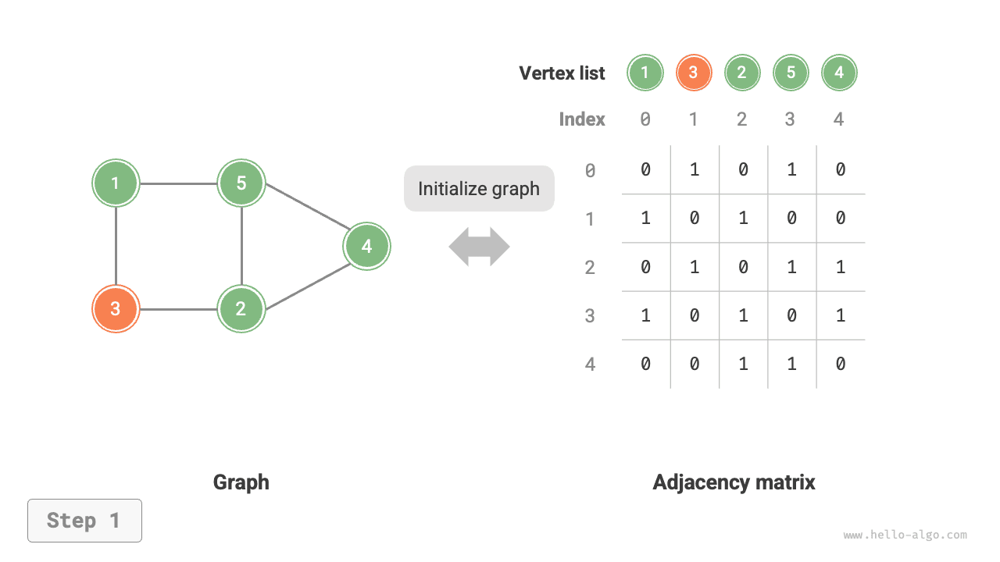
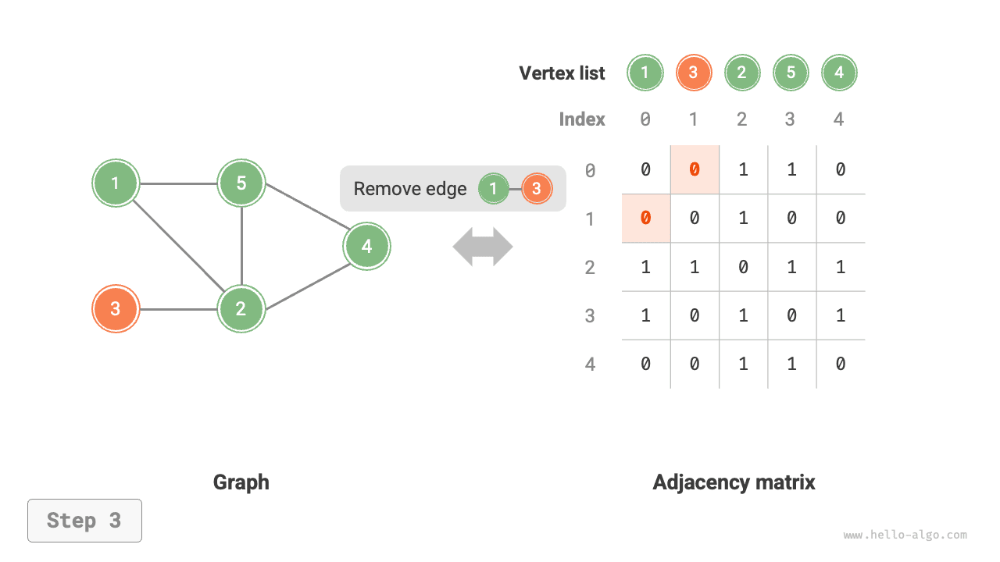
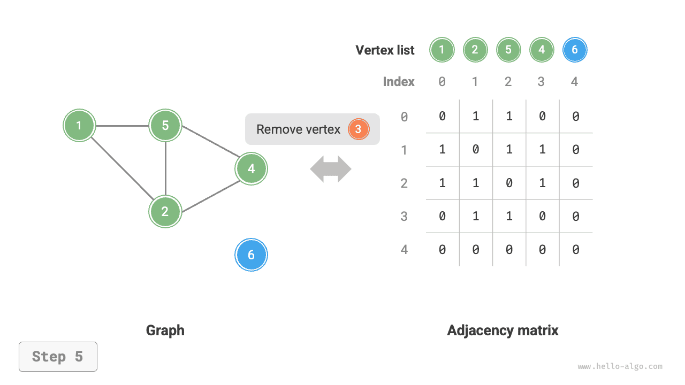
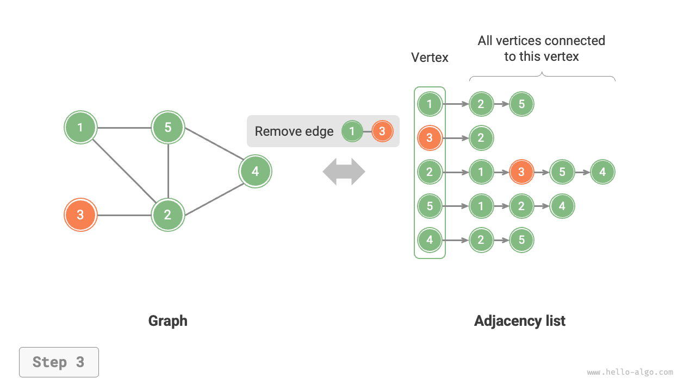

#Các thao tác cơ bản trên đồ thị

Các thao tác cơ bản trên đồ thị có thể được chia thành các thao tác trên “cạnh” và các thao tác trên “đỉnh”. Việc triển khai của chúng khác nhau tùy thuộc vào việc biểu đồ được biểu diễn dưới dạng "ma trận kề" hay "danh sách kề".

## Triển khai dựa trên Ma trận kề

Cho một đồ thị vô hướng có các đỉnh $n$, các phép toán khác nhau được thực hiện như trong hình bên dưới.

- **Thêm hoặc xóa một cạnh**: Sửa đổi trực tiếp cạnh được chỉ định trong ma trận kề, sử dụng thời gian $O(1)$. Vì là đồ thị vô hướng nên cả hai hướng của cạnh cần được cập nhật đồng thời.
- **Thêm một đỉnh**: Thêm một hàng và một cột vào cuối ma trận kề và điền tất cả chúng bằng $0$s, sử dụng thời gian $O(n)$.
- **Xóa một đỉnh**: Xóa một hàng và một cột trong ma trận kề. Trường hợp xấu nhất xảy ra khi xóa hàng và cột đầu tiên, yêu cầu các phần tử $(n-1)^2$ phải được "di chuyển lên và sang trái", do đó sử dụng $O(n^2)$ thời gian.
- **Khởi tạo**: Cho $n$ đỉnh, khởi tạo danh sách đỉnh `đỉnh` có độ dài $n$, sử dụng $O(n)$ thời gian; khởi tạo một ma trận kề `adjMat` có kích thước $n \times n$, sử dụng $O(n^2)$ time.

=== "<1>"
    

=== "<2>"
    

=== "<3>"
    

=== "<4>"
    

=== "<5>"
    

Sau đây là mã triển khai cho các biểu đồ được biểu diễn bằng ma trận kề:

```src
[file]{graph_adjacency_matrix}-[class]{graph_adj_mat}-[func]{}
```

## Triển khai dựa trên danh sách lân cận

Cho một đồ thị vô hướng có tổng số $n$ đỉnh và $m$ cạnh, các phép toán khác nhau có thể được thực hiện như trong hình bên dưới.

- **Thêm một cạnh**: Thêm cạnh vào cuối danh sách liên kết của đỉnh tương ứng, sử dụng thời gian $O(1)$. Vì là đồ thị vô hướng nên các cạnh theo cả hai hướng cần được cộng đồng thời.
- **Xóa một cạnh**: Tìm và loại bỏ cạnh được chỉ định trong danh sách liên kết của đỉnh tương ứng, sử dụng thời gian $O(m)$. Trong đồ thị vô hướng, các cạnh theo cả hai hướng cần được loại bỏ đồng thời.
- **Thêm một đỉnh**: Thêm một danh sách liên kết vào danh sách kề, với đỉnh mới làm nút đầu, sử dụng thời gian $O(1)$.
- **Xóa một đỉnh**: Duyệt toàn bộ danh sách kề và xóa tất cả các cạnh chứa đỉnh đã chỉ định, sử dụng thời gian $O(n + m)$.
- **Khởi tạo**: Tạo các đỉnh $n$ và các cạnh $2m$ trong danh sách kề, sử dụng thời gian $O(n + m)$.

=== "<1>"
    

=== "<2>"
    

=== "<3>"
    

=== "<4>"
    

=== "<5>"
    

Đoạn mã sau đây hiển thị việc triển khai danh sách kề. So với hình trên, mã thực tế khác ở những điểm sau.

- Để thuận tiện trong việc thêm bớt các đỉnh và để đơn giản hóa code, chúng ta sử dụng danh sách (mảng động) thay vì danh sách liên kết.
- Bảng băm dùng để lưu trữ danh sách kề, trong đó `key` là thể hiện của đỉnh và `value` là danh sách (danh sách liên kết) các đỉnh liền kề của đỉnh đó.

Ngoài ra, chúng tôi sử dụng lớp `Vertex` để biểu thị các đỉnh trong danh sách kề vì lý do sau: nếu chúng tôi sử dụng chỉ mục danh sách để phân biệt các đỉnh khác nhau, như với ma trận kề, thì để xóa đỉnh tại chỉ mục $i$, chúng tôi sẽ cần duyệt qua toàn bộ danh sách kề và giảm tất cả các chỉ số lớn hơn $i$ x $1$, điều này rất kém hiệu quả. Tuy nhiên, nếu mỗi đỉnh là một thể hiện `Vertex` duy nhất, việc xóa một đỉnh không yêu cầu sửa đổi các đỉnh khác.

```src
[file]{graph_adjacency_list}-[class]{graph_adj_list}-[func]{}
```

## So sánh hiệu quả

Giả sử đồ thị có $n$ đỉnh và $m$ cạnh, bảng dưới đây so sánh hiệu quả về thời gian và hiệu quả về không gian của ma trận kề và danh sách kề. Lưu ý rằng danh sách kề (danh sách liên kết) tương ứng với cách triển khai được sử dụng trong phần này, trong khi danh sách kề (bảng băm) đề cập cụ thể đến cách triển khai trong đó tất cả các danh sách liên kết được thay thế bằng bảng băm.

<p align="center"> Table <id> &nbsp; Comparison of adjacency matrix and adjacency list </p>

|                        | Ma trận kề | Danh sách kề (danh sách liên kết) | Danh sách kề (bảng băm) |
| ---------------------- | ---------------- | ---------------------------- | ----------------------------- |
| Xác định lân cận | $O(1)$ | $O(n)$ | $O(1)$ |
| Thêm một cạnh | $O(1)$ | $O(1)$ | $O(1)$ |
| Xóa một cạnh | $O(1)$ | $O(n)$ | $O(1)$ |
| Thêm một đỉnh | $O(n)$ | $O(1)$ | $O(1)$ |
| Xóa một đỉnh | $O(n^2)$ | $O(n + m)$ | $O(n)$ |
| Sử dụng không gian bộ nhớ | $O(n^2)$ | $O(n + m)$ | $O(n + m)$ |

Quan sát bảng trên, có vẻ như danh sách kề (bảng băm) có hiệu quả về thời gian và không gian tốt nhất. Tuy nhiên, trong thực tế, thao tác trên các cạnh trong ma trận kề sẽ hiệu quả hơn, chỉ yêu cầu một thao tác truy cập hoặc gán mảng duy nhất. Nhìn chung, ma trận kề thể hiện nguyên tắc "đánh đổi không gian lấy thời gian", trong khi danh sách kề thể hiện "đánh đổi thời gian lấy không gian".
