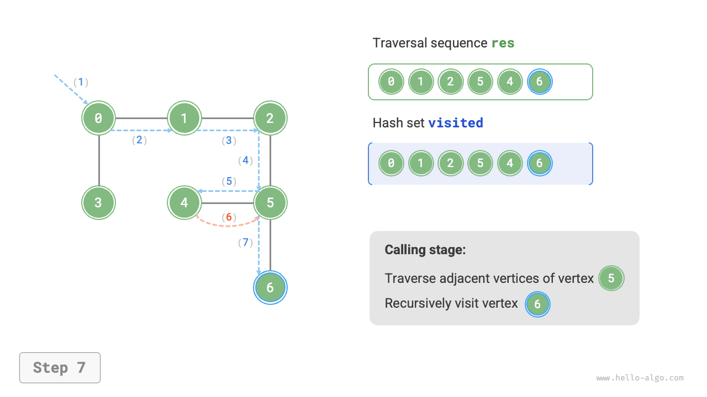
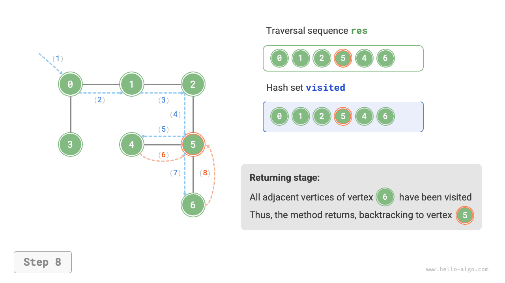

# Truyền tải đồ thị

Cây biểu thị mối quan hệ "một-nhiều", trong khi biểu đồ có mức độ tự do cao hơn và có thể biểu thị bất kỳ mối quan hệ "nhiều-nhiều". Vì vậy, chúng ta có thể xem cây như một trường hợp đặc biệt của đồ thị. Rõ ràng, **các phép toán duyệt cây cũng là một trường hợp đặc biệt của các phép toán duyệt đồ thị**.

Cả đồ thị và cây đều yêu cầu ứng dụng thuật toán tìm kiếm để thực hiện các phép toán truyền tải. Các phương pháp truyền tải đồ thị cũng có thể được chia thành hai loại: <u>truyền tải theo chiều rộng</u> và <u>truyền tải theo chiều sâu</u>.

## Tìm kiếm theo chiều rộng

**Tìm kiếm theo chiều rộng tiến hành từ gần đến xa: bắt đầu từ một nút nhất định, nó luôn truy cập các đỉnh gần nhất trước tiên và mở rộng ra từng lớp ra bên ngoài**. Như minh họa trong hình bên dưới, bắt đầu từ đỉnh trên cùng bên trái, trước tiên đi qua tất cả các đỉnh liền kề của đỉnh đó, sau đó đi qua tất cả các đỉnh liền kề của đỉnh tiếp theo, v.v., cho đến khi đi qua tất cả các đỉnh.


### Triển khai thuật toán

BFS thường được triển khai với sự trợ giúp của hàng đợi, như được hiển thị trong đoạn mã bên dưới. Hàng đợi có thuộc tính "vào trước, ra trước", phù hợp với ý tưởng "gần đến xa" của BFS.

1. Thêm đỉnh bắt đầu `startVet` vào hàng đợi và bắt đầu vòng lặp.
2. Trong mỗi lần lặp của vòng lặp, hãy đưa đỉnh ở đầu hàng đợi và ghi lại nó là đã ghé thăm, sau đó thêm tất cả các đỉnh liền kề của đỉnh đó vào phía sau hàng đợi.
3. Lặp lại bước `2.` cho đến khi đã thăm hết tất cả các đỉnh.

Để ngăn việc truy cập lại các đỉnh, chúng tôi sử dụng bộ băm `visited` để ghi lại các nút đã được truy cập.

!!! mẹo

Một tập băm có thể được xem như một bảng băm chỉ lưu trữ `khóa` mà không lưu trữ `giá trị`. Nó hỗ trợ các thao tác chèn, xóa, tra cứu và cập nhật trên `key` trong thời gian $O(1)$. Dựa trên tính duy nhất của `key`, bộ băm thường được sử dụng để loại bỏ trùng lặp dữ liệu và các tình huống tương tự.

=== "Python"
    ```python title="graph_bfs.py"
    def graph_bfs(graph: GraphAdjList, start_vet: Vertex) -> list[Vertex]:
        """Breadth-first traversal"""
        # Use adjacency list to represent the graph, in order to obtain all adjacent vertices of a specified vertex
        # Vertex traversal sequence
        res = []
        # Hash set for recording vertices that have been visited
        visited = set[Vertex]([start_vet])
        # Queue used to implement BFS
        que = deque[Vertex]([start_vet])
        # Starting from vertex vet, loop until all vertices are visited
        while len(que) > 0:
            vet = que.popleft()  # Dequeue the front vertex
            res.append(vet)  # Record visited vertex
            # Traverse all adjacent vertices of this vertex
            for adj_vet in graph.adj_list[vet]:
                if adj_vet in visited:
                    continue  # Skip vertices that have been visited
                que.append(adj_vet)  # Only enqueue unvisited vertices
                visited.add(adj_vet)  # Mark this vertex as visited
        # Return vertex traversal sequence
        return res
    ```
=== "C++"
    ```cpp title="graph_bfs.cpp"
    * File: graph_bfs.cpp
     * Created Time: 2023-03-02
     * Author: krahets (krahets@163.com)
     */
    
    #include "../utils/common.hpp"
    #include "./graph_adjacency_list.cpp"
    
    /* Breadth-first traversal */
    // Use adjacency list to represent the graph, in order to obtain all adjacent vertices of a specified vertex
    vector<Vertex *> graphBFS(GraphAdjList &graph, Vertex *startVet) {
        // Vertex traversal sequence
        vector<Vertex *> res;
        // Hash set for recording vertices that have been visited
        unordered_set<Vertex *> visited = {startVet};
        // Queue used to implement BFS
        queue<Vertex *> que;
        que.push(startVet);
        // Starting from vertex vet, loop until all vertices are visited
        while (!que.empty()) {
            Vertex *vet = que.front();
            que.pop();          // Dequeue the front vertex
            res.push_back(vet); // Record visited vertex
            // Traverse all adjacent vertices of this vertex
            for (auto adjVet : graph.adjList[vet]) {
                if (visited.count(adjVet))
                    continue;            // Skip vertices that have been visited
                que.push(adjVet);        // Only enqueue unvisited vertices
                visited.emplace(adjVet); // Mark this vertex as visited
            }
        }
        // Return vertex traversal sequence
        return res;
    }
    ```
=== "Java"
    ```java title="graph_bfs.java"
    public class graph_bfs {
        /* Breadth-first traversal */
        // Use adjacency list to represent the graph, in order to obtain all adjacent vertices of a specified vertex
        static List<Vertex> graphBFS(GraphAdjList graph, Vertex startVet) {
            // Vertex traversal sequence
            List<Vertex> res = new ArrayList<>();
            // Hash set for recording vertices that have been visited
            Set<Vertex> visited = new HashSet<>();
            visited.add(startVet);
            // Queue used to implement BFS
            Queue<Vertex> que = new LinkedList<>();
            que.offer(startVet);
            // Starting from vertex vet, loop until all vertices are visited
            while (!que.isEmpty()) {
                Vertex vet = que.poll(); // Dequeue the front vertex
                res.add(vet);            // Record visited vertex
                // Traverse all adjacent vertices of this vertex
                for (Vertex adjVet : graph.adjList.get(vet)) {
                    if (visited.contains(adjVet))
                        continue;        // Skip vertices that have been visited
                    que.offer(adjVet);   // Only enqueue unvisited vertices
                    visited.add(adjVet); // Mark this vertex as visited
                }
            }
            // Return vertex traversal sequence
            return res;
        }
    
        public static void main(String[] args) {
            /* Add edge */
            Vertex[] v = Vertex.valsToVets(new int[] { 0, 1, 2, 3, 4, 5, 6, 7, 8, 9 });
            Vertex[][] edges = { { v[0], v[1] }, { v[0], v[3] }, { v[1], v[2] }, { v[1], v[4] },
                                 { v[2], v[5] }, { v[3], v[4] }, { v[3], v[6] }, { v[4], v[5] },
                                 { v[4], v[7] }, { v[5], v[8] }, { v[6], v[7] }, { v[7], v[8] } };
            GraphAdjList graph = new GraphAdjList(edges);
            System.out.println("\nAfter initialization, graph is");
            graph.print();
    
            /* Breadth-first traversal */
            List<Vertex> res = graphBFS(graph, v[0]);
            System.out.println("\nBreadth-first traversal (BFS) vertex sequence is");
            System.out.println(Vertex.vetsToVals(res));
        }
    }
    ```
=== "C#"
    ```csharp title="graph_bfs.cs"
    public class graph_bfs {
        /* Breadth-first traversal */
        // Use adjacency list to represent the graph, in order to obtain all adjacent vertices of a specified vertex
        List<Vertex> GraphBFS(GraphAdjList graph, Vertex startVet) {
            // Vertex traversal sequence
            List<Vertex> res = [];
            // Hash set for recording vertices that have been visited
            HashSet<Vertex> visited = [startVet];
            // Queue used to implement BFS
            Queue<Vertex> que = new();
            que.Enqueue(startVet);
            // Starting from vertex vet, loop until all vertices are visited
            while (que.Count > 0) {
                Vertex vet = que.Dequeue(); // Dequeue the front vertex
                res.Add(vet);               // Record visited vertex
                foreach (Vertex adjVet in graph.adjList[vet]) {
                    if (visited.Contains(adjVet)) {
                        continue;          // Skip vertices that have been visited
                    }
                    que.Enqueue(adjVet);   // Only enqueue unvisited vertices
                    visited.Add(adjVet);   // Mark this vertex as visited
                }
            }
    
            // Return vertex traversal sequence
            return res;
        }
    
        [Test]
        public void Test() {
            /* Add edge */
            Vertex[] v = Vertex.ValsToVets([0, 1, 2, 3, 4, 5, 6, 7, 8, 9]);
            Vertex[][] edges =
            [
                [v[0], v[1]], [v[0], v[3]], [v[1], v[2]],
                [v[1], v[4]], [v[2], v[5]], [v[3], v[4]],
                [v[3], v[6]], [v[4], v[5]], [v[4], v[7]],
                [v[5], v[8]], [v[6], v[7]], [v[7], v[8]]
            ];
    
            GraphAdjList graph = new(edges);
            Console.WriteLine("\nAfter initialization, graph is");
            graph.Print();
    
            /* Breadth-first traversal */
            List<Vertex> res = GraphBFS(graph, v[0]);
            Console.WriteLine("\nBreadth-first traversal (BFS) vertex sequence is");
            Console.WriteLine(string.Join(" ", Vertex.VetsToVals(res)));
        }
    }
    ```
=== "Go"
    ```go title="graph_bfs.go"
    // File: graph_bfs.go
    // Created Time: 2023-02-18
    // Author: Reanon (793584285@qq.com)
    
    package chapter_graph
    
    import (
    	. "github.com/krahets/hello-algo/pkg"
    )
    
    /* Breadth-first traversal */
    // Use adjacency list to represent the graph, in order to obtain all adjacent vertices of a specified vertex
    func graphBFS(g *graphAdjList, startVet Vertex) []Vertex {
    	// Vertex traversal sequence
    	res := make([]Vertex, 0)
    	// Hash set for recording vertices that have been visited
    	visited := make(map[Vertex]struct{})
    	visited[startVet] = struct{}{}
    	// Queue used to implement BFS, using slice to simulate queue
    	queue := make([]Vertex, 0)
    	queue = append(queue, startVet)
    	// Starting from vertex vet, loop until all vertices are visited
    	for len(queue) > 0 {
    		// Dequeue the front vertex
    		vet := queue[0]
    		queue = queue[1:]
    		// Record visited vertex
    		res = append(res, vet)
    		// Traverse all adjacent vertices of this vertex
    		for _, adjVet := range g.adjList[vet] {
    			_, isExist := visited[adjVet]
    			// Only enqueue unvisited vertices
    			if !isExist {
    				queue = append(queue, adjVet)
    				visited[adjVet] = struct{}{}
    			}
    		}
    	}
    	// Return vertex traversal sequence
    	return res
    }
    ```
=== "Swift"
    ```swift title="graph_bfs.swift"
    * File: graph_bfs.swift
     * Created Time: 2023-02-21
     * Author: nuomi1 (nuomi1@qq.com)
     */
    
    import graph_adjacency_list_target
    import utils
    
    /* Breadth-first traversal */
    // Use adjacency list to represent the graph, in order to obtain all adjacent vertices of a specified vertex
    func graphBFS(graph: GraphAdjList, startVet: Vertex) -> [Vertex] {
        // Vertex traversal sequence
        var res: [Vertex] = []
        // Hash set for recording vertices that have been visited
        var visited: Set<Vertex> = [startVet]
        // Queue used to implement BFS
        var que: [Vertex] = [startVet]
        // Starting from vertex vet, loop until all vertices are visited
        while !que.isEmpty {
            let vet = que.removeFirst() // Dequeue the front vertex
            res.append(vet) // Record visited vertex
            // Traverse all adjacent vertices of this vertex
            for adjVet in graph.adjList[vet] ?? [] {
                if visited.contains(adjVet) {
                    continue // Skip vertices that have been visited
                }
                que.append(adjVet) // Only enqueue unvisited vertices
                visited.insert(adjVet) // Mark this vertex as visited
            }
        }
        // Return vertex traversal sequence
        return res
    }
    ```
=== "JS"
    ```javascript title="graph_bfs.js"
    * File: graph_bfs.js
     * Created Time: 2023-02-21
     * Author: Zhuo Qinyue (1403450829@qq.com)
     */
    
    const { GraphAdjList } = require('./graph_adjacency_list');
    ```
=== "TS"
    ```typescript title="graph_bfs.ts"
    * File: graph_bfs.ts
     * Created Time: 2023-02-21
     * Author: Zhuo Qinyue (1403450829@qq.com)
     */
    
    import { GraphAdjList } from './graph_adjacency_list';
    ```
=== "Dart"
    ```dart title="graph_bfs.dart"
    * File: graph_bfs.dart
     * Created Time: 2023-05-15
     * Author: liuyuxin (gvenusleo@gmail.com)
     */
    
    import 'dart:collection';
    
    import '../utils/vertex.dart';
    import 'graph_adjacency_list.dart';
    
    /* Breadth-first traversal */
    List<Vertex> graphBFS(GraphAdjList graph, Vertex startVet) {
      // Use adjacency list to represent the graph, in order to obtain all adjacent vertices of a specified vertex
      // Vertex traversal sequence
      List<Vertex> res = [];
      // Hash set for recording vertices that have been visited
      Set<Vertex> visited = {};
      visited.add(startVet);
      // Queue used to implement BFS
      Queue<Vertex> que = Queue();
      que.add(startVet);
      // Starting from vertex vet, loop until all vertices are visited
      while (que.isNotEmpty) {
        Vertex vet = que.removeFirst(); // Dequeue the front vertex
        res.add(vet); // Record visited vertex
        // Traverse all adjacent vertices of this vertex
        for (Vertex adjVet in graph.adjList[vet]!) {
          if (visited.contains(adjVet)) {
            continue; // Skip vertices that have been visited
          }
          que.add(adjVet); // Only enqueue unvisited vertices
          visited.add(adjVet); // Mark this vertex as visited
        }
      }
      // Return vertex traversal sequence
      return res;
    }
    ```
=== "Rust"
    ```rust title="graph_bfs.rs"
    // Use adjacency list to represent the graph, in order to obtain all adjacent vertices of a specified vertex
    fn graph_bfs(graph: GraphAdjList, start_vet: Vertex) -> Vec<Vertex> {
        // Vertex traversal sequence
        let mut res = vec![];
        // Hash set for recording vertices that have been visited
        let mut visited = HashSet::new();
        visited.insert(start_vet);
        // Queue used to implement BFS
        let mut que = VecDeque::new();
        que.push_back(start_vet);
        // Starting from vertex vet, loop until all vertices are visited
        while let Some(vet) = que.pop_front() {
            res.push(vet); // Record visited vertex
    
            // Traverse all adjacent vertices of this vertex
            if let Some(adj_vets) = graph.adj_list.get(&vet) {
                for &adj_vet in adj_vets {
                    if visited.contains(&adj_vet) {
                        continue; // Skip vertices that have been visited
                    }
                    que.push_back(adj_vet); // Only enqueue unvisited vertices
                    visited.insert(adj_vet); // Mark this vertex as visited
                }
            }
        }
        // Return vertex traversal sequence
        res
    }
    ```
=== "C"
    ```c title="graph_bfs.c"
    * File: graph_bfs.c
     * Created Time: 2023-07-11
     * Author: NI-SW (947743645@qq.com)
     */
    
    #include "graph_adjacency_list.c"
    
    // Assume max node count is 100
    #define MAX_SIZE 100
    
    /* Node queue structure */
    typedef struct {
        Vertex *vertices[MAX_SIZE];
        int front, rear, size;
    } Queue;
    ```
=== "Kotlin"
    ```kotlin title="graph_bfs.kt"
    * File: graph_bfs.kt
     * Created Time: 2024-01-25
     * Author: curtishd (1023632660@qq.com)
     */
    
    package chapter_graph
    
    import utils.Vertex
    import java.util.*
    
    /* Breadth-first traversal */
    // Use adjacency list to represent the graph, in order to obtain all adjacent vertices of a specified vertex
    fun graphBFS(graph: GraphAdjList, startVet: Vertex): MutableList<Vertex?> {
        // Vertex traversal sequence
        val res = mutableListOf<Vertex?>()
        // Hash set for recording vertices that have been visited
        val visited = HashSet<Vertex>()
        visited.add(startVet)
        // Queue used to implement BFS
        val que = LinkedList<Vertex>()
        que.offer(startVet)
        // Starting from vertex vet, loop until all vertices are visited
        while (!que.isEmpty()) {
            val vet = que.poll() // Dequeue the front vertex
            res.add(vet)         // Record visited vertex
            // Traverse all adjacent vertices of this vertex
            for (adjVet in graph.adjList[vet]!!) {
                if (visited.contains(adjVet))
                    continue        // Skip vertices that have been visited
                que.offer(adjVet)   // Only enqueue unvisited vertices
                visited.add(adjVet) // Mark this vertex as visited
            }
        }
        // Return vertex traversal sequence
        return res
    }
    ```
=== "Ruby"
    ```ruby title="graph_bfs.rb"
    ### Breadth-first traversal ###
    def graph_bfs(graph, start_vet)
      # Use adjacency list to represent the graph, in order to obtain all adjacent vertices of a specified vertex
      # Vertex traversal sequence
      res = []
      # Hash set for recording vertices that have been visited
      visited = Set.new([start_vet])
      # Queue used to implement BFS
      que = [start_vet]
      # Starting from vertex vet, loop until all vertices are visited
      while que.length > 0
        vet = que.shift # Dequeue the front vertex
        res << vet # Record visited vertex
        # Traverse all adjacent vertices of this vertex
        for adj_vet in graph.adj_list[vet]
          next if visited.include?(adj_vet) # Skip vertices that have been visited
          que << adj_vet # Only enqueue unvisited vertices
          visited.add(adj_vet) # Mark this vertex as visited
        end
      end
      # Return vertex traversal sequence
      res
    ```


Mã tương đối trừu tượng; nên tham khảo hình dưới đây để hiểu sâu hơn.

=== "<1>"
    

=== "<2>"
    

=== "<3>"
    

=== "<4>"
    

=== "<5>"
    

=== "<6>"
    

=== "<7>"
    

=== "<8>"
    

=== "<9>"
    

=== "<10>"
    

=== "<11>"
    

!!! câu hỏi "Trình tự duyệt theo chiều rộng đầu tiên có phải là duy nhất không?"

Không độc đáo. Tìm kiếm theo chiều rộng chỉ yêu cầu di chuyển ngang theo thứ tự "gần đến xa", **và thứ tự di chuyển của các đỉnh ở cùng khoảng cách có thể được xáo trộn tùy ý**. Lấy hình trên làm ví dụ, thứ tự truy cập của các đỉnh $1$ và $3$ có thể được hoán đổi, cũng như thứ tự truy cập của các đỉnh $2$, $4$ và $6$.

### Phân tích độ phức tạp

**Độ phức tạp về thời gian**: Tất cả các đỉnh sẽ được xếp vào hàng đợi và loại bỏ hàng đợi một lần, sử dụng thời gian $O(|V|)$; trong quá trình đi qua các đỉnh liền kề, vì là đồ thị vô hướng nên tất cả các cạnh sẽ được thăm $2$ lần, sử dụng $O(2|E|)$ thời gian; tổng thể sử dụng thời gian $O(|V| + |E|)$.

**Độ phức tạp về không gian**: Danh sách `res`, tập băm `visited` và hàng đợi `que` có thể chứa tối đa $|V|$ đỉnh, sử dụng không gian $O(|V|)$.

## Tìm kiếm theo chiều sâu

**Tìm kiếm theo chiều sâu là phương pháp truyền tải ưu tiên đi xa nhất có thể, sau đó quay lại khi không còn đường dẫn**. Như minh họa trong hình bên dưới, bắt đầu từ đỉnh trên cùng bên trái, đi qua một đỉnh liền kề của đỉnh hiện tại, tiếp tục cho đến khi gặp ngõ cụt, sau đó quay lại và tiếp tục đi xa nhất có thể trước khi quay lại lần nữa, v.v., cho đến khi tất cả các đỉnh đã được đi qua.


### Triển khai thuật toán

Mô hình thuật toán "đi càng xa càng tốt rồi quay lại" này thường được triển khai bằng cách sử dụng đệ quy. Tương tự như tìm kiếm theo chiều rộng, trong tìm kiếm theo chiều sâu, chúng ta cũng cần một tập băm `đã truy cập` để ghi lại các đỉnh đã truy cập và tránh truy cập lại.

=== "Python"
    ```python title="graph_dfs.py"
    def graph_dfs(graph: GraphAdjList, start_vet: Vertex) -> list[Vertex]:
        """Depth-first traversal"""
        # Use adjacency list to represent the graph, in order to obtain all adjacent vertices of a specified vertex
        # Vertex traversal sequence
        res = []
        # Hash set for recording vertices that have been visited
        visited = set[Vertex]()
        dfs(graph, visited, res, start_vet)
        return res
    ```
=== "C++"
    ```cpp title="graph_dfs.cpp"
    * File: graph_dfs.cpp
     * Created Time: 2023-03-02
     * Author: krahets (krahets@163.com)
     */
    
    #include "../utils/common.hpp"
    #include "./graph_adjacency_list.cpp"
    
    /* Depth-first traversal helper function */
    void dfs(GraphAdjList &graph, unordered_set<Vertex *> &visited, vector<Vertex *> &res, Vertex *vet) {
        res.push_back(vet);   // Record visited vertex
        visited.emplace(vet); // Mark this vertex as visited
        // Traverse all adjacent vertices of this vertex
        for (Vertex *adjVet : graph.adjList[vet]) {
            if (visited.count(adjVet))
                continue; // Skip vertices that have been visited
            // Recursively visit adjacent vertices
            dfs(graph, visited, res, adjVet);
        }
    }
    ```
=== "Java"
    ```java title="graph_dfs.java"
    public class graph_dfs {
        /* Depth-first traversal helper function */
        static void dfs(GraphAdjList graph, Set<Vertex> visited, List<Vertex> res, Vertex vet) {
            res.add(vet);     // Record visited vertex
            visited.add(vet); // Mark this vertex as visited
            // Traverse all adjacent vertices of this vertex
            for (Vertex adjVet : graph.adjList.get(vet)) {
                if (visited.contains(adjVet))
                    continue; // Skip vertices that have been visited
                // Recursively visit adjacent vertices
                dfs(graph, visited, res, adjVet);
            }
        }
    
        /* Depth-first traversal */
        // Use adjacency list to represent the graph, in order to obtain all adjacent vertices of a specified vertex
        static List<Vertex> graphDFS(GraphAdjList graph, Vertex startVet) {
            // Vertex traversal sequence
            List<Vertex> res = new ArrayList<>();
            // Hash set for recording vertices that have been visited
            Set<Vertex> visited = new HashSet<>();
            dfs(graph, visited, res, startVet);
            return res;
        }
    
        public static void main(String[] args) {
            /* Add edge */
            Vertex[] v = Vertex.valsToVets(new int[] { 0, 1, 2, 3, 4, 5, 6 });
            Vertex[][] edges = { { v[0], v[1] }, { v[0], v[3] }, { v[1], v[2] },
                                 { v[2], v[5] }, { v[4], v[5] }, { v[5], v[6] } };
            GraphAdjList graph = new GraphAdjList(edges);
            System.out.println("\nAfter initialization, graph is");
            graph.print();
    
            /* Depth-first traversal */
            List<Vertex> res = graphDFS(graph, v[0]);
            System.out.println("\nDepth-first traversal (DFS) vertex sequence is");
            System.out.println(Vertex.vetsToVals(res));
        }
    }
    ```
=== "C#"
    ```csharp title="graph_dfs.cs"
    public class graph_dfs {
        /* Depth-first traversal helper function */
        void DFS(GraphAdjList graph, HashSet<Vertex> visited, List<Vertex> res, Vertex vet) {
            res.Add(vet);     // Record visited vertex
            visited.Add(vet); // Mark this vertex as visited
            // Traverse all adjacent vertices of this vertex
            foreach (Vertex adjVet in graph.adjList[vet]) {
                if (visited.Contains(adjVet)) {
                    continue; // Skip vertices that have been visited
                }
                // Recursively visit adjacent vertices
                DFS(graph, visited, res, adjVet);
            }
        }
    
        /* Depth-first traversal */
        // Use adjacency list to represent the graph, in order to obtain all adjacent vertices of a specified vertex
        List<Vertex> GraphDFS(GraphAdjList graph, Vertex startVet) {
            // Vertex traversal sequence
            List<Vertex> res = [];
            // Hash set for recording vertices that have been visited
            HashSet<Vertex> visited = [];
            DFS(graph, visited, res, startVet);
            return res;
        }
    
        [Test]
        public void Test() {
            /* Add edge */
            Vertex[] v = Vertex.ValsToVets([0, 1, 2, 3, 4, 5, 6]);
            Vertex[][] edges =
            [
                [v[0], v[1]], [v[0], v[3]], [v[1], v[2]],
                [v[2], v[5]], [v[4], v[5]], [v[5], v[6]],
            ];
    
            GraphAdjList graph = new(edges);
            Console.WriteLine("\nAfter initialization, graph is");
            graph.Print();
    
            /* Depth-first traversal */
            List<Vertex> res = GraphDFS(graph, v[0]);
            Console.WriteLine("\nDepth-first traversal (DFS) vertex sequence is");
            Console.WriteLine(string.Join(" ", Vertex.VetsToVals(res)));
        }
    }
    ```
=== "Go"
    ```go title="graph_dfs.go"
    // File: graph_dfs.go
    // Created Time: 2023-02-18
    // Author: Reanon (793584285@qq.com)
    
    package chapter_graph
    
    import (
    	. "github.com/krahets/hello-algo/pkg"
    )
    
    /* Depth-first traversal helper function */
    func dfs(g *graphAdjList, visited map[Vertex]struct{}, res *[]Vertex, vet Vertex) {
    	// append operation returns a new reference, must reassign original reference to new slice's reference
    	*res = append(*res, vet)
    	visited[vet] = struct{}{}
    	// Traverse all adjacent vertices of this vertex
    	for _, adjVet := range g.adjList[vet] {
    		_, isExist := visited[adjVet]
    		// Recursively visit adjacent vertices
    		if !isExist {
    			dfs(g, visited, res, adjVet)
    		}
    	}
    }
    ```
=== "Swift"
    ```swift title="graph_dfs.swift"
    * File: graph_dfs.swift
     * Created Time: 2023-02-21
     * Author: nuomi1 (nuomi1@qq.com)
     */
    
    import graph_adjacency_list_target
    import utils
    
    /* Depth-first traversal helper function */
    func dfs(graph: GraphAdjList, visited: inout Set<Vertex>, res: inout [Vertex], vet: Vertex) {
        res.append(vet) // Record visited vertex
        visited.insert(vet) // Mark this vertex as visited
        // Traverse all adjacent vertices of this vertex
        for adjVet in graph.adjList[vet] ?? [] {
            if visited.contains(adjVet) {
                continue // Skip vertices that have been visited
            }
            // Recursively visit adjacent vertices
            dfs(graph: graph, visited: &visited, res: &res, vet: adjVet)
        }
    }
    ```
=== "JS"
    ```javascript title="graph_dfs.js"
    * File: graph_dfs.js
     * Created Time: 2023-02-21
     * Author: Zhuo Qinyue (1403450829@qq.com)
     */
    
    const { Vertex } = require('../modules/Vertex');
    ```
=== "TS"
    ```typescript title="graph_dfs.ts"
    * File: graph_dfs.ts
     * Created Time: 2023-02-21
     * Author: Zhuo Qinyue (1403450829@qq.com)
     */
    
    import { Vertex } from '../modules/Vertex';
    ```
=== "Dart"
    ```dart title="graph_dfs.dart"
    * File: graph_dfs.dart
     * Created Time: 2023-05-15
     * Author: liuyuxin (gvenusleo@gmail.com)
     */
    
    import '../utils/vertex.dart';
    import 'graph_adjacency_list.dart';
    
    /* Depth-first traversal helper function */
    void dfs(
      GraphAdjList graph,
      Set<Vertex> visited,
      List<Vertex> res,
      Vertex vet,
    ) {
      res.add(vet); // Record visited vertex
      visited.add(vet); // Mark this vertex as visited
      // Traverse all adjacent vertices of this vertex
      for (Vertex adjVet in graph.adjList[vet]!) {
        if (visited.contains(adjVet)) {
          continue; // Skip vertices that have been visited
        }
        // Recursively visit adjacent vertices
        dfs(graph, visited, res, adjVet);
      }
    }
    ```
=== "Rust"
    ```rust title="graph_dfs.rs"
    // Use adjacency list to represent the graph, in order to obtain all adjacent vertices of a specified vertex
    fn graph_dfs(graph: GraphAdjList, start_vet: Vertex) -> Vec<Vertex> {
        // Vertex traversal sequence
        let mut res = vec![];
        // Hash set for recording vertices that have been visited
        let mut visited = HashSet::new();
        dfs(&graph, &mut visited, &mut res, start_vet);
    
        res
    }
    ```
=== "C"
    ```c title="graph_dfs.c"
    * File: graph_dfs.c
     * Created Time: 2023-07-13
     * Author: NI-SW (947743645@qq.com)
     */
    
    #include "graph_adjacency_list.c"
    
    // Assume max node count is 100
    #define MAX_SIZE 100
    
    /* Check if vertex has been visited */
    int isVisited(Vertex **res, int size, Vertex *vet) {
        // Traverse to find node using O(n) time
        for (int i = 0; i < size; i++) {
            if (res[i] == vet) {
                return 1;
            }
        }
        return 0;
    }
    ```
=== "Kotlin"
    ```kotlin title="graph_dfs.kt"
    * File: graph_dfs.kt
     * Created Time: 2024-01-25
     * Author: curtishd (1023632660@qq.com)
     */
    
    package chapter_graph
    
    import utils.Vertex
    
    /* Depth-first traversal helper function */
    fun dfs(
        graph: GraphAdjList,
        visited: MutableSet<Vertex?>,
        res: MutableList<Vertex?>,
        vet: Vertex?
    ) {
        res.add(vet)     // Record visited vertex
        visited.add(vet) // Mark this vertex as visited
        // Traverse all adjacent vertices of this vertex
        for (adjVet in graph.adjList[vet]!!) {
            if (visited.contains(adjVet))
                continue  // Skip vertices that have been visited
            // Recursively visit adjacent vertices
            dfs(graph, visited, res, adjVet)
        }
    }
    ```
=== "Ruby"
    ```ruby title="graph_dfs.rb"
    ### Depth-first traversal ###
    def graph_dfs(graph, start_vet)
      # Use adjacency list to represent the graph, in order to obtain all adjacent vertices of a specified vertex
      # Vertex traversal sequence
      res = []
      # Hash set for recording vertices that have been visited
      visited = Set.new
      dfs(graph, visited, res, start_vet)
      res
    ```


Luồng thuật toán tìm kiếm theo chiều sâu được thể hiện trong hình bên dưới.

- **Các đường đứt nét thẳng biểu thị đệ quy đi xuống**, biểu thị rằng một phương pháp đệ quy mới đã được bắt đầu để truy cập một đỉnh mới.
- **Các đường đứt nét cong biểu thị hoạt động quay lui hướng lên trên**, biểu thị rằng lệnh gọi đệ quy này đã quay trở lại điểm mà nó được thực hiện.

Để hiểu sâu hơn, bạn nên kết hợp hình bên dưới với mã để mô phỏng (hoặc rút ra) toàn bộ quy trình DFS, bao gồm cả thời điểm mỗi lệnh gọi đệ quy bắt đầu và khi nó quay trở lại.

=== "<1>"
    

=== "<2>"
    

=== "<3>"
    

=== "<4>"
    

=== "<5>"
    

=== "<6>"
    

=== "<7>"
    

=== "<8>"
    

=== "<9>"
    

=== "<10>"
    

=== "<11>"
    

!!! câu hỏi "Trình tự truyền tải theo chiều sâu có phải là duy nhất không?"

Tương tự như tìm kiếm theo chiều rộng, chuỗi tìm kiếm theo chiều sâu cũng không phải là duy nhất. Cho trước một đỉnh, bất kỳ hướng thăm dò nào cũng có thể được chọn trước; nghĩa là thứ tự của các đỉnh liền kề có thể được sắp xếp lại tùy ý mà vẫn tạo thành tìm kiếm theo chiều sâu.

Lấy việc duyệt cây làm ví dụ, "root $\rightarrow$ left $\rightarrow$ right", "left $\rightarrow$ root $\rightarrow$ right" và "left $\rightarrow$ right $\rightarrow$ root" tương ứng với các lần duyệt trước, theo thứ tự và sau thứ tự. Chúng đại diện cho ba mức độ ưu tiên truyền tải khác nhau, tuy nhiên cả ba đều thuộc về tìm kiếm theo chiều sâu.

### Phân tích độ phức tạp

**Độ phức tạp về thời gian**: Tất cả các đỉnh sẽ được truy cập $1$ lần, sử dụng $O(|V|)$ thời gian; tất cả các cạnh sẽ được truy cập $2$ lần, sử dụng thời gian $O(2|E|)$; tổng thể sử dụng thời gian $O(|V| + |E|)$.

**Độ phức tạp về không gian**: Danh sách `res` và tập hợp băm `visited` có thể chứa tối đa $|V|$ đỉnh và độ sâu đệ quy tối đa là $|V|$, do đó sử dụng không gian $O(|V|)$.
