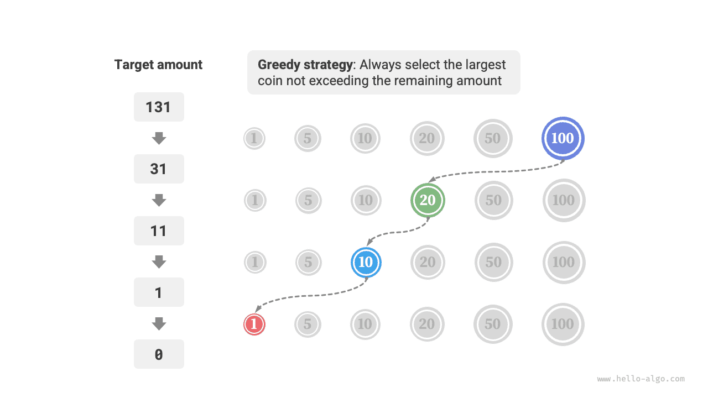

#Thuật toán tham lam

<u>Greedy algorithm</u> is a common approach to solving optimization problems. Its basic idea is to choose the option that appears best at each decision stage, that is, to greedily make locally optimal decisions in the hope of obtaining a globally optimal solution. Greedy algorithms are simple and efficient, and are widely used in many practical problems.

Thuật toán tham lam và quy hoạch động đều được sử dụng phổ biến để giải các bài toán tối ưu hóa. Chúng có một số điểm tương đồng, chẳng hạn như cả hai đều dựa vào thuộc tính cấu trúc con tối ưu, nhưng chúng hoạt động khác nhau.

- Lập trình động xem xét tất cả các quyết định trước đó khi đưa ra quyết định hiện tại và sử dụng lời giải của các bài toán con trước đây để xây dựng lời giải cho bài toán con hiện tại.
- Thuật toán tham lam không xem xét các quyết định trong quá khứ mà thay vào đó đưa ra các lựa chọn tham lam tiến về phía trước, liên tục giảm quy mô bài toán cho đến khi bài toán được giải quyết.

Đầu tiên chúng ta sẽ hiểu thuật toán tham lam hoạt động như thế nào thông qua bài toán ví dụ "đổi tiền xu". Vấn đề này đã được giới thiệu trong chương "Hoàn thành bài toán về chiếc ba lô", vì vậy chắc hẳn bạn đã quen thuộc với nó.

!!! câu hỏi

Cho $n$ loại tiền xu, trong đó mệnh giá của loại $i$-th là $coins[i - 1]$, số tiền mục tiêu là $amt$ và số lượng tiền không giới hạn của mỗi loại, số lượng tiền tối thiểu cần thiết để tạo nên số tiền mục tiêu là bao nhiêu? Nếu không thể đạt được số tiền mục tiêu, hãy trả lại $-1$.

Chiến lược tham lam cho vấn đề này được thể hiện trong hình bên dưới. Đưa ra một số tiền mục tiêu, **chúng tôi tham lam chọn đồng xu không vượt quá nó và gần nhất với nó**, lặp lại bước này cho đến khi đạt được số tiền mục tiêu.



Mã thực hiện như sau:

=== "Python"
    ```python title="coin_change_greedy.py"
    def coin_change_greedy(coins: list[int], amt: int) -> int:
        """Coin change: Greedy algorithm"""
        # Assume coins list is sorted
        i = len(coins) - 1
        count = 0
        # Loop to make greedy choices until no remaining amount
        while amt > 0:
            # Find the coin that is less than and closest to the remaining amount
            while i > 0 and coins[i] > amt:
                i -= 1
            # Choose coins[i]
            amt -= coins[i]
            count += 1
        # If no feasible solution is found, return -1
        return count if amt == 0 else -1
    ```
=== "C++"
    ```cpp title="coin_change_greedy.cpp"
    int coinChangeGreedy(vector<int> &coins, int amt) {
        // Assume coins list is sorted
        int i = coins.size() - 1;
        int count = 0;
        // Loop to make greedy choices until no remaining amount
        while (amt > 0) {
            // Find the coin that is less than and closest to the remaining amount
            while (i > 0 && coins[i] > amt) {
                i--;
            }
            // Choose coins[i]
            amt -= coins[i];
            count++;
        }
        // If no feasible solution is found, return -1
        return amt == 0 ? count : -1;
    }
    ```
=== "Java"
    ```java title="coin_change_greedy.java"
    public class coin_change_greedy {
        /* Coin change: Greedy algorithm */
        static int coinChangeGreedy(int[] coins, int amt) {
            // Assume coins list is sorted
            int i = coins.length - 1;
            int count = 0;
            // Loop to make greedy choices until no remaining amount
            while (amt > 0) {
                // Find the coin that is less than and closest to the remaining amount
                while (i > 0 && coins[i] > amt) {
                    i--;
                }
                // Choose coins[i]
                amt -= coins[i];
                count++;
            }
            // If no feasible solution is found, return -1
            return amt == 0 ? count : -1;
        }
    
        public static void main(String[] args) {
            // Greedy algorithm: Can guarantee finding the global optimal solution
            int[] coins = { 1, 5, 10, 20, 50, 100 };
            int amt = 186;
            int res = coinChangeGreedy(coins, amt);
            System.out.println("\ncoins = " + Arrays.toString(coins) + ", amt = " + amt);
            System.out.println("Minimum number of coins needed to make " + amt + " is " + res);
    
            // Greedy algorithm: Cannot guarantee finding the global optimal solution
            coins = new int[] { 1, 20, 50 };
            amt = 60;
            res = coinChangeGreedy(coins, amt);
            System.out.println("\ncoins = " + Arrays.toString(coins) + ", amt = " + amt);
            System.out.println("Minimum number of coins needed to make " + amt + " is " + res);
            System.out.println("Actually the minimum number needed is 3, i.e., 20 + 20 + 20");
    
            // Greedy algorithm: Cannot guarantee finding the global optimal solution
            coins = new int[] { 1, 49, 50 };
            amt = 98;
            res = coinChangeGreedy(coins, amt);
            System.out.println("\ncoins = " + Arrays.toString(coins) + ", amt = " + amt);
            System.out.println("Minimum number of coins needed to make " + amt + " is " + res);
            System.out.println("Actually the minimum number needed is 2, i.e., 49 + 49");
        }
    }
    ```
=== "C#"
    ```csharp title="coin_change_greedy.cs"
    public class coin_change_greedy {
        /* Coin change: Greedy algorithm */
        int CoinChangeGreedy(int[] coins, int amt) {
            // Assume coins list is sorted
            int i = coins.Length - 1;
            int count = 0;
            // Loop to make greedy choices until no remaining amount
            while (amt > 0) {
                // Find the coin that is less than and closest to the remaining amount
                while (i > 0 && coins[i] > amt) {
                    i--;
                }
                // Choose coins[i]
                amt -= coins[i];
                count++;
            }
            // If no feasible solution is found, return -1
            return amt == 0 ? count : -1;
        }
    
        [Test]
        public void Test() {
            // Greedy algorithm: Can guarantee finding the global optimal solution
            int[] coins = [1, 5, 10, 20, 50, 100];
            int amt = 186;
            int res = CoinChangeGreedy(coins, amt);
            Console.WriteLine("\ncoins = " + coins.PrintList() + ", amt = " + amt);
            Console.WriteLine("To make " + amt + ", minimum number of coins needed is " + res);
    
            // Greedy algorithm: Cannot guarantee finding the global optimal solution
            coins = [1, 20, 50];
            amt = 60;
            res = CoinChangeGreedy(coins, amt);
            Console.WriteLine("\ncoins = " + coins.PrintList() + ", amt = " + amt);
            Console.WriteLine("To make " + amt + ", minimum number of coins needed is " + res);
            Console.WriteLine("Actually the minimum number needed is 3, i.e., 20 + 20 + 20");
    
            // Greedy algorithm: Cannot guarantee finding the global optimal solution
            coins = [1, 49, 50];
            amt = 98;
            res = CoinChangeGreedy(coins, amt);
            Console.WriteLine("\ncoins = " + coins.PrintList() + ", amt = " + amt);
            Console.WriteLine("To make " + amt + ", minimum number of coins needed is " + res);
            Console.WriteLine("Actually the minimum number needed is 2, i.e., 49 + 49");
        }
    }
    ```
=== "Go"
    ```go title="coin_change_greedy.go"
    func coinChangeGreedy(coins []int, amt int) int {
    	// Assume coins list is sorted
    	i := len(coins) - 1
    	count := 0
    	// Loop to make greedy choices until no remaining amount
    	for amt > 0 {
    		// Find the coin that is less than and closest to the remaining amount
    		for i > 0 && coins[i] > amt {
    			i--
    		}
    		// Choose coins[i]
    		amt -= coins[i]
    		count++
    	}
    	// If no feasible solution is found, return -1
    	if amt != 0 {
    		return -1
    	}
    	return count
    }
    ```
=== "Swift"
    ```swift title="coin_change_greedy.swift"
    func coinChangeGreedy(coins: [Int], amt: Int) -> Int {
        // Assume coins list is sorted
        var i = coins.count - 1
        var count = 0
        var amt = amt
        // Loop to make greedy choices until no remaining amount
        while amt > 0 {
            // Find the coin that is less than and closest to the remaining amount
            while i > 0 && coins[i] > amt {
                i -= 1
            }
            // Choose coins[i]
            amt -= coins[i]
            count += 1
        }
        // If no feasible solution is found, return -1
        return amt == 0 ? count : -1
    }
    ```
=== "JS"
    ```javascript title="coin_change_greedy.js"
    function coinChangeGreedy(coins, amt) {
        // Assume coins array is sorted
        let i = coins.length - 1;
        let count = 0;
        // Loop to make greedy choices until no remaining amount
        while (amt > 0) {
            // Find the coin that is less than and closest to the remaining amount
            while (i > 0 && coins[i] > amt) {
                i--;
            }
            // Choose coins[i]
            amt -= coins[i];
            count++;
        }
        // If no feasible solution is found, return -1
        return amt === 0 ? count : -1;
    }
    ```
=== "TS"
    ```typescript title="coin_change_greedy.ts"
    function coinChangeGreedy(coins: number[], amt: number): number {
        // Assume coins array is sorted
        let i = coins.length - 1;
        let count = 0;
        // Loop to make greedy choices until no remaining amount
        while (amt > 0) {
            // Find the coin that is less than and closest to the remaining amount
            while (i > 0 && coins[i] > amt) {
                i--;
            }
            // Choose coins[i]
            amt -= coins[i];
            count++;
        }
        // If no feasible solution is found, return -1
        return amt === 0 ? count : -1;
    }
    ```
=== "Dart"
    ```dart title="coin_change_greedy.dart"
    int coinChangeGreedy(List<int> coins, int amt) {
      // Assume coins list is sorted
      int i = coins.length - 1;
      int count = 0;
      // Loop to make greedy choices until no remaining amount
      while (amt > 0) {
        // Find the coin that is less than and closest to the remaining amount
        while (i > 0 && coins[i] > amt) {
          i--;
        }
        // Choose coins[i]
        amt -= coins[i];
        count++;
      }
      // If no feasible solution is found, return -1
      return amt == 0 ? count : -1;
    }
    ```
=== "Rust"
    ```rust title="coin_change_greedy.rs"
    fn coin_change_greedy(coins: &[i32], mut amt: i32) -> i32 {
        // Assume coins list is sorted
        let mut i = coins.len() - 1;
        let mut count = 0;
        // Loop to make greedy choices until no remaining amount
        while amt > 0 {
            // Find the coin that is less than and closest to the remaining amount
            while i > 0 && coins[i] > amt {
                i -= 1;
            }
            // Choose coins[i]
            amt -= coins[i];
            count += 1;
        }
        // If no feasible solution is found, return -1
        if amt == 0 {
            count
        } else {
            -1
        }
    }
    ```
=== "C"
    ```c title="coin_change_greedy.c"
    int coinChangeGreedy(int *coins, int size, int amt) {
        // Assume coins list is sorted
        int i = size - 1;
        int count = 0;
        // Loop to make greedy choices until no remaining amount
        while (amt > 0) {
            // Find the coin that is less than and closest to the remaining amount
            while (i > 0 && coins[i] > amt) {
                i--;
            }
            // Choose coins[i]
            amt -= coins[i];
            count++;
        }
        // If no feasible solution is found, return -1
        return amt == 0 ? count : -1;
    }
    ```
=== "Kotlin"
    ```kotlin title="coin_change_greedy.kt"
    fun coinChangeGreedy(coins: IntArray, amt: Int): Int {
        // Assume coins list is sorted
        var am = amt
        var i = coins.size - 1
        var count = 0
        // Loop to make greedy choices until no remaining amount
        while (am > 0) {
            // Find the coin that is less than and closest to the remaining amount
            while (i > 0 && coins[i] > am) {
                i--
            }
            // Choose coins[i]
            am -= coins[i]
            count++
        }
        // If no feasible solution is found, return -1
        return if (am == 0) count else -1
    }
    ```
=== "Ruby"
    ```ruby title="coin_change_greedy.rb"
    ### Coin change: greedy ###
    def coin_change_greedy(coins, amt)
      # Assume coins list is sorted
      i = coins.length - 1
      count = 0
      # Loop to make greedy choices until no remaining amount
      while amt > 0
        # Find the coin that is less than and closest to the remaining amount
        while i > 0 && coins[i] > amt
          i -= 1
        end
        # Choose coins[i]
        amt -= coins[i]
        count += 1
      end
      # Return -1 if no solution found
      amt == 0 ? count : -1
    ```


Bạn có thể thấy mình kêu lên: "Sạch quá!" Thuật toán tham lam giải quyết vấn đề đổi xu chỉ trong khoảng mười dòng mã.

## Ưu điểm và hạn chế của thuật toán tham lam

**Thuật toán tham lam không chỉ dễ áp ​​dụng và dễ thực hiện mà còn thường rất hiệu quả**. Trong mã ở trên, nếu mệnh giá tiền xu nhỏ nhất là $\min(coins)$, thì vòng lặp lựa chọn tham lam sẽ chạy tối đa $amt / \min(coins)$ lần, tạo ra độ phức tạp về thời gian là $O(amt / \min(coins))$. Đây là mức độ thấp hơn độ phức tạp về thời gian của giải pháp lập trình động, $O(n \times amt)$.

Tuy nhiên, **đối với một số bộ mệnh giá tiền xu, thuật toán tham lam không thể tìm ra lời giải tối ưu**. Hình dưới đây cho thấy hai ví dụ.

- **Ví dụ tích cực $coins = [1, 5, 10, 20, 50, 100]$**: Với bộ tiền này, thuật toán tham lam có thể tìm ra giải pháp tối ưu cho bất kỳ $amt$ nào.
- **Phản ví dụ $coins = [1, 20, 50]$**: Giả sử $amt = 60$. Thuật toán tham lam chỉ có thể tìm ra kết hợp $50 + 1 \time 10$, sử dụng tổng cộng các đồng xu $11$, trong khi lập trình động có thể tìm ra giải pháp tối ưu $20 + 20 + 20$ chỉ sử dụng các đồng xu $3$.
- **Phản ví dụ $coins = [1, 49, 50]$**: Giả sử $amt = 98$. Thuật toán tham lam chỉ có thể tìm ra kết hợp $50 + 1 \times 48$, sử dụng tổng cộng các đồng xu $49$, trong khi lập trình động có thể tìm ra giải pháp tối ưu $49 + 49$ chỉ sử dụng các đồng xu $2$.


Nói cách khác, đối với bài toán đổi xu, thuật toán tham lam không thể đảm bảo giải pháp tối ưu toàn cục và thậm chí có thể tạo ra kết quả rất kém. Vấn đề này được giải quyết tốt hơn bằng quy hoạch động.

Nói chung, thuật toán tham lam có thể áp dụng được trong hai trường hợp sau.

1. **Giải pháp tối ưu có thể được đảm bảo**: Trong trường hợp này, thuật toán tham lam thường là lựa chọn tốt nhất vì chúng có xu hướng hiệu quả hơn so với quay lui và lập trình động.
2. **Có thể tìm thấy giải pháp gần đúng tối ưu**: Thuật toán tham lam cũng hữu ích trong trường hợp này. Đối với nhiều vấn đề phức tạp, việc tìm ra lời giải tối ưu toàn cục là rất khó, vì vậy việc tìm ra lời giải dưới mức tối ưu một cách hiệu quả đã là một kết quả rất tốt.

## Đặc điểm của thuật toán tham lam

Vì vậy, câu hỏi đặt ra: loại vấn đề nào phù hợp để giải quyết bằng thuật toán tham lam? Hay nói cách khác, trong những điều kiện nào thì thuật toán tham lam có thể đảm bảo tìm được giải pháp tối ưu?

So với quy hoạch động, điều kiện sử dụng thuật toán tham lam chặt chẽ hơn, chủ yếu tập trung vào hai tính chất của bài toán.

- **Thuộc tính lựa chọn tham lam**: Chỉ khi các lựa chọn tối ưu cục bộ luôn có thể dẫn đến giải pháp tối ưu toàn cục thì thuật toán tham lam mới có thể đảm bảo thu được giải pháp tối ưu.
- **Cấu trúc con tối ưu**: Lời giải tối ưu của bài toán ban đầu chứa lời giải tối ưu của bài toán con.

Cấu trúc con tối ưu đã được giới thiệu trong chương "Lập trình động", vì vậy chúng tôi sẽ không trình bày chi tiết về nó ở đây. Điều đáng chú ý là cấu trúc con tối ưu của một số bài toán không rõ ràng nhưng chúng vẫn có thể được giải bằng thuật toán tham lam.

Chúng tôi chủ yếu khám phá các phương pháp xác định thuộc tính lựa chọn tham lam. Mặc dù mô tả của nó có vẻ tương đối đơn giản, **trong thực tế, đối với nhiều bài toán, việc chứng minh tính chất lựa chọn tham lam không hề dễ dàng**.

Ví dụ, trong bài toán đổi xu, mặc dù chúng ta có thể dễ dàng đưa ra các phản ví dụ để bác bỏ tính chất lựa chọn tham lam, nhưng việc chứng minh tính chất đó đúng lại khó hơn nhiều. Nếu được hỏi, **trong những điều kiện nào một bộ tiền xu có thể được giải quyết bằng thuật toán tham lam**? Chúng ta thường chỉ có thể dựa vào trực giác hoặc các ví dụ để đưa ra câu trả lời mơ hồ và rất khó đưa ra một bằng chứng toán học chính xác.

!!! trích dẫn

Có một bài báo trình bày thuật toán $O(n^3)$ để xác định xem liệu một bộ tiền xu có thể được giải quyết một cách tối ưu bằng thuật toán tham lam với bất kỳ số tiền nào hay không.

Pearson, D. Thuật toán thời gian đa thức cho bài toán tạo thay đổi[J]. Thư nghiên cứu hoạt động, 2005, 33(3): 231-234.

## Các bước giải bài toán bằng thuật toán tham lam

Quy trình chung để giải các bài toán tham lam có thể được chia thành ba bước sau.

1. **Phân tích vấn đề**: Sắp xếp và hiểu các đặc điểm của vấn đề, bao gồm định nghĩa trạng thái, mục tiêu tối ưu hóa và các ràng buộc. Bước này cũng xuất hiện trong lập trình quay lui và lập trình động.
2. **Xác định chiến lược tham lam**: Quyết định cách đưa ra lựa chọn tham lam ở mỗi bước. Chiến lược này sẽ giảm dần quy mô vấn đề và cuối cùng giải quyết được toàn bộ vấn đề.
3. **Chứng minh tính đúng**: Thông thường cần phải chứng minh rằng bài toán có cả thuộc tính lựa chọn tham lam và cấu trúc con tối ưu. Bước này có thể yêu cầu các công cụ toán học như quy nạp hoặc chứng minh bằng phản chứng.

Xác định chiến lược tham lam là bước cốt lõi để giải quyết những vấn đề như vậy, nhưng nó có thể không dễ dàng trong thực tế, chủ yếu vì những lý do sau.

- **Chiến lược tham lam rất khác nhau giữa các vấn đề**. Đối với nhiều vấn đề, chiến lược tham lam khá trực quan và có thể được rút ra thông qua lý luận và thử nghiệm thô. Tuy nhiên, đối với một số vấn đề phức tạp, chiến lược tham lam có thể được ẩn sâu, điều này kiểm tra mạnh mẽ kinh nghiệm giải quyết vấn đề và khả năng thuật toán của một người.
- **Một số chiến lược tham lam có tính lừa đảo cao**. Chúng ta có thể tự tin thiết kế một chiến lược tham lam, viết mã giải pháp và gửi nó nhưng rồi phát hiện ra rằng một số trường hợp thử nghiệm không thành công. Điều này là do chiến lược tham lam được thiết kế chỉ "đúng một phần", như được minh họa bằng vấn đề thay đổi đồng tiền đã thảo luận ở trên.

Để đảm bảo tính đúng đắn, chúng ta nên đưa ra một chứng minh toán học chặt chẽ về chiến lược tham lam, **thường sử dụng chứng minh bằng phản chứng hoặc quy nạp toán học**.

Tuy nhiên, việc chứng minh tính đúng đắn cũng có thể khó khăn. Nếu không có định hướng rõ ràng, chúng ta thường sử dụng cách gỡ lỗi đối với các trường hợp thử nghiệm, sửa đổi và xác thực chiến lược tham lam từng bước.

## Các vấn đề điển hình được giải quyết bằng thuật toán tham lam

Các thuật toán tham lam thường được áp dụng cho các bài toán tối ưu hóa thỏa mãn tính chất lựa chọn tham lam và cấu trúc con tối ưu. Dưới đây là một số vấn đề thuật toán tham lam điển hình.

- **Vấn đề thay đổi tiền xu**: Với một số kết hợp tiền xu nhất định, thuật toán tham lam luôn có thể đạt được giải pháp tối ưu.
- **Vấn đề lập lịch ngắt quãng**: Giả sử bạn có một số nhiệm vụ, mỗi nhiệm vụ diễn ra trong một khoảng thời gian và mục tiêu của bạn là hoàn thành càng nhiều nhiệm vụ càng tốt. Nếu bạn luôn chọn nhiệm vụ kết thúc sớm nhất thì thuật toán tham lam có thể đạt được giải pháp tối ưu.
- **Bài toán về chiếc ba lô phân số**: Cho một bộ vật phẩm và sức chứa, mục tiêu của bạn là chọn một bộ vật phẩm sao cho tổng trọng lượng không vượt quá sức chứa và tổng giá trị là lớn nhất. Nếu bạn luôn chọn mặt hàng có tỷ lệ value/weight (giá trị/trọng lượng) cao nhất thì thuật toán tham lam có thể thu được giải pháp tối ưu trong một số trường hợp.
- **Vấn đề giao dịch chứng khoán**: Với một tập hợp giá cổ phiếu lịch sử, bạn có thể thực hiện nhiều giao dịch, nhưng nếu bạn đã nắm giữ cổ phiếu, bạn không thể mua lại trước khi bán và mục tiêu là thu được lợi nhuận tối đa.
- **Mã hóa Huffman**: Mã hóa Huffman là một thuật toán tham lam được sử dụng để nén dữ liệu không mất dữ liệu. Bằng cách xây dựng cây Huffman và luôn hợp nhất hai nút có tần số thấp nhất, cây Huffman thu được có độ dài đường dẫn có trọng số tối thiểu (độ dài mã hóa).
- **Thuật toán Dijkstra**: Đây là thuật toán tham lam để giải bài toán đường đi ngắn nhất từ ​​một đỉnh nguồn cho trước đến tất cả các đỉnh khác.
