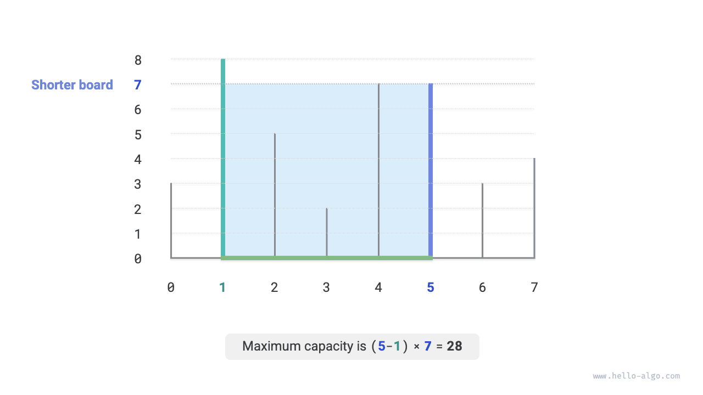
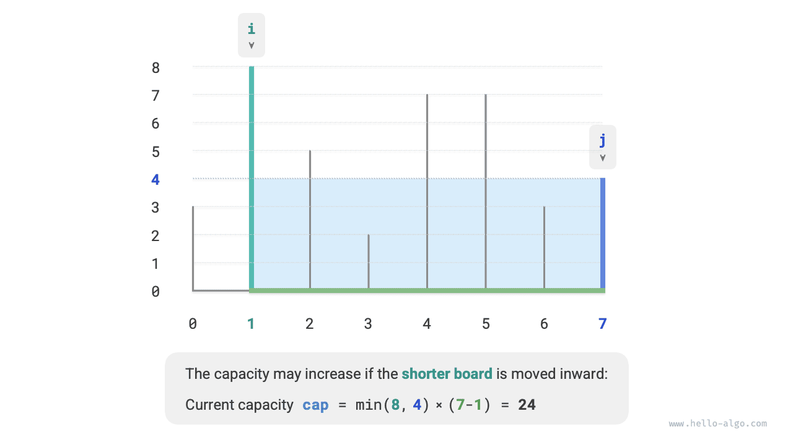
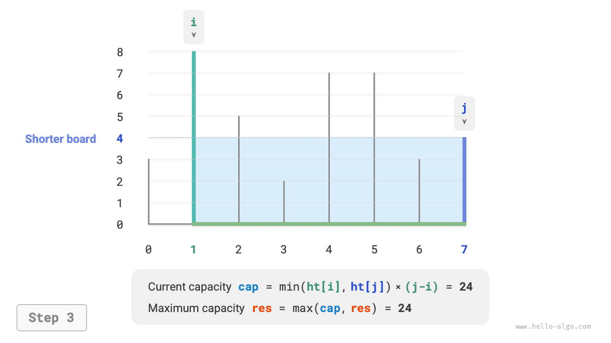
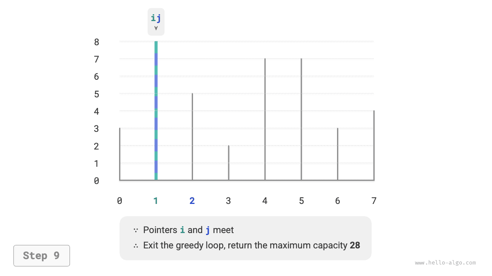

# Vấn đề về công suất tối đa

!!! câu hỏi

Cho một mảng $ht$, trong đó mỗi phần tử biểu thị chiều cao của một phân vùng dọc. Bất kỳ hai phân vùng nào trong mảng, cùng với khoảng cách giữa chúng, đều có thể tạo thành một vùng chứa.

Dung lượng của vùng chứa bằng tích của chiều cao và chiều rộng (tức là diện tích của nó), trong đó chiều cao được xác định bởi phân vùng ngắn hơn và chiều rộng là sự khác biệt giữa các chỉ số mảng của hai phân vùng.

Chọn hai phân vùng trong mảng sao cho dung lượng của vùng chứa kết quả được tối đa hóa và trả về dung lượng tối đa đó. Một ví dụ được hiển thị trong hình dưới đây.



Vùng chứa được hình thành bởi hai phân vùng bất kỳ, **vì vậy trạng thái của vấn đề này là chỉ số của hai phân vùng, ký hiệu là $[i, j]$**.

Theo báo cáo bài toán, dung lượng bằng chiều cao nhân với chiều rộng, trong đó chiều cao được xác định bởi phân vùng ngắn hơn và chiều rộng là sự khác biệt giữa các chỉ số mảng của hai phân vùng. Đặt dung lượng là $cap[i, j]$; thì ta thu được công thức sau:

$$
cap[i, j] = \min(ht[i], ht[j]) \times (j - i)
$$

Gọi độ dài mảng là $n$. Khi đó, số cách chọn hai phân vùng (tức là tổng số trạng thái) là $C_n^2 = \frac{n(n - 1)}{2}$. Cách tiếp cận đơn giản nhất là **liệt kê toàn diện tất cả các trạng thái** để tìm công suất tối đa, có độ phức tạp về thời gian là $O(n^2)$.

### Quyết định chiến lược tham lam

Vấn đề này có một giải pháp hiệu quả hơn. Như thể hiện trong hình bên dưới, hãy xem xét một trạng thái $[i, j]$ trong đó $i < j$ và $ht[i] < ht[j]$. Trong trường hợp này, $i$ là phân vùng ngắn hơn và $j$ là phân vùng cao hơn.


Như thể hiện trong hình bên dưới, **nếu bây giờ chúng ta di chuyển phân vùng cao hơn $j$ vào trong phân vùng ngắn hơn $i$, dung lượng chắc chắn sẽ giảm**.

Điều này là do sau khi di chuyển phân vùng cao hơn $j$, chiều rộng $j-i$ chắc chắn sẽ giảm. Vì chiều cao được xác định bởi phân vùng ngắn hơn nên chiều cao chỉ có thể giữ nguyên ($i$ vẫn là phân vùng ngắn hơn) hoặc giảm ($j$ trở thành phân vùng ngắn hơn sau khi được di chuyển).


Ngược lại, **chỉ bằng cách di chuyển phân vùng $i$ ngắn hơn vào trong thì dung lượng mới có thể tăng**. Mặc dù chiều rộng chắc chắn sẽ giảm, **chiều cao có thể tăng** (phân vùng được di chuyển tại $i$ có thể cao hơn). Ví dụ, trong hình bên dưới, diện tích tăng lên sau khi di chuyển phân vùng ngắn hơn.



Từ đó, chúng ta có thể rút ra chiến lược tham lam cho bài toán này: khởi tạo hai con trỏ ở hai đầu và trong mỗi vòng di chuyển con trỏ tương ứng với phân vùng ngắn hơn vào trong cho đến khi hai con trỏ gặp nhau.

Hình dưới đây cho thấy quá trình thực hiện chiến lược tham lam.

1. Ở trạng thái ban đầu, các con trỏ $i$ và $j$ nằm ở cả hai đầu của mảng.
2. Tính toán dung lượng của trạng thái hiện tại $cap[i, j]$ và cập nhật dung lượng tối đa.
3. So sánh chiều cao của các phân vùng $i$ và $j$, đồng thời di chuyển con trỏ tương ứng với phân vùng ngắn hơn vào trong một vị trí.
4. Lặp lại các bước `2.` và `3.` cho đến khi $i$ và $j$ gặp nhau.

=== "<1>"
    

=== "<2>"
    

=== "<3>"
    

=== "<4>"
    

=== "<5>"
    

=== "<6>"
    

=== "<7>"
    

=== "<8>"
    

=== "<9>"
    

### Triển khai mã

Mã chạy tối đa $n$ vòng, **vì vậy độ phức tạp về thời gian là $O(n)$**.

Các biến $i$, $j$ và $res$ chỉ sử dụng một lượng không gian bổ sung không đổi, **vì vậy độ phức tạp của không gian là $O(1)$**.

=== "Python"
    ```python title="max_capacity.py"
    def max_capacity(ht: list[int]) -> int:
        """Max capacity: Greedy algorithm"""
        # Initialize i, j to be at both ends of the array
        i, j = 0, len(ht) - 1
        # Initial max capacity is 0
        res = 0
        # Loop for greedy selection until the two boards meet
        while i < j:
            # Update max capacity
            cap = min(ht[i], ht[j]) * (j - i)
            res = max(res, cap)
            # Move the shorter board inward
            if ht[i] < ht[j]:
                i += 1
            else:
                j -= 1
        return res
    ```
=== "C++"
    ```cpp title="max_capacity.cpp"
    int maxCapacity(vector<int> &ht) {
        // Initialize i, j to be at both ends of the array
        int i = 0, j = ht.size() - 1;
        // Initial max capacity is 0
        int res = 0;
        // Loop for greedy selection until the two boards meet
        while (i < j) {
            // Update max capacity
            int cap = min(ht[i], ht[j]) * (j - i);
            res = max(res, cap);
            // Move the shorter board inward
            if (ht[i] < ht[j]) {
                i++;
            } else {
                j--;
            }
        }
        return res;
    }
    ```
=== "Java"
    ```java title="max_capacity.java"
    public class max_capacity {
        /* Max capacity: Greedy algorithm */
        static int maxCapacity(int[] ht) {
            // Initialize i, j to be at both ends of the array
            int i = 0, j = ht.length - 1;
            // Initial max capacity is 0
            int res = 0;
            // Loop for greedy selection until the two boards meet
            while (i < j) {
                // Update max capacity
                int cap = Math.min(ht[i], ht[j]) * (j - i);
                res = Math.max(res, cap);
                // Move the shorter board inward
                if (ht[i] < ht[j]) {
                    i++;
                } else {
                    j--;
                }
            }
            return res;
        }
    
        public static void main(String[] args) {
            int[] ht = { 3, 8, 5, 2, 7, 7, 3, 4 };
    
            // Greedy algorithm
            int res = maxCapacity(ht);
            System.out.println("Maximum capacity is " + res);
        }
    }
    ```
=== "C#"
    ```csharp title="max_capacity.cs"
    public class max_capacity {
        /* Max capacity: Greedy algorithm */
        int MaxCapacity(int[] ht) {
            // Initialize i, j to be at both ends of the array
            int i = 0, j = ht.Length - 1;
            // Initial max capacity is 0
            int res = 0;
            // Loop for greedy selection until the two boards meet
            while (i < j) {
                // Update max capacity
                int cap = Math.Min(ht[i], ht[j]) * (j - i);
                res = Math.Max(res, cap);
                // Move the shorter board inward
                if (ht[i] < ht[j]) {
                    i++;
                } else {
                    j--;
                }
            }
            return res;
        }
    
        [Test]
        public void Test() {
            int[] ht = [3, 8, 5, 2, 7, 7, 3, 4];
    
            // Greedy algorithm
            int res = MaxCapacity(ht);
            Console.WriteLine("Maximum capacity is " + res);
        }
    }
    ```
=== "Go"
    ```go title="max_capacity.go"
    func maxCapacity(ht []int) int {
    	// Initialize i, j to be at both ends of the array
    	i, j := 0, len(ht)-1
    	// Initial max capacity is 0
    	res := 0
    	// Loop for greedy selection until the two boards meet
    	for i < j {
    		// Update max capacity
    		capacity := int(math.Min(float64(ht[i]), float64(ht[j]))) * (j - i)
    		res = int(math.Max(float64(res), float64(capacity)))
    		// Move the shorter board inward
    		if ht[i] < ht[j] {
    			i++
    		} else {
    			j--
    		}
    	}
    	return res
    }
    ```
=== "Swift"
    ```swift title="max_capacity.swift"
    func maxCapacity(ht: [Int]) -> Int {
        // Initialize i, j to be at both ends of the array
        var i = ht.startIndex, j = ht.endIndex - 1
        // Initial max capacity is 0
        var res = 0
        // Loop for greedy selection until the two boards meet
        while i < j {
            // Update max capacity
            let cap = min(ht[i], ht[j]) * (j - i)
            res = max(res, cap)
            // Move the shorter board inward
            if ht[i] < ht[j] {
                i += 1
            } else {
                j -= 1
            }
        }
        return res
    }
    ```
=== "JS"
    ```javascript title="max_capacity.js"
    function maxCapacity(ht) {
        // Initialize i, j to be at both ends of the array
        let i = 0,
            j = ht.length - 1;
        // Initial max capacity is 0
        let res = 0;
        // Loop for greedy selection until the two boards meet
        while (i < j) {
            // Update max capacity
            const cap = Math.min(ht[i], ht[j]) * (j - i);
            res = Math.max(res, cap);
            // Move the shorter board inward
            if (ht[i] < ht[j]) {
                i += 1;
            } else {
                j -= 1;
            }
        }
        return res;
    }
    ```
=== "TS"
    ```typescript title="max_capacity.ts"
    function maxCapacity(ht: number[]): number {
        // Initialize i, j to be at both ends of the array
        let i = 0,
            j = ht.length - 1;
        // Initial max capacity is 0
        let res = 0;
        // Loop for greedy selection until the two boards meet
        while (i < j) {
            // Update max capacity
            const cap: number = Math.min(ht[i], ht[j]) * (j - i);
            res = Math.max(res, cap);
            // Move the shorter board inward
            if (ht[i] < ht[j]) {
                i += 1;
            } else {
                j -= 1;
            }
        }
        return res;
    }
    ```
=== "Dart"
    ```dart title="max_capacity.dart"
    int maxCapacity(List<int> ht) {
      // Initialize i, j to be at both ends of the array
      int i = 0, j = ht.length - 1;
      // Initial max capacity is 0
      int res = 0;
      // Loop for greedy selection until the two boards meet
      while (i < j) {
        // Update max capacity
        int cap = min(ht[i], ht[j]) * (j - i);
        res = max(res, cap);
        // Move the shorter board inward
        if (ht[i] < ht[j]) {
          i++;
        } else {
          j--;
        }
      }
      return res;
    }
    ```
=== "Rust"
    ```rust title="max_capacity.rs"
    fn max_capacity(ht: &[i32]) -> i32 {
        // Initialize i, j to be at both ends of the array
        let mut i = 0;
        let mut j = ht.len() - 1;
        // Initial max capacity is 0
        let mut res = 0;
        // Loop for greedy selection until the two boards meet
        while i < j {
            // Update max capacity
            let cap = std::cmp::min(ht[i], ht[j]) * (j - i) as i32;
            res = std::cmp::max(res, cap);
            // Move the shorter board inward
            if ht[i] < ht[j] {
                i += 1;
            } else {
                j -= 1;
            }
        }
        res
    }
    ```
=== "C"
    ```c title="max_capacity.c"
    int maxCapacity(int ht[], int htLength) {
        // Initialize i, j to be at both ends of the array
        int i = 0;
        int j = htLength - 1;
        // Initial max capacity is 0
        int res = 0;
        // Loop for greedy selection until the two boards meet
        while (i < j) {
            // Update max capacity
            int capacity = myMin(ht[i], ht[j]) * (j - i);
            res = myMax(res, capacity);
            // Move the shorter board inward
            if (ht[i] < ht[j]) {
                i++;
            } else {
                j--;
            }
        }
        return res;
    }
    ```
=== "Kotlin"
    ```kotlin title="max_capacity.kt"
    fun maxCapacity(ht: IntArray): Int {
        // Initialize i, j to be at both ends of the array
        var i = 0
        var j = ht.size - 1
        // Initial max capacity is 0
        var res = 0
        // Loop for greedy selection until the two boards meet
        while (i < j) {
            // Update max capacity
            val cap = min(ht[i], ht[j]) * (j - i)
            res = max(res, cap)
            // Move the shorter board inward
            if (ht[i] < ht[j]) {
                i++
            } else {
                j--
            }
        }
        return res
    }
    ```
=== "Ruby"
    ```ruby title="max_capacity.rb"
    ### Maximum capacity: greedy ###
    def max_capacity(ht)
      # Initialize i, j to be at both ends of the array
      i, j = 0, ht.length - 1
      # Initial max capacity is 0
      res = 0
    
      # Loop for greedy selection until the two boards meet
      while i < j
        # Update max capacity
        cap = [ht[i], ht[j]].min * (j - i)
        res = [res, cap].max
        # Move the shorter board inward
        if ht[i] < ht[j]
          i += 1
        else
          j -= 1
        end
      end
    
      res
    ```


### Bằng chứng về tính đúng đắn

Lý do tham lam nhanh hơn liệt kê đầy đủ là vì mỗi vòng lựa chọn tham lam "bỏ qua" một số trạng thái.

Ví dụ, ở trạng thái $cap[i, j]$, giả sử $i$ là phân vùng ngắn hơn và $j$ là phân vùng cao hơn. Nếu chúng ta cố tình di chuyển phân vùng $i$ ngắn hơn vào trong một vị trí, các trạng thái hiển thị trong hình bên dưới sẽ bị "bỏ qua". **Điều này có nghĩa là sau này không thể kiểm tra dung lượng của chúng được nữa**.

$$
cap[i, i+1], cap[i, i+2], \dots, cap[i, j-2], cap[i, j-1]
$$


Nhìn kỹ hơn sẽ thấy rằng **các trạng thái bị bỏ qua này chính xác là các trạng thái thu được bằng cách di chuyển phân vùng cao hơn $j$ vào trong**. Chúng tôi đã chứng minh rằng việc di chuyển vách ngăn cao hơn vào trong chắc chắn sẽ làm giảm dung lượng. Do đó, không có trạng thái bị bỏ qua nào có thể là giải pháp tối ưu, **vì vậy việc bỏ qua chúng không khiến chúng ta bỏ lỡ trạng thái tối ưu**.

Phân tích trên cho thấy việc di chuyển phân vùng ngắn hơn là một thao tác "an toàn" và chiến lược tham lam có hiệu quả.
