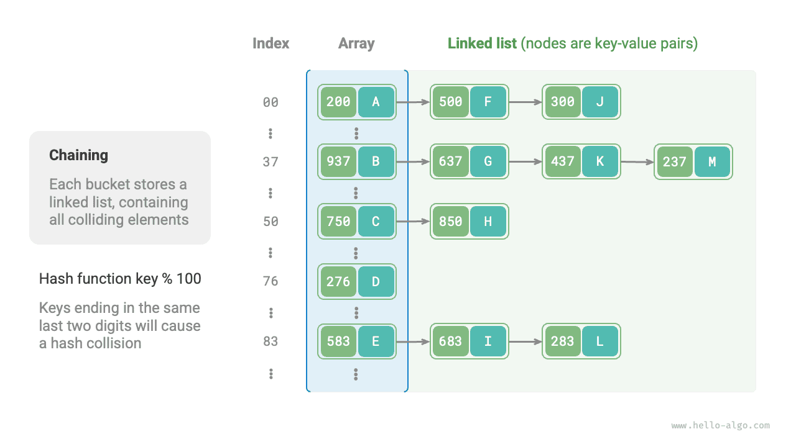
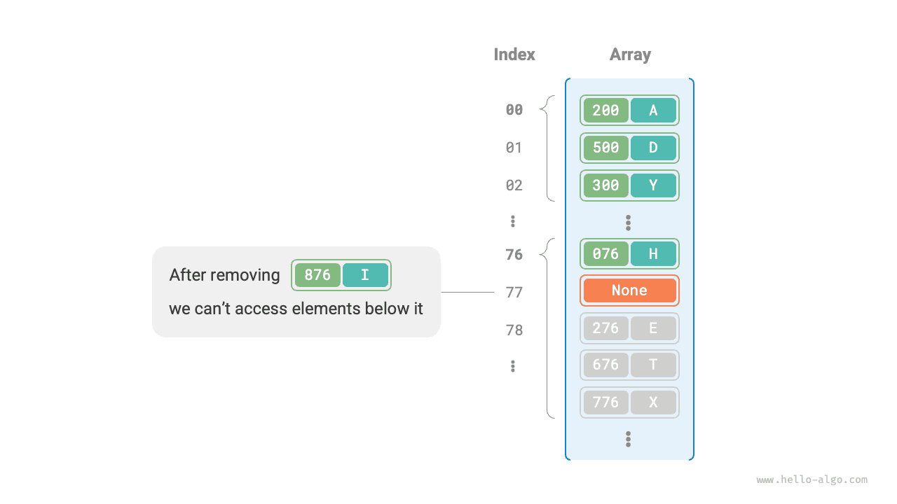

# Va chạm băm

Phần trước đã đề cập rằng, **trong hầu hết các trường hợp, không gian đầu vào của hàm băm lớn hơn nhiều so với không gian đầu ra**, vì vậy về mặt lý thuyết, việc va chạm hàm băm là không thể tránh khỏi. Ví dụ: nếu không gian đầu vào là tất cả các số nguyên và không gian đầu ra là kích thước dung lượng mảng thì chắc chắn nhiều số nguyên sẽ được ánh xạ tới cùng một chỉ mục nhóm.

Xung đột băm có thể dẫn đến kết quả truy vấn không chính xác, ảnh hưởng nghiêm trọng đến khả năng sử dụng của bảng băm. Để giải quyết vấn đề này, bất cứ khi nào xung đột băm xảy ra, chúng ta có thể thực hiện mở rộng bảng băm cho đến khi xung đột biến mất. Cách tiếp cận này đơn giản, dễ hiểu và hiệu quả nhưng rất kém hiệu quả vì việc mở rộng bảng băm liên quan đến một lượng lớn di chuyển dữ liệu và tính toán lại giá trị băm. Để nâng cao hiệu quả, chúng ta có thể áp dụng các chiến lược sau:

1. Cải thiện cấu trúc dữ liệu bảng băm để **bảng băm có thể hoạt động bình thường khi xảy ra xung đột băm**.
2. Chỉ mở rộng khi cần thiết, nghĩa là chỉ khi xung đột băm nghiêm trọng.

Các cách tiếp cận chính để cải thiện cấu trúc của bảng băm là xâu chuỗi riêng biệt và đánh địa chỉ mở.

## Chuỗi riêng biệt

Trong bảng băm ban đầu, mỗi nhóm chỉ có thể lưu trữ một cặp khóa-giá trị. <u>Chuỗi riêng biệt</u> thay thế phần tử đơn lẻ trong mỗi nhóm bằng danh sách được liên kết, coi mỗi cặp khóa-giá trị là một nút và lưu trữ tất cả các cặp khóa-giá trị xung đột trong cùng một danh sách. Hình dưới đây cho thấy một ví dụ về bảng băm chuỗi riêng biệt.



Trong bảng băm được triển khai với chuỗi riêng biệt, các thao tác cơ bản hoạt động như sau:

- **Truy vấn các phần tử**: Nhập `key`, tính chỉ mục nhóm bằng hàm băm, truy cập vào phần đầu của danh sách liên kết tương ứng và duyệt qua danh sách trong khi so sánh các khóa cho đến khi tìm thấy cặp khóa-giá trị đích.
- **Thêm phần tử**: Đầu tiên sử dụng hàm băm để định vị danh sách liên kết tương ứng, sau đó chèn nút (cặp khóa-giá trị) vào danh sách.
- **Xóa phần tử**: Sử dụng hàm băm để định vị danh sách liên kết tương ứng, sau đó duyệt qua để tìm và xóa nút đích.

Chuỗi riêng biệt có những hạn chế sau:

- **Tăng mức sử dụng không gian**: Danh sách liên kết chứa các con trỏ nút, tiêu tốn nhiều dung lượng bộ nhớ hơn mảng.
- **Giảm hiệu quả truy vấn**: Điều này là do cần phải duyệt tuyến tính danh sách liên kết để tìm phần tử tương ứng.

Mã bên dưới cung cấp cách triển khai đơn giản cho bảng băm chuỗi riêng biệt, với hai điều cần lưu ý:

- Danh sách (mảng động) được sử dụng thay cho danh sách liên kết để đơn giản hóa mã. Trong thiết lập này, bảng băm (mảng) chứa nhiều nhóm, mỗi nhóm là một danh sách.
- Việc triển khai này bao gồm phương pháp mở rộng bảng băm. Khi hệ số tải vượt quá $\frac{2}{3}$, chúng tôi sẽ mở rộng bảng băm lên $2$ gấp kích thước ban đầu của nó.

=== "Python"
    ```python title="hash_map_chaining.py"
    class HashMapChaining:
        """Hash table with separate chaining"""
    
        def __init__(self):
            """Constructor"""
            self.size = 0  # Number of key-value pairs
            self.capacity = 4  # Hash table capacity
            self.load_thres = 2.0 / 3.0  # Load factor threshold for triggering expansion
            self.extend_ratio = 2  # Expansion multiplier
            self.buckets = [[] for _ in range(self.capacity)]  # Bucket array
    
        def hash_func(self, key: int) -> int:
            """Hash function"""
            return key % self.capacity
    
        def load_factor(self) -> float:
            """Load factor"""
            return self.size / self.capacity
    
        def get(self, key: int) -> str | None:
            """Query operation"""
            index = self.hash_func(key)
            bucket = self.buckets[index]
            # Traverse bucket, if key is found, return corresponding val
            for pair in bucket:
                if pair.key == key:
                    return pair.val
            # If key is not found, return None
            return None
    
        def put(self, key: int, val: str):
            """Add operation"""
            # When load factor exceeds threshold, perform expansion
            if self.load_factor() > self.load_thres:
                self.extend()
            index = self.hash_func(key)
            bucket = self.buckets[index]
            # Traverse bucket, if specified key is encountered, update corresponding val and return
            for pair in bucket:
                if pair.key == key:
                    pair.val = val
                    return
            # If key does not exist, append key-value pair to the end
            pair = Pair(key, val)
            bucket.append(pair)
            self.size += 1
    
        def remove(self, key: int):
            """Remove operation"""
            index = self.hash_func(key)
            bucket = self.buckets[index]
            # Traverse bucket and remove key-value pair from it
            for pair in bucket:
                if pair.key == key:
                    bucket.remove(pair)
                    self.size -= 1
                    break
    
        def extend(self):
            """Expand hash table"""
            # Temporarily store the original hash table
            buckets = self.buckets
            # Initialize expanded new hash table
            self.capacity *= self.extend_ratio
            self.buckets = [[] for _ in range(self.capacity)]
            self.size = 0
            # Move key-value pairs from original hash table to new hash table
            for bucket in buckets:
                for pair in bucket:
                    self.put(pair.key, pair.val)
    
        def print(self):
            """Print hash table"""
            for bucket in self.buckets:
                res = []
                for pair in bucket:
                    res.append(str(pair.key) + " -> " + pair.val)
                print(res)
    ```
=== "C++"
    ```cpp title="hash_map_chaining.cpp"
    class HashMapChaining {
      private:
        int size;                       // Number of key-value pairs
        int capacity;                   // Hash table capacity
        double loadThres;               // Load factor threshold for triggering expansion
        int extendRatio;                // Expansion multiplier
        vector<vector<Pair *>> buckets; // Bucket array
    
      public:
        /* Constructor */
        HashMapChaining() : size(0), capacity(4), loadThres(2.0 / 3.0), extendRatio(2) {
            buckets.resize(capacity);
        }
    
        /* Destructor */
        ~HashMapChaining() {
            for (auto &bucket : buckets) {
                for (Pair *pair : bucket) {
                    // Free memory
                    delete pair;
                }
            }
        }
    
        /* Hash function */
        int hashFunc(int key) {
            return key % capacity;
        }
    
        /* Load factor */
        double loadFactor() {
            return (double)size / (double)capacity;
        }
    
        /* Query operation */
        string get(int key) {
            int index = hashFunc(key);
            // Traverse bucket, if key is found, return corresponding val
            for (Pair *pair : buckets[index]) {
                if (pair->key == key) {
                    return pair->val;
                }
            }
            // Return empty string if key not found
            return "";
        }
    
        /* Add operation */
        void put(int key, string val) {
            // When load factor exceeds threshold, perform expansion
            if (loadFactor() > loadThres) {
                extend();
            }
            int index = hashFunc(key);
            // Traverse bucket, if specified key is encountered, update corresponding val and return
            for (Pair *pair : buckets[index]) {
                if (pair->key == key) {
                    pair->val = val;
                    return;
                }
            }
            // If key does not exist, append key-value pair to the end
            buckets[index].push_back(new Pair(key, val));
            size++;
        }
    
        /* Remove operation */
        void remove(int key) {
            int index = hashFunc(key);
            auto &bucket = buckets[index];
            // Traverse bucket and remove key-value pair from it
            for (int i = 0; i < bucket.size(); i++) {
                if (bucket[i]->key == key) {
                    Pair *tmp = bucket[i];
                    bucket.erase(bucket.begin() + i); // Remove key-value pair from it
                    delete tmp;                       // Free memory
                    size--;
                    return;
                }
            }
        }
    
        /* Expand hash table */
        void extend() {
            // Temporarily store the original hash table
            vector<vector<Pair *>> bucketsTmp = buckets;
            // Initialize expanded new hash table
            capacity *= extendRatio;
            buckets.clear();
            buckets.resize(capacity);
            size = 0;
            // Move key-value pairs from original hash table to new hash table
            for (auto &bucket : bucketsTmp) {
                for (Pair *pair : bucket) {
                    put(pair->key, pair->val);
                    // Free memory
                    delete pair;
                }
            }
        }
    
        /* Print hash table */
        void print() {
            for (auto &bucket : buckets) {
                cout << "[";
                for (Pair *pair : bucket) {
                    cout << pair->key << " -> " << pair->val << ", ";
                }
                cout << "]\n";
            }
        }
    };
    ```
=== "Java"
    ```java title="hash_map_chaining.java"
    class HashMapChaining {
        int size; // Number of key-value pairs
        int capacity; // Hash table capacity
        double loadThres; // Load factor threshold for triggering expansion
        int extendRatio; // Expansion multiplier
        List<List<Pair>> buckets; // Bucket array
    
        /* Constructor */
        public HashMapChaining() {
            size = 0;
            capacity = 4;
            loadThres = 2.0 / 3.0;
            extendRatio = 2;
            buckets = new ArrayList<>(capacity);
            for (int i = 0; i < capacity; i++) {
                buckets.add(new ArrayList<>());
            }
        }
    
        /* Hash function */
        int hashFunc(int key) {
            return key % capacity;
        }
    
        /* Load factor */
        double loadFactor() {
            return (double) size / capacity;
        }
    
        /* Query operation */
        String get(int key) {
            int index = hashFunc(key);
            List<Pair> bucket = buckets.get(index);
            // Traverse bucket, if key is found, return corresponding val
            for (Pair pair : bucket) {
                if (pair.key == key) {
                    return pair.val;
                }
            }
            // If key is not found, return null
            return null;
        }
    
        /* Add operation */
        void put(int key, String val) {
            // When load factor exceeds threshold, perform expansion
            if (loadFactor() > loadThres) {
                extend();
            }
            int index = hashFunc(key);
            List<Pair> bucket = buckets.get(index);
            // Traverse bucket, if specified key is encountered, update corresponding val and return
            for (Pair pair : bucket) {
                if (pair.key == key) {
                    pair.val = val;
                    return;
                }
            }
            // If key does not exist, append key-value pair to the end
            Pair pair = new Pair(key, val);
            bucket.add(pair);
            size++;
        }
    
        /* Remove operation */
        void remove(int key) {
            int index = hashFunc(key);
            List<Pair> bucket = buckets.get(index);
            // Traverse bucket and remove key-value pair from it
            for (Pair pair : bucket) {
                if (pair.key == key) {
                    bucket.remove(pair);
                    size--;
                    break;
                }
            }
        }
    
        /* Expand hash table */
        void extend() {
            // Temporarily store the original hash table
            List<List<Pair>> bucketsTmp = buckets;
            // Initialize expanded new hash table
            capacity *= extendRatio;
            buckets = new ArrayList<>(capacity);
            for (int i = 0; i < capacity; i++) {
                buckets.add(new ArrayList<>());
            }
            size = 0;
            // Move key-value pairs from original hash table to new hash table
            for (List<Pair> bucket : bucketsTmp) {
                for (Pair pair : bucket) {
                    put(pair.key, pair.val);
                }
            }
        }
    
        /* Print hash table */
        void print() {
            for (List<Pair> bucket : buckets) {
                List<String> res = new ArrayList<>();
                for (Pair pair : bucket) {
                    res.add(pair.key + " -> " + pair.val);
                }
                System.out.println(res);
            }
        }
    }
    ```
=== "C#"
    ```csharp title="hash_map_chaining.cs"
    class HashMapChaining {
        int size; // Number of key-value pairs
        int capacity; // Hash table capacity
        double loadThres; // Load factor threshold for triggering expansion
        int extendRatio; // Expansion multiplier
        List<List<Pair>> buckets; // Bucket array
    
        /* Constructor */
        public HashMapChaining() {
            size = 0;
            capacity = 4;
            loadThres = 2.0 / 3.0;
            extendRatio = 2;
            buckets = new List<List<Pair>>(capacity);
            for (int i = 0; i < capacity; i++) {
                buckets.Add([]);
            }
        }
    
        /* Hash function */
        int HashFunc(int key) {
            return key % capacity;
        }
    
        /* Load factor */
        double LoadFactor() {
            return (double)size / capacity;
        }
    
        /* Query operation */
        public string? Get(int key) {
            int index = HashFunc(key);
            // Traverse bucket, if key is found, return corresponding val
            foreach (Pair pair in buckets[index]) {
                if (pair.key == key) {
                    return pair.val;
                }
            }
            // If key is not found, return null
            return null;
        }
    
        /* Add operation */
        public void Put(int key, string val) {
            // When load factor exceeds threshold, perform expansion
            if (LoadFactor() > loadThres) {
                Extend();
            }
            int index = HashFunc(key);
            // Traverse bucket, if specified key is encountered, update corresponding val and return
            foreach (Pair pair in buckets[index]) {
                if (pair.key == key) {
                    pair.val = val;
                    return;
                }
            }
            // If key does not exist, append key-value pair to the end
            buckets[index].Add(new Pair(key, val));
            size++;
        }
    
        /* Remove operation */
        public void Remove(int key) {
            int index = HashFunc(key);
            // Traverse bucket and remove key-value pair from it
            foreach (Pair pair in buckets[index].ToList()) {
                if (pair.key == key) {
                    buckets[index].Remove(pair);
                    size--;
                    break;
                }
            }
        }
    
        /* Expand hash table */
        void Extend() {
            // Temporarily store the original hash table
            List<List<Pair>> bucketsTmp = buckets;
            // Initialize expanded new hash table
            capacity *= extendRatio;
            buckets = new List<List<Pair>>(capacity);
            for (int i = 0; i < capacity; i++) {
                buckets.Add([]);
            }
            size = 0;
            // Move key-value pairs from original hash table to new hash table
            foreach (List<Pair> bucket in bucketsTmp) {
                foreach (Pair pair in bucket) {
                    Put(pair.key, pair.val);
                }
            }
        }
    
        /* Print hash table */
        public void Print() {
            foreach (List<Pair> bucket in buckets) {
                List<string> res = [];
                foreach (Pair pair in bucket) {
                    res.Add(pair.key + " -> " + pair.val);
                }
                foreach (string kv in res) {
                    Console.WriteLine(kv);
                }
            }
        }
    }
    ```
=== "Go"
    ```go title="hash_map_chaining.go"
    type hashMapChaining struct {
    	size        int      // Number of key-value pairs
    	capacity    int      // Hash table capacity
    	loadThres   float64  // Load factor threshold for triggering expansion
    	extendRatio int      // Expansion multiplier
    	buckets     [][]pair // Bucket array
    }
    ```
=== "Swift"
    ```swift title="hash_map_chaining.swift"
    class HashMapChaining {
        var size: Int // Number of key-value pairs
        var capacity: Int // Hash table capacity
        var loadThres: Double // Load factor threshold for triggering expansion
        var extendRatio: Int // Expansion multiplier
        var buckets: [[Pair]] // Bucket array
    
        /* Constructor */
        init() {
            size = 0
            capacity = 4
            loadThres = 2.0 / 3.0
            extendRatio = 2
            buckets = Array(repeating: [], count: capacity)
        }
    
        /* Hash function */
        func hashFunc(key: Int) -> Int {
            key % capacity
        }
    
        /* Load factor */
        func loadFactor() -> Double {
            Double(size) / Double(capacity)
        }
    
        /* Query operation */
        func get(key: Int) -> String? {
            let index = hashFunc(key: key)
            let bucket = buckets[index]
            // Traverse bucket, if key is found, return corresponding val
            for pair in bucket {
                if pair.key == key {
                    return pair.val
                }
            }
            // Return nil if key not found
            return nil
        }
    
        /* Add operation */
        func put(key: Int, val: String) {
            // When load factor exceeds threshold, perform expansion
            if loadFactor() > loadThres {
                extend()
            }
            let index = hashFunc(key: key)
            let bucket = buckets[index]
            // Traverse bucket, if specified key is encountered, update corresponding val and return
            for pair in bucket {
                if pair.key == key {
                    pair.val = val
                    return
                }
            }
            // If key does not exist, append key-value pair to the end
            let pair = Pair(key: key, val: val)
            buckets[index].append(pair)
            size += 1
        }
    
        /* Remove operation */
        func remove(key: Int) {
            let index = hashFunc(key: key)
            let bucket = buckets[index]
            // Traverse bucket and remove key-value pair from it
            for (pairIndex, pair) in bucket.enumerated() {
                if pair.key == key {
                    buckets[index].remove(at: pairIndex)
                    size -= 1
                    break
                }
            }
        }
    
        /* Expand hash table */
        func extend() {
            // Temporarily store the original hash table
            let bucketsTmp = buckets
            // Initialize expanded new hash table
            capacity *= extendRatio
            buckets = Array(repeating: [], count: capacity)
            size = 0
            // Move key-value pairs from original hash table to new hash table
            for bucket in bucketsTmp {
                for pair in bucket {
                    put(key: pair.key, val: pair.val)
                }
            }
        }
    
        /* Print hash table */
        func print() {
            for bucket in buckets {
                let res = bucket.map { "\($0.key) -> \($0.val)" }
                Swift.print(res)
            }
        }
    }
    ```
=== "JS"
    ```javascript title="hash_map_chaining.js"
    class HashMapChaining {
        #size; // Number of key-value pairs
        #capacity; // Hash table capacity
        #loadThres; // Load factor threshold for triggering expansion
        #extendRatio; // Expansion multiplier
        #buckets; // Bucket array
    
        /* Constructor */
        constructor() {
            this.#size = 0;
            this.#capacity = 4;
            this.#loadThres = 2.0 / 3.0;
            this.#extendRatio = 2;
            this.#buckets = new Array(this.#capacity).fill(null).map((x) => []);
        }
    
        /* Hash function */
        #hashFunc(key) {
            return key % this.#capacity;
        }
    
        /* Load factor */
        #loadFactor() {
            return this.#size / this.#capacity;
        }
    
        /* Query operation */
        get(key) {
            const index = this.#hashFunc(key);
            const bucket = this.#buckets[index];
            // Traverse bucket, if key is found, return corresponding val
            for (const pair of bucket) {
                if (pair.key === key) {
                    return pair.val;
                }
            }
            // If key is not found, return null
            return null;
        }
    
        /* Add operation */
        put(key, val) {
            // When load factor exceeds threshold, perform expansion
            if (this.#loadFactor() > this.#loadThres) {
                this.#extend();
            }
            const index = this.#hashFunc(key);
            const bucket = this.#buckets[index];
            // Traverse bucket, if specified key is encountered, update corresponding val and return
            for (const pair of bucket) {
                if (pair.key === key) {
                    pair.val = val;
                    return;
                }
            }
            // If key does not exist, append key-value pair to the end
            const pair = new Pair(key, val);
            bucket.push(pair);
            this.#size++;
        }
    
        /* Remove operation */
        remove(key) {
            const index = this.#hashFunc(key);
            let bucket = this.#buckets[index];
            // Traverse bucket and remove key-value pair from it
            for (let i = 0; i < bucket.length; i++) {
                if (bucket[i].key === key) {
                    bucket.splice(i, 1);
                    this.#size--;
                    break;
                }
            }
        }
    
        /* Expand hash table */
        #extend() {
            // Temporarily store the original hash table
            const bucketsTmp = this.#buckets;
            // Initialize expanded new hash table
            this.#capacity *= this.#extendRatio;
            this.#buckets = new Array(this.#capacity).fill(null).map((x) => []);
            this.#size = 0;
            // Move key-value pairs from original hash table to new hash table
            for (const bucket of bucketsTmp) {
                for (const pair of bucket) {
                    this.put(pair.key, pair.val);
                }
            }
        }
    
        /* Print hash table */
        print() {
            for (const bucket of this.#buckets) {
                let res = [];
                for (const pair of bucket) {
                    res.push(pair.key + ' -> ' + pair.val);
                }
                console.log(res);
            }
        }
    }
    ```
=== "TS"
    ```typescript title="hash_map_chaining.ts"
    class HashMapChaining {
        #size: number; // Number of key-value pairs
        #capacity: number; // Hash table capacity
        #loadThres: number; // Load factor threshold for triggering expansion
        #extendRatio: number; // Expansion multiplier
        #buckets: Pair[][]; // Bucket array
    
        /* Constructor */
        constructor() {
            this.#size = 0;
            this.#capacity = 4;
            this.#loadThres = 2.0 / 3.0;
            this.#extendRatio = 2;
            this.#buckets = new Array(this.#capacity).fill(null).map((x) => []);
        }
    
        /* Hash function */
        #hashFunc(key: number): number {
            return key % this.#capacity;
        }
    
        /* Load factor */
        #loadFactor(): number {
            return this.#size / this.#capacity;
        }
    
        /* Query operation */
        get(key: number): string | null {
            const index = this.#hashFunc(key);
            const bucket = this.#buckets[index];
            // Traverse bucket, if key is found, return corresponding val
            for (const pair of bucket) {
                if (pair.key === key) {
                    return pair.val;
                }
            }
            // If key is not found, return null
            return null;
        }
    
        /* Add operation */
        put(key: number, val: string): void {
            // When load factor exceeds threshold, perform expansion
            if (this.#loadFactor() > this.#loadThres) {
                this.#extend();
            }
            const index = this.#hashFunc(key);
            const bucket = this.#buckets[index];
            // Traverse bucket, if specified key is encountered, update corresponding val and return
            for (const pair of bucket) {
                if (pair.key === key) {
                    pair.val = val;
                    return;
                }
            }
            // If key does not exist, append key-value pair to the end
            const pair = new Pair(key, val);
            bucket.push(pair);
            this.#size++;
        }
    
        /* Remove operation */
        remove(key: number): void {
            const index = this.#hashFunc(key);
            let bucket = this.#buckets[index];
            // Traverse bucket and remove key-value pair from it
            for (let i = 0; i < bucket.length; i++) {
                if (bucket[i].key === key) {
                    bucket.splice(i, 1);
                    this.#size--;
                    break;
                }
            }
        }
    
        /* Expand hash table */
        #extend(): void {
            // Temporarily store the original hash table
            const bucketsTmp = this.#buckets;
            // Initialize expanded new hash table
            this.#capacity *= this.#extendRatio;
            this.#buckets = new Array(this.#capacity).fill(null).map((x) => []);
            this.#size = 0;
            // Move key-value pairs from original hash table to new hash table
            for (const bucket of bucketsTmp) {
                for (const pair of bucket) {
                    this.put(pair.key, pair.val);
                }
            }
        }
    
        /* Print hash table */
        print(): void {
            for (const bucket of this.#buckets) {
                let res = [];
                for (const pair of bucket) {
                    res.push(pair.key + ' -> ' + pair.val);
                }
                console.log(res);
            }
        }
    }
    ```
=== "Dart"
    ```dart title="hash_map_chaining.dart"
    class HashMapChaining {
      late int size; // Number of key-value pairs
      late int capacity; // Hash table capacity
      late double loadThres; // Load factor threshold for triggering expansion
      late int extendRatio; // Expansion multiplier
      late List<List<Pair>> buckets; // Bucket array
    
      /* Constructor */
      HashMapChaining() {
        size = 0;
        capacity = 4;
        loadThres = 2.0 / 3.0;
        extendRatio = 2;
        buckets = List.generate(capacity, (_) => []);
      }
    
      /* Hash function */
      int hashFunc(int key) {
        return key % capacity;
      }
    
      /* Load factor */
      double loadFactor() {
        return size / capacity;
      }
    
      /* Query operation */
      String? get(int key) {
        int index = hashFunc(key);
        List<Pair> bucket = buckets[index];
        // Traverse bucket, if key is found, return corresponding val
        for (Pair pair in bucket) {
          if (pair.key == key) {
            return pair.val;
          }
        }
        // If key is not found, return null
        return null;
      }
    
      /* Add operation */
      void put(int key, String val) {
        // When load factor exceeds threshold, perform expansion
        if (loadFactor() > loadThres) {
          extend();
        }
        int index = hashFunc(key);
        List<Pair> bucket = buckets[index];
        // Traverse bucket, if specified key is encountered, update corresponding val and return
        for (Pair pair in bucket) {
          if (pair.key == key) {
            pair.val = val;
            return;
          }
        }
        // If key does not exist, append key-value pair to the end
        Pair pair = Pair(key, val);
        bucket.add(pair);
        size++;
      }
    
      /* Remove operation */
      void remove(int key) {
        int index = hashFunc(key);
        List<Pair> bucket = buckets[index];
        // Traverse bucket and remove key-value pair from it
        for (Pair pair in bucket) {
          if (pair.key == key) {
            bucket.remove(pair);
            size--;
            break;
          }
        }
      }
    
      /* Expand hash table */
      void extend() {
        // Temporarily store the original hash table
        List<List<Pair>> bucketsTmp = buckets;
        // Initialize expanded new hash table
        capacity *= extendRatio;
        buckets = List.generate(capacity, (_) => []);
        size = 0;
        // Move key-value pairs from original hash table to new hash table
        for (List<Pair> bucket in bucketsTmp) {
          for (Pair pair in bucket) {
            put(pair.key, pair.val);
          }
        }
      }
    
      /* Print hash table */
      void printHashMap() {
        for (List<Pair> bucket in buckets) {
          List<String> res = [];
          for (Pair pair in bucket) {
            res.add("${pair.key} -> ${pair.val}");
          }
          print(res);
        }
      }
    }
    ```
=== "Rust"
    ```rust title="hash_map_chaining.rs"
    struct HashMapChaining {
        size: usize,
        capacity: usize,
        load_thres: f32,
        extend_ratio: usize,
        buckets: Vec<Vec<Pair>>,
    }
    ```
=== "C"
    ```c title="hash_map_chaining.c"
    HashMapChaining *newHashMapChaining() {
        HashMapChaining *hashMap = (HashMapChaining *)malloc(sizeof(HashMapChaining));
        hashMap->size = 0;
        hashMap->capacity = 4;
        hashMap->loadThres = 2.0 / 3.0;
        hashMap->extendRatio = 2;
        hashMap->buckets = (Node **)malloc(hashMap->capacity * sizeof(Node *));
        for (int i = 0; i < hashMap->capacity; i++) {
            hashMap->buckets[i] = NULL;
        }
        return hashMap;
    }
    ```
=== "Kotlin"
    ```kotlin title="hash_map_chaining.kt"
    class HashMapChaining {
        var size: Int // Number of key-value pairs
        var capacity: Int // Hash table capacity
        val loadThres: Double // Load factor threshold for triggering expansion
        val extendRatio: Int // Expansion multiplier
        var buckets: MutableList<MutableList<Pair>> // Bucket array
    
        /* Constructor */
        init {
            size = 0
            capacity = 4
            loadThres = 2.0 / 3.0
            extendRatio = 2
            buckets = mutableListOf()
            for (i in 0..<capacity) {
                buckets.add(mutableListOf())
            }
        }
    
        /* Hash function */
        fun hashFunc(key: Int): Int {
            return key % capacity
        }
    
        /* Load factor */
        fun loadFactor(): Double {
            return (size / capacity).toDouble()
        }
    
        /* Query operation */
        fun get(key: Int): String? {
            val index = hashFunc(key)
            val bucket = buckets[index]
            // Traverse bucket, if key is found, return corresponding val
            for (pair in bucket) {
                if (pair.key == key) return pair._val
            }
            // If key is not found, return null
            return null
        }
    
        /* Add operation */
        fun put(key: Int, _val: String) {
            // When load factor exceeds threshold, perform expansion
            if (loadFactor() > loadThres) {
                extend()
            }
            val index = hashFunc(key)
            val bucket = buckets[index]
            // Traverse bucket, if specified key is encountered, update corresponding val and return
            for (pair in bucket) {
                if (pair.key == key) {
                    pair._val = _val
                    return
                }
            }
            // If key does not exist, append key-value pair to the end
            val pair = Pair(key, _val)
            bucket.add(pair)
            size++
        }
    
        /* Remove operation */
        fun remove(key: Int) {
            val index = hashFunc(key)
            val bucket = buckets[index]
            // Traverse bucket and remove key-value pair from it
            for (pair in bucket) {
                if (pair.key == key) {
                    bucket.remove(pair)
                    size--
                    break
                }
            }
        }
    
        /* Expand hash table */
        fun extend() {
            // Temporarily store the original hash table
            val bucketsTmp = buckets
            // Initialize expanded new hash table
            capacity *= extendRatio
            // mutablelist has no fixed size
            buckets = mutableListOf()
            for (i in 0..<capacity) {
                buckets.add(mutableListOf())
            }
            size = 0
            // Move key-value pairs from original hash table to new hash table
            for (bucket in bucketsTmp) {
                for (pair in bucket) {
                    put(pair.key, pair._val)
                }
            }
        }
    
        /* Print hash table */
        fun print() {
            for (bucket in buckets) {
                val res = mutableListOf<String>()
                for (pair in bucket) {
                    val k = pair.key
                    val v = pair._val
                    res.add("$k -> $v")
                }
                println(res)
            }
        }
    }
    ```
=== "Ruby"
    ```ruby title="hash_map_chaining.rb"
    ### Hash map with chaining ###
    class HashMapChaining
      ### Constructor ###
      def initialize
        @size = 0 # Number of key-value pairs
        @capacity = 4 # Hash table capacity
        @load_thres = 2.0 / 3.0 # Load factor threshold for triggering expansion
        @extend_ratio = 2 # Expansion multiplier
        @buckets = Array.new(@capacity) { [] } # Bucket array
      end
    
      ### Hash function ###
      def hash_func(key)
        key % @capacity
      end
    
      ### Load factor ###
      def load_factor
        @size / @capacity
      end
    
      ### Query operation ###
      def get(key)
        index = hash_func(key)
        bucket = @buckets[index]
        # Traverse bucket, if key is found, return corresponding val
        for pair in bucket
          return pair.val if pair.key == key
        end
        # Return nil if key not found
        nil
      end
    
      ### Add operation ###
      def put(key, val)
        # When load factor exceeds threshold, perform expansion
        extend if load_factor > @load_thres
        index = hash_func(key)
        bucket = @buckets[index]
        # Traverse bucket, if specified key is encountered, update corresponding val and return
        for pair in bucket
          if pair.key == key
            pair.val = val
            return
          end
        end
        # If key does not exist, append key-value pair to the end
        pair = Pair.new(key, val)
        bucket << pair
        @size += 1
      end
    
      ### Delete operation ###
      def remove(key)
        index = hash_func(key)
        bucket = @buckets[index]
        # Traverse bucket and remove key-value pair from it
        for pair in bucket
          if pair.key == key
            bucket.delete(pair)
            @size -= 1
            break
          end
        end
      end
    
      ### Expand hash table ###
      def extend
        # Temporarily store original hash table
        buckets = @buckets
        # Initialize expanded new hash table
        @capacity *= @extend_ratio
        @buckets = Array.new(@capacity) { [] }
        @size = 0
        # Move key-value pairs from original hash table to new hash table
        for bucket in buckets
          for pair in bucket
            put(pair.key, pair.val)
          end
        end
      end
    
      ### Print hash table ###
      def print
        for bucket in @buckets
          res = []
          for pair in bucket
            res << "#{pair.key} -> #{pair.val}"
          end
          pp res
        end
      end
    ```


Cần lưu ý rằng khi danh sách liên kết trở nên quá dài thì thời gian truy vấn $O(n)$ sẽ kém. **Trong trường hợp này, danh sách liên kết có thể được chuyển đổi thành cây AVL hoặc cây đỏ đen**, giảm độ phức tạp về thời gian tra cứu xuống $O(\log n)$.

## Mở địa chỉ

<u>Open addressing</u> does not introduce additional data structures. Instead, it handles hash collisions through repeated probing. Common probing strategies include linear probing, quadratic probing, and multiple hashing.

Hãy lấy việc thăm dò tuyến tính làm ví dụ để giới thiệu cơ chế của bảng băm địa chỉ mở.

### Thăm dò tuyến tính

Thăm dò tuyến tính sử dụng kích thước bước cố định để thăm dò tuần tự, do đó hoạt động của nó hơi khác so với hoạt động của bảng băm thông thường.

- **Chèn phần tử**: Tính chỉ số nhóm bằng hàm băm. Nếu nhóm đã bị chiếm dụng, hãy tiếp tục thăm dò về phía trước từ vị trí va chạm với kích thước bước cố định (thường là $1$) cho đến khi tìm thấy nhóm trống, sau đó chèn phần tử vào đó.
- **Tìm kiếm phần tử**: Nếu xảy ra xung đột, tiếp tục thăm dò về phía trước với cùng kích thước bước cho đến khi tìm thấy phần tử tương ứng và trả về `giá trị` của nó; nếu gặp một nhóm trống, phần tử đích không có trong bảng băm, vì vậy hãy trả về `None`.

Hình bên dưới hiển thị sự phân bố của các cặp khóa-giá trị trong bảng băm địa chỉ mở sử dụng thăm dò tuyến tính. Theo hàm băm này, các khóa có hai chữ số cuối giống nhau sẽ được ánh xạ vào cùng một nhóm. Việc thăm dò tuyến tính sau đó đặt chúng vào nhóm đó và các nhóm tiếp theo.


Tuy nhiên, **thăm dò tuyến tính có xu hướng phân cụm**. Cụ thể, vùng bị chiếm đóng liền kề trong mảng càng dài thì các xung đột mới càng có nhiều khả năng xảy ra trong vùng đó. Điều này lại làm cho cụm phát triển hơn nữa, tạo ra một vòng luẩn quẩn làm giảm dần hiệu quả của các hoạt động chèn, xóa, tra cứu và cập nhật.

Điều quan trọng cần lưu ý là **chúng tôi không thể xóa trực tiếp các phần tử khỏi bảng băm có địa chỉ mở**. Việc xóa một phần tử sẽ tạo ra một nhóm trống `None` trong mảng. Trong quá trình tra cứu, khi việc thăm dò tuyến tính chạm tới vùng trống đó, nó sẽ dừng lại, điều đó có nghĩa là mọi phần tử được lưu trữ xa hơn dọc theo chuỗi thăm dò sẽ không thể truy cập được. Kết quả là chương trình có thể kết luận không chính xác rằng những phần tử đó không tồn tại, như thể hiện trong hình bên dưới.



Để giải quyết vấn đề này, chúng ta có thể áp dụng <u>xóa từng phần</u>: thay vì xóa trực tiếp một phần tử khỏi bảng băm, **sử dụng hằng số `TOMBSTONE` để đánh dấu nhóm**. Theo cơ chế này, cả `None` và `TOMBSTONE` đều biểu thị các nhóm có thể chấp nhận các cặp khóa-giá trị. Sự khác biệt là khi việc thăm dò tuyến tính gặp `TOMBSTONE`, nó phải tiếp tục thăm dò, bởi vì các cặp khóa-giá trị có thể vẫn tồn tại xa hơn dọc theo chuỗi.

Tuy nhiên, **xóa chậm có thể đẩy nhanh tốc độ suy giảm hiệu suất của bảng băm**. Mỗi lần xóa sẽ để lại một điểm đánh dấu và khi số lượng mục nhập `TOMBSTONE` tăng lên, thời gian tìm kiếm cũng tăng lên, vì việc thăm dò tuyến tính có thể cần phải bỏ qua nhiều bia mộ trước khi tìm thấy phần tử mục tiêu.

Để giải quyết vấn đề này, chúng ta có thể ghi lại chỉ mục của `TOMBSTONE` đầu tiên gặp phải trong quá trình thăm dò tuyến tính và hoán đổi phần tử mục tiêu được tìm thấy vào vị trí đó. Lợi ích là mỗi truy vấn hoặc thao tác chèn có thể di chuyển các phần tử đến gần vị trí lý tưởng của chúng hơn, tức là gần hơn với nơi bắt đầu thăm dò, giúp cải thiện hiệu quả tra cứu.

Mã bên dưới triển khai bảng băm địa chỉ mở (thăm dò tuyến tính) với tính năng xóa từng phần. Để tận dụng tốt hơn không gian bảng băm, chúng ta xử lý bảng băm như một "mảng tròn". Khi đi quá cuối mảng, ta quay lại đầu mảng và tiếp tục duyệt.

=== "Python"
    ```python title="hash_map_open_addressing.py"
    class HashMapOpenAddressing:
        """Hash table with open addressing"""
    
        def __init__(self):
            """Constructor"""
            self.size = 0  # Number of key-value pairs
            self.capacity = 4  # Hash table capacity
            self.load_thres = 2.0 / 3.0  # Load factor threshold for triggering expansion
            self.extend_ratio = 2  # Expansion multiplier
            self.buckets: list[Pair | None] = [None] * self.capacity  # Bucket array
            self.TOMBSTONE = Pair(-1, "-1")  # Removal marker
    
        def hash_func(self, key: int) -> int:
            """Hash function"""
            return key % self.capacity
    
        def load_factor(self) -> float:
            """Load factor"""
            return self.size / self.capacity
    
        def find_bucket(self, key: int) -> int:
            """Search for bucket index corresponding to key"""
            index = self.hash_func(key)
            first_tombstone = -1
            # Linear probing, break when encountering an empty bucket
            while self.buckets[index] is not None:
                # If key is encountered, return the corresponding bucket index
                if self.buckets[index].key == key:
                    # If a removal marker was encountered before, move the key-value pair to that index
                    if first_tombstone != -1:
                        self.buckets[first_tombstone] = self.buckets[index]
                        self.buckets[index] = self.TOMBSTONE
                        return first_tombstone  # Return the moved bucket index
                    return index  # Return bucket index
                # Record the first removal marker encountered
                if first_tombstone == -1 and self.buckets[index] is self.TOMBSTONE:
                    first_tombstone = index
                # Calculate bucket index, wrap around to the head if past the tail
                index = (index + 1) % self.capacity
            # If key does not exist, return the index for insertion
            return index if first_tombstone == -1 else first_tombstone
    
        def get(self, key: int) -> str:
            """Query operation"""
            # Search for bucket index corresponding to key
            index = self.find_bucket(key)
            # If key-value pair is found, return corresponding val
            if self.buckets[index] not in [None, self.TOMBSTONE]:
                return self.buckets[index].val
            # If key-value pair does not exist, return None
            return None
    
        def put(self, key: int, val: str):
            """Add operation"""
            # When load factor exceeds threshold, perform expansion
            if self.load_factor() > self.load_thres:
                self.extend()
            # Search for bucket index corresponding to key
            index = self.find_bucket(key)
            # If key-value pair is found, overwrite val and return
            if self.buckets[index] not in [None, self.TOMBSTONE]:
                self.buckets[index].val = val
                return
            # If key-value pair does not exist, add the key-value pair
            self.buckets[index] = Pair(key, val)
            self.size += 1
    
        def remove(self, key: int):
            """Remove operation"""
            # Search for bucket index corresponding to key
            index = self.find_bucket(key)
            # If key-value pair is found, overwrite it with removal marker
            if self.buckets[index] not in [None, self.TOMBSTONE]:
                self.buckets[index] = self.TOMBSTONE
                self.size -= 1
    
        def extend(self):
            """Expand hash table"""
            # Temporarily store the original hash table
            buckets_tmp = self.buckets
            # Initialize expanded new hash table
            self.capacity *= self.extend_ratio
            self.buckets = [None] * self.capacity
            self.size = 0
            # Move key-value pairs from original hash table to new hash table
            for pair in buckets_tmp:
                if pair not in [None, self.TOMBSTONE]:
                    self.put(pair.key, pair.val)
    
        def print(self):
            """Print hash table"""
            for pair in self.buckets:
                if pair is None:
                    print("None")
                elif pair is self.TOMBSTONE:
                    print("TOMBSTONE")
                else:
                    print(pair.key, "->", pair.val)
    ```
=== "C++"
    ```cpp title="hash_map_open_addressing.cpp"
    class HashMapOpenAddressing {
      private:
        int size;                             // Number of key-value pairs
        int capacity = 4;                     // Hash table capacity
        const double loadThres = 2.0 / 3.0;     // Load factor threshold for triggering expansion
        const int extendRatio = 2;            // Expansion multiplier
        vector<Pair *> buckets;               // Bucket array
        Pair *TOMBSTONE = new Pair(-1, "-1"); // Removal marker
    
      public:
        /* Constructor */
        HashMapOpenAddressing() : size(0), buckets(capacity, nullptr) {
        }
    
        /* Destructor */
        ~HashMapOpenAddressing() {
            for (Pair *pair : buckets) {
                if (pair != nullptr && pair != TOMBSTONE) {
                    delete pair;
                }
            }
            delete TOMBSTONE;
        }
    
        /* Hash function */
        int hashFunc(int key) {
            return key % capacity;
        }
    
        /* Load factor */
        double loadFactor() {
            return (double)size / capacity;
        }
    
        /* Search for bucket index corresponding to key */
        int findBucket(int key) {
            int index = hashFunc(key);
            int firstTombstone = -1;
            // Linear probing, break when encountering an empty bucket
            while (buckets[index] != nullptr) {
                // If key is encountered, return the corresponding bucket index
                if (buckets[index]->key == key) {
                    // If a removal marker was encountered before, move the key-value pair to that index
                    if (firstTombstone != -1) {
                        buckets[firstTombstone] = buckets[index];
                        buckets[index] = TOMBSTONE;
                        return firstTombstone; // Return the moved bucket index
                    }
                    return index; // Return bucket index
                }
                // Record the first removal marker encountered
                if (firstTombstone == -1 && buckets[index] == TOMBSTONE) {
                    firstTombstone = index;
                }
                // Calculate bucket index, wrap around to the head if past the tail
                index = (index + 1) % capacity;
            }
            // If key does not exist, return the index for insertion
            return firstTombstone == -1 ? index : firstTombstone;
        }
    
        /* Query operation */
        string get(int key) {
            // Search for bucket index corresponding to key
            int index = findBucket(key);
            // If key-value pair is found, return corresponding val
            if (buckets[index] != nullptr && buckets[index] != TOMBSTONE) {
                return buckets[index]->val;
            }
            // Return empty string if key-value pair does not exist
            return "";
        }
    
        /* Add operation */
        void put(int key, string val) {
            // When load factor exceeds threshold, perform expansion
            if (loadFactor() > loadThres) {
                extend();
            }
            // Search for bucket index corresponding to key
            int index = findBucket(key);
            // If key-value pair is found, overwrite val and return
            if (buckets[index] != nullptr && buckets[index] != TOMBSTONE) {
                buckets[index]->val = val;
                return;
            }
            // If key-value pair does not exist, add the key-value pair
            buckets[index] = new Pair(key, val);
            size++;
        }
    
        /* Remove operation */
        void remove(int key) {
            // Search for bucket index corresponding to key
            int index = findBucket(key);
            // If key-value pair is found, overwrite it with removal marker
            if (buckets[index] != nullptr && buckets[index] != TOMBSTONE) {
                delete buckets[index];
                buckets[index] = TOMBSTONE;
                size--;
            }
        }
    
        /* Expand hash table */
        void extend() {
            // Temporarily store the original hash table
            vector<Pair *> bucketsTmp = buckets;
            // Initialize expanded new hash table
            capacity *= extendRatio;
            buckets = vector<Pair *>(capacity, nullptr);
            size = 0;
            // Move key-value pairs from original hash table to new hash table
            for (Pair *pair : bucketsTmp) {
                if (pair != nullptr && pair != TOMBSTONE) {
                    put(pair->key, pair->val);
                    delete pair;
                }
            }
        }
    
        /* Print hash table */
        void print() {
            for (Pair *pair : buckets) {
                if (pair == nullptr) {
                    cout << "nullptr" << endl;
                } else if (pair == TOMBSTONE) {
                    cout << "TOMBSTONE" << endl;
                } else {
                    cout << pair->key << " -> " << pair->val << endl;
                }
            }
        }
    };
    ```
=== "Java"
    ```java title="hash_map_open_addressing.java"
    class HashMapOpenAddressing {
        private int size; // Number of key-value pairs
        private int capacity = 4; // Hash table capacity
        private final double loadThres = 2.0 / 3.0; // Load factor threshold for triggering expansion
        private final int extendRatio = 2; // Expansion multiplier
        private Pair[] buckets; // Bucket array
        private final Pair TOMBSTONE = new Pair(-1, "-1"); // Removal marker
    
        /* Constructor */
        public HashMapOpenAddressing() {
            size = 0;
            buckets = new Pair[capacity];
        }
    
        /* Hash function */
        private int hashFunc(int key) {
            return key % capacity;
        }
    
        /* Load factor */
        private double loadFactor() {
            return (double) size / capacity;
        }
    
        /* Search for bucket index corresponding to key */
        private int findBucket(int key) {
            int index = hashFunc(key);
            int firstTombstone = -1;
            // Linear probing, break when encountering an empty bucket
            while (buckets[index] != null) {
                // If key is encountered, return the corresponding bucket index
                if (buckets[index].key == key) {
                    // If a removal marker was encountered before, move the key-value pair to that index
                    if (firstTombstone != -1) {
                        buckets[firstTombstone] = buckets[index];
                        buckets[index] = TOMBSTONE;
                        return firstTombstone; // Return the moved bucket index
                    }
                    return index; // Return bucket index
                }
                // Record the first removal marker encountered
                if (firstTombstone == -1 && buckets[index] == TOMBSTONE) {
                    firstTombstone = index;
                }
                // Calculate bucket index, wrap around to the head if past the tail
                index = (index + 1) % capacity;
            }
            // If key does not exist, return the index for insertion
            return firstTombstone == -1 ? index : firstTombstone;
        }
    
        /* Query operation */
        public String get(int key) {
            // Search for bucket index corresponding to key
            int index = findBucket(key);
            // If key-value pair is found, return corresponding val
            if (buckets[index] != null && buckets[index] != TOMBSTONE) {
                return buckets[index].val;
            }
            // If key-value pair does not exist, return null
            return null;
        }
    
        /* Add operation */
        public void put(int key, String val) {
            // When load factor exceeds threshold, perform expansion
            if (loadFactor() > loadThres) {
                extend();
            }
            // Search for bucket index corresponding to key
            int index = findBucket(key);
            // If key-value pair is found, overwrite val and return
            if (buckets[index] != null && buckets[index] != TOMBSTONE) {
                buckets[index].val = val;
                return;
            }
            // If key-value pair does not exist, add the key-value pair
            buckets[index] = new Pair(key, val);
            size++;
        }
    
        /* Remove operation */
        public void remove(int key) {
            // Search for bucket index corresponding to key
            int index = findBucket(key);
            // If key-value pair is found, overwrite it with removal marker
            if (buckets[index] != null && buckets[index] != TOMBSTONE) {
                buckets[index] = TOMBSTONE;
                size--;
            }
        }
    
        /* Expand hash table */
        private void extend() {
            // Temporarily store the original hash table
            Pair[] bucketsTmp = buckets;
            // Initialize expanded new hash table
            capacity *= extendRatio;
            buckets = new Pair[capacity];
            size = 0;
            // Move key-value pairs from original hash table to new hash table
            for (Pair pair : bucketsTmp) {
                if (pair != null && pair != TOMBSTONE) {
                    put(pair.key, pair.val);
                }
            }
        }
    
        /* Print hash table */
        public void print() {
            for (Pair pair : buckets) {
                if (pair == null) {
                    System.out.println("null");
                } else if (pair == TOMBSTONE) {
                    System.out.println("TOMBSTONE");
                } else {
                    System.out.println(pair.key + " -> " + pair.val);
                }
            }
        }
    }
    ```
=== "C#"
    ```csharp title="hash_map_open_addressing.cs"
    class HashMapOpenAddressing {
        int size; // Number of key-value pairs
        int capacity = 4; // Hash table capacity
        double loadThres = 2.0 / 3.0; // Load factor threshold for triggering expansion
        int extendRatio = 2; // Expansion multiplier
        Pair[] buckets; // Bucket array
        Pair TOMBSTONE = new(-1, "-1"); // Removal marker
    
        /* Constructor */
        public HashMapOpenAddressing() {
            size = 0;
            buckets = new Pair[capacity];
        }
    
        /* Hash function */
        int HashFunc(int key) {
            return key % capacity;
        }
    
        /* Load factor */
        double LoadFactor() {
            return (double)size / capacity;
        }
    
        /* Search for bucket index corresponding to key */
        int FindBucket(int key) {
            int index = HashFunc(key);
            int firstTombstone = -1;
            // Linear probing, break when encountering an empty bucket
            while (buckets[index] != null) {
                // If key is encountered, return the corresponding bucket index
                if (buckets[index].key == key) {
                    // If a removal marker was encountered before, move the key-value pair to that index
                    if (firstTombstone != -1) {
                        buckets[firstTombstone] = buckets[index];
                        buckets[index] = TOMBSTONE;
                        return firstTombstone; // Return the moved bucket index
                    }
                    return index; // Return bucket index
                }
                // Record the first removal marker encountered
                if (firstTombstone == -1 && buckets[index] == TOMBSTONE) {
                    firstTombstone = index;
                }
                // Calculate bucket index, wrap around to the head if past the tail
                index = (index + 1) % capacity;
            }
            // If key does not exist, return the index for insertion
            return firstTombstone == -1 ? index : firstTombstone;
        }
    
        /* Query operation */
        public string? Get(int key) {
            // Search for bucket index corresponding to key
            int index = FindBucket(key);
            // If key-value pair is found, return corresponding val
            if (buckets[index] != null && buckets[index] != TOMBSTONE) {
                return buckets[index].val;
            }
            // If key-value pair does not exist, return null
            return null;
        }
    
        /* Add operation */
        public void Put(int key, string val) {
            // When load factor exceeds threshold, perform expansion
            if (LoadFactor() > loadThres) {
                Extend();
            }
            // Search for bucket index corresponding to key
            int index = FindBucket(key);
            // If key-value pair is found, overwrite val and return
            if (buckets[index] != null && buckets[index] != TOMBSTONE) {
                buckets[index].val = val;
                return;
            }
            // If key-value pair does not exist, add the key-value pair
            buckets[index] = new Pair(key, val);
            size++;
        }
    
        /* Remove operation */
        public void Remove(int key) {
            // Search for bucket index corresponding to key
            int index = FindBucket(key);
            // If key-value pair is found, overwrite it with removal marker
            if (buckets[index] != null && buckets[index] != TOMBSTONE) {
                buckets[index] = TOMBSTONE;
                size--;
            }
        }
    
        /* Expand hash table */
        void Extend() {
            // Temporarily store the original hash table
            Pair[] bucketsTmp = buckets;
            // Initialize expanded new hash table
            capacity *= extendRatio;
            buckets = new Pair[capacity];
            size = 0;
            // Move key-value pairs from original hash table to new hash table
            foreach (Pair pair in bucketsTmp) {
                if (pair != null && pair != TOMBSTONE) {
                    Put(pair.key, pair.val);
                }
            }
        }
    
        /* Print hash table */
        public void Print() {
            foreach (Pair pair in buckets) {
                if (pair == null) {
                    Console.WriteLine("null");
                } else if (pair == TOMBSTONE) {
                    Console.WriteLine("TOMBSTONE");
                } else {
                    Console.WriteLine(pair.key + " -> " + pair.val);
                }
            }
        }
    }
    ```
=== "Go"
    ```go title="hash_map_open_addressing.go"
    type hashMapOpenAddressing struct {
    	size        int     // Number of key-value pairs
    	capacity    int     // Hash table capacity
    	loadThres   float64 // Load factor threshold for triggering expansion
    	extendRatio int     // Expansion multiplier
    	buckets     []*pair // Bucket array
    	TOMBSTONE   *pair   // Removal marker
    }
    ```
=== "Swift"
    ```swift title="hash_map_open_addressing.swift"
    class HashMapOpenAddressing {
        var size: Int // Number of key-value pairs
        var capacity: Int // Hash table capacity
        var loadThres: Double // Load factor threshold for triggering expansion
        var extendRatio: Int // Expansion multiplier
        var buckets: [Pair?] // Bucket array
        var TOMBSTONE: Pair // Removal marker
    
        /* Constructor */
        init() {
            size = 0
            capacity = 4
            loadThres = 2.0 / 3.0
            extendRatio = 2
            buckets = Array(repeating: nil, count: capacity)
            TOMBSTONE = Pair(key: -1, val: "-1")
        }
    
        /* Hash function */
        func hashFunc(key: Int) -> Int {
            key % capacity
        }
    
        /* Load factor */
        func loadFactor() -> Double {
            Double(size) / Double(capacity)
        }
    
        /* Search for bucket index corresponding to key */
        func findBucket(key: Int) -> Int {
            var index = hashFunc(key: key)
            var firstTombstone = -1
            // Linear probing, break when encountering an empty bucket
            while buckets[index] != nil {
                // If key is encountered, return the corresponding bucket index
                if buckets[index]!.key == key {
                    // If a removal marker was encountered before, move the key-value pair to that index
                    if firstTombstone != -1 {
                        buckets[firstTombstone] = buckets[index]
                        buckets[index] = TOMBSTONE
                        return firstTombstone // Return the moved bucket index
                    }
                    return index // Return bucket index
                }
                // Record the first removal marker encountered
                if firstTombstone == -1 && buckets[index] == TOMBSTONE {
                    firstTombstone = index
                }
                // Calculate bucket index, wrap around to the head if past the tail
                index = (index + 1) % capacity
            }
            // If key does not exist, return the index for insertion
            return firstTombstone == -1 ? index : firstTombstone
        }
    
        /* Query operation */
        func get(key: Int) -> String? {
            // Search for bucket index corresponding to key
            let index = findBucket(key: key)
            // If key-value pair is found, return corresponding val
            if buckets[index] != nil, buckets[index] != TOMBSTONE {
                return buckets[index]!.val
            }
            // If key-value pair does not exist, return null
            return nil
        }
    
        /* Add operation */
        func put(key: Int, val: String) {
            // When load factor exceeds threshold, perform expansion
            if loadFactor() > loadThres {
                extend()
            }
            // Search for bucket index corresponding to key
            let index = findBucket(key: key)
            // If key-value pair is found, overwrite val and return
            if buckets[index] != nil, buckets[index] != TOMBSTONE {
                buckets[index]!.val = val
                return
            }
            // If key-value pair does not exist, add the key-value pair
            buckets[index] = Pair(key: key, val: val)
            size += 1
        }
    
        /* Remove operation */
        func remove(key: Int) {
            // Search for bucket index corresponding to key
            let index = findBucket(key: key)
            // If key-value pair is found, overwrite it with removal marker
            if buckets[index] != nil, buckets[index] != TOMBSTONE {
                buckets[index] = TOMBSTONE
                size -= 1
            }
        }
    
        /* Expand hash table */
        func extend() {
            // Temporarily store the original hash table
            let bucketsTmp = buckets
            // Initialize expanded new hash table
            capacity *= extendRatio
            buckets = Array(repeating: nil, count: capacity)
            size = 0
            // Move key-value pairs from original hash table to new hash table
            for pair in bucketsTmp {
                if let pair, pair != TOMBSTONE {
                    put(key: pair.key, val: pair.val)
                }
            }
        }
    
        /* Print hash table */
        func print() {
            for pair in buckets {
                if pair == nil {
                    Swift.print("null")
                } else if pair == TOMBSTONE {
                    Swift.print("TOMBSTONE")
                } else {
                    Swift.print("\(pair!.key) -> \(pair!.val)")
                }
            }
        }
    }
    ```
=== "JS"
    ```javascript title="hash_map_open_addressing.js"
    class HashMapOpenAddressing {
        #size; // Number of key-value pairs
        #capacity; // Hash table capacity
        #loadThres; // Load factor threshold for triggering expansion
        #extendRatio; // Expansion multiplier
        #buckets; // Bucket array
        #TOMBSTONE; // Removal marker
    
        /* Constructor */
        constructor() {
            this.#size = 0; // Number of key-value pairs
            this.#capacity = 4; // Hash table capacity
            this.#loadThres = 2.0 / 3.0; // Load factor threshold for triggering expansion
            this.#extendRatio = 2; // Expansion multiplier
            this.#buckets = Array(this.#capacity).fill(null); // Bucket array
            this.#TOMBSTONE = new Pair(-1, '-1'); // Removal marker
        }
    
        /* Hash function */
        #hashFunc(key) {
            return key % this.#capacity;
        }
    
        /* Load factor */
        #loadFactor() {
            return this.#size / this.#capacity;
        }
    
        /* Search for bucket index corresponding to key */
        #findBucket(key) {
            let index = this.#hashFunc(key);
            let firstTombstone = -1;
            // Linear probing, break when encountering an empty bucket
            while (this.#buckets[index] !== null) {
                // If key is encountered, return the corresponding bucket index
                if (this.#buckets[index].key === key) {
                    // If a removal marker was encountered before, move the key-value pair to that index
                    if (firstTombstone !== -1) {
                        this.#buckets[firstTombstone] = this.#buckets[index];
                        this.#buckets[index] = this.#TOMBSTONE;
                        return firstTombstone; // Return the moved bucket index
                    }
                    return index; // Return bucket index
                }
                // Record the first removal marker encountered
                if (
                    firstTombstone === -1 &&
                    this.#buckets[index] === this.#TOMBSTONE
                ) {
                    firstTombstone = index;
                }
                // Calculate bucket index, wrap around to the head if past the tail
                index = (index + 1) % this.#capacity;
            }
            // If key does not exist, return the index for insertion
            return firstTombstone === -1 ? index : firstTombstone;
        }
    
        /* Query operation */
        get(key) {
            // Search for bucket index corresponding to key
            const index = this.#findBucket(key);
            // If key-value pair is found, return corresponding val
            if (
                this.#buckets[index] !== null &&
                this.#buckets[index] !== this.#TOMBSTONE
            ) {
                return this.#buckets[index].val;
            }
            // If key-value pair does not exist, return null
            return null;
        }
    
        /* Add operation */
        put(key, val) {
            // When load factor exceeds threshold, perform expansion
            if (this.#loadFactor() > this.#loadThres) {
                this.#extend();
            }
            // Search for bucket index corresponding to key
            const index = this.#findBucket(key);
            // If key-value pair is found, overwrite val and return
            if (
                this.#buckets[index] !== null &&
                this.#buckets[index] !== this.#TOMBSTONE
            ) {
                this.#buckets[index].val = val;
                return;
            }
            // If key-value pair does not exist, add the key-value pair
            this.#buckets[index] = new Pair(key, val);
            this.#size++;
        }
    
        /* Remove operation */
        remove(key) {
            // Search for bucket index corresponding to key
            const index = this.#findBucket(key);
            // If key-value pair is found, overwrite it with removal marker
            if (
                this.#buckets[index] !== null &&
                this.#buckets[index] !== this.#TOMBSTONE
            ) {
                this.#buckets[index] = this.#TOMBSTONE;
                this.#size--;
            }
        }
    
        /* Expand hash table */
        #extend() {
            // Temporarily store the original hash table
            const bucketsTmp = this.#buckets;
            // Initialize expanded new hash table
            this.#capacity *= this.#extendRatio;
            this.#buckets = Array(this.#capacity).fill(null);
            this.#size = 0;
            // Move key-value pairs from original hash table to new hash table
            for (const pair of bucketsTmp) {
                if (pair !== null && pair !== this.#TOMBSTONE) {
                    this.put(pair.key, pair.val);
                }
            }
        }
    
        /* Print hash table */
        print() {
            for (const pair of this.#buckets) {
                if (pair === null) {
                    console.log('null');
                } else if (pair === this.#TOMBSTONE) {
                    console.log('TOMBSTONE');
                } else {
                    console.log(pair.key + ' -> ' + pair.val);
                }
            }
        }
    }
    ```
=== "TS"
    ```typescript title="hash_map_open_addressing.ts"
    class HashMapOpenAddressing {
        private size: number; // Number of key-value pairs
        private capacity: number; // Hash table capacity
        private loadThres: number; // Load factor threshold for triggering expansion
        private extendRatio: number; // Expansion multiplier
        private buckets: Array<Pair | null>; // Bucket array
        private TOMBSTONE: Pair; // Removal marker
    
        /* Constructor */
        constructor() {
            this.size = 0; // Number of key-value pairs
            this.capacity = 4; // Hash table capacity
            this.loadThres = 2.0 / 3.0; // Load factor threshold for triggering expansion
            this.extendRatio = 2; // Expansion multiplier
            this.buckets = Array(this.capacity).fill(null); // Bucket array
            this.TOMBSTONE = new Pair(-1, '-1'); // Removal marker
        }
    
        /* Hash function */
        private hashFunc(key: number): number {
            return key % this.capacity;
        }
    
        /* Load factor */
        private loadFactor(): number {
            return this.size / this.capacity;
        }
    
        /* Search for bucket index corresponding to key */
        private findBucket(key: number): number {
            let index = this.hashFunc(key);
            let firstTombstone = -1;
            // Linear probing, break when encountering an empty bucket
            while (this.buckets[index] !== null) {
                // If key is encountered, return the corresponding bucket index
                if (this.buckets[index]!.key === key) {
                    // If a removal marker was encountered before, move the key-value pair to that index
                    if (firstTombstone !== -1) {
                        this.buckets[firstTombstone] = this.buckets[index];
                        this.buckets[index] = this.TOMBSTONE;
                        return firstTombstone; // Return the moved bucket index
                    }
                    return index; // Return bucket index
                }
                // Record the first removal marker encountered
                if (
                    firstTombstone === -1 &&
                    this.buckets[index] === this.TOMBSTONE
                ) {
                    firstTombstone = index;
                }
                // Calculate bucket index, wrap around to the head if past the tail
                index = (index + 1) % this.capacity;
            }
            // If key does not exist, return the index for insertion
            return firstTombstone === -1 ? index : firstTombstone;
        }
    
        /* Query operation */
        get(key: number): string | null {
            // Search for bucket index corresponding to key
            const index = this.findBucket(key);
            // If key-value pair is found, return corresponding val
            if (
                this.buckets[index] !== null &&
                this.buckets[index] !== this.TOMBSTONE
            ) {
                return this.buckets[index]!.val;
            }
            // If key-value pair does not exist, return null
            return null;
        }
    
        /* Add operation */
        put(key: number, val: string): void {
            // When load factor exceeds threshold, perform expansion
            if (this.loadFactor() > this.loadThres) {
                this.extend();
            }
            // Search for bucket index corresponding to key
            const index = this.findBucket(key);
            // If key-value pair is found, overwrite val and return
            if (
                this.buckets[index] !== null &&
                this.buckets[index] !== this.TOMBSTONE
            ) {
                this.buckets[index]!.val = val;
                return;
            }
            // If key-value pair does not exist, add the key-value pair
            this.buckets[index] = new Pair(key, val);
            this.size++;
        }
    
        /* Remove operation */
        remove(key: number): void {
            // Search for bucket index corresponding to key
            const index = this.findBucket(key);
            // If key-value pair is found, overwrite it with removal marker
            if (
                this.buckets[index] !== null &&
                this.buckets[index] !== this.TOMBSTONE
            ) {
                this.buckets[index] = this.TOMBSTONE;
                this.size--;
            }
        }
    
        /* Expand hash table */
        private extend(): void {
            // Temporarily store the original hash table
            const bucketsTmp = this.buckets;
            // Initialize expanded new hash table
            this.capacity *= this.extendRatio;
            this.buckets = Array(this.capacity).fill(null);
            this.size = 0;
            // Move key-value pairs from original hash table to new hash table
            for (const pair of bucketsTmp) {
                if (pair !== null && pair !== this.TOMBSTONE) {
                    this.put(pair.key, pair.val);
                }
            }
        }
    
        /* Print hash table */
        print(): void {
            for (const pair of this.buckets) {
                if (pair === null) {
                    console.log('null');
                } else if (pair === this.TOMBSTONE) {
                    console.log('TOMBSTONE');
                } else {
                    console.log(pair.key + ' -> ' + pair.val);
                }
            }
        }
    }
    ```
=== "Dart"
    ```dart title="hash_map_open_addressing.dart"
    class HashMapOpenAddressing {
      late int _size; // Number of key-value pairs
      int _capacity = 4; // Hash table capacity
      double _loadThres = 2.0 / 3.0; // Load factor threshold for triggering expansion
      int _extendRatio = 2; // Expansion multiplier
      late List<Pair?> _buckets; // Bucket array
      Pair _TOMBSTONE = Pair(-1, "-1"); // Removal marker
    
      /* Constructor */
      HashMapOpenAddressing() {
        _size = 0;
        _buckets = List.generate(_capacity, (index) => null);
      }
    
      /* Hash function */
      int hashFunc(int key) {
        return key % _capacity;
      }
    
      /* Load factor */
      double loadFactor() {
        return _size / _capacity;
      }
    
      /* Search for bucket index corresponding to key */
      int findBucket(int key) {
        int index = hashFunc(key);
        int firstTombstone = -1;
        // Linear probing, break when encountering an empty bucket
        while (_buckets[index] != null) {
          // If key is encountered, return the corresponding bucket index
          if (_buckets[index]!.key == key) {
            // If a removal marker was encountered before, move the key-value pair to that index
            if (firstTombstone != -1) {
              _buckets[firstTombstone] = _buckets[index];
              _buckets[index] = _TOMBSTONE;
              return firstTombstone; // Return the moved bucket index
            }
            return index; // Return bucket index
          }
          // Record the first removal marker encountered
          if (firstTombstone == -1 && _buckets[index] == _TOMBSTONE) {
            firstTombstone = index;
          }
          // Calculate bucket index, wrap around to the head if past the tail
          index = (index + 1) % _capacity;
        }
        // If key does not exist, return the index for insertion
        return firstTombstone == -1 ? index : firstTombstone;
      }
    
      /* Query operation */
      String? get(int key) {
        // Search for bucket index corresponding to key
        int index = findBucket(key);
        // If key-value pair is found, return corresponding val
        if (_buckets[index] != null && _buckets[index] != _TOMBSTONE) {
          return _buckets[index]!.val;
        }
        // If key-value pair does not exist, return null
        return null;
      }
    
      /* Add operation */
      void put(int key, String val) {
        // When load factor exceeds threshold, perform expansion
        if (loadFactor() > _loadThres) {
          extend();
        }
        // Search for bucket index corresponding to key
        int index = findBucket(key);
        // If key-value pair is found, overwrite val and return
        if (_buckets[index] != null && _buckets[index] != _TOMBSTONE) {
          _buckets[index]!.val = val;
          return;
        }
        // If key-value pair does not exist, add the key-value pair
        _buckets[index] = new Pair(key, val);
        _size++;
      }
    
      /* Remove operation */
      void remove(int key) {
        // Search for bucket index corresponding to key
        int index = findBucket(key);
        // If key-value pair is found, overwrite it with removal marker
        if (_buckets[index] != null && _buckets[index] != _TOMBSTONE) {
          _buckets[index] = _TOMBSTONE;
          _size--;
        }
      }
    
      /* Expand hash table */
      void extend() {
        // Temporarily store the original hash table
        List<Pair?> bucketsTmp = _buckets;
        // Initialize expanded new hash table
        _capacity *= _extendRatio;
        _buckets = List.generate(_capacity, (index) => null);
        _size = 0;
        // Move key-value pairs from original hash table to new hash table
        for (Pair? pair in bucketsTmp) {
          if (pair != null && pair != _TOMBSTONE) {
            put(pair.key, pair.val);
          }
        }
      }
    
      /* Print hash table */
      void printHashMap() {
        for (Pair? pair in _buckets) {
          if (pair == null) {
            print("null");
          } else if (pair == _TOMBSTONE) {
            print("TOMBSTONE");
          } else {
            print("${pair.key} -> ${pair.val}");
          }
        }
      }
    }
    ```
=== "Rust"
    ```rust title="hash_map_open_addressing.rs"
    struct HashMapOpenAddressing {
        size: usize,                // Number of key-value pairs
        capacity: usize,            // Hash table capacity
        load_thres: f64,            // Load factor threshold for triggering expansion
        extend_ratio: usize,        // Expansion multiplier
        buckets: Vec<Option<Pair>>, // Bucket array
        TOMBSTONE: Option<Pair>,    // Removal marker
    }
    ```
=== "C"
    ```c title="hash_map_open_addressing.c"
    // Function declaration
    void extend(HashMapOpenAddressing *hashMap);
    
    /* Constructor */
    HashMapOpenAddressing *newHashMapOpenAddressing() {
        HashMapOpenAddressing *hashMap = (HashMapOpenAddressing *)malloc(sizeof(HashMapOpenAddressing));
        hashMap->size = 0;
        hashMap->capacity = 4;
        hashMap->loadThres = 2.0 / 3.0;
        hashMap->extendRatio = 2;
        hashMap->buckets = (Pair **)calloc(hashMap->capacity, sizeof(Pair *));
        hashMap->TOMBSTONE = (Pair *)malloc(sizeof(Pair));
        hashMap->TOMBSTONE->key = -1;
        hashMap->TOMBSTONE->val = "-1";
    
        return hashMap;
    }
    ```
=== "Kotlin"
    ```kotlin title="hash_map_open_addressing.kt"
    class HashMapOpenAddressing {
        private var size: Int               // Number of key-value pairs
        private var capacity: Int           // Hash table capacity
        private val loadThres: Double       // Load factor threshold for triggering expansion
        private val extendRatio: Int        // Expansion multiplier
        private var buckets: Array<Pair?>   // Bucket array
        private val TOMBSTONE: Pair         // Removal marker
    
        /* Constructor */
        init {
            size = 0
            capacity = 4
            loadThres = 2.0 / 3.0
            extendRatio = 2
            buckets = arrayOfNulls(capacity)
            TOMBSTONE = Pair(-1, "-1")
        }
    
        /* Hash function */
        fun hashFunc(key: Int): Int {
            return key % capacity
        }
    
        /* Load factor */
        fun loadFactor(): Double {
            return (size / capacity).toDouble()
        }
    
        /* Search for bucket index corresponding to key */
        fun findBucket(key: Int): Int {
            var index = hashFunc(key)
            var firstTombstone = -1
            // Linear probing, break when encountering an empty bucket
            while (buckets[index] != null) {
                // If key is encountered, return the corresponding bucket index
                if (buckets[index]?.key == key) {
                    // If a removal marker was encountered before, move the key-value pair to that index
                    if (firstTombstone != -1) {
                        buckets[firstTombstone] = buckets[index]
                        buckets[index] = TOMBSTONE
                        return firstTombstone // Return the moved bucket index
                    }
                    return index // Return bucket index
                }
                // Record the first removal marker encountered
                if (firstTombstone == -1 && buckets[index] == TOMBSTONE) {
                    firstTombstone = index
                }
                // Calculate bucket index, wrap around to the head if past the tail
                index = (index + 1) % capacity
            }
            // If key does not exist, return the index for insertion
            return if (firstTombstone == -1) index else firstTombstone
        }
    
        /* Query operation */
        fun get(key: Int): String? {
            // Search for bucket index corresponding to key
            val index = findBucket(key)
            // If key-value pair is found, return corresponding val
            if (buckets[index] != null && buckets[index] != TOMBSTONE) {
                return buckets[index]?._val
            }
            // If key-value pair does not exist, return null
            return null
        }
    
        /* Add operation */
        fun put(key: Int, _val: String) {
            // When load factor exceeds threshold, perform expansion
            if (loadFactor() > loadThres) {
                extend()
            }
            // Search for bucket index corresponding to key
            val index = findBucket(key)
            // If key-value pair is found, overwrite val and return
            if (buckets[index] != null && buckets[index] != TOMBSTONE) {
                buckets[index]!!._val = _val
                return
            }
            // If key-value pair does not exist, add the key-value pair
            buckets[index] = Pair(key, _val)
            size++
        }
    
        /* Remove operation */
        fun remove(key: Int) {
            // Search for bucket index corresponding to key
            val index = findBucket(key)
            // If key-value pair is found, overwrite it with removal marker
            if (buckets[index] != null && buckets[index] != TOMBSTONE) {
                buckets[index] = TOMBSTONE
                size--
            }
        }
    
        /* Expand hash table */
        fun extend() {
            // Temporarily store the original hash table
            val bucketsTmp = buckets
            // Initialize expanded new hash table
            capacity *= extendRatio
            buckets = arrayOfNulls(capacity)
            size = 0
            // Move key-value pairs from original hash table to new hash table
            for (pair in bucketsTmp) {
                if (pair != null && pair != TOMBSTONE) {
                    put(pair.key, pair._val)
                }
            }
        }
    
        /* Print hash table */
        fun print() {
            for (pair in buckets) {
                if (pair == null) {
                    println("null")
                } else if (pair == TOMBSTONE) {
                    println("TOMESTOME")
                } else {
                    println("${pair.key} -> ${pair._val}")
                }
            }
        }
    }
    ```
=== "Ruby"
    ```ruby title="hash_map_open_addressing.rb"
    ### Hash map with open addressing ###
    class HashMapOpenAddressing
      TOMBSTONE = Pair.new(-1, '-1') # Removal marker
    
      ### Constructor ###
      def initialize
        @size = 0 # Number of key-value pairs
        @capacity = 4 # Hash table capacity
        @load_thres = 2.0 / 3.0 # Load factor threshold for triggering expansion
        @extend_ratio = 2 # Expansion multiplier
        @buckets = Array.new(@capacity) # Bucket array
      end
    
      ### Hash function ###
      def hash_func(key)
        key % @capacity
      end
    
      ### Load factor ###
      def load_factor
        @size / @capacity
      end
    
      ### Search bucket index for key ###
      def find_bucket(key)
        index = hash_func(key)
        first_tombstone = -1
        # Linear probing, break when encountering an empty bucket
        while !@buckets[index].nil?
          # If key is encountered, return the corresponding bucket index
          if @buckets[index].key == key
            # If a removal marker was encountered before, move the key-value pair to that index
            if first_tombstone != -1
              @buckets[first_tombstone] = @buckets[index]
              @buckets[index] = TOMBSTONE
              return first_tombstone # Return the moved bucket index
            end
            return index # Return bucket index
          end
          # Record the first removal marker encountered
          first_tombstone = index if first_tombstone == -1 && @buckets[index] == TOMBSTONE
          # Calculate bucket index, wrap around to the head if past the tail
          index = (index + 1) % @capacity
        end
        # If key does not exist, return the index for insertion
        first_tombstone == -1 ? index : first_tombstone
      end
    
      ### Query operation ###
      def get(key)
        # Search for bucket index corresponding to key
        index = find_bucket(key)
        # If key-value pair is found, return corresponding val
        return @buckets[index].val unless [nil, TOMBSTONE].include?(@buckets[index])
        # Return nil if key-value pair does not exist
        nil
      end
    
      ### Add operation ###
      def put(key, val)
        # When load factor exceeds threshold, perform expansion
        extend if load_factor > @load_thres
        # Search for bucket index corresponding to key
        index = find_bucket(key)
        # If key-value pair found, overwrite val and return
        unless [nil, TOMBSTONE].include?(@buckets[index])
          @buckets[index].val = val
          return
        end
        # If key-value pair does not exist, add the key-value pair
        @buckets[index] = Pair.new(key, val)
        @size += 1
      end
    
      ### Delete operation ###
      def remove(key)
        # Search for bucket index corresponding to key
        index = find_bucket(key)
        # If key-value pair is found, overwrite it with removal marker
        unless [nil, TOMBSTONE].include?(@buckets[index])
          @buckets[index] = TOMBSTONE
          @size -= 1
        end
      end
    
      ### Expand hash table ###
      def extend
        # Temporarily store the original hash table
        buckets_tmp = @buckets
        # Initialize expanded new hash table
        @capacity *= @extend_ratio
        @buckets = Array.new(@capacity)
        @size = 0
        # Move key-value pairs from original hash table to new hash table
        for pair in buckets_tmp
          put(pair.key, pair.val) unless [nil, TOMBSTONE].include?(pair)
        end
      end
    
      ### Print hash table ###
      def print
        for pair in @buckets
          if pair.nil?
            puts "Nil"
          elsif pair == TOMBSTONE
            puts "TOMBSTONE"
          else
            puts "#{pair.key} -> #{pair.val}"
          end
        end
      end
    ```


### Thăm dò bậc hai

Thăm dò bậc hai tương tự như thăm dò tuyến tính và là một trong những chiến lược phổ biến để đánh địa chỉ mở. Khi xảy ra xung đột, việc thăm dò bậc hai không chỉ bỏ qua một số bước cố định mà bỏ qua một số bước bằng "bình phương số lượng thăm dò", tức là các bước $1, 4, 9, \dots$.

Thăm dò bậc hai có những ưu điểm sau:

- Việc thăm dò bậc hai cố gắng giảm bớt hiệu ứng phân cụm của việc thăm dò tuyến tính bằng cách bỏ qua các khoảng cách bằng bình phương của số lượng thăm dò.
- Thăm dò bậc hai bỏ qua khoảng cách lớn hơn để tìm các vị trí trống, giúp phân phối dữ liệu đồng đều hơn.

Tuy nhiên, việc thăm dò bậc hai không hoàn hảo:

- Phân cụm vẫn tồn tại, tức là một số vị trí có nhiều khả năng bị chiếm dụng hơn các vị trí khác.
- Do sự phát triển của các ô vuông, việc thăm dò bậc hai có thể không thăm dò toàn bộ bảng băm, nghĩa là ngay cả khi có các nhóm trống trong bảng băm, việc thăm dò bậc hai có thể không truy cập được chúng.

### Băm nhiều lần

Như tên cho thấy, băm nhiều lần sử dụng nhiều hàm băm $f_1(x)$, $f_2(x)$, $f_3(x)$, $\dots$ để thăm dò.

- **Chèn phần tử**: Nếu hàm băm $f_1(x)$ gặp xung đột, hãy thử $f_2(x)$, v.v., cho đến khi tìm thấy vị trí trống và phần tử được chèn.
- **Tìm kiếm phần tử**: Tìm kiếm theo thứ tự của hàm băm cho đến khi tìm thấy phần tử đích và trả về phần tử đó; nếu gặp một vị trí trống hoặc tất cả các hàm băm đã được thử, nó cho biết phần tử không có trong bảng băm, sau đó trả về `None`.

So với thăm dò tuyến tính, băm nhiều lớp ít có xu hướng phân cụm hơn, nhưng việc sử dụng nhiều hàm băm sẽ gây ra chi phí tính toán bổ sung.

!!! mẹo

Xin lưu ý rằng các bảng băm dựa trên địa chỉ mở, bao gồm thăm dò tuyến tính, thăm dò bậc hai và băm nhiều lần, tất cả đều có vấn đề là không thể xóa trực tiếp các phần tử.

## Lựa chọn ngôn ngữ lập trình

Các ngôn ngữ lập trình khác nhau áp dụng các chiến lược triển khai bảng băm khác nhau. Dưới đây là một vài ví dụ:

- Python sử dụng địa chỉ mở. Từ điển `dict` sử dụng các số giả ngẫu nhiên để thăm dò.
- Java sử dụng chuỗi riêng biệt. Kể từ JDK 1.8, khi độ dài mảng trong `HashMap` đạt 64 và độ dài của danh sách liên kết đạt 8, danh sách liên kết sẽ được chuyển đổi thành cây đỏ đen để cải thiện hiệu suất tìm kiếm.
- Go sử dụng chuỗi riêng biệt. Go quy định rằng mỗi nhóm có thể lưu trữ tối đa 8 cặp khóa-giá trị và nếu vượt quá dung lượng, một nhóm tràn sẽ được liên kết; khi có quá nhiều thùng tràn, thao tác mở rộng công suất bằng nhau đặc biệt sẽ được thực hiện để đảm bảo hiệu suất.
