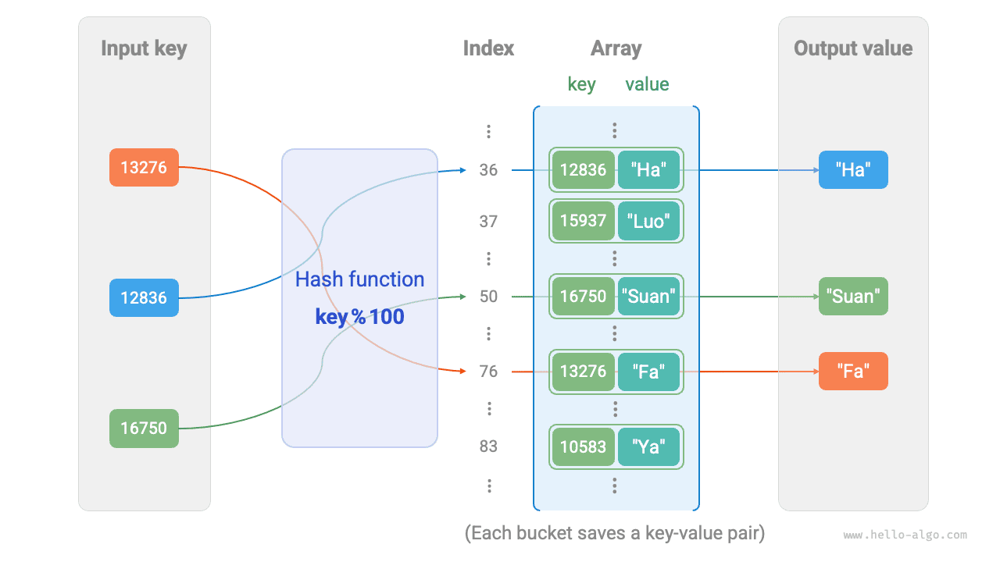
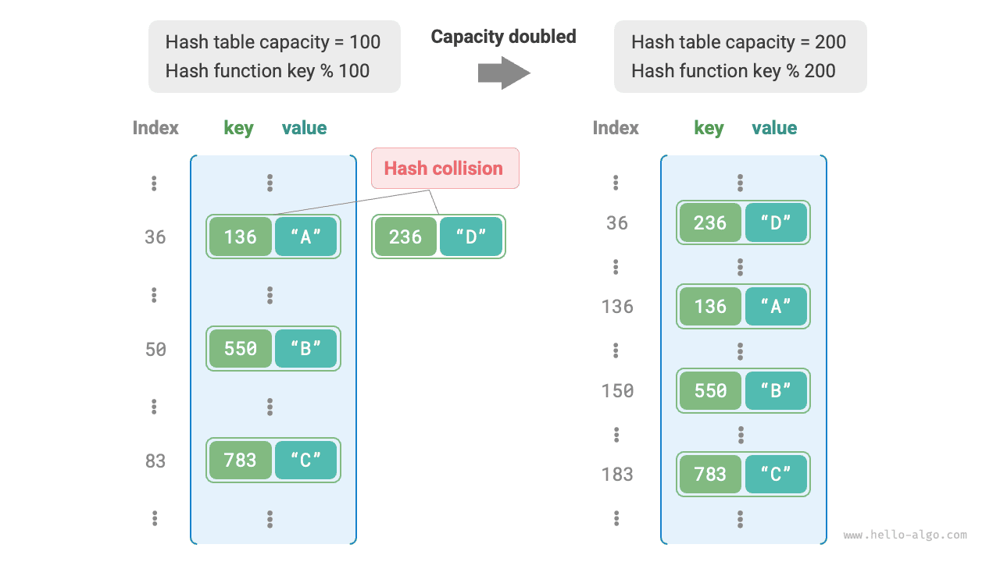

# Bảng băm

<u>Bảng băm</u>, còn được gọi là <u>bản đồ băm</u>, lưu trữ ánh xạ từ khóa `key` đến giá trị `value`, cho phép tra cứu hiệu quả. Cụ thể, với một khóa `key`, chúng ta có thể truy xuất giá trị `value` tương ứng từ bảng băm trong thời gian $O(1)$.

Như được hiển thị bên dưới, giả sử chúng ta có $n$ sinh viên, mỗi sinh viên có hai thông tin: tên và ID sinh viên. Nếu chúng tôi muốn hỗ trợ truy vấn "được cấp ID sinh viên, trả về tên tương ứng", chúng tôi có thể sử dụng bảng băm hiển thị bên dưới.


Ngoài bảng băm, mảng và danh sách liên kết cũng có thể triển khai chức năng truy vấn. So sánh hiệu quả của chúng được thể hiện trong bảng sau.

- **Thêm phần tử**: Chỉ cần thêm phần tử vào cuối mảng (danh sách liên kết), sử dụng thời gian $O(1)$.
- **Truy vấn các phần tử**: Vì mảng (danh sách liên kết) không có thứ tự, nên tất cả các phần tử cần được duyệt qua, sử dụng thời gian $O(n)$.
- **Xóa phần tử**: Phần tử trước tiên phải được định vị, sau đó xóa khỏi mảng (danh sách liên kết), sử dụng thời gian $O(n)$.

<p align="center"> Table <id> &nbsp; Comparison of element query efficiency </p>

|                 | Mảng | Danh sách liên kết | Bảng băm |
| --------------- | ------ | ----------- | ---------- |
| Tìm phần tử | $O(n)$ | $O(n)$ | $O(1)$ |
| Thêm phần tử | $O(1)$ | $O(1)$ | $O(1)$ |
| Xóa phần tử | $O(n)$ | $O(n)$ | $O(1)$ |

Như chúng ta có thể thấy, **các thao tác chèn, xóa, tra cứu và cập nhật trong bảng băm đều có độ phức tạp về thời gian $O(1)$**, giúp cho bảng băm đạt hiệu quả cao.

## Các thao tác bảng băm phổ biến

Các thao tác phổ biến trên bảng băm bao gồm: khởi tạo, thao tác truy vấn, thêm cặp khóa-giá trị và xóa cặp khóa-giá trị. Mã ví dụ như sau:

=== "Trăn"

    ```python title="hash_map.py"
    # Initialize hash table
    hmap: dict = {}

    # Add operation
    # Add key-value pair (key, value) to hash table
    hmap[12836] = "XiaoHa"
    hmap[15937] = "XiaoLuo"
    hmap[16750] = "XiaoSuan"
    hmap[13276] = "XiaoFa"
    hmap[10583] = "XiaoYa"

    # Query operation
    # Input key into hash table to get value
    name: str = hmap[15937]

    # Delete operation
    # Delete key-value pair (key, value) from hash table
    hmap.pop(10583)
    ```

=== "C++"

    ```cpp title="hash_map.cpp"
    /* Initialize hash table */
    unordered_map<int, string> map;

    /* Add operation */
    // Add key-value pair (key, value) to hash table
    map[12836] = "XiaoHa";
    map[15937] = "XiaoLuo";
    map[16750] = "XiaoSuan";
    map[13276] = "XiaoFa";
    map[10583] = "XiaoYa";

    /* Query operation */
    // Input key into hash table to get value
    string name = map[15937];

    /* Delete operation */
    // Delete key-value pair (key, value) from hash table
    map.erase(10583);
    ```

=== "Java"

    ```java title="hash_map.java"
    /* Initialize hash table */
    Map<Integer, String> map = new HashMap<>();

    /* Add operation */
    // Add key-value pair (key, value) to hash table
    map.put(12836, "XiaoHa");
    map.put(15937, "XiaoLuo");
    map.put(16750, "XiaoSuan");
    map.put(13276, "XiaoFa");
    map.put(10583, "XiaoYa");

    /* Query operation */
    // Input key into hash table to get value
    String name = map.get(15937);

    /* Delete operation */
    // Delete key-value pair (key, value) from hash table
    map.remove(10583);
    ```

=== "C#"

    ```csharp title="hash_map.cs"
    /* Initialize hash table */
    Dictionary<int, string> map = new() {
        /* Add operation */
        // Add key-value pair (key, value) to hash table
        { 12836, "XiaoHa" },
        { 15937, "XiaoLuo" },
        { 16750, "XiaoSuan" },
        { 13276, "XiaoFa" },
        { 10583, "XiaoYa" }
    };

    /* Query operation */
    // Input key into hash table to get value
    string name = map[15937];

    /* Delete operation */
    // Delete key-value pair (key, value) from hash table
    map.Remove(10583);
    ```

=== "Đi"

    ```go title="hash_map_test.go"
    /* Initialize hash table */
    hmap := make(map[int]string)

    /* Add operation */
    // Add key-value pair (key, value) to hash table
    hmap[12836] = "XiaoHa"
    hmap[15937] = "XiaoLuo"
    hmap[16750] = "XiaoSuan"
    hmap[13276] = "XiaoFa"
    hmap[10583] = "XiaoYa"

    /* Query operation */
    // Input key into hash table to get value
    name := hmap[15937]

    /* Delete operation */
    // Delete key-value pair (key, value) from hash table
    delete(hmap, 10583)
    ```

=== "Nhanh chóng"

    ```swift title="hash_map.swift"
    /* Initialize hash table */
    var map: [Int: String] = [:]

    /* Add operation */
    // Add key-value pair (key, value) to hash table
    map[12836] = "XiaoHa"
    map[15937] = "XiaoLuo"
    map[16750] = "XiaoSuan"
    map[13276] = "XiaoFa"
    map[10583] = "XiaoYa"

    /* Query operation */
    // Input key into hash table to get value
    let name = map[15937]!

    /* Delete operation */
    // Delete key-value pair (key, value) from hash table
    map.removeValue(forKey: 10583)
    ```

=== "JS"

    ```javascript title="hash_map.js"
    /* Initialize hash table */
    const map = new Map();
    /* Add operation */
    // Add key-value pair (key, value) to hash table
    map.set(12836, 'XiaoHa');
    map.set(15937, 'XiaoLuo');
    map.set(16750, 'XiaoSuan');
    map.set(13276, 'XiaoFa');
    map.set(10583, 'XiaoYa');

    /* Query operation */
    // Input key into hash table to get value
    let name = map.get(15937);

    /* Delete operation */
    // Delete key-value pair (key, value) from hash table
    map.delete(10583);
    ```

=== "TS"

    ```typescript title="hash_map.ts"
    /* Initialize hash table */
    const map = new Map<number, string>();
    /* Add operation */
    // Add key-value pair (key, value) to hash table
    map.set(12836, 'XiaoHa');
    map.set(15937, 'XiaoLuo');
    map.set(16750, 'XiaoSuan');
    map.set(13276, 'XiaoFa');
    map.set(10583, 'XiaoYa');
    console.info('\nAfter adding, hash table is\nKey -> Value');
    console.info(map);

    /* Query operation */
    // Input key into hash table to get value
    let name = map.get(15937);
    console.info('\nInput student ID 15937, queried name ' + name);

    /* Delete operation */
    // Delete key-value pair (key, value) from hash table
    map.delete(10583);
    console.info('\nAfter deleting 10583, hash table is\nKey -> Value');
    console.info(map);
    ```

=== "Phi tiêu"

    ```dart title="hash_map.dart"
    /* Initialize hash table */
    Map<int, String> map = {};

    /* Add operation */
    // Add key-value pair (key, value) to hash table
    map[12836] = "XiaoHa";
    map[15937] = "XiaoLuo";
    map[16750] = "XiaoSuan";
    map[13276] = "XiaoFa";
    map[10583] = "XiaoYa";

    /* Query operation */
    // Input key into hash table to get value
    String name = map[15937];

    /* Delete operation */
    // Delete key-value pair (key, value) from hash table
    map.remove(10583);
    ```

=== "Rỉ sét"

    ```rust title="hash_map.rs"
    use std::collections::HashMap;

    /* Initialize hash table */
    let mut map: HashMap<i32, String> = HashMap::new();

    /* Add operation */
    // Add key-value pair (key, value) to hash table
    map.insert(12836, "XiaoHa".to_string());
    map.insert(15937, "XiaoLuo".to_string());
    map.insert(16750, "XiaoSuan".to_string());
    map.insert(13276, "XiaoFa".to_string());
    map.insert(10583, "XiaoYa".to_string());

    /* Query operation */
    // Input key into hash table to get value
    let _name: Option<&String> = map.get(&15937);

    /* Delete operation */
    // Delete key-value pair (key, value) from hash table
    let _removed_value: Option<String> = map.remove(&10583);
    ```

=== "C"

    ```c title="hash_map.c"
    // C does not provide a built-in hash table
    ```

=== "Kotlin"

    ```kotlin title="hash_map.kt"
    /* Initialize hash table */
    val map = HashMap<Int,String>()

    /* Add operation */
    // Add key-value pair (key, value) to hash table
    map[12836] = "XiaoHa"
    map[15937] = "XiaoLuo"
    map[16750] = "XiaoSuan"
    map[13276] = "XiaoFa"
    map[10583] = "XiaoYa"

    /* Query operation */
    // Input key into hash table to get value
    val name = map[15937]

    /* Delete operation */
    // Delete key-value pair (key, value) from hash table
    map.remove(10583)
    ```

=== "Ruby"

    ```ruby title="hash_map.rb"
    # Initialize hash table
    hmap = {}

    # Add operation
    # Add key-value pair (key, value) to hash table
    hmap[12836] = "XiaoHa"
    hmap[15937] = "XiaoLuo"
    hmap[16750] = "XiaoSuan"
    hmap[13276] = "XiaoFa"
    hmap[10583] = "XiaoYa"

    # Query operation
    # Input key into hash table to get value
    name = hmap[15937]

    # Delete operation
    # Delete key-value pair (key, value) from hash table
    hmap.delete(10583)
    ```

??? pythontutor "Thực thi trực quan"

https://pythontutor.com/render.html#code=%22%22%22Driver%20Code%22%22%22%0Aif%20__name __%20%3D%3D%20%22__main__%22%3A%0A%20%20%20%20%23%20%E5%88%9D%E5%A7%8B%E5%8C%96%E5%93%8 8%E5%B8%8C%E8%A1%A8%0A%20%20%20%20hmap%20%3D%20%7B%7D%0A%20%20%20%20%0A%20%20%20%20%23 %20%E6%B7%BB%E5%8A%A0%E6%93%8D%E4%BD%9C%0A%20%20%20%20%23%20%E5%9C%A8%E5%93%88%E5%B8%8C %E8%A1%A8%E4%B8%AD%E6%B7%BB%E5%8A%A0%E9%94%AE%E5%80%BC%E5%AF%B9%20%28key,%20value%29%0 A%20%20%20%20hmap%5B12836%5D%20%3D%20%22%E5%B0%8F%E5%93%88%22%0A%20%20%20%20hmap%5B1593 7%5D%20%3D%20%22%E5%B0%8F%E5%95%B0%22%0A%20%20%20%20hmap%5B16750%5D%20%3D%20%22%E5%B0% 8F%E7%AE%97%22%0A%20%20%20%20hmap%5B13276%5D%20%3D%20%22%E5%B0%8F%E6%B3%95%22%0A%20%20% 20%20hmap%5B10583%5D%20%3D%20%22%E5%B0%8F%E9%B8%AD%22%0A%20%20%20%20%0A%20%20%20%20%23 %20%E6%9F%A5%E8%AF%A2%E6%93%8D%E4%BD%9C%0A%20%20%20%20%23%20%E5%90%91%E5%93%88%E5%B8%8C %E8%A1%A8%E4%B8%AD%E8%BE%93%E5%85%A5%E9%94%AE%20key%20%EF%BC%8C%E5%BE%97%E5%88%B0%E5%8 0%BC%20value%0A%20%20%20%20name%20%3D%20hmap%5B15937%5D%0A%20%20%20%20%0A%20%20%20%20%2 3%20%E5%88%A0%E9%99%A4%E6%93%8D%E4%BD%9C%0A%20%20%20%20%23%20%E5%9C%A8%E5%93%88%E5%B8% 8C%E8%A1%A8%E4%B8%AD%E5%88%A0%E9%99%A4%E9%94%AE%E5%80%BC%E5%AF%B9%20%28key,%20value%29% 0A%20%20%20%20hmap.pop%2810583%29&cumulative=false&curInstr=2&heapPrimitives=nvernest&mode=display&origin=opt-frontend.js&py=311&rawInputLstJSON=%5B%5D&textReferences=false

Có ba cách phổ biến để duyệt bảng băm: duyệt các cặp khóa-giá trị, duyệt các khóa và duyệt các giá trị. Mã ví dụ như sau:

=== "Trăn"

    ```python title="hash_map.py"
    # Traverse hash table
    # Traverse key-value pairs key->value
    for key, value in hmap.items():
        print(key, "->", value)
    # Traverse keys only
    for key in hmap.keys():
        print(key)
    # Traverse values only
    for value in hmap.values():
        print(value)
    ```

=== "C++"

    ```cpp title="hash_map.cpp"
    /* Traverse hash table */
    // Traverse key-value pairs key->value
    for (auto kv: map) {
        cout << kv.first << " -> " << kv.second << endl;
    }
    // Traverse using iterator key->value
    for (auto iter = map.begin(); iter != map.end(); iter++) {
        cout << iter->first << "->" << iter->second << endl;
    }
    ```

=== "Java"

    ```java title="hash_map.java"
    /* Traverse hash table */
    // Traverse key-value pairs key->value
    for (Map.Entry<Integer, String> kv: map.entrySet()) {
        System.out.println(kv.getKey() + " -> " + kv.getValue());
    }
    // Traverse keys only
    for (int key: map.keySet()) {
        System.out.println(key);
    }
    // Traverse values only
    for (String val: map.values()) {
        System.out.println(val);
    }
    ```

=== "C#"

    ```csharp title="hash_map.cs"
    /* Traverse hash table */
    // Traverse key-value pairs Key->Value
    foreach (var kv in map) {
        Console.WriteLine(kv.Key + " -> " + kv.Value);
    }
    // Traverse keys only
    foreach (int key in map.Keys) {
        Console.WriteLine(key);
    }
    // Traverse values only
    foreach (string val in map.Values) {
        Console.WriteLine(val);
    }
    ```

=== "Đi"

    ```go title="hash_map_test.go"
    /* Traverse hash table */
    // Traverse key-value pairs key->value
    for key, value := range hmap {
        fmt.Println(key, "->", value)
    }
    // Traverse keys only
    for key := range hmap {
        fmt.Println(key)
    }
    // Traverse values only
    for _, value := range hmap {
        fmt.Println(value)
    }
    ```

=== "Nhanh chóng"

    ```swift title="hash_map.swift"
    /* Traverse hash table */
    // Traverse key-value pairs Key->Value
    for (key, value) in map {
        print("\(key) -> \(value)")
    }
    // Traverse keys only
    for key in map.keys {
        print(key)
    }
    // Traverse values only
    for value in map.values {
        print(value)
    }
    ```

=== "JS"

    ```javascript title="hash_map.js"
    /* Traverse hash table */
    console.info('\nTraverse key-value pairs Key->Value');
    for (const [k, v] of map.entries()) {
        console.info(k + ' -> ' + v);
    }
    console.info('\nTraverse keys only Key');
    for (const k of map.keys()) {
        console.info(k);
    }
    console.info('\nTraverse values only Value');
    for (const v of map.values()) {
        console.info(v);
    }
    ```

=== "TS"

    ```typescript title="hash_map.ts"
    /* Traverse hash table */
    console.info('\nTraverse key-value pairs Key->Value');
    for (const [k, v] of map.entries()) {
        console.info(k + ' -> ' + v);
    }
    console.info('\nTraverse keys only Key');
    for (const k of map.keys()) {
        console.info(k);
    }
    console.info('\nTraverse values only Value');
    for (const v of map.values()) {
        console.info(v);
    }
    ```

=== "Phi tiêu"

    ```dart title="hash_map.dart"
    /* Traverse hash table */
    // Traverse key-value pairs Key->Value
    map.forEach((key, value) {
      print('$key -> $value');
    });

    // Traverse keys only
    map.keys.forEach((key) {
      print(key);
    });

    // Traverse values only
    map.values.forEach((value) {
      print(value);
    });
    ```

=== "Rỉ sét"

    ```rust title="hash_map.rs"
    /* Traverse hash table */
    // Traverse key-value pairs Key->Value
    for (key, value) in &map {
        println!("{key} -> {value}");
    }

    // Traverse keys only
    for key in map.keys() {
        println!("{key}");
    }

    // Traverse values only
    for value in map.values() {
        println!("{value}");
    }
    ```

=== "C"

    ```c title="hash_map.c"
    // C does not provide a built-in hash table
    ```

=== "Kotlin"

    ```kotlin title="hash_map.kt"
    /* Traverse hash table */
    // Traverse key-value pairs key->value
    for ((key, value) in map) {
        println("$key -> $value")
    }
    // Traverse keys only
    for (key in map.keys) {
        println(key)
    }
    // Traverse values only
    for (_val in map.values) {
        println(_val)
    }
    ```

=== "Ruby"

    ```ruby title="hash_map.rb"
    # Traverse hash table
    # Traverse key-value pairs key->value
    hmap.entries.each { |key, value| puts "#{key} -> #{value}" }

    # Traverse keys only
    hmap.keys.each { |key| puts key }

    # Traverse values only
    hmap.values.each { |val| puts val }
    ```

??? pythontutor "Thực thi trực quan"

https://pythontutor.com/render.html#code=%22%22%22Driver%20Code%22%22%22%0Aif%20__name__%20%3D %3D%20%22__main__%22%3A%0A%20%20%20%20%23%20%E5%88%9D%E5%A7%8B%E5%8C%96%E5%93%88%E5%B8%8C%E8%A 1%A8%0A%20%20%20%20hmap%20%3D%20%7B%7D%0A%20%20%20%20%0A%20%20%20%20%23%20%E6%B7%BB%E5%8A%A0%E 6%93%8D%E4%BD%9C%0A%20%20%20%20%23%20%E5%9C%A8%E5%93%88%E5%B8%8C%E8%A1%A8%E4%B8%AD%E6%B7%BB%E5 %8A%A0%E9%94%AE%E5%80%BC%E5%AF%B9%20%28key,%20value%29%0A%20%20%20%20hmap%5B12836%5D%20%3D%20% 22%E5%B0%8F%E5%93%88%22%0A%20%20%20%20hmap%5B15937%5D%20%3D%20%22%E5%B0%8F%E5%95%B0%22%0A%20%2 0%20%20hmap%5B16750%5D%20%3D%20%22%E5%B0%8F%E7%AE%97%22%0A%20%20%20%20hmap%5B13276%5D%20%3D%20 %22%E5%B0%8F%E6%B3%95%22%0A%20%20%20%20hmap%5B10583%5D%20%3D%20%22%E5%B0%8F%E9%B8%AD%22%0A%20% 20%20%20%0A%20%20%20%20%23%20%E9%81%8D%E5%8E%86%E5%93%88%E5%B8%8C%E8%A1%A8%0A%20%20%20%20%23%2 0%E9%81%8D%E5%8E%86%E9%94%AE%E5%80%BC%E5%AF%B9%20key-%3Evalue%0A%20%20%20%20for%20key,%20value %20in%20hmap.items%28%29%3A%0A%20%20%20%20%20%20%20%20print%28key,%20%22-%3E%22,%20value%29%0A %20%20%20%20%23%20%E5%8D%95%E7%8B%AC%E9%81%8D%E5%8E%86%E9%94%AE%20key%0A%20%20%20%20for%20key% 20in%20hmap.keys%28%29%3A%0A%20%20%20%20%20%20%20%20print%28key%29%0A%20%20%20%20%23%20%E5%8D% 95%E7%8B%AC%E9%81%8D%E5%8E%86%E5%80%BC%20value%0A%20%20%20%20for%20value%20in%20hmap.values%28 %29%3A%0A%20%20%20%20%20%20%20%20print%28value%29&cumulative=false&curInstr=8&heapPrimitives=nvernest&mode=display&origin=opt-frontend.js&py=311&rawInputLstJSON=%5B%5D&textReferences=false

## Triển khai bảng băm đơn giản

Hãy bắt đầu với trường hợp đơn giản nhất: **triển khai bảng băm chỉ bằng một mảng**. Trong bảng băm, mỗi vùng trống trong mảng được gọi là <u>nhóm</u> và mỗi nhóm có thể lưu trữ một cặp khóa-giá trị. Do đó, việc tra cứu bao gồm việc tìm nhóm cho `key` và đọc `value` được lưu trữ ở đó.

Vậy làm thế nào để chúng ta tìm được nhóm phù hợp cho một `key` nhất định? Chúng tôi thực hiện việc này bằng <u>hàm băm</u>. Hàm băm ánh xạ không gian đầu vào lớn hơn sang không gian đầu ra nhỏ hơn. Trong bảng băm, không gian đầu vào là tập hợp tất cả các `khóa' và không gian đầu ra là tập hợp tất cả các nhóm (chỉ số mảng). Nói cách khác, với một `key`, **hàm băm cho chúng ta biết cặp khóa-giá trị tương ứng sẽ được lưu trữ ở đâu trong mảng**.

Với một `khóa`, việc tính toán chỉ mục nhóm bao gồm hai bước sau:

1. Sử dụng thuật toán băm `hash()` để tính giá trị băm.
2. Lấy giá trị băm đó modulo số lượng nhóm (độ dài mảng), `dung lượng`, để lấy nhóm (chỉ mục mảng) `index` tương ứng với `key`.

```shell
index = hash(key) % capacity
```

Sau đó, chúng ta có thể sử dụng `index` để truy cập nhóm tương ứng trong bảng băm và truy xuất `value`.

Giả sử độ dài mảng là `capacity = 100` và thuật toán băm là `hash(key) = key`. Khi đó hàm băm là `key % 100`. Hình bên dưới minh họa cách hoạt động của hàm băm này, sử dụng ID sinh viên làm `key` và tên là `value`.



Đoạn mã sau thực hiện một bảng băm đơn giản. Ở đây, chúng tôi gói gọn `key` và `value` vào một lớp `Pair` để biểu thị một cặp khóa-giá trị.

```src
[file]{array_hash_map}-[class]{array_hash_map}-[func]{}
```

## Va chạm băm và thay đổi kích thước

Về cơ bản, hàm băm ánh xạ không gian đầu vào bao gồm tất cả các `khóa' tới không gian đầu ra bao gồm tất cả các chỉ mục mảng và không gian đầu vào thường lớn hơn nhiều so với không gian đầu ra. Do đó, **về lý thuyết, các đầu vào khác nhau đôi khi phải ánh xạ tới cùng một đầu ra**.

Đối với hàm băm trong ví dụ trên, khi `khóa` đầu vào có hai chữ số cuối giống nhau, hàm băm sẽ tạo ra cùng một đầu ra. Ví dụ: khi truy vấn hai sinh viên có ID 12836 và 20336, chúng tôi nhận được:

```shell
12836 % 100 = 36
20336 % 100 = 36
```

Như được hiển thị bên dưới, hai ID sinh viên hiện trỏ đến cùng một tên, điều này rõ ràng là không chính xác. Chúng tôi gọi trường hợp này là trường hợp nhiều đầu vào ánh xạ tới cùng một đầu ra là <u>xung đột băm</u>.


Dễ dàng nhận thấy rằng dung lượng bảng băm $n$ càng lớn thì khả năng nhiều `key` được gán cho cùng một nhóm càng thấp và càng ít xung đột. Do đó, **chúng ta có thể giảm xung đột hàm băm bằng cách mở rộng bảng băm**.

Như minh họa trong hình bên dưới, trước khi mở rộng, các cặp khóa-giá trị `(136, A)` và `(236, D)` đã xung đột, nhưng sau khi mở rộng, xung đột biến mất.



Giống như thay đổi kích thước một mảng, việc thay đổi kích thước bảng băm yêu cầu di chuyển tất cả các cặp khóa-giá trị từ bảng gốc sang bảng mới, việc này rất tốn kém. Ngoài ra, do dung lượng bảng băm `capacity` thay đổi, nên chúng ta phải tính toán lại vị trí lưu trữ của từng cặp khóa-giá trị bằng hàm băm, điều này càng làm tăng thêm chi phí thay đổi kích thước. Vì lý do này, các ngôn ngữ lập trình thường dành dung lượng bảng băm đủ lớn để tránh việc thay đổi kích thước thường xuyên.

<u>Hệ số tải</u> là một khái niệm quan trọng trong bảng băm. Nó được định nghĩa bằng số phần tử trong bảng băm chia cho số nhóm và được sử dụng để đo mức độ nghiêm trọng của xung đột băm. **Nó cũng thường được sử dụng làm ngưỡng để kích hoạt thay đổi kích thước bảng băm**. Ví dụ: trong Java, khi hệ số tải vượt quá $0,75$, hệ thống sẽ mở rộng bảng băm lên gấp đôi kích thước ban đầu của nó.
