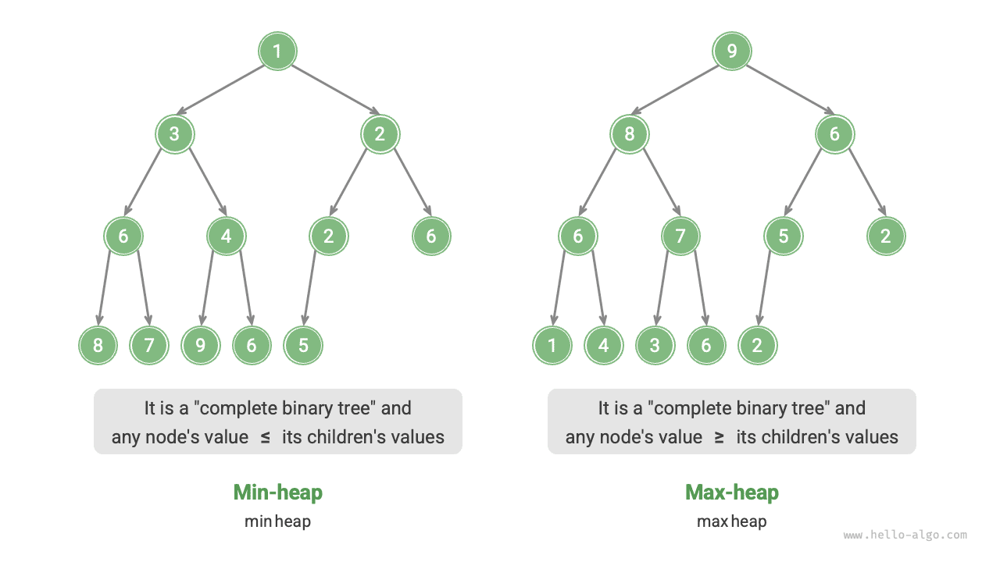
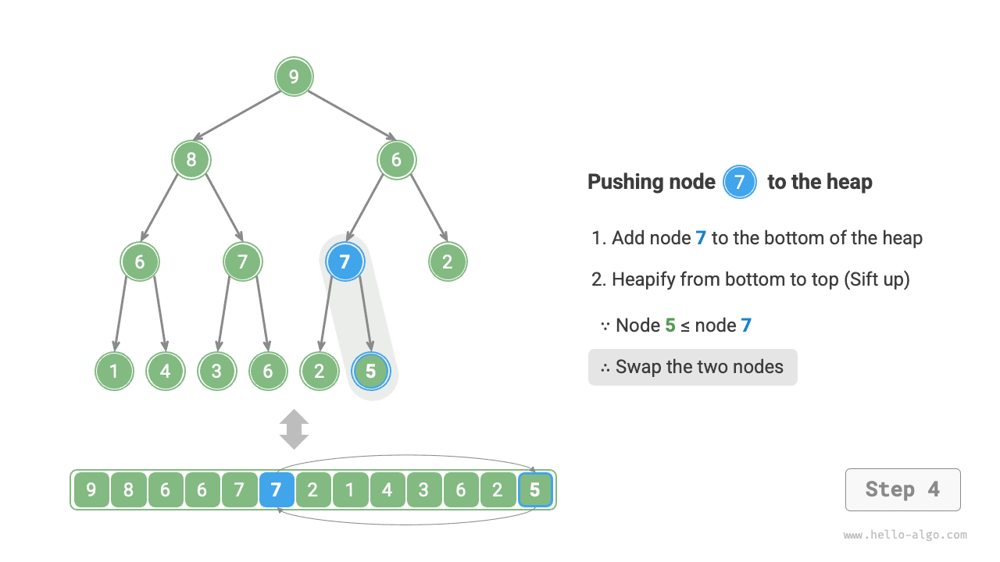
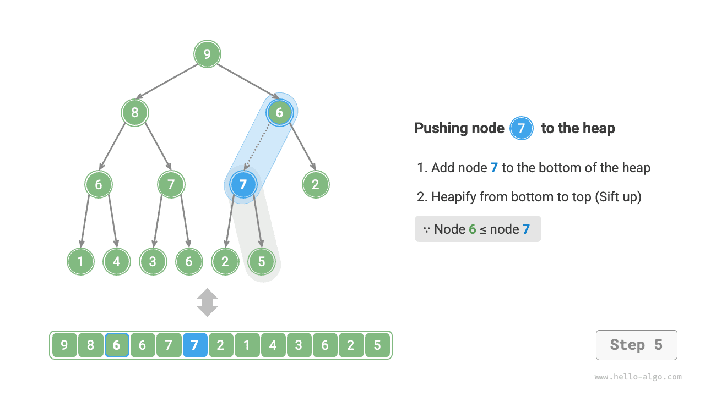
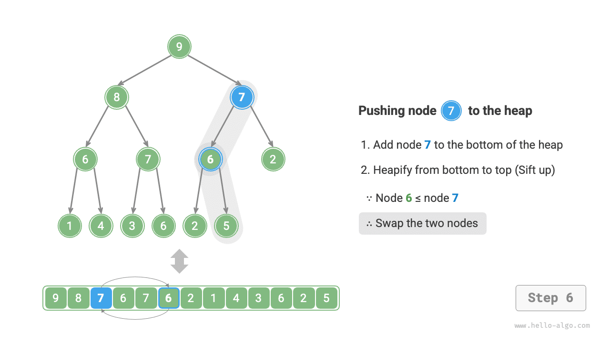
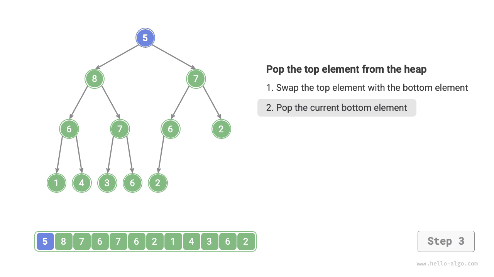
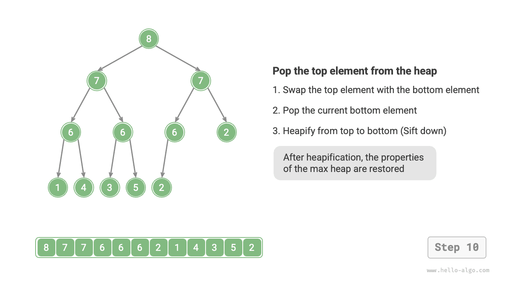

# Đống

<u>heap</u> là một cây nhị phân hoàn chỉnh thỏa mãn các điều kiện cụ thể và có thể được phân loại chủ yếu thành hai loại, như minh họa trong hình bên dưới.

- <u>min heap</u>: Giá trị của bất kỳ nút $\leq$ giá trị của các nút con của nó.
- <u>đống tối đa</u>: Giá trị của bất kỳ nút $\geq$ nào là giá trị của các nút con của nó.



Là trường hợp đặc biệt của cây nhị phân hoàn chỉnh, đống có các đặc điểm sau.

- Các nút lớp dưới cùng được lấp đầy từ trái sang phải và các nút ở các lớp khác được lấp đầy.
- Chúng ta gọi nút gốc của cây nhị phân là "đỉnh đống" và nút dưới cùng bên phải là "đáy đống".
- Đối với heap tối đa (min heaps), giá trị của phần tử đỉnh heap (nút gốc) là lớn nhất (nhỏ nhất).

## Các hoạt động chung của vùng heap

Cần lưu ý rằng nhiều ngôn ngữ lập trình cung cấp <u>hàng đợi ưu tiên</u>, một cấu trúc dữ liệu trừu tượng được xác định là một hàng đợi có các phần tử được sắp xếp theo mức độ ưu tiên.

Trên thực tế, **đống thường được sử dụng để triển khai hàng đợi ưu tiên, với vùng heap tối đa tương ứng với hàng đợi ưu tiên trong đó các phần tử được sắp xếp theo thứ tự giảm dần**. Từ góc độ sử dụng, chúng ta có thể coi "hàng đợi ưu tiên" và "đống" là cấu trúc dữ liệu tương đương. Vì vậy, cuốn sách này không tạo ra sự khác biệt đặc biệt giữa hai loại này và gọi chúng một cách thống nhất là "đống".

Các thao tác heap phổ biến được hiển thị trong bảng bên dưới và tên phương thức cần được xác định dựa trên ngôn ngữ lập trình.

<p align="center"> Table <id> &nbsp; Efficiency of Heap Operations </p>

| Tên phương thức | Mô tả | Độ phức tạp thời gian |
| ----------- | ------------------------------------------------------------------ | --------------- |
| `đẩy()` | Chèn một phần tử vào heap | $O(\log n)$ |
| `pop()` | Loại bỏ phần tử trên cùng của đống | $O(\log n)$ |
| `nhìn trộm()` | Truy cập phần tử trên cùng của vùng heap (giá trị tối đa/tối thiểu cho vùng heap tối đa/phút) | $O(1)$ |
| `kích thước()` | Lấy số phần tử trong heap | $O(1)$ |
| `isEmpty()` | Kiểm tra xem heap có trống không | $O(1)$ |

Trong các ứng dụng thực tế, chúng ta có thể sử dụng trực tiếp lớp heap (hoặc lớp hàng đợi ưu tiên) do các ngôn ngữ lập trình cung cấp.

Tương tự như "thứ tự tăng dần" và "thứ tự giảm dần" trong thuật toán sắp xếp, chúng ta có thể thực hiện chuyển đổi giữa "đống tối thiểu" và "đống tối đa" bằng cách đặt `cờ` hoặc sửa đổi `Bộ so sánh`. Mã này như sau:

=== "Trăn"

    ```python title="heap.py"
    # Initialize a min heap
    min_heap, flag = [], 1
    # Initialize a max heap
    max_heap, flag = [], -1

    # Python's heapq module implements a min heap by default
    # Consider negating elements before pushing them to the heap, which inverts the size relationship and thus implements a max heap
    # In this example, flag = 1 corresponds to a min heap, flag = -1 corresponds to a max heap

    # Push elements into the heap
    heapq.heappush(max_heap, flag * 1)
    heapq.heappush(max_heap, flag * 3)
    heapq.heappush(max_heap, flag * 2)
    heapq.heappush(max_heap, flag * 5)
    heapq.heappush(max_heap, flag * 4)

    # Get the heap top element
    peek: int = flag * max_heap[0] # 5

    # Remove the heap top element
    # The removed elements will form a descending sequence
    val = flag * heapq.heappop(max_heap) # 5
    val = flag * heapq.heappop(max_heap) # 4
    val = flag * heapq.heappop(max_heap) # 3
    val = flag * heapq.heappop(max_heap) # 2
    val = flag * heapq.heappop(max_heap) # 1

    # Get the heap size
    size: int = len(max_heap)

    # Check if the heap is empty
    is_empty: bool = not max_heap

    # Build a heap from an input list
    min_heap: list[int] = [1, 3, 2, 5, 4]
    heapq.heapify(min_heap)
    ```

=== "C++"

    ```cpp title="heap.cpp"
    /* Initialize a heap */
    // Initialize a min heap
    priority_queue<int, vector<int>, greater<int>> minHeap;
    // Initialize a max heap
    priority_queue<int, vector<int>, less<int>> maxHeap;

    /* Push elements into the heap */
    maxHeap.push(1);
    maxHeap.push(3);
    maxHeap.push(2);
    maxHeap.push(5);
    maxHeap.push(4);

    /* Get the heap top element */
    int peek = maxHeap.top(); // 5

    /* Remove the heap top element */
    // The removed elements will form a descending sequence
    maxHeap.pop(); // 5
    maxHeap.pop(); // 4
    maxHeap.pop(); // 3
    maxHeap.pop(); // 2
    maxHeap.pop(); // 1

    /* Get the heap size */
    int size = maxHeap.size();

    /* Check if the heap is empty */
    bool isEmpty = maxHeap.empty();

    /* Build a heap from an input list */
    vector<int> input{1, 3, 2, 5, 4};
    priority_queue<int, vector<int>, greater<int>> minHeap(input.begin(), input.end());
    ```

=== "Java"

    ```java title="heap.java"
    /* Initialize a heap */
    // Initialize a min heap
    Queue<Integer> minHeap = new PriorityQueue<>();
    // Initialize a max heap (use lambda expression to modify Comparator)
    Queue<Integer> maxHeap = new PriorityQueue<>((a, b) -> b - a);

    /* Push elements into the heap */
    maxHeap.offer(1);
    maxHeap.offer(3);
    maxHeap.offer(2);
    maxHeap.offer(5);
    maxHeap.offer(4);

    /* Get the heap top element */
    int peek = maxHeap.peek(); // 5

    /* Remove the heap top element */
    // The removed elements will form a descending sequence
    peek = maxHeap.poll(); // 5
    peek = maxHeap.poll(); // 4
    peek = maxHeap.poll(); // 3
    peek = maxHeap.poll(); // 2
    peek = maxHeap.poll(); // 1

    /* Get the heap size */
    int size = maxHeap.size();

    /* Check if the heap is empty */
    boolean isEmpty = maxHeap.isEmpty();

    /* Build a heap from an input list */
    minHeap = new PriorityQueue<>(Arrays.asList(1, 3, 2, 5, 4));
    ```

=== "C#"

    ```csharp title="heap.cs"
    /* Initialize a heap */
    // Initialize a min heap
    PriorityQueue<int, int> minHeap = new();
    // Initialize a max heap (use lambda expression to modify Comparer)
    PriorityQueue<int, int> maxHeap = new(Comparer<int>.Create((x, y) => y.CompareTo(x)));

    /* Push elements into the heap */
    maxHeap.Enqueue(1, 1);
    maxHeap.Enqueue(3, 3);
    maxHeap.Enqueue(2, 2);
    maxHeap.Enqueue(5, 5);
    maxHeap.Enqueue(4, 4);

    /* Get the heap top element */
    int peek = maxHeap.Peek();//5

    /* Remove the heap top element */
    // The removed elements will form a descending sequence
    peek = maxHeap.Dequeue();  // 5
    peek = maxHeap.Dequeue();  // 4
    peek = maxHeap.Dequeue();  // 3
    peek = maxHeap.Dequeue();  // 2
    peek = maxHeap.Dequeue();  // 1

    /* Get the heap size */
    int size = maxHeap.Count;

    /* Check if the heap is empty */
    bool isEmpty = maxHeap.Count == 0;

    /* Build a heap from an input list */
    minHeap = new PriorityQueue<int, int>([(1, 1), (3, 3), (2, 2), (5, 5), (4, 4)]);
    ```

=== "Đi"

    ```go title="heap.go"
    // In Go, we can construct a max heap of integers by implementing heap.Interface
    // Implementing heap.Interface also requires implementing sort.Interface
    type intHeap []any

    // Push implements the heap.Interface method for pushing an element into the heap
    func (h *intHeap) Push(x any) {
        // Push and Pop use pointer receiver as parameters
        // because they not only adjust the slice contents but also modify the slice length
        *h = append(*h, x.(int))
    }

    // Pop implements the heap.Interface method for popping the heap top element
    func (h *intHeap) Pop() any {
        // The element to be removed is stored at the end
        last := (*h)[len(*h)-1]
        *h = (*h)[:len(*h)-1]
        return last
    }

    // Len is a sort.Interface method
    func (h *intHeap) Len() int {
        return len(*h)
    }

    // Less is a sort.Interface method
    func (h *intHeap) Less(i, j int) bool {
        // To implement a min heap, change this to a less-than sign
        return (*h)[i].(int) > (*h)[j].(int)
    }

    // Swap is a sort.Interface method
    func (h *intHeap) Swap(i, j int) {
        (*h)[i], (*h)[j] = (*h)[j], (*h)[i]
    }

    // Top gets the heap top element
    func (h *intHeap) Top() any {
        return (*h)[0]
    }

    /* Driver Code */
    func TestHeap(t *testing.T) {
        /* Initialize a heap */
        // Initialize a max heap
        maxHeap := &intHeap{}
        heap.Init(maxHeap)
        /* Push elements into the heap */
        // Call heap.Interface methods to add elements
        heap.Push(maxHeap, 1)
        heap.Push(maxHeap, 3)
        heap.Push(maxHeap, 2)
        heap.Push(maxHeap, 4)
        heap.Push(maxHeap, 5)

        /* Get the heap top element */
        top := maxHeap.Top()
        fmt.Printf("Heap top element is %d\n", top)

        /* Remove the heap top element */
        // Call heap.Interface methods to remove elements
        heap.Pop(maxHeap) // 5
        heap.Pop(maxHeap) // 4
        heap.Pop(maxHeap) // 3
        heap.Pop(maxHeap) // 2
        heap.Pop(maxHeap) // 1

        /* Get the heap size */
        size := len(*maxHeap)
        fmt.Printf("Number of heap elements is %d\n", size)

        /* Check if the heap is empty */
        isEmpty := len(*maxHeap) == 0
        fmt.Printf("Is the heap empty? %t\n", isEmpty)
    }
    ```

=== "Nhanh chóng"

    ```swift title="heap.swift"
    /* Initialize a heap */
    // Swift's Heap type supports both max heaps and min heaps, and requires importing swift-collections
    var heap = Heap<Int>()

    /* Push elements into the heap */
    heap.insert(1)
    heap.insert(3)
    heap.insert(2)
    heap.insert(5)
    heap.insert(4)

    /* Get the heap top element */
    var peek = heap.max()!

    /* Remove the heap top element */
    peek = heap.removeMax() // 5
    peek = heap.removeMax() // 4
    peek = heap.removeMax() // 3
    peek = heap.removeMax() // 2
    peek = heap.removeMax() // 1

    /* Get the heap size */
    let size = heap.count

    /* Check if the heap is empty */
    let isEmpty = heap.isEmpty

    /* Build a heap from an input list */
    let heap2 = Heap([1, 3, 2, 5, 4])
    ```

=== "JS"

    ```javascript title="heap.js"
    // JavaScript does not provide a built-in Heap class
    ```

=== "TS"

    ```typescript title="heap.ts"
    // TypeScript does not provide a built-in Heap class
    ```

=== "Phi tiêu"

    ```dart title="heap.dart"
    // Dart does not provide a built-in Heap class
    ```

=== "Rỉ sét"

    ```rust title="heap.rs"
    use std::collections::BinaryHeap;
    use std::cmp::Reverse;

    /* Initialize a heap */
    // Initialize a min heap
    let mut min_heap = BinaryHeap::<Reverse<i32>>::new();
    // Initialize a max heap
    let mut max_heap = BinaryHeap::new();

    /* Push elements into the heap */
    max_heap.push(1);
    max_heap.push(3);
    max_heap.push(2);
    max_heap.push(5);
    max_heap.push(4);

    /* Get the heap top element */
    let peek = max_heap.peek().unwrap();  // 5

    /* Remove the heap top element */
    // The removed elements will form a descending sequence
    let peek = max_heap.pop().unwrap();   // 5
    let peek = max_heap.pop().unwrap();   // 4
    let peek = max_heap.pop().unwrap();   // 3
    let peek = max_heap.pop().unwrap();   // 2
    let peek = max_heap.pop().unwrap();   // 1

    /* Get the heap size */
    let size = max_heap.len();

    /* Check if the heap is empty */
    let is_empty = max_heap.is_empty();

    /* Build a heap from an input list */
    let min_heap = BinaryHeap::from(vec![Reverse(1), Reverse(3), Reverse(2), Reverse(5), Reverse(4)]);
    ```

=== "C"

    ```c title="heap.c"
    // C does not provide a built-in Heap class
    ```

=== "Kotlin"

    ```kotlin title="heap.kt"
    /* Initialize a heap */
    // Initialize a min heap
    var minHeap = PriorityQueue<Int>()
    // Initialize a max heap (use lambda expression to modify Comparator)
    val maxHeap = PriorityQueue { a: Int, b: Int -> b - a }

    /* Push elements into the heap */
    maxHeap.offer(1)
    maxHeap.offer(3)
    maxHeap.offer(2)
    maxHeap.offer(5)
    maxHeap.offer(4)

    /* Get the heap top element */
    var peek = maxHeap.peek() // 5

    /* Remove the heap top element */
    // The removed elements will form a descending sequence
    peek = maxHeap.poll() // 5
    peek = maxHeap.poll() // 4
    peek = maxHeap.poll() // 3
    peek = maxHeap.poll() // 2
    peek = maxHeap.poll() // 1

    /* Get the heap size */
    val size = maxHeap.size

    /* Check if the heap is empty */
    val isEmpty = maxHeap.isEmpty()

    /* Build a heap from an input list */
    minHeap = PriorityQueue(mutableListOf(1, 3, 2, 5, 4))
    ```

=== "Ruby"

    ```ruby title="heap.rb"
    # Ruby does not provide a built-in Heap class
    ```

??? pythontutor "Trực quan hóa mã"

https://pythontutor.com/render.html#code=import%20heapq%0A%0A%22%22%22Driver%20Code%22%22 %22%0Aif%20__name__%20%3D%3D%20%22__main__%22%3A%0A%20%20%20%20%23%20%E5%88%9D%E5%A7%8B%E 5%8C%96%E5%B0%8F%E9%A1%B6%E5%A0%86%0A%20%20%20%20min_heap,%20flag%20%3D%20%5B%5D,%201%0A% 20%20%20%20%23%20%E5%88%9D%E5%A7%8B%E5%8C%96%E5%A4%A7%E9%A1%B6%E5%A0%86%0A%20%20%20%20max _heap,%20flag%20%3D%20%5B%5D,%20-1%0A%20%20%20%20%0A%20%20%20%20%23%20Python%20%E7%9A%84% 20heapq%20%E6%A8%A1%E5%9D%97%E9%BB%98%E8%AE%A4%E5%AE%9E%E7%8E%B0%E5%B0%8F%E9%A1%B6%E5%A0% 86%0A%20%20%20%20%23%20%E8%80%83%E8%99%91%E5%B0%86%E2%80%9C%E5%85%83%E7%B4%A0%E5%8F%96%E8 %B4%9F%E2%80%9D%E5%90%8E%E5%86%8D%E5%85%A5%E5%A0%86%EF%BC%8C%E8%BF%99%E6%A0%B7%E5%B0%B1%E5 %8F%AF%E4%BB%A5%E5%B0%86%E5%A4%A7%E5%B0%8F%E5%85%B3%E7%B3%BB%E9%A2%A0%E5%80%92%EF%BC%8C%E 4%BB%8E%E8%80%8C%E5%AE%9E%E7%8E%B0%E5%A4%A7%E9%A1%B6%E5%A0%86%0A%20%20%20%20%23%20%E5%9C% A8%E6%9C%AC%E7%A4%BA%E4%BE%8B%E4%B8%AD%EF%BC%8Cflag%20%3D%201%20%E6%97%B6%E5%AF%B9%E5%BA% 94%E5%B0%8F%E9%A1%B6%E5%A0%86%EF%BC%8Cflag%20%3D%20-1%20%E6%97%B6%E5%AF%B9%E5%BA%94%E5%A4 %A7%E9%A1%B6%E5%A0%86%0A%20%20%20%20%0A%20%20%20%20%23%20%E5%85%83%E7%B4%A0%E5%85%A5%E5%A 0%86%0A%20%20%20%20heapq.heappush%28max_heap,%20flag%20*%201%29%0A%20%20%20%20heapq.heapp ush%28max_heap,%20flag%20*%203%29%0A%20%20%20%20heapq.heappush%28max_heap,%20flag%20*%202 %29%0A%20%20%20%20heapq.heappush%28max_heap,%20flag%20*%205%29%0A%20%20%20%20heapq.heappus h%28max_heap,%20flag%20*%204%29%0A%20%20%20%20%0A%20%20%20%20%23%20%E8%8E%B7%E5%8F%96%E5% A0%86%E9%A1%B6%E5%85%83%E7%B4%A0%0A%20%20%20%20peek%20%3D%20flag%20*%20max_heap%5B0%5D%20 %23%205%0A%20%20%20%20%0A%20%20%20%20%23%20%E5%A0%86%E9%A1%B6%E5%85%83%E7%B4%A0%E5%87%BA% E5%A0%86%0A%20%20%20%20%23%20%E5%87%BA%E5%A0%86%E5%85%83%E7%B4%A0%E4%BC%9A%E5%BD%A2%E6%88 %90%E4%B8%80%E4%B8%AA%E4%BB%8E%E5%A4%A7%E5%88%B0%E5%B0%8F%E7%9A%84%E5%BA%8F%E5%88%97%0A%2 0%20%20%20val%20%3D%20flag%20*%20heapq.heappop%28max_heap%29%20%23%205%0A%20%20%20%20val% 20%3D%20flag%20*%20heapq.heappop%28max_heap%29%20%23%204%0A%20%20%20%20val%20%3D%20flag%2 0*%20heapq.heappop%28max_heap%29%20%23%203%0A%20%20%20%20val%20%3D%20flag%20*%20heapq.heap pop%28max_heap%29%20%23%202%0A%20%20%20%20val%20%3D%20flag%20*%20heapq.heappop%28max_heap %29%20%23%201%0A%20%20%20%20%0A%20%20%20%20%23%20%E8%8E%B7%E5%8F%96%E5%A0%86%E5%A4%A7%E5% B0%8F%0A%20%20%20%20size%20%3D%20len%28max_heap%29%0A%20%20%20%20%0A%20%20%20%20%23%20%E5 %88%A4%E6%96%AD%E5%A0%86%E6%98%AF%E5%90%A6%E4%B8%BA%E7%A9%BA%0A%20%20%20%20is_empty%20%3D %20not%20max_heap%0A%20%20%20%20%0A%20%20%20%20%23%20%E8%BE%93%E5%85%A5%E5%88%97%E8%A1%A8 %E5%B9%B6%E5%BB%BA%E5%A0%86%0A%20%20%20%20min_heap%20%3D%20%5B1,%203,%202,%205,%204%5D%0A %20%20%20%20heapq.heapify%28min_heap%29&cumulative=false&curInstr=3&heapPrimitives=nvernest&mode=display&origin=opt-frontend.js&py=311&rawInputLstJSON=%5B%5D&textReferences=false

## Triển khai Heap

Việc triển khai sau đây dành cho vùng heap tối đa. Để chuyển đổi nó thành vùng nhớ tối thiểu, chỉ cần đảo ngược tất cả logic so sánh liên quan đến thứ tự (ví dụ: thay thế $\geq$ bằng $\leq$). Độc giả quan tâm được khuyến khích tự thực hiện điều này.

### Lưu trữ và biểu diễn Heap

Như đã đề cập trong chương "Cây nhị phân", cây nhị phân hoàn chỉnh rất phù hợp để biểu diễn mảng. Vì vùng heap là một loại cây nhị phân hoàn chỉnh nên **chúng ta sẽ sử dụng mảng để lưu trữ vùng heap**.

Khi biểu diễn cây nhị phân bằng một mảng, các phần tử biểu thị giá trị nút và chỉ mục biểu thị vị trí nút trong cây nhị phân. **Mối quan hệ cha-con được thể hiện thông qua các công thức ánh xạ chỉ mục**.

Như được hiển thị trong hình bên dưới, với chỉ số $i$, chỉ số của con trái của nó là $2i + 1$, chỉ số của con bên phải của nó là $2i + 2$, và chỉ số của cha mẹ nó là $(i - 1) / 2$ (chia tầng). Khi một chỉ mục nằm ngoài giới hạn, nó cho biết nút rỗng hoặc nút đó không tồn tại.


Chúng ta có thể gói gọn công thức ánh xạ chỉ mục thành các hàm để thuận tiện cho việc sử dụng sau này:

=== "Python"
    ```python title="my_heap.py"
    # Heapify all nodes except leaf nodes
            for i in range(self.parent(self.size() - 1), -1, -1):
                self.sift_down(i)
    ```
=== "C++"
    ```cpp title="my_heap.cpp"
    int parent(int i) {
            return (i - 1) / 2; // Floor division
        }
    ```
=== "Java"
    ```java title="my_heap.java"
    // Heapify all nodes except leaf nodes
            for (int i = parent(size() - 1); i >= 0; i--) {
                siftDown(i);
            }
    ```
=== "C#"
    ```csharp title="my_heap.cs"
    // Heapify all nodes except leaf nodes
            var size = Parent(this.Size() - 1);
            for (int i = size; i >= 0; i--) {
                SiftDown(i);
            }
    ```
=== "Go"
    ```go title="my_heap.go"
    for i := h.parent(len(h.data) - 1); i >= 0; i-- {
    		// Heapify all nodes except leaf nodes
    		h.siftDown(i)
    	}
    ```
=== "Swift"
    ```swift title="my_heap.swift"
    // Heapify all nodes except leaf nodes
            for i in (0 ... parent(i: size() - 1)).reversed() {
                siftDown(i: i)
            }
    ```
=== "JS"
    ```javascript title="my_heap.js"
    // Heapify all nodes except leaf nodes
            for (let i = this.#parent(this.size() - 1); i >= 0; i--) {
                this.#siftDown(i);
            }
    ```
=== "TS"
    ```typescript title="my_heap.ts"
    // Heapify all nodes except leaf nodes
            for (let i = this.parent(this.size() - 1); i >= 0; i--) {
                this.siftDown(i);
            }
    ```
=== "Dart"
    ```dart title="my_heap.dart"
    // Heapify all nodes except leaf nodes
        for (int i = _parent(size() - 1); i >= 0; i--) {
          siftDown(i);
        }
    ```
=== "Rust"
    ```rust title="my_heap.rs"
    // Heapify all nodes except leaf nodes
            for i in (0..=Self::parent(heap.size() - 1)).rev() {
                heap.sift_down(i);
            }
    ```
=== "C"
    ```c title="my_heap.c"
    int parent(MaxHeap *maxHeap, int i);
    
    /* Constructor, build heap from slice */
    MaxHeap *newMaxHeap(int nums[], int size) {
        // Push all elements to heap
        MaxHeap *maxHeap = (MaxHeap *)malloc(sizeof(MaxHeap));
        maxHeap->size = size;
        memcpy(maxHeap->data, nums, size * sizeof(int));
        for (int i = parent(maxHeap, size - 1); i >= 0; i--) {
            // Heapify all nodes except leaf nodes
            siftDown(maxHeap, i);
        }
        return maxHeap;
    }
    ```
=== "Kotlin"
    ```kotlin title="my_heap.kt"
    // Heapify all nodes except leaf nodes
            for (i in parent(size() - 1) downTo 0) {
                siftDown(i)
            }
    ```
=== "Ruby"
    ```ruby title="my_heap.rb"
    # Add list elements to heap as is
        @max_heap = nums
        # Heapify all nodes except leaf nodes
        parent(size - 1).downto(0) do |i|
          sift_down(i)
    ```


### Truy cập phần tử hàng đầu của Heap

Phần tử trên cùng của heap là nút gốc của cây nhị phân, cũng là phần tử đầu tiên của danh sách:

=== "Python"
    ```python title="my_heap.py"
    def peek(self) -> int:
            """Access top element"""
            return self.max_heap[0]
    ```
=== "C++"
    ```cpp title="my_heap.cpp"
    int peek() {
            return maxHeap[0];
        }
    ```
=== "Java"
    ```java title="my_heap.java"
    public int peek() {
            return maxHeap.get(0);
        }
    ```
=== "C#"
    ```csharp title="my_heap.cs"
    public int Peek() {
            return maxHeap[0];
        }
    ```
=== "Go"
    ```go title="my_heap.go"
    func (h *maxHeap) peek() any {
    	return h.data[0]
    }
    ```
=== "Swift"
    ```swift title="my_heap.swift"
    func peek() -> Int {
            maxHeap[0]
        }
    ```
=== "JS"
    ```javascript title="my_heap.js"
    peek() {
            return this.#maxHeap[0];
        }
    ```
=== "TS"
    ```typescript title="my_heap.ts"
    public peek(): number {
            return this.maxHeap[0];
        }
    ```
=== "Dart"
    ```dart title="my_heap.dart"
    int peek() {
        return _maxHeap[0];
      }
    ```
=== "Rust"
    ```rust title="my_heap.rs"
    fn peek(&self) -> Option<i32> {
            self.max_heap.first().copied()
        }
    ```
=== "C"
    ```c title="my_heap.c"
    int peek(MaxHeap *maxHeap) {
        return maxHeap->data[0];
    }
    ```
=== "Kotlin"
    ```kotlin title="my_heap.kt"
    fun peek(): Int {
            return maxHeap[0]
        }
    ```
=== "Ruby"
    ```ruby title="my_heap.rb"
    ### Access heap top element ###
      def peek
        @max_heap[0]
    ```


### Chèn một phần tử vào Heap

Cho một phần tử `val`, trước tiên chúng ta thêm nó vào cuối heap. Sau khi chèn, vì `val` có thể lớn hơn các phần tử khác trong heap nên thuộc tính heap có thể bị vi phạm. **Vì vậy, chúng ta cần khôi phục thuộc tính heap dọc theo đường dẫn từ nút được chèn đến nút gốc**. Thao tác này được gọi là <u>heapify</u>.

Bắt đầu từ nút được chèn, **thực hiện heapify từ dưới lên trên**. Như được hiển thị trong hình bên dưới, chúng tôi so sánh nút được chèn với nút mẹ của nó và nếu nút được chèn lớn hơn, chúng tôi sẽ hoán đổi chúng. Chúng tôi tiếp tục quá trình này từ dưới lên trên cho đến khi chúng tôi di chuyển qua gốc hoặc đến một nút không cần phải hoán đổi nữa.

=== "<1>"
    

=== "<2>"
    

=== "<3>"
    

=== "<4>"
    

=== "<5>"
    

=== "<6>"
    

=== "<7>"
    

=== "<8>"
    

=== "<9>"
    

Với tổng số nút $n$, chiều cao của cây là $O(\log n)$. Do đó, số lần lặp vòng lặp trong thao tác heapify nhiều nhất là $O(\log n)$, **làm cho thao tác chèn phần tử trở nên phức tạp $O(\log n)$**. Mã này như sau:

=== "Python"
    ```python title="my_heap.py"
    # Heapify from bottom to top
            self.sift_up(self.size() - 1)
    ```
=== "C++"
    ```cpp title="my_heap.cpp"
    void siftUp(int i) {
            while (true) {
                // Get parent node of node i
                int p = parent(i);
                // When "crossing root node" or "node needs no repair", end heapify
                if (p < 0 || maxHeap[i] <= maxHeap[p])
                    break;
                // Swap two nodes
                swap(maxHeap[i], maxHeap[p]);
                // Loop upward heapify
                i = p;
            }
        }
    ```
=== "Java"
    ```java title="my_heap.java"
    // Heapify from bottom to top
            siftUp(size() - 1);
        }
    
        /* Starting from node i, heapify from bottom to top */
        private void siftUp(int i) {
    ```
=== "C#"
    ```csharp title="my_heap.cs"
    // Heapify from bottom to top
            SiftUp(Size() - 1);
        }
    
        /* Get heap size */
        public int Size() {
    ```
=== "Go"
    ```go title="my_heap.go"
    // Heapify from bottom to top
    	h.siftUp(len(h.data) - 1)
    }
    
    /* Starting from node i, heapify from bottom to top */
    func (h *maxHeap) siftUp(i int) {
    ```
=== "Swift"
    ```swift title="my_heap.swift"
    // Heapify from bottom to top
            siftUp(i: size() - 1)
        }
    
        /* Starting from node i, heapify from bottom to top */
        private func siftUp(i: Int) {
    ```
=== "JS"
    ```javascript title="my_heap.js"
    // Heapify from bottom to top
            this.#siftUp(this.size() - 1);
        }
    
        /* Starting from node i, heapify from bottom to top */
        #siftUp(i) {
    ```
=== "TS"
    ```typescript title="my_heap.ts"
    // Heapify from bottom to top
            this.siftUp(this.size() - 1);
        }
    
        /* Starting from node i, heapify from bottom to top */
        private siftUp(i: number): void {
    ```
=== "Dart"
    ```dart title="my_heap.dart"
    // Heapify from bottom to top
        siftUp(size() - 1);
      }
    
      /* Starting from node i, heapify from bottom to top */
      void siftUp(int i) {
    ```
=== "Rust"
    ```rust title="my_heap.rs"
    // Heapify from bottom to top
            self.sift_up(self.size() - 1);
        }
    
        /* Starting from node i, heapify from bottom to top */
        fn sift_up(&mut self, mut i: usize) {
    ```
=== "C"
    ```c title="my_heap.c"
    void siftUp(MaxHeap *maxHeap, int i);
    int parent(MaxHeap *maxHeap, int i);
    
    /* Constructor, build heap from slice */
    MaxHeap *newMaxHeap(int nums[], int size) {
        // Push all elements to heap
        MaxHeap *maxHeap = (MaxHeap *)malloc(sizeof(MaxHeap));
        maxHeap->size = size;
        memcpy(maxHeap->data, nums, size * sizeof(int));
        for (int i = parent(maxHeap, size - 1); i >= 0; i--) {
            // Heapify all nodes except leaf nodes
            siftDown(maxHeap, i);
        }
        return maxHeap;
    }
    ```
=== "Kotlin"
    ```kotlin title="my_heap.kt"
    // Heapify from bottom to top
            siftUp(size() - 1)
        }
    
        /* Starting from node i, heapify from bottom to top */
        private fun siftUp(it: Int) {
    ```
=== "Ruby"
    ```ruby title="my_heap.rb"
    # Add node
        @max_heap << val
        # Heapify from bottom to top
        sift_up(size - 1)
    ```


### Xóa phần tử trên cùng của Heap

Phần tử trên cùng của heap là nút gốc của cây nhị phân, là phần tử đầu tiên của danh sách. Nếu chúng ta loại bỏ trực tiếp phần tử đầu tiên khỏi danh sách, tất cả các chỉ mục nút trong cây nhị phân sẽ thay đổi, khiến việc sửa chữa sau đó với heapify trở nên khó khăn. Để giảm thiểu những thay đổi trong chỉ mục phần tử, chúng tôi sử dụng các bước sau.

1. Hoán đổi phần tử trên cùng của heap với phần tử dưới cùng của heap (hoán đổi nút gốc với nút lá ngoài cùng bên phải).
2. Sau khi hoán đổi, hãy xóa phần dưới cùng của vùng heap khỏi danh sách (lưu ý rằng vì chúng ta đã hoán đổi nên thực tế là chúng ta đang xóa phần tử trên cùng của vùng heap ban đầu).
3. Bắt đầu từ nút gốc, **thực hiện heapify từ trên xuống dưới**.

Như được hiển thị trong hình bên dưới, **hướng của "heapify từ trên xuống dưới" ngược lại với "heapify từ dưới lên trên"**. Chúng tôi so sánh giá trị của nút gốc với hai nút con của nó và hoán đổi nó với nút con lớn nhất. Sau đó lặp lại thao tác này cho đến khi chúng ta vượt qua một nút lá hoặc gặp một nút không cần hoán đổi.

=== "<1>"
    

=== "<2>"
    

=== "<3>"
    

=== "<4>"
    

=== "<5>"
    

=== "<6>"
    

=== "<7>"
    

=== "<8>"
    

=== "<9>"
    

=== "<10>"
    

Tương tự như thao tác chèn phần tử, độ phức tạp về thời gian của thao tác loại bỏ phần tử trên cùng của heap cũng là $O(\log n)$. Mã này như sau:

=== "Python"
    ```python title="my_heap.py"
    self.sift_down(i)
    ```
=== "C++"
    ```cpp title="my_heap.cpp"
    void siftDown(int i) {
            while (true) {
                // If node i is largest or indices l, r are out of bounds, no need to continue heapify, break
                int l = left(i), r = right(i), ma = i;
                if (l < size() && maxHeap[l] > maxHeap[ma])
                    ma = l;
                if (r < size() && maxHeap[r] > maxHeap[ma])
                    ma = r;
                // Swap two nodes
                if (ma == i)
                    break;
                swap(maxHeap[i], maxHeap[ma]);
                // Loop downwards heapification
                i = ma;
            }
        }
    ```
=== "Java"
    ```java title="my_heap.java"
    siftDown(i);
            }
        }
    
        /* Get index of left child node */
        private int left(int i) {
    ```
=== "C#"
    ```csharp title="my_heap.cs"
    SiftDown(i);
            }
        }
    
        /* Get index of left child node */
        int Left(int i) {
    ```
=== "Go"
    ```go title="my_heap.go"
    // Heapify all nodes except leaf nodes
    		h.siftDown(i)
    	}
    	return h
    }
    
    /* Get index of left child node */
    func (h *maxHeap) left(i int) int {
    ```
=== "Swift"
    ```swift title="my_heap.swift"
    siftDown(i: i)
            }
        }
    
        /* Get index of left child node */
        private func left(i: Int) -> Int {
    ```
=== "JS"
    ```javascript title="my_heap.js"
    this.#siftDown(i);
            }
        }
    
        /* Get index of left child node */
        #left(i) {
    ```
=== "TS"
    ```typescript title="my_heap.ts"
    this.siftDown(i);
            }
        }
    
        /* Get index of left child node */
        private left(i: number): number {
    ```
=== "Dart"
    ```dart title="my_heap.dart"
    siftDown(i);
        }
      }
    
      /* Get index of left child node */
      int _left(int i) {
    ```
=== "Rust"
    ```rust title="my_heap.rs"
    heap.sift_down(i);
            }
            heap
        }
    
        /* Get index of left child node */
        fn left(i: usize) -> usize {
    ```
=== "C"
    ```c title="my_heap.c"
    // Function declaration
    void siftDown(MaxHeap *maxHeap, int i);
    void siftUp(MaxHeap *maxHeap, int i);
    int parent(MaxHeap *maxHeap, int i);
    
    /* Constructor, build heap from slice */
    MaxHeap *newMaxHeap(int nums[], int size) {
        // Push all elements to heap
        MaxHeap *maxHeap = (MaxHeap *)malloc(sizeof(MaxHeap));
        maxHeap->size = size;
        memcpy(maxHeap->data, nums, size * sizeof(int));
        for (int i = parent(maxHeap, size - 1); i >= 0; i--) {
            // Heapify all nodes except leaf nodes
            siftDown(maxHeap, i);
        }
        return maxHeap;
    }
    ```
=== "Kotlin"
    ```kotlin title="my_heap.kt"
    siftDown(i)
            }
        }
    
        /* Get index of left child node */
        private fun left(i: Int): Int {
    ```
=== "Ruby"
    ```ruby title="my_heap.rb"
    sift_down(i)
    ```


## Ứng dụng phổ biến của Heap

- **Hàng đợi ưu tiên**: Heap thường là cấu trúc dữ liệu ưa thích để triển khai hàng đợi ưu tiên. Độ phức tạp về thời gian của cả hoạt động enqueue và dequeue là $O(\log n)$ và việc xây dựng heap có độ phức tạp về thời gian là $O(n)$, làm cho các hoạt động này có hiệu quả cao.
- **Sắp xếp vùng heap**: Cho một tập dữ liệu, chúng ta có thể tạo một vùng heap với chúng và sau đó liên tục thực hiện các thao tác loại bỏ phần tử để thu được dữ liệu đã được sắp xếp. Tuy nhiên, chúng ta thường sử dụng một cách tiếp cận tinh tế hơn để triển khai sắp xếp vùng heap, như được trình bày chi tiết trong chương "Sắp xếp vùng heap".
- **Lấy phần tử $k$ lớn nhất**: Đây là một bài toán thuật toán cổ điển và cũng là một ứng dụng điển hình, chẳng hạn như chọn ra 10 mục tin tức thịnh hành nhất cho Tìm kiếm Nóng trên Weibo hoặc top 10 sản phẩm bán chạy nhất.
