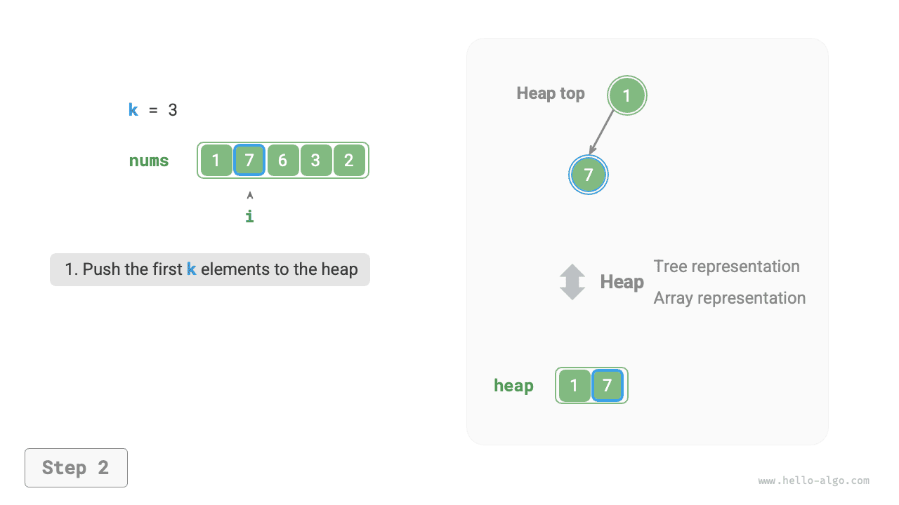
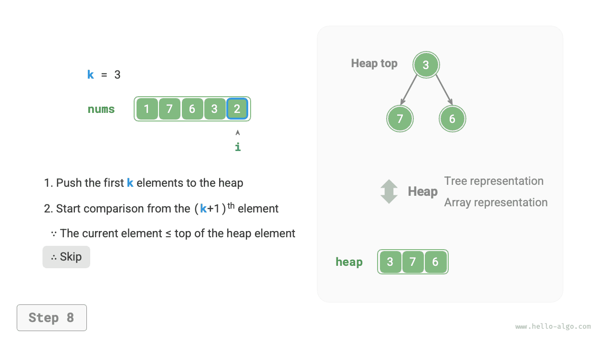
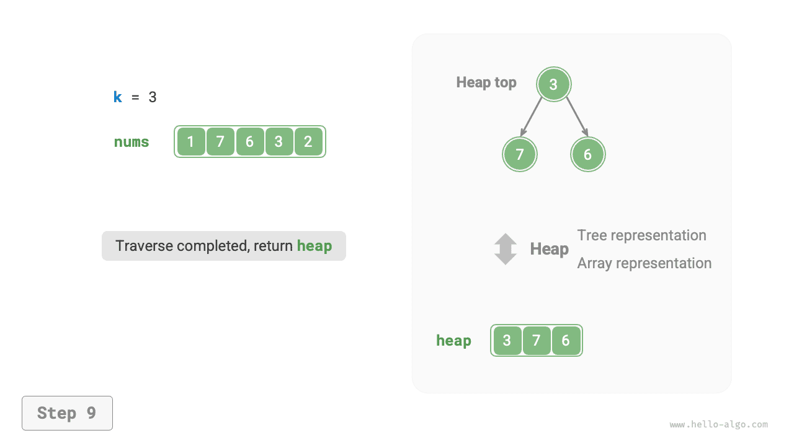

# Vấn đề Top-k

!!! câu hỏi

Cho một mảng không có thứ tự `nums` có độ dài $n$, trả về các phần tử $k$ lớn nhất trong mảng.

Đối với vấn đề này, trước tiên chúng tôi sẽ giới thiệu hai giải pháp tương đối đơn giản, tiếp theo là giải pháp dựa trên heap hiệu quả hơn.

## Cách 1: Lựa chọn lặp lại

Chúng ta có thể thực hiện các vòng duyệt $k$ như trong hình bên dưới, trích xuất các phần tử lớn nhất $1^{st}$, $2^{nd}$, $\dots$, $k^{th}$ trong mỗi vòng, với độ phức tạp về thời gian là $O(nk)$.

Phương pháp này chỉ phù hợp khi $k \ll n$, vì khi $k$ gần với $n$, độ phức tạp về thời gian tiến gần đến $O(n^2)$, khiến nó rất kém hiệu quả.


!!! mẹo

Khi $k = n$, chúng ta có thể thu được một chuỗi được sắp xếp hoàn chỉnh, tương đương với thuật toán "sắp xếp chọn".

## Cách 2: Sắp xếp

Như được hiển thị trong hình bên dưới, trước tiên chúng ta có thể sắp xếp mảng `nums`, sau đó trả về các phần tử $k$ ngoài cùng bên phải, với độ phức tạp về thời gian là $O(n \log n)$.

Rõ ràng, phương pháp này hiệu quả hơn mức cần thiết, vì chúng ta chỉ cần tìm các phần tử $k$ lớn nhất thay vì sắp xếp các phần tử khác.


## Cách 3: Đống

Chúng ta có thể giải quyết vấn đề Top-k hiệu quả hơn bằng heap, như minh họa trong hình bên dưới.

1. Khởi tạo một vùng heap tối thiểu, trong đó phần tử trên cùng của vùng heap là nhỏ nhất.
2. Đầu tiên, chèn các phần tử $k$ đầu tiên của mảng vào heap theo thứ tự.
3. Bắt đầu từ phần tử $(k + 1)^{th}$, nếu phần tử hiện tại lớn hơn phần tử trên cùng của heap, hãy loại bỏ phần tử trên cùng của heap và chèn phần tử hiện tại vào heap.
4. Sau khi quá trình duyệt hoàn tất, heap chứa các phần tử $k$ lớn nhất.

=== "<1>"
    

=== "<2>"
    

=== "<3>"
    

=== "<4>"
    

=== "<5>"
    

=== "<6>"
    

=== "<7>"
    

=== "<8>"
    

=== "<9>"
    

Mã ví dụ như sau:

=== "Python"
    ```python title="top_k.py"
    def top_k_heap(nums: list[int], k: int) -> list[int]:
        """Find the largest k elements in array based on heap"""
        # Initialize min heap
        heap = []
        # Enter the first k elements of array into heap
        for i in range(k):
            heapq.heappush(heap, nums[i])
        # Starting from the (k+1)th element, maintain heap length as k
        for i in range(k, len(nums)):
            # If current element is greater than top element, top element exits heap, current element enters heap
            if nums[i] > heap[0]:
                heapq.heappop(heap)
                heapq.heappush(heap, nums[i])
        return heap
    ```
=== "C++"
    ```cpp title="top_k.cpp"
    priority_queue<int, vector<int>, greater<int>> topKHeap(vector<int> &nums, int k) {
        // Python's heapq module implements min heap by default
        priority_queue<int, vector<int>, greater<int>> heap;
        // Enter the first k elements of array into heap
        for (int i = 0; i < k; i++) {
            heap.push(nums[i]);
        }
        // Starting from the (k+1)th element, maintain heap length as k
        for (int i = k; i < nums.size(); i++) {
            // If current element is greater than top element, top element exits heap, current element enters heap
            if (nums[i] > heap.top()) {
                heap.pop();
                heap.push(nums[i]);
            }
        }
        return heap;
    }
    ```
=== "Java"
    ```java title="top_k.java"
    static Queue<Integer> topKHeap(int[] nums, int k) {
            // Python's heapq module implements min heap by default
            Queue<Integer> heap = new PriorityQueue<Integer>();
            // Enter the first k elements of array into heap
            for (int i = 0; i < k; i++) {
                heap.offer(nums[i]);
            }
            // Starting from the (k+1)th element, maintain heap length as k
            for (int i = k; i < nums.length; i++) {
                // If current element is greater than top element, top element exits heap, current element enters heap
                if (nums[i] > heap.peek()) {
                    heap.poll();
                    heap.offer(nums[i]);
                }
            }
            return heap;
        }
    ```
=== "C#"
    ```csharp title="top_k.cs"
    PriorityQueue<int, int> TopKHeap(int[] nums, int k) {
            // Python's heapq module implements min heap by default
            PriorityQueue<int, int> heap = new();
            // Enter the first k elements of array into heap
            for (int i = 0; i < k; i++) {
                heap.Enqueue(nums[i], nums[i]);
            }
            // Starting from the (k+1)th element, maintain heap length as k
            for (int i = k; i < nums.Length; i++) {
                // If current element is greater than top element, top element exits heap, current element enters heap
                if (nums[i] > heap.Peek()) {
                    heap.Dequeue();
                    heap.Enqueue(nums[i], nums[i]);
                }
            }
            return heap;
        }
    ```
=== "Go"
    ```go title="top_k.go"
    func topKHeap(nums []int, k int) *minHeap {
    	// Python's heapq module implements min heap by default
    	h := &minHeap{}
    	heap.Init(h)
    	// Enter the first k elements of array into heap
    	for i := 0; i < k; i++ {
    		heap.Push(h, nums[i])
    	}
    	// Starting from the (k+1)th element, maintain heap length as k
    	for i := k; i < len(nums); i++ {
    		// If current element is greater than top element, top element exits heap, current element enters heap
    		if nums[i] > h.Top().(int) {
    			heap.Pop(h)
    			heap.Push(h, nums[i])
    		}
    	}
    	return h
    }
    ```
=== "Swift"
    ```swift title="top_k.swift"
    func topKHeap(nums: [Int], k: Int) -> [Int] {
        // Initialize min heap and build heap with first k elements
        var heap = Heap(nums.prefix(k))
        // Starting from the (k+1)th element, maintain heap length as k
        for i in nums.indices.dropFirst(k) {
            // If current element is greater than top element, top element exits heap, current element enters heap
            if nums[i] > heap.min()! {
                _ = heap.removeMin()
                heap.insert(nums[i])
            }
        }
        return heap.unordered
    }
    ```
=== "JS"
    ```javascript title="top_k.js"
    function topKHeap(nums, k) {
        // Python's heapq module implements min heap by default
        // Note: We negate all heap elements to simulate min heap using max heap
        const maxHeap = new MaxHeap([]);
        // Enter the first k elements of array into heap
        for (let i = 0; i < k; i++) {
            pushMinHeap(maxHeap, nums[i]);
        }
        // Starting from the (k+1)th element, maintain heap length as k
        for (let i = k; i < nums.length; i++) {
            // If current element is greater than top element, top element exits heap, current element enters heap
            if (nums[i] > peekMinHeap(maxHeap)) {
                popMinHeap(maxHeap);
                pushMinHeap(maxHeap, nums[i]);
            }
        }
        // Return elements in heap
        return getMinHeap(maxHeap);
    }
    ```
=== "TS"
    ```typescript title="top_k.ts"
    function topKHeap(nums: number[], k: number): number[] {
        // Python's heapq module implements min heap by default
        // Note: We negate all heap elements to simulate min heap using max heap
        const maxHeap = new MaxHeap([]);
        // Enter the first k elements of array into heap
        for (let i = 0; i < k; i++) {
            pushMinHeap(maxHeap, nums[i]);
        }
        // Starting from the (k+1)th element, maintain heap length as k
        for (let i = k; i < nums.length; i++) {
            // If current element is greater than top element, top element exits heap, current element enters heap
            if (nums[i] > peekMinHeap(maxHeap)) {
                popMinHeap(maxHeap);
                pushMinHeap(maxHeap, nums[i]);
            }
        }
        // Return elements in heap
        return getMinHeap(maxHeap);
    }
    ```
=== "Dart"
    ```dart title="top_k.dart"
    MinHeap topKHeap(List<int> nums, int k) {
      // Initialize min heap, push first k elements of array to heap
      MinHeap heap = MinHeap(nums.sublist(0, k));
      // Starting from the (k+1)th element, maintain heap length as k
      for (int i = k; i < nums.length; i++) {
        // If current element is greater than top element, top element exits heap, current element enters heap
        if (nums[i] > heap.peek()) {
          heap.pop();
          heap.push(nums[i]);
        }
      }
      return heap;
    }
    ```
=== "Rust"
    ```rust title="top_k.rs"
    fn top_k_heap(nums: Vec<i32>, k: usize) -> BinaryHeap<Reverse<i32>> {
        // BinaryHeap is a max heap, use Reverse to negate elements to implement min heap
        let mut heap = BinaryHeap::<Reverse<i32>>::new();
        // Enter the first k elements of array into heap
        for &num in nums.iter().take(k) {
            heap.push(Reverse(num));
        }
        // Starting from the (k+1)th element, maintain heap length as k
        for &num in nums.iter().skip(k) {
            // If current element is greater than top element, top element exits heap, current element enters heap
            if num > heap.peek().unwrap().0 {
                heap.pop();
                heap.push(Reverse(num));
            }
        }
        heap
    }
    ```
=== "C"
    ```c title="top_k.c"
    // Function to find k largest elements in array using heap
    int *topKHeap(int *nums, int sizeNums, int k) {
        // Python's heapq module implements min heap by default
        // Note: We negate all heap elements to simulate min heap using max heap
        int *empty = (int *)malloc(0);
        MaxHeap *maxHeap = newMaxHeap(empty, 0);
        // Enter the first k elements of array into heap
        for (int i = 0; i < k; i++) {
            pushMinHeap(maxHeap, nums[i]);
        }
        // Starting from the (k+1)th element, maintain heap length as k
        for (int i = k; i < sizeNums; i++) {
            // If current element is greater than top element, top element exits heap, current element enters heap
            if (nums[i] > peekMinHeap(maxHeap)) {
                popMinHeap(maxHeap);
                pushMinHeap(maxHeap, nums[i]);
            }
        }
        int *res = getMinHeap(maxHeap);
        // Free memory
        delMaxHeap(maxHeap);
        return res;
    }
    ```
=== "Kotlin"
    ```kotlin title="top_k.kt"
    fun topKHeap(nums: IntArray, k: Int): Queue<Int> {
        // Python's heapq module implements min heap by default
        val heap = PriorityQueue<Int>()
        // Enter the first k elements of array into heap
        for (i in 0..<k) {
            heap.offer(nums[i])
        }
        // Starting from the (k+1)th element, maintain heap length as k
        for (i in k..<nums.size) {
            // If current element is greater than top element, top element exits heap, current element enters heap
            if (nums[i] > heap.peek()) {
                heap.poll()
                heap.offer(nums[i])
            }
        }
        return heap
    }
    ```
=== "Ruby"
    ```ruby title="top_k.rb"
    ### Find largest k elements in array using heap ###
    def top_k_heap(nums, k)
      # Python's heapq module implements min heap by default
      # Note: We negate all heap elements to simulate min heap using max heap
      max_heap = MaxHeap.new([])
    
      # Enter the first k elements of array into heap
      for i in 0...k
        push_min_heap(max_heap, nums[i])
      end
    
      # Starting from the (k+1)th element, maintain heap length as k
      for i in k...nums.length
        # If current element is greater than top element, top element exits heap, current element enters heap
        if nums[i] > peek_min_heap(max_heap)
          pop_min_heap(max_heap)
          push_min_heap(max_heap, nums[i])
        end
      end
    
      get_min_heap(max_heap)
    ```


Tổng cộng $n$ vòng chèn và xóa vùng nhớ heap được thực hiện, với độ dài tối đa của vùng nhớ heap là $k$, do đó độ phức tạp về thời gian là $O(n \log k)$. Phương pháp này rất hiệu quả; khi $k$ nhỏ, độ phức tạp về thời gian tiến tới $O(n)$; khi $k$ lớn, độ phức tạp về thời gian không vượt quá $O(n \log n)$.

Ngoài ra, phương pháp này rất phù hợp với luồng dữ liệu động. Khi có dữ liệu mới, chúng tôi có thể liên tục duy trì các phần tử trong vùng heap, cho phép cập nhật động các phần tử $k$ lớn nhất.
