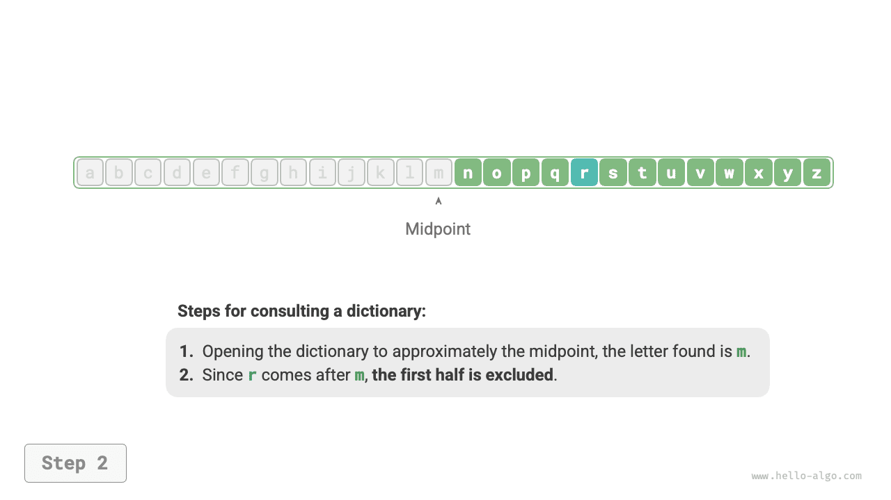
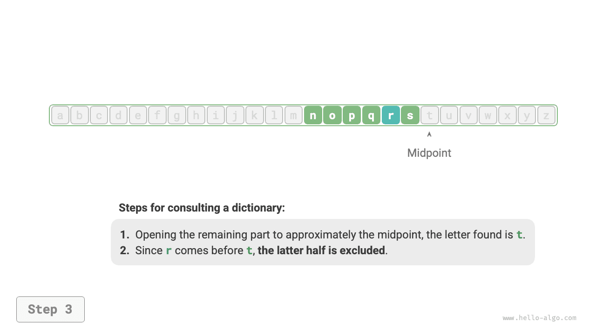
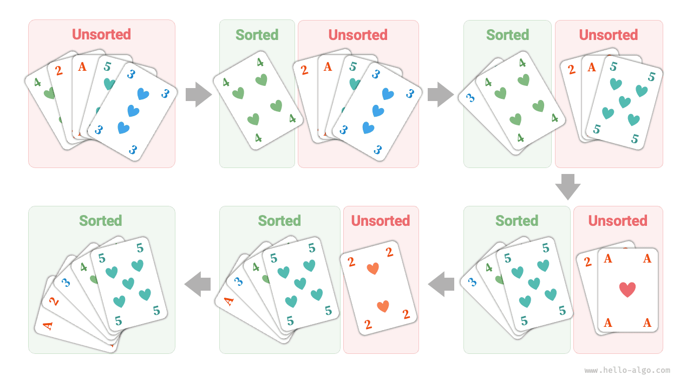

# Thuật toán ở mọi nơi

Khi chúng ta nghe đến thuật ngữ “thuật toán”, chúng ta tự nhiên nghĩ đến toán học. Tuy nhiên, nhiều thuật toán không liên quan đến toán học phức tạp mà dựa nhiều hơn vào logic cơ bản, có thể thấy ở mọi nơi trong cuộc sống hàng ngày của chúng ta.

Trước khi chúng ta chính thức khám phá các thuật toán, đây là một sự thật thú vị đáng được chia sẻ: **bạn đã học được nhiều thuật toán mà không nhận ra và bạn đã quen với việc áp dụng chúng trong cuộc sống hàng ngày**. Hãy để tôi đưa ra một vài ví dụ cụ thể để minh họa điểm này.

**Ví dụ 1: Tra cứu từ điển**. Trong từ điển tiếng Anh, các từ được liệt kê theo thứ tự abc. Giả sử chúng ta đang tìm kiếm một từ bắt đầu bằng chữ cái $r$, việc này thường được thực hiện theo cách sau:

1. Mở từ điển ra khoảng nửa chừng và kiểm tra từ đầu tiên trên trang đó; giả sử nó bắt đầu bằng chữ cái $m$.
2. Vì $r$ ​​đứng sau $m$ trong bảng chữ cái, nên nửa đầu có thể bị bỏ qua và không gian tìm kiếm được thu hẹp xuống nửa sau.
3. Lặp lại các bước `1.` và `2.` cho đến khi bạn tìm thấy trang có từ bắt đầu bằng $r$.

=== "<1>"
    

=== "<2>"
    

=== "<3>"
    

=== "<4>"
    

=== "<5>"
    

Tra cứu từ điển, một kỹ năng cần thiết của học sinh tiểu học thực chất là thuật toán “Tìm kiếm nhị phân” nổi tiếng. Từ góc độ cấu trúc dữ liệu, chúng ta có thể coi từ điển như một "mảng" được sắp xếp; từ góc độ thuật toán, chuỗi hành động được thực hiện để tra cứu một từ trong từ điển có thể được xem là thuật toán "Tìm kiếm nhị phân".

**Ví dụ 2: Sắp xếp các lá bài**. Khi chơi bài, chúng ta cần sắp xếp các quân bài trên tay theo thứ tự tăng dần như hướng dẫn sau.

1. Chia các quân bài thành các phần "có thứ tự" và "không có thứ tự", giả sử ban đầu quân bài ngoài cùng bên trái đã có thứ tự.
2. Lấy thẻ từ phần không có thứ tự ra và nhét thẻ vào đúng vị trí trong phần có thứ tự; sau đó, hai thẻ ngoài cùng bên trái theo thứ tự.
3. Lặp lại bước `2` cho đến khi tất cả các thẻ đều đúng thứ tự.

Phương pháp tổ chức bài trên thực chất là thuật toán “Sắp xếp chèn”, rất hiệu quả đối với các tập dữ liệu nhỏ. Việc triển khai sắp xếp tích hợp của nhiều ngôn ngữ lập trình sử dụng tính năng sắp xếp chèn bên trong.

**Ví dụ 3: Thực hiện thay đổi**. Giả sử thực hiện mua hàng trị giá $69$ tại siêu thị. Nếu bạn đưa cho nhân viên thu ngân 100usd, họ sẽ phải đưa lại cho bạn 31usd tiền lẻ. Quá trình này có thể được hiểu rõ ràng như minh họa trong hình dưới đây.

1. Các mệnh giá hiện có nhỏ hơn $31$ là $1$, $5$, $10$ và $20$.
2. Lấy ra $20$ lớn nhất từ ​​các tùy chọn, để lại $31 - 20 = 11$.
3. Lấy ra $10$ lớn nhất từ ​​các lựa chọn còn lại, để lại $11 - 10 = 1$.
4. Lấy ra $1$ lớn nhất từ ​​các lựa chọn còn lại, để lại $1 - 1 = 0$.
5. Thực hiện thay đổi hoàn toàn, giải pháp là $20 + 10 + 1 = 31$.

Trong các bước trên, chúng tôi chọn những gì có vẻ là lựa chọn tốt nhất ở mỗi giai đoạn bằng cách sử dụng mệnh giá lớn nhất hiện có, điều này dẫn đến một cách hiệu quả để thực hiện thay đổi. Từ góc độ cấu trúc dữ liệu và thuật toán, cách tiếp cận này được gọi là thuật toán "Tham lam".

Từ nấu một bữa ăn đến du hành giữa các vì sao, hầu hết mọi cách giải quyết vấn đề đều liên quan đến thuật toán. Sự ra đời của máy tính cho phép chúng ta lưu trữ cấu trúc dữ liệu trong bộ nhớ và viết mã gọi CPU và GPU để thực thi các thuật toán. Bằng cách này, chúng ta có thể chuyển các vấn đề thực tế sang máy tính và giải quyết các vấn đề phức tạp khác nhau theo cách hiệu quả hơn.

!!! mẹo

Nếu các khái niệm như cấu trúc dữ liệu, thuật toán, mảng và tìm kiếm nhị phân vẫn chưa quen thuộc, hãy tiếp tục đọc. Cuốn sách này sẽ hướng dẫn bạn vào thế giới của cấu trúc dữ liệu và thuật toán.
