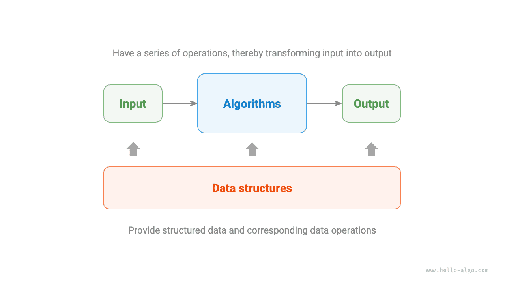

#Thuật toán là gì

## Định nghĩa thuật toán

<u>Thuật toán</u> là tập hợp các hướng dẫn hoặc các bước vận hành nhằm giải quyết một vấn đề cụ thể trong một khoảng thời gian hữu hạn. Nó có những đặc điểm sau.

- Bài toán được xác định rõ ràng, có định nghĩa đầu vào và đầu ra rõ ràng.
- Tính khả thi và có thể hoàn thành với số bước, thời gian và bộ nhớ hữu hạn.
- Mỗi bước đều có một ý nghĩa nhất định, trong cùng điều kiện đầu vào và vận hành thì đầu ra luôn giống nhau.

## Định nghĩa cấu trúc dữ liệu

<u>Cấu trúc dữ liệu</u> là một cách tổ chức và lưu trữ dữ liệu, bao gồm chính dữ liệu đó, mối quan hệ giữa các thành phần dữ liệu và các phương thức được sử dụng để thao tác trên chúng. Nó có các mục tiêu thiết kế sau đây.

- Chiếm ít không gian nhất có thể để tiết kiệm bộ nhớ máy tính.
- Thao tác dữ liệu phải nhanh nhất có thể, bao gồm truy cập, thêm, xóa, cập nhật dữ liệu, v.v.
- Cung cấp cách trình bày dữ liệu ngắn gọn và thông tin logic để thuật toán có thể chạy hiệu quả.

**Thiết kế cấu trúc dữ liệu là một quá trình có nhiều sự đánh đổi**. Nếu muốn đạt được những cải tiến ở một khía cạnh nào đó, chúng ta thường cần phải thỏa hiệp ở một khía cạnh khác. Đây là hai ví dụ.

- So với mảng, danh sách liên kết thuận tiện hơn cho các thao tác thêm, xóa dữ liệu nhưng lại hy sinh tốc độ truy xuất dữ liệu.
- So với danh sách liên kết, đồ thị cung cấp thông tin logic phong phú hơn nhưng yêu cầu dung lượng bộ nhớ lớn hơn.

## Mối quan hệ giữa cấu trúc dữ liệu và thuật toán

Như thể hiện trong hình bên dưới, cấu trúc dữ liệu và thuật toán có mối liên hệ chặt chẽ và chặt chẽ với nhau, được thể hiện cụ thể ở ba khía cạnh sau.

- Cấu trúc dữ liệu là nền tảng của thuật toán. Cấu trúc dữ liệu cung cấp các thuật toán lưu trữ dữ liệu có cấu trúc và các phương thức để vận hành trên dữ liệu.
- Các thuật toán thổi sức sống vào cấu trúc dữ liệu. Bản thân cấu trúc dữ liệu chỉ lưu trữ thông tin dữ liệu; kết hợp với các thuật toán, chúng có thể giải quyết các vấn đề cụ thể.
- Các thuật toán thường có thể được triển khai dựa trên các cấu trúc dữ liệu khác nhau, nhưng hiệu quả thực hiện có thể khác nhau rất nhiều. Chọn cấu trúc dữ liệu phù hợp là chìa khóa.

Cấu trúc dữ liệu và thuật toán giống như việc lắp ráp các khối xây dựng như trong hình bên dưới. Một bộ khối xây dựng ngoài việc chứa nhiều bộ phận còn đi kèm hướng dẫn lắp ráp chi tiết. Bằng cách làm theo hướng dẫn từng bước, chúng ta có thể lắp ráp một mô hình khối xây dựng tinh xảo.

Sự tương ứng chi tiết giữa hai điều này được thể hiện trong bảng dưới đây.

 Table <id> &nbsp; Comparing data structures and algorithms to assembling building blocks 

| Cấu trúc dữ liệu và thuật toán | Lắp ráp các khối xây dựng |
| ------------------------------ | ------------------------------------------------------------------ |
| Dữ liệu đầu vào | Khối xây dựng chưa lắp ráp |
| Cấu trúc dữ liệu | Hình thức tổ chức các khối xây dựng, bao gồm hình dạng, kích thước, phương thức kết nối, v.v. |
| Thuật toán | Chuỗi các bước thao tác để lắp ráp các khối thành dạng đích |
| Dữ liệu đầu ra | Mô hình khối xây dựng |

Điều đáng chú ý là cấu trúc dữ liệu và thuật toán độc lập với ngôn ngữ lập trình. Đó là lý do tại sao cuốn sách này có thể cung cấp cách triển khai bằng nhiều ngôn ngữ lập trình.

!!! mẹo "Viết tắt thông thường"

Trong các cuộc thảo luận thực tế, chúng tôi thường viết tắt "cấu trúc dữ liệu và thuật toán" là "thuật toán". Ví dụ, các bài toán thuật toán LeetCode nổi tiếng thực sự kiểm tra kiến ​​thức về cả cấu trúc dữ liệu và thuật toán.
