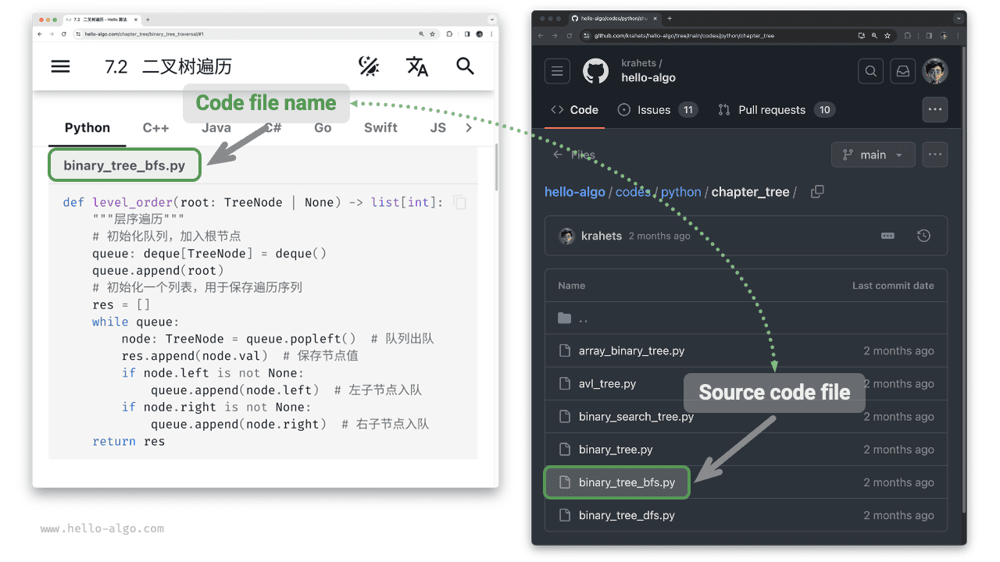
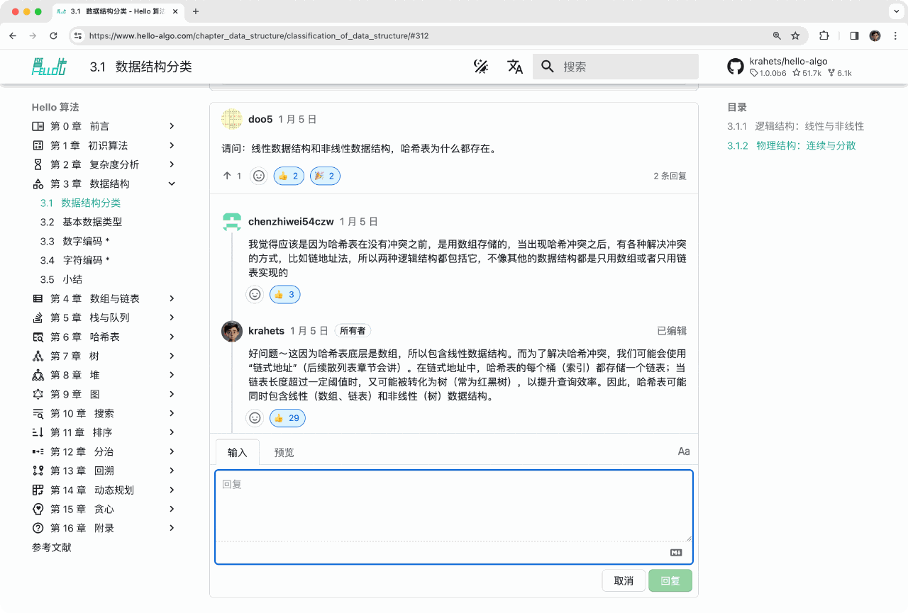

# Cách sử dụng cuốn sách này

!!! Mẹo

Để có trải nghiệm đọc tốt nhất, bạn nên đọc qua phần này.

## Quy ước về phong cách viết

- Những phần có dấu `*` sau tiêu đề là tùy chọn và có phần khó hơn. Nếu bạn không có đủ thời gian, bạn có thể bỏ qua chúng trong lần vượt qua đầu tiên.
- Các thuật ngữ kỹ thuật được in đậm (trong bản in và bản PDF) hoặc gạch chân (trong bản web), chẳng hạn như <u>mảng</u>. Chúng đáng được ghi nhớ vì chúng sẽ giúp ích khi đọc tài liệu kỹ thuật.
- Nội dung chính và các câu tóm tắt sẽ được **in đậm** và văn bản đó đáng được chú ý đặc biệt.
- Những từ, cụm từ có nghĩa cụ thể sẽ được đánh dấu bằng “dấu ngoặc kép” để tránh nhầm lẫn.
- Khi thuật ngữ khác nhau giữa các ngôn ngữ lập trình, cuốn sách này tuân theo các quy ước Python; ví dụ: nó sử dụng `None` để biểu thị "null".
- Cuốn sách này phần nào nới lỏng các kiểu nhận xét bằng ngôn ngữ lập trình thông thường để có bố cục nhỏ gọn hơn. Bình luận chủ yếu được chia thành ba loại: bình luận tiêu đề, bình luận nội dung và bình luận nhiều dòng.

=== "Python"

    ```python title=""
    """Title comment, used to label functions, classes, test cases, etc."""

    # Content comment, used to explain code in detail

    """
    Multi-line
    comment
    """
    ```

=== "C++"

    ```cpp title=""
    /* Title comment, used to label functions, classes, test cases, etc. */

    // Content comment, used to explain code in detail

    /**
     * Multi-line
     * comment
     */
    ```

=== "Java"

    ```java title=""
    /* Title comment, used to label functions, classes, test cases, etc. */

    // Content comment, used to explain code in detail

    /**
     * Multi-line
     * comment
     */
    ```

=== "C#"

    ```csharp title=""
    /* Title comment, used to label functions, classes, test cases, etc. */

    // Content comment, used to explain code in detail

    /**
     * Multi-line
     * comment
     */
    ```

=== "Go"

    ```go title=""
    /* Title comment, used to label functions, classes, test cases, etc. */

    // Content comment, used to explain code in detail

    /**
     * Multi-line
     * comment
     */
    ```

=== "Swift"

    ```swift title=""
    /* Title comment, used to label functions, classes, test cases, etc. */

    // Content comment, used to explain code in detail

    /**
     * Multi-line
     * comment
     */
    ```

=== "JS"

    ```javascript title=""
    /* Title comment, used to label functions, classes, test cases, etc. */

    // Content comment, used to explain code in detail

    /**
     * Multi-line
     * comment
     */
    ```

=== "TS"

    ```typescript title=""
    /* Title comment, used to label functions, classes, test cases, etc. */

    // Content comment, used to explain code in detail

    /**
     * Multi-line
     * comment
     */
    ```

=== "Dart"

    ```dart title=""
    /* Title comment, used to label functions, classes, test cases, etc. */

    // Content comment, used to explain code in detail

    /**
     * Multi-line
     * comment
     */
    ```

=== "Rust"

    ```rust title=""
    /* Title comment, used to label functions, classes, test cases, etc. */

    // Content comment, used to explain code in detail

    // Multi-line
    // comment
    ```

=== "C"

    ```c title=""
    /* Title comment, used to label functions, classes, test cases, etc. */

    // Content comment, used to explain code in detail

    /**
     * Multi-line
     * comment
     */
    ```

=== "Kotlin"

    ```kotlin title=""
    /* Title comment, used to label functions, classes, test cases, etc. */

    // Content comment, used to explain code in detail

    /**
     * Multi-line
     * comment
     */
    ```

=== "Ruby"

    ```ruby title=""
    ### Title comment, used to label functions, classes, test cases, etc. ###

    # Content comment, used to explain code in detail

    # Multi-line
    # comment
    ```

## Học hiệu quả với hình minh họa sinh động

So với văn bản thuần túy, video và hình ảnh có mật độ thông tin cao hơn và cấu trúc rõ ràng hơn, giúp chúng dễ hiểu hơn. Trong cuốn sách này, **các khái niệm chính và chủ đề đầy thách thức được trình bày chủ yếu thông qua hình ảnh minh họa sinh động**, với văn bản đóng vai trò giải thích và bổ sung.

Nếu trong khi đọc cuốn sách này, bạn gặp phải một hình minh họa sinh động như hình bên dưới, hãy **coi hình minh họa là chính và văn bản là phần bổ sung** và sử dụng cả hai cùng nhau để hiểu nội dung.


## Hiểu sâu hơn thông qua thực hành mã

Mã đi kèm cho cuốn sách này được lưu trữ trong [kho GitHub](https://github.com/krahets/hello-algo). Như minh họa trong hình bên dưới, **mã nguồn đi kèm với các trường hợp thử nghiệm và có thể chạy bằng một cú nhấp chuột**.

Nếu thời gian cho phép, **nên bạn tự gõ mã**. Nếu bạn có thời gian nghiên cứu hạn chế, ít nhất hãy đọc qua và chạy tất cả mã.

So với việc chỉ đọc mã, việc tự viết mã thường mang lại phần thưởng lớn hơn. **Thực hành thực tế là nơi diễn ra quá trình học tập thực sự**.


Việc chạy mã chủ yếu bao gồm ba bước sơ bộ.

**Bước 1: Cài đặt môi trường lập trình cục bộ**. Vui lòng làm theo [hướng dẫn](https://www.hello-algo.com/chapter_appendix/installation/) trong phụ lục. Nếu nó đã được cài đặt, bạn có thể bỏ qua bước này.

**Bước 2: Sao chép hoặc tải xuống kho mã**. Truy cập [kho GitHub](https://github.com/krahets/hello-algo). Nếu bạn đã cài đặt [Git](https://git-scm.com/downloads), bạn có thể sao chép kho lưu trữ này bằng lệnh sau:

```shell
git clone https://github.com/krahets/hello-algo.git
```

Ngoài ra, bạn có thể nhấp vào nút "Tải xuống ZIP" hiển thị bên dưới để tải xuống trực tiếp kho lưu trữ ZIP của kho lưu trữ rồi giải nén cục bộ.




Ngoài việc chạy mã cục bộ, **phiên bản web còn hỗ trợ thực thi mã Python bằng hình ảnh** (được triển khai dựa trên [pythontutor](https://pythontutor.com/)). Như trong hình bên dưới, bạn có thể nhấp vào "Chạy trực quan" bên dưới khối mã để mở rộng chế độ xem và quan sát quá trình thực thi mã thuật toán; bạn cũng có thể nhấp vào "Chế độ xem toàn màn hình" để có trải nghiệm xem tốt hơn.


## Cùng nhau phát triển thông qua các câu hỏi và thảo luận

Khi đọc cuốn sách này, xin đừng bỏ qua những điểm mà bạn vẫn chưa hiểu hết. **Hãy thoải mái đặt câu hỏi của bạn trong phần bình luận**, tôi và bạn bè sẽ cố gắng hết sức để trả lời chúng, thường là trong vòng hai ngày.

Như trong hình bên dưới, phiên bản web có phần bình luận ở cuối mỗi chương. Tôi khuyến khích bạn chú ý đến các cuộc thảo luận ở đó. Một mặt, bạn có thể tìm hiểu về những vấn đề mà người khác gặp phải, từ đó lấp đầy những lỗ hổng trong hiểu biết của bản thân và thúc đẩy suy nghĩ sâu sắc hơn. Mặt khác, tôi hy vọng bạn sẽ hào phóng trả lời các câu hỏi của độc giả khác, chia sẻ những hiểu biết sâu sắc của mình và giúp đỡ người khác tiến bộ.



## Lộ trình học thuật toán

Nhìn chung, chúng ta có thể chia quá trình học cấu trúc dữ liệu và thuật toán thành ba giai đoạn.

1. **Giai đoạn 1: Giới thiệu thuật toán**. Chúng ta cần làm quen với các đặc điểm và cách sử dụng các cấu trúc dữ liệu khác nhau, đồng thời tìm hiểu các nguyên tắc, quy trình, cách sử dụng và hiệu quả của các thuật toán khác nhau.
2. **Giai đoạn 2: Thực hành các bài toán về thuật toán**. Bạn nên bắt đầu với các bài toán phổ biến và giải ít nhất 100 bài trong số đó trước để làm quen với các câu hỏi thuật toán chính thống. Khi mới bắt đầu luyện tập, việc “quên kiến ​​thức” có thể khiến bạn cảm thấy như một thử thách nhưng hãy yên tâm, điều này rất bình thường. Chúng ta có thể ôn lại các bài toán theo “đường cong quên Ebbinghaus”, và sau 3-5 lần lặp lại, chúng thường bám chặt vào trí nhớ. Để biết danh sách vấn đề được đề xuất và kế hoạch thực hành, vui lòng xem [kho GitHub] này (https://github.com/krahets/LeetCode-Book).
3. **Giai đoạn 3: Xây dựng hệ thống tri thức**. Về mặt học tập, chúng ta có thể đọc các bài viết chuyên mục thuật toán, khung giải quyết vấn đề và sách giáo khoa thuật toán để không ngừng làm phong phú thêm hệ thống tri thức của mình. Về mặt thực hành các vấn đề, chúng ta có thể thử các chiến lược giải quyết vấn đề nâng cao, chẳng hạn như phân loại theo chủ đề, một vấn đề nhiều giải pháp, một giải pháp nhiều vấn đề, v.v. Những hiểu biết sâu sắc về giải quyết vấn đề có liên quan có thể được tìm thấy trong nhiều cộng đồng khác nhau.

Như minh họa trong hình bên dưới, nội dung của cuốn sách này chủ yếu đề cập đến "Giai đoạn 1", nhằm giúp bạn thực hiện việc học Giai đoạn 2 và Giai đoạn 3 hiệu quả hơn.


