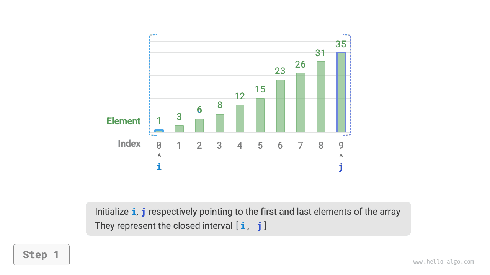
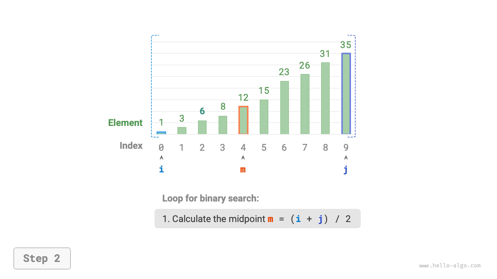
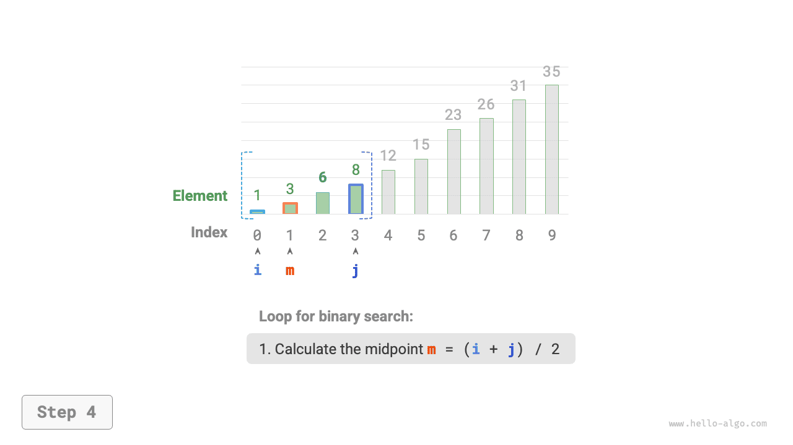
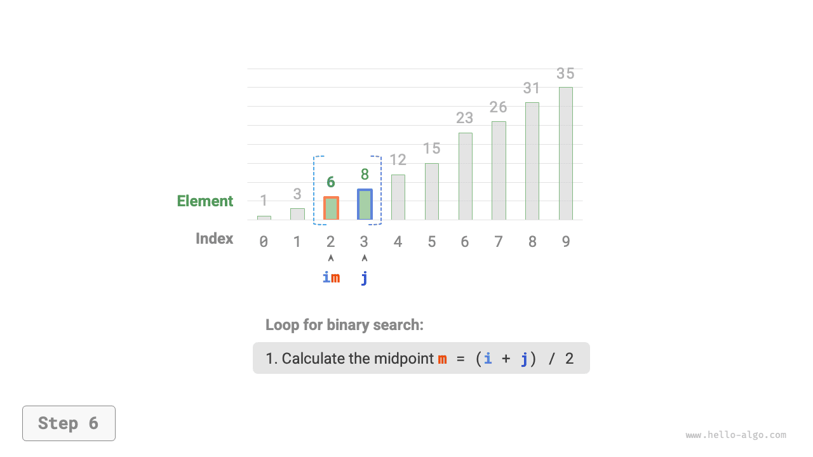
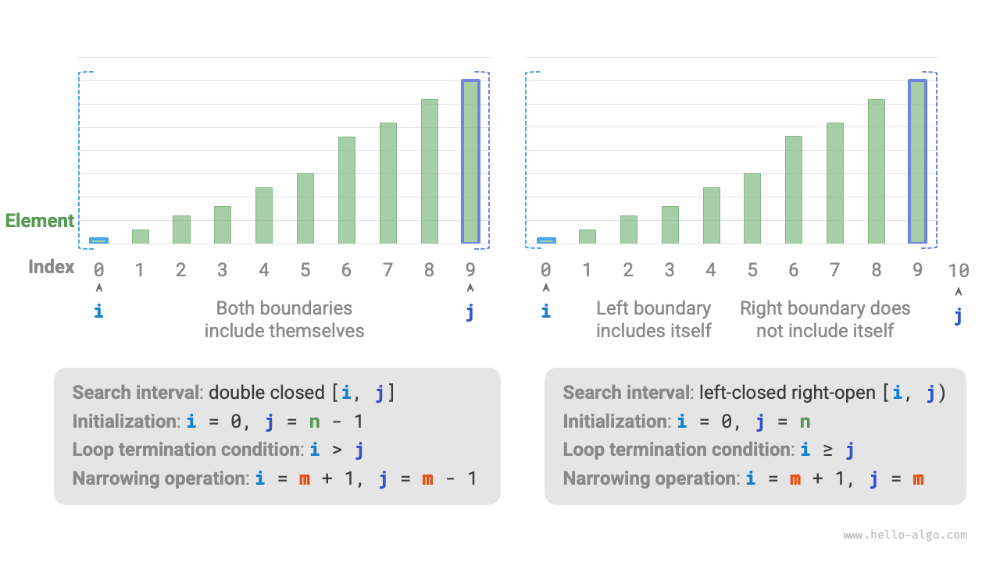

# Tìm kiếm nhị phân

<u>Binary search</u> is an efficient search algorithm based on the divide-and-conquer strategy. It leverages the sorted order of the data to reduce the search range by half in each round until the target element is found or the search interval becomes empty.

!!! câu hỏi

Cho một mảng `nums` có độ dài $n$ với các phần tử được sắp xếp theo thứ tự tăng dần và không trùng lặp, tìm kiếm và trả về chỉ mục của phần tử `target` trong mảng. Nếu mảng không chứa phần tử, trả về $-1$. Một ví dụ được hiển thị trong hình dưới đây.


Như thể hiện trong hình bên dưới, trước tiên chúng ta khởi tạo các con trỏ $i = 0$ và $j = n - 1$, lần lượt trỏ đến phần tử đầu tiên và cuối cùng của mảng, biểu thị khoảng tìm kiếm $[0, n - 1]$. Lưu ý rằng dấu ngoặc vuông biểu thị một khoảng đóng, bao gồm chính các giá trị biên.

Tiếp theo, thực hiện hai bước sau trong một vòng lặp:

1. Tính chỉ số trung điểm $m = \lfloor {(i + j) / 2} \rfloor$, trong đó $\lfloor \: \rfloor$ biểu thị thao tác sàn.
2. So sánh `nums[m]` và `target`, có 3 trường hợp:
    1. Khi `nums[m] < target`, nó chỉ ra rằng `target` nằm trong khoảng $[m + 1, j]$, vì vậy hãy thực hiện $i = m + 1$.
    2. Khi `nums[m] > target`, nó chỉ ra rằng `target` nằm trong khoảng $[i, m - 1]$, vì vậy hãy thực hiện $j = m - 1$.
    3. Khi `nums[m] = target`, nó chỉ ra rằng `target` đã được tìm thấy, do đó trả về chỉ số $m$.

Nếu mảng không chứa phần tử đích, khoảng thời gian tìm kiếm cuối cùng sẽ trống. Trong trường hợp này, trả về $-1$.

=== "<1>"
    

=== "<2>"
    

=== "<3>"
    

=== "<4>"
    

=== "<5>"
    

=== "<6>"
    

=== "<7>"
    

Cần lưu ý rằng vì cả $i$ và $j$ đều thuộc loại `int`, **$i + j$ có thể vượt quá phạm vi của loại `int`**. Để tránh tràn số nguyên, chúng tôi thường sử dụng công thức $m = \lfloor {i + (j - i) / 2} \rfloor$ để tính điểm giữa.

Mã được hiển thị dưới đây:

=== "Python"
    ```python title="binary_search.py"
    def binary_search(nums: list[int], target: int) -> int:
        """Binary search (closed interval)"""
        # Initialize closed interval [0, n-1], i.e., i, j point to the first and last elements of the array
        i, j = 0, len(nums) - 1
        # Loop, exit when the search interval is empty (empty when i > j)
        while i <= j:
            # In theory, Python numbers can be infinitely large (depending on memory size), no need to consider large number overflow
            m = (i + j) // 2  # Calculate midpoint index m
            if nums[m] < target:
                i = m + 1  # This means target is in the interval [m+1, j]
            elif nums[m] > target:
                j = m - 1  # This means target is in the interval [i, m-1]
            else:
                return m  # Found the target element, return its index
        return -1  # Target element not found, return -1
    ```
=== "C++"
    ```cpp title="binary_search.cpp"
    int binarySearch(vector<int> &nums, int target) {
        // Initialize closed interval [0, n-1], i.e., i, j point to the first and last elements of the array
        int i = 0, j = nums.size() - 1;
        // Loop, exit when the search interval is empty (empty when i > j)
        while (i <= j) {
            int m = i + (j - i) / 2; // Calculate the midpoint index m
            if (nums[m] < target)    // This means target is in the interval [m+1, j]
                i = m + 1;
            else if (nums[m] > target) // This means target is in the interval [i, m-1]
                j = m - 1;
            else // Found the target element, return its index
                return m;
        }
        // Target element not found, return -1
        return -1;
    }
    ```
=== "Java"
    ```java title="binary_search.java"
    public class binary_search {
        /* Binary search (closed interval on both sides) */
        static int binarySearch(int[] nums, int target) {
            // Initialize closed interval [0, n-1], i.e., i, j point to the first and last elements of the array
            int i = 0, j = nums.length - 1;
            // Loop, exit when the search interval is empty (empty when i > j)
            while (i <= j) {
                int m = i + (j - i) / 2; // Calculate the midpoint index m
                if (nums[m] < target) // This means target is in the interval [m+1, j]
                    i = m + 1;
                else if (nums[m] > target) // This means target is in the interval [i, m-1]
                    j = m - 1;
                else // Found the target element, return its index
                    return m;
            }
            // Target element not found, return -1
            return -1;
        }
    
        /* Binary search (left-closed right-open interval) */
        static int binarySearchLCRO(int[] nums, int target) {
            // Initialize left-closed right-open interval [0, n), i.e., i, j point to the first element and last element+1
            int i = 0, j = nums.length;
            // Loop, exit when the search interval is empty (empty when i = j)
            while (i < j) {
                int m = i + (j - i) / 2; // Calculate the midpoint index m
                if (nums[m] < target) // This means target is in the interval [m+1, j)
                    i = m + 1;
                else if (nums[m] > target) // This means target is in the interval [i, m)
                    j = m;
                else // Found the target element, return its index
                    return m;
            }
            // Target element not found, return -1
            return -1;
        }
    
        public static void main(String[] args) {
            int target = 6;
            int[] nums = { 1, 3, 6, 8, 12, 15, 23, 26, 31, 35 };
    
            /* Binary search (closed interval on both sides) */
            int index = binarySearch(nums, target);
            System.out.println("Index of target element 6 = " + index);
    
            /* Binary search (left-closed right-open interval) */
            index = binarySearchLCRO(nums, target);
            System.out.println("Index of target element 6 = " + index);
        }
    }
    ```
=== "C#"
    ```csharp title="binary_search.cs"
    public class binary_search {
        /* Binary search (closed interval on both sides) */
        int BinarySearch(int[] nums, int target) {
            // Initialize closed interval [0, n-1], i.e., i, j point to the first and last elements of the array
            int i = 0, j = nums.Length - 1;
            // Loop, exit when the search interval is empty (empty when i > j)
            while (i <= j) {
                int m = i + (j - i) / 2;   // Calculate the midpoint index m
                if (nums[m] < target)      // This means target is in the interval [m+1, j]
                    i = m + 1;
                else if (nums[m] > target) // This means target is in the interval [i, m-1]
                    j = m - 1;
                else                       // Found the target element, return its index
                    return m;
            }
            // Target element not found, return -1
            return -1;
        }
    
        /* Binary search (left-closed right-open interval) */
        int BinarySearchLCRO(int[] nums, int target) {
            // Initialize left-closed right-open interval [0, n), i.e., i, j point to the first element and last element+1
            int i = 0, j = nums.Length;
            // Loop, exit when the search interval is empty (empty when i = j)
            while (i < j) {
                int m = i + (j - i) / 2;   // Calculate the midpoint index m
                if (nums[m] < target)      // This means target is in the interval [m+1, j)
                    i = m + 1;
                else if (nums[m] > target) // This means target is in the interval [i, m)
                    j = m;
                else                       // Found the target element, return its index
                    return m;
            }
            // Target element not found, return -1
            return -1;
        }
    
        [Test]
        public void Test() {
            int target = 6;
            int[] nums = [1, 3, 6, 8, 12, 15, 23, 26, 31, 35];
    
            /* Binary search (closed interval on both sides) */
            int index = BinarySearch(nums, target);
            Console.WriteLine("Index of target element 6 = " + index);
    
            /* Binary search (left-closed right-open interval) */
            index = BinarySearchLCRO(nums, target);
            Console.WriteLine("Index of target element 6 = " + index);
        }
    }
    ```
=== "Go"
    ```go title="binary_search.go"
    func binarySearch(nums []int, target int) int {
    	// Initialize closed interval [0, n-1], i.e., i, j point to the first and last elements of the array
    	i, j := 0, len(nums)-1
    	// Loop, exit when the search interval is empty (empty when i > j)
    	for i <= j {
    		m := i + (j-i)/2      // Calculate the midpoint index m
    		if nums[m] < target { // This means target is in the interval [m+1, j]
    			i = m + 1
    		} else if nums[m] > target { // This means target is in the interval [i, m-1]
    			j = m - 1
    		} else { // Found the target element, return its index
    			return m
    		}
    	}
    	// Target element not found, return -1
    	return -1
    }
    ```
=== "Swift"
    ```swift title="binary_search.swift"
    func binarySearch(nums: [Int], target: Int) -> Int {
        // Initialize closed interval [0, n-1], i.e., i, j point to the first and last elements of the array
        var i = nums.startIndex
        var j = nums.endIndex - 1
        // Loop, exit when the search interval is empty (empty when i > j)
        while i <= j {
            let m = i + (j - i) / 2 // Calculate the midpoint index m
            if nums[m] < target { // This means target is in the interval [m+1, j]
                i = m + 1
            } else if nums[m] > target { // This means target is in the interval [i, m-1]
                j = m - 1
            } else { // Found the target element, return its index
                return m
            }
        }
        // Target element not found, return -1
        return -1
    }
    ```
=== "JS"
    ```javascript title="binary_search.js"
    function binarySearch(nums, target) {
        // Initialize closed interval [0, n-1], i.e., i, j point to the first and last elements of the array
        let i = 0,
            j = nums.length - 1;
        // Loop, exit when the search interval is empty (empty when i > j)
        while (i <= j) {
            // Calculate midpoint index m, use parseInt() to round down
            const m = parseInt(i + (j - i) / 2);
            if (nums[m] < target)
                // This means target is in the interval [m+1, j]
                i = m + 1;
            else if (nums[m] > target)
                // This means target is in the interval [i, m-1]
                j = m - 1;
            else return m; // Found the target element, return its index
        }
        // Target element not found, return -1
        return -1;
    }
    ```
=== "TS"
    ```typescript title="binary_search.ts"
    function binarySearch(nums: number[], target: number): number {
        // Initialize closed interval [0, n-1], i.e., i, j point to the first and last elements of the array
        let i = 0,
            j = nums.length - 1;
        // Loop, exit when the search interval is empty (empty when i > j)
        while (i <= j) {
            // Calculate the midpoint index m
            const m = Math.floor(i + (j - i) / 2);
            if (nums[m] < target) {
                // This means target is in the interval [m+1, j]
                i = m + 1;
            } else if (nums[m] > target) {
                // This means target is in the interval [i, m-1]
                j = m - 1;
            } else {
                // Found the target element, return its index
                return m;
            }
        }
        return -1; // Target element not found, return -1
    }
    ```
=== "Dart"
    ```dart title="binary_search.dart"
    int binarySearch(List<int> nums, int target) {
      // Initialize closed interval [0, n-1], i.e., i, j point to the first and last elements of the array
      int i = 0, j = nums.length - 1;
      // Loop, exit when the search interval is empty (empty when i > j)
      while (i <= j) {
        int m = i + (j - i) ~/ 2; // Calculate the midpoint index m
        if (nums[m] < target) {
          // This means target is in the interval [m+1, j]
          i = m + 1;
        } else if (nums[m] > target) {
          // This means target is in the interval [i, m-1]
          j = m - 1;
        } else {
          // Found the target element, return its index
          return m;
        }
      }
      // Target element not found, return -1
      return -1;
    }
    ```
=== "Rust"
    ```rust title="binary_search.rs"
    fn binary_search(nums: &[i32], target: i32) -> i32 {
        // Initialize closed interval [0, n-1], i.e., i, j point to the first and last elements of the array
        let mut i = 0;
        let mut j = nums.len() as i32 - 1;
        // Loop, exit when the search interval is empty (empty when i > j)
        while i <= j {
            let m = i + (j - i) / 2; // Calculate the midpoint index m
            if nums[m as usize] < target {
                // This means target is in the interval [m+1, j]
                i = m + 1;
            } else if nums[m as usize] > target {
                // This means target is in the interval [i, m-1]
                j = m - 1;
            } else {
                // Found the target element, return its index
                return m;
            }
        }
        // Target element not found, return -1
        return -1;
    }
    ```
=== "C"
    ```c title="binary_search.c"
    int binarySearch(int *nums, int len, int target) {
        // Initialize closed interval [0, n-1], i.e., i, j point to the first and last elements of the array
        int i = 0, j = len - 1;
        // Loop, exit when the search interval is empty (empty when i > j)
        while (i <= j) {
            int m = i + (j - i) / 2; // Calculate the midpoint index m
            if (nums[m] < target)    // This means target is in the interval [m+1, j]
                i = m + 1;
            else if (nums[m] > target) // This means target is in the interval [i, m-1]
                j = m - 1;
            else // Found the target element, return its index
                return m;
        }
        // Target element not found, return -1
        return -1;
    }
    ```
=== "Kotlin"
    ```kotlin title="binary_search.kt"
    fun binarySearch(nums: IntArray, target: Int): Int {
        // Initialize closed interval [0, n-1], i.e., i, j point to the first and last elements of the array
        var i = 0
        var j = nums.size - 1
        // Loop, exit when the search interval is empty (empty when i > j)
        while (i <= j) {
            val m = i + (j - i) / 2 // Calculate the midpoint index m
            if (nums[m] < target) // This means target is in the interval [m+1, j]
                i = m + 1
            else if (nums[m] > target) // This means target is in the interval [i, m-1]
                j = m - 1
            else  // Found the target element, return its index
                return m
        }
        // Target element not found, return -1
        return -1
    }
    ```
=== "Ruby"
    ```ruby title="binary_search.rb"
    ### Binary search (closed interval) ###
    def binary_search(nums, target)
      # Initialize closed interval [0, n-1], i.e., i, j point to the first and last elements of the array
      i, j = 0, nums.length - 1
    
      # Loop, exit when the search interval is empty (empty when i > j)
      while i <= j
        # In theory, Ruby numbers can be infinitely large (limited by memory), no need to consider overflow
        m = (i + j) / 2   # Calculate the midpoint index m
      
        if nums[m] < target
          i = m + 1 # This means target is in the interval [m+1, j]
        elsif nums[m] > target
          j = m - 1 # This means target is in the interval [i, m-1]
        else
          return m  # Found the target element, return its index
        end
      end
    
      -1  # Target element not found, return -1
    ```


**Độ phức tạp về thời gian là $O(\log n)$**: Trong vòng lặp tìm kiếm nhị phân, khoảng thời gian được giảm đi một nửa mỗi vòng, do đó số lần lặp là $\log_2 n$.

**Độ phức tạp của không gian là $O(1)$**: Con trỏ $i$ và $j$ sử dụng không gian có kích thước không đổi.

## Các phương pháp biểu diễn khoảng

Ngoài khoảng đóng được đề cập ở trên, một cách biểu diễn khoảng phổ biến khác là khoảng "đóng trái - mở", được định nghĩa là $[0, n)$, nghĩa là ranh giới bên trái là bao gồm trong khi ranh giới bên phải là loại trừ. Theo biểu diễn này, khoảng $[i, j)$ trống khi $i = j$.

Chúng ta có thể triển khai thuật toán tìm kiếm nhị phân có cùng chức năng dựa trên biểu diễn này:

=== "Python"
    ```python title="binary_search.py"
    def binary_search_lcro(nums: list[int], target: int) -> int:
        """Binary search (left-closed right-open interval)"""
        # Initialize left-closed right-open interval [0, n), i.e., i, j point to the first element and last element+1
        i, j = 0, len(nums)
        # Loop, exit when the search interval is empty (empty when i = j)
        while i < j:
            m = (i + j) // 2  # Calculate midpoint index m
            if nums[m] < target:
                i = m + 1  # This means target is in the interval [m+1, j)
            elif nums[m] > target:
                j = m  # This means target is in the interval [i, m)
            else:
                return m  # Found the target element, return its index
        return -1  # Target element not found, return -1
    ```
=== "Rust"
    ```rust title="binary_search.rs"
    fn binary_search_lcro(nums: &[i32], target: i32) -> i32 {
        // Initialize left-closed right-open interval [0, n), i.e., i, j point to the first element and last element+1
        let mut i = 0;
        let mut j = nums.len() as i32;
        // Loop, exit when the search interval is empty (empty when i = j)
        while i < j {
            let m = i + (j - i) / 2; // Calculate the midpoint index m
            if nums[m as usize] < target {
                // This means target is in the interval [m+1, j)
                i = m + 1;
            } else if nums[m as usize] > target {
                // This means target is in the interval [i, m)
                j = m;
            } else {
                // Found the target element, return its index
                return m;
            }
        }
        // Target element not found, return -1
        return -1;
    }
    ```
=== "Ruby"
    ```ruby title="binary_search.rb"
    ### Binary search (left-closed right-open interval) ###
    def binary_search_lcro(nums, target)
      # Initialize left-closed right-open interval [0, n), i.e., i, j point to the first element and last element+1
      i, j = 0, nums.length
    
      # Loop, exit when the search interval is empty (empty when i = j)
      while i < j
        # Calculate the midpoint index m
        m = (i + j) / 2
    
        if nums[m] < target
          i = m + 1 # This means target is in the interval [m+1, j)
        elsif nums[m] > target
          j = m - 1 # This means target is in the interval [i, m)
        else
          return m  # Found the target element, return its index
        end
      end
    
      -1  # Target element not found, return -1
    ```


Như được hiển thị trong hình bên dưới, dưới hai biểu diễn khoảng, các hoạt động khởi tạo, điều kiện vòng lặp và thu hẹp khoảng của thuật toán tìm kiếm nhị phân đều khác nhau.

Vì cả hai ranh giới bên trái và bên phải trong biểu diễn "khoảng đóng" đều được xác định là đóng, nên các phép toán để thu hẹp khoảng thông qua các con trỏ $i$ và $j$ cũng đối xứng. Điều này làm cho nó ít xảy ra lỗi hơn, **vì vậy, phương pháp "khoảng thời gian đóng" thường được khuyến nghị**.



## Ưu điểm và hạn chế

Tìm kiếm nhị phân mang lại hiệu suất tốt cả về thời gian và không gian.

- Tìm kiếm nhị phân có hiệu quả cao về thời gian. Với khối lượng dữ liệu lớn, độ phức tạp thời gian logarit có những lợi thế đáng kể. Ví dụ: khi kích thước dữ liệu $n = 2^{20}$, tìm kiếm tuyến tính yêu cầu số lần lặp $2^{20} = 1048576$, trong khi tìm kiếm nhị phân chỉ cần số lần lặp $\log_2 2^{20} = 20$.
- Tìm kiếm nhị phân không cần thêm không gian. So với các thuật toán tìm kiếm yêu cầu thêm không gian (chẳng hạn như tìm kiếm dựa trên hàm băm), tìm kiếm nhị phân tiết kiệm không gian hơn.

Tuy nhiên, tìm kiếm nhị phân không phù hợp với mọi tình huống, chủ yếu vì những lý do sau:

- Tìm kiếm nhị phân chỉ áp dụng cho dữ liệu đã được sắp xếp. Nếu dữ liệu đầu vào không được sắp xếp, việc sắp xếp cụ thể để sử dụng tìm kiếm nhị phân sẽ phản tác dụng, vì thuật toán sắp xếp thường có độ phức tạp về thời gian là $O(n \log n)$, cao hơn cả tìm kiếm tuyến tính và tìm kiếm nhị phân. Đối với các trường hợp thường xuyên chèn phần tử, việc giữ cho mảng được sắp xếp yêu cầu chèn các phần tử vào các vị trí cụ thể với độ phức tạp về thời gian là $O(n)$, điều này cũng rất tốn kém.
- Tìm kiếm nhị phân chỉ áp dụng cho mảng. Tìm kiếm nhị phân yêu cầu quyền truy cập không liền kề, kiểu nhảy vào các phần tử và kiểu truy cập này không hiệu quả trong danh sách được liên kết, khiến nó không phù hợp với danh sách được liên kết hoặc cấu trúc dữ liệu dựa trên danh sách liên kết.
- Đối với khối lượng dữ liệu nhỏ, tìm kiếm tuyến tính hoạt động tốt hơn. Trong tìm kiếm tuyến tính, mỗi vòng chỉ cần 1 phép toán so sánh; trong khi ở tìm kiếm nhị phân, nó yêu cầu 1 phép cộng, 1 phép chia, 1-3 phép so sánh và 1 phép cộng (trừ), tổng cộng là 4-6 phép toán đơn vị. Do đó, khi khối lượng dữ liệu $n$ nhỏ, tìm kiếm tuyến tính thực sự nhanh hơn tìm kiếm nhị phân.
