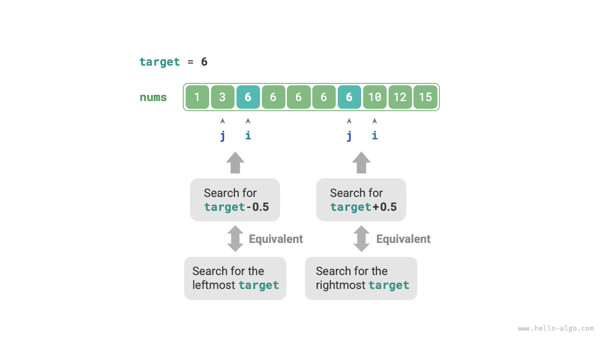

# Ranh giới tìm kiếm nhị phân

## Tìm ranh giới bên trái

!!! câu hỏi

Cho một mảng được sắp xếp `nums` có độ dài $n$ có thể chứa các phần tử trùng lặp, trả về chỉ mục của lần xuất hiện ngoài cùng bên trái của `target`. Nếu mảng không chứa `target`, trả về $-1$.

Nhớ lại phương pháp tìm điểm chèn bằng tìm kiếm nhị phân. Sau khi tìm kiếm hoàn tất, $i$ trỏ đến `đích` ngoài cùng bên trái, **vì vậy việc tìm điểm chèn về cơ bản là tìm chỉ mục của `đích`** ngoài cùng bên trái.

Xem xét việc thực hiện tìm kiếm ranh giới bên trái bằng chức năng tìm điểm chèn. Lưu ý rằng mảng có thể không chứa `target`, điều này có thể dẫn đến hai trường hợp sau:

- Chỉ số điểm chèn $i$ nằm ngoài giới hạn.
- Phần tử `nums[i]` không bằng `target`.

Khi một trong những tình huống này xảy ra, chỉ cần trả về $-1$. Mã được hiển thị dưới đây:

```src
[file]{binary_search_edge}-[class]{}-[func]{binary_search_left_edge}
```

## Tìm ranh giới phù hợp

Vậy làm thế nào để chúng ta tìm được `mục tiêu` ngoài cùng bên phải? Cách tiếp cận trực tiếp nhất là sửa đổi mã và thay thế thao tác thu gọn con trỏ trong trường hợp `nums[m] == target`. Mã bị bỏ qua ở đây; bạn đọc quan tâm có thể tự mình thực hiện.

Dưới đây chúng tôi giới thiệu hai phương pháp thông minh hơn.

### Sử dụng lại tìm kiếm ranh giới bên trái

Trên thực tế, chúng ta có thể sử dụng hàm tìm `đích` ngoài cùng bên trái để tìm `mục tiêu` ngoài cùng bên phải. Phương pháp cụ thể là: **chuyển đổi việc tìm `target` ngoài cùng bên phải thành tìm `target + 1`** ngoài cùng bên trái.

Như được hiển thị trong hình bên dưới, sau khi tìm kiếm hoàn tất, con trỏ $i$ trỏ đến `target + 1` ngoài cùng bên trái (nếu nó tồn tại), trong khi $j$ trỏ đến `target` ngoài cùng bên phải, **vì vậy chúng ta có thể trả về $j$**.


Lưu ý rằng điểm chèn được trả về là $i$, vì vậy chúng ta cần trừ $1$ từ nó để thu được $j$:

```src
[file]{binary_search_edge}-[class]{}-[func]{binary_search_right_edge}
```

### Chuyển đổi sang Tìm kiếm phần tử

Chúng ta biết rằng khi mảng không chứa `target`, $i$ và $j$ cuối cùng sẽ lần lượt trỏ đến các phần tử đầu tiên lớn hơn và nhỏ hơn `target`.

Do đó, như trong hình bên dưới, chúng ta có thể xây dựng một phần tử không tồn tại trong mảng để tìm ranh giới bên trái và bên phải.

- Tìm `target` ngoài cùng bên trái: Có thể chuyển đổi thành tìm `target - 0.5` và trả về con trỏ $i$.
- Tìm `target` ngoài cùng bên phải: Có thể chuyển đổi thành tìm `target + 0.5` và trả về con trỏ $j$.



Mã bị bỏ qua ở đây, nhưng có hai điểm sau đáng chú ý:

- Vì mảng đã cho không chứa giá trị thập phân nên chúng ta không cần lo lắng về cách xử lý đẳng thức.
- Vì phương thức này đưa vào số thập phân nên biến `target` trong hàm cần được đổi thành kiểu dấu phẩy động (Python không yêu cầu thay đổi này).
