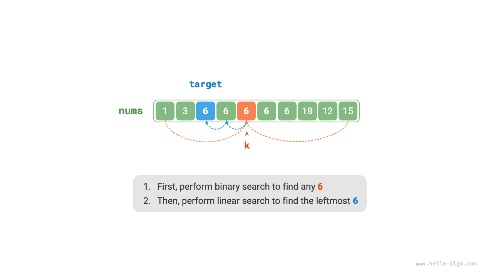
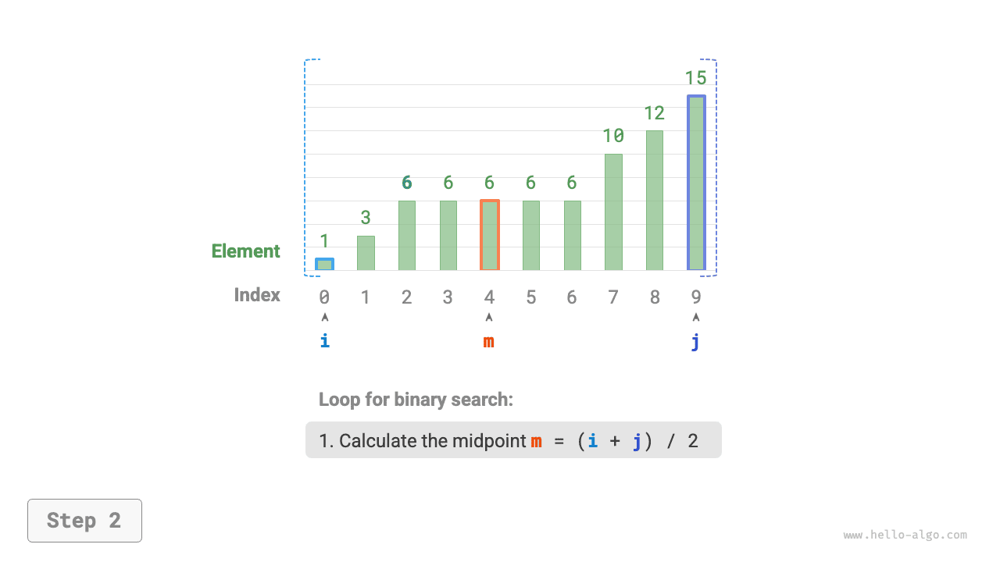
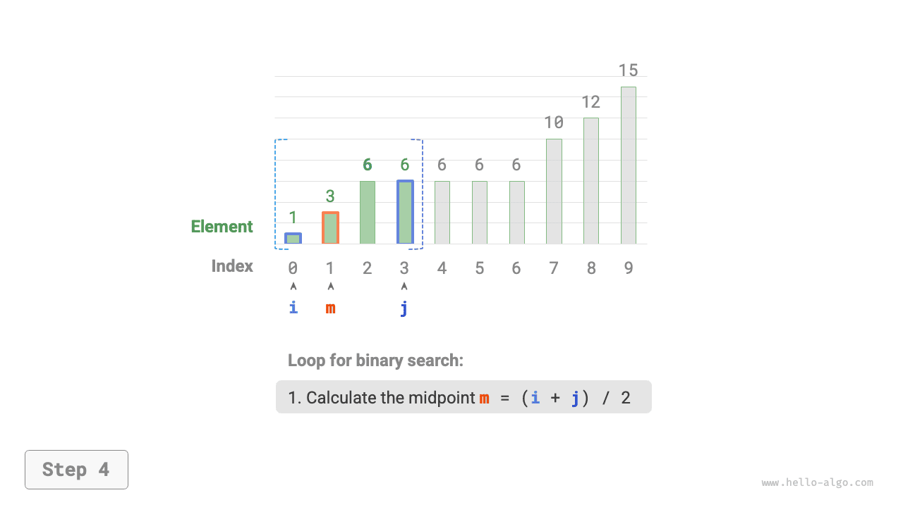
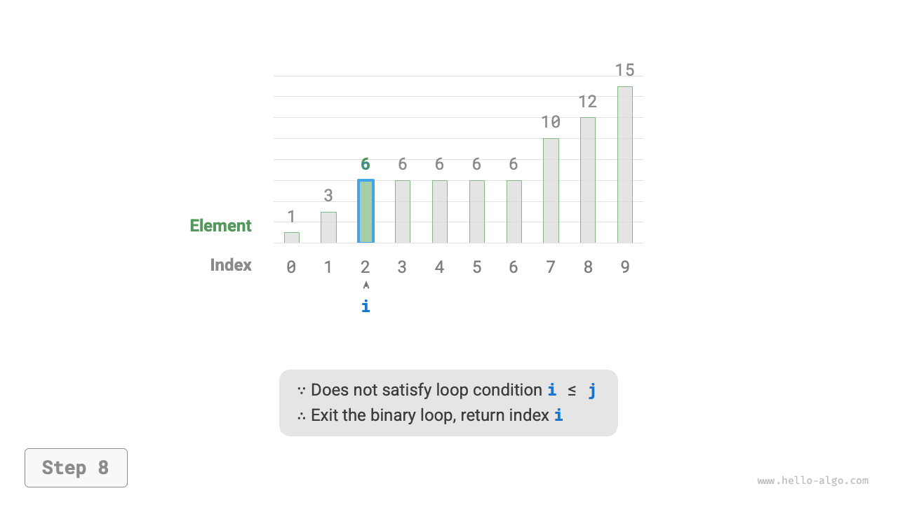

# Điểm chèn tìm kiếm nhị phân

Tìm kiếm nhị phân có thể được sử dụng không chỉ để tìm kiếm phần tử đích mà còn để giải quyết nhiều vấn đề khác nhau, chẳng hạn như tìm vị trí chèn của phần tử đích.

## Trường hợp không có phần tử trùng lặp

!!! câu hỏi

Cho một mảng được sắp xếp `nums` có độ dài $n$ và một phần tử `target`, trong đó mảng không chứa các phần tử trùng lặp, hãy chèn `target` vào `nums` trong khi vẫn giữ nguyên thứ tự được sắp xếp của nó. Nếu `target` đã tồn tại trong mảng, hãy chèn nó vào bên trái. Trả về chỉ mục của `target` sau khi chèn. Một ví dụ được hiển thị dưới đây.


Nếu muốn sử dụng lại mã tìm kiếm nhị phân ở phần trước, chúng ta cần trả lời hai câu hỏi sau.

**Câu hỏi 1**: Khi mảng chứa `target`, chỉ mục điểm chèn có giống với chỉ mục của phần tử đó không?

Sự cố yêu cầu chèn `target` vào bên trái của các phần tử bằng nhau, có nghĩa là `target` mới được chèn sẽ thay thế vị trí của `target` ban đầu. Nói cách khác, **khi mảng chứa `target`, chỉ mục điểm chèn là chỉ mục của `target`** đó.

**Câu hỏi 2**: Khi mảng không chứa `target` thì chỉ số điểm chèn là gì?

Để phân tích điều này sâu hơn, hãy xem xét quá trình tìm kiếm nhị phân: khi `nums[m] < target`, $i$ di chuyển, nghĩa là con trỏ $i$ đang tiếp cận các phần tử lớn hơn hoặc bằng `target`. Tương tự, con trỏ $j$ luôn tiếp cận các phần tử nhỏ hơn hoặc bằng `target`.

Do đó, khi tìm kiếm nhị phân kết thúc, $i$ phải trỏ đến phần tử đầu tiên lớn hơn `target`, và $j$ phải trỏ đến phần tử đầu tiên nhỏ hơn `target`. **Theo sau đó, khi mảng không chứa `target`, chỉ mục chèn là $i$**. Mã được hiển thị dưới đây:

```src
[file]{binary_search_insertion}-[class]{}-[func]{binary_search_insertion_simple}
```

## Trường hợp có phần tử trùng lặp

!!! câu hỏi

Dựa trên vấn đề trước đó, giả sử mảng có thể chứa các phần tử trùng lặp, còn mọi thứ khác vẫn giữ nguyên.

Giả sử có nhiều phần tử `target` trong mảng. Tìm kiếm nhị phân thông thường chỉ có thể trả về chỉ mục của một `đích`, **và không thể xác định có bao nhiêu phần tử `đích` ở bên trái và bên phải của phần tử đó**.

Bài toán yêu cầu chèn phần tử đích vào vị trí ngoài cùng bên trái **vì vậy chúng ta cần tìm chỉ mục của `target` ngoài cùng bên trái trong mảng**. Cách tiếp cận ban đầu đơn giản là làm theo các bước được hiển thị trong hình bên dưới:

1. Thực hiện tìm kiếm nhị phân để lấy chỉ mục của bất kỳ `đích` nào, ký hiệu là $k$.
2. Bắt đầu từ chỉ mục $k$, thực hiện duyệt tuyến tính sang trái và quay lại khi tìm thấy `đích` ngoài cùng bên trái.



Mặc dù phương pháp này hoạt động nhưng nó bao gồm tìm kiếm tuyến tính, dẫn đến độ phức tạp về thời gian là $O(n)$. Khi mảng chứa nhiều phần tử `target` trùng lặp, phương pháp này rất kém hiệu quả.

Bây giờ hãy xem xét việc mở rộng mã tìm kiếm nhị phân. Như được hiển thị trong hình bên dưới, quy trình tổng thể vẫn không thay đổi: trong mỗi lần lặp, trước tiên chúng tôi tính chỉ số trung điểm $m$, sau đó so sánh `target` với `nums[m]`, dẫn đến các trường hợp sau:

- Khi `nums[m] < target` hoặc `nums[m] > target`, điều đó có nghĩa là `target` chưa được tìm thấy, vì vậy hãy sử dụng thao tác thu nhỏ khoảng tiêu chuẩn của tìm kiếm nhị phân để **di chuyển con trỏ $i$ và $j$ đến gần `target`**.
- Khi `nums[m] == target`, có nghĩa là các phần tử nhỏ hơn `target` nằm trong khoảng $[i, m - 1]$, vì vậy hãy sử dụng $j = m - 1$ để thu hẹp khoảng, từ đó **di chuyển con trỏ $j$ đến gần các phần tử nhỏ hơn `target`**.

Sau khi vòng lặp hoàn thành, $i$ trỏ đến `target` ngoài cùng bên trái và $j$ trỏ đến phần tử đầu tiên nhỏ hơn `target`, **vì vậy chỉ mục $i$ là điểm chèn**.

=== "<1>"
    

=== "<2>"
    

=== "<3>"
    

=== "<4>"
    

=== "<5>"
    

=== "<6>"
    

=== "<7>"
    

=== "<8>"
    

Hãy quan sát đoạn mã sau: các nhánh `nums[m] > target` và `nums[m] == target` thực hiện cùng một thao tác, để chúng có thể được hợp nhất.

Mặc dù vậy, chúng ta vẫn có thể mở rộng các nhánh có điều kiện vì logic rõ ràng và dễ đọc hơn.

```src
[file]{binary_search_insertion}-[class]{}-[func]{binary_search_insertion}
```

!!! mẹo

Đoạn mã trong phần này sử dụng toàn bộ cách tiếp cận "khoảng đóng". Bạn đọc quan tâm có thể tự mình thực hiện phương pháp “đóng trái, mở phải”.

Nhìn chung, tìm kiếm nhị phân chỉ đơn giản là vấn đề thiết lập các mục tiêu tìm kiếm riêng biệt cho các con trỏ $i$ và $j$. Mục tiêu có thể là một phần tử cụ thể (chẳng hạn như `target`) hoặc một phạm vi phần tử (chẳng hạn như các phần tử nhỏ hơn `target`).

Với mỗi lần lặp lại tìm kiếm nhị phân, các con trỏ $i$ và $j$ dần dần tiếp cận các mục tiêu đặt trước của chúng. Cuối cùng, họ tìm ra câu trả lời hoặc dừng lại sau khi vượt qua ranh giới.
