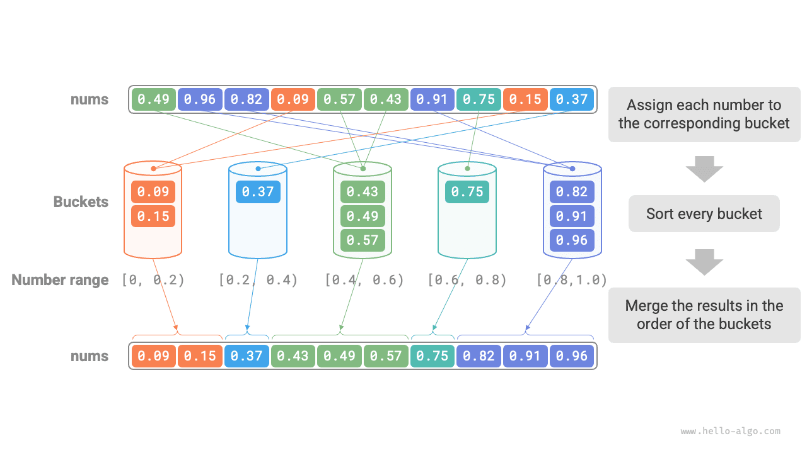

# Sắp xếp nhóm

Các thuật toán sắp xếp được thảo luận trước đó đều là các thuật toán sắp xếp dựa trên so sánh, sắp xếp bằng cách so sánh thứ tự tương đối của các phần tử. Độ phức tạp về thời gian của các thuật toán như vậy không thể vượt qua $O(n \log n)$. Tiếp theo, chúng ta sẽ khám phá một số thuật toán sắp xếp không so sánh, độ phức tạp về thời gian của chúng có thể là tuyến tính.

<u>Bucket sort</u> is a typical application of the divide-and-conquer strategy. It works by creating a sequence of ordered buckets, each corresponding to a data range, and distributing the data evenly among them. The elements within each bucket are then sorted separately. Finally, all buckets are merged in order.

## Luồng thuật toán

Hãy xem xét một mảng có độ dài $n$, trong đó các phần tử của nó là các số có dấu phẩy động trong phạm vi $[0, 1)$. Luồng sắp xếp nhóm được hiển thị trong hình bên dưới.

1. Khởi tạo các nhóm $k$ và phân phối các phần tử $n$ vào các nhóm $k$.
2. Sắp xếp từng nhóm riêng biệt (ở đây chúng tôi sử dụng chức năng sắp xếp tích hợp sẵn của ngôn ngữ lập trình).
3. Hợp nhất các kết quả theo thứ tự từ nhóm nhỏ nhất đến lớn nhất.



Mã này như sau:

```src
[file]{bucket_sort}-[class]{}-[func]{bucket_sort}
```

## Đặc điểm thuật toán

Sắp xếp nhóm phù hợp để xử lý các tập dữ liệu rất lớn. Ví dụ: giả sử đầu vào chứa 1 triệu phần tử và bộ nhớ hạn chế ngăn hệ thống tải tất cả chúng cùng một lúc. Trong trường hợp đó, dữ liệu có thể được chia thành 1000 nhóm, mỗi nhóm có thể được sắp xếp riêng biệt và sau đó có thể hợp nhất các kết quả.

- **Độ phức tạp về thời gian là $O(n + k)$**: Giả sử các phần tử được phân bổ đều trên các nhóm, mỗi nhóm chứa các phần tử $\frac{n}{k}$. Nếu việc sắp xếp một nhóm mất $O(\frac{n}{k} \log\frac{n}{k})$ thời gian, thì việc sắp xếp tất cả các nhóm mất $O(n \log\frac{n}{k})$ thời gian. **Khi số lượng nhóm $k$ tương đối lớn, độ phức tạp về thời gian sẽ đạt tới $O(n)$**. Việc hợp nhất các kết quả yêu cầu duyệt qua tất cả các nhóm và phần tử, việc này mất $O(n + k)$ thời gian. Trong trường hợp xấu nhất, tất cả dữ liệu được đặt vào một nhóm duy nhất và việc sắp xếp nhóm đó mất $O(n^2)$ thời gian.
- **Độ phức tạp về không gian là $O(n + k)$ và sắp xếp nhóm không đúng chỗ**: Nó yêu cầu thêm không gian cho các nhóm $k$ và tổng số phần tử $n$.
- Việc sắp xếp nhóm có ổn định hay không phụ thuộc vào việc thuật toán sắp xếp các phần tử trong nhóm có ổn định hay không.

## Làm thế nào để đạt được sự phân phối đồng đều

Về lý thuyết, sắp xếp nhóm có thể đạt được độ phức tạp về thời gian $O(n)$. **Điều quan trọng là phân phối đồng đều các phần tử trên các nhóm**, vì dữ liệu trong thế giới thực thường không được phân phối đồng đều. Ví dụ: giả sử chúng ta muốn chia đều tất cả các sản phẩm trên Taobao thành 10 nhóm theo mức giá, nhưng mức phân bổ giá không đồng đều: có nhiều sản phẩm có giá dưới 100 nhân dân tệ và rất ít sản phẩm có giá trên 1000 nhân dân tệ. Nếu khoảng giá được chia đều thành 10 khoảng thì số lượng sản phẩm trong các nhóm sẽ khác nhau rất nhiều.

Để đạt được sự phân bổ đồng đều hơn, trước tiên chúng ta có thể chọn một ranh giới thô và phân chia dữ liệu thành 3 nhóm. **Sau đó, các nhóm chứa nhiều sản phẩm hơn có thể được chia tiếp thành 3 nhóm cho đến khi số lượng phần tử trong tất cả các nhóm gần bằng nhau**.

Như thể hiện trong hình bên dưới, phương pháp này về cơ bản xây dựng một cây đệ quy với mục tiêu là làm cho các nút lá cân bằng nhất có thể. Tất nhiên, dữ liệu không nhất thiết phải chia thành 3 nhóm trong mỗi vòng; Chiến lược phân vùng cụ thể có thể được lựa chọn linh hoạt dựa trên đặc điểm của dữ liệu.


Nếu chúng tôi biết trước khả năng phân phối xác suất của giá sản phẩm, **chúng tôi có thể đặt giới hạn giá cho từng nhóm theo phân bổ đó**. Đáng chú ý là việc phân bổ dữ liệu không cần phải đo lường chính xác; nó cũng có thể được tính gần đúng bằng mô hình xác suất được chọn để phù hợp với đặc điểm của dữ liệu.

Như được hiển thị trong hình bên dưới, chúng tôi giả định rằng giá sản phẩm tuân theo phân phối chuẩn, điều này cho phép chúng tôi đặt các khoảng giá hợp lý để phân phối đều sản phẩm cho từng nhóm.


