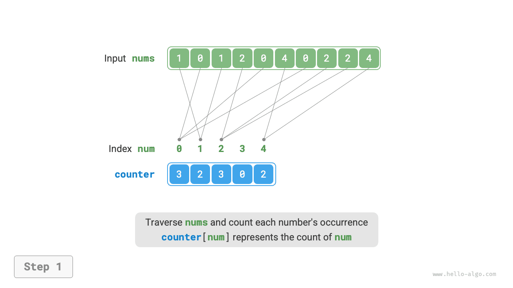
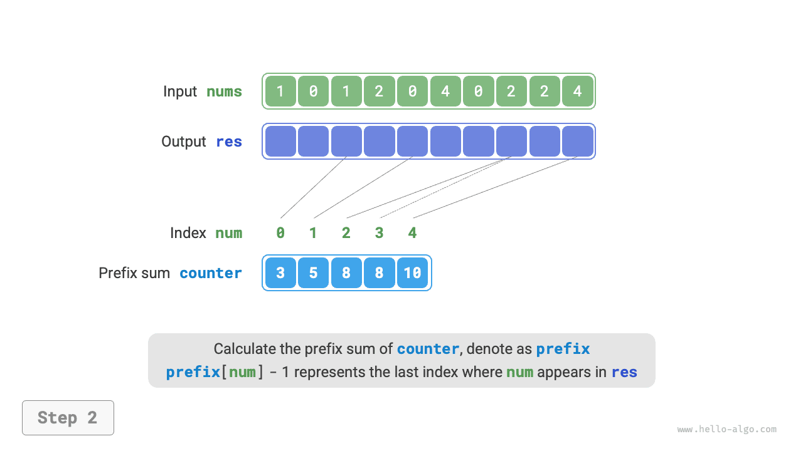
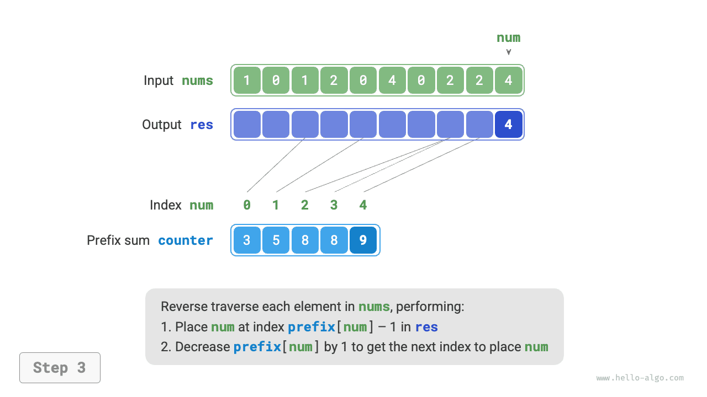
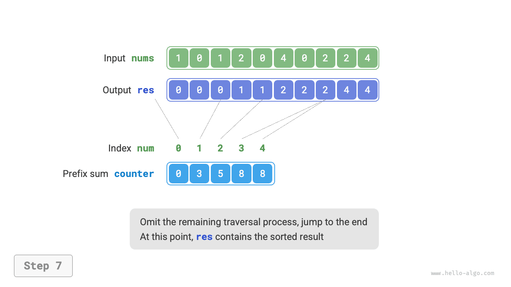

# Đếm Sắp xếp

<u>Counting sort</u> sorts by counting the occurrences of elements and is typically applied to integer arrays.

## Thực hiện đơn giản

Hãy bắt đầu với một ví dụ đơn giản. Cho một mảng `nums` có độ dài $n$, trong đó các phần tử đều là "số nguyên không âm", quy trình sắp xếp tổng thể được hiển thị trong hình bên dưới.

1. Duyệt mảng để tìm số lớn nhất, ký hiệu là $m$, sau đó tạo mảng phụ `bộ đếm` có độ dài $m + 1$.
2. **Sử dụng `bộ đếm` để đếm số lần mỗi số xuất hiện trong `nums`**, trong đó `bộ đếm [num]` lưu trữ số lần xuất hiện của `num`. Điều này rất đơn giản: duyệt qua `nums` (biểu thị số hiện tại bằng `num`) và tăng `counter[num]` lên $1$ mỗi lần.
3. **Vì các chỉ số của `bộ đếm` được sắp xếp tự nhiên nên các số đã được sắp xếp một cách hiệu quả**. Tiếp theo, duyệt qua `bộ đếm` và viết các số trở lại thành `nums` theo thứ tự tăng dần theo số lần xuất hiện của chúng.


Mã này như sau:

```src
[file]{counting_sort}-[class]{}-[func]{counting_sort_naive}
```

!!! lưu ý "Kết nối giữa sắp xếp đếm và sắp xếp nhóm"

Từ góc độ sắp xếp nhóm, mỗi chỉ mục của mảng đếm `bộ đếm` có thể được xem dưới dạng một nhóm và quá trình đếm có thể được xem như là phân phối các phần tử vào các nhóm tương ứng của chúng. Về cơ bản, sắp xếp đếm là trường hợp đặc biệt của sắp xếp nhóm cho dữ liệu số nguyên.

## Thực hiện hoàn chỉnh

Những độc giả tinh ý có thể nhận thấy rằng **nếu dữ liệu đầu vào bao gồm các đối tượng thì bước `3.` ở trên không còn hiệu quả**. Giả sử đầu vào bao gồm các đối tượng sản phẩm và chúng ta muốn sắp xếp chúng theo giá (một biến thành viên của lớp); thuật toán trên chỉ có thể tự tạo ra thứ tự sắp xếp của giá.

Vậy làm thế nào chúng ta có thể có được thứ tự sắp xếp của dữ liệu gốc? Đầu tiên chúng ta tính tổng tiền tố của `counter`. Như tên gợi ý, tổng tiền tố tại chỉ mục `i`, `prefix[i]`, bằng tổng của các phần tử từ chỉ mục `0` đến `i`:

$$
\text{tiền tố[i] = \sum_{j=0}^i \text{counter[j]}
$$

**Tổng tiền tố có cách hiểu rõ ràng: `tiền tố[num] - 1` đưa ra chỉ số lần xuất hiện cuối cùng của phần tử `num` trong mảng kết quả `res`**. Thông tin này rất quan trọng vì nó cho chúng ta biết vị trí của từng phần tử trong mảng kết quả. Tiếp theo, chúng ta duyệt ngược lại mảng `nums` ban đầu và đối với mỗi phần tử `num`, hãy thực hiện hai bước sau.

1. Đặt `num` tại chỉ mục `tiền tố[num] - 1` của mảng `res`.
2. Giảm tổng tiền tố `prefix[num]` xuống $1$ để lấy chỉ mục cho vị trí tiếp theo của `num`.

Sau khi quá trình truyền tải hoàn tất, mảng `res` chứa kết quả được sắp xếp và cuối cùng `res` được sử dụng để ghi đè lên mảng `nums` ban đầu. Luồng sắp xếp đếm hoàn chỉnh được hiển thị trong hình bên dưới.

=== "<1>"
    

=== "<2>"
    

=== "<3>"
    

=== "<4>"
    

=== "<5>"
    

=== "<6>"
    

=== "<7>"
    

=== "<8>"
    

Việc thực hiện sắp xếp đếm được hiển thị dưới đây:

```src
[file]{counting_sort}-[class]{}-[func]{counting_sort}
```

## Đặc điểm thuật toán

- **Độ phức tạp về thời gian là $O(n + m)$ và cách sắp xếp đếm không thích ứng**: Việc duyệt `nums` và `counter` đều mất thời gian tuyến tính. Nói chung, khi $n \gg m$, độ phức tạp về thời gian tiến tới $O(n)$.
- **Độ phức tạp về không gian của $O(n + m)$, sắp xếp không tại chỗ**: Sử dụng mảng `res` và `counter` có độ dài tương ứng là $n$ và $m$.
- **Sắp xếp ổn định**: Vì các phần tử được điền vào `res` theo thứ tự "từ phải sang trái", việc duyệt ngược lại `nums` có thể tránh thay đổi vị trí tương đối của các phần tử bằng nhau, từ đó đạt được sự sắp xếp ổn định. Trên thực tế, việc duyệt qua `nums` theo thứ tự thuận cũng có thể mang lại kết quả sắp xếp chính xác, nhưng kết quả sẽ không ổn định.

## Hạn chế

Tại thời điểm này, bạn có thể nghĩ việc sắp xếp đếm khá khéo léo vì nó đạt được sự sắp xếp hiệu quả chỉ bằng cách đếm số lần xuất hiện. Tuy nhiên, các điều kiện tiên quyết để sử dụng tính năng sắp xếp đếm khá hạn chế.

**Sắp xếp đếm chỉ áp dụng cho số nguyên không âm**. Để áp dụng nó cho các loại dữ liệu khác, bạn phải đảm bảo rằng chúng có thể được chuyển đổi thành số nguyên không âm mà không thay đổi thứ tự tương đối của các phần tử. Ví dụ: đối với một mảng số nguyên chứa số âm, trước tiên bạn có thể thêm hằng số vào mỗi số để chuyển chúng sang phạm vi không âm, sau đó chuyển chúng trở lại sau khi sắp xếp.

**Sắp xếp đếm rất phù hợp với các trường hợp có nhiều phần tử nhưng phạm vi giá trị nhỏ**. Ví dụ: trong kịch bản trên, $m$ không thể quá lớn; nếu không, nó tiêu tốn quá nhiều không gian. Và khi $n \ll m$, việc sắp xếp việc đếm mất $O(m)$ thời gian, có thể chậm hơn so với các thuật toán sắp xếp có độ phức tạp về thời gian $O(n \log n)$.
