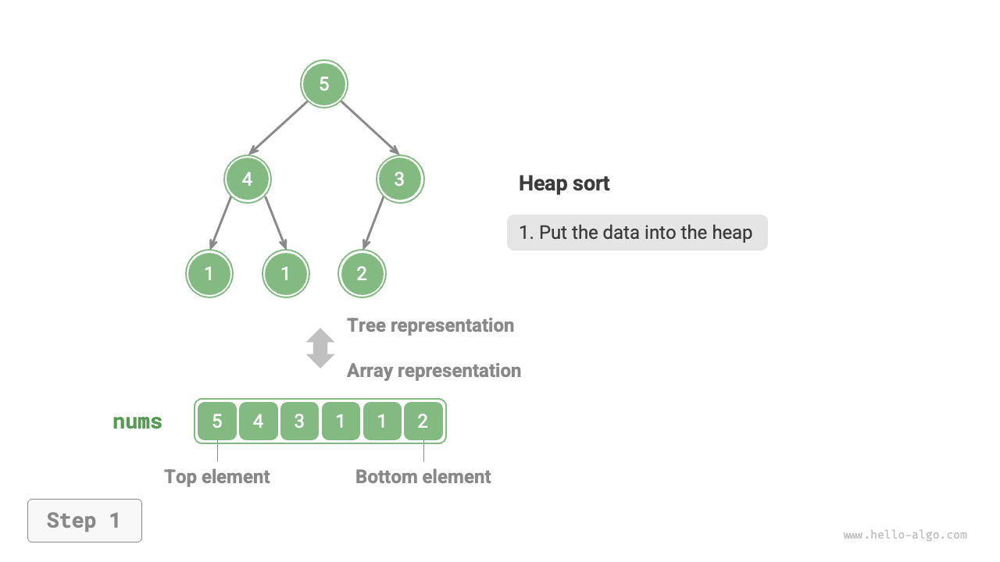
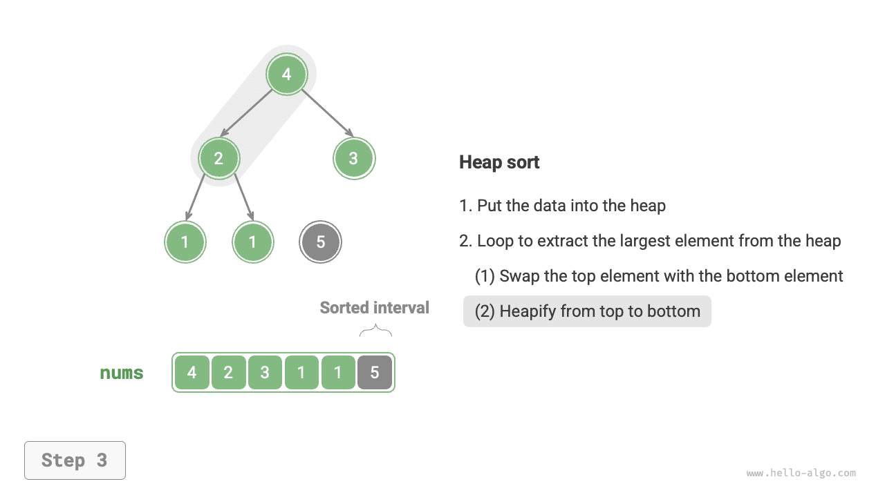
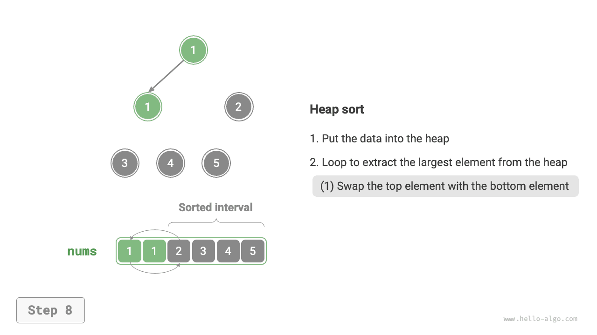
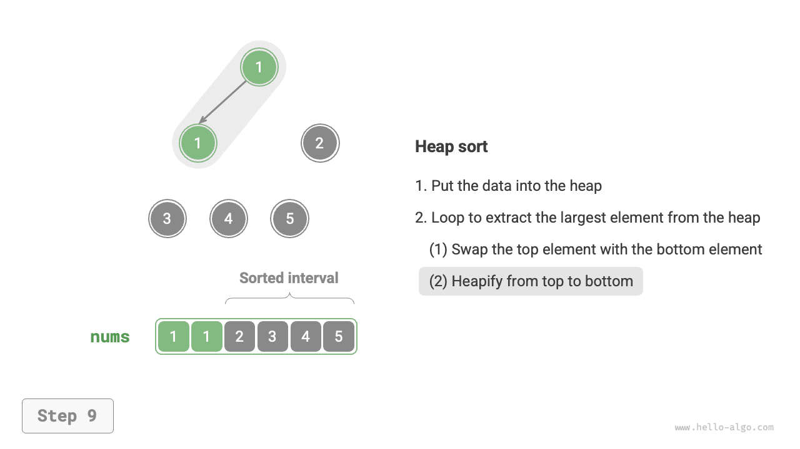
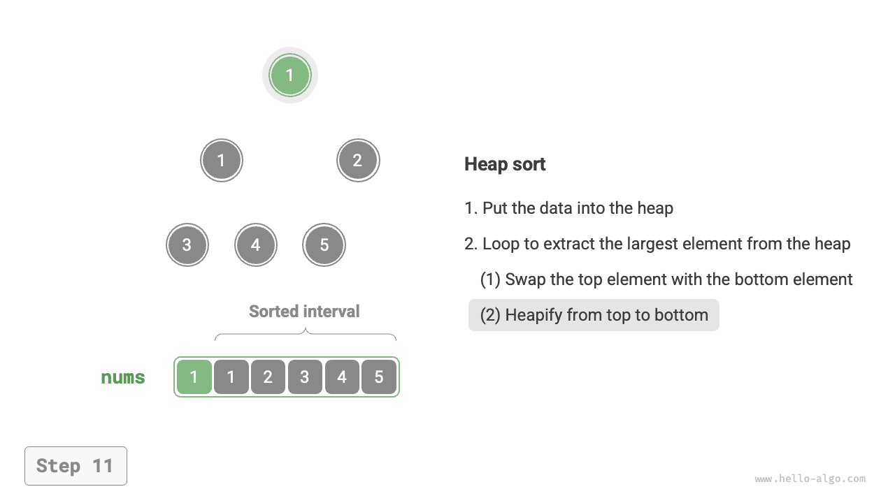
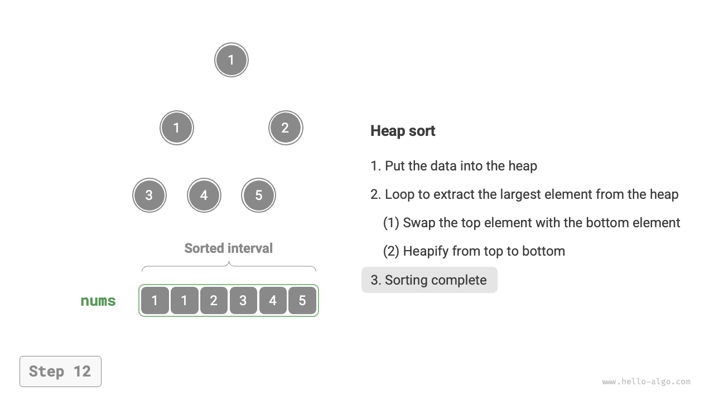

# Sắp xếp đống

!!! mẹo

Trước khi đọc phần này, hãy đảm bảo bạn đã hoàn thành chương "Heap".

<u>Heap sort</u> is an efficient sorting algorithm based on the heap data structure. We can implement heap sort using the heap construction and element removal operations introduced earlier.

1. Nhập mảng và xây dựng vùng heap tối thiểu, tại đó phần tử nhỏ nhất nằm ở đỉnh heap.
2. Thực hiện liên tục các thao tác loại bỏ phần tử và ghi lại các phần tử bị loại bỏ để có được thứ tự sắp xếp tăng dần.

Mặc dù phương pháp trên khả thi nhưng nó yêu cầu một mảng bổ sung để lưu các phần tử được bật ra, điều này khá lãng phí dung lượng. Trong thực tế, chúng tôi thường sử dụng một phương pháp triển khai tinh tế hơn.

## Luồng thuật toán

Giả sử độ dài mảng là $n$. Luồng sắp xếp đống được hiển thị trong hình bên dưới.

1. Nhập mảng và xây dựng vùng heap tối đa. Sau khi hoàn thành, phần tử lớn nhất nằm ở đỉnh heap.
2. Hoán đổi phần tử trên cùng của heap (phần tử đầu tiên) với phần tử dưới cùng của heap (phần tử cuối cùng). Sau khi hoán đổi hoàn tất, hãy giảm độ dài vùng heap xuống $1$ và tăng số lượng phần tử được sắp xếp thêm $1$.
3. Bắt đầu từ phần tử trên cùng của heap, thực hiện thao tác heapify từ trên xuống dưới (sàng lọc xuống). Sau khi heapify hoàn tất, thuộc tính heap được khôi phục.
4. Lặp lại các bước `2.` và `3.` Sau $n - 1$ vòng, mảng được sắp xếp.

!!! mẹo

Trên thực tế, thao tác loại bỏ phần tử còn bao gồm các bước `2.` và `3.`, có thêm bước loại bỏ phần tử.

=== "<1>"
    

=== "<2>"
    

=== "<3>"
    

=== "<4>"
    

=== "<5>"
    

=== "<6>"
    

=== "<7>"
    

=== "<8>"
    

=== "<9>"
    

=== "<10>"
    

=== "<11>"
    

=== "<12>"
    

Trong đoạn mã bên dưới, chúng ta sử dụng cùng hàm `sift_down()` để tạo đống dữ liệu từ trên xuống dưới như trong chương "Heap". Điều đáng chú ý là do độ dài heap giảm khi phần tử lớn nhất được trích xuất, chúng ta cần thêm tham số độ dài $n$ vào `sift_down()` để chỉ định độ dài hiệu dụng hiện tại của heap. Mã này như sau:

```src
[file]{heap_sort}-[class]{}-[func]{heap_sort}
```

## Đặc điểm thuật toán

- **Độ phức tạp về thời gian là $O(n \log n)$; Sắp xếp heap không thích ứng**: Quá trình xây dựng heap mất $O(n)$ thời gian. Việc trích xuất phần tử lớn nhất từ ​​heap mất $O(\log n)$ thời gian và việc này được lặp lại với tổng số vòng $n - 1$.
- **Độ phức tạp của không gian là $O(1)$; Sắp xếp heap được thực hiện đúng chỗ**: Một vài biến con trỏ sử dụng khoảng trắng $O(1)$. Hoán đổi phần tử và heapify đều được thực hiện trên mảng ban đầu.
- **Sắp xếp không ổn định**: Khi hoán đổi phần tử trên cùng và phần tử dưới cùng của heap, vị trí tương đối của các phần tử bằng nhau có thể thay đổi.
