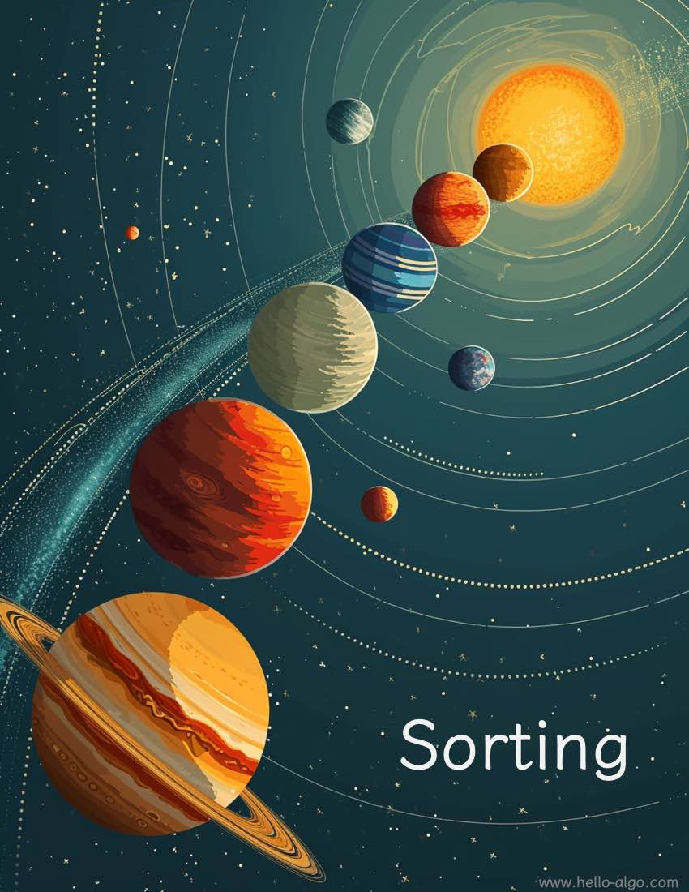

# Sắp xếp

!!! trừu tượng

Sắp xếp giống như một chiếc chìa khóa thần kỳ có thể biến sự hỗn loạn thành trật tự, giúp chúng ta hiểu và xử lý dữ liệu hiệu quả hơn.

Từ thứ tự tăng dần đơn giản đến các sơ đồ phân loại phức tạp hơn, việc sắp xếp cho thấy vẻ đẹp hài hòa của dữ liệu.
