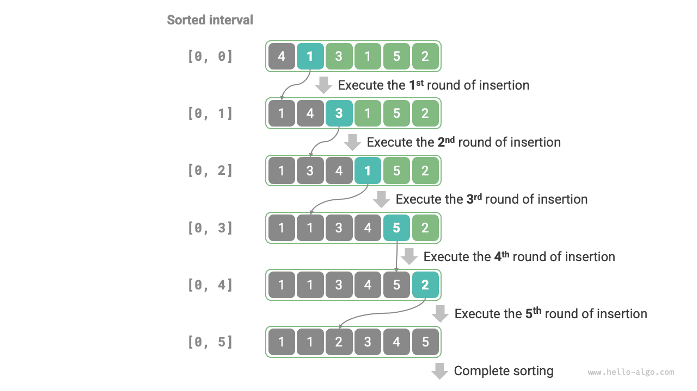

# Sắp xếp chèn

<u>Insertion sort</u> is a simple sorting algorithm that works very similarly to the process of manually sorting a deck of cards.

Cụ thể, chúng tôi chọn một phần tử cơ sở từ phần chưa được sắp xếp, so sánh từng phần tử đó với các phần tử trong phần được sắp xếp ở bên trái của nó và chèn nó vào đúng vị trí.

Hình dưới đây minh họa cách chèn một phần tử vào một mảng. Đặt phần tử cơ sở là `base`. Chúng ta cần dịch chuyển tất cả các phần tử giữa chỉ mục đích và `base` một vị trí sang phải, sau đó gán `base` cho chỉ mục đích.


## Luồng thuật toán

Luồng sắp xếp chèn tổng thể được hiển thị trong hình bên dưới.

1. Ban đầu, phần tử đầu tiên của mảng đã được sắp xếp.
2. Chọn phần tử thứ hai của mảng làm `base`, và sau khi chèn nó vào đúng vị trí, **2 phần tử đầu tiên của mảng được sắp xếp**.
3. Chọn phần tử thứ ba làm `base`, và sau khi chèn nó vào đúng vị trí, **3 phần tử đầu tiên của mảng được sắp xếp**.
4. Và vân vân. Ở vòng cuối cùng, chọn phần tử cuối cùng làm `base` và sau khi chèn nó vào đúng vị trí, **tất cả các phần tử được sắp xếp**.



Mã ví dụ như sau:

```src
[file]{insertion_sort}-[class]{}-[func]{insertion_sort}
```

## Đặc điểm thuật toán

- **Độ phức tạp về thời gian của $O(n^2)$, sắp xếp thích ứng**: Trong trường hợp xấu nhất, các thao tác chèn yêu cầu lần lặp $n - 1$, $n-2$, $\dots$, $2$ và $1$, tổng cộng là $(n - 1) n / 2$, do đó độ phức tạp về thời gian là $O(n^2)$. Khi dữ liệu đã được sắp xếp, mỗi thao tác chèn sẽ kết thúc sớm. Khi mảng đầu vào được sắp xếp hoàn toàn, kiểu sắp xếp chèn đạt được độ phức tạp về thời gian trong trường hợp tốt nhất là $O(n)$.
- **Độ phức tạp về không gian của $O(1)$, sắp xếp tại chỗ**: Con trỏ $i$ và $j$ sử dụng một lượng không gian bổ sung không đổi.
- **Sắp xếp ổn định**: Trong quá trình chèn, chúng ta đặt các phần tử ở bên phải các phần tử bằng nhau nên thứ tự tương đối của chúng không thay đổi.

## Ưu điểm của sắp xếp chèn

Độ phức tạp về thời gian của sắp xếp chèn là $O(n^2)$, trong khi độ phức tạp về thời gian của sắp xếp nhanh, mà chúng ta sẽ tìm hiểu tiếp theo, là $O(n \log n)$. Mặc dù sắp xếp chèn có độ phức tạp về thời gian cao hơn, **nó thường nhanh hơn trên các tập dữ liệu nhỏ**.

Kết luận này tương tự như kết luận về việc áp dụng tìm kiếm tuyến tính và tìm kiếm nhị phân. Các thuật toán như sắp xếp nhanh, với độ phức tạp $O(n \log n)$, là các thuật toán sắp xếp chia để trị và thường liên quan đến các hoạt động nguyên thủy hơn. Khi tập dữ liệu nhỏ, các giá trị của $n^2$ và $n \log n$ tương đối gần nhau, do đó độ phức tạp tiệm cận không chiếm ưu thế; thay vào đó, số lượng thao tác nguyên thủy trong mỗi vòng trở thành yếu tố quyết định.

Trên thực tế, các hàm sắp xếp tích hợp của nhiều ngôn ngữ lập trình (chẳng hạn như Java) sử dụng tính năng sắp xếp chèn. Ý tưởng chung là: đối với các mảng lớn, hãy sử dụng các thuật toán sắp xếp chia để trị như sắp xếp nhanh; đối với mảng ngắn, hãy sử dụng tính năng sắp xếp chèn trực tiếp.

Mặc dù sắp xếp nổi bọt, sắp xếp lựa chọn và sắp xếp chèn đều có độ phức tạp về thời gian là $O(n^2)$, nhưng trong các tình huống thực tế, **sắp xếp chèn được sử dụng thường xuyên hơn đáng kể so với sắp xếp bong bóng và sắp xếp lựa chọn**, chủ yếu vì những lý do sau.

- Sắp xếp bong bóng được thực hiện thông qua hoán đổi phần tử, yêu cầu một biến tạm thời và bao gồm 3 thao tác nguyên thủy; sắp xếp chèn được thực hiện thông qua việc gán phần tử và chỉ yêu cầu 1 thao tác nguyên thủy. Do đó, **sắp xếp bong bóng thường có chi phí tính toán cao hơn so với sắp xếp chèn**.
- Sắp xếp lựa chọn có độ phức tạp về thời gian là $O(n^2)$ trong mọi trường hợp. **Nếu được cung cấp một tập hợp dữ liệu được sắp xếp một phần, sắp xếp chèn thường hiệu quả hơn sắp xếp chọn**.
- Sắp xếp lựa chọn không ổn định và không thể áp dụng cho sắp xếp đa cấp.
