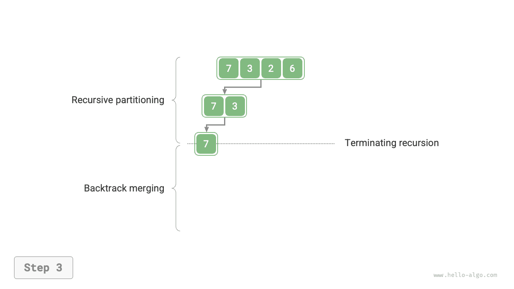
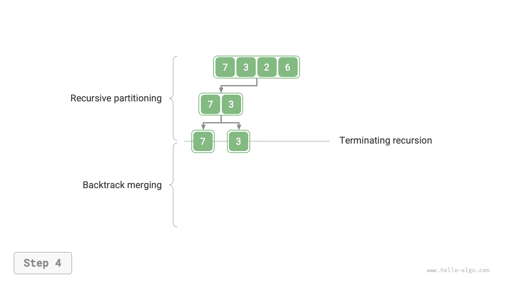
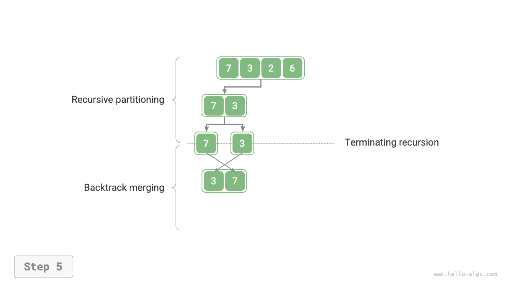
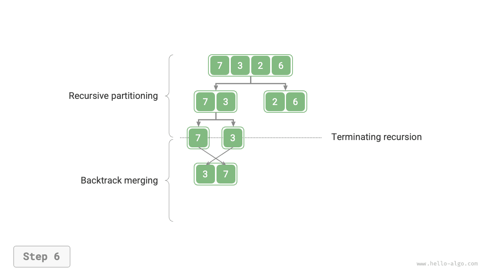
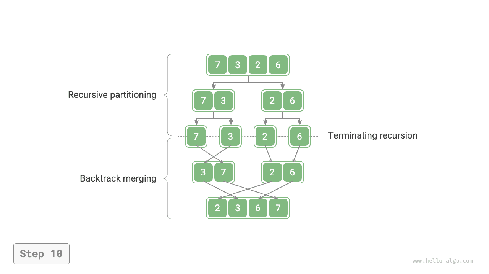

<u>Merge sort</u> is a sorting algorithm based on a divide-and-conquer strategy, consisting of the "divide" and "merge" phases shown in the figure below.

1. **Chia pha**: Chia mảng đệ quy tại điểm giữa, giảm bài toán sắp xếp mảng dài thành bài toán sắp xếp mảng ngắn hơn.
2. **Giai đoạn hợp nhất**: Khi một mảng con có độ dài 1, dừng chia và bắt đầu hợp nhất, liên tục kết hợp các mảng con được sắp xếp ngắn hơn ở bên trái và bên phải thành một mảng được sắp xếp dài hơn cho đến khi quá trình hoàn tất.


## Luồng thuật toán

Như được hiển thị trong hình bên dưới, "pha phân chia" sẽ chia mảng một cách đệ quy từ điểm giữa thành hai mảng con từ trên xuống dưới.

1. Tính trung điểm mảng `mid`, chia đệ quy mảng con bên trái (khoảng `[left, mid]`) và mảng con bên phải (khoảng `[mid + 1, right]`).
2. Lặp lại bước `1.` theo cách đệ quy cho đến khi một mảng con có độ dài 1.

"Giai đoạn hợp nhất" hợp nhất các mảng con bên trái và bên phải thành một mảng được sắp xếp từ dưới lên trên. Lưu ý rằng việc hợp nhất bắt đầu từ các mảng con có độ dài 1, vì vậy mọi mảng con liên quan đến giai đoạn này đều đã được sắp xếp.

=== "<1>"
    

=== "<2>"
    

=== "<3>"
    

=== "<4>"
    

=== "<5>"
    

=== "<6>"
    

=== "<7>"
    

=== "<8>"
    

=== "<9>"
    

=== "<10>"
    

Thứ tự đệ quy của sắp xếp hợp nhất nhất quán với việc duyệt thứ tự sau của cây nhị phân.

- **Truyền tải theo thứ tự sau**: Đầu tiên duyệt đệ quy cây con bên trái, sau đó duyệt đệ quy cây con bên phải và cuối cùng xử lý nút gốc.
- **Sắp xếp hợp nhất**: Đầu tiên xử lý đệ quy mảng con bên trái, sau đó xử lý đệ quy mảng con bên phải và cuối cùng thực hiện hợp nhất.

Việc triển khai sắp xếp hợp nhất được hiển thị trong mã bên dưới. Lưu ý rằng khoảng được hợp nhất trong `nums` là `[left, right]`, trong khi khoảng tương ứng trong `tmp` là `[0, right - left]`.

```src
[file]{merge_sort}-[class]{}-[func]{merge_sort}
```

## Đặc điểm thuật toán

- **Độ phức tạp về thời gian là $O(n \log n)$; sắp xếp hợp nhất không thích ứng**: Giai đoạn phân chia tạo ra một cây đệ quy có chiều cao $\log n$ và tổng số thao tác được thực hiện trong quá trình hợp nhất ở mỗi cấp độ là $n$, do đó độ phức tạp về thời gian tổng thể là $O(n \log n)$.
- **Độ phức tạp của không gian là $O(n)$; sắp xếp hợp nhất không đúng chỗ**: Độ sâu đệ quy là $\log n$, sử dụng không gian khung ngăn xếp $O(\log n)$. Hoạt động hợp nhất yêu cầu một mảng phụ, sử dụng không gian bổ sung $O(n)$.
- **Sắp xếp ổn định**: Trong quá trình hợp nhất, thứ tự tương đối của các phần tử bằng nhau không thay đổi.

## Sắp xếp danh sách liên kết

Đối với danh sách liên kết, sắp xếp hợp nhất có lợi thế đáng kể so với các thuật toán sắp xếp khác, **và nó có thể giảm độ phức tạp về không gian của tác vụ sắp xếp xuống $O(1)$**.

- **Chia pha**: Phép lặp có thể được sử dụng thay cho phép đệ quy để phân tách danh sách liên kết, từ đó loại bỏ không gian khung ngăn xếp mà phép đệ quy sử dụng.
- **Giai đoạn hợp nhất**: Trong danh sách liên kết, việc chèn và xóa nút chỉ yêu cầu cập nhật con trỏ, do đó giai đoạn hợp nhất (hợp nhất hai danh sách liên kết được sắp xếp ngắn thành một danh sách liên kết được sắp xếp dài hơn) không yêu cầu tạo danh sách liên kết bổ sung.

Các chi tiết thực hiện cụ thể khá phức tạp, bạn đọc quan tâm có thể tham khảo các tài liệu liên quan để học tập.
