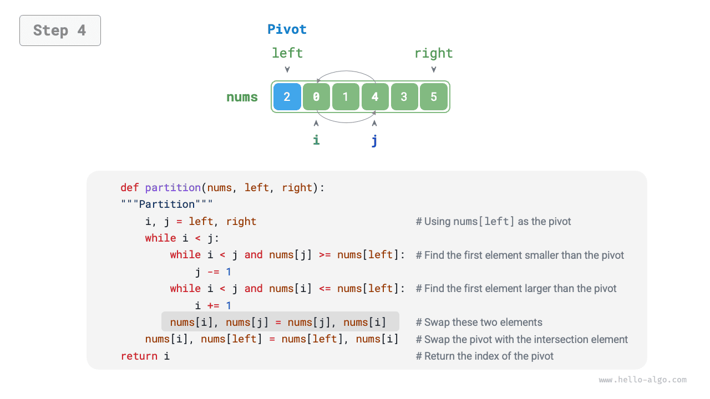

# Sắp xếp nhanh

<u>Quick sort</u> is an efficient and widely used sorting algorithm based on the divide-and-conquer strategy.

Hoạt động cốt lõi của sắp xếp nhanh là "phân vùng trọng điểm", với mục tiêu là chọn một phần tử làm "trục xoay", di chuyển tất cả các phần tử nhỏ hơn trục xoay sang trái và di chuyển tất cả các phần tử lớn hơn trục quay sang bên phải của nó. Cụ thể, quá trình này được thể hiện trong hình dưới đây.

1. Chọn phần tử ngoài cùng bên trái làm trục và khởi tạo hai con trỏ `i` và `j` ở hai đầu của mảng.
2. Nhập một vòng lặp. Trong mỗi vòng, sử dụng `i` (`j`) để tìm phần tử đầu tiên lớn hơn (nhỏ hơn) trục xoay, sau đó hoán đổi hai phần tử.
3. Lặp lại bước `2.` cho đến khi `i` và `j` gặp nhau, sau đó hoán đổi trục xoay vào vị trí biên giữa hai mảng con.

=== "<1>"
    

=== "<2>"
    

=== "<3>"
    

=== "<4>"
    

=== "<5>"
    

=== "<6>"
    

=== "<7>"
    

=== "<8>"
    

=== "<9>"
    

Sau khi phân vùng trọng điểm, mảng ban đầu được chia thành ba phần: mảng con bên trái, mảng con trục và mảng con bên phải, sao cho "bất kỳ phần tử nào trong mảng con bên trái $\leq$ trục $\leq$ bất kỳ phần tử nào trong mảng con bên phải". Vì vậy, chúng ta chỉ cần sắp xếp hai mảng con tiếp theo.

!!! lưu ý "Chiến lược chia để trị nhanh chóng"

Bản chất của phân vùng trọng điểm là đơn giản hóa bài toán sắp xếp của một mảng dài hơn thành bài toán sắp xếp của hai mảng ngắn hơn.

```src
[file]{quick_sort}-[class]{quick_sort}-[func]{partition}
```

## Luồng thuật toán

Luồng tổng thể của sắp xếp nhanh được hiển thị trong hình bên dưới.

1. Đầu tiên, thực hiện một "phân vùng trọng điểm" trên mảng ban đầu để thu được mảng con bên trái và mảng con bên phải chưa được sắp xếp.
2. Sau đó, thực hiện đệ quy "phân vùng trọng điểm" trên mảng con bên trái và mảng con bên phải tương ứng.
3. Tiếp tục đệ quy cho đến khi độ dài mảng con là 1, lúc đó việc sắp xếp toàn bộ mảng hoàn tất.


```src
[file]{quick_sort}-[class]{quick_sort}-[func]{quick_sort}
```

## Đặc điểm thuật toán

- **Độ phức tạp về thời gian của $O(n \log n)$, sắp xếp không thích ứng**: Trung bình, phân vùng trọng điểm tạo ra $\log n$ mức đệ quy và tổng số lần lặp vòng lặp trên mỗi cấp là $n$, do đó độ phức tạp về thời gian tổng thể là $O(n \log n)$. Trong trường hợp xấu nhất, mỗi vòng phân vùng trọng điểm sẽ chia một mảng có độ dài $n$ thành các mảng con có độ dài $0$ và $n - 1$. Sau đó, độ sâu đệ quy đạt đến $n$, với các lần lặp vòng lặp $n$ ở mỗi cấp độ, mang lại độ phức tạp về thời gian tổng thể là $O(n^2)$.
- **Độ phức tạp về không gian của $O(n)$, sắp xếp tại chỗ**: Trong trường hợp mảng đầu vào bị đảo ngược hoàn toàn, độ sâu đệ quy kém nhất đạt tới $n$, sử dụng không gian khung ngăn xếp $O(n)$. Hoạt động sắp xếp được thực hiện trên mảng ban đầu mà không cần sự trợ giúp của mảng bổ sung.
- **Sắp xếp không ổn định**: Ở bước cuối cùng của quá trình phân vùng trọng điểm, trục có thể bị hoán đổi sang bên phải của phần tử bằng nhau.

## Tại sao sắp xếp nhanh lại nhanh

Đúng như tên gọi, sắp xếp nhanh có lợi thế rõ ràng về hiệu quả. Mặc dù độ phức tạp về thời gian trung bình của nó giống như độ phức tạp của "sắp xếp hợp nhất" và "sắp xếp đống", nhưng trên thực tế, sắp xếp nhanh thường nhanh hơn vì những lý do sau.

- **Trường hợp xấu nhất khó có thể xảy ra**: Mặc dù độ phức tạp về thời gian trong trường hợp xấu nhất của sắp xếp nhanh là $O(n^2)$ và hiệu suất của nó khó dự đoán hơn so với sắp xếp hợp nhất, nhưng sắp xếp nhanh chạy trong thời gian $O(n \log n)$ trong phần lớn các trường hợp.
- **Hiệu suất bộ đệm cao**: Trong quá trình phân vùng trọng điểm, hệ thống có thể tải toàn bộ mảng con vào bộ đệm nên việc truy cập các phần tử tương đối hiệu quả. Ngược lại, các thuật toán như "sắp xếp đống" yêu cầu quyền truy cập không liền kề vào các phần tử và do đó không có lợi thế này.
- **Hệ số hằng số nhỏ**: Trong số ba thuật toán trên, sắp xếp nhanh thực hiện tổng số phép so sánh, phép gán và hoán đổi ít nhất. Điều này tương tự như lý do tại sao "sắp xếp chèn" nhanh hơn "sắp xếp bong bóng".

## Tối ưu hóa trục

**Sắp xếp nhanh có thể trở nên kém hiệu quả hơn về thời gian đối với một số đầu vào nhất định**. Hãy xem xét một ví dụ điển hình trong đó mảng đầu vào được sắp xếp theo thứ tự giảm dần hoàn toàn. Bởi vì chúng tôi chọn phần tử ngoài cùng bên trái làm trục, sau khi phân vùng trọng điểm hoàn tất, trục được hoán đổi sang phía ngoài cùng bên phải của mảng, để lại một mảng con bên trái có độ dài $n - 1$ và một mảng con bên phải có độ dài $0$. Nếu điều này tiếp tục theo cách đệ quy, mỗi vòng phân vùng trọng điểm sẽ tạo ra một mảng con có độ dài $0$, chiến lược chia để trị sẽ bị hỏng và sắp xếp nhanh sẽ suy biến thành một phép tính gần đúng của "sắp xếp bong bóng".

Để giảm khả năng điều này xảy ra, **chúng tôi có thể tối ưu hóa chiến lược lựa chọn trục được sử dụng trong phân vùng trọng điểm**. Ví dụ: chúng ta có thể chọn một trục một cách ngẫu nhiên. Tuy nhiên, nếu chúng ta không may mắn và liên tục chọn những trục xoay kém, hiệu suất vẫn có thể không đạt yêu cầu.

Cần lưu ý rằng các ngôn ngữ lập trình thường tạo ra "số giả ngẫu nhiên". Nếu chúng ta xây dựng một trường hợp thử nghiệm cụ thể dựa trên chuỗi giả ngẫu nhiên, việc sắp xếp nhanh vẫn có thể bị giảm hiệu suất.

Để cải thiện hơn nữa, chúng ta có thể chọn ba phần tử ứng cử viên từ mảng, thường là phần tử đầu tiên, cuối cùng và ở giữa, **và sử dụng trung vị của ba phần tử đó làm trục**. Điều này làm tăng đáng kể khả năng trục quay "không quá nhỏ cũng không quá lớn". Chúng ta cũng có thể chọn nhiều phần tử ứng cử viên hơn để cải thiện hơn nữa tính mạnh mẽ của thuật toán. Với phương pháp này, xác suất độ phức tạp về thời gian giảm xuống $O(n^2)$ sẽ giảm đáng kể.

Mã ví dụ như sau:

```src
[file]{quick_sort}-[class]{quick_sort_median}-[func]{partition}
```

## Tối ưu hóa độ sâu đệ quy

**Sắp xếp nhanh cũng có thể sử dụng nhiều không gian hơn cho một số đầu vào nhất định**. Hãy xem xét một mảng đầu vào được sắp xếp đầy đủ. Đặt độ dài của mảng con hiện tại trong đệ quy là $m$. Mỗi vòng phân vùng trọng điểm tạo ra một mảng con bên trái có độ dài $0$ và một mảng con bên phải có độ dài $m - 1$, có nghĩa là mỗi lệnh gọi đệ quy sẽ giảm kích thước bài toán chỉ bằng một phần tử. Do đó, cây đệ quy có thể đạt tới độ cao $n - 1$, yêu cầu không gian khung ngăn xếp $O(n)$.

Để ngăn các khung ngăn xếp tích lũy, chúng ta có thể so sánh độ dài của hai mảng con sau mỗi vòng phân vùng trọng điểm, **và chỉ lặp lại trên mảng ngắn hơn**. Bởi vì mảng con ngắn hơn có độ dài tối đa $n / 2$, phương pháp này đảm bảo rằng độ sâu đệ quy không vượt quá $\log n$, giảm độ phức tạp không gian trong trường hợp xấu nhất xuống $O(\log n)$. Mã được hiển thị dưới đây:

```src
[file]{quick_sort}-[class]{quick_sort_tail_call}-[func]{quick_sort}
```
