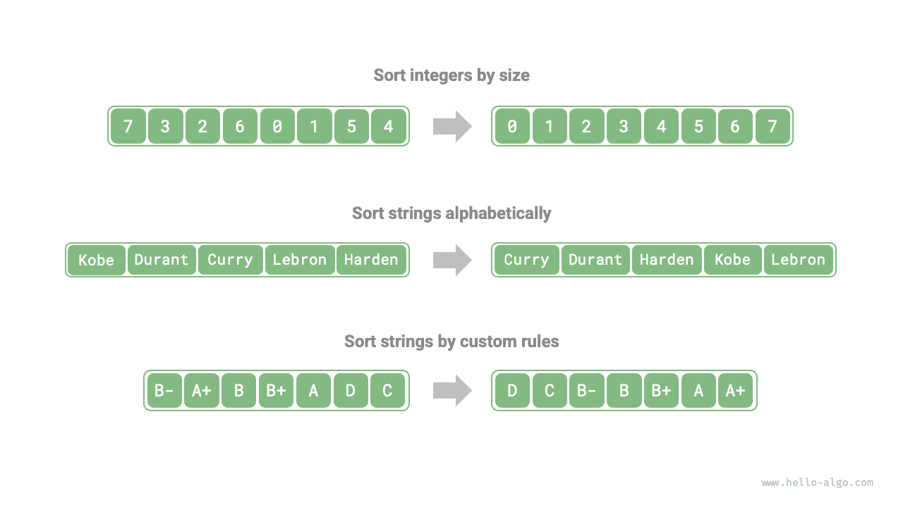

#Thuật toán sắp xếp

<u>Thuật toán sắp xếp</u> sắp xếp một tập hợp dữ liệu theo một thứ tự cụ thể. Thuật toán sắp xếp có ứng dụng rộng rãi vì dữ liệu được sắp xếp thường có thể được tìm kiếm, phân tích và xử lý hiệu quả hơn.

Như thể hiện trong hình bên dưới, dữ liệu được sắp xếp có thể là số nguyên, số dấu phẩy động, ký tự, chuỗi, v.v. Quy tắc sắp xếp có thể được xác định khi cần thiết, chẳng hạn như thứ tự số, thứ tự ASCII hoặc quy tắc tùy chỉnh.



## Kích thước đánh giá

**Hiệu quả thực thi**: Chúng tôi kỳ vọng độ phức tạp về thời gian của các thuật toán sắp xếp sẽ ở mức thấp nhất có thể, với tổng số thao tác nhỏ hơn (giảm hệ số không đổi trong độ phức tạp thời gian). Đối với khối lượng dữ liệu lớn, hiệu quả thực hiện là đặc biệt quan trọng.

**Thuộc tính tại chỗ**: Như tên ngụ ý, <u>sắp xếp tại chỗ</u> thực hiện sắp xếp bằng cách thao tác trực tiếp trên mảng ban đầu mà không yêu cầu các mảng phụ trợ bổ sung, do đó tiết kiệm bộ nhớ. Thông thường, sắp xếp tại chỗ bao gồm ít thao tác di chuyển dữ liệu hơn và chạy nhanh hơn.

**Tính ổn định**: <u>Sắp xếp ổn định</u> đảm bảo rằng thứ tự tương đối của các phần tử bằng nhau trong mảng không thay đổi sau khi hoàn tất việc sắp xếp.

Sắp xếp ổn định là điều kiện cần thiết cho các kịch bản sắp xếp đa cấp. Giả sử chúng ta có một bảng lưu trữ thông tin học sinh, trong đó cột 1 và cột 2 lần lượt là tên và tuổi. Trong trường hợp này, <u>sắp xếp không ổn định</u> có thể làm mất tính chất trật tự của dữ liệu đầu vào:

```shell
# The input data is sorted by name
# (name, age)
  ('A', 19)
  ('B', 18)
  ('C', 21)
  ('D', 19)
  ('E', 23)

# Suppose we use an unstable sorting algorithm to sort the list by age.
# In the result, the relative positions of ('D', 19) and ('A', 19) change,
# so the property that the input data is sorted by name is lost.
  ('B', 18)
  ('D', 19)
  ('A', 19)
  ('C', 21)
  ('E', 23)
```

**Khả năng thích ứng**: <u>Sắp xếp thích ứng</u> có thể sử dụng thông tin đơn hàng hiện có trong dữ liệu đầu vào để giảm lượng tính toán, đạt hiệu quả thời gian tốt hơn. Độ phức tạp thời gian trong trường hợp tốt nhất của thuật toán sắp xếp thích ứng thường tốt hơn độ phức tạp thời gian trung bình.

**Dựa trên so sánh hoặc không so sánh**: <u>Sắp xếp dựa trên so sánh</u> dựa vào toán tử so sánh ($<$, $=$, $>$) để xác định thứ tự tương đối của các phần tử, từ đó sắp xếp toàn bộ mảng, với độ phức tạp về thời gian tối ưu về mặt lý thuyết là $O(n \log n)$. <u>Sắp xếp không so sánh</u> không sử dụng toán tử so sánh và có thể đạt được độ phức tạp về thời gian là $O(n)$, nhưng tính linh hoạt của nó tương đối hạn chế.

## Thuật toán sắp xếp lý tưởng

**Nhanh chóng, tại chỗ, ổn định, thích ứng và áp dụng rộng rãi**. Rõ ràng cho đến nay chưa có thuật toán sắp xếp nào được phát hiện có thể kết hợp tất cả các đặc điểm này. Vì vậy, khi lựa chọn thuật toán sắp xếp cần quyết định dựa trên đặc điểm cụ thể của dữ liệu và yêu cầu của bài toán.

Tiếp theo, chúng ta sẽ xem xét các thuật toán sắp xếp khác nhau và phân tích ưu điểm cũng như nhược điểm của chúng dựa trên các khía cạnh đánh giá ở trên.
