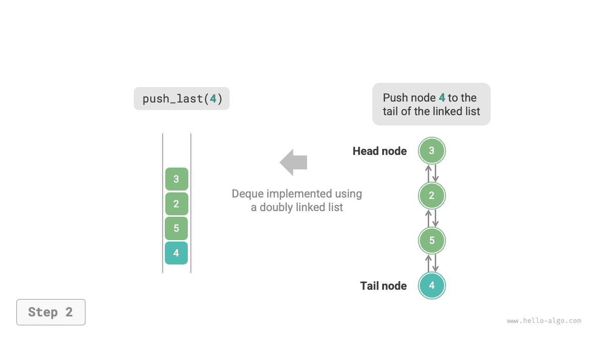
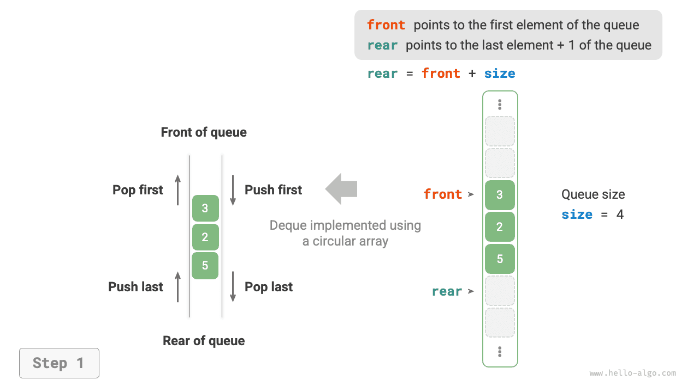

# Deque

Trong hàng đợi, chúng ta chỉ có thể xóa các phần tử ở phía trước hoặc thêm các phần tử ở phía sau. Như minh họa trong hình bên dưới, <u>hàng đợi hai đầu (deque)</u> mang lại sự linh hoạt cao hơn, cho phép thêm hoặc xóa các phần tử ở cả phía trước và phía sau.


## Hoạt động Deque phổ biến

Các hoạt động phổ biến trên deque được hiển thị trong bảng bên dưới. Tên phương thức cụ thể phụ thuộc vào ngôn ngữ lập trình được sử dụng.

<p align="center"> Table <id> &nbsp; Efficiency of Deque Operations </p>

| Phương pháp | Mô tả | Độ phức tạp thời gian |
| -------------- | ------------------------- | --------------- |
| `push_first()` | Thêm phần tử vào phía trước | $O(1)$ |
| `push_last()` | Thêm phần tử vào phía sau | $O(1)$ |
| `pop_first()` | Xóa phần tử phía trước | $O(1)$ |
| `pop_last()` | Loại bỏ phần tử phía sau | $O(1)$ |
| `peek_first()` | Truy cập phần tử phía trước | $O(1)$ |
| `peek_last()` | Truy cập phần tử phía sau | $O(1)$ |

Tương tự, chúng ta có thể sử dụng trực tiếp các lớp deque do ngôn ngữ lập trình cung cấp:

=== "Python"

    ```python title="deque.py"
    from collections import deque

    # Initialize deque
    deq: deque[int] = deque()

    # Enqueue elements
    deq.append(2)      # Add to rear
    deq.append(5)
    deq.append(4)
    deq.appendleft(3)  # Add to front
    deq.appendleft(1)

    # Access elements
    front: int = deq[0]  # Front element
    rear: int = deq[-1]  # Rear element

    # Dequeue elements
    pop_front: int = deq.popleft()  # Front element dequeue
    pop_rear: int = deq.pop()       # Rear element dequeue

    # Get deque length
    size: int = len(deq)

    # Check if deque is empty
    is_empty: bool = len(deq) == 0
    ```

=== "C++"

    ```cpp title="deque.cpp"
    /* Initialize deque */
    deque<int> deque;

    /* Enqueue elements */
    deque.push_back(2);   // Add to rear
    deque.push_back(5);
    deque.push_back(4);
    deque.push_front(3);  // Add to front
    deque.push_front(1);

    /* Access elements */
    int front = deque.front(); // Front element
    int back = deque.back();   // Rear element

    /* Dequeue elements */
    deque.pop_front();  // Front element dequeue
    deque.pop_back();   // Rear element dequeue

    /* Get deque length */
    int size = deque.size();

    /* Check if deque is empty */
    bool empty = deque.empty();
    ```

=== "Java"

    ```java title="deque.java"
    /* Initialize deque */
    Deque<Integer> deque = new LinkedList<>();

    /* Enqueue elements */
    deque.offerLast(2);   // Add to rear
    deque.offerLast(5);
    deque.offerLast(4);
    deque.offerFirst(3);  // Add to front
    deque.offerFirst(1);

    /* Access elements */
    int peekFirst = deque.peekFirst();  // Front element
    int peekLast = deque.peekLast();    // Rear element

    /* Dequeue elements */
    int popFirst = deque.pollFirst();  // Front element dequeue
    int popLast = deque.pollLast();    // Rear element dequeue

    /* Get deque length */
    int size = deque.size();

    /* Check if deque is empty */
    boolean isEmpty = deque.isEmpty();
    ```

=== "C#"

    ```csharp title="deque.cs"
    /* Initialize deque */
    // In C#, use LinkedList as a deque
    LinkedList<int> deque = new();

    /* Enqueue elements */
    deque.AddLast(2);   // Add to rear
    deque.AddLast(5);
    deque.AddLast(4);
    deque.AddFirst(3);  // Add to front
    deque.AddFirst(1);

    /* Access elements */
    int peekFirst = deque.First.Value;  // Front element
    int peekLast = deque.Last.Value;    // Rear element

    /* Dequeue elements */
    deque.RemoveFirst();  // Front element dequeue
    deque.RemoveLast();   // Rear element dequeue

    /* Get deque length */
    int size = deque.Count;

    /* Check if deque is empty */
    bool isEmpty = deque.Count == 0;
    ```

=== "Đi"

    ```go title="deque_test.go"
    /* Initialize deque */
    // In Go, use list as a deque
    deque := list.New()

    /* Enqueue elements */
    deque.PushBack(2)      // Add to rear
    deque.PushBack(5)
    deque.PushBack(4)
    deque.PushFront(3)     // Add to front
    deque.PushFront(1)

    /* Access elements */
    front := deque.Front() // Front element
    rear := deque.Back()   // Rear element

    /* Dequeue elements */
    deque.Remove(front)    // Front element dequeue
    deque.Remove(rear)     // Rear element dequeue

    /* Get deque length */
    size := deque.Len()

    /* Check if deque is empty */
    isEmpty := deque.Len() == 0
    ```

=== "Nhanh chóng"

    ```swift title="deque.swift"
    /* Initialize deque */
    // Swift does not have a built-in deque class, can use Array as a deque
    var deque: [Int] = []

    /* Enqueue elements */
    deque.append(2) // Add to rear
    deque.append(5)
    deque.append(4)
    deque.insert(3, at: 0) // Add to front
    deque.insert(1, at: 0)

    /* Access elements */
    let peekFirst = deque.first! // Front element
    let peekLast = deque.last! // Rear element

    /* Dequeue elements */
    // When using Array simulation, popFirst has O(n) complexity
    let popFirst = deque.removeFirst() // Front element dequeue
    let popLast = deque.removeLast() // Rear element dequeue

    /* Get deque length */
    let size = deque.count

    /* Check if deque is empty */
    let isEmpty = deque.isEmpty
    ```

=== "JS"

    ```javascript title="deque.js"
    /* Initialize deque */
    // JavaScript does not have a built-in deque, can only use Array as a deque
    const deque = [];

    /* Enqueue elements */
    deque.push(2);
    deque.push(5);
    deque.push(4);
    // Please note that since it's an array, unshift() has O(n) time complexity
    deque.unshift(3);
    deque.unshift(1);

    /* Access elements */
    const peekFirst = deque[0];
    const peekLast = deque[deque.length - 1];

    /* Dequeue elements */
    // Please note that since it's an array, shift() has O(n) time complexity
    const popFront = deque.shift();
    const popBack = deque.pop();

    /* Get deque length */
    const size = deque.length;

    /* Check if deque is empty */
    const isEmpty = size === 0;
    ```

=== "TS"

    ```typescript title="deque.ts"
    /* Initialize deque */
    // TypeScript does not have a built-in deque, can only use Array as a deque
    const deque: number[] = [];

    /* Enqueue elements */
    deque.push(2);
    deque.push(5);
    deque.push(4);
    // Please note that since it's an array, unshift() has O(n) time complexity
    deque.unshift(3);
    deque.unshift(1);

    /* Access elements */
    const peekFirst: number = deque[0];
    const peekLast: number = deque[deque.length - 1];

    /* Dequeue elements */
    // Please note that since it's an array, shift() has O(n) time complexity
    const popFront: number = deque.shift() as number;
    const popBack: number = deque.pop() as number;

    /* Get deque length */
    const size: number = deque.length;

    /* Check if deque is empty */
    const isEmpty: boolean = size === 0;
    ```

=== "Phi tiêu"

    ```dart title="deque.dart"
    /* Initialize deque */
    // In Dart, Queue is defined as a deque
    Queue<int> deque = Queue<int>();

    /* Enqueue elements */
    deque.addLast(2);  // Add to rear
    deque.addLast(5);
    deque.addLast(4);
    deque.addFirst(3); // Add to front
    deque.addFirst(1);

    /* Access elements */
    int peekFirst = deque.first; // Front element
    int peekLast = deque.last;   // Rear element

    /* Dequeue elements */
    int popFirst = deque.removeFirst(); // Front element dequeue
    int popLast = deque.removeLast();   // Rear element dequeue

    /* Get deque length */
    int size = deque.length;

    /* Check if deque is empty */
    bool isEmpty = deque.isEmpty;
    ```

=== "Rỉ sét"

    ```rust title="deque.rs"
    /* Initialize deque */
    let mut deque: VecDeque<u32> = VecDeque::new();

    /* Enqueue elements */
    deque.push_back(2);  // Add to rear
    deque.push_back(5);
    deque.push_back(4);
    deque.push_front(3); // Add to front
    deque.push_front(1);

    /* Access elements */
    if let Some(front) = deque.front() { // Front element
    }
    if let Some(rear) = deque.back() {   // Rear element
    }

    /* Dequeue elements */
    if let Some(pop_front) = deque.pop_front() { // Front element dequeue
    }
    if let Some(pop_rear) = deque.pop_back() {   // Rear element dequeue
    }

    /* Get deque length */
    let size = deque.len();

    /* Check if deque is empty */
    let is_empty = deque.is_empty();
    ```

=== "C"

    ```c title="deque.c"
    // C does not provide a built-in deque
    ```

=== "Kotlin"

    ```kotlin title="deque.kt"
    /* Initialize deque */
    val deque = LinkedList<Int>()

    /* Enqueue elements */
    deque.offerLast(2)  // Add to rear
    deque.offerLast(5)
    deque.offerLast(4)
    deque.offerFirst(3) // Add to front
    deque.offerFirst(1)

    /* Access elements */
    val peekFirst = deque.peekFirst() // Front element
    val peekLast = deque.peekLast()   // Rear element

    /* Dequeue elements */
    val popFirst = deque.pollFirst() // Front element dequeue
    val popLast = deque.pollLast()   // Rear element dequeue

    /* Get deque length */
    val size = deque.size

    /* Check if deque is empty */
    val isEmpty = deque.isEmpty()
    ```

=== "Ruby"

    ```ruby title="deque.rb"
    # Initialize deque
    # Ruby does not have a built-in deque, can only use Array as a deque
    deque = []

    # Enqueue elements
    deque << 2
    deque << 5
    deque << 4
    # Please note that since it's an array, Array#unshift has O(n) time complexity
    deque.unshift(3)
    deque.unshift(1)

    # Access elements
    peek_first = deque.first
    peek_last = deque.last

    # Dequeue elements
    # Please note that since it's an array, Array#shift has O(n) time complexity
    pop_front = deque.shift
    pop_back = deque.pop

    # Get deque length
    size = deque.length

    # Check if deque is empty
    is_empty = size.zero?
    ```

??? pythontutor "Trực quan hóa mã"

https://pythontutor.com/render.html#code=from%20collections%20import%20deque%0A%0A%22%22%22Driver%20Code%22%22%22%0Aif%20__name__%20%3D%3D%20%22__main__%22%3A %0A%20%20%20%20%23%20%E5%88%9D%E5%A7%8B%E5%8C%96%E5%8F%8C%E5%90%91%E9%98%9F%E5% 88%97%0A%20%20%20%20deq%20%3D%20deque%28%29%0A%0A%20%20%20%20%23%20%E5%85%83%E7 %B4%A0%E5%85%A5%E9%98%9F%0A%20%20%20%20deq.append%282%29%20%20%23%20%E6%B7%BB%E 5%8A%A0%E8%87%B3%E9%98%9F%E5%B0%BE%0A%20%20%20%20deq.append%285%29%0A%20%20%20% 20deq.append%284%29%0A%20%20%20%20deq.appendleft%283%29%20%20%23%20%E6%B7%BB%E5 %8A%A0%E8%87%B3%E9%98%9F%E9%A6%96%0A%20%20%20%20deq.appendleft%281%29%0A%20%20% 20%20print%28%22%E5%8F%8C%E5%90%91%E9%98%9F%E5%88%97%20deque%20%3D%22,%20deq%29 %0A%0A%20%20%20%20%23%20%E8%AE%BF%E9%97%AE%E5%85%83%E7%B4%A0%0A%20%20%20%20fron t%20%3D%20deq%5B0%5D%20%20%23%20%E9%98%9F%E9%A6%96%E5%85%83%E7%B4%A0%0A%20%20%2 0%20print%28%22%E9%98%9F%E9%A6%96%E5%85%83%E7%B4%A0%20front%20%3D%22,%20front%2 9%0A%20%20%20%20phía sau%20%3D%20deq%5B-1%5D%20%20%23%20%E9%98%9F%E5%B0%BE%E5%85%83 %E7%B4%A0%0A%20%20%20%20print%28%22%E9%98%9F%E5%B0%BE%E5%85%83%E7%B4%A0%20phía sau% 20%3D%22,%20phía sau%29%0A%0A%20%20%20%20%23%20%E5%85%83%E7%B4%A0%E5%87%BA%E9%98%9F %0A%20%20%20%20pop_front%20%3D%20deq.popleft%28%29%20%20%23%20%E9%98%9F%E9%A6%96 %E5%85%83%E7%B4%A0%E5%87%BA%E9%98%9F%0A%20%20%20%20print%28%22%E9%98%9F%E9%A6%9 6%E5%87%BA%E9%98%9F%E5%85%83%E7%B4%A0%20%20pop_front%20%3D%22,%20pop_front%29%0 A%20%20%20%20print%28%22%E9%98%9F%E9%A6%96%E5%87%BA%E9%98%9F%E5%90%8E%20deque%2 0%3D%22,%20deq%29%0A%20%20%20%20pop_rear%20%3D%20deq.pop%28%29%20%20%23%20%E9%9 8%9F%E5%B0%BE%E5%85%83%E7%B4%A0%E5%87%BA%E9%98%9F%0A%20%20%20%20print%28%22%E9% 98%9F%E5%B0%BE%E5%87%BA%E9%98%9F%E5%85%83%E7%B4%A0%20%20pop_rear%20%3D%22,%20po p_rear%29%0A%20%20%20%20print%28%22%E9%98%9F%E5%B0%BE%E5%87%BA%E9%98%9F%E5%90%8 E%20deque%20%3D%22,%20deq%29%0A%0A%20%20%20%20%23%20%E8%8E%B7%E5%8F%96%E5%8F%8C% E5%90%91%E9%98%9F%E5%88%97%E7%9A%84%E9%95%BF%E5%BA%A6%0A%20%20%20%20size%20%3D% 20len%28deq%29%0A%20%20%20%20print%28%22%E5%8F%8C%E5%90%91%E9%98%9F%E5%88%97%E9 %95%BF%E5%BA%A6%20size%20%3D%22,%20size%29%0A%0A%20%20%20%20%23%20%E5%88%A4%E6% 96%AD%E5%8F%8C%E5%90%91%E9%98%9F%E5%88%97%E6%98%AF%E5%90%A6%E4%B8%BA%E7%A9%BA%0 A%20%20%20%20is_empty%20%3D%20len%28deq%29%20%3D%3D%200%0A%20%20%20%20print%28% 22%E5%8F%8C%E5%90%91%E9%98%9F%E5%88%97%E6%98%AF%E5%90%A6%E4%B8%BA%E7%A9%BA%20%3 D%22,%20is_empty%29&cumulative=false&curInstr=3&heapPrimitives=nvernest&mode=display&origin=opt-frontend.js&py=311&rawInputLstJSON=%5B%5D&textReferences=false

## Triển khai Deque *

Việc triển khai deque tương tự như hàng đợi. Bạn có thể chọn danh sách liên kết hoặc mảng làm cấu trúc dữ liệu cơ bản.

### Triển khai danh sách liên kết đôi

Ôn lại phần trước, chúng ta đã sử dụng danh sách liên kết đơn thông thường để triển khai hàng đợi vì nó cho phép xóa nút đầu (tương ứng với dequeue) và thêm các nút mới sau nút đuôi (tương ứng với enqueue) một cách thuận tiện.

Đối với deque, cả phía trước và phía sau đều có thể thực hiện các thao tác enqueue và dequeue. Nói cách khác, một deque cũng cần thực hiện các hoạt động theo hướng ngược lại. Vì lý do này, chúng tôi sử dụng "danh sách liên kết đôi" làm cấu trúc dữ liệu cơ bản cho deque.

Như được hiển thị trong hình bên dưới, chúng tôi coi các nút đầu và đuôi của danh sách liên kết đôi là mặt trước và mặt sau của deque, triển khai chức năng thêm và xóa các nút ở cả hai đầu.

=== "<1>"
    

=== "<2>"
    

=== "<3>"
    

=== "<4>"
    

=== "<5>"
    

Mã thực hiện được hiển thị dưới đây:

=== "Python"
    ```python title="linkedlist_deque.py"
    class LinkedListDeque:
        """Double-ended queue based on doubly linked list implementation"""
    
        def __init__(self):
            """Constructor"""
            self._front: ListNode | None = None  # Head node front
            self._rear: ListNode | None = None  # Tail node rear
            self._size: int = 0  # Length of the double-ended queue
    
        def size(self) -> int:
            """Get the length of the double-ended queue"""
            return self._size
    
        def is_empty(self) -> bool:
            """Check if the double-ended queue is empty"""
            return self._size == 0
    
        def push(self, num: int, is_front: bool):
            """Enqueue operation"""
            node = ListNode(num)
            # If the linked list is empty, make both front and rear point to node
            if self.is_empty():
                self._front = self._rear = node
            # Front of the queue enqueue operation
            elif is_front:
                # Add node to the head of the linked list
                self._front.prev = node
                node.next = self._front
                self._front = node  # Update head node
            # Rear of the queue enqueue operation
            else:
                # Add node to the tail of the linked list
                self._rear.next = node
                node.prev = self._rear
                self._rear = node  # Update tail node
            self._size += 1  # Update queue length
    
        def push_first(self, num: int):
            """Front of the queue enqueue"""
            self.push(num, True)
    
        def push_last(self, num: int):
            """Rear of the queue enqueue"""
            self.push(num, False)
    
        def pop(self, is_front: bool) -> int:
            """Dequeue operation"""
            if self.is_empty():
                raise IndexError("Double-ended queue is empty")
            # Front of the queue dequeue operation
            if is_front:
                val: int = self._front.val  # Temporarily store head node value
                # Delete head node
                fnext: ListNode | None = self._front.next
                if fnext is not None:
                    fnext.prev = None
                    self._front.next = None
                self._front = fnext  # Update head node
            # Rear of the queue dequeue operation
            else:
                val: int = self._rear.val  # Temporarily store tail node value
                # Delete tail node
                rprev: ListNode | None = self._rear.prev
                if rprev is not None:
                    rprev.next = None
                    self._rear.prev = None
                self._rear = rprev  # Update tail node
            self._size -= 1  # Update queue length
            return val
    
        def pop_first(self) -> int:
            """Front of the queue dequeue"""
            return self.pop(True)
    
        def pop_last(self) -> int:
            """Rear of the queue dequeue"""
            return self.pop(False)
    
        def peek_first(self) -> int:
            """Access front of the queue element"""
            if self.is_empty():
                raise IndexError("Double-ended queue is empty")
            return self._front.val
    
        def peek_last(self) -> int:
            """Access rear of the queue element"""
            if self.is_empty():
                raise IndexError("Double-ended queue is empty")
            return self._rear.val
    
        def to_array(self) -> list[int]:
            """Return array for printing"""
            node = self._front
            res = [0] * self.size()
            for i in range(self.size()):
                res[i] = node.val
                node = node.next
            return res
    ```
=== "C++"
    ```cpp title="linkedlist_deque.cpp"
    class LinkedListDeque {
      private:
        DoublyListNode *front, *rear; // Head node front, tail node rear
        int queSize = 0;              // Length of the double-ended queue
    
      public:
        /* Constructor */
        LinkedListDeque() : front(nullptr), rear(nullptr) {
        }
    
        /* Destructor */
        ~LinkedListDeque() {
            // Traverse linked list to delete nodes and free memory
            DoublyListNode *pre, *cur = front;
            while (cur != nullptr) {
                pre = cur;
                cur = cur->next;
                delete pre;
            }
        }
    
        /* Get the length of the double-ended queue */
        int size() {
            return queSize;
        }
    
        /* Check if the double-ended queue is empty */
        bool isEmpty() {
            return size() == 0;
        }
    
        /* Enqueue operation */
        void push(int num, bool isFront) {
            DoublyListNode *node = new DoublyListNode(num);
            // If the linked list is empty, make both front and rear point to node
            if (isEmpty())
                front = rear = node;
            // Front of the queue enqueue operation
            else if (isFront) {
                // Add node to the head of the linked list
                front->prev = node;
                node->next = front;
                front = node; // Update head node
            // Rear of the queue enqueue operation
            } else {
                // Add node to the tail of the linked list
                rear->next = node;
                node->prev = rear;
                rear = node; // Update tail node
            }
            queSize++; // Update queue length
        }
    
        /* Front of the queue enqueue */
        void pushFirst(int num) {
            push(num, true);
        }
    
        /* Rear of the queue enqueue */
        void pushLast(int num) {
            push(num, false);
        }
    
        /* Dequeue operation */
        int pop(bool isFront) {
            if (isEmpty())
                throw out_of_range("Queue is empty");
            int val;
            // Temporarily store head node value
            if (isFront) {
                val = front->val; // Delete head node
                // Delete head node
                DoublyListNode *fNext = front->next;
                if (fNext != nullptr) {
                    fNext->prev = nullptr;
                    front->next = nullptr;
                }
                delete front;
                front = fNext; // Update head node
            // Temporarily store tail node value
            } else {
                val = rear->val; // Delete tail node
                // Update tail node
                DoublyListNode *rPrev = rear->prev;
                if (rPrev != nullptr) {
                    rPrev->next = nullptr;
                    rear->prev = nullptr;
                }
                delete rear;
                rear = rPrev; // Update tail node
            }
            queSize--; // Update queue length
            return val;
        }
    
        /* Rear of the queue dequeue */
        int popFirst() {
            return pop(true);
        }
    
        /* Access rear of the queue element */
        int popLast() {
            return pop(false);
        }
    
        /* Return list for printing */
        int peekFirst() {
            if (isEmpty())
                throw out_of_range("Deque is empty");
            return front->val;
        }
    
        /* Driver Code */
        int peekLast() {
            if (isEmpty())
                throw out_of_range("Deque is empty");
            return rear->val;
        }
    
        /* Return array for printing */
        vector<int> toVector() {
            DoublyListNode *node = front;
            vector<int> res(size());
            for (int i = 0; i < res.size(); i++) {
                res[i] = node->val;
                node = node->next;
            }
            return res;
        }
    };
    ```
=== "Java"
    ```java title="linkedlist_deque.java"
    class LinkedListDeque {
        private ListNode front, rear; // Head node front, tail node rear
        private int queSize = 0; // Length of the double-ended queue
    
        public LinkedListDeque() {
            front = rear = null;
        }
    
        /* Get the length of the double-ended queue */
        public int size() {
            return queSize;
        }
    
        /* Check if the double-ended queue is empty */
        public boolean isEmpty() {
            return size() == 0;
        }
    
        /* Enqueue operation */
        private void push(int num, boolean isFront) {
            ListNode node = new ListNode(num);
            // If the linked list is empty, make both front and rear point to node
            if (isEmpty())
                front = rear = node;
            // Front of the queue enqueue operation
            else if (isFront) {
                // Add node to the head of the linked list
                front.prev = node;
                node.next = front;
                front = node; // Update head node
            // Rear of the queue enqueue operation
            } else {
                // Add node to the tail of the linked list
                rear.next = node;
                node.prev = rear;
                rear = node; // Update tail node
            }
            queSize++; // Update queue length
        }
    
        /* Front of the queue enqueue */
        public void pushFirst(int num) {
            push(num, true);
        }
    
        /* Rear of the queue enqueue */
        public void pushLast(int num) {
            push(num, false);
        }
    
        /* Dequeue operation */
        private int pop(boolean isFront) {
            if (isEmpty())
                throw new IndexOutOfBoundsException();
            int val;
            // Temporarily store head node value
            if (isFront) {
                val = front.val; // Delete head node
                // Delete head node
                ListNode fNext = front.next;
                if (fNext != null) {
                    fNext.prev = null;
                    front.next = null;
                }
                front = fNext; // Update head node
            // Temporarily store tail node value
            } else {
                val = rear.val; // Delete tail node
                // Update tail node
                ListNode rPrev = rear.prev;
                if (rPrev != null) {
                    rPrev.next = null;
                    rear.prev = null;
                }
                rear = rPrev; // Update tail node
            }
            queSize--; // Update queue length
            return val;
        }
    
        /* Rear of the queue dequeue */
        public int popFirst() {
            return pop(true);
        }
    
        /* Access rear of the queue element */
        public int popLast() {
            return pop(false);
        }
    
        /* Return list for printing */
        public int peekFirst() {
            if (isEmpty())
                throw new IndexOutOfBoundsException();
            return front.val;
        }
    
        /* Driver Code */
        public int peekLast() {
            if (isEmpty())
                throw new IndexOutOfBoundsException();
            return rear.val;
        }
    
        /* Return array for printing */
        public int[] toArray() {
            ListNode node = front;
            int[] res = new int[size()];
            for (int i = 0; i < res.length; i++) {
                res[i] = node.val;
                node = node.next;
            }
            return res;
        }
    }
    ```
=== "C#"
    ```csharp title="linkedlist_deque.cs"
    public class LinkedListDeque {
        ListNode? front, rear; // Head node front, tail node rear
        int queSize = 0;      // Length of the double-ended queue
    
        public LinkedListDeque() {
            front = null;
            rear = null;
        }
    
        /* Get the length of the double-ended queue */
        public int Size() {
            return queSize;
        }
    
        /* Check if the double-ended queue is empty */
        public bool IsEmpty() {
            return Size() == 0;
        }
    
        /* Enqueue operation */
        void Push(int num, bool isFront) {
            ListNode node = new(num);
            // If the linked list is empty, make both front and rear point to node
            if (IsEmpty()) {
                front = node;
                rear = node;
            }
            // Front of the queue enqueue operation
            else if (isFront) {
                // Add node to the head of the linked list
                front!.prev = node;
                node.next = front;
                front = node; // Update head node
            }
            // Rear of the queue enqueue operation
            else {
                // Add node to the tail of the linked list
                rear!.next = node;
                node.prev = rear;
                rear = node;  // Update tail node
            }
    
            queSize++; // Update queue length
        }
    
        /* Front of the queue enqueue */
        public void PushFirst(int num) {
            Push(num, true);
        }
    
        /* Rear of the queue enqueue */
        public void PushLast(int num) {
            Push(num, false);
        }
    
        /* Dequeue operation */
        int? Pop(bool isFront) {
            if (IsEmpty())
                throw new Exception();
            int? val;
            // Temporarily store head node value
            if (isFront) {
                val = front?.val; // Delete head node
                // Delete head node
                ListNode? fNext = front?.next;
                if (fNext != null) {
                    fNext.prev = null;
                    front!.next = null;
                }
                front = fNext;   // Update head node
            }
            // Temporarily store tail node value
            else {
                val = rear?.val;  // Delete tail node
                // Update tail node
                ListNode? rPrev = rear?.prev;
                if (rPrev != null) {
                    rPrev.next = null;
                    rear!.prev = null;
                }
                rear = rPrev;    // Update tail node
            }
    
            queSize--; // Update queue length
            return val;
        }
    
        /* Rear of the queue dequeue */
        public int? PopFirst() {
            return Pop(true);
        }
    
        /* Access rear of the queue element */
        public int? PopLast() {
            return Pop(false);
        }
    
        /* Return list for printing */
        public int? PeekFirst() {
            if (IsEmpty())
                throw new Exception();
            return front?.val;
        }
    
        /* Driver Code */
        public int? PeekLast() {
            if (IsEmpty())
                throw new Exception();
            return rear?.val;
        }
    
        /* Return array for printing */
        public int?[] ToArray() {
            ListNode? node = front;
            int?[] res = new int?[Size()];
            for (int i = 0; i < res.Length; i++) {
                res[i] = node?.val;
                node = node?.next;
            }
    
            return res;
        }
    }
    ```
=== "Go"
    ```go title="linkedlist_deque.go"
    type linkedListDeque struct {
    	// Use built-in package list
    	data *list.List
    }
    ```
=== "Swift"
    ```swift title="linkedlist_deque.swift"
    class LinkedListDeque {
        private var front: ListNode? // Head node front
        private var rear: ListNode? // Tail node rear
        private var _size: Int // Length of the double-ended queue
    
        init() {
            _size = 0
        }
    
        /* Get the length of the double-ended queue */
        func size() -> Int {
            _size
        }
    
        /* Check if the double-ended queue is empty */
        func isEmpty() -> Bool {
            size() == 0
        }
    
        /* Enqueue operation */
        private func push(num: Int, isFront: Bool) {
            let node = ListNode(val: num)
            // If the linked list is empty, make both front and rear point to node
            if isEmpty() {
                front = node
                rear = node
            }
            // Front of the queue enqueue operation
            else if isFront {
                // Add node to the head of the linked list
                front?.prev = node
                node.next = front
                front = node // Update head node
            }
            // Rear of the queue enqueue operation
            else {
                // Add node to the tail of the linked list
                rear?.next = node
                node.prev = rear
                rear = node // Update tail node
            }
            _size += 1 // Update queue length
        }
    
        /* Front of the queue enqueue */
        func pushFirst(num: Int) {
            push(num: num, isFront: true)
        }
    
        /* Rear of the queue enqueue */
        func pushLast(num: Int) {
            push(num: num, isFront: false)
        }
    
        /* Dequeue operation */
        private func pop(isFront: Bool) -> Int {
            if isEmpty() {
                fatalError("Deque is empty")
            }
            let val: Int
            // Temporarily store head node value
            if isFront {
                val = front!.val // Delete head node
                // Delete head node
                let fNext = front?.next
                if fNext != nil {
                    fNext?.prev = nil
                    front?.next = nil
                }
                front = fNext // Update head node
            }
            // Temporarily store tail node value
            else {
                val = rear!.val // Delete tail node
                // Update tail node
                let rPrev = rear?.prev
                if rPrev != nil {
                    rPrev?.next = nil
                    rear?.prev = nil
                }
                rear = rPrev // Update tail node
            }
            _size -= 1 // Update queue length
            return val
        }
    
        /* Rear of the queue dequeue */
        func popFirst() -> Int {
            pop(isFront: true)
        }
    
        /* Access rear of the queue element */
        func popLast() -> Int {
            pop(isFront: false)
        }
    
        /* Return list for printing */
        func peekFirst() -> Int {
            if isEmpty() {
                fatalError("Deque is empty")
            }
            return front!.val
        }
    
        /* Driver Code */
        func peekLast() -> Int {
            if isEmpty() {
                fatalError("Deque is empty")
            }
            return rear!.val
        }
    
        /* Return array for printing */
        func toArray() -> [Int] {
            var node = front
            var res = Array(repeating: 0, count: size())
            for i in res.indices {
                res[i] = node!.val
                node = node?.next
            }
            return res
        }
    }
    ```
=== "JS"
    ```javascript title="linkedlist_deque.js"
    class LinkedListDeque {
        #front; // Head node front
        #rear; // Tail node rear
        #queSize; // Length of the double-ended queue
    
        constructor() {
            this.#front = null;
            this.#rear = null;
            this.#queSize = 0;
        }
    
        /* Rear of the queue enqueue operation */
        pushLast(val) {
            const node = new ListNode(val);
            // If the linked list is empty, make both front and rear point to node
            if (this.#queSize === 0) {
                this.#front = node;
                this.#rear = node;
            } else {
                // Add node to the tail of the linked list
                this.#rear.next = node;
                node.prev = this.#rear;
                this.#rear = node; // Update tail node
            }
            this.#queSize++;
        }
    
        /* Front of the queue enqueue operation */
        pushFirst(val) {
            const node = new ListNode(val);
            // If the linked list is empty, make both front and rear point to node
            if (this.#queSize === 0) {
                this.#front = node;
                this.#rear = node;
            } else {
                // Add node to the head of the linked list
                this.#front.prev = node;
                node.next = this.#front;
                this.#front = node; // Update head node
            }
            this.#queSize++;
        }
    
        /* Temporarily store tail node value */
        popLast() {
            if (this.#queSize === 0) {
                return null;
            }
            const value = this.#rear.val; // Store tail node value
            // Update tail node
            let temp = this.#rear.prev;
            if (temp !== null) {
                temp.next = null;
                this.#rear.prev = null;
            }
            this.#rear = temp; // Update tail node
            this.#queSize--;
            return value;
        }
    
        /* Temporarily store head node value */
        popFirst() {
            if (this.#queSize === 0) {
                return null;
            }
            const value = this.#front.val; // Store tail node value
            // Delete head node
            let temp = this.#front.next;
            if (temp !== null) {
                temp.prev = null;
                this.#front.next = null;
            }
            this.#front = temp; // Update head node
            this.#queSize--;
            return value;
        }
    
        /* Driver Code */
        peekLast() {
            return this.#queSize === 0 ? null : this.#rear.val;
        }
    
        /* Return list for printing */
        peekFirst() {
            return this.#queSize === 0 ? null : this.#front.val;
        }
    
        /* Get the length of the double-ended queue */
        size() {
            return this.#queSize;
        }
    
        /* Check if the double-ended queue is empty */
        isEmpty() {
            return this.#queSize === 0;
        }
    
        /* Print deque */
        print() {
            const arr = [];
            let temp = this.#front;
            while (temp !== null) {
                arr.push(temp.val);
                temp = temp.next;
            }
            console.log('[' + arr.join(', ') + ']');
        }
    }
    ```
=== "TS"
    ```typescript title="linkedlist_deque.ts"
    class LinkedListDeque {
        private front: ListNode; // Head node front
        private rear: ListNode; // Tail node rear
        private queSize: number; // Length of the double-ended queue
    
        constructor() {
            this.front = null;
            this.rear = null;
            this.queSize = 0;
        }
    
        /* Rear of the queue enqueue operation */
        pushLast(val: number): void {
            const node: ListNode = new ListNode(val);
            // If the linked list is empty, make both front and rear point to node
            if (this.queSize === 0) {
                this.front = node;
                this.rear = node;
            } else {
                // Add node to the tail of the linked list
                this.rear.next = node;
                node.prev = this.rear;
                this.rear = node; // Update tail node
            }
            this.queSize++;
        }
    
        /* Front of the queue enqueue operation */
        pushFirst(val: number): void {
            const node: ListNode = new ListNode(val);
            // If the linked list is empty, make both front and rear point to node
            if (this.queSize === 0) {
                this.front = node;
                this.rear = node;
            } else {
                // Add node to the head of the linked list
                this.front.prev = node;
                node.next = this.front;
                this.front = node; // Update head node
            }
            this.queSize++;
        }
    
        /* Temporarily store tail node value */
        popLast(): number {
            if (this.queSize === 0) {
                return null;
            }
            const value: number = this.rear.val; // Store tail node value
            // Update tail node
            let temp: ListNode = this.rear.prev;
            if (temp !== null) {
                temp.next = null;
                this.rear.prev = null;
            }
            this.rear = temp; // Update tail node
            this.queSize--;
            return value;
        }
    
        /* Temporarily store head node value */
        popFirst(): number {
            if (this.queSize === 0) {
                return null;
            }
            const value: number = this.front.val; // Store tail node value
            // Delete head node
            let temp: ListNode = this.front.next;
            if (temp !== null) {
                temp.prev = null;
                this.front.next = null;
            }
            this.front = temp; // Update head node
            this.queSize--;
            return value;
        }
    
        /* Driver Code */
        peekLast(): number {
            return this.queSize === 0 ? null : this.rear.val;
        }
    
        /* Return list for printing */
        peekFirst(): number {
            return this.queSize === 0 ? null : this.front.val;
        }
    
        /* Get the length of the double-ended queue */
        size(): number {
            return this.queSize;
        }
    
        /* Check if the double-ended queue is empty */
        isEmpty(): boolean {
            return this.queSize === 0;
        }
    
        /* Print deque */
        print(): void {
            const arr: number[] = [];
            let temp: ListNode = this.front;
            while (temp !== null) {
                arr.push(temp.val);
                temp = temp.next;
            }
            console.log('[' + arr.join(', ') + ']');
        }
    }
    ```
=== "Dart"
    ```dart title="linkedlist_deque.dart"
    class LinkedListDeque {
      late ListNode? _front; // Head node _front
      late ListNode? _rear; // Tail node _rear
      int _queSize = 0; // Length of the double-ended queue
    
      LinkedListDeque() {
        this._front = null;
        this._rear = null;
      }
    
      /* Get deque length */
      int size() {
        return this._queSize;
      }
    
      /* Check if the double-ended queue is empty */
      bool isEmpty() {
        return size() == 0;
      }
    
      /* Enqueue operation */
      void push(int _num, bool isFront) {
        final ListNode node = ListNode(_num);
        if (isEmpty()) {
          // If list is empty, let both _front and _rear point to node
          _front = _rear = node;
        } else if (isFront) {
          // Front of the queue enqueue operation
          // Add node to the head of the linked list
          _front!.prev = node;
          node.next = _front;
          _front = node; // Update head node
        } else {
          // Rear of the queue enqueue operation
          // Add node to the tail of the linked list
          _rear!.next = node;
          node.prev = _rear;
          _rear = node; // Update tail node
        }
        _queSize++; // Update queue length
      }
    
      /* Front of the queue enqueue */
      void pushFirst(int _num) {
        push(_num, true);
      }
    
      /* Rear of the queue enqueue */
      void pushLast(int _num) {
        push(_num, false);
      }
    
      /* Dequeue operation */
      int? pop(bool isFront) {
        // If queue is empty, return null directly
        if (isEmpty()) {
          return null;
        }
        final int val;
        if (isFront) {
          // Temporarily store head node value
          val = _front!.val; // Delete head node
          // Delete head node
          ListNode? fNext = _front!.next;
          if (fNext != null) {
            fNext.prev = null;
            _front!.next = null;
          }
          _front = fNext; // Update head node
        } else {
          // Temporarily store tail node value
          val = _rear!.val; // Delete tail node
          // Update tail node
          ListNode? rPrev = _rear!.prev;
          if (rPrev != null) {
            rPrev.next = null;
            _rear!.prev = null;
          }
          _rear = rPrev; // Update tail node
        }
        _queSize--; // Update queue length
        return val;
      }
    
      /* Rear of the queue dequeue */
      int? popFirst() {
        return pop(true);
      }
    
      /* Access rear of the queue element */
      int? popLast() {
        return pop(false);
      }
    
      /* Return list for printing */
      int? peekFirst() {
        return _front?.val;
      }
    
      /* Driver Code */
      int? peekLast() {
        return _rear?.val;
      }
    
      /* Return array for printing */
      List<int> toArray() {
        ListNode? node = _front;
        final List<int> res = [];
        for (int i = 0; i < _queSize; i++) {
          res.add(node!.val);
          node = node.next;
        }
        return res;
      }
    }
    ```
=== "Rust"
    ```rust title="linkedlist_deque.rs"
    #[allow(dead_code)]
    pub struct LinkedListDeque<T> {
        front: Option<Rc<RefCell<ListNode<T>>>>, // Head node front
        rear: Option<Rc<RefCell<ListNode<T>>>>,  // Tail node rear
        que_size: usize,                         // Length of the double-ended queue
    }
    ```
=== "C"
    ```c title="linkedlist_deque.c"
    LinkedListDeque *newLinkedListDeque() {
        LinkedListDeque *deque = (LinkedListDeque *)malloc(sizeof(LinkedListDeque));
        deque->front = NULL;
        deque->rear = NULL;
        deque->queSize = 0;
        return deque;
    }
    ```
=== "Kotlin"
    ```kotlin title="linkedlist_deque.kt"
    class LinkedListDeque {
        private var front: ListNode? = null // Head node front
        private var rear: ListNode? = null // Tail node rear
        private var queSize: Int = 0 // Length of the double-ended queue
    
        /* Get the length of the double-ended queue */
        fun size(): Int {
            return queSize
        }
    
        /* Check if the double-ended queue is empty */
        fun isEmpty(): Boolean {
            return size() == 0
        }
    
        /* Enqueue operation */
        fun push(num: Int, isFront: Boolean) {
            val node = ListNode(num)
            // If the linked list is empty, make both front and rear point to node
            if (isEmpty()) {
                rear = node
                front = rear
                // Front of the queue enqueue operation
            } else if (isFront) {
                // Add node to the head of the linked list
                front?.prev = node
                node.next = front
                front = node // Update head node
                // Rear of the queue enqueue operation
            } else {
                // Add node to the tail of the linked list
                rear?.next = node
                node.prev = rear
                rear = node // Update tail node
            }
            queSize++ // Update queue length
        }
    
        /* Front of the queue enqueue */
        fun pushFirst(num: Int) {
            push(num, true)
        }
    
        /* Rear of the queue enqueue */
        fun pushLast(num: Int) {
            push(num, false)
        }
    
        /* Dequeue operation */
        fun pop(isFront: Boolean): Int {
            if (isEmpty()) 
                throw IndexOutOfBoundsException()
            val _val: Int
            // Temporarily store head node value
            if (isFront) {
                _val = front!!._val // Delete head node
                // Delete head node
                val fNext = front!!.next
                if (fNext != null) {
                    fNext.prev = null
                    front!!.next = null
                }
                front = fNext // Update head node
                // Temporarily store tail node value
            } else {
                _val = rear!!._val // Delete tail node
                // Update tail node
                val rPrev = rear!!.prev
                if (rPrev != null) {
                    rPrev.next = null
                    rear!!.prev = null
                }
                rear = rPrev // Update tail node
            }
            queSize-- // Update queue length
            return _val
        }
    
        /* Rear of the queue dequeue */
        fun popFirst(): Int {
            return pop(true)
        }
    
        /* Access rear of the queue element */
        fun popLast(): Int {
            return pop(false)
        }
    
        /* Return list for printing */
        fun peekFirst(): Int {
            if (isEmpty()) throw IndexOutOfBoundsException()
            return front!!._val
        }
    
        /* Driver Code */
        fun peekLast(): Int {
            if (isEmpty()) throw IndexOutOfBoundsException()
            return rear!!._val
        }
    
        /* Return array for printing */
        fun toArray(): IntArray {
            var node = front
            val res = IntArray(size())
            for (i in res.indices) {
                res[i] = node!!._val
                node = node.next
            }
            return res
        }
    }
    ```
=== "Ruby"
    ```ruby title="linkedlist_deque.rb"
    ### Deque based on doubly linked list ###
    class LinkedListDeque
      ### Get deque length ###
      attr_reader :size
    
      ### Constructor ###
      def initialize
        @front = nil  # Head node front
        @rear = nil   # Tail node rear
        @size = 0     # Length of the double-ended queue
      end
    
      ### Check if deque is empty ###
      def is_empty?
        size.zero?
      end
    
      ### Enqueue operation ###
      def push(num, is_front)
        node = ListNode.new(num)
        # If list is empty, set both front and rear to node
        if is_empty?
          @front = @rear = node
        # Front of the queue enqueue operation
        elsif is_front
          # Add node to the head of the linked list
          @front.prev = node
          node.next = @front
          @front = node # Update head node
        # Rear of the queue enqueue operation
        else
          # Add node to the tail of the linked list
          @rear.next = node
          node.prev = @rear
          @rear = node # Update tail node
        end
        @size += 1 # Update queue length
      end
    
      ### Enqueue at front ###
      def push_first(num)
        push(num, true)
      end
    
      ### Enqueue at rear ###
      def push_last(num)
        push(num, false)
      end
    
      ### Dequeue operation ###
      def pop(is_front)
        raise IndexError, 'Deque is empty' if is_empty?
    
        # Temporarily store head node value
        if is_front
          val = @front.val # Delete head node
          # Delete head node
          fnext = @front.next
          unless fnext.nil?
            fnext.prev = nil
            @front.next = nil
          end
          @front = fnext # Update head node
        # Temporarily store tail node value
        else
          val = @rear.val # Delete tail node
          # Update tail node
          rprev = @rear.prev
          unless rprev.nil?
            rprev.next = nil
            @rear.prev = nil
          end
          @rear = rprev # Update tail node
        end
        @size -= 1 # Update queue length
    
        val
      end
    
      ### Dequeue from front ###
      def pop_first
        pop(true)
      end
    
      ### Dequeue from front ###
      def pop_last
        pop(false)
      end
    
      ### Access front element ###
      def peek_first
        raise IndexError, 'Deque is empty' if is_empty?
    
        @front.val
      end
    
      ### Access rear element ###
      def peek_last
        raise IndexError, 'Deque is empty' if is_empty?
    
        @rear.val
      end
    
      ### Return array for printing ###
      def to_array
        node = @front
        res = Array.new(size, 0)
        for i in 0...size
          res[i] = node.val
          node = node.next
        end
        res
      end
    ```


### Triển khai mảng

Như minh họa trong hình bên dưới, tương tự như việc triển khai hàng đợi dựa trên một mảng, chúng ta cũng có thể sử dụng mảng hình tròn để triển khai một deque.

=== "<1>"
    

=== "<2>"
    

=== "<3>"
    

=== "<4>"
    

=== "<5>"
    

Dựa trên việc triển khai hàng đợi, chúng ta chỉ cần thêm các phương thức cho "enqueue at front" và "dequeue from Rear":

=== "Python"
    ```python title="array_deque.py"
    class ArrayDeque:
        """Double-ended queue based on circular array implementation"""
    
        def __init__(self, capacity: int):
            """Constructor"""
            self._nums: list[int] = [0] * capacity
            self._front: int = 0
            self._size: int = 0
    
        def capacity(self) -> int:
            """Get the capacity of the double-ended queue"""
            return len(self._nums)
    
        def size(self) -> int:
            """Get the length of the double-ended queue"""
            return self._size
    
        def is_empty(self) -> bool:
            """Check if the double-ended queue is empty"""
            return self._size == 0
    
        def index(self, i: int) -> int:
            """Calculate circular array index"""
            # Use modulo operation to wrap the array head and tail together
            # When i passes the tail of the array, return to the head
            # When i passes the head of the array, return to the tail
            return (i + self.capacity()) % self.capacity()
    
        def push_first(self, num: int):
            """Front of the queue enqueue"""
            if self._size == self.capacity():
                print("Double-ended queue is full")
                return
            # Front pointer moves one position to the left
            # Use modulo operation to wrap front around to the tail after passing the head of the array
            self._front = self.index(self._front - 1)
            # Add num to the front of the queue
            self._nums[self._front] = num
            self._size += 1
    
        def push_last(self, num: int):
            """Rear of the queue enqueue"""
            if self._size == self.capacity():
                print("Double-ended queue is full")
                return
            # Calculate rear pointer, points to rear index + 1
            rear = self.index(self._front + self._size)
            # Add num to the rear of the queue
            self._nums[rear] = num
            self._size += 1
    
        def pop_first(self) -> int:
            """Front of the queue dequeue"""
            num = self.peek_first()
            # Front pointer moves one position backward
            self._front = self.index(self._front + 1)
            self._size -= 1
            return num
    
        def pop_last(self) -> int:
            """Rear of the queue dequeue"""
            num = self.peek_last()
            self._size -= 1
            return num
    
        def peek_first(self) -> int:
            """Access front of the queue element"""
            if self.is_empty():
                raise IndexError("Double-ended queue is empty")
            return self._nums[self._front]
    
        def peek_last(self) -> int:
            """Access rear of the queue element"""
            if self.is_empty():
                raise IndexError("Double-ended queue is empty")
            # Calculate tail element index
            last = self.index(self._front + self._size - 1)
            return self._nums[last]
    
        def to_array(self) -> list[int]:
            """Return array for printing"""
            # Only convert list elements within the valid length range
            res = []
            for i in range(self._size):
                res.append(self._nums[self.index(self._front + i)])
            return res
    ```
=== "C++"
    ```cpp title="array_deque.cpp"
    class ArrayDeque {
      private:
        vector<int> nums; // Array for storing double-ended queue elements
        int front;        // Front pointer, points to the front of the queue element
        int queSize;      // Double-ended queue length
    
      public:
        /* Constructor */
        ArrayDeque(int capacity) {
            nums.resize(capacity);
            front = queSize = 0;
        }
    
        /* Get the capacity of the double-ended queue */
        int capacity() {
            return nums.size();
        }
    
        /* Get the length of the double-ended queue */
        int size() {
            return queSize;
        }
    
        /* Check if the double-ended queue is empty */
        bool isEmpty() {
            return queSize == 0;
        }
    
        /* Calculate circular array index */
        int index(int i) {
            // Use modulo operation to wrap the array head and tail together
            // When i passes the tail of the array, return to the head
            // When i passes the head of the array, return to the tail
            return (i + capacity()) % capacity();
        }
    
        /* Front of the queue enqueue */
        void pushFirst(int num) {
            if (queSize == capacity()) {
                cout << "Double-ended queue is full" << endl;
                return;
            }
            // Use modulo operation to wrap front around to the tail after passing the head of the array
            // Add num to the front of the queue
            front = index(front - 1);
            // Add num to front of queue
            nums[front] = num;
            queSize++;
        }
    
        /* Rear of the queue enqueue */
        void pushLast(int num) {
            if (queSize == capacity()) {
                cout << "Double-ended queue is full" << endl;
                return;
            }
            // Use modulo operation to wrap rear around to the head after passing the tail of the array
            int rear = index(front + queSize);
            // Front pointer moves one position backward
            nums[rear] = num;
            queSize++;
        }
    
        /* Rear of the queue dequeue */
        int popFirst() {
            int num = peekFirst();
            // Move front pointer backward by one position
            front = index(front + 1);
            queSize--;
            return num;
        }
    
        /* Access rear of the queue element */
        int popLast() {
            int num = peekLast();
            queSize--;
            return num;
        }
    
        /* Return list for printing */
        int peekFirst() {
            if (isEmpty())
                throw out_of_range("Deque is empty");
            return nums[front];
        }
    
        /* Driver Code */
        int peekLast() {
            if (isEmpty())
                throw out_of_range("Deque is empty");
            // Initialize double-ended queue
            int last = index(front + queSize - 1);
            return nums[last];
        }
    
        /* Return array for printing */
        vector<int> toVector() {
            // Elements enqueue
            vector<int> res(queSize);
            for (int i = 0, j = front; i < queSize; i++, j++) {
                res[i] = nums[index(j)];
            }
            return res;
        }
    };
    ```
=== "Java"
    ```java title="array_deque.java"
    class ArrayDeque {
        private int[] nums; // Array for storing double-ended queue elements
        private int front; // Front pointer, points to the front of the queue element
        private int queSize; // Double-ended queue length
    
        /* Constructor */
        public ArrayDeque(int capacity) {
            this.nums = new int[capacity];
            front = queSize = 0;
        }
    
        /* Get the capacity of the double-ended queue */
        public int capacity() {
            return nums.length;
        }
    
        /* Get the length of the double-ended queue */
        public int size() {
            return queSize;
        }
    
        /* Check if the double-ended queue is empty */
        public boolean isEmpty() {
            return queSize == 0;
        }
    
        /* Calculate circular array index */
        private int index(int i) {
            // Use modulo operation to wrap the array head and tail together
            // When i passes the tail of the array, return to the head
            // When i passes the head of the array, return to the tail
            return (i + capacity()) % capacity();
        }
    
        /* Front of the queue enqueue */
        public void pushFirst(int num) {
            if (queSize == capacity()) {
                System.out.println("Double-ended queue is full");
                return;
            }
            // Use modulo operation to wrap front around to the tail after passing the head of the array
            // Add num to the front of the queue
            front = index(front - 1);
            // Add num to front of queue
            nums[front] = num;
            queSize++;
        }
    
        /* Rear of the queue enqueue */
        public void pushLast(int num) {
            if (queSize == capacity()) {
                System.out.println("Double-ended queue is full");
                return;
            }
            // Use modulo operation to wrap rear around to the head after passing the tail of the array
            int rear = index(front + queSize);
            // Front pointer moves one position backward
            nums[rear] = num;
            queSize++;
        }
    
        /* Rear of the queue dequeue */
        public int popFirst() {
            int num = peekFirst();
            // Move front pointer backward by one position
            front = index(front + 1);
            queSize--;
            return num;
        }
    
        /* Access rear of the queue element */
        public int popLast() {
            int num = peekLast();
            queSize--;
            return num;
        }
    
        /* Return list for printing */
        public int peekFirst() {
            if (isEmpty())
                throw new IndexOutOfBoundsException();
            return nums[front];
        }
    
        /* Driver Code */
        public int peekLast() {
            if (isEmpty())
                throw new IndexOutOfBoundsException();
            // Initialize double-ended queue
            int last = index(front + queSize - 1);
            return nums[last];
        }
    
        /* Return array for printing */
        public int[] toArray() {
            // Elements enqueue
            int[] res = new int[queSize];
            for (int i = 0, j = front; i < queSize; i++, j++) {
                res[i] = nums[index(j)];
            }
            return res;
        }
    }
    ```
=== "C#"
    ```csharp title="array_deque.cs"
    public class ArrayDeque {
        int[] nums;  // Array for storing double-ended queue elements
        int front;   // Front pointer, points to the front of the queue element
        int queSize; // Double-ended queue length
    
        /* Constructor */
        public ArrayDeque(int capacity) {
            nums = new int[capacity];
            front = queSize = 0;
        }
    
        /* Get the capacity of the double-ended queue */
        int Capacity() {
            return nums.Length;
        }
    
        /* Get the length of the double-ended queue */
        public int Size() {
            return queSize;
        }
    
        /* Check if the double-ended queue is empty */
        public bool IsEmpty() {
            return queSize == 0;
        }
    
        /* Calculate circular array index */
        int Index(int i) {
            // Use modulo operation to wrap the array head and tail together
            // When i passes the tail of the array, return to the head
            // When i passes the head of the array, return to the tail
            return (i + Capacity()) % Capacity();
        }
    
        /* Front of the queue enqueue */
        public void PushFirst(int num) {
            if (queSize == Capacity()) {
                Console.WriteLine("Double-ended queue is full");
                return;
            }
            // Use modulo operation to wrap front around to the tail after passing the head of the array
            // Add num to the front of the queue
            front = Index(front - 1);
            // Add num to front of queue
            nums[front] = num;
            queSize++;
        }
    
        /* Rear of the queue enqueue */
        public void PushLast(int num) {
            if (queSize == Capacity()) {
                Console.WriteLine("Double-ended queue is full");
                return;
            }
            // Use modulo operation to wrap rear around to the head after passing the tail of the array
            int rear = Index(front + queSize);
            // Front pointer moves one position backward
            nums[rear] = num;
            queSize++;
        }
    
        /* Rear of the queue dequeue */
        public int PopFirst() {
            int num = PeekFirst();
            // Move front pointer backward by one position
            front = Index(front + 1);
            queSize--;
            return num;
        }
    
        /* Access rear of the queue element */
        public int PopLast() {
            int num = PeekLast();
            queSize--;
            return num;
        }
    
        /* Return list for printing */
        public int PeekFirst() {
            if (IsEmpty()) {
                throw new InvalidOperationException();
            }
            return nums[front];
        }
    
        /* Driver Code */
        public int PeekLast() {
            if (IsEmpty()) {
                throw new InvalidOperationException();
            }
            // Initialize double-ended queue
            int last = Index(front + queSize - 1);
            return nums[last];
        }
    
        /* Return array for printing */
        public int[] ToArray() {
            // Elements enqueue
            int[] res = new int[queSize];
            for (int i = 0, j = front; i < queSize; i++, j++) {
                res[i] = nums[Index(j)];
            }
            return res;
        }
    }
    ```
=== "Go"
    ```go title="array_deque.go"
    type arrayDeque struct {
    	nums        []int // Array for storing double-ended queue elements
    	front       int   // Front pointer, points to the front of the queue element
    	queSize     int   // Double-ended queue length
    	queCapacity int   // Queue capacity (maximum number of elements)
    }
    ```
=== "Swift"
    ```swift title="array_deque.swift"
    class ArrayDeque {
        private var nums: [Int] // Array for storing double-ended queue elements
        private var front: Int // Front pointer, points to the front of the queue element
        private var _size: Int // Double-ended queue length
    
        /* Constructor */
        init(capacity: Int) {
            nums = Array(repeating: 0, count: capacity)
            front = 0
            _size = 0
        }
    
        /* Get the capacity of the double-ended queue */
        func capacity() -> Int {
            nums.count
        }
    
        /* Get the length of the double-ended queue */
        func size() -> Int {
            _size
        }
    
        /* Check if the double-ended queue is empty */
        func isEmpty() -> Bool {
            size() == 0
        }
    
        /* Calculate circular array index */
        private func index(i: Int) -> Int {
            // Use modulo operation to wrap the array head and tail together
            // When i passes the tail of the array, return to the head
            // When i passes the head of the array, return to the tail
            (i + capacity()) % capacity()
        }
    
        /* Front of the queue enqueue */
        func pushFirst(num: Int) {
            if size() == capacity() {
                print("Double-ended queue is full")
                return
            }
            // Use modulo operation to wrap front around to the tail after passing the head of the array
            // Add num to the front of the queue
            front = index(i: front - 1)
            // Add num to front of queue
            nums[front] = num
            _size += 1
        }
    
        /* Rear of the queue enqueue */
        func pushLast(num: Int) {
            if size() == capacity() {
                print("Double-ended queue is full")
                return
            }
            // Use modulo operation to wrap rear around to the head after passing the tail of the array
            let rear = index(i: front + size())
            // Front pointer moves one position backward
            nums[rear] = num
            _size += 1
        }
    
        /* Rear of the queue dequeue */
        func popFirst() -> Int {
            let num = peekFirst()
            // Move front pointer backward by one position
            front = index(i: front + 1)
            _size -= 1
            return num
        }
    
        /* Access rear of the queue element */
        func popLast() -> Int {
            let num = peekLast()
            _size -= 1
            return num
        }
    
        /* Return list for printing */
        func peekFirst() -> Int {
            if isEmpty() {
                fatalError("Deque is empty")
            }
            return nums[front]
        }
    
        /* Driver Code */
        func peekLast() -> Int {
            if isEmpty() {
                fatalError("Deque is empty")
            }
            // Initialize double-ended queue
            let last = index(i: front + size() - 1)
            return nums[last]
        }
    
        /* Return array for printing */
        func toArray() -> [Int] {
            // Elements enqueue
            (front ..< front + size()).map { nums[index(i: $0)] }
        }
    }
    ```
=== "JS"
    ```javascript title="array_deque.js"
    class ArrayDeque {
        #nums; // Array for storing double-ended queue elements
        #front; // Front pointer, points to the front of the queue element
        #queSize; // Double-ended queue length
    
        /* Constructor */
        constructor(capacity) {
            this.#nums = new Array(capacity);
            this.#front = 0;
            this.#queSize = 0;
        }
    
        /* Get the capacity of the double-ended queue */
        capacity() {
            return this.#nums.length;
        }
    
        /* Get the length of the double-ended queue */
        size() {
            return this.#queSize;
        }
    
        /* Check if the double-ended queue is empty */
        isEmpty() {
            return this.#queSize === 0;
        }
    
        /* Calculate circular array index */
        index(i) {
            // Use modulo operation to wrap the array head and tail together
            // When i passes the tail of the array, return to the head
            // When i passes the head of the array, return to the tail
            return (i + this.capacity()) % this.capacity();
        }
    
        /* Front of the queue enqueue */
        pushFirst(num) {
            if (this.#queSize === this.capacity()) {
                console.log('Double-ended queue is full');
                return;
            }
            // Use modulo operation to wrap front around to the tail after passing the head of the array
            // Add num to the front of the queue
            this.#front = this.index(this.#front - 1);
            // Add num to front of queue
            this.#nums[this.#front] = num;
            this.#queSize++;
        }
    
        /* Rear of the queue enqueue */
        pushLast(num) {
            if (this.#queSize === this.capacity()) {
                console.log('Double-ended queue is full');
                return;
            }
            // Use modulo operation to wrap rear around to the head after passing the tail of the array
            const rear = this.index(this.#front + this.#queSize);
            // Front pointer moves one position backward
            this.#nums[rear] = num;
            this.#queSize++;
        }
    
        /* Rear of the queue dequeue */
        popFirst() {
            const num = this.peekFirst();
            // Move front pointer backward by one position
            this.#front = this.index(this.#front + 1);
            this.#queSize--;
            return num;
        }
    
        /* Access rear of the queue element */
        popLast() {
            const num = this.peekLast();
            this.#queSize--;
            return num;
        }
    
        /* Return list for printing */
        peekFirst() {
            if (this.isEmpty()) throw new Error('The Deque Is Empty.');
            return this.#nums[this.#front];
        }
    
        /* Driver Code */
        peekLast() {
            if (this.isEmpty()) throw new Error('The Deque Is Empty.');
            // Initialize double-ended queue
            const last = this.index(this.#front + this.#queSize - 1);
            return this.#nums[last];
        }
    
        /* Return array for printing */
        toArray() {
            // Elements enqueue
            const res = [];
            for (let i = 0, j = this.#front; i < this.#queSize; i++, j++) {
                res[i] = this.#nums[this.index(j)];
            }
            return res;
        }
    }
    ```
=== "TS"
    ```typescript title="array_deque.ts"
    class ArrayDeque {
        private nums: number[]; // Array for storing double-ended queue elements
        private front: number; // Front pointer, points to the front of the queue element
        private queSize: number; // Double-ended queue length
    
        /* Constructor */
        constructor(capacity: number) {
            this.nums = new Array(capacity);
            this.front = 0;
            this.queSize = 0;
        }
    
        /* Get the capacity of the double-ended queue */
        capacity(): number {
            return this.nums.length;
        }
    
        /* Get the length of the double-ended queue */
        size(): number {
            return this.queSize;
        }
    
        /* Check if the double-ended queue is empty */
        isEmpty(): boolean {
            return this.queSize === 0;
        }
    
        /* Calculate circular array index */
        index(i: number): number {
            // Use modulo operation to wrap the array head and tail together
            // When i passes the tail of the array, return to the head
            // When i passes the head of the array, return to the tail
            return (i + this.capacity()) % this.capacity();
        }
    
        /* Front of the queue enqueue */
        pushFirst(num: number): void {
            if (this.queSize === this.capacity()) {
                console.log('Double-ended queue is full');
                return;
            }
            // Use modulo operation to wrap front around to the tail after passing the head of the array
            // Add num to the front of the queue
            this.front = this.index(this.front - 1);
            // Add num to front of queue
            this.nums[this.front] = num;
            this.queSize++;
        }
    
        /* Rear of the queue enqueue */
        pushLast(num: number): void {
            if (this.queSize === this.capacity()) {
                console.log('Double-ended queue is full');
                return;
            }
            // Use modulo operation to wrap rear around to the head after passing the tail of the array
            const rear: number = this.index(this.front + this.queSize);
            // Front pointer moves one position backward
            this.nums[rear] = num;
            this.queSize++;
        }
    
        /* Rear of the queue dequeue */
        popFirst(): number {
            const num: number = this.peekFirst();
            // Move front pointer backward by one position
            this.front = this.index(this.front + 1);
            this.queSize--;
            return num;
        }
    
        /* Access rear of the queue element */
        popLast(): number {
            const num: number = this.peekLast();
            this.queSize--;
            return num;
        }
    
        /* Return list for printing */
        peekFirst(): number {
            if (this.isEmpty()) throw new Error('The Deque Is Empty.');
            return this.nums[this.front];
        }
    
        /* Driver Code */
        peekLast(): number {
            if (this.isEmpty()) throw new Error('The Deque Is Empty.');
            // Initialize double-ended queue
            const last = this.index(this.front + this.queSize - 1);
            return this.nums[last];
        }
    
        /* Return array for printing */
        toArray(): number[] {
            // Elements enqueue
            const res: number[] = [];
            for (let i = 0, j = this.front; i < this.queSize; i++, j++) {
                res[i] = this.nums[this.index(j)];
            }
            return res;
        }
    }
    ```
=== "Dart"
    ```dart title="array_deque.dart"
    class ArrayDeque {
      late List<int> _nums; // Array for storing double-ended queue elements
      late int _front; // Front pointer, points to the front of the queue element
      late int _queSize; // Double-ended queue length
    
      /* Constructor */
      ArrayDeque(int capacity) {
        this._nums = List.filled(capacity, 0);
        this._front = this._queSize = 0;
      }
    
      /* Get the capacity of the double-ended queue */
      int capacity() {
        return _nums.length;
      }
    
      /* Get the length of the double-ended queue */
      int size() {
        return _queSize;
      }
    
      /* Check if the double-ended queue is empty */
      bool isEmpty() {
        return _queSize == 0;
      }
    
      /* Calculate circular array index */
      int index(int i) {
        // Use modulo operation to wrap the array head and tail together
        // When i passes the tail of the array, return to the head
        // When i passes the head of the array, return to the tail
        return (i + capacity()) % capacity();
      }
    
      /* Front of the queue enqueue */
      void pushFirst(int _num) {
        if (_queSize == capacity()) {
          throw Exception("Double-ended queue is full");
        }
        // Use modulo operation to wrap front around to the tail after passing the head of the array
        // Use modulo operation to wrap _front from array head back to tail
        _front = index(_front - 1);
        // Add _num to queue front
        _nums[_front] = _num;
        _queSize++;
      }
    
      /* Rear of the queue enqueue */
      void pushLast(int _num) {
        if (_queSize == capacity()) {
          throw Exception("Double-ended queue is full");
        }
        // Use modulo operation to wrap rear around to the head after passing the tail of the array
        int rear = index(_front + _queSize);
        // Add _num to queue rear
        _nums[rear] = _num;
        _queSize++;
      }
    
      /* Rear of the queue dequeue */
      int popFirst() {
        int _num = peekFirst();
        // Move front pointer right by one
        _front = index(_front + 1);
        _queSize--;
        return _num;
      }
    
      /* Access rear of the queue element */
      int popLast() {
        int _num = peekLast();
        _queSize--;
        return _num;
      }
    
      /* Return list for printing */
      int peekFirst() {
        if (isEmpty()) {
          throw Exception("Deque is empty");
        }
        return _nums[_front];
      }
    
      /* Driver Code */
      int peekLast() {
        if (isEmpty()) {
          throw Exception("Deque is empty");
        }
        // Initialize double-ended queue
        int last = index(_front + _queSize - 1);
        return _nums[last];
      }
    
      /* Return array for printing */
      List<int> toArray() {
        // Elements enqueue
        List<int> res = List.filled(_queSize, 0);
        for (int i = 0, j = _front; i < _queSize; i++, j++) {
          res[i] = _nums[index(j)];
        }
        return res;
      }
    }
    ```
=== "Rust"
    ```rust title="array_deque.rs"
    struct ArrayDeque<T> {
        nums: Vec<T>,    // Array for storing double-ended queue elements
        front: usize,    // Front pointer, points to the front of the queue element
        que_size: usize, // Double-ended queue length
    }
    ```
=== "C"
    ```c title="array_deque.c"
    ArrayDeque *newArrayDeque(int capacity) {
        ArrayDeque *deque = (ArrayDeque *)malloc(sizeof(ArrayDeque));
        // Initialize array
        deque->queCapacity = capacity;
        deque->nums = (int *)malloc(sizeof(int) * deque->queCapacity);
        deque->front = deque->queSize = 0;
        return deque;
    }
    ```
=== "Kotlin"
    ```kotlin title="array_deque.kt"
    class ArrayDeque(capacity: Int) {
        private var nums: IntArray = IntArray(capacity) // Array for storing double-ended queue elements
        private var front: Int = 0 // Front pointer, points to the front of the queue element
        private var queSize: Int = 0 // Double-ended queue length
    
        /* Get the capacity of the double-ended queue */
        fun capacity(): Int {
            return nums.size
        }
    
        /* Get the length of the double-ended queue */
        fun size(): Int {
            return queSize
        }
    
        /* Check if the double-ended queue is empty */
        fun isEmpty(): Boolean {
            return queSize == 0
        }
    
        /* Calculate circular array index */
        private fun index(i: Int): Int {
            // Use modulo operation to wrap the array head and tail together
            // When i passes the tail of the array, return to the head
            // When i passes the head of the array, return to the tail
            return (i + capacity()) % capacity()
        }
    
        /* Front of the queue enqueue */
        fun pushFirst(num: Int) {
            if (queSize == capacity()) {
                println("Double-ended queue is full")
                return
            }
            // Use modulo operation to wrap front around to the tail after passing the head of the array
            // Add num to the front of the queue
            front = index(front - 1)
            // Add num to front of queue
            nums[front] = num
            queSize++
        }
    
        /* Rear of the queue enqueue */
        fun pushLast(num: Int) {
            if (queSize == capacity()) {
                println("Double-ended queue is full")
                return
            }
            // Use modulo operation to wrap rear around to the head after passing the tail of the array
            val rear = index(front + queSize)
            // Front pointer moves one position backward
            nums[rear] = num
            queSize++
        }
    
        /* Rear of the queue dequeue */
        fun popFirst(): Int {
            val num = peekFirst()
            // Move front pointer backward by one position
            front = index(front + 1)
            queSize--
            return num
        }
    
        /* Access rear of the queue element */
        fun popLast(): Int {
            val num = peekLast()
            queSize--
            return num
        }
    
        /* Return list for printing */
        fun peekFirst(): Int {
            if (isEmpty()) throw IndexOutOfBoundsException()
            return nums[front]
        }
    
        /* Driver Code */
        fun peekLast(): Int {
            if (isEmpty()) throw IndexOutOfBoundsException()
            // Initialize double-ended queue
            val last = index(front + queSize - 1)
            return nums[last]
        }
    
        /* Return array for printing */
        fun toArray(): IntArray {
            // Elements enqueue
            val res = IntArray(queSize)
            var i = 0
            var j = front
            while (i < queSize) {
                res[i] = nums[index(j)]
                i++
                j++
            }
            return res
        }
    }
    ```
=== "Ruby"
    ```ruby title="array_deque.rb"
    ### Deque based on circular array ###
    class ArrayDeque
      ### Get deque length ###
      attr_reader :size
    
      ### Constructor ###
      def initialize(capacity)
        @nums = Array.new(capacity, 0)
        @front = 0
        @size = 0
      end
    
      ### Get deque capacity ###
      def capacity
        @nums.length
      end
    
      ### Check if deque is empty ###
      def is_empty?
        size.zero?
      end
    
      ### Enqueue at front ###
      def push_first(num)
        if size == capacity
          puts 'Double-ended queue is full'
          return
        end
    
        # Use modulo operation to wrap front around to the tail after passing the head of the array
        # Add num to the front of the queue
        @front = index(@front - 1)
        # Add num to front of queue
        @nums[@front] = num
        @size += 1
      end
    
      ### Enqueue at rear ###
      def push_last(num)
        if size == capacity
          puts 'Double-ended queue is full'
          return
        end
    
        # Use modulo operation to wrap rear around to the head after passing the tail of the array
        rear = index(@front + size)
        # Front pointer moves one position backward
        @nums[rear] = num
        @size += 1
      end
    
      ### Dequeue from front ###
      def pop_first
        num = peek_first
        # Move front pointer backward by one position
        @front = index(@front + 1)
        @size -= 1
        num
      end
    
      ### Dequeue from rear ###
      def pop_last
        num = peek_last
        @size -= 1
        num
      end
    
      ### Access front element ###
      def peek_first
        raise IndexError, 'Deque is empty' if is_empty?
    
        @nums[@front]
      end
    
      ### Access rear element ###
      def peek_last
        raise IndexError, 'Deque is empty' if is_empty?
    
        # Initialize double-ended queue
        last = index(@front + size - 1)
        @nums[last]
      end
    
      ### Return array for printing ###
      def to_array
        # Elements enqueue
        res = []
        for i in 0...size
          res << @nums[index(@front + i)]
        end
        res
      end
    
      private
    
      ### Calculate circular array index ###
      def index(i)
        # Use modulo operation to wrap the array head and tail together
        # When i passes the tail of the array, return to the head
        # When i passes the head of the array, return to the tail
        (i + capacity) % capacity
      end
    ```


## Ứng dụng Deque

Deque kết hợp logic của cả ngăn xếp và hàng đợi. **Do đó, nó có thể triển khai tất cả các kịch bản ứng dụng của cả hai, đồng thời mang lại sự linh hoạt cao hơn**.

Chúng tôi biết rằng chức năng "hoàn tác" trong phần mềm thường được triển khai bằng cách sử dụng ngăn xếp: hệ thống sẽ đẩy từng thao tác thay đổi vào ngăn xếp và sau đó thực hiện hoàn tác thông qua cửa sổ bật lên. Tuy nhiên, do hạn chế về tài nguyên hệ thống, phần mềm thường giới hạn số bước hoàn tác (ví dụ: chỉ cho phép lưu 50 bước). Khi chiều dài ngăn xếp vượt quá 50, phần mềm cần thực hiện thao tác xóa ở cuối ngăn xếp (phía trước hàng đợi). **Nhưng ngăn xếp không thể triển khai chức năng này, vì vậy cần có deque để thay thế ngăn xếp**. Lưu ý rằng logic cốt lõi của "hoàn tác" vẫn tuân theo nguyên tắc LIFO của ngăn xếp; chỉ là deque có thể triển khai linh hoạt hơn một số logic bổ sung.
