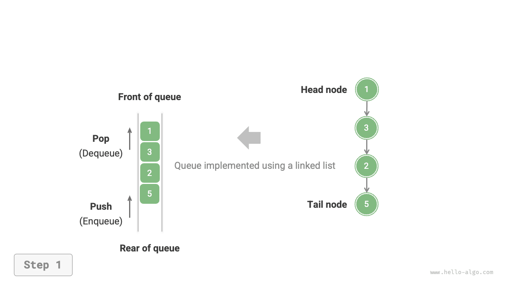
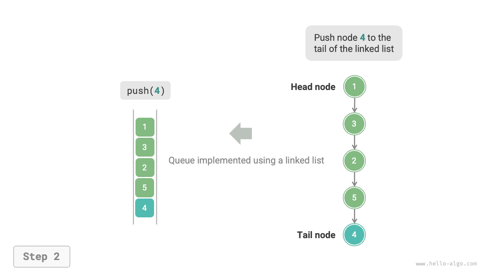
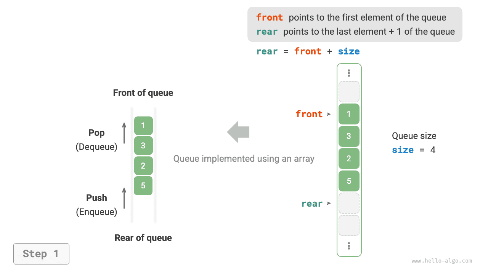
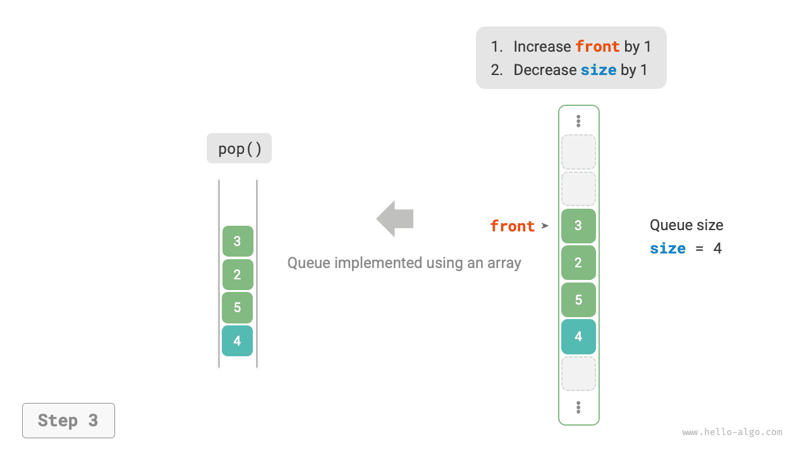

# xếp hàng

<u>hàng đợi</u> là cấu trúc dữ liệu tuyến tính tuân theo quy tắc Vào trước, ra trước (FIFO). Đúng như tên gọi, nó mô hình mọi người xếp hàng: những người mới liên tục xếp hàng ở phía sau, trong khi những người ở phía trước lần lượt rời đi.

Như minh họa trong hình bên dưới, chúng ta gọi phần đầu của hàng đợi là "phía trước" và phần cuối của hàng đợi là "phía sau". Thao tác thêm một phần tử vào phía sau được gọi là "enqueue" và thao tác loại bỏ phần tử phía trước được gọi là "dequeue".


## Hoạt động xếp hàng chung

Các hoạt động phổ biến trên hàng đợi được hiển thị trong bảng bên dưới. Lưu ý rằng tên phương thức có thể khác nhau tùy theo ngôn ngữ lập trình. Ở đây, chúng tôi sử dụng quy ước đặt tên tương tự như đối với ngăn xếp.

<p align="center"> Table <id> &nbsp; Efficiency of Queue Operations </p>

| Phương pháp | Mô tả | Độ phức tạp thời gian |
| -------- | ------------------------------------------ | --------------- |
| `đẩy()` | Phần tử Enqueue, thêm phần tử vào phía sau | $O(1)$ |
| `pop()` | Phần tử phía trước Dequeue | $O(1)$ |
| `nhìn trộm()` | Truy cập phần tử phía trước | $O(1)$ |

Chúng ta có thể trực tiếp sử dụng các lớp hàng đợi do ngôn ngữ lập trình cung cấp:

=== "Python"

    ```python title="queue.py"
    from collections import deque

    # Initialize queue
    # In Python, we generally use the deque class as a queue
    # Although queue.Queue() is a pure queue class, it is not very user-friendly, so it is not recommended
    que: deque[int] = deque()

    # Enqueue elements
    que.append(1)
    que.append(3)
    que.append(2)
    que.append(5)
    que.append(4)

    # Access front element
    front: int = que[0]

    # Dequeue element
    pop: int = que.popleft()

    # Get queue length
    size: int = len(que)

    # Check if queue is empty
    is_empty: bool = len(que) == 0
    ```

=== "C++"

    ```cpp title="queue.cpp"
    /* Initialize queue */
    queue<int> queue;

    /* Enqueue elements */
    queue.push(1);
    queue.push(3);
    queue.push(2);
    queue.push(5);
    queue.push(4);

    /* Access front element */
    int front = queue.front();

    /* Dequeue element */
    queue.pop();

    /* Get queue length */
    int size = queue.size();

    /* Check if queue is empty */
    bool empty = queue.empty();
    ```

=== "Java"

    ```java title="queue.java"
    /* Initialize queue */
    Queue<Integer> queue = new LinkedList<>();

    /* Enqueue elements */
    queue.offer(1);
    queue.offer(3);
    queue.offer(2);
    queue.offer(5);
    queue.offer(4);

    /* Access front element */
    int peek = queue.peek();

    /* Dequeue element */
    int pop = queue.poll();

    /* Get queue length */
    int size = queue.size();

    /* Check if queue is empty */
    boolean isEmpty = queue.isEmpty();
    ```

=== "C#"

    ```csharp title="queue.cs"
    /* Initialize queue */
    Queue<int> queue = new();

    /* Enqueue elements */
    queue.Enqueue(1);
    queue.Enqueue(3);
    queue.Enqueue(2);
    queue.Enqueue(5);
    queue.Enqueue(4);

    /* Access front element */
    int peek = queue.Peek();

    /* Dequeue element */
    int pop = queue.Dequeue();

    /* Get queue length */
    int size = queue.Count;

    /* Check if queue is empty */
    bool isEmpty = queue.Count == 0;
    ```

=== "Go"

    ```go title="queue_test.go"
    /* Initialize queue */
    // In Go, use list as a queue
    queue := list.New()

    /* Enqueue elements */
    queue.PushBack(1)
    queue.PushBack(3)
    queue.PushBack(2)
    queue.PushBack(5)
    queue.PushBack(4)

    /* Access front element */
    peek := queue.Front()

    /* Dequeue element */
    pop := queue.Front()
    queue.Remove(pop)

    /* Get queue length */
    size := queue.Len()

    /* Check if queue is empty */
    isEmpty := queue.Len() == 0
    ```

=== "Swift"

    ```swift title="queue.swift"
    /* Initialize queue */
    // Swift does not have a built-in queue class, can use Array as a queue
    var queue: [Int] = []

    /* Enqueue elements */
    queue.append(1)
    queue.append(3)
    queue.append(2)
    queue.append(5)
    queue.append(4)

    /* Access front element */
    let peek = queue.first!

    /* Dequeue element */
    // Since it's an array, removeFirst has O(n) complexity
    let pool = queue.removeFirst()

    /* Get queue length */
    let size = queue.count

    /* Check if queue is empty */
    let isEmpty = queue.isEmpty
    ```

=== "JS"

    ```javascript title="queue.js"
    /* Initialize queue */
    // JavaScript does not have a built-in queue, can use Array as a queue
    const queue = [];

    /* Enqueue elements */
    queue.push(1);
    queue.push(3);
    queue.push(2);
    queue.push(5);
    queue.push(4);

    /* Access front element */
    const peek = queue[0];

    /* Dequeue element */
    // The underlying structure is an array, so shift() has O(n) time complexity
    const pop = queue.shift();

    /* Get queue length */
    const size = queue.length;

    /* Check if queue is empty */
    const empty = queue.length === 0;
    ```

=== "TS"

    ```typescript title="queue.ts"
    /* Initialize queue */
    // TypeScript does not have a built-in queue, can use Array as a queue
    const queue: number[] = [];

    /* Enqueue elements */
    queue.push(1);
    queue.push(3);
    queue.push(2);
    queue.push(5);
    queue.push(4);

    /* Access front element */
    const peek = queue[0];

    /* Dequeue element */
    // The underlying structure is an array, so shift() has O(n) time complexity
    const pop = queue.shift();

    /* Get queue length */
    const size = queue.length;

    /* Check if queue is empty */
    const empty = queue.length === 0;
    ```

=== "Dart"

    ```dart title="queue.dart"
    /* Initialize queue */
    // In Dart, the Queue class is a deque and can also be used as a queue
    Queue<int> queue = Queue();

    /* Enqueue elements */
    queue.add(1);
    queue.add(3);
    queue.add(2);
    queue.add(5);
    queue.add(4);

    /* Access front element */
    int peek = queue.first;

    /* Dequeue element */
    int pop = queue.removeFirst();

    /* Get queue length */
    int size = queue.length;

    /* Check if queue is empty */
    bool isEmpty = queue.isEmpty;
    ```

=== "Rust"

    ```rust title="queue.rs"
    /* Initialize deque */
    // In Rust, use deque as a regular queue
    let mut deque: VecDeque<u32> = VecDeque::new();

    /* Enqueue elements */
    deque.push_back(1);
    deque.push_back(3);
    deque.push_back(2);
    deque.push_back(5);
    deque.push_back(4);

    /* Access front element */
    if let Some(front) = deque.front() {
    }

    /* Dequeue element */
    if let Some(pop) = deque.pop_front() {
    }

    /* Get queue length */
    let size = deque.len();

    /* Check if queue is empty */
    let is_empty = deque.is_empty();
    ```

=== "C"

    ```c title="queue.c"
    // C does not provide a built-in queue
    ```

=== "Kotlin"

    ```kotlin title="queue.kt"
    /* Initialize queue */
    val queue = LinkedList<Int>()

    /* Enqueue elements */
    queue.offer(1)
    queue.offer(3)
    queue.offer(2)
    queue.offer(5)
    queue.offer(4)

    /* Access front element */
    val peek = queue.peek()

    /* Dequeue element */
    val pop = queue.poll()

    /* Get queue length */
    val size = queue.size

    /* Check if queue is empty */
    val isEmpty = queue.isEmpty()
    ```

=== "Ruby"

    ```ruby title="queue.rb"
    # Initialize queue
    # Ruby's built-in queue (Thread::Queue) does not have peek and traversal methods, can use Array as a queue
    queue = []

    # Enqueue elements
    queue.push(1)
    queue.push(3)
    queue.push(2)
    queue.push(5)
    queue.push(4)

    # Access front element
    peek = queue.first

    # Dequeue element
    # Please note that since it's an array, Array#shift has O(n) time complexity
    pop = queue.shift

    # Get queue length
    size = queue.length

    # Check if queue is empty
    is_empty = queue.empty?
    ```

??? pythontutor "Trực quan hóa mã"

https://pythontutor.com/render.html#code=from%20collections%20import%20deque%0A%0A%22%22%22Driver%20Code%22%22%22%0Aif%20__name __%20%3D%3D%20%22__main__%22%3A%0A%20%20%20%20%23%20%E5%88%9D%E 5%A7%8B%E5%8C%96%E9%98%9F%E5%88%97%0A%20%20%20%20%23%20%E5%9C%A8 %20Python%20%E4%B8%AD%EF%BC%8C%E6%88%91%E4%BB%AC%E4%B8%80%E8%88 %AC%E5%B0%86%E5%8F%8C%E5%90%91%E9%98%9F%E5%88%97%E7%B1%BB%20dequ e%20%E7%9C%8B%E4%BD%9C%E9%98%9F%E5%88%97%E4%BD%BF%E7%94%A8%0A%2 0%20%20%20%23%20%E8%99%BD%E7%84%B6%20queue.Queue%28%29%20%E6%98% AF%E7%BA%AF%E6%AD%A3%E7%9A%84%E9%98%9F%E5%88%97%E7%B1%BB%EF%BC%8C%E4%BD%86%E4%B8%8D%E5%A4%AA%E5%A5%BD%E7%94%A8%0A%20%20%20%20qu e%20%3D%20deque%28%29%0A%0A%20%20%20%20%23%20%E5%85%83%E7%B4%A0 %E5%85%A5%E9%98%9F%0A%20%20%20%20que.append%281%29%0A%20%20%20%2 0que.append%283%29%0A%20%20%20%20que.append%282%29%0A%20%20%20%20que.append%285%29%0A%20%20%20%20que.append%284%29%0A%20%20%20% 20print%28%22%E9%98%9F%E5%88%97%20que%20%3D%22,%20que%29%0A%0A%2 0%20%20%20%23%20%E8%AE%BF%E9%97%AE%E9%98%9F%E9%A6%96%E5%85%83%E7 %B4%A0%0A%20%20%20%20front%20%3D%20que%5B0%5D%0A%20%20%20%20print%28%22%E9%98%9F%E9%A6%96%E5%85%83%E7%B4%A0%20front%20%3D%22,%2 0front%29%0A%0A%20%20%20%20%23%20%E5%85%83%E7%B4%A0%E5%87%BA%E9%98%9F%0A%20%20%20%20pop%20%3D%20que.popleft%28%29%0A%20%20%20%2 0print%28%22%E5%87%BA%E9%98%9F%E5%85%83%E7%B4%A0%20pop%20%3D%22,%20pop%29%0A%20%20%20%20print%28%22%E5%87%BA%E9%98%9F%E5%90%8E% 20que%20%3D%22,%20que%29%0A%0A%20%20%20%20%23%20%E8%8E%B7%E5%8F% 96%E9%98%9F%E5%88%97%E7%9A%84%E9%95%BF%E5%BA%A6%0A%20%20%20%20si ze%20%3D%20len%28que%29%0A%20%20%20%20print%28%22%E9%98%9F%E5%88%97%E9%95%BF%E5%BA%A6%20size%20%3D%22,%20size%29%0A%0A%20%20%20 %20%23%20%E5%88%A4%E6%96%AD%E9%98%9F%E5%88%97%E6%98%AF%E5%90%A6%E4%B8%BA%E7%A9%BA%0A%20%20%20%20is_empty%20%3D%20len%28que%29%2 0%3D%3D%200%0A%20%20%20%20print%28%22%E9%98%9F%E5%88%97%E6%98%AF%E5%90%A6%E4%B8%BA%E7%A9%BA%20%3D%22,%20is_empty%29&cumulative= false&curInstr=3&heapPrimitives=neverest&mode=display&origin=opt-frontend.js&py=311&rawInputLstJSON=%5B%5D&textReferences=false

## Triển khai hàng đợi

Để triển khai hàng đợi, chúng ta cần một cấu trúc dữ liệu cho phép thêm các phần tử ở một đầu và loại bỏ các phần tử ở đầu kia. Cả danh sách liên kết và mảng đều đáp ứng yêu cầu này.

### Triển khai danh sách liên kết

Như được hiển thị trong hình bên dưới, chúng ta có thể coi "nút đầu" và "nút đuôi" của danh sách được liên kết lần lượt là "phía trước" và "phía sau" của hàng đợi, với quy tắc là các nút chỉ có thể được thêm vào ở phía sau và bị xóa khỏi phía trước.

=== "<1>"
    

=== "<2>"
    

=== "<3>"
    

Dưới đây là mã để triển khai hàng đợi bằng danh sách được liên kết:

=== "Python"
    ```python title="linkedlist_queue.py"
    class LinkedListQueue:
        """Queue based on linked list implementation"""
    
        def __init__(self):
            """Constructor"""
            self._front: ListNode | None = None  # Head node front
            self._rear: ListNode | None = None  # Tail node rear
            self._size: int = 0
    
        def size(self) -> int:
            """Get the length of the queue"""
            return self._size
    
        def is_empty(self) -> bool:
            """Check if the queue is empty"""
            return self._size == 0
    
        def push(self, num: int):
            """Enqueue"""
            # Add num after the tail node
            node = ListNode(num)
            # If the queue is empty, make both front and rear point to the node
            if self._front is None:
                self._front = node
                self._rear = node
            # If the queue is not empty, add the node after the tail node
            else:
                self._rear.next = node
                self._rear = node
            self._size += 1
    
        def pop(self) -> int:
            """Dequeue"""
            num = self.peek()
            # Delete head node
            self._front = self._front.next
            self._size -= 1
            return num
    
        def peek(self) -> int:
            """Access front of the queue element"""
            if self.is_empty():
                raise IndexError("Queue is empty")
            return self._front.val
    
        def to_list(self) -> list[int]:
            """Convert to list for printing"""
            queue = []
            temp = self._front
            while temp:
                queue.append(temp.val)
                temp = temp.next
            return queue
    ```
=== "C++"
    ```cpp title="linkedlist_queue.cpp"
    class LinkedListQueue {
      private:
        ListNode *front, *rear; // Head node front, tail node rear
        int queSize;
    
      public:
        LinkedListQueue() {
            front = nullptr;
            rear = nullptr;
            queSize = 0;
        }
    
        ~LinkedListQueue() {
            // Traverse linked list to delete nodes and free memory
            freeMemoryLinkedList(front);
        }
    
        /* Get the length of the queue */
        int size() {
            return queSize;
        }
    
        /* Check if the queue is empty */
        bool isEmpty() {
            return queSize == 0;
        }
    
        /* Enqueue */
        void push(int num) {
            // Add num after the tail node
            ListNode *node = new ListNode(num);
            // If the queue is empty, make both front and rear point to the node
            if (front == nullptr) {
                front = node;
                rear = node;
            }
            // If the queue is not empty, add the node after the tail node
            else {
                rear->next = node;
                rear = node;
            }
            queSize++;
        }
    
        /* Dequeue */
        int pop() {
            int num = peek();
            // Delete head node
            ListNode *tmp = front;
            front = front->next;
            // Free memory
            delete tmp;
            queSize--;
            return num;
        }
    
        /* Return list for printing */
        int peek() {
            if (size() == 0)
                throw out_of_range("Queue is empty");
            return front->val;
        }
    
        /* Convert linked list to Vector and return */
        vector<int> toVector() {
            ListNode *node = front;
            vector<int> res(size());
            for (int i = 0; i < res.size(); i++) {
                res[i] = node->val;
                node = node->next;
            }
            return res;
        }
    };
    ```
=== "Java"
    ```java title="linkedlist_queue.java"
    class LinkedListQueue {
        private ListNode front, rear; // Head node front, tail node rear
        private int queSize = 0;
    
        public LinkedListQueue() {
            front = null;
            rear = null;
        }
    
        /* Get the length of the queue */
        public int size() {
            return queSize;
        }
    
        /* Check if the queue is empty */
        public boolean isEmpty() {
            return size() == 0;
        }
    
        /* Enqueue */
        public void push(int num) {
            // Add num after the tail node
            ListNode node = new ListNode(num);
            // If the queue is empty, make both front and rear point to the node
            if (front == null) {
                front = node;
                rear = node;
            // If the queue is not empty, add the node after the tail node
            } else {
                rear.next = node;
                rear = node;
            }
            queSize++;
        }
    
        /* Dequeue */
        public int pop() {
            int num = peek();
            // Delete head node
            front = front.next;
            queSize--;
            return num;
        }
    
        /* Return list for printing */
        public int peek() {
            if (isEmpty())
                throw new IndexOutOfBoundsException();
            return front.val;
        }
    
        /* Convert linked list to Array and return */
        public int[] toArray() {
            ListNode node = front;
            int[] res = new int[size()];
            for (int i = 0; i < res.length; i++) {
                res[i] = node.val;
                node = node.next;
            }
            return res;
        }
    }
    ```
=== "C#"
    ```csharp title="linkedlist_queue.cs"
    class LinkedListQueue {
        ListNode? front, rear;  // Head node front, tail node rear
        int queSize = 0;
    
        public LinkedListQueue() {
            front = null;
            rear = null;
        }
    
        /* Get the length of the queue */
        public int Size() {
            return queSize;
        }
    
        /* Check if the queue is empty */
        public bool IsEmpty() {
            return Size() == 0;
        }
    
        /* Enqueue */
        public void Push(int num) {
            // Add num after the tail node
            ListNode node = new(num);
            // If the queue is empty, make both front and rear point to the node
            if (front == null) {
                front = node;
                rear = node;
                // If the queue is not empty, add the node after the tail node
            } else if (rear != null) {
                rear.next = node;
                rear = node;
            }
            queSize++;
        }
    
        /* Dequeue */
        public int Pop() {
            int num = Peek();
            // Delete head node
            front = front?.next;
            queSize--;
            return num;
        }
    
        /* Return list for printing */
        public int Peek() {
            if (IsEmpty())
                throw new Exception();
            return front!.val;
        }
    
        /* Convert linked list to Array and return */
        public int[] ToArray() {
            if (front == null)
                return [];
    
            ListNode? node = front;
            int[] res = new int[Size()];
            for (int i = 0; i < res.Length; i++) {
                res[i] = node!.val;
                node = node.next;
            }
            return res;
        }
    }
    ```
=== "Go"
    ```go title="linkedlist_queue.go"
    type linkedListQueue struct {
    	// Use built-in package list to implement queue
    	data *list.List
    }
    ```
=== "Swift"
    ```swift title="linkedlist_queue.swift"
    class LinkedListQueue {
        private var front: ListNode? // Head node
        private var rear: ListNode? // Tail node
        private var _size: Int
    
        init() {
            _size = 0
        }
    
        /* Get the length of the queue */
        func size() -> Int {
            _size
        }
    
        /* Check if the queue is empty */
        func isEmpty() -> Bool {
            size() == 0
        }
    
        /* Enqueue */
        func push(num: Int) {
            // Add num after the tail node
            let node = ListNode(x: num)
            // If the queue is empty, make both front and rear point to the node
            if front == nil {
                front = node
                rear = node
            }
            // If the queue is not empty, add the node after the tail node
            else {
                rear?.next = node
                rear = node
            }
            _size += 1
        }
    
        /* Dequeue */
        @discardableResult
        func pop() -> Int {
            let num = peek()
            // Delete head node
            front = front?.next
            _size -= 1
            return num
        }
    
        /* Return list for printing */
        func peek() -> Int {
            if isEmpty() {
                fatalError("Queue is empty")
            }
            return front!.val
        }
    
        /* Convert linked list to Array and return */
        func toArray() -> [Int] {
            var node = front
            var res = Array(repeating: 0, count: size())
            for i in res.indices {
                res[i] = node!.val
                node = node?.next
            }
            return res
        }
    }
    ```
=== "JS"
    ```javascript title="linkedlist_queue.js"
    class LinkedListQueue {
        #front; // Front node #front
        #rear; // Rear node #rear
        #queSize = 0;
    
        constructor() {
            this.#front = null;
            this.#rear = null;
        }
    
        /* Get the length of the queue */
        get size() {
            return this.#queSize;
        }
    
        /* Check if the queue is empty */
        isEmpty() {
            return this.size === 0;
        }
    
        /* Enqueue */
        push(num) {
            // Add num after the tail node
            const node = new ListNode(num);
            // If the queue is empty, make both front and rear point to the node
            if (!this.#front) {
                this.#front = node;
                this.#rear = node;
                // If the queue is not empty, add the node after the tail node
            } else {
                this.#rear.next = node;
                this.#rear = node;
            }
            this.#queSize++;
        }
    
        /* Dequeue */
        pop() {
            const num = this.peek();
            // Delete head node
            this.#front = this.#front.next;
            this.#queSize--;
            return num;
        }
    
        /* Return list for printing */
        peek() {
            if (this.size === 0) throw new Error('Queue is empty');
            return this.#front.val;
        }
    
        /* Convert linked list to Array and return */
        toArray() {
            let node = this.#front;
            const res = new Array(this.size);
            for (let i = 0; i < res.length; i++) {
                res[i] = node.val;
                node = node.next;
            }
            return res;
        }
    }
    ```
=== "TS"
    ```typescript title="linkedlist_queue.ts"
    class LinkedListQueue {
        private front: ListNode | null; // Head node front
        private rear: ListNode | null; // Tail node rear
        private queSize: number = 0;
    
        constructor() {
            this.front = null;
            this.rear = null;
        }
    
        /* Get the length of the queue */
        get size(): number {
            return this.queSize;
        }
    
        /* Check if the queue is empty */
        isEmpty(): boolean {
            return this.size === 0;
        }
    
        /* Enqueue */
        push(num: number): void {
            // Add num after the tail node
            const node = new ListNode(num);
            // If the queue is empty, make both front and rear point to the node
            if (!this.front) {
                this.front = node;
                this.rear = node;
                // If the queue is not empty, add the node after the tail node
            } else {
                this.rear!.next = node;
                this.rear = node;
            }
            this.queSize++;
        }
    
        /* Dequeue */
        pop(): number {
            const num = this.peek();
            if (!this.front) throw new Error('Queue is empty');
            // Delete head node
            this.front = this.front.next;
            this.queSize--;
            return num;
        }
    
        /* Return list for printing */
        peek(): number {
            if (this.size === 0) throw new Error('Queue is empty');
            return this.front!.val;
        }
    
        /* Convert linked list to Array and return */
        toArray(): number[] {
            let node = this.front;
            const res = new Array<number>(this.size);
            for (let i = 0; i < res.length; i++) {
                res[i] = node!.val;
                node = node!.next;
            }
            return res;
        }
    }
    ```
=== "Dart"
    ```dart title="linkedlist_queue.dart"
    class LinkedListQueue {
      ListNode? _front; // Head node _front
      ListNode? _rear; // Tail node _rear
      int _queSize = 0; // Queue length
    
      LinkedListQueue() {
        _front = null;
        _rear = null;
      }
    
      /* Get the length of the queue */
      int size() {
        return _queSize;
      }
    
      /* Check if the queue is empty */
      bool isEmpty() {
        return _queSize == 0;
      }
    
      /* Enqueue */
      void push(int _num) {
        // Add _num after tail node
        final node = ListNode(_num);
        // If the queue is empty, make both front and rear point to the node
        if (_front == null) {
          _front = node;
          _rear = node;
        } else {
          // If the queue is not empty, add the node after the tail node
          _rear!.next = node;
          _rear = node;
        }
        _queSize++;
      }
    
      /* Dequeue */
      int pop() {
        final int _num = peek();
        // Delete head node
        _front = _front!.next;
        _queSize--;
        return _num;
      }
    
      /* Return list for printing */
      int peek() {
        if (_queSize == 0) {
          throw Exception('Queue is empty');
        }
        return _front!.val;
      }
    
      /* Convert linked list to Array and return */
      List<int> toArray() {
        ListNode? node = _front;
        final List<int> queue = [];
        while (node != null) {
          queue.add(node.val);
          node = node.next;
        }
        return queue;
      }
    }
    ```
=== "Rust"
    ```rust title="linkedlist_queue.rs"
    #[allow(dead_code)]
    pub struct LinkedListQueue<T> {
        front: Option<Rc<RefCell<ListNode<T>>>>, // Head node front
        rear: Option<Rc<RefCell<ListNode<T>>>>,  // Tail node rear
        que_size: usize,                         // Queue length
    }
    ```
=== "C"
    ```c title="linkedlist_queue.c"
    LinkedListQueue *newLinkedListQueue() {
        LinkedListQueue *queue = (LinkedListQueue *)malloc(sizeof(LinkedListQueue));
        queue->front = NULL;
        queue->rear = NULL;
        queue->queSize = 0;
        return queue;
    }
    ```
=== "Kotlin"
    ```kotlin title="linkedlist_queue.kt"
    class LinkedListQueue(
        // Head node front, tail node rear
        private var front: ListNode? = null,
        private var rear: ListNode? = null,
        private var queSize: Int = 0
    ) {
    
        /* Get the length of the queue */
        fun size(): Int {
            return queSize
        }
    
        /* Check if the queue is empty */
        fun isEmpty(): Boolean {
            return size() == 0
        }
    
        /* Enqueue */
        fun push(num: Int) {
            // Add num after the tail node
            val node = ListNode(num)
            // If the queue is empty, make both front and rear point to the node
            if (front == null) {
                front = node
                rear = node
                // If the queue is not empty, add the node after the tail node
            } else {
                rear?.next = node
                rear = node
            }
            queSize++
        }
    
        /* Dequeue */
        fun pop(): Int {
            val num = peek()
            // Delete head node
            front = front?.next
            queSize--
            return num
        }
    
        /* Return list for printing */
        fun peek(): Int {
            if (isEmpty()) throw IndexOutOfBoundsException()
            return front!!._val
        }
    
        /* Convert linked list to Array and return */
        fun toArray(): IntArray {
            var node = front
            val res = IntArray(size())
            for (i in res.indices) {
                res[i] = node!!._val
                node = node.next
            }
            return res
        }
    }
    ```
=== "Ruby"
    ```ruby title="linkedlist_queue.rb"
    ### Queue based on linked list ###
    class LinkedListQueue
      ### Get queue length ###
      attr_reader :size
    
      ### Constructor ###
      def initialize
        @front = nil  # Head node front
        @rear = nil   # Tail node rear
        @size = 0
      end
    
      ### Check if queue is empty ###
      def is_empty?
        @front.nil?
      end
    
      ### Enqueue ###
      def push(num)
        # Add num after the tail node
        node = ListNode.new(num)
    
        # If queue is empty, set both front and rear to this node
        if @front.nil?
          @front = node
          @rear = node
        # If queue is not empty, add this node after rear
        else
          @rear.next = node
          @rear = node
        end
    
        @size += 1
      end
    
      ### Dequeue ###
      def pop
        num = peek
        # Delete head node
        @front = @front.next
        @size -= 1
        num
      end
    
      ### Access front element ###
      def peek
        raise IndexError, 'Queue is empty' if is_empty?
    
        @front.val
      end
    
      ### Convert linked list to Array and return ###
      def to_array
        queue = []
        temp = @front
        while temp
          queue << temp.val
          temp = temp.next
        end
        queue
      end
    ```


### Triển khai mảng

Việc xóa phần tử đầu tiên trong một mảng có độ phức tạp về thời gian là $O(n)$, điều này sẽ làm cho thao tác dequeue không hiệu quả. Tuy nhiên, chúng ta có thể sử dụng phương pháp thông minh sau để tránh vấn đề này.

Chúng ta có thể sử dụng biến `front` để trỏ đến chỉ mục của phần tử phía trước và duy trì biến `size` để ghi lại độ dài hàng đợi. Chúng ta xác định `rear = front + size`, tính toán vị trí ngay sau phần tử phía sau.

Dựa trên thiết kế này, **khoảng hợp lệ chứa các phần tử trong mảng là `[front, Rear - 1]`**. Các phương pháp thực hiện cho các hoạt động khác nhau được thể hiện trong hình dưới đây:

- Thao tác Enqueue: Gán phần tử đầu vào cho chỉ số `rear` và tăng `size` lên 1.
- Hoạt động Dequeue: Đơn giản chỉ cần tăng `front` lên 1 và giảm `size` xuống 1.

Như bạn có thể thấy, cả hai thao tác enqueue và dequeue chỉ yêu cầu một thao tác, với độ phức tạp về thời gian là $O(1)$.

=== "<1>"
    

=== "<2>"
    

=== "<3>"
    

Bạn có thể nhận thấy một vấn đề: khi chúng ta liên tục xếp hàng và xếp hàng, cả `phía trước` và `phía sau` đều di chuyển sang bên phải. **Khi đến cuối mảng, chúng không thể tiếp tục di chuyển**. Để giải quyết vấn đề này, chúng ta có thể coi mảng như một "mảng tròn" với đầu và đuôi được kết nối.

Đối với mảng hình tròn, chúng ta cần để `front` hoặc `rear` bao quanh phần đầu của mảng khi chúng vượt qua phần cuối. Mẫu định kỳ này có thể được triển khai bằng cách sử dụng "thao tác modulo", như trong mã bên dưới:

=== "Python"
    ```python title="array_queue.py"
    class ArrayQueue:
        """Queue based on circular array implementation"""
    
        def __init__(self, size: int):
            """Constructor"""
            self._nums: list[int] = [0] * size  # Array for storing queue elements
            self._front: int = 0  # Front pointer, points to the front of the queue element
            self._size: int = 0  # Queue length
    
        def capacity(self) -> int:
            """Get the capacity of the queue"""
            return len(self._nums)
    
        def size(self) -> int:
            """Get the length of the queue"""
            return self._size
    
        def is_empty(self) -> bool:
            """Check if the queue is empty"""
            return self._size == 0
    
        def push(self, num: int):
            """Enqueue"""
            if self._size == self.capacity():
                raise IndexError("Queue is full")
            # Calculate rear pointer, points to rear index + 1
            # Use modulo operation to wrap rear around to the head after passing the tail of the array
            rear: int = (self._front + self._size) % self.capacity()
            # Add num to the rear of the queue
            self._nums[rear] = num
            self._size += 1
    
        def pop(self) -> int:
            """Dequeue"""
            num: int = self.peek()
            # Front pointer moves one position backward, if it passes the tail, return to the head of the array
            self._front = (self._front + 1) % self.capacity()
            self._size -= 1
            return num
    
        def peek(self) -> int:
            """Access front of the queue element"""
            if self.is_empty():
                raise IndexError("Queue is empty")
            return self._nums[self._front]
    
        def to_list(self) -> list[int]:
            """Return list for printing"""
            res = [0] * self.size()
            j: int = self._front
            for i in range(self.size()):
                res[i] = self._nums[(j % self.capacity())]
                j += 1
            return res
    ```
=== "C++"
    ```cpp title="array_queue.cpp"
    class ArrayQueue {
      private:
        int *nums;       // Array for storing queue elements
        int front;       // Front pointer, points to the front of the queue element
        int queSize;     // Queue length
        int queCapacity; // Queue capacity
    
      public:
        ArrayQueue(int capacity) {
            // Initialize array
            nums = new int[capacity];
            queCapacity = capacity;
            front = queSize = 0;
        }
    
        ~ArrayQueue() {
            delete[] nums;
        }
    
        /* Get the capacity of the queue */
        int capacity() {
            return queCapacity;
        }
    
        /* Get the length of the queue */
        int size() {
            return queSize;
        }
    
        /* Check if the queue is empty */
        bool isEmpty() {
            return size() == 0;
        }
    
        /* Enqueue */
        void push(int num) {
            if (queSize == queCapacity) {
                cout << "Queue is full" << endl;
                return;
            }
            // Use modulo operation to wrap rear around to the head after passing the tail of the array
            // Add num to the rear of the queue
            int rear = (front + queSize) % queCapacity;
            // Front pointer moves one position backward
            nums[rear] = num;
            queSize++;
        }
    
        /* Dequeue */
        int pop() {
            int num = peek();
            // Move front pointer backward by one position, if it passes the tail, return to array head
            front = (front + 1) % queCapacity;
            queSize--;
            return num;
        }
    
        /* Return list for printing */
        int peek() {
            if (isEmpty())
                throw out_of_range("Queue is empty");
            return nums[front];
        }
    
        /* Convert array to Vector and return */
        vector<int> toVector() {
            // Elements enqueue
            vector<int> arr(queSize);
            for (int i = 0, j = front; i < queSize; i++, j++) {
                arr[i] = nums[j % queCapacity];
            }
            return arr;
        }
    };
    ```
=== "Java"
    ```java title="array_queue.java"
    class ArrayQueue {
        private int[] nums; // Array for storing queue elements
        private int front; // Front pointer, points to the front of the queue element
        private int queSize; // Queue length
    
        public ArrayQueue(int capacity) {
            nums = new int[capacity];
            front = queSize = 0;
        }
    
        /* Get the capacity of the queue */
        public int capacity() {
            return nums.length;
        }
    
        /* Get the length of the queue */
        public int size() {
            return queSize;
        }
    
        /* Check if the queue is empty */
        public boolean isEmpty() {
            return queSize == 0;
        }
    
        /* Enqueue */
        public void push(int num) {
            if (queSize == capacity()) {
                System.out.println("Queue is full");
                return;
            }
            // Use modulo operation to wrap rear around to the head after passing the tail of the array
            // Add num to the rear of the queue
            int rear = (front + queSize) % capacity();
            // Front pointer moves one position backward
            nums[rear] = num;
            queSize++;
        }
    
        /* Dequeue */
        public int pop() {
            int num = peek();
            // Move front pointer backward by one position, if it passes the tail, return to array head
            front = (front + 1) % capacity();
            queSize--;
            return num;
        }
    
        /* Return list for printing */
        public int peek() {
            if (isEmpty())
                throw new IndexOutOfBoundsException();
            return nums[front];
        }
    
        /* Return array */
        public int[] toArray() {
            // Elements enqueue
            int[] res = new int[queSize];
            for (int i = 0, j = front; i < queSize; i++, j++) {
                res[i] = nums[j % capacity()];
            }
            return res;
        }
    }
    ```
=== "C#"
    ```csharp title="array_queue.cs"
    class ArrayQueue {
        int[] nums;  // Array for storing queue elements
        int front;   // Front pointer, points to the front of the queue element
        int queSize; // Queue length
    
        public ArrayQueue(int capacity) {
            nums = new int[capacity];
            front = queSize = 0;
        }
    
        /* Get the capacity of the queue */
        int Capacity() {
            return nums.Length;
        }
    
        /* Get the length of the queue */
        public int Size() {
            return queSize;
        }
    
        /* Check if the queue is empty */
        public bool IsEmpty() {
            return queSize == 0;
        }
    
        /* Enqueue */
        public void Push(int num) {
            if (queSize == Capacity()) {
                Console.WriteLine("Queue is full");
                return;
            }
            // Use modulo operation to wrap rear around to the head after passing the tail of the array
            // Add num to the rear of the queue
            int rear = (front + queSize) % Capacity();
            // Front pointer moves one position backward
            nums[rear] = num;
            queSize++;
        }
    
        /* Dequeue */
        public int Pop() {
            int num = Peek();
            // Move front pointer backward by one position, if it passes the tail, return to array head
            front = (front + 1) % Capacity();
            queSize--;
            return num;
        }
    
        /* Return list for printing */
        public int Peek() {
            if (IsEmpty())
                throw new Exception();
            return nums[front];
        }
    
        /* Return array */
        public int[] ToArray() {
            // Elements enqueue
            int[] res = new int[queSize];
            for (int i = 0, j = front; i < queSize; i++, j++) {
                res[i] = nums[j % this.Capacity()];
            }
            return res;
        }
    }
    ```
=== "Go"
    ```go title="array_queue.go"
    type arrayQueue struct {
    	nums        []int // Array for storing queue elements
    	front       int   // Front pointer, points to the front of the queue element
    	queSize     int   // Queue length
    	queCapacity int   // Queue capacity (maximum number of elements)
    }
    ```
=== "Swift"
    ```swift title="array_queue.swift"
    class ArrayQueue {
        private var nums: [Int] // Array for storing queue elements
        private var front: Int // Front pointer, points to the front of the queue element
        private var _size: Int // Queue length
    
        init(capacity: Int) {
            // Initialize array
            nums = Array(repeating: 0, count: capacity)
            front = 0
            _size = 0
        }
    
        /* Get the capacity of the queue */
        func capacity() -> Int {
            nums.count
        }
    
        /* Get the length of the queue */
        func size() -> Int {
            _size
        }
    
        /* Check if the queue is empty */
        func isEmpty() -> Bool {
            size() == 0
        }
    
        /* Enqueue */
        func push(num: Int) {
            if size() == capacity() {
                print("Queue is full")
                return
            }
            // Use modulo operation to wrap rear around to the head after passing the tail of the array
            // Add num to the rear of the queue
            let rear = (front + size()) % capacity()
            // Front pointer moves one position backward
            nums[rear] = num
            _size += 1
        }
    
        /* Dequeue */
        @discardableResult
        func pop() -> Int {
            let num = peek()
            // Move front pointer backward by one position, if it passes the tail, return to array head
            front = (front + 1) % capacity()
            _size -= 1
            return num
        }
    
        /* Return list for printing */
        func peek() -> Int {
            if isEmpty() {
                fatalError("Queue is empty")
            }
            return nums[front]
        }
    
        /* Return array */
        func toArray() -> [Int] {
            // Elements enqueue
            (front ..< front + size()).map { nums[$0 % capacity()] }
        }
    }
    ```
=== "JS"
    ```javascript title="array_queue.js"
    class ArrayQueue {
        #nums; // Array for storing queue elements
        #front = 0; // Front pointer, points to the front of the queue element
        #queSize = 0; // Queue length
    
        constructor(capacity) {
            this.#nums = new Array(capacity);
        }
    
        /* Get the capacity of the queue */
        get capacity() {
            return this.#nums.length;
        }
    
        /* Get the length of the queue */
        get size() {
            return this.#queSize;
        }
    
        /* Check if the queue is empty */
        isEmpty() {
            return this.#queSize === 0;
        }
    
        /* Enqueue */
        push(num) {
            if (this.size === this.capacity) {
                console.log('Queue is full');
                return;
            }
            // Use modulo operation to wrap rear around to the head after passing the tail of the array
            // Add num to the rear of the queue
            const rear = (this.#front + this.size) % this.capacity;
            // Front pointer moves one position backward
            this.#nums[rear] = num;
            this.#queSize++;
        }
    
        /* Dequeue */
        pop() {
            const num = this.peek();
            // Move front pointer backward by one position, if it passes the tail, return to array head
            this.#front = (this.#front + 1) % this.capacity;
            this.#queSize--;
            return num;
        }
    
        /* Return list for printing */
        peek() {
            if (this.isEmpty()) throw new Error('Queue is empty');
            return this.#nums[this.#front];
        }
    
        /* Return Array */
        toArray() {
            // Elements enqueue
            const arr = new Array(this.size);
            for (let i = 0, j = this.#front; i < this.size; i++, j++) {
                arr[i] = this.#nums[j % this.capacity];
            }
            return arr;
        }
    }
    ```
=== "TS"
    ```typescript title="array_queue.ts"
    class ArrayQueue {
        private nums: number[]; // Array for storing queue elements
        private front: number; // Front pointer, points to the front of the queue element
        private queSize: number; // Queue length
    
        constructor(capacity: number) {
            this.nums = new Array(capacity);
            this.front = this.queSize = 0;
        }
    
        /* Get the capacity of the queue */
        get capacity(): number {
            return this.nums.length;
        }
    
        /* Get the length of the queue */
        get size(): number {
            return this.queSize;
        }
    
        /* Check if the queue is empty */
        isEmpty(): boolean {
            return this.queSize === 0;
        }
    
        /* Enqueue */
        push(num: number): void {
            if (this.size === this.capacity) {
                console.log('Queue is full');
                return;
            }
            // Use modulo operation to wrap rear around to the head after passing the tail of the array
            // Add num to the rear of the queue
            const rear = (this.front + this.queSize) % this.capacity;
            // Front pointer moves one position backward
            this.nums[rear] = num;
            this.queSize++;
        }
    
        /* Dequeue */
        pop(): number {
            const num = this.peek();
            // Move front pointer backward by one position, if it passes the tail, return to array head
            this.front = (this.front + 1) % this.capacity;
            this.queSize--;
            return num;
        }
    
        /* Return list for printing */
        peek(): number {
            if (this.isEmpty()) throw new Error('Queue is empty');
            return this.nums[this.front];
        }
    
        /* Return Array */
        toArray(): number[] {
            // Elements enqueue
            const arr = new Array(this.size);
            for (let i = 0, j = this.front; i < this.size; i++, j++) {
                arr[i] = this.nums[j % this.capacity];
            }
            return arr;
        }
    }
    ```
=== "Dart"
    ```dart title="array_queue.dart"
    class ArrayQueue {
      late List<int> _nums; // Array for storing queue elements
      late int _front; // Front pointer, points to the front of the queue element
      late int _queSize; // Queue length
    
      ArrayQueue(int capacity) {
        _nums = List.filled(capacity, 0);
        _front = _queSize = 0;
      }
    
      /* Get the capacity of the queue */
      int capaCity() {
        return _nums.length;
      }
    
      /* Get the length of the queue */
      int size() {
        return _queSize;
      }
    
      /* Check if the queue is empty */
      bool isEmpty() {
        return _queSize == 0;
      }
    
      /* Enqueue */
      void push(int _num) {
        if (_queSize == capaCity()) {
          throw Exception("Queue is full");
        }
        // Use modulo operation to wrap rear around to the head after passing the tail of the array
        // Add num to the rear of the queue
        int rear = (_front + _queSize) % capaCity();
        // Add _num to queue rear
        _nums[rear] = _num;
        _queSize++;
      }
    
      /* Dequeue */
      int pop() {
        int _num = peek();
        // Move front pointer backward by one position, if it passes the tail, return to array head
        _front = (_front + 1) % capaCity();
        _queSize--;
        return _num;
      }
    
      /* Return list for printing */
      int peek() {
        if (isEmpty()) {
          throw Exception("Queue is empty");
        }
        return _nums[_front];
      }
    
      /* Return Array */
      List<int> toArray() {
        // Elements enqueue
        final List<int> res = List.filled(_queSize, 0);
        for (int i = 0, j = _front; i < _queSize; i++, j++) {
          res[i] = _nums[j % capaCity()];
        }
        return res;
      }
    }
    ```
=== "Rust"
    ```rust title="array_queue.rs"
    struct ArrayQueue<T> {
        nums: Vec<T>,      // Array for storing queue elements
        front: i32,        // Front pointer, points to the front of the queue element
        que_size: i32,     // Queue length
        que_capacity: i32, // Queue capacity
    }
    ```
=== "C"
    ```c title="array_queue.c"
    ArrayQueue *newArrayQueue(int capacity) {
        ArrayQueue *queue = (ArrayQueue *)malloc(sizeof(ArrayQueue));
        // Initialize array
        queue->queCapacity = capacity;
        queue->nums = (int *)malloc(sizeof(int) * queue->queCapacity);
        queue->front = queue->queSize = 0;
        return queue;
    }
    ```
=== "Kotlin"
    ```kotlin title="array_queue.kt"
    class ArrayQueue(capacity: Int) {
        private val nums: IntArray = IntArray(capacity) // Array for storing queue elements
        private var front: Int = 0 // Front pointer, points to the front of the queue element
        private var queSize: Int = 0 // Queue length
    
        /* Get the capacity of the queue */
        fun capacity(): Int {
            return nums.size
        }
    
        /* Get the length of the queue */
        fun size(): Int {
            return queSize
        }
    
        /* Check if the queue is empty */
        fun isEmpty(): Boolean {
            return queSize == 0
        }
    
        /* Enqueue */
        fun push(num: Int) {
            if (queSize == capacity()) {
                println("Queue is full")
                return
            }
            // Use modulo operation to wrap rear around to the head after passing the tail of the array
            // Add num to the rear of the queue
            val rear = (front + queSize) % capacity()
            // Front pointer moves one position backward
            nums[rear] = num
            queSize++
        }
    
        /* Dequeue */
        fun pop(): Int {
            val num = peek()
            // Move front pointer backward by one position, if it passes the tail, return to array head
            front = (front + 1) % capacity()
            queSize--
            return num
        }
    
        /* Return list for printing */
        fun peek(): Int {
            if (isEmpty()) throw IndexOutOfBoundsException()
            return nums[front]
        }
    
        /* Return array */
        fun toArray(): IntArray {
            // Elements enqueue
            val res = IntArray(queSize)
            var i = 0
            var j = front
            while (i < queSize) {
                res[i] = nums[j % capacity()]
                i++
                j++
            }
            return res
        }
    }
    ```
=== "Ruby"
    ```ruby title="array_queue.rb"
    ### Queue based on circular array ###
    class ArrayQueue
      ### Get queue length ###
      attr_reader :size
    
      ### Constructor ###
      def initialize(size)
        @nums = Array.new(size, 0) # Array for storing queue elements
        @front = 0 # Front pointer, points to the front of the queue element
        @size = 0 # Queue length
      end
    
      ### Get queue capacity ###
      def capacity
        @nums.length
      end
    
      ### Check if queue is empty ###
      def is_empty?
        size.zero?
      end
    
      ### Enqueue ###
      def push(num)
        raise IndexError, 'Queue is full' if size == capacity
    
        # Use modulo operation to wrap rear around to the head after passing the tail of the array
        # Add num to the rear of the queue
        rear = (@front + size) % capacity
        # Front pointer moves one position backward
        @nums[rear] = num
        @size += 1
      end
    
      ### Dequeue ###
      def pop
        num = peek
        # Move front pointer backward by one position, if it passes the tail, return to array head
        @front = (@front + 1) % capacity
        @size -= 1
        num
      end
    
      ### Access front element ###
      def peek
        raise IndexError, 'Queue is empty' if is_empty?
    
        @nums[@front]
      end
    
      ### Return list for printing ###
      def to_array
        res = Array.new(size, 0)
        j = @front
    
        for i in 0...size
          res[i] = @nums[j % capacity]
          j += 1
        end
    
        res
      end
    ```


Hàng đợi được triển khai ở trên vẫn có những hạn chế: độ dài của nó là không thay đổi. Tuy nhiên, vấn đề này không khó giải quyết. Chúng ta có thể thay thế mảng bằng mảng động để đưa ra cơ chế mở rộng. Bạn đọc quan tâm có thể thử tự mình thực hiện việc này.

Các kết luận so sánh cho hai cách triển khai này nhất quán với các kết luận dành cho ngăn xếp và sẽ không được lặp lại ở đây.

## Ứng dụng điển hình của hàng đợi

- **Đơn hàng trên taobao**. Sau khi người mua hàng đặt hàng, đơn hàng sẽ được thêm vào hàng đợi và hệ thống sau đó sẽ xử lý các đơn hàng trong hàng đợi theo trình tự của chúng. Trong Double Eleven, các đơn đặt hàng lớn được tạo ra trong thời gian ngắn và tính đồng thời cao trở thành thách thức chính mà các kỹ sư cần phải giải quyết.
- **Các nhiệm vụ cần làm khác nhau**. Bất kỳ kịch bản nào cần triển khai chức năng "đến trước được phục vụ trước", chẳng hạn như hàng đợi tác vụ của máy in hoặc hàng đợi đặt hàng của nhà hàng, đều có thể duy trì thứ tự xử lý bằng cách sử dụng hàng đợi một cách hiệu quả.
