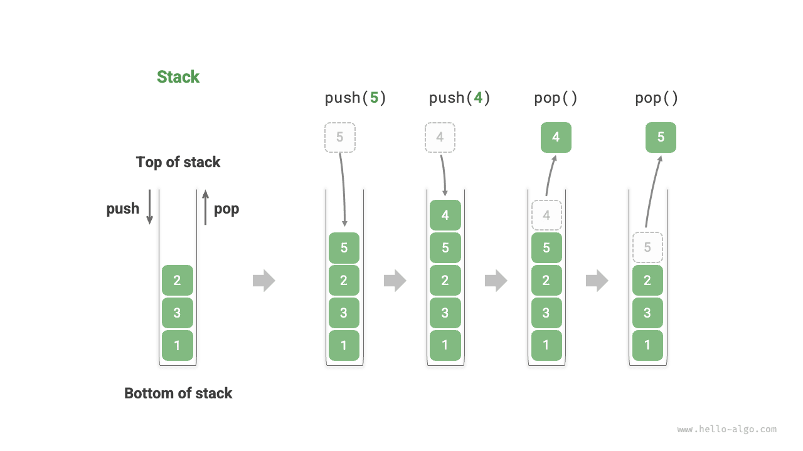
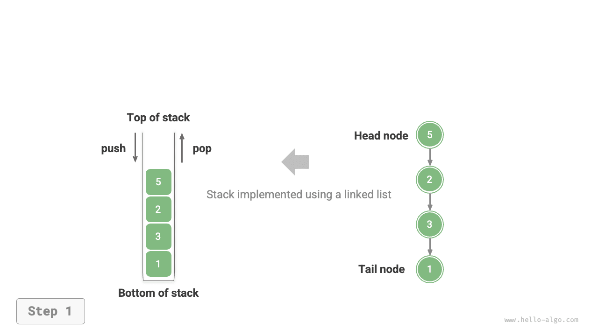
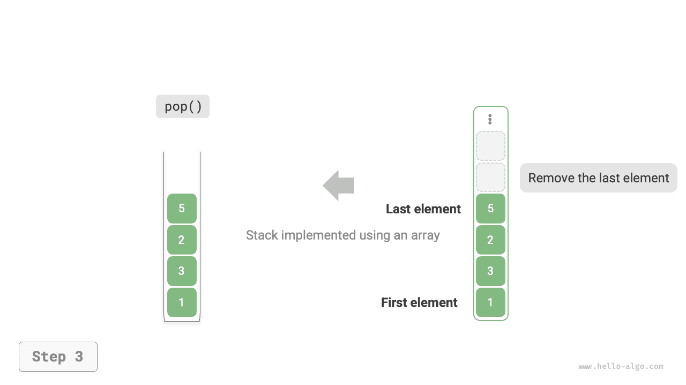

# ngăn xếp

<u>ngăn xếp</u> là cấu trúc dữ liệu tuyến tính tuân theo nguyên tắc Vào trước, ra trước (LIFO).

Chúng ta có thể so sánh một chồng đĩa với một chồng đĩa trên bàn. Nếu chúng ta chỉ định mỗi lần chỉ được di chuyển một tấm thì để có được tấm dưới cùng, trước tiên chúng ta phải loại bỏ từng tấm phía trên nó. Nếu chúng ta thay thế các mảng bằng nhiều loại phần tử khác nhau (chẳng hạn như số nguyên, ký tự, đối tượng, v.v.), chúng ta sẽ có được cấu trúc dữ liệu ngăn xếp.

Như thể hiện trong hình bên dưới, chúng tôi gọi phần trên cùng của các phần tử được xếp chồng lên nhau là "trên cùng" và phần dưới cùng là "dưới cùng". Thao tác thêm phần tử lên trên cùng được gọi là "push" và thao tác xóa phần tử trên cùng được gọi là "pop".



## Các thao tác ngăn xếp phổ biến

Các thao tác phổ biến trên ngăn xếp được thể hiện trong bảng dưới đây. Tên phương thức cụ thể phụ thuộc vào ngôn ngữ lập trình được sử dụng. Ở đây, chúng tôi sử dụng quy ước đặt tên phổ biến là `push()`, `pop()` và `peek()`.

<p align="center"> Table <id> &nbsp; Efficiency of Stack Operations </p>

| Phương pháp | Mô tả | Độ phức tạp thời gian |
| -------- | ---------------------------------------------- | --------------- |
| `đẩy()` | Đẩy phần tử lên ngăn xếp (thêm lên trên cùng) | $O(1)$ |
| `pop()` | Phần tử bật lên từ ngăn xếp | $O(1)$ |
| `nhìn trộm()` | Truy cập phần tử trên cùng | $O(1)$ |

Thông thường, chúng ta có thể trực tiếp sử dụng lớp ngăn xếp tích hợp do ngôn ngữ lập trình cung cấp. Tuy nhiên, một số ngôn ngữ có thể không cung cấp lớp ngăn xếp chuyên dụng. Trong những trường hợp như vậy, chúng ta có thể sử dụng "mảng" hoặc "danh sách liên kết" của ngôn ngữ làm ngăn xếp và chỉ cần tránh sử dụng các thao tác không liên quan đến hành vi của ngăn xếp.

=== "Python"

    ```python title="stack.py"
    # Initialize stack
    # Python does not have a built-in stack class, can use list as a stack
    stack: list[int] = []

    # Push elements
    stack.append(1)
    stack.append(3)
    stack.append(2)
    stack.append(5)
    stack.append(4)

    # Access top element
    peek: int = stack[-1]

    # Pop element
    pop: int = stack.pop()

    # Get stack length
    size: int = len(stack)

    # Check if empty
    is_empty: bool = len(stack) == 0
    ```

=== "C++"

    ```cpp title="stack.cpp"
    /* Initialize stack */
    stack<int> stack;

    /* Push elements */
    stack.push(1);
    stack.push(3);
    stack.push(2);
    stack.push(5);
    stack.push(4);

    /* Access top element */
    int top = stack.top();

    /* Pop element */
    stack.pop(); // No return value

    /* Get stack length */
    int size = stack.size();

    /* Check if empty */
    bool empty = stack.empty();
    ```

=== "Java"

    ```java title="stack.java"
    /* Initialize stack */
    Stack<Integer> stack = new Stack<>();

    /* Push elements */
    stack.push(1);
    stack.push(3);
    stack.push(2);
    stack.push(5);
    stack.push(4);

    /* Access top element */
    int peek = stack.peek();

    /* Pop element */
    int pop = stack.pop();

    /* Get stack length */
    int size = stack.size();

    /* Check if empty */
    boolean isEmpty = stack.isEmpty();
    ```

=== "C#"

    ```csharp title="stack.cs"
    /* Initialize stack */
    Stack<int> stack = new();

    /* Push elements */
    stack.Push(1);
    stack.Push(3);
    stack.Push(2);
    stack.Push(5);
    stack.Push(4);

    /* Access top element */
    int peek = stack.Peek();

    /* Pop element */
    int pop = stack.Pop();

    /* Get stack length */
    int size = stack.Count;

    /* Check if empty */
    bool isEmpty = stack.Count == 0;
    ```

=== "Đi"

    ```go title="stack_test.go"
    /* Initialize stack */
    // In Go, it is recommended to use Slice as a stack
    var stack []int

    /* Push elements */
    stack = append(stack, 1)
    stack = append(stack, 3)
    stack = append(stack, 2)
    stack = append(stack, 5)
    stack = append(stack, 4)

    /* Access top element */
    peek := stack[len(stack)-1]

    /* Pop element */
    pop := stack[len(stack)-1]
    stack = stack[:len(stack)-1]

    /* Get stack length */
    size := len(stack)

    /* Check if empty */
    isEmpty := len(stack) == 0
    ```

=== "Nhanh chóng"

    ```swift title="stack.swift"
    /* Initialize stack */
    // Swift does not have a built-in stack class, can use Array as a stack
    var stack: [Int] = []

    /* Push elements */
    stack.append(1)
    stack.append(3)
    stack.append(2)
    stack.append(5)
    stack.append(4)

    /* Access top element */
    let peek = stack.last!

    /* Pop element */
    let pop = stack.removeLast()

    /* Get stack length */
    let size = stack.count

    /* Check if empty */
    let isEmpty = stack.isEmpty
    ```

=== "JS"

    ```javascript title="stack.js"
    /* Initialize stack */
    // JavaScript does not have a built-in stack class, can use Array as a stack
    const stack = [];

    /* Push elements */
    stack.push(1);
    stack.push(3);
    stack.push(2);
    stack.push(5);
    stack.push(4);

    /* Access top element */
    const peek = stack[stack.length-1];

    /* Pop element */
    const pop = stack.pop();

    /* Get stack length */
    const size = stack.length;

    /* Check if empty */
    const is_empty = stack.length === 0;
    ```

=== "TS"

    ```typescript title="stack.ts"
    /* Initialize stack */
    // TypeScript does not have a built-in stack class, can use Array as a stack
    const stack: number[] = [];

    /* Push elements */
    stack.push(1);
    stack.push(3);
    stack.push(2);
    stack.push(5);
    stack.push(4);

    /* Access top element */
    const peek = stack[stack.length - 1];

    /* Pop element */
    const pop = stack.pop();

    /* Get stack length */
    const size = stack.length;

    /* Check if empty */
    const is_empty = stack.length === 0;
    ```

=== "Phi tiêu"

    ```dart title="stack.dart"
    /* Initialize stack */
    // Dart does not have a built-in stack class, can use List as a stack
    List<int> stack = [];

    /* Push elements */
    stack.add(1);
    stack.add(3);
    stack.add(2);
    stack.add(5);
    stack.add(4);

    /* Access top element */
    int peek = stack.last;

    /* Pop element */
    int pop = stack.removeLast();

    /* Get stack length */
    int size = stack.length;

    /* Check if empty */
    bool isEmpty = stack.isEmpty;
    ```

=== "Rỉ sét"

    ```rust title="stack.rs"
    /* Initialize stack */
    // Use Vec as a stack
    let mut stack: Vec<i32> = Vec::new();

    /* Push elements */
    stack.push(1);
    stack.push(3);
    stack.push(2);
    stack.push(5);
    stack.push(4);

    /* Access top element */
    let top = stack.last().unwrap();

    /* Pop element */
    let pop = stack.pop().unwrap();

    /* Get stack length */
    let size = stack.len();

    /* Check if empty */
    let is_empty = stack.is_empty();
    ```

=== "C"

    ```c title="stack.c"
    // C does not provide a built-in stack
    ```

=== "Kotlin"

    ```kotlin title="stack.kt"
    /* Initialize stack */
    val stack = Stack<Int>()

    /* Push elements */
    stack.push(1)
    stack.push(3)
    stack.push(2)
    stack.push(5)
    stack.push(4)

    /* Access top element */
    val peek = stack.peek()

    /* Pop element */
    val pop = stack.pop()

    /* Get stack length */
    val size = stack.size

    /* Check if empty */
    val isEmpty = stack.isEmpty()
    ```

=== "Ruby"

    ```ruby title="stack.rb"
    # Initialize stack
    # Ruby does not have a built-in stack class, can use Array as a stack
    stack = []

    # Push elements
    stack << 1
    stack << 3
    stack << 2
    stack << 5
    stack << 4

    # Access top element
    peek = stack.last

    # Pop element
    pop = stack.pop

    # Get stack length
    size = stack.length

    # Check if empty
    is_empty = stack.empty?
    ```

??? pythontutor "Trực quan hóa mã"

https://pythontutor.com/render.html#code=%22%22%22Driver%20Code%22%22%22%0Aif%20__name__%20%3D%3D%20%22__main __%22%3A%0A%20%20%20%20%23%20%E5%88%9D%E5%A7%8B%E5%8C%96%E6%A0%88%0A%20%20%20%20%23%20Python%20%E6%B2%A1%E6%9C %89%E5%86%85%E7%BD%AE%E7%9A%84%E6%A0%88%E7%B1%BB%EF%BC%8C%E5%8F%AF%E4%BB%A5%E6%8A%8A%20list%20%E5%BD%93%E4%BD% 9C%E6%A0%88%E6%9D%A5%E4%BD%BF%E7%94%A8%0A%20%20%20%20stack%20%3D%20%5B%5D%0A%0A%20%20%20%20%23%20%E5%85%83%E7% B4%A0%E5%85%A5%E6%A0%88%0A%20%20%20%20stack.append%281%29%0A%20%20%20%20stack.append%283%29%0A%20%20%20%20sta ck.append%282%29%0A%20%20%20%20stack.append%285%29%0A%20%20%20%20stack.append%284%29%0A%20%20%20%20print%28%22 %E6%A0%88%20stack%20%3D%22,%20stack%29%0A%0A%20%20%20%20%23%20%E8%AE%BF%E9%97%AE%E6%A0%88%E9%A1%B6%E5%85%83%E7 %B4%A0%0A%20%20%20%20peek%20%3D%20stack%5B-1%5D%0A%20%20%20%20print%28%22%E6%A0%88%E9%A1%B6%E5%85%83%E7%B4%A0% 20peek%20%3D%22,%20peek%29%0A%0A%20%20%20%20%23%20%E5%85%83%E7%B4%A0%E5%87%BA%E6%A0%88%0A%20%20%20%20pop%20%3 D%20stack.pop%28%29%0A%20%20%20%20print%28%22%E5%87%BA%E6%A0%88%E5%85%83%E7%B4%A0%20pop%20%3D%22,%20pop%29%0A% 20%20%20%20print%28%22%E5%87%BA%E6%A0%88%E5%90%8E%20stack%20%3D%22,%20stack%29%0A%0A%20%20%20%20%23%20%E8%8E%B 7%E5%8F%96%E6%A0%88%E7%9A%84%E9%95%BF%E5%BA%A6%0A%20%20%20%20size%20%3D%20len%28stack%29%0A%20%20%20%20print%2 8%22%E6%A0%88%E7%9A%84%E9%95%BF%E5%BA%A6%20size%20%3D%22,%20size%29%0A%0A%20%20%20%20%23%20%E5%88%A4%E6%96%AD %E6%98%AF%E5%90%A6%E4%B8%BA%E7%A9%BA%0A%20%20%20%20is_empty%20%3D%20len%28stack%29%20%3D%3D%200%0A%20%20%20%20 print%28%22%E6%A0%88%E6%98%AF%E5%90%A6%E4%B8%BA%E7%A9%BA%20%3D%22,%20is_empty%29&cumulative=false&curInstr=2&h eapPrimitives=nvernest&mode=display&origin=opt-frontend.js&py=311&rawInputLstJSON=%5B%5D&textReferences=false

## Triển khai ngăn xếp

Để hiểu sâu hơn về cách hoạt động của ngăn xếp, chúng ta hãy thử tự mình triển khai một lớp ngăn xếp.

Ngăn xếp tuân theo nguyên tắc LIFO nên chúng ta chỉ có thể thêm hoặc bớt các phần tử ở trên cùng. Tuy nhiên, cả mảng và danh sách liên kết đều cho phép thêm và bớt phần tử ở bất kỳ vị trí nào. **Do đó, ngăn xếp có thể được xem dưới dạng mảng bị hạn chế hoặc danh sách liên kết**. Nói cách khác, chúng ta có thể “che chắn” một số thao tác không liên quan của mảng hoặc danh sách liên kết để logic bên ngoài của chúng phù hợp với đặc điểm của ngăn xếp.

### Triển khai danh sách liên kết

Khi triển khai ngăn xếp bằng danh sách liên kết, chúng ta có thể coi nút đầu của danh sách liên kết là đỉnh của ngăn xếp và nút đuôi là nút cơ sở.

Như minh họa trong hình bên dưới, đối với thao tác đẩy, chúng ta chỉ cần chèn một phần tử vào đầu danh sách liên kết. Phương pháp chèn nút này được gọi là "phương pháp chèn đầu". Đối với thao tác pop, chúng ta chỉ cần xóa nút đầu khỏi danh sách liên kết.

=== "<1>"
    

=== "<2>"
    

=== "<3>"
    

Dưới đây là mã mẫu để triển khai ngăn xếp dựa trên danh sách được liên kết:

=== "Python"
    ```python title="linkedlist_stack.py"
    class LinkedListStack:
        """Stack based on linked list implementation"""
    
        def __init__(self):
            """Constructor"""
            self._peek: ListNode | None = None
            self._size: int = 0
    
        def size(self) -> int:
            """Get the length of the stack"""
            return self._size
    
        def is_empty(self) -> bool:
            """Check if the stack is empty"""
            return self._size == 0
    
        def push(self, val: int):
            """Push"""
            node = ListNode(val)
            node.next = self._peek
            self._peek = node
            self._size += 1
    
        def pop(self) -> int:
            """Pop"""
            num = self.peek()
            self._peek = self._peek.next
            self._size -= 1
            return num
    
        def peek(self) -> int:
            """Access top of the stack element"""
            if self.is_empty():
                raise IndexError("Stack is empty")
            return self._peek.val
    
        def to_list(self) -> list[int]:
            """Convert to list for printing"""
            arr = []
            node = self._peek
            while node:
                arr.append(node.val)
                node = node.next
            arr.reverse()
            return arr
    ```
=== "C++"
    ```cpp title="linkedlist_stack.cpp"
    class LinkedListStack {
      private:
        ListNode *stackTop; // Use head node as stack top
        int stkSize;        // Stack length
    
      public:
        LinkedListStack() {
            stackTop = nullptr;
            stkSize = 0;
        }
    
        ~LinkedListStack() {
            // Traverse linked list to delete nodes and free memory
            freeMemoryLinkedList(stackTop);
        }
    
        /* Get the length of the stack */
        int size() {
            return stkSize;
        }
    
        /* Check if the stack is empty */
        bool isEmpty() {
            return size() == 0;
        }
    
        /* Push */
        void push(int num) {
            ListNode *node = new ListNode(num);
            node->next = stackTop;
            stackTop = node;
            stkSize++;
        }
    
        /* Pop */
        int pop() {
            int num = top();
            ListNode *tmp = stackTop;
            stackTop = stackTop->next;
            // Free memory
            delete tmp;
            stkSize--;
            return num;
        }
    
        /* Return list for printing */
        int top() {
            if (isEmpty())
                throw out_of_range("Stack is empty");
            return stackTop->val;
        }
    
        /* Convert List to Array and return */
        vector<int> toVector() {
            ListNode *node = stackTop;
            vector<int> res(size());
            for (int i = res.size() - 1; i >= 0; i--) {
                res[i] = node->val;
                node = node->next;
            }
            return res;
        }
    };
    ```
=== "Java"
    ```java title="linkedlist_stack.java"
    class LinkedListStack {
        private ListNode stackPeek; // Use head node as stack top
        private int stkSize = 0; // Stack length
    
        public LinkedListStack() {
            stackPeek = null;
        }
    
        /* Get the length of the stack */
        public int size() {
            return stkSize;
        }
    
        /* Check if the stack is empty */
        public boolean isEmpty() {
            return size() == 0;
        }
    
        /* Push */
        public void push(int num) {
            ListNode node = new ListNode(num);
            node.next = stackPeek;
            stackPeek = node;
            stkSize++;
        }
    
        /* Pop */
        public int pop() {
            int num = peek();
            stackPeek = stackPeek.next;
            stkSize--;
            return num;
        }
    
        /* Return list for printing */
        public int peek() {
            if (isEmpty())
                throw new IndexOutOfBoundsException();
            return stackPeek.val;
        }
    
        /* Convert List to Array and return */
        public int[] toArray() {
            ListNode node = stackPeek;
            int[] res = new int[size()];
            for (int i = res.length - 1; i >= 0; i--) {
                res[i] = node.val;
                node = node.next;
            }
            return res;
        }
    }
    ```
=== "C#"
    ```csharp title="linkedlist_stack.cs"
    class LinkedListStack {
        ListNode? stackPeek;  // Use head node as stack top
        int stkSize = 0;   // Stack length
    
        public LinkedListStack() {
            stackPeek = null;
        }
    
        /* Get the length of the stack */
        public int Size() {
            return stkSize;
        }
    
        /* Check if the stack is empty */
        public bool IsEmpty() {
            return Size() == 0;
        }
    
        /* Push */
        public void Push(int num) {
            ListNode node = new(num) {
                next = stackPeek
            };
            stackPeek = node;
            stkSize++;
        }
    
        /* Pop */
        public int Pop() {
            int num = Peek();
            stackPeek = stackPeek!.next;
            stkSize--;
            return num;
        }
    
        /* Return list for printing */
        public int Peek() {
            if (IsEmpty())
                throw new Exception();
            return stackPeek!.val;
        }
    
        /* Convert List to Array and return */
        public int[] ToArray() {
            if (stackPeek == null)
                return [];
    
            ListNode? node = stackPeek;
            int[] res = new int[Size()];
            for (int i = res.Length - 1; i >= 0; i--) {
                res[i] = node!.val;
                node = node.next;
            }
            return res;
        }
    }
    ```
=== "Go"
    ```go title="linkedlist_stack.go"
    type linkedListStack struct {
    	// Use built-in package list to implement stack
    	data *list.List
    }
    ```
=== "Swift"
    ```swift title="linkedlist_stack.swift"
    class LinkedListStack {
        private var _peek: ListNode? // Use head node as stack top
        private var _size: Int // Stack length
    
        init() {
            _size = 0
        }
    
        /* Get the length of the stack */
        func size() -> Int {
            _size
        }
    
        /* Check if the stack is empty */
        func isEmpty() -> Bool {
            size() == 0
        }
    
        /* Push */
        func push(num: Int) {
            let node = ListNode(x: num)
            node.next = _peek
            _peek = node
            _size += 1
        }
    
        /* Pop */
        @discardableResult
        func pop() -> Int {
            let num = peek()
            _peek = _peek?.next
            _size -= 1
            return num
        }
    
        /* Return list for printing */
        func peek() -> Int {
            if isEmpty() {
                fatalError("Stack is empty")
            }
            return _peek!.val
        }
    
        /* Convert List to Array and return */
        func toArray() -> [Int] {
            var node = _peek
            var res = Array(repeating: 0, count: size())
            for i in res.indices.reversed() {
                res[i] = node!.val
                node = node?.next
            }
            return res
        }
    }
    ```
=== "JS"
    ```javascript title="linkedlist_stack.js"
    class LinkedListStack {
        #stackPeek; // Use head node as stack top
        #stkSize = 0; // Stack length
    
        constructor() {
            this.#stackPeek = null;
        }
    
        /* Get the length of the stack */
        get size() {
            return this.#stkSize;
        }
    
        /* Check if the stack is empty */
        isEmpty() {
            return this.size === 0;
        }
    
        /* Push */
        push(num) {
            const node = new ListNode(num);
            node.next = this.#stackPeek;
            this.#stackPeek = node;
            this.#stkSize++;
        }
    
        /* Pop */
        pop() {
            const num = this.peek();
            this.#stackPeek = this.#stackPeek.next;
            this.#stkSize--;
            return num;
        }
    
        /* Return list for printing */
        peek() {
            if (!this.#stackPeek) throw new Error('Stack is empty');
            return this.#stackPeek.val;
        }
    
        /* Convert linked list to Array and return */
        toArray() {
            let node = this.#stackPeek;
            const res = new Array(this.size);
            for (let i = res.length - 1; i >= 0; i--) {
                res[i] = node.val;
                node = node.next;
            }
            return res;
        }
    }
    ```
=== "TS"
    ```typescript title="linkedlist_stack.ts"
    class LinkedListStack {
        private stackPeek: ListNode | null; // Use head node as stack top
        private stkSize: number = 0; // Stack length
    
        constructor() {
            this.stackPeek = null;
        }
    
        /* Get the length of the stack */
        get size(): number {
            return this.stkSize;
        }
    
        /* Check if the stack is empty */
        isEmpty(): boolean {
            return this.size === 0;
        }
    
        /* Push */
        push(num: number): void {
            const node = new ListNode(num);
            node.next = this.stackPeek;
            this.stackPeek = node;
            this.stkSize++;
        }
    
        /* Pop */
        pop(): number {
            const num = this.peek();
            if (!this.stackPeek) throw new Error('Stack is empty');
            this.stackPeek = this.stackPeek.next;
            this.stkSize--;
            return num;
        }
    
        /* Return list for printing */
        peek(): number {
            if (!this.stackPeek) throw new Error('Stack is empty');
            return this.stackPeek.val;
        }
    
        /* Convert linked list to Array and return */
        toArray(): number[] {
            let node = this.stackPeek;
            const res = new Array<number>(this.size);
            for (let i = res.length - 1; i >= 0; i--) {
                res[i] = node!.val;
                node = node!.next;
            }
            return res;
        }
    }
    ```
=== "Dart"
    ```dart title="linkedlist_stack.dart"
    class LinkedListStack {
      ListNode? _stackPeek; // Use head node as stack top
      int _stkSize = 0; // Stack length
    
      LinkedListStack() {
        _stackPeek = null;
      }
    
      /* Get the length of the stack */
      int size() {
        return _stkSize;
      }
    
      /* Check if the stack is empty */
      bool isEmpty() {
        return _stkSize == 0;
      }
    
      /* Push */
      void push(int _num) {
        final ListNode node = ListNode(_num);
        node.next = _stackPeek;
        _stackPeek = node;
        _stkSize++;
      }
    
      /* Pop */
      int pop() {
        final int _num = peek();
        _stackPeek = _stackPeek!.next;
        _stkSize--;
        return _num;
      }
    
      /* Return list for printing */
      int peek() {
        if (_stackPeek == null) {
          throw Exception("Stack is empty");
        }
        return _stackPeek!.val;
      }
    
      /* Convert linked list to List and return */
      List<int> toList() {
        ListNode? node = _stackPeek;
        List<int> list = [];
        while (node != null) {
          list.add(node.val);
          node = node.next;
        }
        list = list.reversed.toList();
        return list;
      }
    }
    ```
=== "Rust"
    ```rust title="linkedlist_stack.rs"
    #[allow(dead_code)]
    pub struct LinkedListStack<T> {
        stack_peek: Option<Rc<RefCell<ListNode<T>>>>, // Use head node as stack top
        stk_size: usize,                              // Stack length
    }
    ```
=== "C"
    ```c title="linkedlist_stack.c"
    LinkedListStack *newLinkedListStack() {
        LinkedListStack *s = malloc(sizeof(LinkedListStack));
        s->top = NULL;
        s->size = 0;
        return s;
    }
    ```
=== "Kotlin"
    ```kotlin title="linkedlist_stack.kt"
    class LinkedListStack(
        private var stackPeek: ListNode? = null, // Use head node as stack top
        private var stkSize: Int = 0 // Stack length
    ) {
    
        /* Get the length of the stack */
        fun size(): Int {
            return stkSize
        }
    
        /* Check if the stack is empty */
        fun isEmpty(): Boolean {
            return size() == 0
        }
    
        /* Push */
        fun push(num: Int) {
            val node = ListNode(num)
            node.next = stackPeek
            stackPeek = node
            stkSize++
        }
    
        /* Pop */
        fun pop(): Int? {
            val num = peek()
            stackPeek = stackPeek?.next
            stkSize--
            return num
        }
    
        /* Return list for printing */
        fun peek(): Int? {
            if (isEmpty()) throw IndexOutOfBoundsException()
            return stackPeek?._val
        }
    
        /* Convert List to Array and return */
        fun toArray(): IntArray {
            var node = stackPeek
            val res = IntArray(size())
            for (i in res.size - 1 downTo 0) {
                res[i] = node?._val!!
                node = node.next
            }
            return res
        }
    }
    ```
=== "Ruby"
    ```ruby title="linkedlist_stack.rb"
    ### Stack based on linked list ###
    class LinkedListStack
      attr_reader :size
    
      ### Constructor ###
      def initialize
        @size = 0
      end
    
      ### Check if stack is empty ###
      def is_empty?
        @peek.nil?
      end
    
      ### Push ###
      def push(val)
        node = ListNode.new(val)
        node.next = @peek
        @peek = node
        @size += 1
      end
    
      ### Pop ###
      def pop
        num = peek
        @peek = @peek.next
        @size -= 1
        num
      end
    
      ### Access top element ###
      def peek
        raise IndexError, 'Stack is empty' if is_empty?
    
        @peek.val
      end
    
      ### Convert linked list to Array and return ###
      def to_array
        arr = []
        node = @peek
        while node
          arr << node.val
          node = node.next
        end
        arr.reverse
      end
    ```


### Triển khai mảng

Khi triển khai ngăn xếp bằng mảng, chúng ta có thể coi phần cuối của mảng là phần trên cùng của ngăn xếp. Như được hiển thị trong hình bên dưới, các thao tác đẩy và bật tương ứng với việc thêm và xóa các phần tử ở cuối mảng, cả hai đều có độ phức tạp về thời gian là $O(1)$.

=== "<1>"
    

=== "<2>"
    

=== "<3>"
    

Vì các phần tử được đẩy lên ngăn xếp có thể tăng liên tục nên chúng ta có thể sử dụng mảng động, điều này giúp loại bỏ nhu cầu tự mình xử lý việc mở rộng mảng. Đây là mã mẫu:

=== "Python"
    ```python title="array_stack.py"
    class ArrayStack:
        """Stack based on array implementation"""
    
        def __init__(self):
            """Constructor"""
            self._stack: list[int] = []
    
        def size(self) -> int:
            """Get the length of the stack"""
            return len(self._stack)
    
        def is_empty(self) -> bool:
            """Check if the stack is empty"""
            return self.size() == 0
    
        def push(self, item: int):
            """Push"""
            self._stack.append(item)
    
        def pop(self) -> int:
            """Pop"""
            if self.is_empty():
                raise IndexError("Stack is empty")
            return self._stack.pop()
    
        def peek(self) -> int:
            """Access top of the stack element"""
            if self.is_empty():
                raise IndexError("Stack is empty")
            return self._stack[-1]
    
        def to_list(self) -> list[int]:
            """Return list for printing"""
            return self._stack
    ```
=== "C++"
    ```cpp title="array_stack.cpp"
    class ArrayStack {
      private:
        vector<int> stack;
    
      public:
        /* Get the length of the stack */
        int size() {
            return stack.size();
        }
    
        /* Check if the stack is empty */
        bool isEmpty() {
            return stack.size() == 0;
        }
    
        /* Push */
        void push(int num) {
            stack.push_back(num);
        }
    
        /* Pop */
        int pop() {
            int num = top();
            stack.pop_back();
            return num;
        }
    
        /* Return list for printing */
        int top() {
            if (isEmpty())
                throw out_of_range("Stack is empty");
            return stack.back();
        }
    
        /* Return Vector */
        vector<int> toVector() {
            return stack;
        }
    };
    ```
=== "Java"
    ```java title="array_stack.java"
    class ArrayStack {
        private ArrayList<Integer> stack;
    
        public ArrayStack() {
            // Initialize list (dynamic array)
            stack = new ArrayList<>();
        }
    
        /* Get the length of the stack */
        public int size() {
            return stack.size();
        }
    
        /* Check if the stack is empty */
        public boolean isEmpty() {
            return size() == 0;
        }
    
        /* Push */
        public void push(int num) {
            stack.add(num);
        }
    
        /* Pop */
        public int pop() {
            if (isEmpty())
                throw new IndexOutOfBoundsException();
            return stack.remove(size() - 1);
        }
    
        /* Return list for printing */
        public int peek() {
            if (isEmpty())
                throw new IndexOutOfBoundsException();
            return stack.get(size() - 1);
        }
    
        /* Convert List to Array and return */
        public Object[] toArray() {
            return stack.toArray();
        }
    }
    ```
=== "C#"
    ```csharp title="array_stack.cs"
    class ArrayStack {
        List<int> stack;
        public ArrayStack() {
            // Initialize list (dynamic array)
            stack = [];
        }
    
        /* Get the length of the stack */
        public int Size() {
            return stack.Count;
        }
    
        /* Check if the stack is empty */
        public bool IsEmpty() {
            return Size() == 0;
        }
    
        /* Push */
        public void Push(int num) {
            stack.Add(num);
        }
    
        /* Pop */
        public int Pop() {
            if (IsEmpty())
                throw new Exception();
            var val = Peek();
            stack.RemoveAt(Size() - 1);
            return val;
        }
    
        /* Return list for printing */
        public int Peek() {
            if (IsEmpty())
                throw new Exception();
            return stack[Size() - 1];
        }
    
        /* Convert List to Array and return */
        public int[] ToArray() {
            return [.. stack];
        }
    }
    ```
=== "Go"
    ```go title="array_stack.go"
    type arrayStack struct {
    	data []int // Data
    }
    ```
=== "Swift"
    ```swift title="array_stack.swift"
    class ArrayStack {
        private var stack: [Int]
    
        init() {
            // Initialize list (dynamic array)
            stack = []
        }
    
        /* Get the length of the stack */
        func size() -> Int {
            stack.count
        }
    
        /* Check if the stack is empty */
        func isEmpty() -> Bool {
            stack.isEmpty
        }
    
        /* Push */
        func push(num: Int) {
            stack.append(num)
        }
    
        /* Pop */
        @discardableResult
        func pop() -> Int {
            if isEmpty() {
                fatalError("Stack is empty")
            }
            return stack.removeLast()
        }
    
        /* Return list for printing */
        func peek() -> Int {
            if isEmpty() {
                fatalError("Stack is empty")
            }
            return stack.last!
        }
    
        /* Convert List to Array and return */
        func toArray() -> [Int] {
            stack
        }
    }
    ```
=== "JS"
    ```javascript title="array_stack.js"
    class ArrayStack {
        #stack;
        constructor() {
            this.#stack = [];
        }
    
        /* Get the length of the stack */
        get size() {
            return this.#stack.length;
        }
    
        /* Check if the stack is empty */
        isEmpty() {
            return this.#stack.length === 0;
        }
    
        /* Push */
        push(num) {
            this.#stack.push(num);
        }
    
        /* Pop */
        pop() {
            if (this.isEmpty()) throw new Error('Stack is empty');
            return this.#stack.pop();
        }
    
        /* Return list for printing */
        top() {
            if (this.isEmpty()) throw new Error('Stack is empty');
            return this.#stack[this.#stack.length - 1];
        }
    
        /* Return Array */
        toArray() {
            return this.#stack;
        }
    }
    ```
=== "TS"
    ```typescript title="array_stack.ts"
    class ArrayStack {
        private stack: number[];
        constructor() {
            this.stack = [];
        }
    
        /* Get the length of the stack */
        get size(): number {
            return this.stack.length;
        }
    
        /* Check if the stack is empty */
        isEmpty(): boolean {
            return this.stack.length === 0;
        }
    
        /* Push */
        push(num: number): void {
            this.stack.push(num);
        }
    
        /* Pop */
        pop(): number | undefined {
            if (this.isEmpty()) throw new Error('Stack is empty');
            return this.stack.pop();
        }
    
        /* Return list for printing */
        top(): number | undefined {
            if (this.isEmpty()) throw new Error('Stack is empty');
            return this.stack[this.stack.length - 1];
        }
    
        /* Return Array */
        toArray() {
            return this.stack;
        }
    }
    ```
=== "Dart"
    ```dart title="array_stack.dart"
    class ArrayStack {
      late List<int> _stack;
      ArrayStack() {
        _stack = [];
      }
    
      /* Get the length of the stack */
      int size() {
        return _stack.length;
      }
    
      /* Check if the stack is empty */
      bool isEmpty() {
        return _stack.isEmpty;
      }
    
      /* Push */
      void push(int _num) {
        _stack.add(_num);
      }
    
      /* Pop */
      int pop() {
        if (isEmpty()) {
          throw Exception("Stack is empty");
        }
        return _stack.removeLast();
      }
    
      /* Return list for printing */
      int peek() {
        if (isEmpty()) {
          throw Exception("Stack is empty");
        }
        return _stack.last;
      }
    
      /* Convert stack to Array and return */
      List<int> toArray() => _stack;
    }
    ```
=== "Rust"
    ```rust title="array_stack.rs"
    struct ArrayStack<T> {
        stack: Vec<T>,
    }
    ```
=== "C"
    ```c title="array_stack.c"
    ArrayStack *newArrayStack() {
        ArrayStack *stack = malloc(sizeof(ArrayStack));
        // Initialize with large capacity to avoid expansion
        stack->data = malloc(sizeof(int) * MAX_SIZE);
        stack->size = 0;
        return stack;
    }
    ```
=== "Kotlin"
    ```kotlin title="array_stack.kt"
    class ArrayStack {
        // Initialize list (dynamic array)
        private val stack = mutableListOf<Int>()
    
        /* Get the length of the stack */
        fun size(): Int {
            return stack.size
        }
    
        /* Check if the stack is empty */
        fun isEmpty(): Boolean {
            return size() == 0
        }
    
        /* Push */
        fun push(num: Int) {
            stack.add(num)
        }
    
        /* Pop */
        fun pop(): Int {
            if (isEmpty()) throw IndexOutOfBoundsException()
            return stack.removeAt(size() - 1)
        }
    
        /* Return list for printing */
        fun peek(): Int {
            if (isEmpty()) throw IndexOutOfBoundsException()
            return stack[size() - 1]
        }
    
        /* Convert List to Array and return */
        fun toArray(): Array<Any> {
            return stack.toTypedArray()
        }
    }
    ```
=== "Ruby"
    ```ruby title="array_stack.rb"
    ### Stack based on array ###
    class ArrayStack
      ### Constructor ###
      def initialize
        @stack = []
      end
    
      ### Get stack length ###
      def size
        @stack.length
      end
    
      ### Check if stack is empty ###
      def is_empty?
        @stack.empty?
      end
    
      ### Push ###
      def push(item)
        @stack << item
      end
    
      ### Pop ###
      def pop
        raise IndexError, 'Stack is empty' if is_empty?
    
        @stack.pop
      end
    
      ### Access top element ###
      def peek
        raise IndexError, 'Stack is empty' if is_empty?
    
        @stack.last
      end
    
      ### Return list for printing ###
      def to_array
        @stack
      end
    ```


## So sánh hai cách triển khai

**Hoạt động được hỗ trợ**

Cả hai cách triển khai đều hỗ trợ tất cả các hoạt động được xác định bởi ngăn xếp. Việc triển khai mảng còn hỗ trợ thêm truy cập ngẫu nhiên, nhưng điều này vượt xa định nghĩa ngăn xếp và thường không được sử dụng.

**Hiệu quả về thời gian**

Trong triển khai dựa trên mảng, cả hoạt động đẩy và bật đều xảy ra trong bộ nhớ liền kề được cấp phát trước, có vị trí bộ nhớ đệm tốt và do đó hiệu quả hơn. Tuy nhiên, nếu việc đẩy vượt quá dung lượng mảng, nó sẽ kích hoạt một cơ chế mở rộng, khiến độ phức tạp về thời gian của thao tác Đẩy cụ thể đó trở thành $O(n)$.

Trong triển khai dựa trên danh sách liên kết, việc mở rộng danh sách rất linh hoạt và không có vấn đề giảm hiệu quả do mở rộng mảng. Tuy nhiên, thao tác đẩy yêu cầu khởi tạo một đối tượng nút và sửa đổi các con trỏ, do đó nó tương đối kém hiệu quả hơn. Tuy nhiên, nếu các phần tử được đẩy đã là đối tượng nút thì bước khởi tạo có thể được bỏ qua, nhờ đó nâng cao hiệu quả.

Tóm lại, khi các phần tử được đẩy và bật ra là các kiểu dữ liệu cơ bản như `int` hoặc `double`, chúng ta có thể rút ra kết luận sau:

- Việc triển khai ngăn xếp dựa trên mảng đã làm giảm hiệu quả khi kích hoạt mở rộng, nhưng do việc mở rộng là hoạt động không thường xuyên nên hiệu quả trung bình sẽ cao hơn.
- Việc triển khai ngăn xếp dựa trên danh sách liên kết có thể mang lại hiệu suất ổn định hơn.

**Hiệu quả không gian**

Khi khởi tạo danh sách, hệ thống sẽ phân bổ "dung lượng ban đầu" có thể vượt quá nhu cầu thực tế. Ngoài ra, cơ chế mở rộng thường mở rộng ở một tỷ lệ cụ thể (ví dụ: 2x) và dung lượng sau khi mở rộng cũng có thể vượt quá nhu cầu thực tế. Do đó, **việc triển khai ngăn xếp dựa trên mảng có thể gây lãng phí không gian**.

Tuy nhiên, vì các nút danh sách liên kết cần lưu trữ các con trỏ bổ sung, **không gian chiếm giữ bởi các nút danh sách liên kết tương đối lớn**.

Tóm lại, chúng ta không thể đơn giản xác định cách triển khai nào tiết kiệm bộ nhớ hơn và cần phân tích tình huống cụ thể.

## Ứng dụng điển hình của Stack

- **Quay lại và chuyển tiếp trong trình duyệt, hoàn tác và làm lại trong phần mềm**. Mỗi khi chúng ta mở một trang web mới, trình duyệt sẽ đẩy trang trước đó vào ngăn xếp, cho phép chúng ta quay lại trang trước thông qua thao tác quay lại. Thao tác quay lại về cơ bản là thực hiện một thao tác bật lên. Để hỗ trợ cả tiến và lùi, cần có hai ngăn xếp để hoạt động cùng nhau.
- **Quản lý bộ nhớ chương trình**. Mỗi khi một hàm được gọi, hệ thống sẽ thêm một khung ngăn xếp vào đầu ngăn xếp để ghi lại thông tin ngữ cảnh của hàm. Trong quá trình đệ quy, giai đoạn đệ quy đi xuống liên tục thực hiện các thao tác đẩy, trong khi giai đoạn quay lui lên liên tục thực hiện các thao tác bật lên.
