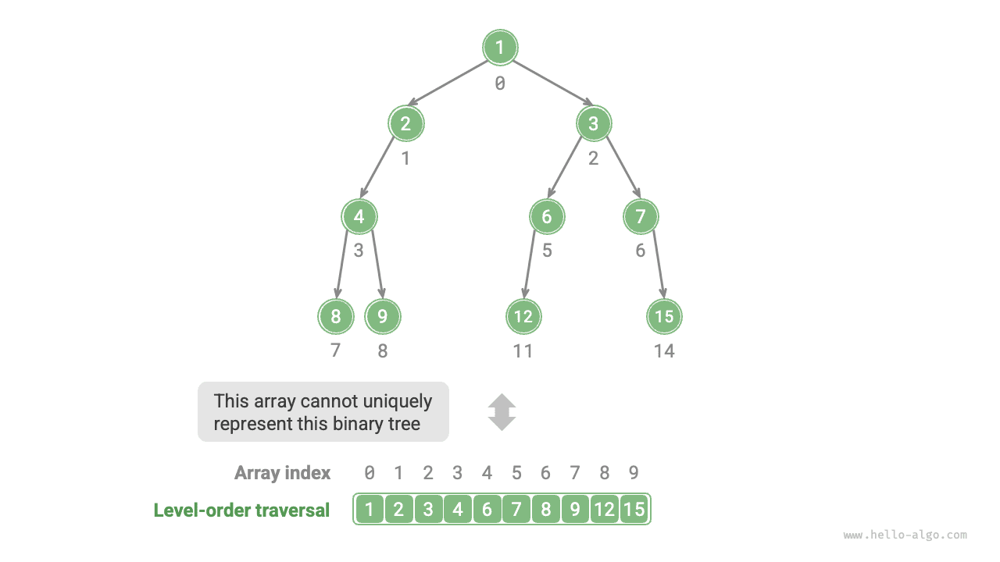

# Biểu diễn mảng của cây nhị phân

Trong biểu diễn danh sách liên kết, đơn vị lưu trữ của cây nhị phân là nút `TreeNode` và các nút được kết nối bằng con trỏ. Phần trước đã giới thiệu các thao tác cơ bản của cây nhị phân trong cách biểu diễn này.

Vậy chúng ta có thể sử dụng mảng để biểu diễn cây nhị phân không? Câu trả lời là có.

## Biểu diễn cây nhị phân hoàn hảo

Trước tiên hãy phân tích một trường hợp đơn giản. Cho một cây nhị phân hoàn hảo, chúng ta lưu trữ tất cả các nút trong một mảng theo thứ tự duyệt cấp bậc, trong đó mỗi nút tương ứng với một chỉ mục mảng duy nhất.

Dựa trên các đặc điểm của truyền tải theo thứ tự cấp, chúng ta có thể rút ra một "công thức ánh xạ" giữa chỉ mục nút cha và chỉ mục nút con: **Nếu chỉ mục của nút là $i$, thì chỉ mục con bên trái của nó là $2i + 1$ và chỉ mục con bên phải của nó là $2i + 2$**. Hình dưới đây cho thấy mối quan hệ ánh xạ giữa các chỉ số nút khác nhau.


**Công thức ánh xạ đóng vai trò tương tự như tham chiếu nút (con trỏ) trong danh sách liên kết**. Với bất kỳ nút nào trong mảng, chúng ta có thể truy cập nút con bên trái (phải) của nó bằng công thức ánh xạ.

## Đại diện cho bất kỳ cây nhị phân nào

Cây nhị phân hoàn hảo là một trường hợp đặc biệt; ở các cấp độ giữa của cây nhị phân, thường có nhiều giá trị `None`. Vì trình tự truyền tải theo thứ tự cấp độ không bao gồm các giá trị `None` này, nên chúng tôi không thể suy ra số lượng và sự phân bổ của các giá trị `None` chỉ dựa trên trình tự này. **Điều này có nghĩa là nhiều cấu trúc cây nhị phân có thể tương ứng với cùng một trình tự duyệt cấp bậc**.

Như thể hiện trong hình bên dưới, với một cây nhị phân không hoàn hảo, phương pháp biểu diễn mảng ở trên không thành công.



Để giải quyết vấn đề này, **chúng ta có thể viết rõ ràng tất cả các giá trị `None` trong trình tự duyệt cấp bậc**. Như được hiển thị trong hình bên dưới, khi chúng ta thực hiện điều này, trình tự duyệt cấp bậc có thể biểu diễn duy nhất một cây nhị phân. Mã ví dụ như sau:

=== "Python"

    ```python title=""
    # Array representation of a binary tree
    # Using None to represent empty slots
    tree = [1, 2, 3, 4, None, 6, 7, 8, 9, None, None, 12, None, None, 15]
    ```

=== "C++"

    ```cpp title=""
    /* Array representation of a binary tree */
    // Using the maximum integer value INT_MAX to mark empty slots
    vector<int> tree = {1, 2, 3, 4, INT_MAX, 6, 7, 8, 9, INT_MAX, INT_MAX, 12, INT_MAX, INT_MAX, 15};
    ```

=== "Java"

    ```java title=""
    /* Array representation of a binary tree */
    // Using the Integer wrapper class allows for using null to mark empty slots
    Integer[] tree = { 1, 2, 3, 4, null, 6, 7, 8, 9, null, null, 12, null, null, 15 };
    ```

=== "C#"

    ```csharp title=""
    /* Array representation of a binary tree */
    // Using nullable int (int?) allows for using null to mark empty slots
    int?[] tree = [1, 2, 3, 4, null, 6, 7, 8, 9, null, null, 12, null, null, 15];
    ```

=== "Đi"

    ```go title=""
    /* Array representation of a binary tree */
    // Using an any type slice, allowing for nil to mark empty slots
    tree := []any{1, 2, 3, 4, nil, 6, 7, 8, 9, nil, nil, 12, nil, nil, 15}
    ```

=== "Nhanh chóng"

    ```swift title=""
    /* Array representation of a binary tree */
    // Using optional Int (Int?) allows for using nil to mark empty slots
    let tree: [Int?] = [1, 2, 3, 4, nil, 6, 7, 8, 9, nil, nil, 12, nil, nil, 15]
    ```

=== "JS"

    ```javascript title=""
    /* Array representation of a binary tree */
    // Using null to represent empty slots
    let tree = [1, 2, 3, 4, null, 6, 7, 8, 9, null, null, 12, null, null, 15];
    ```

=== "TS"

    ```typescript title=""
    /* Array representation of a binary tree */
    // Using null to represent empty slots
    let tree: (number | null)[] = [1, 2, 3, 4, null, 6, 7, 8, 9, null, null, 12, null, null, 15];
    ```

=== "Phi tiêu"

    ```dart title=""
    /* Array representation of a binary tree */
    // Using nullable int (int?) allows for using null to mark empty slots
    List<int?> tree = [1, 2, 3, 4, null, 6, 7, 8, 9, null, null, 12, null, null, 15];
    ```

=== "Rỉ sét"

    ```rust title=""
    /* Array representation of a binary tree */
    // Using None to mark empty slots
    let tree = [Some(1), Some(2), Some(3), Some(4), None, Some(6), Some(7), Some(8), Some(9), None, None, Some(12), None, None, Some(15)];
    ```

=== "C"

    ```c title=""
    /* Array representation of a binary tree */
    // Using the maximum int value to mark empty slots, therefore, node values must not be INT_MAX
    int tree[] = {1, 2, 3, 4, INT_MAX, 6, 7, 8, 9, INT_MAX, INT_MAX, 12, INT_MAX, INT_MAX, 15};
    ```

=== "Kotlin"

    ```kotlin title=""
    /* Array representation of a binary tree */
    // Using null to represent empty slots
    val tree = arrayOf( 1, 2, 3, 4, null, 6, 7, 8, 9, null, null, 12, null, null, 15 )
    ```

=== "Ruby"

    ```ruby title=""
    ### Array representation of a binary tree ###
    # Using nil to represent empty slots
    tree = [1, 2, 3, 4, nil, 6, 7, 8, 9, nil, nil, 12, nil, nil, 15]
    ```


Điều đáng chú ý là **cây nhị phân hoàn chỉnh rất phù hợp để biểu diễn mảng**. Nhắc lại định nghĩa về cây nhị phân hoàn chỉnh, `None` chỉ xuất hiện ở cấp dưới cùng và về phía bên phải, **có nghĩa là tất cả các giá trị `None` phải xuất hiện ở cuối trình tự duyệt theo thứ tự cấp**.

Điều này có nghĩa là khi sử dụng một mảng để biểu diễn một cây nhị phân hoàn chỉnh, có thể bỏ qua việc lưu trữ tất cả các giá trị `None`, điều này rất thuận tiện. Hình dưới đây đưa ra một ví dụ.


Đoạn mã sau triển khai cây nhị phân bằng cách sử dụng biểu diễn mảng, bao gồm các thao tác sau:

- Cho một nút, lấy giá trị của nút đó, nút con trái (phải) và nút cha.
- Nhận được các trình tự duyệt thứ tự trước, thứ tự thứ tự, thứ tự sau và thứ tự cấp.

=== "Python"
    ```python title="array_binary_tree.py"
    class ArrayBinaryTree:
        """Binary tree class represented by array"""
    
        def __init__(self, arr: list[int | None]):
            """Constructor"""
            self._tree = list(arr)
    
        def size(self):
            """List capacity"""
            return len(self._tree)
    
        def val(self, i: int) -> int | None:
            """Get value of node at index i"""
            # If index is out of bounds, return None, representing empty position
            if i < 0 or i >= self.size():
                return None
            return self._tree[i]
    
        def left(self, i: int) -> int | None:
            """Get index of left child node of node at index i"""
            return 2 * i + 1
    
        def right(self, i: int) -> int | None:
            """Get index of right child node of node at index i"""
            return 2 * i + 2
    
        def parent(self, i: int) -> int | None:
            """Get index of parent node of node at index i"""
            return (i - 1) // 2
    
        def level_order(self) -> list[int]:
            """Level-order traversal"""
            self.res = []
            # Traverse array directly
            for i in range(self.size()):
                if self.val(i) is not None:
                    self.res.append(self.val(i))
            return self.res
    
        def dfs(self, i: int, order: str):
            """Depth-first traversal"""
            if self.val(i) is None:
                return
            # Preorder traversal
            if order == "pre":
                self.res.append(self.val(i))
            self.dfs(self.left(i), order)
            # Inorder traversal
            if order == "in":
                self.res.append(self.val(i))
            self.dfs(self.right(i), order)
            # Postorder traversal
            if order == "post":
                self.res.append(self.val(i))
    
        def pre_order(self) -> list[int]:
            """Preorder traversal"""
            self.res = []
            self.dfs(0, order="pre")
            return self.res
    
        def in_order(self) -> list[int]:
            """Inorder traversal"""
            self.res = []
            self.dfs(0, order="in")
            return self.res
    
        def post_order(self) -> list[int]:
            """Postorder traversal"""
            self.res = []
            self.dfs(0, order="post")
            return self.res
    ```
=== "C++"
    ```cpp title="array_binary_tree.cpp"
    class ArrayBinaryTree {
      public:
        /* Constructor */
        ArrayBinaryTree(vector<int> arr) {
            tree = arr;
        }
    
        /* List capacity */
        int size() {
            return tree.size();
        }
    
        /* Get value of node at index i */
        int val(int i) {
            // Return INT_MAX if index out of bounds, representing empty position
            if (i < 0 || i >= size())
                return INT_MAX;
            return tree[i];
        }
    
        /* Get index of left child node of node at index i */
        int left(int i) {
            return 2 * i + 1;
        }
    
        /* Get index of right child node of node at index i */
        int right(int i) {
            return 2 * i + 2;
        }
    
        /* Get index of parent node of node at index i */
        int parent(int i) {
            return (i - 1) / 2;
        }
    
        /* Level-order traversal */
        vector<int> levelOrder() {
            vector<int> res;
            // Traverse array directly
            for (int i = 0; i < size(); i++) {
                if (val(i) != INT_MAX)
                    res.push_back(val(i));
            }
            return res;
        }
    
        /* Preorder traversal */
        vector<int> preOrder() {
            vector<int> res;
            dfs(0, "pre", res);
            return res;
        }
    
        /* Inorder traversal */
        vector<int> inOrder() {
            vector<int> res;
            dfs(0, "in", res);
            return res;
        }
    
        /* Postorder traversal */
        vector<int> postOrder() {
            vector<int> res;
            dfs(0, "post", res);
            return res;
        }
    
      private:
        vector<int> tree;
    
        /* Depth-first traversal */
        void dfs(int i, string order, vector<int> &res) {
            // If empty position, return
            if (val(i) == INT_MAX)
                return;
            // Preorder traversal
            if (order == "pre")
                res.push_back(val(i));
            dfs(left(i), order, res);
            // Inorder traversal
            if (order == "in")
                res.push_back(val(i));
            dfs(right(i), order, res);
            // Postorder traversal
            if (order == "post")
                res.push_back(val(i));
        }
    };
    ```
=== "Java"
    ```java title="array_binary_tree.java"
    class ArrayBinaryTree {
        private List<Integer> tree;
    
        /* Constructor */
        public ArrayBinaryTree(List<Integer> arr) {
            tree = new ArrayList<>(arr);
        }
    
        /* List capacity */
        public int size() {
            return tree.size();
        }
    
        /* Get value of node at index i */
        public Integer val(int i) {
            // If index out of bounds, return null to represent empty position
            if (i < 0 || i >= size())
                return null;
            return tree.get(i);
        }
    
        /* Get index of left child node of node at index i */
        public Integer left(int i) {
            return 2 * i + 1;
        }
    
        /* Get index of right child node of node at index i */
        public Integer right(int i) {
            return 2 * i + 2;
        }
    
        /* Get index of parent node of node at index i */
        public Integer parent(int i) {
            return (i - 1) / 2;
        }
    
        /* Level-order traversal */
        public List<Integer> levelOrder() {
            List<Integer> res = new ArrayList<>();
            // Traverse array directly
            for (int i = 0; i < size(); i++) {
                if (val(i) != null)
                    res.add(val(i));
            }
            return res;
        }
    
        /* Depth-first traversal */
        private void dfs(Integer i, String order, List<Integer> res) {
            // If empty position, return
            if (val(i) == null)
                return;
            // Preorder traversal
            if ("pre".equals(order))
                res.add(val(i));
            dfs(left(i), order, res);
            // Inorder traversal
            if ("in".equals(order))
                res.add(val(i));
            dfs(right(i), order, res);
            // Postorder traversal
            if ("post".equals(order))
                res.add(val(i));
        }
    
        /* Preorder traversal */
        public List<Integer> preOrder() {
            List<Integer> res = new ArrayList<>();
            dfs(0, "pre", res);
            return res;
        }
    
        /* Inorder traversal */
        public List<Integer> inOrder() {
            List<Integer> res = new ArrayList<>();
            dfs(0, "in", res);
            return res;
        }
    
        /* Postorder traversal */
        public List<Integer> postOrder() {
            List<Integer> res = new ArrayList<>();
            dfs(0, "post", res);
            return res;
        }
    }
    ```
=== "C#"
    ```csharp title="array_binary_tree.cs"
    public class ArrayBinaryTree(List<int?> arr) {
        List<int?> tree = new(arr);
    
        /* List capacity */
        public int Size() {
            return tree.Count;
        }
    
        /* Get value of node at index i */
        public int? Val(int i) {
            // If index out of bounds, return null to represent empty position
            if (i < 0 || i >= Size())
                return null;
            return tree[i];
        }
    
        /* Get index of left child node of node at index i */
        public int Left(int i) {
            return 2 * i + 1;
        }
    
        /* Get index of right child node of node at index i */
        public int Right(int i) {
            return 2 * i + 2;
        }
    
        /* Get index of parent node of node at index i */
        public int Parent(int i) {
            return (i - 1) / 2;
        }
    
        /* Level-order traversal */
        public List<int> LevelOrder() {
            List<int> res = [];
            // Traverse array directly
            for (int i = 0; i < Size(); i++) {
                if (Val(i).HasValue)
                    res.Add(Val(i)!.Value);
            }
            return res;
        }
    
        /* Depth-first traversal */
        void DFS(int i, string order, List<int> res) {
            // If empty position, return
            if (!Val(i).HasValue)
                return;
            // Preorder traversal
            if (order == "pre")
                res.Add(Val(i)!.Value);
            DFS(Left(i), order, res);
            // Inorder traversal
            if (order == "in")
                res.Add(Val(i)!.Value);
            DFS(Right(i), order, res);
            // Postorder traversal
            if (order == "post")
                res.Add(Val(i)!.Value);
        }
    
        /* Preorder traversal */
        public List<int> PreOrder() {
            List<int> res = [];
            DFS(0, "pre", res);
            return res;
        }
    
        /* Inorder traversal */
        public List<int> InOrder() {
            List<int> res = [];
            DFS(0, "in", res);
            return res;
        }
    
        /* Postorder traversal */
        public List<int> PostOrder() {
            List<int> res = [];
            DFS(0, "post", res);
            return res;
        }
    }
    ```
=== "Go"
    ```go title="array_binary_tree.go"
    type arrayBinaryTree struct {
    	tree []any
    }
    ```
=== "Swift"
    ```swift title="array_binary_tree.swift"
    class ArrayBinaryTree {
        private var tree: [Int?]
    
        /* Constructor */
        init(arr: [Int?]) {
            tree = arr
        }
    
        /* List capacity */
        func size() -> Int {
            tree.count
        }
    
        /* Get value of node at index i */
        func val(i: Int) -> Int? {
            // If index out of bounds, return null to represent empty position
            if i < 0 || i >= size() {
                return nil
            }
            return tree[i]
        }
    
        /* Get index of left child node of node at index i */
        func left(i: Int) -> Int {
            2 * i + 1
        }
    
        /* Get index of right child node of node at index i */
        func right(i: Int) -> Int {
            2 * i + 2
        }
    
        /* Get index of parent node of node at index i */
        func parent(i: Int) -> Int {
            (i - 1) / 2
        }
    
        /* Level-order traversal */
        func levelOrder() -> [Int] {
            var res: [Int] = []
            // Traverse array directly
            for i in 0 ..< size() {
                if let val = val(i: i) {
                    res.append(val)
                }
            }
            return res
        }
    
        /* Depth-first traversal */
        private func dfs(i: Int, order: String, res: inout [Int]) {
            // If empty position, return
            guard let val = val(i: i) else {
                return
            }
            // Preorder traversal
            if order == "pre" {
                res.append(val)
            }
            dfs(i: left(i: i), order: order, res: &res)
            // Inorder traversal
            if order == "in" {
                res.append(val)
            }
            dfs(i: right(i: i), order: order, res: &res)
            // Postorder traversal
            if order == "post" {
                res.append(val)
            }
        }
    
        /* Preorder traversal */
        func preOrder() -> [Int] {
            var res: [Int] = []
            dfs(i: 0, order: "pre", res: &res)
            return res
        }
    
        /* Inorder traversal */
        func inOrder() -> [Int] {
            var res: [Int] = []
            dfs(i: 0, order: "in", res: &res)
            return res
        }
    
        /* Postorder traversal */
        func postOrder() -> [Int] {
            var res: [Int] = []
            dfs(i: 0, order: "post", res: &res)
            return res
        }
    }
    ```
=== "JS"
    ```javascript title="array_binary_tree.js"
    class ArrayBinaryTree {
        #tree;
    
        /* Constructor */
        constructor(arr) {
            this.#tree = arr;
        }
    
        /* List capacity */
        size() {
            return this.#tree.length;
        }
    
        /* Get value of node at index i */
        val(i) {
            // If index out of bounds, return null to represent empty position
            if (i < 0 || i >= this.size()) return null;
            return this.#tree[i];
        }
    
        /* Get index of left child node of node at index i */
        left(i) {
            return 2 * i + 1;
        }
    
        /* Get index of right child node of node at index i */
        right(i) {
            return 2 * i + 2;
        }
    
        /* Get index of parent node of node at index i */
        parent(i) {
            return Math.floor((i - 1) / 2); // Floor division
        }
    
        /* Level-order traversal */
        levelOrder() {
            let res = [];
            // Traverse array directly
            for (let i = 0; i < this.size(); i++) {
                if (this.val(i) !== null) res.push(this.val(i));
            }
            return res;
        }
    
        /* Depth-first traversal */
        #dfs(i, order, res) {
            // If empty position, return
            if (this.val(i) === null) return;
            // Preorder traversal
            if (order === 'pre') res.push(this.val(i));
            this.#dfs(this.left(i), order, res);
            // Inorder traversal
            if (order === 'in') res.push(this.val(i));
            this.#dfs(this.right(i), order, res);
            // Postorder traversal
            if (order === 'post') res.push(this.val(i));
        }
    
        /* Preorder traversal */
        preOrder() {
            const res = [];
            this.#dfs(0, 'pre', res);
            return res;
        }
    
        /* Inorder traversal */
        inOrder() {
            const res = [];
            this.#dfs(0, 'in', res);
            return res;
        }
    
        /* Postorder traversal */
        postOrder() {
            const res = [];
            this.#dfs(0, 'post', res);
            return res;
        }
    }
    ```
=== "TS"
    ```typescript title="array_binary_tree.ts"
    class ArrayBinaryTree {
        #tree: (number | null)[];
    
        /* Constructor */
        constructor(arr: (number | null)[]) {
            this.#tree = arr;
        }
    
        /* List capacity */
        size(): number {
            return this.#tree.length;
        }
    
        /* Get value of node at index i */
        val(i: number): number | null {
            // If index out of bounds, return null to represent empty position
            if (i < 0 || i >= this.size()) return null;
            return this.#tree[i];
        }
    
        /* Get index of left child node of node at index i */
        left(i: number): number {
            return 2 * i + 1;
        }
    
        /* Get index of right child node of node at index i */
        right(i: number): number {
            return 2 * i + 2;
        }
    
        /* Get index of parent node of node at index i */
        parent(i: number): number {
            return Math.floor((i - 1) / 2); // Floor division
        }
    
        /* Level-order traversal */
        levelOrder(): number[] {
            let res = [];
            // Traverse array directly
            for (let i = 0; i < this.size(); i++) {
                if (this.val(i) !== null) res.push(this.val(i));
            }
            return res;
        }
    
        /* Depth-first traversal */
        #dfs(i: number, order: Order, res: (number | null)[]): void {
            // If empty position, return
            if (this.val(i) === null) return;
            // Preorder traversal
            if (order === 'pre') res.push(this.val(i));
            this.#dfs(this.left(i), order, res);
            // Inorder traversal
            if (order === 'in') res.push(this.val(i));
            this.#dfs(this.right(i), order, res);
            // Postorder traversal
            if (order === 'post') res.push(this.val(i));
        }
    
        /* Preorder traversal */
        preOrder(): (number | null)[] {
            const res = [];
            this.#dfs(0, 'pre', res);
            return res;
        }
    
        /* Inorder traversal */
        inOrder(): (number | null)[] {
            const res = [];
            this.#dfs(0, 'in', res);
            return res;
        }
    
        /* Postorder traversal */
        postOrder(): (number | null)[] {
            const res = [];
            this.#dfs(0, 'post', res);
            return res;
        }
    }
    ```
=== "Dart"
    ```dart title="array_binary_tree.dart"
    class ArrayBinaryTree {
      late List<int?> _tree;
    
      /* Constructor */
      ArrayBinaryTree(this._tree);
    
      /* List capacity */
      int size() {
        return _tree.length;
      }
    
      /* Get value of node at index i */
      int? val(int i) {
        // If index out of bounds, return null to represent empty position
        if (i < 0 || i >= size()) {
          return null;
        }
        return _tree[i];
      }
    
      /* Get index of left child node of node at index i */
      int? left(int i) {
        return 2 * i + 1;
      }
    
      /* Get index of right child node of node at index i */
      int? right(int i) {
        return 2 * i + 2;
      }
    
      /* Get index of parent node of node at index i */
      int? parent(int i) {
        return (i - 1) ~/ 2;
      }
    
      /* Level-order traversal */
      List<int> levelOrder() {
        List<int> res = [];
        for (int i = 0; i < size(); i++) {
          if (val(i) != null) {
            res.add(val(i)!);
          }
        }
        return res;
      }
    
      /* Depth-first traversal */
      void dfs(int i, String order, List<int?> res) {
        // If empty position, return
        if (val(i) == null) {
          return;
        }
        // Preorder traversal
        if (order == 'pre') {
          res.add(val(i));
        }
        dfs(left(i)!, order, res);
        // Inorder traversal
        if (order == 'in') {
          res.add(val(i));
        }
        dfs(right(i)!, order, res);
        // Postorder traversal
        if (order == 'post') {
          res.add(val(i));
        }
      }
    
      /* Preorder traversal */
      List<int?> preOrder() {
        List<int?> res = [];
        dfs(0, 'pre', res);
        return res;
      }
    
      /* Inorder traversal */
      List<int?> inOrder() {
        List<int?> res = [];
        dfs(0, 'in', res);
        return res;
      }
    
      /* Postorder traversal */
      List<int?> postOrder() {
        List<int?> res = [];
        dfs(0, 'post', res);
        return res;
      }
    }
    ```
=== "Rust"
    ```rust title="array_binary_tree.rs"
    struct ArrayBinaryTree {
        tree: Vec<Option<i32>>,
    }
    ```
=== "C"
    ```c title="array_binary_tree.c"
    ArrayBinaryTree *newArrayBinaryTree(int *arr, int arrSize) {
        ArrayBinaryTree *abt = (ArrayBinaryTree *)malloc(sizeof(ArrayBinaryTree));
        abt->tree = malloc(sizeof(int) * arrSize);
        memcpy(abt->tree, arr, sizeof(int) * arrSize);
        abt->size = arrSize;
        return abt;
    }
    ```
=== "Kotlin"
    ```kotlin title="array_binary_tree.kt"
    class ArrayBinaryTree(private val tree: MutableList<Int?>) {
        /* List capacity */
        fun size(): Int {
            return tree.size
        }
    
        /* Get value of node at index i */
        fun _val(i: Int): Int? {
            // If index out of bounds, return null to represent empty position
            if (i < 0 || i >= size()) return null
            return tree[i]
        }
    
        /* Get index of left child node of node at index i */
        fun left(i: Int): Int {
            return 2 * i + 1
        }
    
        /* Get index of right child node of node at index i */
        fun right(i: Int): Int {
            return 2 * i + 2
        }
    
        /* Get index of parent node of node at index i */
        fun parent(i: Int): Int {
            return (i - 1) / 2
        }
    
        /* Level-order traversal */
        fun levelOrder(): MutableList<Int?> {
            val res = mutableListOf<Int?>()
            // Traverse array directly
            for (i in 0..<size()) {
                if (_val(i) != null)
                    res.add(_val(i))
            }
            return res
        }
    
        /* Depth-first traversal */
        fun dfs(i: Int, order: String, res: MutableList<Int?>) {
            // If empty position, return
            if (_val(i) == null)
                return
            // Preorder traversal
            if ("pre" == order)
                res.add(_val(i))
            dfs(left(i), order, res)
            // Inorder traversal
            if ("in" == order)
                res.add(_val(i))
            dfs(right(i), order, res)
            // Postorder traversal
            if ("post" == order)
                res.add(_val(i))
        }
    
        /* Preorder traversal */
        fun preOrder(): MutableList<Int?> {
            val res = mutableListOf<Int?>()
            dfs(0, "pre", res)
            return res
        }
    
        /* Inorder traversal */
        fun inOrder(): MutableList<Int?> {
            val res = mutableListOf<Int?>()
            dfs(0, "in", res)
            return res
        }
    
        /* Postorder traversal */
        fun postOrder(): MutableList<Int?> {
            val res = mutableListOf<Int?>()
            dfs(0, "post", res)
            return res
        }
    }
    ```
=== "Ruby"
    ```ruby title="array_binary_tree.rb"
    ### Array representation of binary tree class ###
    class ArrayBinaryTree
      ### Constructor ###
      def initialize(arr)
        @tree = arr.to_a
      end
    
      ### List capacity ###
      def size
        @tree.length
      end
    
      ### Get value of node at index i ###
      def val(i)
        # Return nil if index out of bounds, representing empty position
        return if i < 0 || i >= size
    
        @tree[i]
      end
    
      ### Get left child index of node at index i ###
      def left(i)
        2 * i + 1
      end
    
      ### Get right child index of node at index i ###
      def right(i)
        2 * i + 2
      end
    
      ### Get parent node index of node at index i ###
      def parent(i)
        (i - 1) / 2
      end
    
      ### Level-order traversal ###
      def level_order
        @res = []
    
        # Traverse array directly
        for i in 0...size
          @res << val(i) unless val(i).nil?
        end
    
        @res
      end
    
      ### Depth-first traversal ###
      def dfs(i, order)
        return if val(i).nil?
        # Preorder traversal
        @res << val(i) if order == :pre
        dfs(left(i), order)
        # Inorder traversal
        @res << val(i) if order == :in
        dfs(right(i), order)
        # Postorder traversal
        @res << val(i) if order == :post
      end
    
      ### Pre-order traversal ###
      def pre_order
        @res = []
        dfs(0, :pre)
        @res
      end
    
      ### In-order traversal ###
      def in_order
        @res = []
        dfs(0, :in)
        @res
      end
    
      ### Post-order traversal ###
      def post_order
        @res = []
        dfs(0, :post)
        @res
      end
    ```


## Ưu điểm và hạn chế

Việc biểu diễn mảng của cây nhị phân có những ưu điểm sau:

- Mảng được lưu trữ trong không gian bộ nhớ liền kề, thân thiện với bộ đệm, cho phép truy cập và truyền tải nhanh hơn.
- Không yêu cầu lưu trữ con trỏ, giúp tiết kiệm không gian.
- Nó cho phép truy cập ngẫu nhiên vào các nút.

Tuy nhiên, cách biểu diễn mảng cũng có một số hạn chế:

- Lưu trữ mảng yêu cầu không gian bộ nhớ liền kề nên không phù hợp để lưu trữ cây có lượng dữ liệu lớn.
- Việc thêm hoặc bớt các nút yêu cầu các thao tác chèn và xóa mảng, hiệu quả thấp hơn.
- Khi có nhiều giá trị `None` trong cây nhị phân, tỷ lệ dữ liệu nút chứa trong mảng thấp, dẫn đến mức sử dụng không gian thấp hơn.
