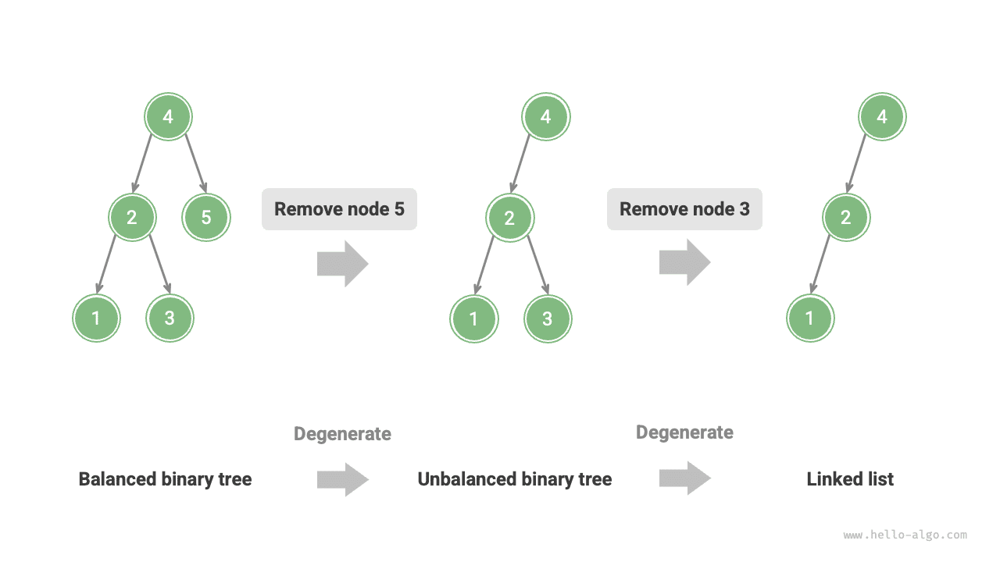
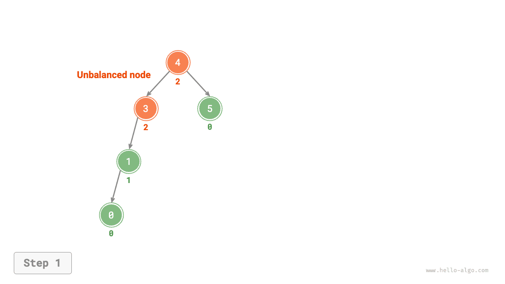

# Cây AVL *

Trong phần "Cây tìm kiếm nhị phân", chúng tôi đã đề cập rằng sau nhiều thao tác chèn và xóa, cây tìm kiếm nhị phân có thể thoái hóa thành danh sách liên kết. Trong trường hợp này, độ phức tạp về thời gian của tất cả các thao tác giảm từ $O(\log n)$ xuống $O(n)$.

Như thể hiện trong hình bên dưới, sau hai thao tác loại bỏ nút, cây tìm kiếm nhị phân này sẽ chuyển thành danh sách liên kết.



Ví dụ, trong cây nhị phân hoàn hảo như trong hình bên dưới, sau khi chèn hai nút, cây sẽ nghiêng nhiều về bên trái và độ phức tạp về thời gian của các thao tác tìm kiếm cũng sẽ giảm đi.


Năm 1962, G. M. Adelson-Velsky và E. M. Landis đã đề xuất <u>cây AVL</u> trong bài báo "Một thuật toán tổ chức thông tin". Bài viết mô tả một loạt các thao tác ngăn chặn cây AVL bị thoái hóa khi các nút được chèn và xóa, do đó giữ độ phức tạp về thời gian của các thao tác khác nhau ở mức $O(\log n)$. Nói cách khác, trong các tình huống yêu cầu các hoạt động chèn, xóa, tra cứu và cập nhật thường xuyên, cây AVL có thể duy trì hiệu suất ổn định và do đó có giá trị thực tế cao.

## Thuật ngữ thông dụng trong cây AVL

Cây AVL vừa là cây tìm kiếm nhị phân vừa là cây nhị phân cân bằng, đồng thời thỏa mãn tất cả các thuộc tính của hai loại cây nhị phân này nên là <u>cây tìm kiếm nhị phân cân bằng</u>.

### Chiều cao nút

Vì các hoạt động liên quan đến cây AVL yêu cầu lấy chiều cao nút, nên chúng ta cần thêm biến `height` vào lớp nút:

=== "Trăn"

    ```python title=""
    class TreeNode:
        """AVL tree node"""
        def __init__(self, val: int):
            self.val: int = val                 # Node value
            self.height: int = 0                # Node height
            self.left: TreeNode | None = None   # Left child reference
            self.right: TreeNode | None = None  # Right child reference
    ```

=== "C++"

    ```cpp title=""
    /* AVL tree node */
    struct TreeNode {
        int val{};          // Node value
        int height = 0;     // Node height
        TreeNode *left{};   // Left child
        TreeNode *right{};  // Right child
        TreeNode() = default;
        explicit TreeNode(int x) : val(x){}
    };
    ```

=== "Java"

    ```java title=""
    /* AVL tree node */
    class TreeNode {
        public int val;        // Node value
        public int height;     // Node height
        public TreeNode left;  // Left child
        public TreeNode right; // Right child
        public TreeNode(int x) { val = x; }
    }
    ```

=== "C#"

    ```csharp title=""
    /* AVL tree node */
    class TreeNode(int? x) {
        public int? val = x;    // Node value
        public int height;      // Node height
        public TreeNode? left;  // Left child reference
        public TreeNode? right; // Right child reference
    }
    ```

=== "Đi"

    ```go title=""
    /* AVL tree node */
    type TreeNode struct {
        Val    int       // Node value
        Height int       // Node height
        Left   *TreeNode // Left child reference
        Right  *TreeNode // Right child reference
    }
    ```

=== "Nhanh chóng"

    ```swift title=""
    /* AVL tree node */
    class TreeNode {
        var val: Int // Node value
        var height: Int // Node height
        var left: TreeNode? // Left child
        var right: TreeNode? // Right child

        init(x: Int) {
            val = x
            height = 0
        }
    }
    ```

=== "JS"

    ```javascript title=""
    /* AVL tree node */
    class TreeNode {
        val; // Node value
        height; // Node height
        left; // Left child pointer
        right; // Right child pointer
        constructor(val, left, right, height) {
            this.val = val === undefined ? 0 : val;
            this.height = height === undefined ? 0 : height;
            this.left = left === undefined ? null : left;
            this.right = right === undefined ? null : right;
        }
    }
    ```

=== "TS"

    ```typescript title=""
    /* AVL tree node */
    class TreeNode {
        val: number;            // Node value
        height: number;         // Node height
        left: TreeNode | null;  // Left child pointer
        right: TreeNode | null; // Right child pointer
        constructor(val?: number, height?: number, left?: TreeNode | null, right?: TreeNode | null) {
            this.val = val === undefined ? 0 : val;
            this.height = height === undefined ? 0 : height; 
            this.left = left === undefined ? null : left; 
            this.right = right === undefined ? null : right; 
        }
    }
    ```

=== "Phi tiêu"

    ```dart title=""
    /* AVL tree node */
    class TreeNode {
      int val;         // Node value
      int height;      // Node height
      TreeNode? left;  // Left child
      TreeNode? right; // Right child
      TreeNode(this.val, [this.height = 0, this.left, this.right]);
    }
    ```

=== "Rỉ sét"

    ```rust title=""
    use std::rc::Rc;
    use std::cell::RefCell;

    /* AVL tree node */
    struct TreeNode {
        val: i32,                               // Node value
        height: i32,                            // Node height
        left: Option<Rc<RefCell<TreeNode>>>,    // Left child
        right: Option<Rc<RefCell<TreeNode>>>,   // Right child
    }

    impl TreeNode {
        /* Constructor */
        fn new(val: i32) -> Rc<RefCell<Self>> {
            Rc::new(RefCell::new(Self {
                val,
                height: 0,
                left: None,
                right: None
            }))
        }
    }
    ```

=== "C"

    ```c title=""
    /* AVL tree node */
    typedef struct TreeNode {
        int val;
        int height;
        struct TreeNode *left;
        struct TreeNode *right;
    } TreeNode;

    /* Constructor */
    TreeNode *newTreeNode(int val) {
        TreeNode *node;

        node = (TreeNode *)malloc(sizeof(TreeNode));
        node->val = val;
        node->height = 0;
        node->left = NULL;
        node->right = NULL;
        return node;
    }
    ```

=== "Kotlin"

    ```kotlin title=""
    /* AVL tree node */
    class TreeNode(val _val: Int) {  // Node value
        val height: Int = 0          // Node height
        val left: TreeNode? = null   // Left child
        val right: TreeNode? = null  // Right child
    }
    ```

=== "Ruby"

    ```ruby title=""
    ### AVL tree node class ###
    class TreeNode
      attr_accessor :val    # Node value
      attr_accessor :height # Node height
      attr_accessor :left   # Left child reference
      attr_accessor :right  # Right child reference

      def initialize(val)
        @val = val
        @height = 0
      end
    end
    ```

"Chiều cao nút" đề cập đến khoảng cách từ nút đó đến nút lá xa nhất của nó, tức là số cạnh trên đường dẫn. Điều quan trọng cần lưu ý là chiều cao của nút lá là $0$ và chiều cao của nút null là $-1$. Chúng ta sẽ tạo hai hàm tiện ích để lấy và cập nhật chiều cao của nút:

```src
[file]{avl_tree}-[class]{avl_tree}-[func]{update_height}
```

### Hệ số cân bằng nút

<u>Hệ số cân bằng</u> của một nút được xác định bằng chiều cao của cây con bên trái của nút trừ đi chiều cao của cây con bên phải của nó và hệ số cân bằng của nút rỗng được xác định là $0$. Chúng tôi cũng gói gọn hàm để lấy hệ số cân bằng của nút để thuận tiện cho việc sử dụng sau này:

```src
[file]{avl_tree}-[class]{avl_tree}-[func]{balance_factor}
```

!!! mẹo

Đặt hệ số cân bằng là $f$ thì hệ số cân bằng của bất kỳ nút nào trong cây AVL thỏa mãn $-1 \le f \le 1$.

## Phép quay trong cây AVL

Đặc điểm của cây AVL nằm ở thao tác “xoay”, có thể khôi phục lại sự cân bằng cho các nút không cân bằng mà không ảnh hưởng đến trình tự duyệt theo thứ tự của cây nhị phân. Nói cách khác, **các thao tác xoay có thể vừa duy trì thuộc tính của "cây tìm kiếm nhị phân" vừa làm cho cây trở về "cây nhị phân cân bằng"**.

Chúng tôi gọi các nút có giá trị tuyệt đối của hệ số cân bằng $> 1$ là "các nút không cân bằng". Tùy thuộc vào tình trạng mất cân bằng, các thao tác quay được chia thành 4 loại: quay phải, quay trái, quay phải rồi quay trái và quay trái rồi quay phải. Dưới đây chúng tôi mô tả chi tiết các hoạt động xoay vòng này.

### Xoay phải

Như thể hiện trong hình bên dưới, giá trị bên dưới nút là hệ số cân bằng. Từ dưới lên trên, nút không cân bằng đầu tiên trong cây nhị phân là “nút 3”. Chúng tôi tập trung vào cây con với nút không cân bằng này làm gốc, biểu thị nút là `nút` và nút con bên trái của nó là `con` và thực hiện thao tác "xoay phải". Sau khi hoàn thành phép quay bên phải, cây con lấy lại sự cân bằng và vẫn duy trì các thuộc tính của cây tìm kiếm nhị phân.

=== "<1>"
    

=== "<2>"
    

=== "<3>"
    

=== "<4>"
    

Như minh họa trong hình bên dưới, khi nút `child` có nút con bên phải (ký hiệu là `grand_child`), cần thêm một bước trong phép quay bên phải: đặt `grand_child` làm nút con bên trái của `node`.


"Xoay phải" là một thuật ngữ tượng hình; trong thực tế, điều này đạt được bằng cách sửa đổi các con trỏ nút, như trong đoạn mã sau:

```src
[file]{avl_tree}-[class]{avl_tree}-[func]{right_rotate}
```

### Xoay trái

Tương ứng, nếu xét “gương” của cây nhị phân không cân bằng trên thì cần phải thực hiện thao tác “xoay trái” như hình dưới đây.


Tương tự, như trong hình bên dưới, khi nút `child` có nút con bên trái (ký hiệu là `grand_child`), cần thêm một bước trong phép quay trái: đặt `grand_child` làm nút con bên phải của `node`.


Có thể thấy rằng **các phép toán xoay phải và xoay trái là đối xứng gương về mặt logic và hai trường hợp mất cân bằng mà chúng giải quyết cũng đối xứng**. Dựa trên tính đối xứng, chúng ta chỉ cần thay thế tất cả `left` trong mã triển khai xoay bên phải bằng `right` và tất cả `right` bằng `left`, để có được mã triển khai xoay trái:

```src
[file]{avl_tree}-[class]{avl_tree}-[func]{left_rotate}
```

### Xoay trái rồi xoay phải

Đối với nút 3 không cân bằng trong hình bên dưới, chỉ sử dụng phép quay trái hoặc xoay phải không thể khôi phục cây con về trạng thái cân bằng. Trong trường hợp này, trước tiên cần phải thực hiện "xoay trái" trên `con`, sau đó là "xoay phải" trên `nút`.


### Xoay phải rồi xoay trái

Như được hiển thị trong hình bên dưới, đối với trường hợp phản chiếu của cây nhị phân không cân bằng ở trên, trước tiên cần thực hiện "xoay phải" trên `con`, sau đó là "xoay trái" trên `nút`.


### Lựa chọn xoay

Bốn sự mất cân bằng thể hiện trong hình bên dưới tương ứng một-một với các trường hợp trên, yêu cầu các thao tác xoay phải, xoay trái rồi xoay phải, xoay phải rồi xoay trái và xoay trái tương ứng.


Như được hiển thị trong bảng bên dưới, chúng tôi xác định nút không cân bằng thuộc trường hợp nào bằng cách đánh giá các dấu hiệu của hệ số cân bằng của nút không cân bằng và hệ số cân bằng của nút con phía cao hơn của nó.

<p align="center"> Table <id> &nbsp; Conditions for Choosing Among the Four Rotation Cases </p>

| Hệ số cân bằng của nút không cân bằng | Hệ số cân bằng của nút con | Phương pháp luân chuyển để áp dụng |
| -------------------------------------- | --------------------------------- | --------------------------------- |
| $> 1$ (cây nghiêng trái) | $\geq 0$ | Xoay phải |
| $> 1$ (cây nghiêng trái) | $<0$ | Xoay trái rồi xoay phải |
| $< -1$ (cây nghiêng phải) | $\leq 0$ | Xoay trái |
| $< -1$ (cây nghiêng phải) | $>0$ | Xoay phải rồi xoay trái |

Để dễ sử dụng, chúng tôi gói gọn các thao tác xoay thành một hàm. **Với chức năng này, chúng ta có thể thực hiện phép quay trong các tình huống mất cân bằng khác nhau, khôi phục lại sự cân bằng cho các nút không cân bằng**. Mã này như sau:

```src
[file]{avl_tree}-[class]{avl_tree}-[func]{rotate}
```

## Các thao tác chung trong cây AVL

### Chèn nút

Hoạt động chèn nút trong cây AVL về nguyên tắc tương tự như trong cây tìm kiếm nhị phân. Điểm khác biệt duy nhất là sau khi chèn một nút vào cây AVL, một loạt nút không cân bằng có thể xuất hiện trên đường dẫn từ nút đó đến gốc. Do đó, **chúng ta cần bắt đầu từ nút này và thực hiện các thao tác xoay từ dưới lên trên, khôi phục lại sự cân bằng cho tất cả các nút không cân bằng**. Mã này như sau:

```src
[file]{avl_tree}-[class]{avl_tree}-[func]{insert_helper}
```

### Loại bỏ nút

Tương tự, trên cơ sở phương pháp loại bỏ nút của cây tìm kiếm nhị phân, các thao tác xoay cần được thực hiện từ dưới lên trên để khôi phục lại sự cân bằng cho tất cả các nút không cân bằng. Mã này như sau:

```src
[file]{avl_tree}-[class]{avl_tree}-[func]{remove_helper}
```

### Tìm kiếm nút

Hoạt động tìm kiếm nút trong cây AVL nhất quán với hoạt động tìm kiếm trong cây tìm kiếm nhị phân và sẽ không được trình bày chi tiết ở đây.

## Ứng dụng tiêu biểu của cây AVL

- Tổ chức và lưu trữ dữ liệu có quy mô lớn, phù hợp với các tình huống tìm kiếm tần suất cao và chèn, xóa tần suất thấp.
- Dùng để xây dựng hệ thống chỉ mục trong cơ sở dữ liệu.
- Cây đỏ đen cũng là một loại cây tìm kiếm nhị phân cân bằng phổ biến. So với cây AVL, cây đỏ đen có điều kiện cân bằng thoải mái hơn, yêu cầu ít thao tác xoay hơn để chèn và xóa nút và có hiệu suất trung bình cao hơn cho các thao tác thêm và xóa nút.
