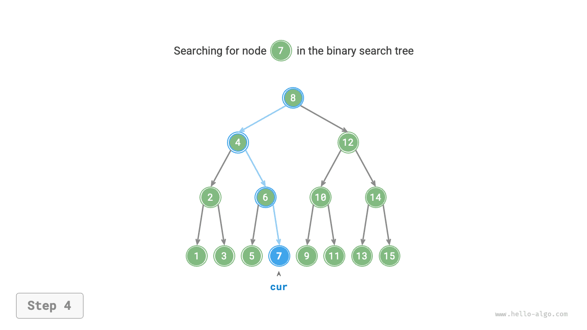
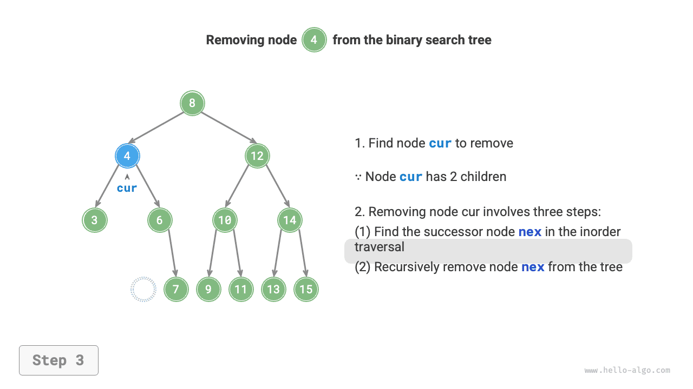
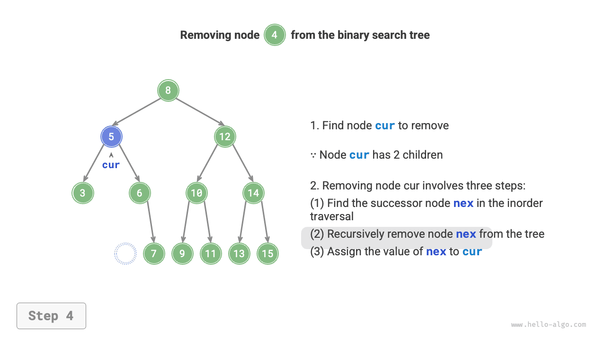
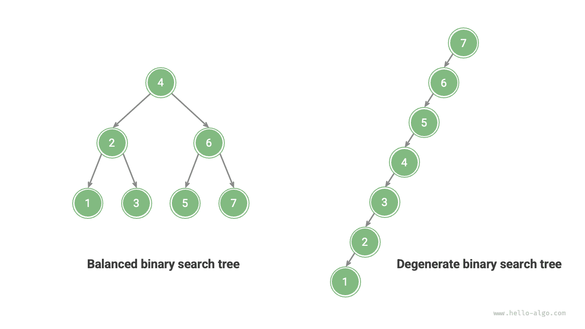

# Cây tìm kiếm nhị phân

Như minh họa trong hình bên dưới, <u>cây tìm kiếm nhị phân</u> thỏa mãn các điều kiện sau.

1. Đối với nút gốc, giá trị của tất cả các nút trong cây con bên trái $<$ giá trị của nút gốc $<$ giá trị của tất cả các nút trong cây con bên phải.
2. Cây con bên trái và bên phải của bất kỳ nút nào cũng là cây tìm kiếm nhị phân, tức là chúng cũng thỏa mãn điều kiện `1.`.


## Các thao tác trên cây tìm kiếm nhị phân

Chúng tôi đóng gói cây tìm kiếm nhị phân dưới dạng lớp `BinarySearchTree` và khai báo một biến thành viên `root` trỏ đến nút gốc của cây.

### Tìm kiếm nút

Cho trước giá trị nút đích `num`, chúng ta có thể tìm kiếm theo các thuộc tính của cây tìm kiếm nhị phân. Như được hiển thị trong hình bên dưới, chúng ta khai báo một nút `cur` và bắt đầu từ nút `root` của cây tìm kiếm nhị phân, lặp để so sánh `cur.val` với `num`.

- Nếu `cur.val < num`, nghĩa là nút đích nằm trong cây con bên phải của `cur`, do đó thực thi `cur = cur.right`.
- Nếu `cur.val > num`, nghĩa là nút đích nằm trong cây con bên trái của `cur`, do đó thực thi `cur = cur.left`.
- Nếu `cur.val = num` nghĩa là đã tìm thấy nút đích, thoát khỏi vòng lặp và trả về nút.

=== "<1>"
    

=== "<2>"
    

=== "<3>"
    

=== "<4>"
    

Hoạt động tìm kiếm trong cây tìm kiếm nhị phân tuân theo nguyên tắc tương tự như tìm kiếm nhị phân: mỗi vòng loại trừ một nửa số trường hợp còn lại. Số lần lặp vòng lặp tối đa bằng chiều cao của cây. Khi cây được cân bằng, việc tìm kiếm mất $O(\log n)$ thời gian. Mã ví dụ như sau:

```src
[file]{binary_search_tree}-[class]{binary_search_tree}-[func]{search}
```

### Chèn một nút

Cho một phần tử `num` được chèn vào, để duy trì thuộc tính của cây tìm kiếm nhị phân "cây con trái < nút gốc < cây con phải", quá trình chèn như thể hiện trong hình bên dưới.

1. **Tìm vị trí chèn**: Tương tự như thao tác tìm kiếm, bắt đầu từ nút gốc và lặp tìm kiếm xuống theo mối quan hệ kích thước giữa giá trị nút hiện tại và `num`, cho đến khi đi qua nút lá (duyệt tới `None`) rồi thoát khỏi vòng lặp.
2. **Chèn nút vào vị trí đó**: Tạo một nút cho `num` và đặt nó ở vị trí `None`.


Trong quá trình triển khai mã, hãy lưu ý hai điểm sau:

- Cây tìm kiếm nhị phân không cho phép trùng lặp nút; nếu không thì cây sẽ không còn thỏa mãn định nghĩa của nó nữa. Do đó, nếu nút được chèn đã tồn tại trong cây thì thao tác chèn sẽ bị bỏ qua và hàm sẽ trả về trực tiếp.
- Để thực hiện việc chèn nút, chúng ta cần sử dụng nút `pre` để lưu nút khỏi vòng lặp trước đó. Bằng cách này, khi duyệt tới `None`, chúng ta có thể lấy được nút cha của nó, từ đó hoàn thành thao tác chèn nút.

```src
[file]{binary_search_tree}-[class]{binary_search_tree}-[func]{insert}
```

Tương tự như tìm kiếm một nút, việc chèn một nút sử dụng thời gian $O(\log n)$.

### Xóa nút

Đầu tiên, tìm nút đích trong cây tìm kiếm nhị phân, sau đó loại bỏ nó. Tương tự như chèn nút, chúng ta cần đảm bảo rằng sau khi hoàn thành thao tác loại bỏ, thuộc tính của cây tìm kiếm nhị phân là "cây con trái $<$ nút gốc $<$ cây con phải" vẫn được duy trì. Do đó, tùy thuộc vào số lượng nút con mà nút mục tiêu có, chúng tôi xem xét ba trường hợp: độ $0$, độ $1$ và độ $2$ và thực hiện thao tác loại bỏ tương ứng.

Như được hiển thị trong hình bên dưới, khi mức độ của nút bị xóa là $0$, điều đó có nghĩa là nút đó là nút lá và có thể bị xóa trực tiếp.


Như được hiển thị trong hình bên dưới, khi mức độ của nút bị loại bỏ là $1$, việc thay thế nút bị loại bỏ bằng nút con của nó là đủ.


Khi mức độ của nút bị loại bỏ là $2$, chúng tôi không thể loại bỏ nó trực tiếp; thay vào đó, chúng ta cần sử dụng một nút để thay thế nó. Để duy trì thuộc tính của cây tìm kiếm nhị phân là "cây con bên trái $<$ nút gốc $<$ cây con bên phải," **nút này có thể là nút nhỏ nhất trong cây con bên phải hoặc nút lớn nhất trong cây con bên trái**.

Giả sử chúng ta chọn nút nhỏ nhất trong cây con bên phải, tức là nút kế tiếp theo thứ tự, quá trình loại bỏ như thể hiện trong hình bên dưới.

1. Tìm nút tiếp theo của nút cần loại bỏ trong "chuỗi truyền tải theo thứ tự", ký hiệu là `tmp`.
2. Thay thế giá trị của nút cần loại bỏ bằng giá trị của `tmp` và loại bỏ đệ quy nút `tmp` trong cây.

=== "<1>"
    

=== "<2>"
    

=== "<3>"
    

=== "<4>"
    

Hoạt động loại bỏ nút cũng sử dụng thời gian $O(\log n)$, trong đó việc tìm kiếm nút cần xóa yêu cầu thời gian $O(\log n)$ và để có được nút kế tiếp theo thứ tự yêu cầu thời gian $O(\log n)$. Mã ví dụ như sau:

```src
[file]{binary_search_tree}-[class]{binary_search_tree}-[func]{remove}
```

### Truyền tải theo thứ tự được sắp xếp

Như được hiển thị trong hình bên dưới, việc duyệt theo thứ tự của cây nhị phân tuân theo thứ tự duyệt "left $\rightarrow$ root $\rightarrow$ right", trong khi cây tìm kiếm nhị phân thỏa mãn mối quan hệ kích thước "nút con trái $<$ nút gốc $<$ nút con phải".

Điều này có nghĩa là khi thực hiện duyệt theo thứ tự trong cây tìm kiếm nhị phân, nút nhỏ nhất tiếp theo luôn được duyệt trước, do đó mang lại một thuộc tính quan trọng: **Trình tự duyệt theo thứ tự của cây tìm kiếm nhị phân đang tăng dần**.

Bằng cách sử dụng thuộc tính truyền tải theo thứ tự tăng dần, chúng ta có thể thu được dữ liệu có thứ tự trong cây tìm kiếm nhị phân chỉ trong $O(n)$ thời gian mà không cần thực hiện thêm các thao tác sắp xếp, điều này rất hiệu quả.


## Hiệu quả của cây tìm kiếm nhị phân

Đưa ra một tập hợp dữ liệu, chúng tôi xem xét sử dụng một mảng hoặc cây tìm kiếm nhị phân để lưu trữ. Quan sát bảng bên dưới, tất cả các thao tác trong cây tìm kiếm nhị phân đều có độ phức tạp thời gian logarit, mang lại hiệu suất ổn định và hiệu quả. Mảng chỉ hiệu quả hơn cây tìm kiếm nhị phân trong các trường hợp có tần suất bổ sung cao cũng như tìm kiếm và xóa tần số thấp.

<p align="center"> Table <id> &nbsp; Efficiency comparison between arrays and search trees </p>

|                | Mảng chưa sắp xếp | Cây tìm kiếm nhị phân |
| -------------- | -------------- | ------------------ |
| Phần tử tìm kiếm | $O(n)$ | $O(\log n)$ |
| Chèn phần tử | $O(1)$ | $O(\log n)$ |
| Xóa phần tử | $O(n)$ | $O(\log n)$ |

Trong trường hợp lý tưởng, cây tìm kiếm nhị phân được cân bằng, do đó, bất kỳ nút nào cũng có thể được tìm thấy trong các vòng lặp $O(\log n)$.

Tuy nhiên, nếu chúng ta liên tục chèn và xóa các nút trong cây tìm kiếm nhị phân, nó có thể thoái hóa thành danh sách liên kết như trong hình bên dưới, trong đó độ phức tạp về thời gian của các hoạt động khác nhau cũng giảm xuống $O(n)$.



## Ứng dụng phổ biến của cây tìm kiếm nhị phân

- Được sử dụng làm chỉ mục đa cấp trong hệ thống để thực hiện các hoạt động tìm kiếm, chèn và xóa hiệu quả.
- Phục vụ như cấu trúc dữ liệu cơ bản cho các thuật toán tìm kiếm nhất định.
- Dùng để lưu trữ các luồng dữ liệu nhằm duy trì trạng thái có trật tự của chúng.
