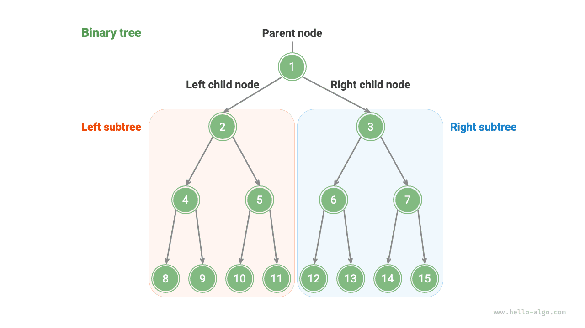
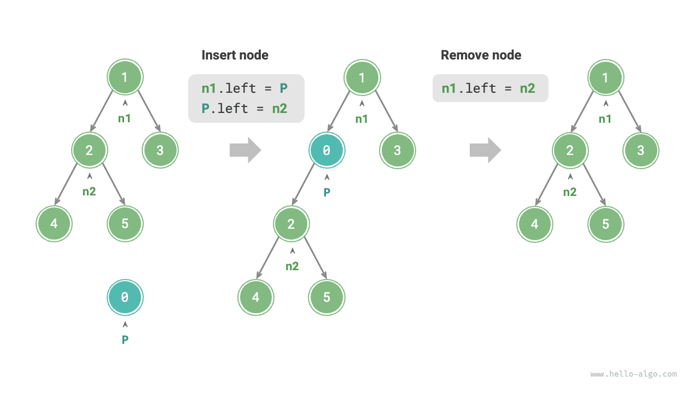
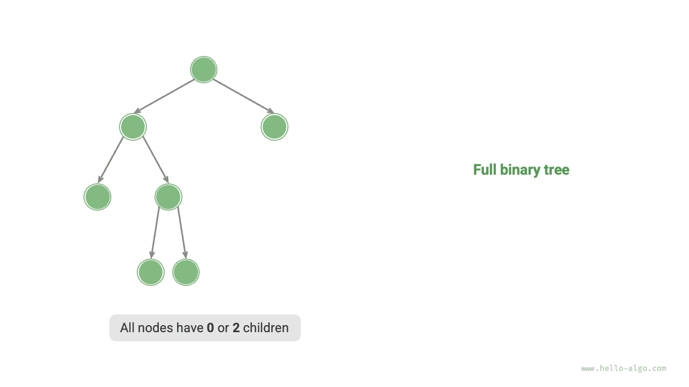
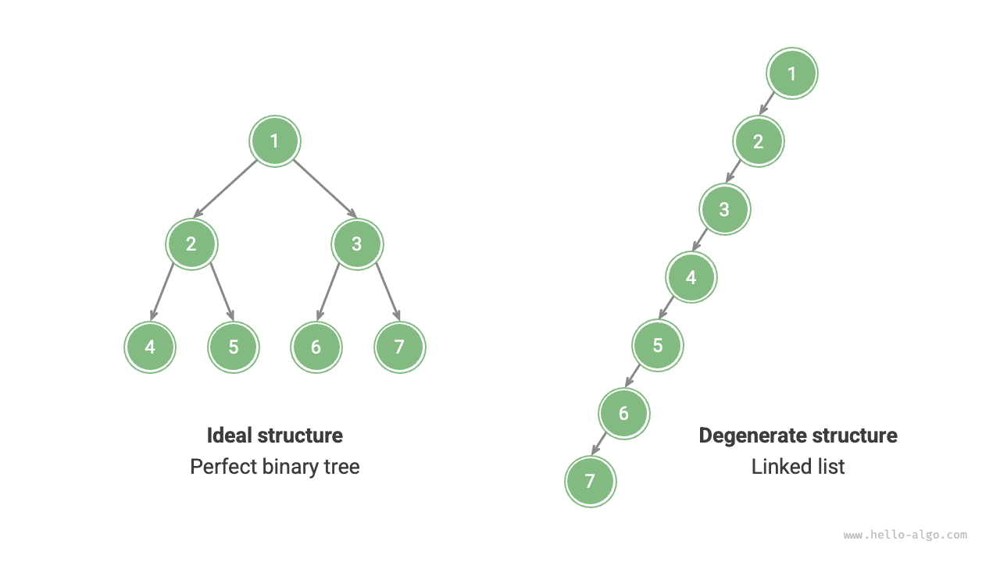

# Cây nhị phân

<u>Cây nhị phân</u> là cấu trúc dữ liệu phi tuyến tính mô hình hóa mối quan hệ phân cấp giữa "cây tổ tiên" và "con cháu" và thể hiện mô hình phân chia và chinh phục trong đó mỗi nhánh chia thành hai nhánh. Tương tự như danh sách liên kết, đơn vị cơ bản của cây nhị phân là một nút và mỗi nút chứa một giá trị, một tham chiếu đến nút con bên trái và một tham chiếu đến nút con bên phải của nó.

=== "Python"

    ```python title=""
    class TreeNode:
        """Binary tree node"""
        def __init__(self, val: int):
            self.val: int = val                # Node value
            self.left: TreeNode | None = None  # Reference to left child node
            self.right: TreeNode | None = None # Reference to right child node
    ```

=== "C++"

    ```cpp title=""
    /* Binary tree node */
    struct TreeNode {
        int val;          // Node value
        TreeNode *left;   // Pointer to left child node
        TreeNode *right;  // Pointer to right child node
        TreeNode(int x) : val(x), left(nullptr), right(nullptr) {}
    };
    ```

=== "Java"

    ```java title=""
    /* Binary tree node */
    class TreeNode {
        int val;         // Node value
        TreeNode left;   // Reference to left child node
        TreeNode right;  // Reference to right child node
        TreeNode(int x) { val = x; }
    }
    ```

=== "C#"

    ```csharp title=""
    /* Binary tree node */
    class TreeNode(int? x) {
        public int? val = x;    // Node value
        public TreeNode? left;  // Reference to left child node
        public TreeNode? right; // Reference to right child node
    }
    ```

=== "Đi"

    ```go title=""
    /* Binary tree node */
    type TreeNode struct {
        Val   int
        Left  *TreeNode
        Right *TreeNode
    }
    /* Constructor */
    func NewTreeNode(v int) *TreeNode {
        return &TreeNode{
            Left:  nil, // Pointer to left child node
            Right: nil, // Pointer to right child node
            Val:   v,   // Node value
        }
    }
    ```

=== "Nhanh chóng"

    ```swift title=""
    /* Binary tree node */
    class TreeNode {
        var val: Int // Node value
        var left: TreeNode? // Reference to left child node
        var right: TreeNode? // Reference to right child node

        init(x: Int) {
            val = x
        }
    }
    ```

=== "JS"

    ```javascript title=""
    /* Binary tree node */
    class TreeNode {
        val; // Node value
        left; // Pointer to left child node
        right; // Pointer to right child node
        constructor(val, left, right) {
            this.val = val === undefined ? 0 : val;
            this.left = left === undefined ? null : left;
            this.right = right === undefined ? null : right;
        }
    }
    ```

=== "TS"

    ```typescript title=""
    /* Binary tree node */
    class TreeNode {
        val: number;
        left: TreeNode | null;
        right: TreeNode | null;

        constructor(val?: number, left?: TreeNode | null, right?: TreeNode | null) {
            this.val = val === undefined ? 0 : val; // Node value
            this.left = left === undefined ? null : left; // Reference to left child node
            this.right = right === undefined ? null : right; // Reference to right child node
        }
    }
    ```

=== "Phi tiêu"

    ```dart title=""
    /* Binary tree node */
    class TreeNode {
      int val;         // Node value
      TreeNode? left;  // Reference to left child node
      TreeNode? right; // Reference to right child node
      TreeNode(this.val, [this.left, this.right]);
    }
    ```

=== "Rỉ sét"

    ```rust title=""
    use std::rc::Rc;
    use std::cell::RefCell;

    /* Binary tree node */
    struct TreeNode {
        val: i32,                               // Node value
        left: Option<Rc<RefCell<TreeNode>>>,    // Reference to left child node
        right: Option<Rc<RefCell<TreeNode>>>,   // Reference to right child node
    }

    impl TreeNode {
        /* Constructor */
        fn new(val: i32) -> Rc<RefCell<Self>> {
            Rc::new(RefCell::new(Self {
                val,
                left: None,
                right: None
            }))
        }
    }
    ```

=== "C"

    ```c title=""
    /* Binary tree node */
    typedef struct TreeNode {
        int val;                // Node value
        int height;             // Node height
        struct TreeNode *left;  // Pointer to left child node
        struct TreeNode *right; // Pointer to right child node
    } TreeNode;

    /* Constructor */
    TreeNode *newTreeNode(int val) {
        TreeNode *node;

        node = (TreeNode *)malloc(sizeof(TreeNode));
        node->val = val;
        node->height = 0;
        node->left = NULL;
        node->right = NULL;
        return node;
    }
    ```

=== "Kotlin"

    ```kotlin title=""
    /* Binary tree node */
    class TreeNode(val _val: Int) {  // Node value
        val left: TreeNode? = null   // Reference to left child node
        val right: TreeNode? = null  // Reference to right child node
    }
    ```

=== "Ruby"

    ```ruby title=""
    ### Binary tree node class ###
    class TreeNode
      attr_accessor :val    # Node value
      attr_accessor :left   # Reference to left child node
      attr_accessor :right  # Reference to right child node

      def initialize(val)
        @val = val
      end
    end
    ```

Mỗi nút có hai tham chiếu (con trỏ), trỏ tương ứng đến <u>nút con trái</u> và <u>nút con phải</u>. Nút này được gọi là <u>nút cha</u> của hai nút con này. Khi có một nút của cây nhị phân, chúng ta gọi cây được hình thành bởi nút con trái của nút này và tất cả các nút bên dưới nó là <u>cây con trái</u> của nút này. Tương tự, <u>cây con bên phải</u> có thể được xác định.

**Trong cây nhị phân, mọi nút không phải lá đều có các nút con và do đó các cây con không trống.** Như minh họa trong hình bên dưới, nếu "Nút 2" được coi là nút cha thì các nút con trái và phải của nó lần lượt là "Nút 4" và "Nút 5". Cây con bên trái được hình thành bởi "Nút 4" và tất cả các nút bên dưới nó, trong khi cây con bên phải được hình thành bởi "Nút 5" và tất cả các nút bên dưới nó.



## Thuật ngữ chung về cây nhị phân

Thuật ngữ thường được sử dụng của cây nhị phân được thể hiện trong hình bên dưới.

- <u>Nút gốc</u>: Nút ở cấp cao nhất của cây nhị phân, không có nút cha.
- <u>Nút lá</u>: Một nút không có bất kỳ nút con nào, với cả hai con trỏ của nó đều trỏ đến `None`.
- <u>Cạnh</u>: Đoạn đường nối hai nút, biểu thị một tham chiếu (con trỏ) giữa các nút.
- <u>Cấp</u> của một nút: Tăng dần từ trên xuống dưới, trong đó nút gốc ở cấp 1.
- <u>Bậc</u> của một nút: Số nút con mà một nút có. Trong cây nhị phân, bậc có thể là 0, 1 hoặc 2.
- <u>chiều cao</u> của cây nhị phân: Số cạnh từ nút gốc đến nút lá xa nhất.
- Độ sâu <u></u> của một nút: Số cạnh từ nút gốc đến nút.
- <u>chiều cao</u> của một nút: Số cạnh từ nút lá xa nhất đến nút đó.


!!! mẹo

Chúng ta thường định nghĩa "chiều cao" và "chiều sâu" là số cạnh đi qua, nhưng một số sách giáo khoa và các câu lệnh giải toán định nghĩa chúng là số nút trên đường đi. Trong trường hợp đó, cả hai giá trị đều lớn hơn 1.

## Các thao tác cơ bản của cây nhị phân

### Khởi tạo cây nhị phân

Tương tự như danh sách liên kết, việc khởi tạo cây nhị phân trước tiên bao gồm việc tạo các nút và sau đó thiết lập các tham chiếu (con trỏ) giữa chúng.

=== "Python"

    ```python title="binary_tree.py"
    # Initializing a binary tree
    # Initializing nodes
    n1 = TreeNode(val=1)
    n2 = TreeNode(val=2)
    n3 = TreeNode(val=3)
    n4 = TreeNode(val=4)
    n5 = TreeNode(val=5)
    # Linking references (pointers) between nodes
    n1.left = n2
    n1.right = n3
    n2.left = n4
    n2.right = n5
    ```

=== "C++"

    ```cpp title="binary_tree.cpp"
    /* Initializing a binary tree */
    // Initializing nodes
    TreeNode* n1 = new TreeNode(1);
    TreeNode* n2 = new TreeNode(2);
    TreeNode* n3 = new TreeNode(3);
    TreeNode* n4 = new TreeNode(4);
    TreeNode* n5 = new TreeNode(5);
    // Linking references (pointers) between nodes
    n1->left = n2;
    n1->right = n3;
    n2->left = n4;
    n2->right = n5;
    ```

=== "Java"

    ```java title="binary_tree.java"
    // Initializing nodes
    TreeNode n1 = new TreeNode(1);
    TreeNode n2 = new TreeNode(2);
    TreeNode n3 = new TreeNode(3);
    TreeNode n4 = new TreeNode(4);
    TreeNode n5 = new TreeNode(5);
    // Linking references (pointers) between nodes
    n1.left = n2;
    n1.right = n3;
    n2.left = n4;
    n2.right = n5;
    ```

=== "C#"

    ```csharp title="binary_tree.cs"
    /* Initializing a binary tree */
    // Initializing nodes
    TreeNode n1 = new(1);
    TreeNode n2 = new(2);
    TreeNode n3 = new(3);
    TreeNode n4 = new(4);
    TreeNode n5 = new(5);
    // Linking references (pointers) between nodes
    n1.left = n2;
    n1.right = n3;
    n2.left = n4;
    n2.right = n5;
    ```

=== "Đi"

    ```go title="binary_tree.go"
    /* Initializing a binary tree */
    // Initializing nodes
    n1 := NewTreeNode(1)
    n2 := NewTreeNode(2)
    n3 := NewTreeNode(3)
    n4 := NewTreeNode(4)
    n5 := NewTreeNode(5)
    // Linking references (pointers) between nodes
    n1.Left = n2
    n1.Right = n3
    n2.Left = n4
    n2.Right = n5
    ```

=== "Nhanh chóng"

    ```swift title="binary_tree.swift"
    // Initializing nodes
    let n1 = TreeNode(x: 1)
    let n2 = TreeNode(x: 2)
    let n3 = TreeNode(x: 3)
    let n4 = TreeNode(x: 4)
    let n5 = TreeNode(x: 5)
    // Linking references (pointers) between nodes
    n1.left = n2
    n1.right = n3
    n2.left = n4
    n2.right = n5
    ```

=== "JS"

    ```javascript title="binary_tree.js"
    /* Initializing a binary tree */
    // Initializing nodes
    let n1 = new TreeNode(1),
        n2 = new TreeNode(2),
        n3 = new TreeNode(3),
        n4 = new TreeNode(4),
        n5 = new TreeNode(5);
    // Linking references (pointers) between nodes
    n1.left = n2;
    n1.right = n3;
    n2.left = n4;
    n2.right = n5;
    ```

=== "TS"

    ```typescript title="binary_tree.ts"
    /* Initializing a binary tree */
    // Initializing nodes
    let n1 = new TreeNode(1),
        n2 = new TreeNode(2),
        n3 = new TreeNode(3),
        n4 = new TreeNode(4),
        n5 = new TreeNode(5);
    // Linking references (pointers) between nodes
    n1.left = n2;
    n1.right = n3;
    n2.left = n4;
    n2.right = n5;
    ```

=== "Phi tiêu"

    ```dart title="binary_tree.dart"
    /* Initializing a binary tree */
    // Initializing nodes
    TreeNode n1 = new TreeNode(1);
    TreeNode n2 = new TreeNode(2);
    TreeNode n3 = new TreeNode(3);
    TreeNode n4 = new TreeNode(4);
    TreeNode n5 = new TreeNode(5);
    // Linking references (pointers) between nodes
    n1.left = n2;
    n1.right = n3;
    n2.left = n4;
    n2.right = n5;
    ```

=== "Rỉ sét"

    ```rust title="binary_tree.rs"
    // Initializing nodes
    let n1 = TreeNode::new(1);
    let n2 = TreeNode::new(2);
    let n3 = TreeNode::new(3);
    let n4 = TreeNode::new(4);
    let n5 = TreeNode::new(5);
    // Linking references (pointers) between nodes
    n1.borrow_mut().left = Some(n2.clone());
    n1.borrow_mut().right = Some(n3);
    n2.borrow_mut().left = Some(n4);
    n2.borrow_mut().right = Some(n5);
    ```

=== "C"

    ```c title="binary_tree.c"
    /* Initializing a binary tree */
    // Initializing nodes
    TreeNode *n1 = newTreeNode(1);
    TreeNode *n2 = newTreeNode(2);
    TreeNode *n3 = newTreeNode(3);
    TreeNode *n4 = newTreeNode(4);
    TreeNode *n5 = newTreeNode(5);
    // Linking references (pointers) between nodes
    n1->left = n2;
    n1->right = n3;
    n2->left = n4;
    n2->right = n5;
    ```

=== "Kotlin"

    ```kotlin title="binary_tree.kt"
    // Initializing nodes
    val n1 = TreeNode(1)
    val n2 = TreeNode(2)
    val n3 = TreeNode(3)
    val n4 = TreeNode(4)
    val n5 = TreeNode(5)
    // Linking references (pointers) between nodes
    n1.left = n2
    n1.right = n3
    n2.left = n4
    n2.right = n5
    ```

=== "Ruby"

    ```ruby title="binary_tree.rb"
    # Initializing a binary tree
    # Initializing nodes
    n1 = TreeNode.new(1)
    n2 = TreeNode.new(2)
    n3 = TreeNode.new(3)
    n4 = TreeNode.new(4)
    n5 = TreeNode.new(5)
    # Linking references (pointers) between nodes
    n1.left = n2
    n1.right = n3
    n2.left = n4
    n2.right = n5
    ```

??? pythontutor "Trực quan hóa mã"

https://pythontutor.com/render.html#code=class%20TreeNode%3A%0A%20%20%20%20%22%22%22%E4%BA%8C %E5%8F%89%E6%A0%91%E8%8A%82%E7%82%B9%E7%B1%BB%22%22%22%0A%20%20%20%20def%20__init__%28self,%2 0val%3A%20int%29%3A%0A%20%20%20%20%20%20%20%20self.val%3A%20int%20%3D%20val%20%20%20%20%20%20 %20%20%20%20%20%20%20%20%20%20%23%20%E8%8A%82%E7%82%B9%E5%80%BC%0A%20%20%20%20%20%20%20%20bản thân .left%3A%20TreeNode%20%7C%20None%20%3D%20None%20%20%23%20%E5%B7%A6%E5%AD%90%E8%8A%82%E7%82%B9 %E5%BC%95%E7%94%A8%0A%20%20%20%20%20%20%20%20self.right%3A%20TreeNode%20%7C%20None%20%3D%20Non e%20%23%20%E5%8F%B3%E5%AD%90%E8%8A%82%E7%82%B9%E5%BC%95%E7%94%A8%0A%0A%22%22%22Driver%20Code% 22%22%22%0Aif%20__name__%20%3D%3D%20%22__main__%22%3A%0A%20%20%20%20%23%20%E5%88%9D%E5%A7%8B%E 5%8C%96%E4%BA%8C%E5%8F%89%E6%A0%91%0A%20%20%20%20%23%20%E5%88%9D%E5%A7%8B%E5%8C%96%E8%8A%82%E 7%82%B9%0A%20%20%20%20n1%20%3D%20TreeNode%28val%3D1%29%0A%20%20%20%20n2%20%3D%20TreeNode%28va l%3D2%29%0A%20%20%20%20n3%20%3D%20TreeNode%28val%3D3%29%0A%20%20%20%20n4%20%3D%20TreeNode%28v al%3D4%29%0A%20%20%20%20n5%20%3D%20TreeNode%28val%3D5%29%0A%20%20%20%20%23%20%E6%9E%84%E5%BB%B A%E8%8A%82%E7%82%B9%E4%B9%8B%E9%97%B4%E7%9A%84%E5%BC%95%E7%94%A8%EF%BC%88%E6%8C%87%E9%92%88%E F%BC%89%0A%20%20%20%20n1.left%20%3D%20n2%0A%20%20%20%20n1.right%20%3D%20n3%0A%20%20%20%20n2.le ft%20%3D%20n4%0A%20%20%20%20n2.right%20%3D%20n5&cumulative=false&curInstr=3&heapPrimitives=nvernest&mode=display&origin=opt-frontend.js&py=311&rawInputLstJSON=%5B%5D&textReferences=false

### Chèn và xóa nút

Tương tự như danh sách liên kết, việc chèn và xóa các nút trong cây nhị phân có thể được thực hiện bằng cách sửa đổi con trỏ. Hình dưới đây cung cấp một ví dụ.



=== "Python"

    ```python title="binary_tree.py"
    # Inserting and removing nodes
    p = TreeNode(0)
    # Inserting node P between n1 -> n2
    n1.left = p
    p.left = n2
    # Removing node P
    n1.left = n2
    ```

=== "C++"

    ```cpp title="binary_tree.cpp"
    /* Inserting and removing nodes */
    TreeNode* P = new TreeNode(0);
    // Inserting node P between n1 and n2
    n1->left = P;
    P->left = n2;
    // Removing node P
    n1->left = n2;
    ```

=== "Java"

    ```java title="binary_tree.java"
    TreeNode P = new TreeNode(0);
    // Inserting node P between n1 and n2
    n1.left = P;
    P.left = n2;
    // Removing node P
    n1.left = n2;
    ```

=== "C#"

    ```csharp title="binary_tree.cs"
    /* Inserting and removing nodes */
    TreeNode P = new(0);
    // Inserting node P between n1 and n2
    n1.left = P;
    P.left = n2;
    // Removing node P
    n1.left = n2;
    ```

=== "Đi"

    ```go title="binary_tree.go"
    /* Inserting and removing nodes */
    // Inserting node P between n1 and n2
    p := NewTreeNode(0)
    n1.Left = p
    p.Left = n2
    // Removing node P
    n1.Left = n2
    ```

=== "Nhanh chóng"

    ```swift title="binary_tree.swift"
    let P = TreeNode(x: 0)
    // Inserting node P between n1 and n2
    n1.left = P
    P.left = n2
    // Removing node P
    n1.left = n2
    ```

=== "JS"

    ```javascript title="binary_tree.js"
    /* Inserting and removing nodes */
    let P = new TreeNode(0);
    // Inserting node P between n1 and n2
    n1.left = P;
    P.left = n2;
    // Removing node P
    n1.left = n2;
    ```

=== "TS"

    ```typescript title="binary_tree.ts"
    /* Inserting and removing nodes */
    const P = new TreeNode(0);
    // Inserting node P between n1 and n2
    n1.left = P;
    P.left = n2;
    // Removing node P
    n1.left = n2;
    ```

=== "Phi tiêu"

    ```dart title="binary_tree.dart"
    /* Inserting and removing nodes */
    TreeNode P = new TreeNode(0);
    // Inserting node P between n1 and n2
    n1.left = P;
    P.left = n2;
    // Removing node P
    n1.left = n2;
    ```

=== "Rỉ sét"

    ```rust title="binary_tree.rs"
    let p = TreeNode::new(0);
    // Inserting node P between n1 and n2
    n1.borrow_mut().left = Some(p.clone());
    p.borrow_mut().left = Some(n2.clone());
    // Removing node P
    n1.borrow_mut().left = Some(n2);
    ```

=== "C"

    ```c title="binary_tree.c"
    /* Inserting and removing nodes */
    TreeNode *P = newTreeNode(0);
    // Inserting node P between n1 and n2
    n1->left = P;
    P->left = n2;
    // Removing node P
    n1->left = n2;
    ```

=== "Kotlin"

    ```kotlin title="binary_tree.kt"
    val P = TreeNode(0)
    // Inserting node P between n1 and n2
    n1.left = P
    P.left = n2
    // Removing node P
    n1.left = n2
    ```

=== "Ruby"

    ```ruby title="binary_tree.rb"
    # Inserting and removing nodes
    _p = TreeNode.new(0)
    # Inserting node _p between n1 and n2
    n1.left = _p
    _p.left = n2
    # Removing node _p
    n1.left = n2
    ```

??? pythontutor "Trực quan hóa mã"

https://pythontutor.com/render.html#code=class%20TreeNode%3A%0A%20%20%20%20%22%22%22%E4%BA%8C%E5%8F%89%E6%A0%91%E8%8A% 82%E7%82%B9%E7%B1%BB%22%22%22%0A%20%20%20%20def%20__init__%28self,%20val%3A%20int%29%3A%0A%20%20%20%20%20%20%20%20self .val%3A%20int%20%3D%20val%20%20%20%20%20%20%20%20%20%20%20%20%20%20%20%20%23%20%E8%8A%82%E7%82%B9%E5%80%BC%0A%20%20%20 %20%20%20%20%20self.left%3A%20TreeNode%20%7C%20None%20%3D%20None%20%20%23%20%E5%B7%A6%E5%AD%90%E8%8A%82%E7%82%B9%E5%BC %95%E7%94%A8%0A%20%20%20%20%20%20%20%20self.right%3A%20TreeNode%20%7C%20None%20%3D%20None%20%23%20%E5%8F%B3%E5%AD%90%E 8%8A%82%E7%82%B9%E5%BC%95%E7%94%A8%0A%0A%22%22%22Driver%20Code%22%22%22%0Aif%20__name__%20%3D%3D%20%22__main__%22%3A%0 A%20%20%20%20%23%20%E5%88%9D%E5%A7%8B%E5%8C%96%E4%BA%8C%E5% 8F%89%E6%A0%91%0A%20%20%20%20%23%20%E5%88%9D%E5%A7%8B%E5%8C %96%E8%8A%82%E7%82%B9%0A%20%20%20%20n1%20%3D%20TreeNode%28val%3D1%29%0A%20%20%20%20n2%20%3D%20TreeNode%28val%3D2%29%0A %20%20%20%20n3%20%3D%20TreeNode%28val%3D3%29%0A%20%20%20%20n4%20%3D%20TreeNode%28val%3D4%29%0A%20%20%20%20n5%20%3D%20T reeNode%28val%3D5%29%0A%20%20%20%20%23%20%E6%9E%84%E5%BB%BA%E8%8A%82%E7%82%B9%E4%B9%8B%E9%97%B4%E7%9A%84%E5%BC%95%E7%9 4%A8%EF%BC%88%E6%8C%87%E9%92%88%EF%BC%89%0A%20%20%20%20n1.left%20%3D%20n2%0A%20%20%20%20n1.right%20%3D%20n3%0A%20%20%2 0%20n2.left%20%3D%20n4%0A%20%20%20%20n2.right%20%3D%20n5%0A%0A%20%20%20%20%23%20%E6%8F%92%E5%85%A5%E4%B8%8E%E5%88%A0%E 9%99%A4%E8%8A%82%E7%82%B9%0A%20%20%20%20p%20%3D%20TreeNode%280%29%0A%20%20%20%20%23%20%E5%9C%A8%20n1%20-%3E%20n2%20%E4 %B8%AD%E9%97%B4%E6%8F%92%E5%85%A5%E8%8A%82%E7%82%B9%20P%0A%20%20%20%20n1.left%20%3D%20p%0A%20%20%20%20p.left%20%3D%20n 2%0A%20%20%20%20%23%20%E5%88%A0%E9%99%A4%E8%8A%82%E7%82%B9%20P%0A%20%20%20%20n1.left%20%3D%20n2&cumulative=false&curIn str=37&heapPrimitives=neverest&mode=display&origin=opt-frontend.js&py=311&rawInputLstJSON=%5B%5D&textReferences=false

!!! mẹo

Hãy nhớ rằng việc chèn một nút có thể làm thay đổi cấu trúc logic ban đầu của cây nhị phân, trong khi việc xóa một nút thường đòi hỏi phải loại bỏ nút đó cùng với toàn bộ cây con của nó. Do đó, trong thực tế, việc chèn và xóa cây nhị phân thường được thực hiện dưới dạng chuỗi các thao tác phối hợp để đạt được kết quả có ý nghĩa.

## Các loại cây nhị phân phổ biến

### Cây nhị phân hoàn hảo

Như được hiển thị trong hình bên dưới, <u>cây nhị phân hoàn hảo</u> có mọi cấp độ được lấp đầy hoàn toàn. Trong cây nhị phân hoàn hảo, các nút lá có bậc $0$, trong khi tất cả các nút khác có bậc $2$. Nếu chiều cao của cây là $h$ thì tổng số nút là $2^{h+1} - 1$, tuân theo mô hình hàm mũ tiêu chuẩn phản ánh hiện tượng phân chia tế bào phổ biến trong tự nhiên.

!!! mẹo

Xin lưu ý rằng trong cộng đồng người Trung Quốc, cây nhị phân hoàn hảo thường được gọi là <u>cây nhị phân đầy đủ</u>.


### Cây nhị phân hoàn chỉnh

Như minh họa trong hình bên dưới, <u>cây nhị phân hoàn chỉnh</u> chỉ cho phép lấp đầy mức dưới cùng không đầy đủ và các nút ở mức dưới cùng phải được lấp đầy liên tục từ trái sang phải. Lưu ý rằng cây nhị phân hoàn hảo cũng là cây nhị phân hoàn chỉnh.


### Cây nhị phân đầy đủ

Như minh họa trong hình bên dưới, trong một <u>cây nhị phân đầy đủ</u>, tất cả các nút ngoại trừ nút lá đều có hai nút con.



### Cây nhị phân cân bằng

Như minh họa trong hình bên dưới, trong <u>cây nhị phân cân bằng</u>, chênh lệch tuyệt đối giữa chiều cao của cây con trái và cây con phải của bất kỳ nút nào không vượt quá 1.


## Sự thoái hóa của cây nhị phân

Hình dưới đây tương phản với cấu trúc lý tưởng và suy biến của cây nhị phân. Khi mọi cấp độ được lấp đầy, cây sẽ trở thành "cây nhị phân hoàn hảo"; khi tất cả các nút nghiêng về một phía, cây nhị phân sẽ thoái hóa thành "danh sách liên kết".

- Cây nhị phân hoàn hảo là trường hợp lý tưởng, tận dụng tối đa ưu điểm phân chia để trị của cây nhị phân.
- Danh sách liên kết thể hiện một thái cực khác, trong đó tất cả các hoạt động trở thành hoạt động tuyến tính với độ phức tạp về thời gian giảm xuống $O(n)$.



Như được hiển thị trong bảng bên dưới, trong cấu trúc tốt nhất và xấu nhất, cây nhị phân đạt được giá trị tối đa hoặc tối thiểu về số lượng nút lá, tổng số nút và chiều cao.

<p align="center"> Table <id> &nbsp; The Best and Worst Structures of Binary Trees </p>

|                                                 | Cây nhị phân hoàn hảo | Danh sách liên kết |
| ----------------------------------------------- | ------------------- | ----------- |
| Số lượng nút ở cấp độ $i$ | $2^{i-1}$ | $1$ |
| Số nút lá trên cây có chiều cao $h$ | $2^h$ | $1$ |
| Tổng số nút trong cây có chiều cao $h$ | $2^{h+1} - 1$ | $h + 1$ |
| Chiều cao của cây với tổng số nút $n$ | $\log_2 (n+1) - 1$ | $n - 1$ |
