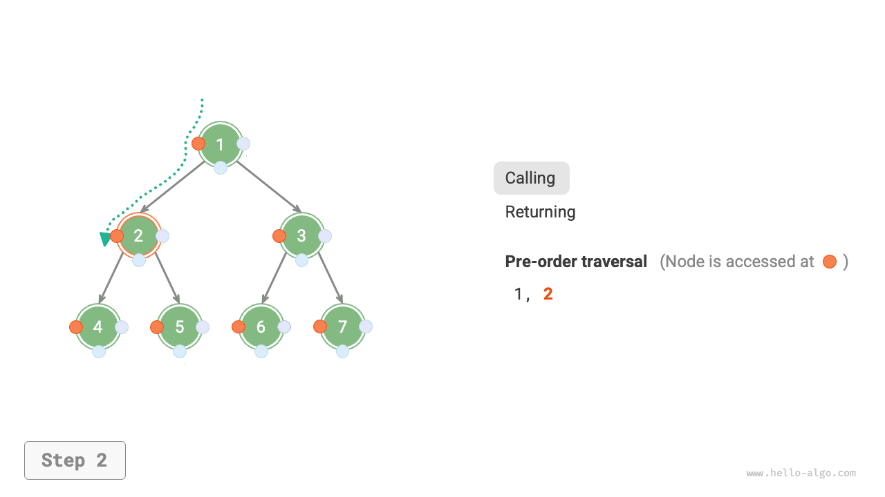
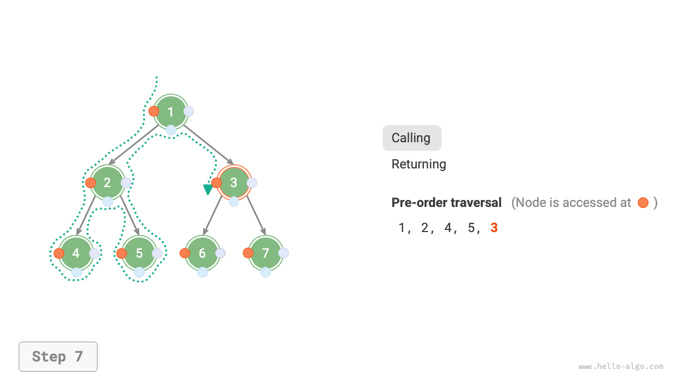
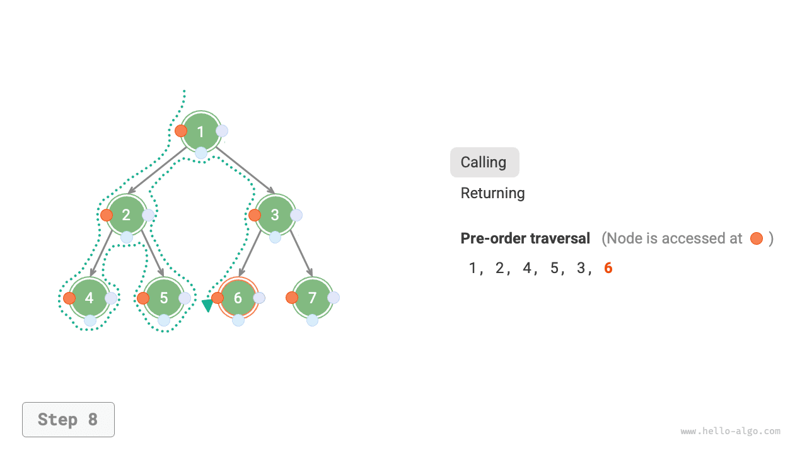
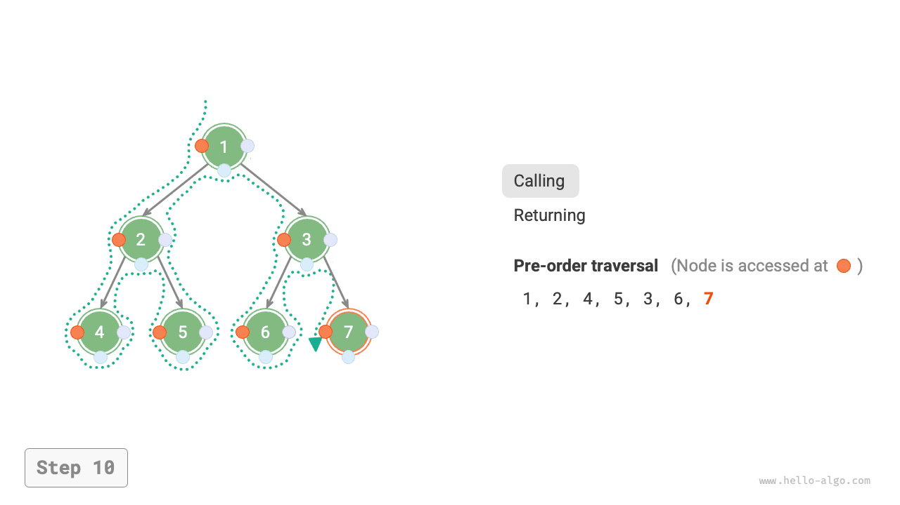

# Truyền cây nhị phân

Từ góc độ cấu trúc vật lý, cây là cấu trúc dữ liệu dựa trên các danh sách được liên kết. Do đó, phương pháp truyền tải của nó liên quan đến việc truy cập từng nút một thông qua con trỏ. Tuy nhiên, cây là một cấu trúc dữ liệu phi tuyến tính, khiến cho việc duyệt cây phức tạp hơn việc duyệt danh sách liên kết, cần có sự hỗ trợ của các thuật toán tìm kiếm.

Các phương pháp duyệt phổ biến cho cây nhị phân bao gồm duyệt theo cấp độ, duyệt theo thứ tự trước, duyệt theo thứ tự và duyệt theo thứ tự sau.

##Truyền tải thứ tự cấp độ

Như được hiển thị trong hình bên dưới, <u>truyền tải theo thứ tự cấp độ</u> truyền tải cây nhị phân từ trên xuống dưới, từng lớp. Trong mỗi cấp độ, nó truy cập các nút từ trái sang phải.

Truyền tải theo cấp độ về cơ bản là <u>truyền tải theo chiều rộng</u>, còn được gọi là <u>tìm kiếm theo chiều rộng (BFS)</u>, tiến hành ra ngoài theo cấp độ.


### Triển khai mã

Truyền tải theo chiều rộng thường được thực hiện với sự trợ giúp của "hàng đợi". Hàng đợi tuân theo quy tắc "vào trước, ra trước", trong khi truyền tải theo chiều rộng tuân theo quy tắc "tiến triển theo từng lớp"; những ý tưởng cơ bản của cả hai là nhất quán. Mã thực hiện như sau:

=== "Python"
    ```python title="binary_tree_bfs.py"
    def level_order(root: TreeNode | None) -> list[int]:
        """Level-order traversal"""
        # Initialize queue, add root node
        queue: deque[TreeNode] = deque()
        queue.append(root)
        # Initialize a list to save the traversal sequence
        res = []
        while queue:
            node: TreeNode = queue.popleft()  # Dequeue
            res.append(node.val)  # Save node value
            if node.left is not None:
                queue.append(node.left)  # Left child node enqueue
            if node.right is not None:
                queue.append(node.right)  # Right child node enqueue
        return res
    ```
=== "C++"
    ```cpp title="binary_tree_bfs.cpp"
    vector<int> levelOrder(TreeNode *root) {
        // Initialize queue, add root node
        queue<TreeNode *> queue;
        queue.push(root);
        // Initialize a list to save the traversal sequence
        vector<int> vec;
        while (!queue.empty()) {
            TreeNode *node = queue.front();
            queue.pop();              // Dequeue
            vec.push_back(node->val); // Save node value
            if (node->left != nullptr)
                queue.push(node->left); // Left child node enqueue
            if (node->right != nullptr)
                queue.push(node->right); // Right child node enqueue
        }
        return vec;
    }
    ```
=== "Java"
    ```java title="binary_tree_bfs.java"
    static List<Integer> levelOrder(TreeNode root) {
            // Initialize queue, add root node
            Queue<TreeNode> queue = new LinkedList<>();
            queue.add(root);
            // Initialize a list to save the traversal sequence
            List<Integer> list = new ArrayList<>();
            while (!queue.isEmpty()) {
                TreeNode node = queue.poll(); // Dequeue
                list.add(node.val);           // Save node value
                if (node.left != null)
                    queue.offer(node.left);   // Left child node enqueue
                if (node.right != null)
                    queue.offer(node.right);  // Right child node enqueue
            }
            return list;
        }
    ```
=== "C#"
    ```csharp title="binary_tree_bfs.cs"
    List<int> LevelOrder(TreeNode root) {
            // Initialize queue, add root node
            Queue<TreeNode> queue = new();
            queue.Enqueue(root);
            // Initialize a list to save the traversal sequence
            List<int> list = [];
            while (queue.Count != 0) {
                TreeNode node = queue.Dequeue(); // Dequeue
                list.Add(node.val!.Value);       // Save node value
                if (node.left != null)
                    queue.Enqueue(node.left);    // Left child node enqueue
                if (node.right != null)
                    queue.Enqueue(node.right);   // Right child node enqueue
            }
            return list;
        }
    ```
=== "Go"
    ```go title="binary_tree_bfs.go"
    func levelOrder(root *TreeNode) []any {
    	// Initialize queue, add root node
    	queue := list.New()
    	queue.PushBack(root)
    	// Initialize a slice to save traversal sequence
    	nums := make([]any, 0)
    	for queue.Len() > 0 {
    		// Dequeue
    		node := queue.Remove(queue.Front()).(*TreeNode)
    		// Save node value
    		nums = append(nums, node.Val)
    		if node.Left != nil {
    			// Left child node enqueue
    			queue.PushBack(node.Left)
    		}
    		if node.Right != nil {
    			// Right child node enqueue
    			queue.PushBack(node.Right)
    		}
    	}
    	return nums
    }
    ```
=== "Swift"
    ```swift title="binary_tree_bfs.swift"
    func levelOrder(root: TreeNode) -> [Int] {
        // Initialize queue, add root node
        var queue: [TreeNode] = [root]
        // Initialize a list to save the traversal sequence
        var list: [Int] = []
        while !queue.isEmpty {
            let node = queue.removeFirst() // Dequeue
            list.append(node.val) // Save node value
            if let left = node.left {
                queue.append(left) // Left child node enqueue
            }
            if let right = node.right {
                queue.append(right) // Right child node enqueue
            }
        }
        return list
    }
    ```
=== "JS"
    ```javascript title="binary_tree_bfs.js"
    function levelOrder(root) {
        // Initialize queue, add root node
        const queue = [root];
        // Initialize a list to save the traversal sequence
        const list = [];
        while (queue.length) {
            let node = queue.shift(); // Dequeue
            list.push(node.val); // Save node value
            if (node.left) queue.push(node.left); // Left child node enqueue
            if (node.right) queue.push(node.right); // Right child node enqueue
        }
        return list;
    }
    ```
=== "TS"
    ```typescript title="binary_tree_bfs.ts"
    function levelOrder(root: TreeNode | null): number[] {
        // Initialize queue, add root node
        const queue = [root];
        // Initialize a list to save the traversal sequence
        const list: number[] = [];
        while (queue.length) {
            let node = queue.shift() as TreeNode; // Dequeue
            list.push(node.val); // Save node value
            if (node.left) {
                queue.push(node.left); // Left child node enqueue
            }
            if (node.right) {
                queue.push(node.right); // Right child node enqueue
            }
        }
        return list;
    }
    ```
=== "Dart"
    ```dart title="binary_tree_bfs.dart"
    List<int> levelOrder(TreeNode? root) {
      // Initialize queue, add root node
      Queue<TreeNode?> queue = Queue();
      queue.add(root);
      // Initialize a list to save the traversal sequence
      List<int> res = [];
      while (queue.isNotEmpty) {
        TreeNode? node = queue.removeFirst(); // Dequeue
        res.add(node!.val); // Save node value
        if (node.left != null) queue.add(node.left); // Left child node enqueue
        if (node.right != null) queue.add(node.right); // Right child node enqueue
      }
      return res;
    }
    ```
=== "Rust"
    ```rust title="binary_tree_bfs.rs"
    fn level_order(root: &Rc<RefCell<TreeNode>>) -> Vec<i32> {
        // Initialize queue, add root node
        let mut que = VecDeque::new();
        que.push_back(root.clone());
        // Initialize a list to save the traversal sequence
        let mut vec = Vec::new();
    
        while let Some(node) = que.pop_front() {
            // Dequeue
            vec.push(node.borrow().val); // Save node value
            if let Some(left) = node.borrow().left.as_ref() {
                que.push_back(left.clone()); // Left child node enqueue
            }
            if let Some(right) = node.borrow().right.as_ref() {
                que.push_back(right.clone()); // Right child node enqueue
            };
        }
        vec
    }
    ```
=== "C"
    ```c title="binary_tree_bfs.c"
    int *levelOrder(TreeNode *root, int *size) {
        /* Auxiliary queue */
        int front, rear;
        int index, *arr;
        TreeNode *node;
        TreeNode **queue;
    
        /* Auxiliary queue */
        queue = (TreeNode **)malloc(sizeof(TreeNode *) * MAX_SIZE);
        // Queue pointer
        front = 0, rear = 0;
        // Add root node
        queue[rear++] = root;
        // Initialize a list to save the traversal sequence
        /* Auxiliary array */
        arr = (int *)malloc(sizeof(int) * MAX_SIZE);
        // Array pointer
        index = 0;
        while (front < rear) {
            // Dequeue
            node = queue[front++];
            // Save node value
            arr[index++] = node->val;
            if (node->left != NULL) {
                // Left child node enqueue
                queue[rear++] = node->left;
            }
            if (node->right != NULL) {
                // Right child node enqueue
                queue[rear++] = node->right;
            }
        }
        // Update array length value
        *size = index;
        arr = realloc(arr, sizeof(int) * (*size));
    
        // Free auxiliary array space
        free(queue);
        return arr;
    }
    ```
=== "Kotlin"
    ```kotlin title="binary_tree_bfs.kt"
    fun levelOrder(root: TreeNode?): MutableList<Int> {
        // Initialize queue, add root node
        val queue = LinkedList<TreeNode?>()
        queue.add(root)
        // Initialize a list to save the traversal sequence
        val list = mutableListOf<Int>()
        while (queue.isNotEmpty()) {
            val node = queue.poll()      // Dequeue
            list.add(node?._val!!)       // Save node value
            if (node.left != null)
                queue.offer(node.left)   // Left child node enqueue
            if (node.right != null)
                queue.offer(node.right)  // Right child node enqueue
        }
        return list
    }
    ```
=== "Ruby"
    ```ruby title="binary_tree_bfs.rb"
    ### Level-order traversal ###
    def level_order(root)
      # Initialize queue, add root node
      queue = [root]
      # Initialize a list to save the traversal sequence
      res = []
      while !queue.empty?
        node = queue.shift # Dequeue
        res << node.val # Save node value
        queue << node.left unless node.left.nil? # Left child node enqueue
        queue << node.right unless node.right.nil? # Right child node enqueue
      end
      res
    ```


### Phân tích độ phức tạp

- **Độ phức tạp về thời gian là $O(n)$**: Tất cả các nút được truy cập một lần, sử dụng thời gian $O(n)$, trong đó $n$ là số lượng nút.
- **Độ phức tạp của không gian là $O(n)$**: Trong trường hợp xấu nhất, tức là một cây nhị phân đầy đủ, trước khi duyệt đến mức dưới cùng, hàng đợi chứa đồng thời nhiều nhất các nút $(n + 1) / 2$, chiếm không gian $O(n)$.

## Truyền tải thứ tự trước, thứ tự thứ tự và thứ tự sau

Tương ứng, việc duyệt theo thứ tự trước, theo thứ tự và theo thứ tự sau đều thuộc về <u>tìm kiếm theo chiều sâu</u>, còn được gọi là <u>tìm kiếm theo chiều sâu (DFS)</u>, đi sâu nhất có thể trước khi quay lui.

Hình dưới đây cho thấy cách thức hoạt động của quá trình truyền tải theo chiều sâu trên cây nhị phân. **Truyền tải theo chiều sâu giống như "đi bộ" xung quanh chu vi của toàn bộ cây nhị phân**, gặp ba vị trí tại mỗi nút, tương ứng với duyệt theo thứ tự trước, theo thứ tự và theo thứ tự sau.


### Triển khai mã

Tìm kiếm theo chiều sâu thường được triển khai dựa trên đệ quy:

=== "Python"
    ```python title="binary_tree_dfs.py"
    def post_order(root: TreeNode | None):
        """Postorder traversal"""
        if root is None:
            return
        # Visit priority: left subtree -> right subtree -> root node
        post_order(root=root.left)
        post_order(root=root.right)
        res.append(root.val)
    ```
=== "C++"
    ```cpp title="binary_tree_dfs.cpp"
    void postOrder(TreeNode *root) {
        if (root == nullptr)
            return;
        // Visit priority: left subtree -> right subtree -> root node
        postOrder(root->left);
        postOrder(root->right);
        vec.push_back(root->val);
    }
    ```
=== "Java"
    ```java title="binary_tree_dfs.java"
    static void postOrder(TreeNode root) {
            if (root == null)
                return;
            // Visit priority: left subtree -> right subtree -> root node
            postOrder(root.left);
            postOrder(root.right);
            list.add(root.val);
        }
    ```
=== "C#"
    ```csharp title="binary_tree_dfs.cs"
    void PostOrder(TreeNode? root) {
            if (root == null) return;
            // Visit priority: left subtree -> right subtree -> root node
            PostOrder(root.left);
            PostOrder(root.right);
            list.Add(root.val!.Value);
        }
    ```
=== "Go"
    ```go title="binary_tree_dfs.go"
    func postOrder(node *TreeNode) {
    	if node == nil {
    		return
    	}
    	// Visit priority: left subtree -> right subtree -> root node
    	postOrder(node.Left)
    	postOrder(node.Right)
    	nums = append(nums, node.Val)
    }
    ```
=== "Swift"
    ```swift title="binary_tree_dfs.swift"
    func postOrder(root: TreeNode?) {
        guard let root = root else {
            return
        }
        // Visit priority: left subtree -> right subtree -> root node
        postOrder(root: root.left)
        postOrder(root: root.right)
        list.append(root.val)
    }
    ```
=== "JS"
    ```javascript title="binary_tree_dfs.js"
    function postOrder(root) {
        if (root === null) return;
        // Visit priority: left subtree -> right subtree -> root node
        postOrder(root.left);
        postOrder(root.right);
        list.push(root.val);
    }
    ```
=== "TS"
    ```typescript title="binary_tree_dfs.ts"
    function postOrder(root: TreeNode | null): void {
        if (root === null) {
            return;
        }
        // Visit priority: left subtree -> right subtree -> root node
        postOrder(root.left);
        postOrder(root.right);
        list.push(root.val);
    }
    ```
=== "Dart"
    ```dart title="binary_tree_dfs.dart"
    void postOrder(TreeNode? node) {
      if (node == null) return;
      // Visit priority: left subtree -> right subtree -> root node
      postOrder(node.left);
      postOrder(node.right);
      list.add(node.val);
    }
    ```
=== "Rust"
    ```rust title="binary_tree_dfs.rs"
    fn post_order(root: Option<&Rc<RefCell<TreeNode>>>) -> Vec<i32> {
        let mut result = vec![];
    
        fn dfs(root: Option<&Rc<RefCell<TreeNode>>>, res: &mut Vec<i32>) {
            if let Some(node) = root {
                // Visit priority: left subtree -> right subtree -> root node
                let node = node.borrow();
                dfs(node.left.as_ref(), res);
                dfs(node.right.as_ref(), res);
                res.push(node.val);
            }
        }
    
        dfs(root, &mut result);
    
        result
    }
    ```
=== "C"
    ```c title="binary_tree_dfs.c"
    void postOrder(TreeNode *root, int *size) {
        if (root == NULL)
            return;
        // Visit priority: left subtree -> right subtree -> root node
        postOrder(root->left, size);
        postOrder(root->right, size);
        arr[(*size)++] = root->val;
    }
    ```
=== "Kotlin"
    ```kotlin title="binary_tree_dfs.kt"
    fun postOrder(root: TreeNode?) {
        if (root == null) return
        // Visit priority: left subtree -> right subtree -> root node
        postOrder(root.left)
        postOrder(root.right)
        list.add(root._val)
    }
    ```
=== "Ruby"
    ```ruby title="binary_tree_dfs.rb"
    ### Post-order traversal ###
    def post_order(root)
      return if root.nil?
    
      # Visit priority: left subtree -> right subtree -> root node
      post_order(root.left)
      post_order(root.right)
      $res << root.val
    ```


!!! mẹo

Tìm kiếm theo chiều sâu cũng có thể được thực hiện lặp đi lặp lại và những độc giả quan tâm có thể tự mình khám phá điều này.

Hình dưới đây cho thấy quá trình đệ quy duyệt cây nhị phân theo thứ tự trước, có thể chia thành hai giai đoạn đối lập nhau: "giảm dần" và "trở về".

1. "Giảm dần" có nghĩa là thực hiện một lệnh gọi đệ quy mới, trong đó chương trình sẽ truy cập nút tiếp theo.
2. "Trở về" có nghĩa là lệnh gọi hàm trả về, cho biết rằng nút hiện tại đã được xử lý hoàn toàn.

=== "<1>"
    

=== "<2>"
    

=== "<3>"
    

=== "<4>"
    

=== "<5>"
    

=== "<6>"
    

=== "<7>"
    

=== "<8>"
    

=== "<9>"
    

=== "<10>"
    

=== "<11>"
    

### Phân tích độ phức tạp

- **Độ phức tạp về thời gian là $O(n)$**: Tất cả các nút được truy cập một lần, sử dụng thời gian $O(n)$.
- **Độ phức tạp của không gian là $O(n)$**: Trong trường hợp xấu nhất, tức là cây thoái hóa thành danh sách liên kết, độ sâu đệ quy đạt $n$ và hệ thống chiếm không gian khung ngăn xếp $O(n)$.
